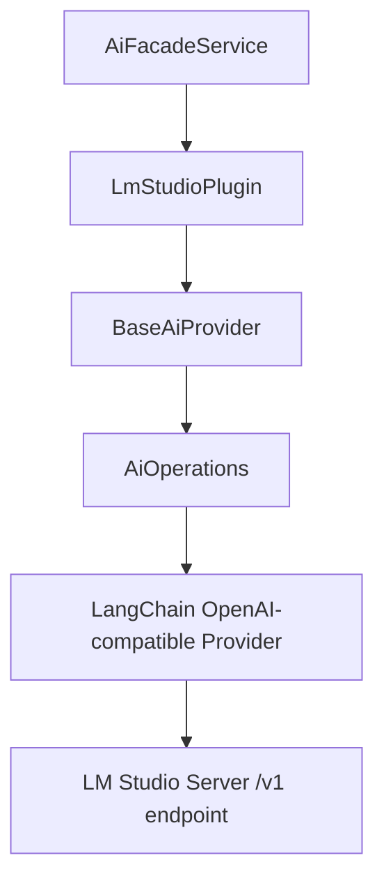

# LM Studio AI Provider Plugin

The LM Studio plugin connects Ever Works to a local or remote [LM Studio](https://lmstudio.ai) server for self-hosted AI inference. It extends `BaseAiProvider` and uses the shared `AiOperations` layer that wraps LangChain under the hood.

**Source:** `packages/plugins/lm-studio/src/lm-studio.plugin.ts`

## Overview

| Property           | Value           |
| ------------------ | --------------- |
| Plugin ID          | `lm-studio`     |
| Category           | `ai-provider`   |
| Capabilities       | `ai-provider`   |
| Version            | `1.0.0`         |
| Configuration Mode | `user-required` |
| Provider Type      | `lm-studio`     |
| Auto-enable        | No              |
| Built-in           | Yes             |
| Visibility         | `public`        |

LM Studio runs open-source models (Llama, Qwen, Mistral, Gemma, …) on your own machine and exposes them through an OpenAI-compatible API. Because the server is local, your data never leaves your infrastructure, and there are no per-token costs.

## Architecture



The plugin talks to LM Studio through its OpenAI-compatible `/v1` API endpoint, so any model loaded in LM Studio works without additional configuration.

## Configuration

### Settings Schema

| Setting        | Type     | Default     | Scope    | Description                                                       |
| -------------- | -------- | ----------- | -------- | ----------------------------------------------------------------- |
| `baseUrl`      | `string` | —           | `user`   | Address of the LM Studio server (e.g. `http://localhost:1234/v1`) |
| `apiKey`       | `string` | `lm-studio` | `user`   | Only needed if LM Studio is placed behind an auth proxy           |
| `defaultModel` | `string` | —           | `global` | Used for all AI tasks unless a tier-specific model is set         |
| `simpleModel`  | `string` | —           | `global` | Handles tags, short descriptions, and quick classifications       |
| `mediumModel`  | `string` | —           | `global` | Handles listings, summaries, and content reformatting             |
| `complexModel` | `string` | —           | `global` | Handles full page generation and multi-step analysis              |
| `temperature`  | `number` | `0.7`       | hidden   | Controls output randomness (0 = deterministic, 2 = creative)      |
| `maxTokens`    | `number` | `4096`      | hidden   | Maximum length of each AI-generated response                      |

Model fields use the `x-widget: model-select` extension, which renders a model dropdown in the dashboard UI populated by calling `listModels()` against the configured server. Unlike cloud providers, **the model fields ship without a hardcoded default** — LM Studio serves whatever model you have loaded, so you select it after the connection succeeds.

### Required Fields

- `baseUrl` — the LM Studio server address
- `defaultModel` — at least one model must be selected

## Model Capabilities

```typescript
getCapabilities(): AiModelCapabilities {
    return {
        supportsStructuredOutput: true,
        supportsStreaming: true,
        supportsToolCalling: true,
        supportsVision: true,
        maxContextLength: 128000
    };
}
```

These are advisory hints — actual support depends on the model you load in LM Studio.

## Lifecycle

### Loading

```typescript
async onLoad(context: PluginContext): Promise<void> {
    await super.onLoad(context);
    this.aiOps = new AiOperations({
        apiKey: 'lm-studio',
        model: this.getDefaultModelId(),
        baseURL: 'http://localhost:1234/v1',
        temperature: 0.7,
        maxTokens: 4096,
        providerType: 'lm-studio'
    });
}
```

On load the plugin creates an `AiOperations` instance with default values. When a request arrives, `resolveConfig()` merges the user's saved settings on top of these defaults before executing.

### Availability Check

`isAvailable()` calls `AiOperations.testConnection()` with the resolved configuration to verify the LM Studio server is reachable. The setup UI uses this (via `validateConnection()`) to detect connectivity before saving.

## Getting Started

1. Install LM Studio from [lmstudio.ai](https://lmstudio.ai) and download at least one model.
2. Start the **Local Server** in LM Studio (Developer tab) — it listens on `http://localhost:1234` by default.
3. Enable the LM Studio plugin in **Settings → Plugins**.
4. Set the **LM Studio Server URL** to your instance address (include the `/v1` suffix).
5. Select your preferred model for each task complexity tier.

## Troubleshooting

| Issue                    | Cause                        | Solution                                                         |
| ------------------------ | ---------------------------- | ---------------------------------------------------------------- |
| Plugin shows unavailable | Local server not started     | Open LM Studio → Developer → **Start Server**                    |
| No models in dropdown    | No model loaded              | Load a model in the LM Studio app                                |
| Connection refused       | Wrong base URL               | Verify the URL includes `/v1` (e.g., `http://localhost:1234/v1`) |
| Slow responses           | Model too large for hardware | Use a smaller / quantized model or increase available RAM/VRAM   |
