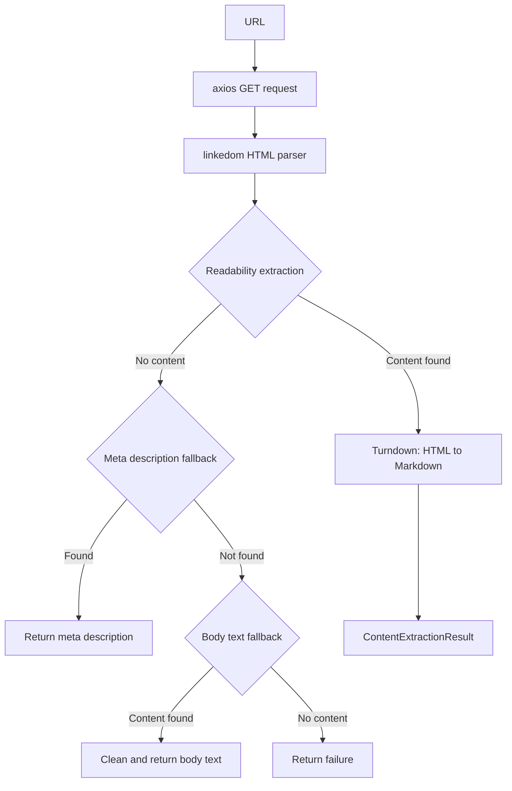

# Local Content Extractor Plugin

The Local Content Extractor is the default content extraction plugin for Ever Works. It extracts web page content locally using [Mozilla Readability](https://github.com/mozilla/readability) and [Turndown](https://github.com/mixmark-io/turndown), requiring no external API keys.

**Source:** `packages/plugins/local-content-extractor/src/local-content-extractor.plugin.ts`

## Overview

| Property           | Value                                                   |
| ------------------ | ------------------------------------------------------- |
| Plugin ID          | `local-content-extractor`                               |
| Category           | `content-extractor`                                     |
| Capabilities       | `content-extractor`                                     |
| Version            | `1.0.0`                                                 |
| Configuration Mode | (default)                                               |
| Auto-enable        | Yes                                                     |
| System plugin      | Yes                                                     |
| Default for        | `content-extractor` capability                          |
| Dependencies       | `axios`, `@mozilla/readability`, `linkedom`, `turndown` |

The plugin implements `IPlugin` and `IContentExtractorPlugin`. It is auto-enabled and serves as the default content extractor, providing a zero-configuration fallback that works without any external API keys.

## Architecture



### Three-Tier Extraction Strategy

The plugin uses a cascading approach to maximize extraction success:

1. **Readability** -- Mozilla's Readability algorithm extracts the main article content, stripping navigation, ads, and boilerplate. This produces the highest-quality output.
2. **Meta description fallback** -- If Readability finds insufficient content (below `minContentLength`), the plugin falls back to the page's `<meta name="description">` or `<meta property="og:description">` tags.
3. **Body text fallback** -- As a last resort, the plugin strips unwanted elements (scripts, styles, nav, sidebar, ads) and returns the cleaned body text.

## Configuration

### Settings Schema

| Setting            | Type     | Required | Default   | Description                                      |
| ------------------ | -------- | -------- | --------- | ------------------------------------------------ |
| `timeout`          | `number` | No       | `15000`   | HTTP request timeout in ms (1000--60000, hidden) |
| `minContentLength` | `number` | No       | `200`     | Min chars for valid content (0--10000, hidden)   |
| `userAgent`        | `string` | No       | Chrome UA | Custom user agent string (hidden)                |

All settings are hidden from the standard UI because the defaults work well for most use cases.

## Content Extraction

### Single URL Extraction

```typescript
async extract(options: ContentExtractionOptions): Promise<ContentExtractionResult>
```

The `extract()` method performs a full content extraction pipeline:

1. Fetches the URL with configurable timeout and user agent.
2. Validates the content type (only `text/html`, `text/plain`, `application/xhtml`).
3. Parses the HTML using `linkedom`.
4. Extracts metadata (title, description, author, dates, OG tags, Twitter cards).
5. Attempts Readability extraction.
6. Falls back through the three-tier strategy if needed.
7. Converts HTML to markdown using Turndown.
8. Extracts images and links if requested.

### Result Fields

| Field         | Description                                          |
| ------------- | ---------------------------------------------------- |
| `success`     | Whether extraction succeeded                         |
| `url`         | The requested URL                                    |
| `finalUrl`    | The resolved URL after redirects                     |
| `title`       | Page title (from article or metadata)                |
| `content`     | Extracted text content                               |
| `html`        | Extracted HTML content                               |
| `markdown`    | Content converted to markdown                        |
| `images`      | Array of extracted images with src, alt, dimensions  |
| `links`       | Array of extracted links with href, text, isExternal |
| `metadata`    | Full page metadata (OG, Twitter, canonical, favicon) |
| `wordCount`   | Number of words extracted                            |
| `readingTime` | Estimated reading time (words / 200)                 |

### Batch Extraction

```typescript
async extractBatch(
    urls: readonly string[],
    options?: Partial<ContentExtractionOptions>
): Promise<readonly ContentExtractionResult[]>
```

Processes URLs in batches of 5 with a 100ms delay between batches to avoid overwhelming target servers.

### Metadata Extraction

The plugin extracts comprehensive page metadata:

| Metadata Field                 | Sources Checked                                               |
| ------------------------------ | ------------------------------------------------------------- |
| `title`                        | `<title>` tag                                                 |
| `description`                  | `meta[name="description"]`, `meta[property="og:description"]` |
| `author`                       | `meta[name="author"]`, `meta[property="article:author"]`      |
| `publishedDate`                | `article:published_time`, `date`, `pubdate`                   |
| `language`                     | `<html lang="...">`                                           |
| `keywords`                     | `meta[name="keywords"]` (comma-separated)                     |
| `ogTitle` / `ogImage`          | Open Graph tags                                               |
| `twitterCard` / `twitterTitle` | Twitter Card tags                                             |
| `canonicalUrl`                 | `<link rel="canonical">`                                      |
| `favicon`                      | `<link rel="icon">` or `<link rel="shortcut icon">`           |

## Comparison with Other Content Extractors

| Feature              | Local Extractor          | Firecrawl | Jina    | Tavily |
| -------------------- | ------------------------ | --------- | ------- | ------ |
| API key required     | No                       | Yes       | Yes     | Yes    |
| JavaScript rendering | No                       | Yes       | Yes     | Yes    |
| Cost                 | Free                     | Paid      | Paid    | Paid   |
| Metadata extraction  | Full (OG, Twitter, etc.) | Partial   | Partial | None   |
| Image extraction     | Yes                      | Yes       | No      | No     |
| Link extraction      | Yes                      | Yes       | No      | No     |
| Batch support        | Yes (5 at a time)        | Yes       | Yes     | Yes    |
| Anti-bot bypass      | No                       | Yes       | Yes     | Yes    |

The Local Content Extractor is the best choice for cost-free extraction of static content. For JavaScript-heavy pages or sites with anti-bot protections, use a cloud-based extractor like Firecrawl or Jina.

## Unwanted Element Removal

When falling back to body text extraction, the plugin removes these elements:

```
script, style, noscript, iframe, header, footer, nav, aside,
.sidebar, .advertisement, .ad, .ads, .comments, .social-share,
[role="navigation"], [role="banner"], [role="complementary"]
```

## Getting Started

The Local Content Extractor is auto-enabled and requires no configuration. It works out of the box as the default content extraction provider.

To customize its behavior, adjust the hidden settings:

1. Navigate to the plugin settings page.
2. Modify `timeout`, `minContentLength`, or `userAgent` as needed.
3. The plugin will use the updated settings for all future extractions.

## Troubleshooting

| Issue                          | Cause                                       | Solution                                          |
| ------------------------------ | ------------------------------------------- | ------------------------------------------------- |
| "Unsupported content type"     | URL returns non-HTML content                | Use a specialized extractor (e.g., PDF Extractor) |
| "No extractable content found" | Page is JS-rendered or has minimal text     | Use Firecrawl or Jina for JS-heavy pages          |
| Timeout errors                 | Slow server or low timeout setting          | Increase the `timeout` setting                    |
| Missing images/links           | `includeImages`/`includeLinks` set to false | Ensure extraction options include these flags     |
| Redirect loops                 | Too many redirects                          | The plugin follows up to 5 redirects by default   |
