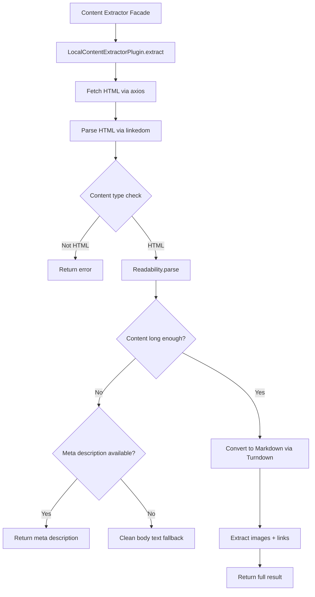

# Local Content Extractor Plugin

The Local Content Extractor is the default system plugin for extracting web page content. It uses Mozilla's Readability algorithm combined with Turndown for HTML-to-markdown conversion, providing content extraction without requiring any external API keys.

**Source:** `packages/plugins/local-content-extractor/src/local-content-extractor.plugin.ts`

## Overview

| Property           | Value                                                   |
| ------------------ | ------------------------------------------------------- |
| Plugin ID          | `local-content-extractor`                               |
| Category           | `content-extractor`                                     |
| Capabilities       | `content-extractor`                                     |
| Version            | `1.0.0`                                                 |
| Configuration Mode | Default                                                 |
| Auto-enable        | Yes                                                     |
| Built-in           | Yes                                                     |
| System Plugin      | Yes                                                     |
| Default For        | `content-extractor` capability                          |
| Dependencies       | `@mozilla/readability`, `axios`, `linkedom`, `turndown` |

The plugin implements `IPlugin` and `IContentExtractorPlugin`.

## Architecture



### Library Stack

| Library                | Purpose                                       |
| ---------------------- | --------------------------------------------- |
| `axios`                | HTTP client for fetching web pages            |
| `linkedom`             | Server-side HTML parser (lightweight DOM)     |
| `@mozilla/readability` | Extracts the main article content from a page |
| `turndown`             | Converts HTML to clean markdown               |

## Configuration

### Settings Schema

| Setting            | Type     | Default   | Description                                                   |
| ------------------ | -------- | --------- | ------------------------------------------------------------- |
| `timeout`          | `number` | `15000`   | HTTP request timeout in milliseconds (hidden)                 |
| `minContentLength` | `number` | `200`     | Minimum characters for Readability to accept content (hidden) |
| `userAgent`        | `string` | Chrome UA | Custom user agent string for HTTP requests (hidden)           |

All settings are marked as hidden (`x-hidden: true`) since they are internal tuning parameters that most users should not need to change.

## Features

### Three-Tier Content Extraction

The plugin uses a cascading extraction strategy:

1. **Readability article** -- the primary approach. Readability identifies and extracts the main article content, stripping navigation, ads, sidebars, and other non-content elements. If the extracted text meets the minimum content length, it is used.

2. **Meta description fallback** -- if Readability fails or returns too little content, the plugin falls back to the `<meta name="description">` or `<meta property="og:description">` tag, provided the description is longer than 50 characters.

3. **Cleaned body text** -- as a final fallback, the plugin strips unwanted elements (scripts, styles, navigation, headers, footers, sidebars, ads, comments) from the document body and returns the remaining text.

### Markdown Conversion

The Turndown service is configured with:

- **ATX headings** -- `# Heading` style instead of underline style
- **Fenced code blocks** -- triple backtick blocks with language detection
- **Custom code block rule** -- extracts language from CSS class names on `<code>` elements

### Rich Metadata Extraction

Each extraction result includes page metadata gathered from HTML meta tags:

- Title, description, author, keywords
- Open Graph (og:title, og:description, og:image, og:type)
- Twitter Card (twitter:card, twitter:title, twitter:image)
- Canonical URL, favicon, language
- Published date, modified date

### Image Extraction

When `includeImages` is not explicitly set to `false`, the plugin extracts images from the article content:

- `src` and `data-src` attributes are collected
- Relative URLs are resolved against the page URL
- Tiny Base64 data URIs (under 500 characters) are filtered out
- Alt text, title, width, and height are captured

### Link Extraction

When `includeLinks` is not explicitly set to `false`, the plugin extracts links from the article content:

- `javascript:` and `#` links are filtered out
- Relative URLs are resolved against the page URL
- Each link is tagged as internal or external based on the host
- Link text, title, and `rel` attributes are captured

### Batch Extraction

The `extractBatch()` method processes URLs in batches of 5 with concurrent requests using `Promise.all()`. A 100ms delay is inserted between batches to avoid overwhelming target servers.

### User Agent

The default user agent mimics a modern Chrome browser to maximize compatibility with web servers that block non-browser requests.

## Usage in Pipelines

The Local Content Extractor is the default content extraction plugin. It is used automatically during directory generation whenever the pipeline needs to retrieve and parse web page content. Since it requires no API key, it works out of the box.

Other content extraction plugins (Firecrawl, Scrapfly, Jina) can be enabled as alternatives when you need JavaScript rendering, anti-bot bypass, or other advanced features that the local extractor does not support.

## Limitations

- Does not execute JavaScript -- single-page applications and dynamically loaded content will not be extracted
- Cannot bypass anti-bot protections (CAPTCHAs, Cloudflare challenges)
- Limited to HTTP/HTTPS URLs
- Content type must be `text/html`, `text/plain`, or `application/xhtml`

## API Reference

### Class: `LocalContentExtractorPlugin`

```typescript
class LocalContentExtractorPlugin implements IPlugin, IContentExtractorPlugin {
	readonly id: 'local-content-extractor';
	readonly category: 'content-extractor';

	extract(options: ContentExtractionOptions): Promise<ContentExtractionResult>;
	extractBatch(
		urls: readonly string[],
		options?: Partial<ContentExtractionOptions>
	): Promise<readonly ContentExtractionResult[]>;
	canExtract(url: string): Promise<boolean>;
	getSupportedFormats(): readonly ('text' | 'html' | 'markdown')[];
}
```

### Key Interfaces

| Interface                  | Purpose                                                                   |
| -------------------------- | ------------------------------------------------------------------------- |
| `ContentExtractionOptions` | URL, settings, and flags for extraction                                   |
| `ContentExtractionResult`  | Extracted content with title, HTML, markdown, images, links, and metadata |
| `ExtractedImage`           | Image data: src, alt, title, dimensions                                   |
| `ExtractedLink`            | Link data: href, text, title, rel, isExternal                             |
| `PageMetadata`             | Open Graph, Twitter Card, author, dates, favicon, and more                |
