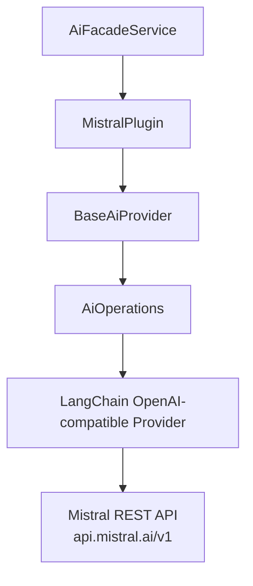
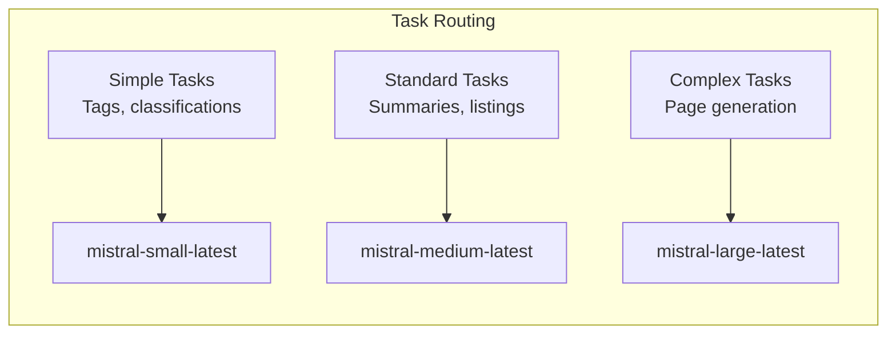
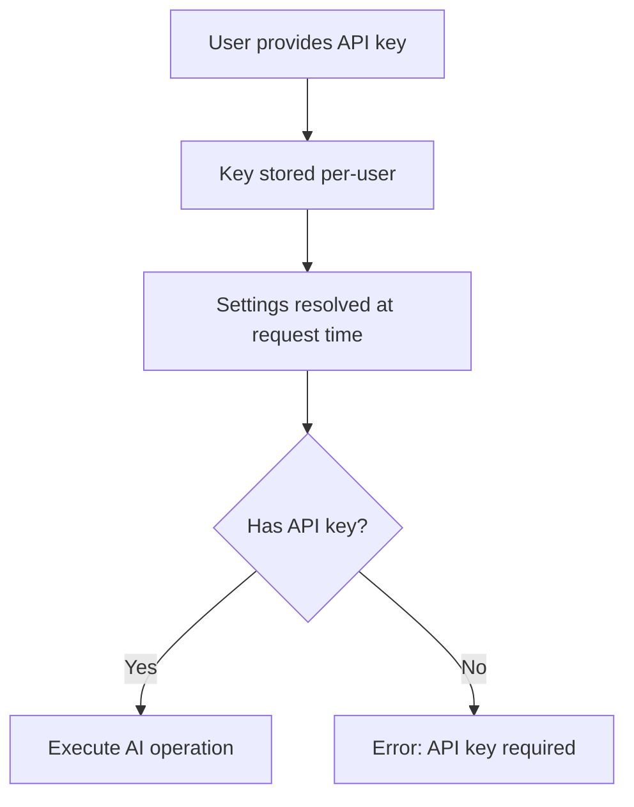
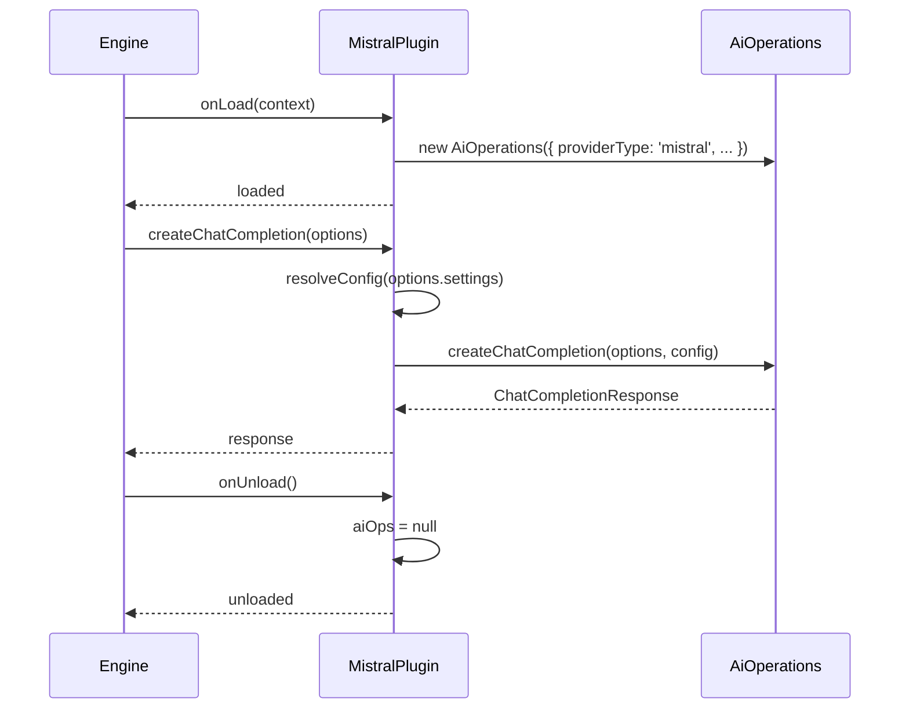

# Mistral AI Provider Plugin

The Mistral plugin connects Ever Works to Mistral AI's API, providing access to high-performance language models optimized for efficiency, speed, and multilingual tasks. It extends `BaseAiProvider` and uses the shared `AiOperations` layer that wraps LangChain under the hood.

**Source:** `packages/plugins/mistral/src/mistral.plugin.ts`

## Overview

| Property           | Value                        |
| ------------------ | ---------------------------- |
| Plugin ID          | `mistral`                    |
| Package            | `@ever-works/mistral-plugin` |
| Category           | `ai-provider`                |
| Capabilities       | `ai-provider`                |
| Version            | `1.0.0`                      |
| Configuration Mode | `user-required`              |
| Provider Type      | `mistral`                    |
| Auto-enable        | No                           |
| Built-in           | Yes                          |
| Visibility         | `public`                     |

The plugin extends `BaseAiProvider` from `@ever-works/plugin/abstract` and creates an `AiOperations` instance configured with `providerType: 'mistral'` to handle all AI operations through the unified LangChain-based abstraction.

## Architecture



Mistral's API is OpenAI-compatible, so the plugin uses the same LangChain OpenAI provider with a custom `baseURL` pointing to `https://api.mistral.ai/v1`.

## Configuration

### Settings Schema

| Setting        | Type     | Required | Default                     | Scope    | Widget         | Description                                                         |
| -------------- | -------- | -------- | --------------------------- | -------- | -------------- | ------------------------------------------------------------------- |
| `apiKey`       | `string` | Yes      | --                          | `user`   | --             | Mistral API key. Secret. Env: `PLUGIN_MISTRAL_API_KEY`              |
| `defaultModel` | `string` | Yes      | `mistral-small-latest`      | `global` | `model-select` | Default model for all AI tasks. Env: `PLUGIN_MISTRAL_DEFAULT_MODEL` |
| `simpleModel`  | `string` | No       | `mistral-small-latest`      | `global` | `model-select` | Model for tags, descriptions, classifications.                      |
| `mediumModel`  | `string` | No       | `mistral-medium-latest`     | `global` | `model-select` | Model for listings, summaries, reformatting.                        |
| `complexModel` | `string` | No       | `mistral-large-latest`      | `global` | `model-select` | Model for full page generation, multi-step analysis.                |
| `temperature`  | `number` | No       | `0.7`                       | --       | --             | Sampling temperature (0--2). Hidden.                                |
| `maxTokens`    | `number` | No       | `4096`                      | --       | --             | Max tokens per response. Hidden.                                    |
| `baseUrl`      | `string` | No       | `https://api.mistral.ai/v1` | --       | --             | API endpoint. Hidden. Env: `PLUGIN_MISTRAL_BASE_URL`                |

### Model Tiers

The plugin supports a tiered model system that maps task complexity to appropriate models:



| Tier     | Default Model           | Use Cases                                       |
| -------- | ----------------------- | ----------------------------------------------- |
| Simple   | `mistral-small-latest`  | Tags, short descriptions, quick classifications |
| Standard | `mistral-medium-latest` | Listings, summaries, content reformatting       |
| Complex  | `mistral-large-latest`  | Full page generation, multi-step analysis       |

### Environment Variables

| Variable                       | Description                            |
| ------------------------------ | -------------------------------------- |
| `PLUGIN_MISTRAL_API_KEY`       | Mistral API key (overrides UI setting) |
| `PLUGIN_MISTRAL_DEFAULT_MODEL` | Default model ID                       |
| `PLUGIN_MISTRAL_SIMPLE_MODEL`  | Simple tier model ID                   |
| `PLUGIN_MISTRAL_MEDIUM_MODEL`  | Medium tier model ID                   |
| `PLUGIN_MISTRAL_COMPLEX_MODEL` | Complex tier model ID                  |
| `PLUGIN_MISTRAL_BASE_URL`      | Custom API endpoint                    |

## Capabilities

The `getCapabilities()` method reports the following:

| Capability         | Supported      |
| ------------------ | -------------- |
| Structured Output  | Yes            |
| Streaming          | Yes            |
| Tool Calling       | Yes            |
| Vision             | Yes            |
| Max Context Length | 128,000 tokens |

### Supported Operations

```typescript
// Chat completion
const response = await mistralPlugin.createChatCompletion({
	messages: [{ role: 'user', content: 'Describe this restaurant' }],
	settings: { apiKey: 'your-key' }
});

// Streaming chat completion
for await (const chunk of mistralPlugin.createStreamingChatCompletion({
	messages: [{ role: 'user', content: 'Write a description' }],
	settings: { apiKey: 'your-key' }
})) {
	process.stdout.write(chunk.content ?? '');
}

// Embeddings
const embedding = await mistralPlugin.createEmbedding({
	input: 'semantic search text'
});

// Structured JSON output
const result = await mistralPlugin.askJson('Generate categories', {
	settings: { apiKey: 'your-key' }
});

// List available models
const models = await mistralPlugin.listModels({
	apiKey: 'your-key'
});
```

## Configuration Mode

The Mistral plugin uses `user-required` configuration mode, meaning each user must provide their own API key. There is no admin-level shared key option.



## Settings Resolution

When an AI operation is called, settings are resolved using the `resolveConfig` method:

```typescript
protected override resolveConfig(settings?: PluginSettings): Partial<AiOperationsConfig> {
    const s = settings ?? {};
    const config: Partial<AiOperationsConfig> = {};

    if (s.apiKey && typeof s.apiKey === 'string') {
        config.apiKey = s.apiKey;
    }
    if (s.baseUrl && typeof s.baseUrl === 'string') {
        config.baseURL = s.baseUrl;
    }
    if (typeof s.temperature === 'number') {
        config.temperature = s.temperature;
    }
    if (typeof s.maxTokens === 'number') {
        config.maxTokens = s.maxTokens;
    }
    return config;
}
```

The resolved config is passed to `AiOperations` as overrides, taking precedence over the defaults set during `onLoad`.

## Lifecycle



## Health Check

The plugin reports a simple health check that always returns `healthy` when the plugin class is instantiated:

```typescript
async healthCheck(): Promise<PluginHealthCheck> {
    return {
        status: 'healthy',
        message: 'Mistral plugin is ready',
        checkedAt: Date.now()
    };
}
```

To verify actual API connectivity, use `isAvailable()` with a valid API key, which calls `testConnection()` against the Mistral API.

## Dependencies

| Package              | Version   | Purpose                              |
| -------------------- | --------- | ------------------------------------ |
| `@ever-works/plugin` | workspace | Plugin contracts and base classes    |
| `@langchain/openai`  | ^0.6.17   | LangChain OpenAI-compatible provider |
| `@langchain/core`    | ^0.3.80   | LangChain core abstractions          |

## Getting Started

1. Create an account at [console.mistral.ai](https://console.mistral.ai)
2. Generate an API key from the Mistral console
3. Enable the Mistral plugin in the Ever Works plugin settings
4. Enter the API key in the **Mistral API Key** field
5. Select preferred models for each task complexity level
