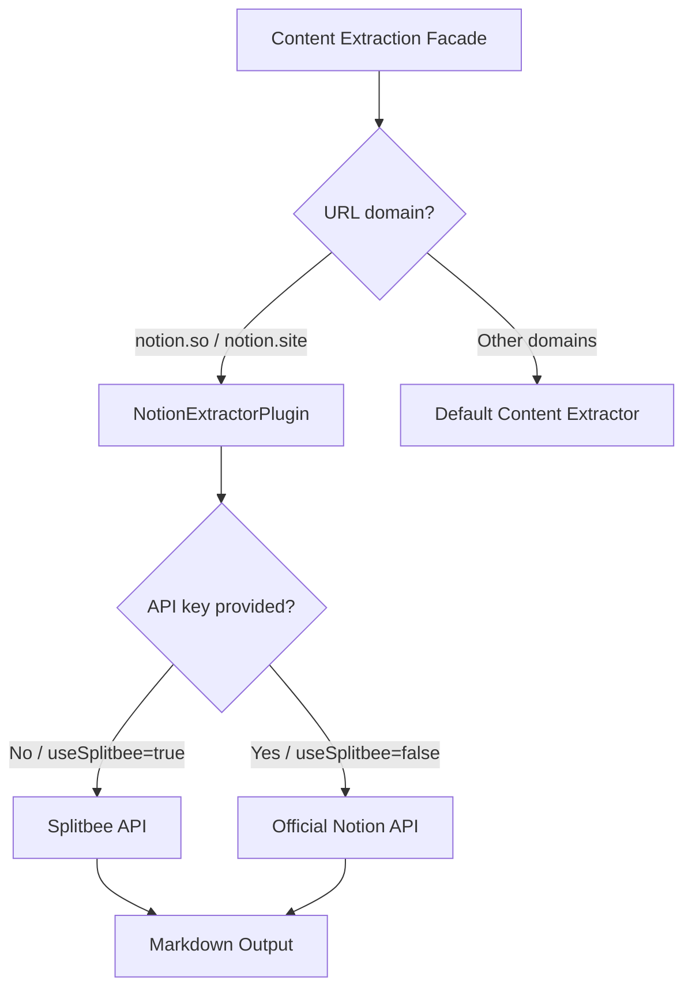
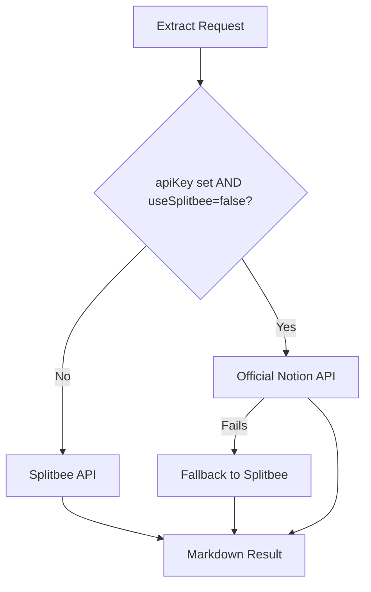
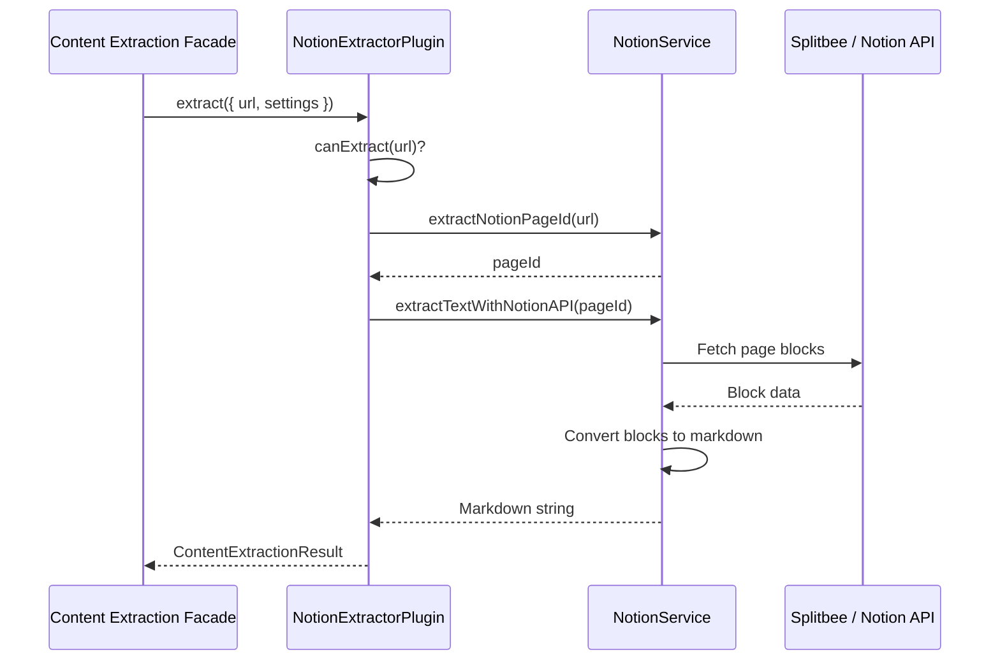
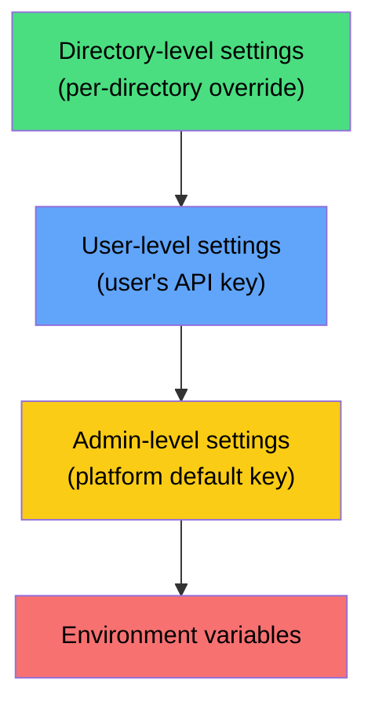

# Notion Page Extractor Plugin

The Notion Extractor plugin extracts content from Notion pages and converts it to clean markdown for use as source material during directory generation. It supports both public pages (via the free Splitbee API) and private pages (via the official Notion API).

**Source:** `packages/plugins/notion-extractor/src/notion-extractor.plugin.ts`

## Overview

| Property | Value |
|---|---|
| Plugin ID | `notion-extractor` |
| Category | `content-extractor` |
| Capabilities | `content-extractor` |
| Version | `1.0.0` |
| Built-in | No |
| System plugin | No |
| Supplementary | Yes |
| Auto-enable | No |

The plugin implements `IPlugin` and `IContentExtractorPlugin`. It is marked as `supplementary: true`, meaning it adds to the content extraction capability rather than replacing the default extractor.

## Architecture



### Additive Design

The plugin is explicitly additive -- it only handles Notion URLs and lets all other URLs fall through to the default content extractor. This is controlled by the `canExtract()` method:

```typescript
async canExtract(url: string): Promise<boolean> {
    const parsed = new URL(url);
    return /^([\w-]+\.)?notion\.(so|site)$/.test(parsed.hostname);
}
```

Accepted domains:
- `notion.so` and subdomains (e.g., `www.notion.so`)
- `notion.site` and subdomains (e.g., `myworkspace.notion.site`)

## Configuration

### Settings Schema

| Setting | Type | Default | Required | Description |
|---|---|---|---|---|
| `apiKey` | `string` | (empty) | No | Notion integration API key for private pages |
| `useSplitbeeForPublicPages` | `boolean` | `true` | No | Use the free Splitbee API for public pages |
| `timeout` | `number` | `30000` | No | HTTP request timeout in milliseconds (5000--120000) |

### Two Extraction Modes

| Mode | When Used | API Key Required | Cost |
|---|---|---|---|
| **Splitbee API** | Public pages when `useSplitbeeForPublicPages` is `true` (default) | No | Free |
| **Official Notion API** | Private pages, or when `useSplitbeeForPublicPages` is `false` | Yes | Free (Notion API) |

The extraction mode is selected automatically based on the settings:



If the official Notion API fails (e.g., page not shared with the integration), the plugin automatically falls back to the Splitbee API for public pages.

## Content Extraction

### Extraction Flow



### Supported Notion Block Types

The `NotionService` class (`notion-extractor/src/notion.ts`) converts Notion blocks to markdown. Supported block types include:

| Block Type | Markdown Output |
|---|---|
| Page title | `# Title` |
| Heading 1 | `## Heading` |
| Heading 2 | `### Heading` |
| Heading 3 | `#### Heading` |
| Paragraph / Text | Plain text with formatting |
| Bulleted list | `- Item` |
| Numbered list | `1. Item` |
| To-do | `- [ ] Task` or `- [x] Task` |
| Code block | Fenced code block with language |
| Quote | `> Quoted text` |
| Callout | `> Callout text` |
| Divider | `---` |
| Toggle | Heading with nested content |
| Bookmark | `[URL](URL)` |
| Image | `` |
| Embed | Embed URL reference |
| Collection view | Table markdown |

### Rich Text Formatting

The service preserves inline formatting:

| Notion Format | Markdown |
|---|---|
| Bold | `**text**` |
| Italic | `*text*` |
| Strikethrough | `~~text~~` |
| Code | `` `text` `` |
| Link | `[text](url)` |

### Extraction Result

| Field | Type | Description |
|---|---|---|
| `success` | `boolean` | Whether extraction succeeded |
| `url` | `string` | The original Notion URL |
| `title` | `string` | Page title extracted from the first `#` heading |
| `content` | `string` | Extracted text content |
| `markdown` | `string` | Content in markdown format |
| `wordCount` | `number` | Number of words extracted |
| `readingTime` | `number` | Estimated reading time in minutes (200 wpm) |
| `duration` | `number` | Extraction time in milliseconds |

### Batch Extraction

```typescript
async extractBatch(
    urls: readonly string[],
    options?: Partial<ContentExtractionOptions>
): Promise<readonly ContentExtractionResult[]>
```

Batch extraction processes URLs sequentially with a 200ms delay between requests to avoid rate limiting. Each URL is processed independently, so a failure on one URL does not affect others.

## Settings Resolution

Settings are resolved through the standard 4-level plugin settings hierarchy:



A user might set their own Notion API key at the user level, while the admin provides a default key at the admin level. Directory-level overrides allow per-directory API keys if needed.

## How It Works in the Pipeline

When a directory's source URLs include Notion pages, the content extraction facade delegates to this plugin:

1. The facade calls `canExtract(url)` for each source URL.
2. For Notion URLs, the facade calls `extract({ url, settings })`.
3. The extracted markdown is passed to the AI for content generation.
4. Non-Notion URLs continue to use the default content extractor.

## Getting Started

1. Enable the Notion Extractor plugin in **Settings > Plugins**.
2. For public pages, no additional configuration is needed.
3. For private pages:
   a. Create a Notion integration at [notion.so/my-integrations](https://www.notion.so/my-integrations).
   b. Share the target Notion pages with your integration.
   c. Enter the integration API key in the plugin settings.
4. Add Notion page URLs as source material when generating your directory.

## Troubleshooting

| Issue | Cause | Solution |
|---|---|---|
| "Not a Notion URL" | URL is not from notion.so or notion.site | Verify the URL domain |
| "Could not extract page ID" | Malformed Notion URL | Use a standard Notion page URL |
| Empty content from public page | Splitbee API issue or page not public | Verify the page is published and try again |
| "Unauthorized" from Notion API | Integration not connected to page | Share the page with your Notion integration |
| Timeout on large pages | Page has too many blocks | Increase the timeout setting or extract a subpage |
| Missing formatting | Unsupported Notion block type | Check the supported block types list above |
