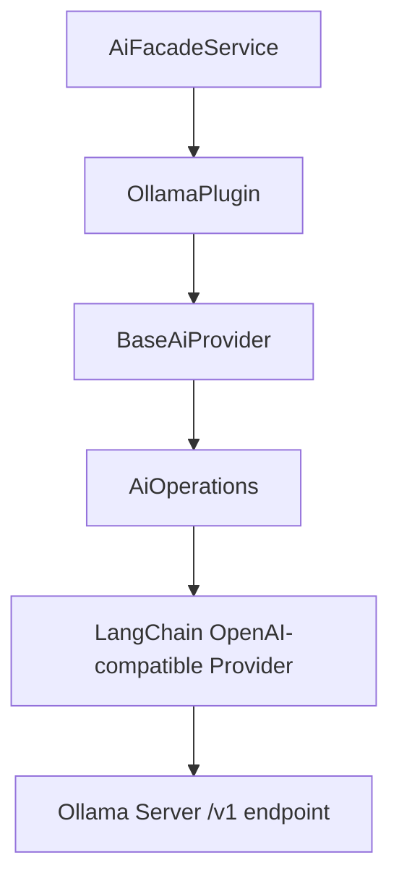
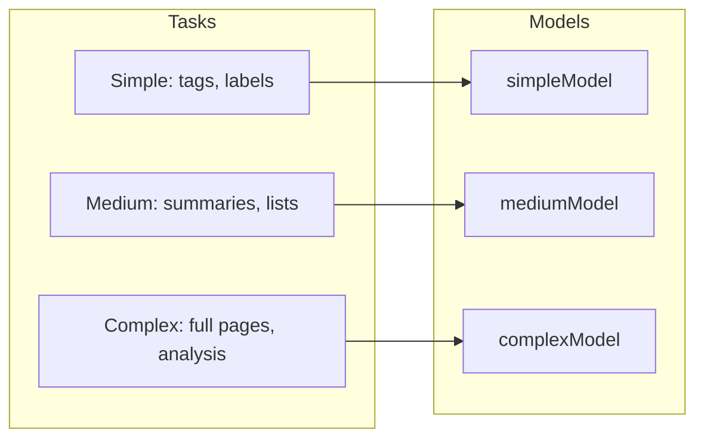

# Ollama AI Provider Plugin

The Ollama plugin connects Ever Works to a local or remote [Ollama](https://ollama.com) server for self-hosted AI inference. It extends `BaseAiProvider` and uses the shared `AiOperations` layer that wraps LangChain under the hood.

**Source:** `packages/plugins/ollama/src/ollama.plugin.ts`

## Overview

| Property           | Value           |
| ------------------ | --------------- |
| Plugin ID          | `ollama`        |
| Category           | `ai-provider`   |
| Capabilities       | `ai-provider`   |
| Version            | `1.0.0`         |
| Configuration Mode | `user-required` |
| Provider Type      | `ollama`        |
| Auto-enable        | No              |
| Built-in           | Yes             |
| Visibility         | `public`        |

The plugin extends `BaseAiProvider` from `@ever-works/plugin/abstract` and creates an `AiOperations` instance from `@ever-works/plugin/ai` to handle all AI operations through a unified LangChain-based abstraction. Unlike cloud-hosted providers, Ollama typically does not require an API key.

## Architecture



The plugin talks to Ollama through its OpenAI-compatible `/v1` API endpoint. This means any model served by Ollama that exposes this endpoint works without additional configuration.

## Configuration

### Settings Schema

| Setting        | Type     | Default                     | Scope    | Description                                                  |
| -------------- | -------- | --------------------------- | -------- | ------------------------------------------------------------ |
| `baseUrl`      | `string` | `http://localhost:11434/v1` | `user`   | Address of the Ollama instance                               |
| `apiKey`       | `string` | `ollama`                    | `user`   | Only needed for secured Ollama instances                     |
| `defaultModel` | `string` | `ministral-3:8b`            | `global` | Used for all AI tasks unless a tier-specific model is set    |
| `simpleModel`  | `string` | `ministral-3:8b`            | `global` | Handles tags, short descriptions, and quick classifications  |
| `mediumModel`  | `string` | `ministral-3:8b`            | `global` | Handles listings, summaries, and content reformatting        |
| `complexModel` | `string` | `ministral-3:8b`            | `global` | Handles full page generation and multi-step analysis         |
| `temperature`  | `number` | `0.7`                       | hidden   | Controls output randomness (0 = deterministic, 2 = creative) |
| `maxTokens`    | `number` | `4096`                      | hidden   | Maximum length of each AI-generated response                 |

Model fields use the `x-widget: model-select` extension, which renders the model-select dropdown in the dashboard UI. The dropdown is populated by calling `listModels()` against the configured Ollama instance.

### Required Fields

- `baseUrl` -- the Ollama server address
- `defaultModel` -- at least one model must be selected

### Schema Extensions

```json
{
	"defaultModel": {
		"type": "string",
		"title": "Default Model",
		"default": "ministral-3:8b",
		"x-widget": "model-select",
		"x-scope": "global"
	}
}
```

The `x-scope: global` extension means model selection applies platform-wide rather than per-user. The `x-hidden: true` extension on `temperature` and `maxTokens` keeps those fields out of the standard settings UI.

## Model Capabilities

```typescript
getCapabilities(): AiModelCapabilities {
    return {
        supportsStructuredOutput: true,
        supportsStreaming: true,
        supportsToolCalling: true,
        supportsVision: true,
        maxContextLength: 128000
    };
}
```

| Capability                    | Supported      |
| ----------------------------- | -------------- |
| Structured output (JSON mode) | Yes            |
| Streaming responses           | Yes            |
| Tool calling                  | Yes            |
| Vision (image input)          | Yes            |
| Embeddings                    | Yes            |
| Max context length            | 128,000 tokens |

Ollama supports embeddings through models such as `nomic-embed-text`. The `createEmbedding()` method delegates to `AiOperations.createEmbedding()`.

## Tiered Model Assignment

Ever Works uses a three-tier model system to balance speed and quality during directory generation:



| Tier    | Use Cases                                 | Recommended Models              |
| ------- | ----------------------------------------- | ------------------------------- |
| Simple  | Tags, short descriptions, classifications | `ministral-3:8b`, `gemma2:2b`   |
| Medium  | Listings, summaries, content reformatting | `ministral-3:8b`, `llama3.1:8b` |
| Complex | Full page generation, multi-step analysis | `llama3.1:70b`, `mistral-large` |

If a tier-specific model is not set, the `defaultModel` is used for all tiers.

## Lifecycle

### Loading

```typescript
async onLoad(context: PluginContext): Promise<void> {
    await super.onLoad(context);
    this.aiOps = new AiOperations({
        apiKey: 'ollama',
        model: 'ministral-3:8b',
        baseURL: 'http://localhost:11434/v1',
        temperature: 0.7,
        maxTokens: 4096,
        providerType: 'ollama'
    });
}
```

On load, the plugin creates an `AiOperations` instance with default values. When a request arrives, `resolveConfig()` merges the user's saved settings on top of these defaults before executing.

### Availability Check

The `isAvailable()` method calls `AiOperations.testConnection()` with the resolved configuration to verify the Ollama server is reachable and responding.

## API Methods

| Method                                   | Description                                    |
| ---------------------------------------- | ---------------------------------------------- |
| `createChatCompletion(options)`          | Single chat completion request                 |
| `createStreamingChatCompletion(options)` | Streaming chat completion (async generator)    |
| `createEmbedding(options)`               | Generate text embeddings                       |
| `listModels(settings)`                   | List available models from the Ollama instance |
| `isAvailable(settings)`                  | Test connection to the Ollama server           |
| `getCapabilities()`                      | Return supported capabilities                  |
| `healthCheck()`                          | Return plugin health status                    |

## Getting Started

1. Install and run Ollama from [ollama.com](https://ollama.com) or connect to an existing instance.
2. Pull at least one model: `ollama pull ministral-3:8b`.
3. Enable the Ollama plugin in the Ever Works dashboard under **Settings > Plugins**.
4. Set the **Ollama Server URL** to your instance address (defaults to `http://localhost:11434/v1`).
5. Select your preferred models for each task complexity tier.
6. Ollama will be used automatically during directory generation and AI conversations.

## Troubleshooting

| Issue                    | Cause                             | Solution                                                          |
| ------------------------ | --------------------------------- | ----------------------------------------------------------------- |
| Plugin shows unavailable | Ollama server not running         | Start Ollama with `ollama serve`                                  |
| No models in dropdown    | No models pulled                  | Run `ollama pull <model-name>`                                    |
| Connection refused       | Wrong base URL                    | Verify the URL includes `/v1` (e.g., `http://localhost:11434/v1`) |
| Slow responses           | Model too large for hardware      | Use a smaller model or increase available RAM/VRAM                |
| Embedding errors         | Model does not support embeddings | Switch to an embedding model like `nomic-embed-text`              |
