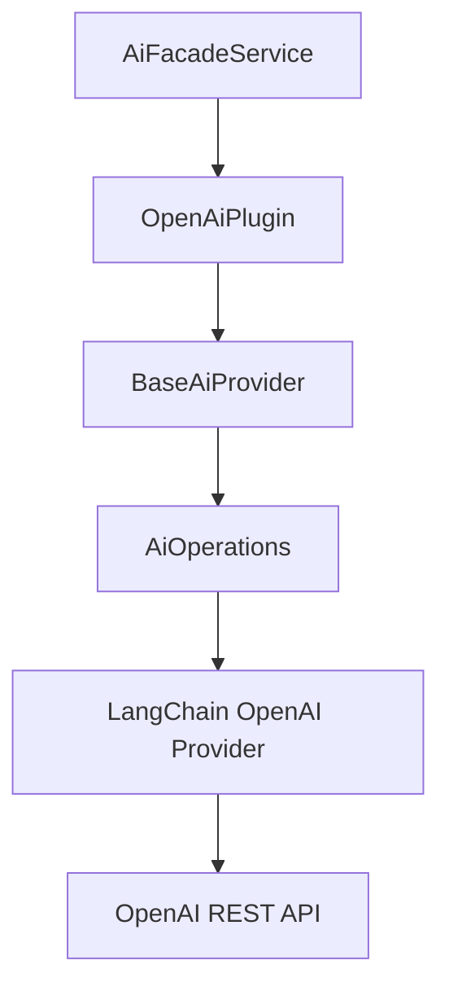
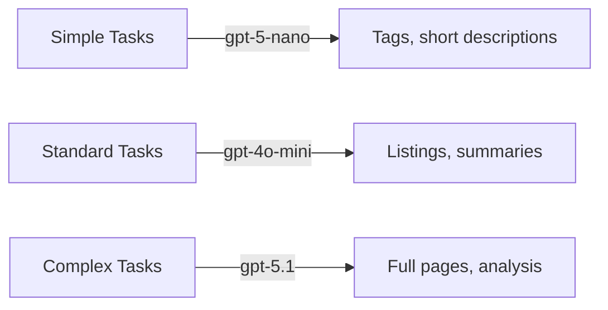
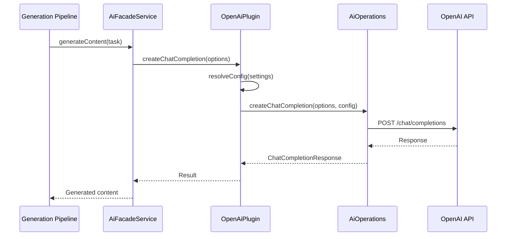

# OpenAI AI Provider Plugin

The OpenAI plugin connects Ever Works to OpenAI's API, providing access to models such as GPT-4o, GPT-4o mini, and text-embedding models. It extends `BaseAiProvider` and uses the shared `AiOperations` layer that wraps LangChain under the hood.

**Source:** `packages/plugins/openai/src/openai.plugin.ts`

## Overview

| Property           | Value           |
| ------------------ | --------------- |
| Plugin ID          | `openai`        |
| Category           | `ai-provider`   |
| Capabilities       | `ai-provider`   |
| Version            | `1.0.0`         |
| Configuration Mode | `user-required` |
| Provider Type      | `openai`        |
| Auto-enable        | No              |
| Visibility         | `public`        |

The plugin extends `BaseAiProvider` from `@ever-works/plugin/abstract` and creates an `AiOperations` instance from `@ever-works/plugin/ai` to handle all AI operations through a unified LangChain-based abstraction.

## Architecture



## Configuration

### Settings Schema

| Setting        | Type     | Required | Default                     | Scope    | Widget         | Description                                          |
| -------------- | -------- | -------- | --------------------------- | -------- | -------------- | ---------------------------------------------------- |
| `apiKey`       | `string` | Yes      | --                          | `user`   | --             | OpenAI API key. Secret.                              |
| `defaultModel` | `string` | Yes      | `gpt-5.1`                   | `global` | `model-select` | Default model for all AI tasks.                      |
| `simpleModel`  | `string` | No       | `gpt-5-nano`                | `global` | `model-select` | Model for tags, descriptions, classifications.       |
| `mediumModel`  | `string` | No       | `gpt-4o-mini`               | `global` | `model-select` | Model for listings, summaries, reformatting.         |
| `complexModel` | `string` | No       | `gpt-5.1`                   | `global` | `model-select` | Model for full page generation, multi-step analysis. |
| `temperature`  | `number` | No       | `0.7`                       | --       | --             | Sampling temperature (0--2). Hidden.                 |
| `maxTokens`    | `number` | No       | `4096`                      | --       | --             | Max tokens per response. Hidden.                     |
| `baseUrl`      | `string` | No       | `https://api.openai.com/v1` | --       | --             | API endpoint. Hidden.                                |

### Model Tiers

The plugin supports a tiered model system that maps task complexity to appropriate models:



This allows cost optimization: fast, inexpensive models handle simple classification tasks while more capable models are reserved for complex generation.

## Capabilities

```typescript
getCapabilities(): AiModelCapabilities {
  return {
    supportsStructuredOutput: true,
    supportsStreaming: true,
    supportsToolCalling: true,
    supportsVision: true,
    maxContextLength: 128000
  };
}
```

| Capability        | Supported | Description                                        |
| ----------------- | --------- | -------------------------------------------------- |
| Structured Output | Yes       | JSON mode and function calling for typed responses |
| Streaming         | Yes       | Server-sent events for real-time token delivery    |
| Tool Calling      | Yes       | Function calling for agent-based workflows         |
| Vision            | Yes       | Image understanding (GPT-4o and later models)      |
| Max Context       | 128,000   | Maximum tokens in a single context window          |

## Core Methods

### Chat Completion

```typescript
async createChatCompletion(options: ChatCompletionOptions): Promise<ChatCompletionResponse>
```

Processes a chat completion request through the `AiOperations` layer. The `resolveConfig()` method (inherited from `BaseAiProvider`) merges user settings with defaults to produce the final configuration.

### Streaming Chat Completion

```typescript
async *createStreamingChatCompletion(options: ChatCompletionOptions): AsyncIterable<ChatCompletionChunk>
```

Returns an async iterable of `ChatCompletionChunk` objects for real-time token streaming. Used by the conversational AI assistant for responsive interactions.

### Embeddings

```typescript
async createEmbedding(options: EmbeddingOptions): Promise<EmbeddingResponse>
```

Generates vector embeddings using OpenAI's embedding models (e.g., `text-embedding-3-small`). Used for semantic search within works.

### Model Listing

```typescript
async listModels(settings?: PluginSettings): Promise<readonly AiModel[]>
```

Fetches available models from the OpenAI API. The CLI and web dashboard use this to populate model selection dropdowns.

### Availability Check

```typescript
async isAvailable(settings?: PluginSettings): Promise<boolean>
```

Tests the API connection by calling `aiOps.testConnection()` with the resolved configuration.

## Configuration Resolution

The `resolveConfig()` method (from `BaseAiProvider`) merges settings into a final configuration:

```typescript
// Conceptual flow
const resolvedConfig = {
	apiKey: settings.apiKey,
	model: options.model || settings.defaultModel || 'gpt-5-nano',
	temperature: settings.temperature || 0.7,
	maxTokens: settings.maxTokens || 4096,
	baseURL: settings.baseUrl || 'https://api.openai.com/v1',
	providerType: 'openai'
};
```

The tier-specific models (`simpleModel`, `mediumModel`, `complexModel`) are used by the generation pipeline to select the appropriate model based on task complexity.

## Lifecycle

| Method            | Behavior                                                                     |
| ----------------- | ---------------------------------------------------------------------------- |
| `onLoad(context)` | Calls `super.onLoad()`, creates `AiOperations` instance with default config. |
| `onUnload()`      | Sets `aiOps` to `null`, calls `super.onUnload()`.                            |
| `healthCheck()`   | Returns `healthy` (actual connectivity depends on API key).                  |

### Initial AiOperations Configuration

On load, the plugin creates an `AiOperations` instance with placeholder values:

```typescript
this.aiOps = new AiOperations({
	apiKey: '', // Provided per-request from user settings
	model: 'gpt-5-nano',
	temperature: 0.7,
	baseURL: 'https://api.openai.com/v1',
	maxTokens: 4096,
	providerType: 'openai'
});
```

The actual API key and model selection come from user settings at call time through `resolveConfig()`.

## Error Handling

- Plugin not loaded: Throws `Error('OpenAI plugin not loaded')` if called before `onLoad()`.
- API errors: Propagated from `AiOperations` / LangChain to the caller.
- Connection test failure: `isAvailable()` returns `false`.

## Usage in the Platform

When OpenAI is selected as the AI provider:

1. **Content generation** -- Produces work item descriptions, summaries, and metadata during generation.
2. **Conversational AI** -- Powers the chat assistant in the web dashboard.
3. **Embeddings** -- Creates vector representations for semantic search.
4. **Structured extraction** -- Uses function calling to extract structured data from web content.



## Comparison with Other AI Providers

| Feature       | OpenAI      | Anthropic         |
| ------------- | ----------- | ----------------- |
| Max Context   | 128K tokens | 200K tokens       |
| Embeddings    | Yes         | No                |
| Streaming     | Yes         | Yes               |
| Tool Calling  | Yes         | Yes               |
| Vision        | Yes         | Yes               |
| Default Model | gpt-5.1     | claude-sonnet-4-5 |
