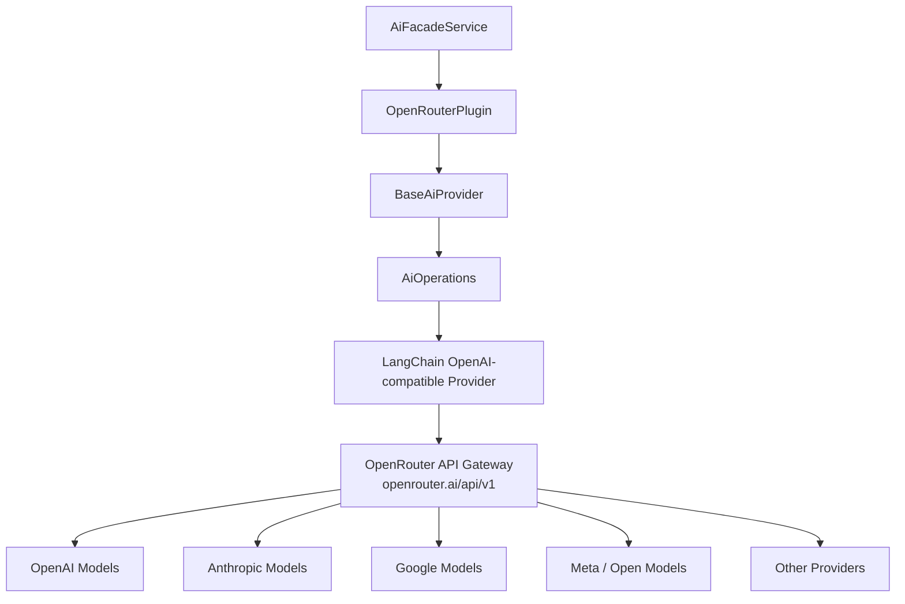
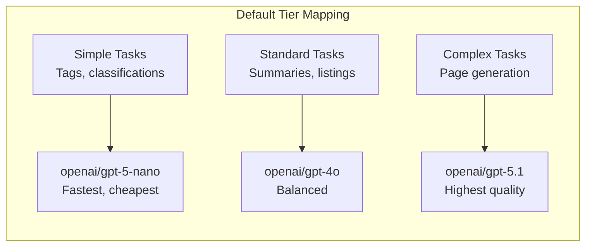
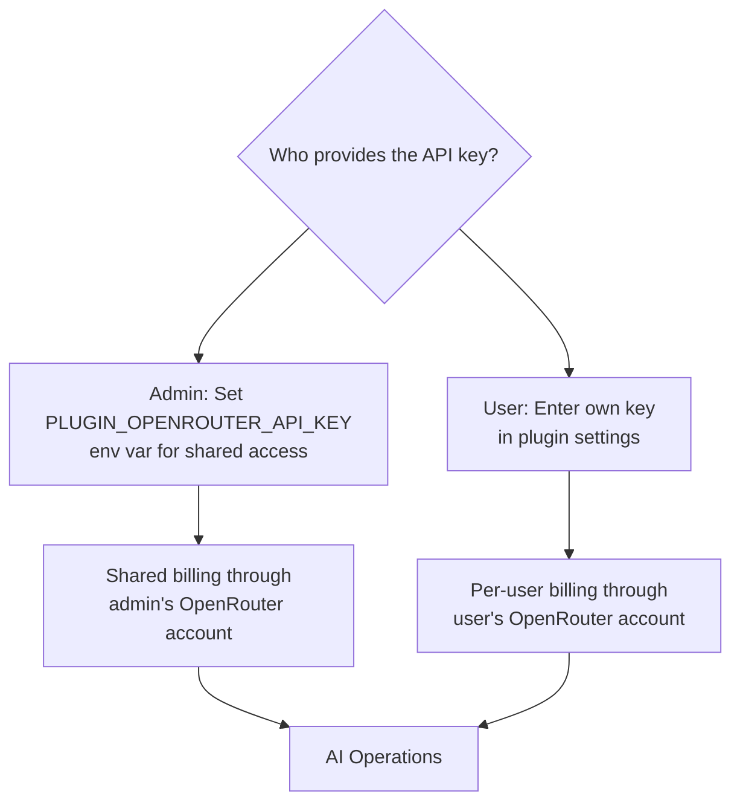
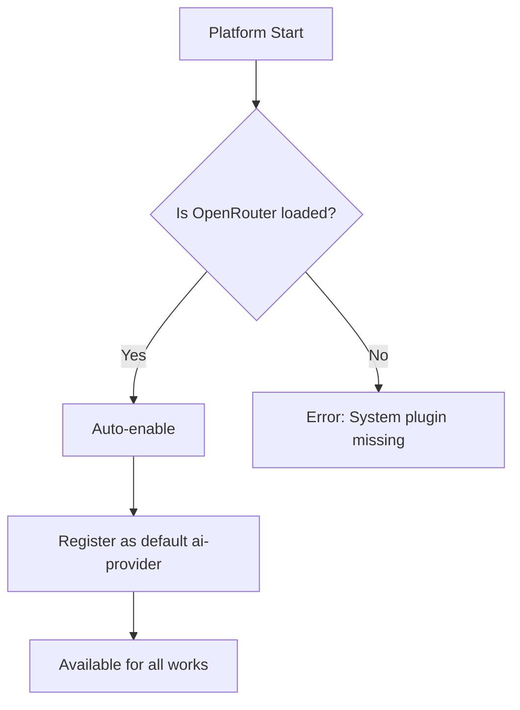
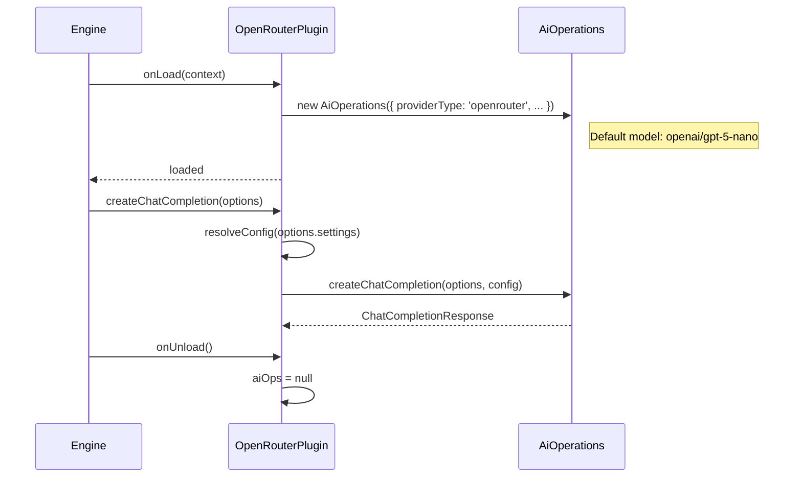

# OpenRouter AI Provider Plugin

The OpenRouter plugin is the **default AI provider** for Ever Works. It connects to the OpenRouter API, which aggregates hundreds of AI models from multiple providers (OpenAI, Anthropic, Google, Meta, and more) behind a single API endpoint. This gives users access to the broadest model selection through one API key.

**Source:** `packages/plugins/openrouter/src/openrouter.plugin.ts`

## Overview

| Property           | Value                           |
| ------------------ | ------------------------------- |
| Plugin ID          | `openrouter`                    |
| Package            | `@ever-works/openrouter-plugin` |
| Category           | `ai-provider`                   |
| Capabilities       | `ai-provider`                   |
| Version            | `1.0.0`                         |
| Configuration Mode | `hybrid`                        |
| Provider Type      | `openrouter`                    |
| Auto-enable        | **Yes**                         |
| Built-in           | Yes                             |
| System Plugin      | **Yes**                         |
| Default For        | `ai-provider`                   |
| Visibility         | `public`                        |

OpenRouter is unique among AI provider plugins because it is a **system plugin** with `autoEnable: true` and `defaultForCapabilities: ['ai-provider']`. This means it is automatically enabled and selected as the default AI provider for new works.

## Architecture

OpenRouter's API is OpenAI-compatible, so the plugin uses the same LangChain OpenAI provider with `baseURL` set to `https://openrouter.ai/api/v1`.

## Configuration

### Settings Schema

| Setting        | Type     | Required | Default                        | Scope    | Widget         | Description                                                  |
| -------------- | -------- | -------- | ------------------------------ | -------- | -------------- | ------------------------------------------------------------ |
| `apiKey`       | `string` | Yes      | --                             | `user`   | --             | OpenRouter API key. Secret. Env: `PLUGIN_OPENROUTER_API_KEY` |
| `defaultModel` | `string` | Yes      | `openai/gpt-5.1`               | `global` | `model-select` | Default model for all AI tasks.                              |
| `simpleModel`  | `string` | No       | `openai/gpt-5-nano`            | `global` | `model-select` | Model for tags, descriptions, classifications.               |
| `mediumModel`  | `string` | No       | `openai/gpt-4o`                | `global` | `model-select` | Model for listings, summaries, reformatting.                 |
| `complexModel` | `string` | No       | `openai/gpt-5.1`               | `global` | `model-select` | Model for full page generation, multi-step analysis.         |
| `temperature`  | `number` | No       | `0.7`                          | --       | --             | Sampling temperature (0--2). Hidden.                         |
| `maxTokens`    | `number` | No       | `4096`                         | --       | --             | Max tokens per response. Hidden.                             |
| `baseUrl`      | `string` | No       | `https://openrouter.ai/api/v1` | --       | --             | API endpoint. Hidden.                                        |

### Model Naming Convention

OpenRouter uses a `provider/model` naming convention. Model IDs include the provider prefix:

| Provider  | Example Model IDs                                         |
| --------- | --------------------------------------------------------- |
| OpenAI    | `openai/gpt-5.1`, `openai/gpt-4o`, `openai/gpt-5-nano`    |
| Anthropic | `anthropic/claude-sonnet-4`, `anthropic/claude-haiku-3.5` |
| Google    | `google/gemini-2.5-pro`, `google/gemini-2.5-flash`        |
| Meta      | `meta-llama/llama-4-scout`, `meta-llama/llama-4-maverick` |

### Model Tiers

Users can mix and match models from different providers across tiers. For example, using `anthropic/claude-haiku-3.5` for simple tasks and `google/gemini-2.5-pro` for complex tasks.

### Environment Variables

| Variable                          | Description           |
| --------------------------------- | --------------------- |
| `PLUGIN_OPENROUTER_API_KEY`       | OpenRouter API key    |
| `PLUGIN_OPENROUTER_DEFAULT_MODEL` | Default model ID      |
| `PLUGIN_OPENROUTER_SIMPLE_MODEL`  | Simple tier model ID  |
| `PLUGIN_OPENROUTER_MEDIUM_MODEL`  | Medium tier model ID  |
| `PLUGIN_OPENROUTER_COMPLEX_MODEL` | Complex tier model ID |
| `PLUGIN_OPENROUTER_BASE_URL`      | Custom API endpoint   |

## Capabilities

| Capability         | Supported                      |
| ------------------ | ------------------------------ |
| Structured Output  | Yes                            |
| Streaming          | Yes                            |
| Tool Calling       | Yes                            |
| Vision             | No (depends on selected model) |
| Max Context Length | 128,000 tokens                 |

:::note
Vision support depends on the specific model selected. While the plugin reports `supportsVision: false` at the plugin level, individual models accessed through OpenRouter (such as GPT-4o or Claude Sonnet) do support vision. The capability is determined at the model level, not the provider level.
:::

## Configuration Mode: Hybrid

OpenRouter uses `hybrid` configuration mode, which offers the most flexibility:

- **Admin-managed**: Set `PLUGIN_OPENROUTER_API_KEY` as an environment variable. All users share this key and billing is centralized.
- **User-managed**: Each user enters their own API key. Billing is distributed to individual OpenRouter accounts.
- **Override**: If both admin and user keys exist, the user's key takes precedence (per the settings resolution hierarchy).

## System Plugin Behavior

As a system plugin, OpenRouter has special behavior:

1. **Auto-enabled**: Automatically activated when the platform starts
2. **Default provider**: Registered as the default for `ai-provider` capability
3. **Fallback**: Other AI providers (OpenAI, Anthropic, etc.) are optional alternatives
4. **Cannot be removed**: System plugins cannot be uninstalled, only disabled

## Cost Optimization Strategy

Because OpenRouter provides access to models at different price points, the tiered model system enables cost optimization:

| Tier     | Recommended Strategy           | Example Models                                 |
| -------- | ------------------------------ | ---------------------------------------------- |
| Simple   | Use the cheapest/fastest model | `openai/gpt-5-nano`, `google/gemini-2.0-flash` |
| Standard | Balance cost and quality       | `openai/gpt-4o`, `anthropic/claude-haiku-3.5`  |
| Complex  | Use the highest quality model  | `openai/gpt-5.1`, `anthropic/claude-sonnet-4`  |

## Lifecycle

## Dependencies

| Package              | Version   | Purpose                              |
| -------------------- | --------- | ------------------------------------ |
| `@ever-works/plugin` | workspace | Plugin contracts and base classes    |
| `@langchain/openai`  | ^0.6.17   | LangChain OpenAI-compatible provider |
| `@langchain/core`    | ^0.3.80   | LangChain core abstractions          |

## Getting Started

1. Create an account at [openrouter.ai](https://openrouter.ai)
2. Generate an API key from the OpenRouter dashboard
3. Enter the key in the **OpenRouter API Key** field in plugin settings
4. Select your preferred models for each task complexity level
5. OpenRouter is enabled by default -- no additional activation needed
