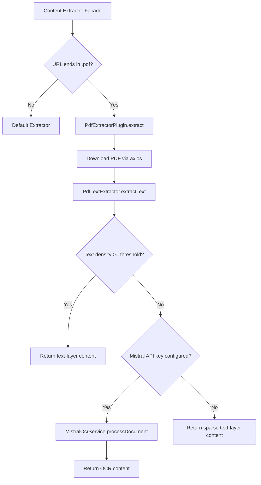

# PDF Extractor Plugin

The PDF Extractor plugin extracts text content from PDF files and converts it to clean markdown. It uses a hybrid approach: fast text-layer extraction for text-based PDFs, with optional OCR fallback via Mistral AI for scanned or image-based documents.

**Source:** `packages/plugins/pdf-extractor/src/pdf-extractor.plugin.ts`

## Overview

| Property           | Value               |
| ------------------ | ------------------- |
| Plugin ID          | `pdf-extractor`     |
| Category           | `content-extractor` |
| Capabilities       | `content-extractor` |
| Version            | `1.0.0`             |
| Configuration Mode | Default             |
| Auto-enable        | No                  |
| Built-in           | Yes                 |
| System Plugin      | No                  |
| Supplementary      | Yes                 |
| Dependencies       | `unpdf`, `axios`    |

The plugin implements `IPlugin` and `IContentExtractorPlugin`. It acts as a supplementary content extractor -- the content extractor facade delegates to it only when a URL points to a `.pdf` file.

## Architecture



### Internal Services

The plugin initializes two internal services on load:

| Service             | File                     | Purpose                                          |
| ------------------- | ------------------------ | ------------------------------------------------ |
| `PdfTextExtractor`  | `pdf-text-extractor.ts`  | Extracts text from PDF text layers using `unpdf` |
| `MistralOcrService` | `mistral-ocr.service.ts` | Falls back to Mistral AI OCR for scanned PDFs    |

## Configuration

### Settings Schema

| Setting                | Type     | Required | Default                | Description                                                         |
| ---------------------- | -------- | -------- | ---------------------- | ------------------------------------------------------------------- |
| `mistralApiKey`        | `string` | No       | --                     | Mistral AI API key for OCR fallback (secret, user scope)            |
| `ocrModel`             | `string` | No       | `"mistral-ocr-latest"` | Mistral OCR model ID (hidden)                                       |
| `textDensityThreshold` | `number` | No       | `100`                  | Characters per page below which OCR is triggered (0--10000, hidden) |
| `maxPages`             | `number` | No       | `50`                   | Maximum pages to process (1--500, hidden)                           |
| `timeout`              | `number` | No       | `60000`                | HTTP request timeout in milliseconds (5000--300000, hidden)         |

### Environment Variables

| Variable                       | Description              |
| ------------------------------ | ------------------------ |
| `PLUGIN_PDF_EXTRACTOR_API_KEY` | Mistral API key fallback |

## Features

### Text-Layer Extraction

For most text-based PDFs, the plugin extracts content directly from the PDF text layer using the `unpdf` library. This approach requires no API key, runs locally, and processes PDFs quickly and reliably.

### Text Density Detection

After extracting the text layer, the plugin calculates a text density metric -- the number of meaningful characters per page. If this falls below the configured threshold (default: 100 chars/page), the PDF is likely scanned or image-based and needs OCR.

### OCR Fallback via Mistral AI

When text density is too low and a Mistral API key is configured, the plugin sends the PDF to Mistral AI's OCR endpoint. The OCR service processes the document page by page and returns markdown-formatted content. If no Mistral API key is configured, the sparse text-layer content is returned with a warning.

### URL Filtering

The `canExtract()` method checks whether a URL points to a PDF by examining the pathname for a `.pdf` extension. Only HTTP and HTTPS URLs are supported.

### Title Extraction

The plugin attempts to extract a title in the following order:

1. Markdown heading (`# Title`) in the extracted text
2. First non-empty line if it is 200 characters or fewer
3. Filename from the URL path (with `.pdf` stripped and hyphens/underscores replaced)
4. Fallback: `"PDF Document"`

### Batch Extraction

```typescript
async extractBatch(
    urls: readonly string[],
    options?: Partial<ContentExtractionOptions>
): Promise<readonly ContentExtractionResult[]>
```

Processes multiple PDF URLs sequentially. Each URL is processed independently, so a failure on one does not block the others.

### Reading Time

Each extraction result includes a `readingTime` estimate calculated as `ceil(wordCount / 200)` -- approximately 200 words per minute.

## Usage in Pipelines

When a source URL in a work item points to a PDF file, the content extractor facade automatically delegates to the PDF Extractor plugin instead of the default HTML extractor. This enables:

- Using research papers as source material
- Extracting content from PDF reports and documentation
- Processing PDF product catalogs

## Comparison with Other Content Extractors

| Feature          | PDF Extractor            | Local Extractor | Firecrawl | Jina    |
| ---------------- | ------------------------ | --------------- | --------- | ------- |
| PDF support      | Yes (primary)            | No              | Limited   | Limited |
| API key required | No (text) / Yes (OCR)    | No              | Yes       | Yes     |
| OCR support      | Yes (via Mistral)        | No              | No        | No      |
| HTML extraction  | No                       | Yes             | Yes       | Yes     |
| Cost             | Free (text) / Paid (OCR) | Free            | Paid      | Paid    |
| Supplementary    | Yes                      | No (default)    | No        | No      |

The PDF Extractor is the only content extraction plugin designed specifically for PDF files. It works alongside the default HTML extractor rather than replacing it.

## API Reference

### Class: `PdfExtractorPlugin`

```typescript
class PdfExtractorPlugin implements IPlugin, IContentExtractorPlugin {
	readonly id: 'pdf-extractor';
	readonly category: 'content-extractor';

	canExtract(url: string): Promise<boolean>;
	extract(options: ContentExtractionOptions): Promise<ContentExtractionResult>;
	extractBatch(
		urls: readonly string[],
		options?: Partial<ContentExtractionOptions>
	): Promise<readonly ContentExtractionResult[]>;
	getSupportedFormats(): readonly ('text' | 'html' | 'markdown')[];
}
```

### Result Fields

| Field         | Description                       |
| ------------- | --------------------------------- |
| `success`     | Whether extraction succeeded      |
| `url`         | The requested URL                 |
| `title`       | Extracted or inferred title       |
| `content`     | Extracted text content            |
| `markdown`    | Content in markdown format        |
| `wordCount`   | Number of words extracted         |
| `readingTime` | Estimated reading time in minutes |
| `duration`    | Processing time in milliseconds   |

## Getting Started

1. Enable the PDF Content Extractor plugin on the Plugins page
2. For text-based PDFs, no additional configuration is needed
3. For scanned/image-based PDFs:
    - Get a Mistral AI API key from [console.mistral.ai](https://console.mistral.ai)
    - Enter the key in the plugin settings
4. Add PDF URLs as source material when generating your work

## Error Handling

| Scenario                       | Behavior                                            |
| ------------------------------ | --------------------------------------------------- |
| PDF download fails             | Returns `success: false` with HTTP error details    |
| Text extraction fails          | Returns `success: false` with error message         |
| OCR fails                      | Logs a warning and falls back to text-layer content |
| No Mistral key for scanned PDF | Logs a warning, returns sparse text-layer content   |
| Plugin not initialized         | Returns `success: false` with initialization error  |

## Troubleshooting

| Issue                      | Cause                      | Solution                                          |
| -------------------------- | -------------------------- | ------------------------------------------------- |
| "Services not initialized" | `onLoad` not called        | Restart the plugin or server                      |
| Low-quality text output    | PDF is scanned/image-based | Configure a Mistral API key for OCR               |
| Timeout errors             | Large PDF or slow server   | Increase the `timeout` setting                    |
| Truncated content          | PDF exceeds `maxPages`     | Increase the `maxPages` setting                   |
| "Unsupported content type" | URL does not end in `.pdf` | Ensure the URL path includes the `.pdf` extension |
