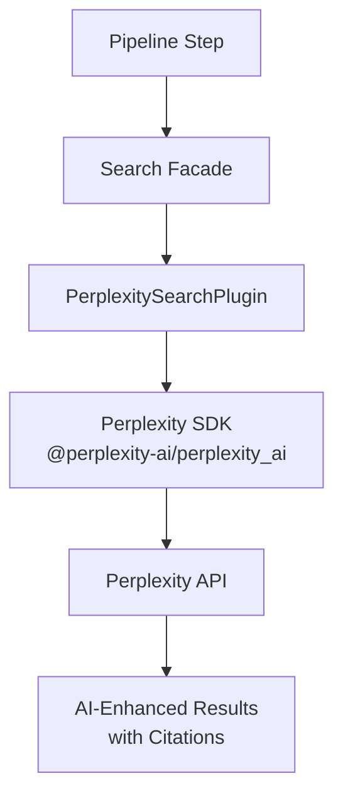
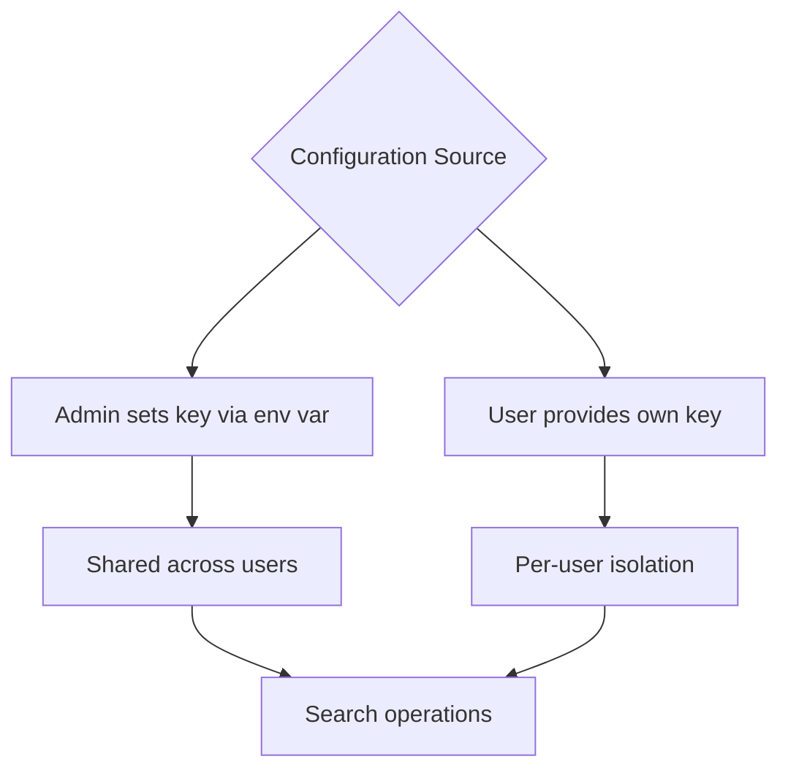
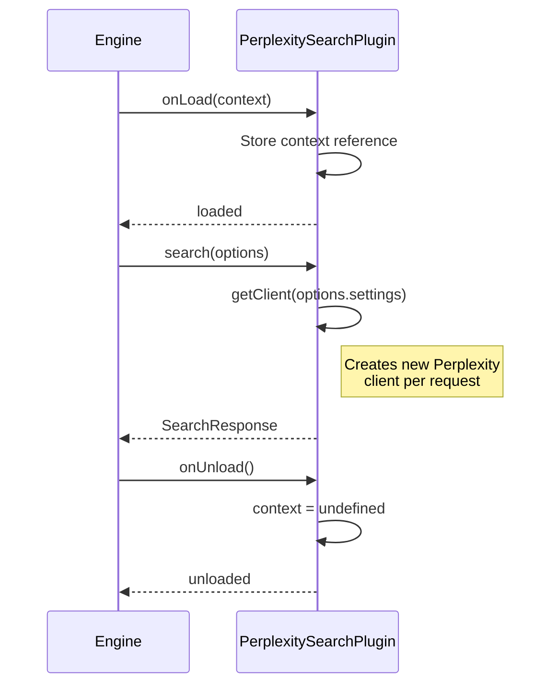

# Perplexity Search Plugin

The Perplexity plugin provides AI-powered web search with citations using the Perplexity API. Unlike traditional search engines, Perplexity understands natural language queries and returns results enriched with AI-generated context and source attribution.

**Source:** `packages/plugins/perplexity/src/perplexity.plugin.ts`

## Overview

| Property           | Value                           |
| ------------------ | ------------------------------- |
| Plugin ID          | `perplexity`                    |
| Package            | `@ever-works/perplexity-plugin` |
| Category           | `search`                        |
| Capabilities       | `search`                        |
| Version            | `1.0.0`                         |
| Configuration Mode | `hybrid`                        |
| Auto-enable        | No                              |
| Built-in           | Yes                             |
| System Plugin      | No                              |

The plugin implements both `IPlugin` and `ISearchPlugin` interfaces. It uses the official `@perplexity-ai/perplexity_ai` SDK to communicate with the Perplexity API.

## Architecture



## Configuration

### Settings Schema

| Setting  | Type     | Required | Scope  | Description                                                  |
| -------- | -------- | -------- | ------ | ------------------------------------------------------------ |
| `apiKey` | `string` | Yes      | `user` | Perplexity API key. Secret. Env: `PLUGIN_PERPLEXITY_API_KEY` |

### Environment Variables

| Variable                    | Description                                                         |
| --------------------------- | ------------------------------------------------------------------- |
| `PLUGIN_PERPLEXITY_API_KEY` | Perplexity API key (optional -- can be set via admin/user settings) |

## Search Capabilities

### Search Options

The `search()` method accepts the following options:

| Option           | Type       | Description                                              |
| ---------------- | ---------- | -------------------------------------------------------- |
| `query`          | `string`   | Natural language search query                            |
| `limit`          | `number`   | Maximum number of results (mapped to `max_results`)      |
| `includeDomains` | `string[]` | Only include results from these domains                  |
| `excludeDomains` | `string[]` | Exclude results from these domains (prefixed with `-`)   |
| `timeRange`      | `string`   | Recency filter: `day`, `week`, `month`, `year`, or `all` |

### Domain Filtering

Perplexity supports both include and exclude domain filtering through the `search_domain_filter` parameter:

```typescript
// Include domains: passed directly
if (options.includeDomains && options.includeDomains.length > 0) {
	searchParams.search_domain_filter = [...options.includeDomains];
}

// Exclude domains: prefixed with '-'
else if (options.excludeDomains && options.excludeDomains.length > 0) {
	searchParams.search_domain_filter = options.excludeDomains.map((d) => `-${d}`);
}
```

Note that include and exclude filters are mutually exclusive -- if `includeDomains` is provided, `excludeDomains` is ignored.

### Recency Filtering

The plugin maps time range values to Perplexity's `search_recency_filter`:

| Time Range | Perplexity Filter |
| ---------- | ----------------- |
| `day`      | `day`             |
| `week`     | `week`            |
| `month`    | `month`           |
| `year`     | `year`            |
| `all`      | Not applied       |

### Search Response

Each search result includes:

```typescript
interface SearchResult {
	title: string; // Result title
	url: string; // Full URL
	snippet: string; // AI-generated snippet
	position: number; // Result position (1-based)
	source?: string; // Hostname extracted from URL
}
```

The overall response includes timing information:

```typescript
interface SearchResponse {
	results: SearchResult[];
	query: string;
	totalResults: number;
	hasMore: false; // Perplexity returns all results in one call
	duration: number; // Execution time in ms
}
```

## Usage Example

```typescript
const results = await perplexityPlugin.search({
	query: 'best Italian restaurants in San Francisco',
	limit: 10,
	includeDomains: ['yelp.com', 'tripadvisor.com'],
	timeRange: 'month',
	settings: { apiKey: 'pplx-...' }
});

for (const result of results.results) {
	console.log(`${result.position}. ${result.title}`);
	console.log(`   ${result.url}`);
	console.log(`   ${result.snippet}`);
}
```

## Rate Limiting

The plugin reports rate limit info but does not currently track actual API rate limits:

```typescript
async getRateLimitInfo(): Promise<RateLimitInfo> {
    return {
        remaining: -1,    // Unknown
        limit: -1,        // Unknown
        period: 'minute'
    };
}
```

## Configuration Mode

Perplexity uses `hybrid` configuration mode:



- **Admin** can set `PLUGIN_PERPLEXITY_API_KEY` as an environment variable for shared access
- **Users** can override with their own key in the plugin settings UI

## Lifecycle



Note that the plugin creates a new `Perplexity` client instance for each search call, using the API key from the request settings. This ensures per-user key isolation in the hybrid configuration mode.

## Dependencies

| Package                        | Version   | Purpose                            |
| ------------------------------ | --------- | ---------------------------------- |
| `@perplexity-ai/perplexity_ai` | ^0.25.0   | Official Perplexity SDK            |
| `@ever-works/plugin`           | workspace | Plugin contracts (peer dependency) |

## How It Works in Ever Works

When enabled as the active search provider, Perplexity is used during work generation to find relevant information about each item. The AI-powered search understands query intent rather than just matching keywords, which produces more contextually relevant results for building work content.

## Getting Started

1. Create an account at [perplexity.ai](https://perplexity.ai)
2. Get your API key from [perplexity.ai/account/api](https://perplexity.ai/account/api)
3. Enable the Perplexity plugin in Ever Works
4. Enter the key in the **API Key** field
