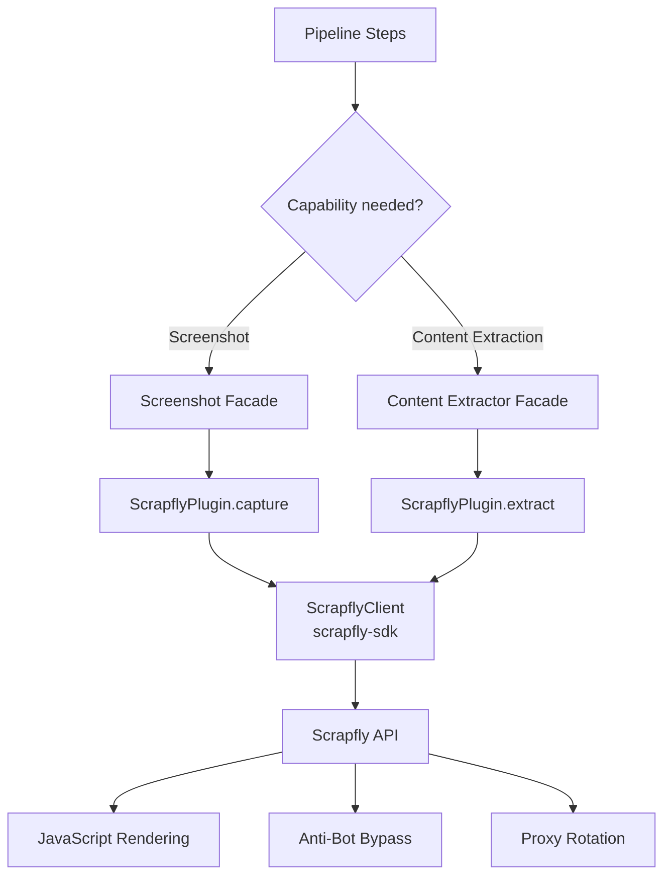
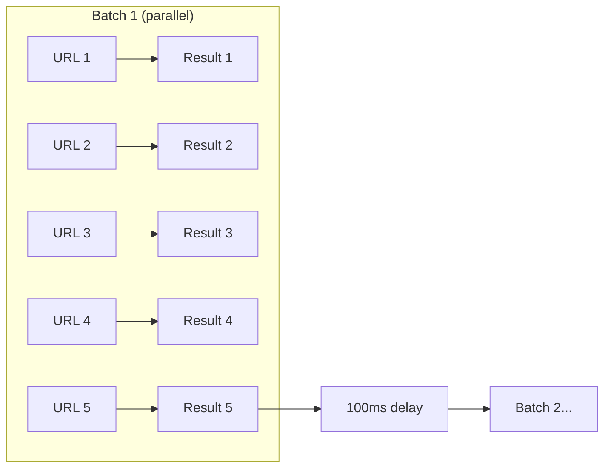
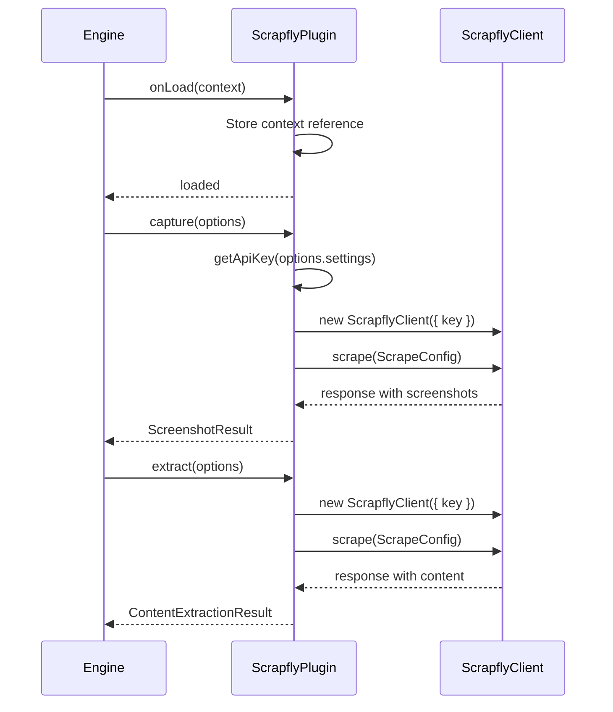

# Scrapfly Content Extractor & Screenshot Plugin

The Scrapfly plugin provides both screenshot capture and content extraction capabilities using the Scrapfly API. It handles JavaScript rendering, anti-bot bypass, and proxy rotation to access content from even heavily protected websites.

**Source:** `packages/plugins/scrapfly/src/scrapfly.plugin.ts`

## Overview

| Property           | Value                             |
| ------------------ | --------------------------------- |
| Plugin ID          | `scrapfly`                        |
| Package            | `@ever-works/scrapfly-plugin`     |
| Category           | `content-extractor`               |
| Capabilities       | `screenshot`, `content-extractor` |
| Version            | `1.0.0`                           |
| Configuration Mode | `hybrid`                          |
| Auto-enable        | No                                |
| Built-in           | Yes                               |
| System Plugin      | No                                |

The plugin implements three interfaces: `IPlugin`, `IScreenshotPlugin`, and `IContentExtractorPlugin`. This dual-capability design means a single plugin and API key can serve both screenshot and content extraction needs.

## Architecture



## Configuration

### Settings Schema

| Setting  | Type     | Required | Scope  | Description                                              |
| -------- | -------- | -------- | ------ | -------------------------------------------------------- |
| `apiKey` | `string` | Yes      | `user` | Scrapfly API key. Secret. Env: `PLUGIN_SCRAPFLY_API_KEY` |

### Environment Variables

| Variable                  | Description                                                       |
| ------------------------- | ----------------------------------------------------------------- |
| `PLUGIN_SCRAPFLY_API_KEY` | Scrapfly API key (optional -- can be set via admin/user settings) |

## Screenshot Capability

### Capture Method

The `capture()` method takes a URL and returns a full-page screenshot:

```typescript
const result = await scrapflyPlugin.capture({
	url: 'https://example.com',
	viewportWidth: 1280,
	viewportHeight: 800,
	delay: 2000, // Wait 2s before capture
	waitForSelector: '.content', // Wait for element
	settings: { apiKey: 'your-key' }
});

if (result.success) {
	console.log(result.imageUrl); // Screenshot URL
	console.log(result.width); // Viewport width
	console.log(result.height); // Viewport height
	console.log(result.fileSize); // File size in bytes
}
```

### Screenshot Configuration

The plugin configures Scrapfly's `ScrapeConfig` with these settings:

| Parameter           | Value                          | Description                  |
| ------------------- | ------------------------------ | ---------------------------- |
| `render_js`         | `true`                         | JavaScript rendering enabled |
| `rendering_wait`    | From `options.delay`           | Wait time before screenshot  |
| `wait_for_selector` | From `options.waitForSelector` | CSS selector to wait for     |
| `screenshots`       | `{ main: 'fullpage' }`         | Full-page screenshot         |
| `country`           | `'us'`                         | Request from US proxies      |

### Maximum Dimensions

```typescript
getMaxDimensions(): { width: number; height: number } {
    return { width: 3840, height: 2160 };
}
```

## Content Extraction Capability

### Single URL Extraction

The `extract()` method scrapes a URL and returns markdown content:

```typescript
const result = await scrapflyPlugin.extract({
	url: 'https://example.com/article',
	waitForJs: true, // Enable JS rendering (default: true)
	settings: { apiKey: 'your-key' }
});

if (result.success) {
	console.log(result.content); // Raw content
	console.log(result.markdown); // Markdown formatted
	console.log(result.wordCount); // Word count
	console.log(result.readingTime); // Estimated reading time (minutes)
	console.log(result.duration); // Extraction time (ms)
}
```

### Extraction Configuration

| Parameter   | Value                    | Description                          |
| ----------- | ------------------------ | ------------------------------------ |
| `render_js` | From `options.waitForJs` | JavaScript rendering (default: true) |
| `asp`       | `true`                   | Anti-Scraping Protection bypass      |
| `format`    | `'markdown'`             | Output as markdown                   |
| `country`   | `'us'`                   | Request from US proxies              |

### Batch Extraction

The plugin supports batch extraction with concurrency control:

```typescript
const results = await scrapflyPlugin.extractBatch(
	['https://example.com/page1', 'https://example.com/page2', 'https://example.com/page3'],
	{ settings: { apiKey: 'your-key' } }
);
```

Batch extraction processes URLs in groups of 5 with a 100ms delay between batches:



### URL Validation

The `canExtract()` method checks if a URL is valid for extraction:

```typescript
async canExtract(url: string): Promise<boolean> {
    try {
        const parsed = new URL(url);
        return parsed.protocol === 'http:' || parsed.protocol === 'https:';
    } catch {
        return false;
    }
}
```

Only HTTP and HTTPS URLs are supported.

## Key Features

| Feature               | Description                                                |
| --------------------- | ---------------------------------------------------------- |
| Anti-Bot Bypass       | Handles CAPTCHAs, JavaScript challenges, and bot detection |
| JavaScript Rendering  | Full browser rendering for SPAs and dynamic content        |
| Full-Page Screenshots | Captures entire page, not just viewport                    |
| Markdown Output       | Content extracted directly as markdown                     |
| Global Proxy Network  | Access region-locked content from any country              |
| Concurrent Batching   | Process multiple URLs in parallel batches                  |

## Lifecycle



Note that a new `ScrapflyClient` is created for each operation, using the API key from the request settings.

## Dependencies

| Package              | Version   | Purpose                            |
| -------------------- | --------- | ---------------------------------- |
| `scrapfly-sdk`       | ^0.7.3    | Official Scrapfly SDK              |
| `@ever-works/plugin` | workspace | Plugin contracts (peer dependency) |

## How It Works in Ever Works

Scrapfly serves dual purposes during directory generation:

1. **Screenshot capture**: Capturing preview images of directory items (websites, products, etc.)
2. **Content extraction**: Pulling text content from web pages to enrich item descriptions

Its anti-bot capabilities make it effective for scraping sites that block standard HTTP requests, such as e-commerce platforms and social media sites.

## Getting Started

1. Sign up at [scrapfly.io](https://scrapfly.io)
2. Copy your API key from the dashboard
3. Enable the Scrapfly plugin in Ever Works
4. Enter the key in the **API Key** field
5. The plugin is now available for both screenshot and content extraction tasks
