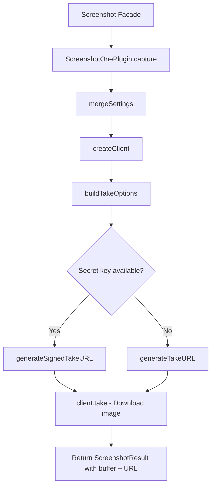

# ScreenshotOne Plugin

The ScreenshotOne plugin captures website screenshots using the [ScreenshotOne API](https://screenshotone.com). It generates preview images for directory items automatically during the generation pipeline, with support for signed URLs, ad blocking, and configurable viewport settings.

**Source:** `packages/plugins/screenshotone/src/screenshotone.plugin.ts`

## Overview

| Property | Value |
|---|---|
| Plugin ID | `screenshotone` |
| Category | `screenshot` |
| Capabilities | `screenshot` |
| Version | `1.0.0` |
| Configuration Mode | `hybrid` |
| Auto-enable | No |
| Built-in | No |
| System Plugin | No |
| Dependencies | `screenshotone-api-sdk` |

The plugin implements `IPlugin` and `IScreenshotPlugin`. It uses the official `screenshotone-api-sdk` package to build capture requests and download the resulting images.

## Architecture



### Signed URLs

When both an access key and a secret key are configured, the plugin generates **signed URLs**. Signed URLs include an HMAC signature that prevents tampering and unauthorized use of your API credentials. Without a secret key, unsigned URLs are generated instead.

## Configuration

### Settings Schema

| Setting | Type | Required | Default | Scope | Description |
|---|---|---|---|---|---|
| `accessKey` | `string` | Yes | -- | `user` | ScreenshotOne access key (secret) |
| `secretKey` | `string` | No | -- | `user` | Secret key for signed URLs (secret) |
| `viewportWidth` | `number` | No | `1280` | -- | Viewport width in pixels (320--3840) |
| `viewportHeight` | `number` | No | `800` | -- | Viewport height in pixels (200--2160) |
| `format` | `string` | No | `"png"` | -- | Image format: `png`, `jpg`, `jpeg`, or `webp` |
| `fullPage` | `boolean` | No | `false` | -- | Capture the full scrollable page |
| `deviceScaleFactor` | `number` | No | `1` | -- | Device scale factor (0.5--3, 2 = retina) |
| `blockAds` | `boolean` | No | `true` | -- | Block ads during capture |
| `blockTrackers` | `boolean` | No | `true` | -- | Block trackers during capture |

### Environment Variables

| Variable | Description |
|---|---|
| `PLUGIN_SCREENSHOTONE_ACCESS_KEY` | Access key fallback |
| `PLUGIN_SCREENSHOTONE_SECRET_KEY` | Secret key fallback |
| `PLUGIN_SCREENSHOTONE_VIEWPORT_WIDTH` | Viewport width fallback |
| `PLUGIN_SCREENSHOTONE_VIEWPORT_HEIGHT` | Viewport height fallback |
| `PLUGIN_SCREENSHOTONE_FORMAT` | Image format fallback |

### Settings Resolution

API keys are resolved through the standard 4-level hierarchy:

1. Directory settings (highest priority)
2. User settings
3. Admin settings
4. Environment variables (lowest priority)

## Features

### Screenshot Capture

```typescript
async capture(options: ScreenshotOptions): Promise<ScreenshotResult>
```

Downloads a screenshot from the ScreenshotOne API. The result contains the image as a `Buffer`, a base64-encoded string, and a reference URL. Per-call options override plugin-level defaults.

### URL Generation

```typescript
async getScreenshotUrl(options: ScreenshotOptions): Promise<string | null>
```

Generates a screenshot URL without actually downloading the image. Useful when you need a hotlinkable image URL rather than the binary data.

### Credential Validation

```typescript
async validateCredentials(): Promise<ScreenshotValidationResult>
```

Verifies that the configured API credentials are valid by generating a test URL and checking that it points to `api.screenshotone.com`.

### Ad and Tracker Blocking

Both ad blocking and tracker blocking are enabled by default. This ensures that captured screenshots are clean and free of distracting elements.

### Cookie Banner Blocking

Per-request cookie banner blocking is available via the `blockCookieBanners` option in `ScreenshotOptions`. This removes cookie consent popups from the captured image.

### Render Delay

The `delay` option (in milliseconds) waits before capturing, giving the page time to finish loading dynamic content. The plugin converts milliseconds to seconds for the ScreenshotOne API.

### Selector Waiting

The `waitForSelector` option tells the API to wait until a specific CSS selector is present on the page before capturing.

### Caching

When `cache` is enabled in the capture options, ScreenshotOne caches the result for the specified `cacheTtl` (time to live). Subsequent requests for the same URL return the cached image.

### Supported Formats

- `png` -- lossless, best for UI screenshots
- `jpg` / `jpeg` -- lossy, smaller file size
- `webp` -- modern format with excellent compression

### Maximum Dimensions

The maximum viewport is 3840 x 2160 pixels (4K UHD).

## Usage in Pipelines

During directory generation, the screenshot facade delegates capture requests to ScreenshotOne for items with source URLs. The resulting images become item preview thumbnails.

## Comparison with Urlbox

| Feature | ScreenshotOne | Urlbox |
|---|---|---|
| SDK | `screenshotone-api-sdk` | `urlbox` |
| Signed URLs | Yes (with secret key) | Yes (with API secret) |
| Default viewport | 1280 x 800 | 1280 x 1024 |
| Device scale factor | 0.5--3 (configurable) | Boolean retina (2x) |
| Image quality control | No (format-dependent) | Yes (1--100 slider) |
| Ad blocking | Yes | Yes |
| Tracker blocking | Yes | No |
| Cookie banner blocking | Per-request | Default enabled |
| Server-side caching | Yes (with TTL) | No |
| Supported formats | PNG, JPG, JPEG, WebP | PNG, JPG, JPEG, WebP |
| Max dimensions | 3840 x 2160 | 3840 x 2160 |

ScreenshotOne offers granular device scale factor control (0.5--3), tracker blocking, and built-in caching. Urlbox provides a quality slider for lossy formats and cookie banner blocking enabled by default.

## API Reference

### Class: `ScreenshotOnePlugin`

```typescript
class ScreenshotOnePlugin implements IPlugin, IScreenshotPlugin {
  readonly id: 'screenshotone';
  readonly category: 'screenshot';

  capture(options: ScreenshotOptions): Promise<ScreenshotResult>;
  getScreenshotUrl(options: ScreenshotOptions): Promise<string | null>;
  validateCredentials(): Promise<ScreenshotValidationResult>;
  getSupportedFormats(): readonly ScreenshotFormat[];
  getMaxDimensions(): { width: number; height: number };
}
```

### ScreenshotResult Fields

| Field | Description |
|---|---|
| `success` | Whether capture succeeded |
| `imageBuffer` | Raw image data as a Buffer |
| `imageBase64` | Base64-encoded image string |
| `imageUrl` | Reference URL for the screenshot |
| `width` | Viewport width used |
| `height` | Viewport height used |
| `fileSize` | Image file size in bytes |
| `error` | Error message (on failure) |

## Getting Started

1. Sign up at [screenshotone.com](https://screenshotone.com)
2. Copy your access key and optional secret key (for signed URLs)
3. Enable the ScreenshotOne plugin on the Plugins page
4. Enter your credentials in the plugin settings
5. Select ScreenshotOne as the screenshot provider for your directory

## Troubleshooting

| Issue | Cause | Solution |
|---|---|---|
| "Access key not configured" | Missing API credentials | Set the access key in plugin settings or via environment variable |
| Blank screenshots | Page loads dynamic content | Use the `delay` option or `waitForSelector` |
| Low-resolution images | Default scale factor is 1 | Increase `deviceScaleFactor` to 2 for retina output |
| Ads appearing in screenshots | `blockAds` disabled | Ensure `blockAds` is set to `true` |
| Invalid credentials | Wrong access key or secret key | Verify credentials at screenshotone.com dashboard |
