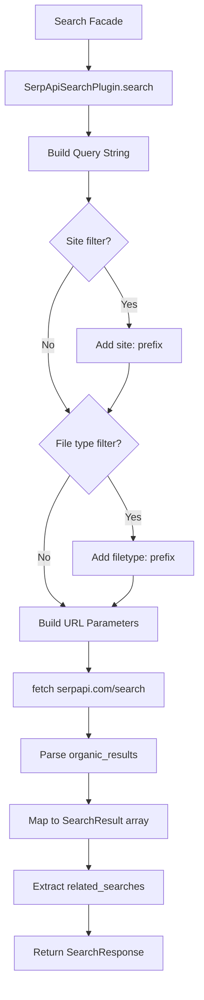

# SerpAPI Plugin

The SerpAPI plugin provides web search capabilities through the [SerpAPI](https://serpapi.com) service with support for multiple search engines including Google, Bing, Yahoo, DuckDuckGo, Baidu, and Yandex. It uses plain `fetch()` with no SDK dependency, keeping the plugin lightweight.

**Source:** `packages/plugins/serpapi/src/serpapi.plugin.ts`

## Overview

| Property           | Value                |
| ------------------ | -------------------- |
| Plugin ID          | `serpapi`            |
| Category           | `search`             |
| Capabilities       | `search`             |
| Version            | `1.0.0`              |
| Configuration Mode | `hybrid`             |
| Auto-enable        | No                   |
| Built-in           | Yes                  |
| System Plugin      | No                   |
| SDK                | None (plain `fetch`) |

The plugin implements `IPlugin` and `ISearchPlugin`.

## Architecture



The plugin constructs a query URL with parameters, sends a single HTTP request to the SerpAPI endpoint, and parses the JSON response into the standardized `SearchResponse` format.

## Configuration

### Settings Schema

| Setting      | Type     | Default    | Description                                 |
| ------------ | -------- | ---------- | ------------------------------------------- |
| `apiKey`     | `string` | --         | **Required.** Your SerpAPI key              |
| `engine`     | `string` | `"google"` | Search engine to use                        |
| `maxResults` | `number` | `10`       | Default maximum results per search (1--100) |

### Supported Engines

| Engine     | Value        | Description                         |
| ---------- | ------------ | ----------------------------------- |
| Google     | `google`     | Default. Most comprehensive results |
| Bing       | `bing`       | Microsoft search engine             |
| Yahoo      | `yahoo`      | Yahoo search                        |
| DuckDuckGo | `duckduckgo` | Privacy-focused search              |
| Baidu      | `baidu`      | Chinese search engine               |
| Yandex     | `yandex`     | Russian search engine               |

### Environment Variables

| Variable                 | Description          |
| ------------------------ | -------------------- |
| `PLUGIN_SERPAPI_API_KEY` | SerpAPI key fallback |

### Settings Resolution

API keys are resolved through the standard 4-level hierarchy:

1. Work settings (highest priority)
2. User settings
3. Admin settings
4. Environment variables (lowest priority)

## Features

### Multi-Engine Search

SerpAPI is unique among Ever Works search plugins in supporting six different search engines through a single API. The engine can be configured globally via plugin settings or overridden per request.

### Search Options

The `search()` method supports these options:

| Option       | SerpAPI Parameter | Description                                       |
| ------------ | ----------------- | ------------------------------------------------- |
| `query`      | `q`               | The search query string                           |
| `limit`      | `num`             | Maximum results to return                         |
| `page`       | `start`           | Page number for pagination (converted to offset)  |
| `region`     | `gl`              | Country code for localized results                |
| `language`   | `hl`              | Language code for result language                 |
| `safeSearch` | `safe`            | Safe search level: `off`, `moderate`, or `strict` |
| `site`       | Query prefix      | Restricts results to a specific domain            |
| `fileType`   | Query prefix      | Restricts results to a specific file type         |

### Query Prefixes

When `site` or `fileType` options are provided, the plugin prepends standard search operator prefixes to the query:

```
site:example.com my search query
filetype:pdf my search query
```

### Safe Search Mapping

SerpAPI uses different safe search values than the plugin interface:

| Plugin Value | SerpAPI Value |
| ------------ | ------------- |
| `off`        | `off`         |
| `moderate`   | `medium`      |
| `strict`     | `active`      |

### Search Results

Each result in the response includes:

| Field           | Description                              |
| --------------- | ---------------------------------------- |
| `title`         | The page title                           |
| `url`           | The destination URL (from `link`)        |
| `snippet`       | Text excerpt from the page               |
| `displayUrl`    | The displayed URL format                 |
| `faviconUrl`    | The site's favicon URL                   |
| `source`        | The source attribution                   |
| `position`      | The result's position in the search page |
| `publishedDate` | Publication date when available          |

### Related Searches

The response includes `relatedSearches` -- an array of related query suggestions from the search engine. These can be useful for expanding search coverage.

### Pagination

SerpAPI supports multi-page results:

- The `page` option specifies which page to retrieve (1-based)
- The offset is calculated as `(page - 1) * limit`
- The response includes `hasMore` to indicate additional pages
- `nextPage` is set to `page + 1` when more results are available

## Usage in Pipelines

When enabled and set as the active search provider, SerpAPI is used during work generation to find information about each item. It is called by the search facade, which manages provider selection and settings resolution.

SerpAPI is a good choice when:

- You need results from a specific search engine (e.g., Bing or Yandex)
- You want to target specific regions or languages
- You need structured organic results with metadata

## Getting Started

1. Create an account at [serpapi.com](https://serpapi.com)
2. Copy your API key from the SerpAPI dashboard
3. Enable the SerpAPI plugin on the Plugins page
4. Enter your API key in the settings panel
5. Optionally select a preferred search engine
6. Set SerpAPI as the active search provider for your work

## API Reference

### Class: `SerpApiSearchPlugin`

```typescript
class SerpApiSearchPlugin implements IPlugin, ISearchPlugin {
	readonly id: 'serpapi';
	readonly category: 'search';

	search(options: SearchOptions): Promise<SearchResponse>;
	isAvailable(): Promise<boolean>;
	getRateLimitInfo(): Promise<RateLimitInfo>;
}
```

### Key Interfaces

| Interface        | Purpose                                                   |
| ---------------- | --------------------------------------------------------- |
| `SearchOptions`  | Input for a search (query, limit, region, engine, etc.)   |
| `SearchResponse` | Array of results with pagination and related searches     |
| `SearchResult`   | Individual result with title, URL, snippet, and metadata  |
| `RateLimitInfo`  | Rate limit status (SerpAPI returns -1 for unknown limits) |

## Comparison with Other Search Plugins

| Feature             | SerpAPI                       | Brave            | Exa           | Tavily        | Valyu         |
| ------------------- | ----------------------------- | ---------------- | ------------- | ------------- | ------------- |
| Engines             | 6 (Google, Bing, Yahoo, etc.) | 1 (Brave)        | 1 (Exa)       | 1 (Tavily)    | Multi-source  |
| Content extraction  | No                            | No               | Yes           | Yes           | Yes           |
| Site filtering      | Yes (query prefix)            | No               | Domain filter | Domain filter | Domain filter |
| File type filtering | Yes (query prefix)            | No               | No            | No            | No            |
| Pagination          | Yes                           | Yes              | No            | No            | No            |
| Related searches    | Yes                           | Yes              | No            | No            | No            |
| Safe search         | Yes (3 levels)                | Yes              | No            | No            | No            |
| SDK required        | No (plain fetch)              | No (plain fetch) | Yes           | Yes           | Yes           |
