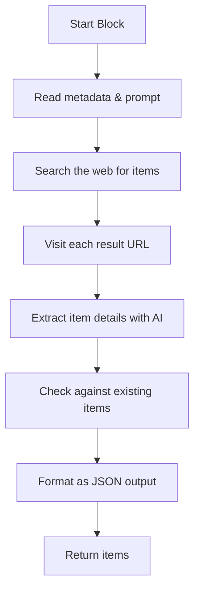
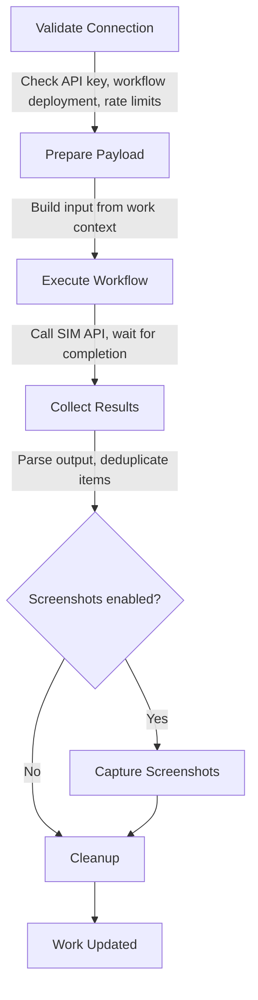

# SIM AI Workflows Plugin

| Field                  | Value           |
| ---------------------- | --------------- |
| **Plugin ID**          | `sim-ai`        |
| **Category**           | `pipeline`      |
| **Configuration Mode** | `user-required` |
| **Built-in**           | Yes             |
| **Auto-enabled**       | No              |

## Overview

The SIM AI Workflows plugin lets you delegate the entire work generation process to a [SIM AI](https://www.sim.ai) workflow. SIM AI is an open-source visual workflow builder — you design AI agent workflows by connecting blocks in a visual editor rather than writing code.

When you select SIM AI as the pipeline, the platform sends your work context (name, prompt, existing items) to a SIM workflow that you've designed, the workflow runs on SIM's infrastructure, and the results are collected back into your work as structured items with categories, tags, and brands.

### When to Use SIM AI

SIM AI is the right choice when:

- You need **custom generation logic** that doesn't fit the Standard or Agent Pipeline's built-in approach — for example, calling a proprietary API, scraping a specific website, or applying domain-specific rules.
- You want to use **AI models that aren't available as Ever Works plugins** — SIM supports any model (OpenAI, Anthropic, Google, Mistral, open-source models hosted anywhere).
- You want **visual debugging** — SIM Studio shows step-by-step execution logs, so you can see exactly what each block produced.
- You're building workflows as a **team** — SIM workflows can be shared, versioned, and deployed independently.

### How It Compares to Other Pipelines

|                                 | Standard Pipeline                         | Agent Pipeline                            | Claude Code        | SIM AI                            |
| ------------------------------- | ----------------------------------------- | ----------------------------------------- | ------------------ | --------------------------------- |
| **Who controls the logic?**     | Platform (15 fixed steps)                 | Autonomous agent                          | Claude Code CLI    | You (visual workflow)             |
| **Where does AI run?**          | Your AI provider plugin                   | Your AI provider plugin                   | Anthropic API      | SIM's infrastructure              |
| **What providers do you need?** | AI, Search, Screenshot, Content Extractor | AI, Search, Screenshot, Content Extractor | Screenshot only    | Screenshot only (optional)        |
| **Setup effort**                | None                                      | None                                      | None               | Requires SIM account + workflow   |
| **Best for**                    | Broad, structured works                   | Exploratory discovery                     | Advanced reasoning | Custom logic, specialized domains |

Since SIM AI handles AI and search internally through your workflow, you **do not need** AI provider or search provider plugins configured in Ever Works. The only optional Ever Works provider is screenshot (if you want the platform to capture screenshots after the workflow completes).

## Step-by-Step: Getting Started

### 1. Create a SIM AI Account

Go to [sim.ai](https://www.sim.ai) and sign up for an account. SIM offers a free tier that's sufficient for testing.

### 2. Build Your Workflow in SIM Studio

Open SIM Studio and create a new workflow. Your workflow needs to do three things: receive input from Ever Works, generate work items, and return them in the expected format.

**Configure the Start block:**

The Start block is where your workflow receives input from the plugin. Add three fields of type `object`:

1. **`metadata`** — contains the work name, description, prompt, and target item count.
2. **`existingSummary`** — contains a summary of items already in the work (for deduplication). This is optional and may not be present if the work is empty.
3. **`workflowParams`** — contains any custom key-value pairs you pass from the generator form.

You access these in subsequent blocks using SIM's variable syntax: `<start.metadata>`, `<start.existingSummary>`, `<start.workflowParams>`.

**Design the workflow logic:**

How you build the middle of your workflow is entirely up to you. A typical work generation workflow might look like this:



Common blocks you might use:

- **Agent block** — an AI agent that can reason, use tools (web search, URL reader), and produce structured output. This is the most powerful option for work generation.
- **Search block** — performs web searches and returns results.
- **HTTP block** — calls external APIs (your own services, databases, etc.).
- **LLM block** — calls a language model for text generation or classification.
- **Condition block** — branches the workflow based on data.

**Configure the output:**

Your workflow must return a JSON object with an `items` array. Each item needs at minimum a name, description, URL, category, and tags:

```json
{
	"items": [
		{
			"name": "Tool Name",
			"description": "A concise description (1-3 sentences)",
			"url": "https://example.com",
			"category": "Category Name",
			"tags": ["tag1", "tag2"]
		}
	]
}
```

You can optionally include additional fields per item:

| Field     | Description                                            |
| --------- | ------------------------------------------------------ |
| `content` | Longer markdown description for the item's detail page |
| `brand`   | Company or brand name                                  |
| `images`  | Array of image URLs                                    |

And optional top-level arrays alongside `items`:

| Field        | Description                                                      |
| ------------ | ---------------------------------------------------------------- |
| `categories` | Array of `{ name, description }` — explicit category definitions |
| `tags`       | Array of `{ name }` — explicit tag definitions                   |
| `brands`     | Array of `{ name, url }` — explicit brand definitions            |

If you don't return these optional arrays, the plugin derives categories, tags, and brands from the items themselves.

:::tip Using SIM Studio's AI Chat
SIM Studio has a built-in AI chat that can generate workflow templates from a description. Paste this prompt to get a starter workflow:

> Build a workflow that generates work listing items. The Start block has three object fields: metadata (accessed via `<start.metadata>`, contains prompt, workName, workDescription, targetItems), existingSummary (optional, accessed via `<start.existingSummary>`, contains existing items to avoid duplicates), and workflowParams (optional, accessed via `<start.workflowParams>`, custom key-value pairs). Use web search to find real items with valid URLs. Generate up to targetItems new items. Return a JSON object with an "items" array where each item has: name, description, url, category, tags.
> :::

### 3. Deploy Your Workflow

Once your workflow is built and tested in SIM Studio:

1. Click **Deploy** in the top-right corner of SIM Studio.
2. SIM will validate your workflow and create an API endpoint for it.
3. Copy the **Workflow ID** — you'll find it in the SIM dashboard URL or in the workflow settings. It looks like `wf_abc123...`.
4. Copy your **API key** — generate one from the SIM dashboard if you haven't already.

:::warning
The workflow must be deployed before the plugin can use it. If you edit the workflow after deploying, you need to redeploy for the changes to take effect. The plugin will log a warning if it detects pending changes.
:::

### 4. Configure the Plugin in Ever Works

1. Go to **Settings > Plugins > SIM AI Workflows** in the Ever Works dashboard.
2. Enter your **SIM API key**.
3. Enter the **Default Workflow ID** — this is the workflow that will run when you generate a work with the SIM AI pipeline.
4. Optionally change the **Base URL** if you self-host SIM (defaults to `https://www.sim.ai`).
5. Click **Save**. The plugin will validate your API key and check that the workflow is deployed.

You can also set the API key via the `SIM_API_KEY` environment variable in `apps/api/.env`.

### 5. Generate a Work with SIM AI

1. Go to **Works > New Work** and choose **AI Creation**.
2. Enter a work name and prompt as usual.
3. Expand **Advanced Settings** and select **SIM AI Workflows** as the pipeline.
4. The form will show SIM-specific options (see [Generator Form Options](#generator-form-options) below).
5. Optionally override the Workflow ID, set a target item count, or enable screenshot capture.
6. Click **Generate**. The platform dispatches the request to your SIM workflow and shows progress in real time.

You can also use SIM AI when **regenerating** an existing work — go to the work's detail page, open the generator, and select SIM AI as the pipeline.

## Generator Form Options

When SIM AI is selected as the pipeline, the generation form shows these options:

### Workflow Configuration

- **SIM Workflow ID** — override the default workflow for this specific generation. Leave empty to use the workflow ID from plugin settings.
- **Target Items** — how many new items to generate (default: 50, maximum: 500). This number is passed to your workflow as `metadata.targetItems`.
- **Workflow Timeout** — maximum time to wait for the workflow to complete (default: 60 minutes, maximum: 120 minutes). If the workflow doesn't finish in time, the generation fails with a timeout error.

### Data Passing

These options control what context your SIM workflow receives:

- **Pass Existing Items Summary** (default: on) — includes a summary of items already in the work: total count, category and tag names, and the first 20 items with their names and URLs. This helps your workflow avoid generating duplicate items.

- **Pass Data Repository Access** (default: off) — grants your workflow direct read access to the work's data repository on GitHub. When enabled, three additional fields appear:
    - **Data Repository URL** — the GitHub URL of the work's data repo.
    - **Repository Access Token** — a read-only GitHub token for the repo.
    - **Repository Branch** — the branch to read from (defaults to `data`).

:::caution
When passing repository access, use a **short-lived, read-only** token. The token is sent to the SIM workflow and could be logged or stored there. Never use a long-lived personal access token with write permissions.
:::

### Features

- **Capture Screenshots** (default: off) — after the workflow completes, the platform captures website screenshots for items that have a URL but no images. This uses your configured Ever Works screenshot provider (ScreenshotOne, Urlbox, etc.), not SIM.

### Advanced

- **Custom Workflow Parameters** — a JSON editor for key-value pairs that are passed to your workflow as `workflowParams`. Use this for workflow-specific configuration — for example, `{ "search_depth": "deep", "region": "US" }`.

## What Happens During Generation

When you trigger a generation with SIM AI, here's what happens step by step:



1. **Validate** — the plugin checks that your API key is valid, the workflow is deployed and reachable, and your SIM account hasn't hit its rate limit. If anything is wrong, you get a clear error message before any generation runs.

2. **Prepare** — the plugin builds a structured input payload from your work's metadata, the user's prompt, existing items summary (if enabled), and any custom workflow parameters.

3. **Execute** — the plugin calls the SIM API to run your workflow. Since the generation already runs as a background job, the plugin waits synchronously for the workflow to complete. You can see progress updates on the work detail page.

4. **Collect** — when the workflow finishes, the plugin parses the output. It's flexible about the format: it handles a direct `{ items: [...] }` object, a plain array of items, and various nested structures. Items are validated (must have at least a name) and deduplicated against existing work items by name.

5. **Screenshots** (optional) — if enabled, the platform captures website screenshots for items that have a URL but no images, using the configured screenshot provider.

6. **Cleanup** — resources are released and the work is marked as generated.

## Understanding Workflow Input

Your SIM workflow receives structured data from Ever Works. Here's what each field contains and how to use it:

### The `metadata` Object

Always present. Contains everything the workflow needs to know about the generation request:

| Field              | Example                 | How to use it                                                       |
| ------------------ | ----------------------- | ------------------------------------------------------------------- |
| `workName`         | "Best AI Writing Tools" | Use as context for what kind of items to find                       |
| `workDescription`  | "A curated list of..."  | Additional context about the work's purpose                         |
| `prompt`           | "Find tools that..."    | The user's specific instructions — this is the most important field |
| `targetItems`      | 50                      | How many new items the user wants — use as a stopping condition     |
| `generationMethod` | "create-update"         | Whether to add to existing items or recreate from scratch           |
| `workId`           | "uuid-123"              | Unique ID (useful for logging/tracking)                             |
| `workSlug`         | "best-ai-writing-tools" | URL slug (useful if your workflow generates links)                  |

### The `existingSummary` Object

Present when the work has existing items and "Pass Existing Items Summary" is enabled. Use it to avoid duplicates:

| Field         | Example                             | How to use it                              |
| ------------- | ----------------------------------- | ------------------------------------------ |
| `totalItems`  | 25                                  | Know how many items already exist          |
| `categories`  | ["Writing", "Editing"]              | Existing categories — reuse or extend them |
| `tags`        | ["free", "paid", "ai-powered"]      | Existing tags — reuse for consistency      |
| `sampleItems` | [{ name: "Grammarly", url: "..." }] | First 20 items — tell the AI to skip these |

### The `workflowParams` Object

Contains any custom parameters the user entered in the Advanced section of the generator form. The structure is entirely up to you — define whatever your workflow needs.

## Troubleshooting

### Common Issues

| Problem                               | What to check                                                                                                                                                                                    |
| ------------------------------------- | ------------------------------------------------------------------------------------------------------------------------------------------------------------------------------------------------ |
| "Invalid SIM API key"                 | Go to Settings > Plugins > SIM AI and verify your API key. Generate a new one from the SIM dashboard if needed.                                                                                  |
| "Workflow not deployed"               | Open SIM Studio, find your workflow, and click Deploy. The plugin cannot call workflows that haven't been deployed.                                                                              |
| "Workflow execution timed out"        | Your workflow took longer than the configured timeout. Increase the timeout in the generator form (up to 120 minutes), or optimize your workflow to run faster.                                  |
| "Rate limit exceeded"                 | Your SIM account has hit its API call limit. Wait for the limit to reset, or upgrade your SIM plan.                                                                                              |
| "Usage limit exceeded"                | You've used your monthly SIM allocation. Check your plan limits in the SIM dashboard.                                                                                                            |
| "Workflow returned empty content"     | The Agent block in your workflow produced no output. This often happens when the input is too large and hits a context limit. Try reducing the input or simplifying the prompt in your workflow. |
| "Output does not contain items array" | Your workflow returned data in an unexpected format. Make sure the final output is `{ items: [...] }`. Check the workflow execution logs in SIM Studio to see what was actually returned.        |
| "No usable items"                     | The workflow returned a response but none of the items had a valid `name` field. Check the Agent block output in SIM Studio.                                                                     |

### Debugging Tips

- **Check SIM Studio logs first.** Every workflow execution is logged in SIM Studio with step-by-step output. If generation fails, the logs will show exactly which block failed and what it produced.
- **Test your workflow in SIM Studio** before using it with Ever Works. Use the "Test" button in SIM Studio with sample input matching the format the plugin sends.
- **Start simple.** Begin with a basic Agent block that takes a prompt and returns items. Once that works, add web search, URL reading, and other blocks.
- **Check the output format.** The most common issue is the workflow returning items in an unexpected structure. The plugin expects `{ items: [...] }` at the top level (or nested inside `output`, `result`, `content`, or `data` fields).

## Example: Building a Simple Workflow

Here's a walkthrough of creating a basic work generation workflow:

**Goal:** A workflow that takes a work prompt, uses web search to find items, and returns structured results.

**Step 1 — Start block:** Add three `object` fields: `metadata`, `existingSummary`, `workflowParams`.

**Step 2 — Agent block:** Connect an Agent block to the Start block. Configure it with:

- A system prompt that explains the task: "You are a work curator. Given a topic and prompt, find real tools/products/services and return them as structured JSON."
- Tools: Enable web search and URL reader.
- Response format: JSON with an `items` array schema.
- Input: Reference `<start.metadata.prompt>` for the user's instructions and `<start.metadata.targetItems>` for how many items to find. Reference `<start.existingSummary.sampleItems>` to list items to avoid.

**Step 3 — Output:** The Agent block's response becomes the workflow output. Make sure the Agent is instructed to return the exact JSON format expected.

**Step 4 — Test:** Click "Test" in SIM Studio with sample input:

```json
{
	"metadata": {
		"workName": "Best Project Management Tools",
		"prompt": "Find the best project management tools for small teams",
		"targetItems": 10
	}
}
```

**Step 5 — Deploy:** Once the test produces valid items, deploy the workflow and copy the Workflow ID into your Ever Works plugin settings.

## Related

- [Creating a Work](../features/creating-a-work) — How to select SIM AI as the pipeline during work creation
- [Pipeline Plugins](./pipeline-plugins) — Overview of all pipeline plugin types
- [Creating a Pipeline Plugin](./creating-pipeline-plugin) — How to build custom pipeline plugins
- [SIM AI Documentation](https://docs.sim.ai) — Official SIM AI docs
