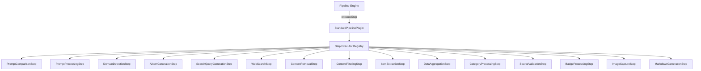

# Standard Pipeline Plugin

The Standard Pipeline is the default generation pipeline for Ever Works. It runs a fixed sequence of 15 steps that combine AI generation, web search, content extraction, and post-processing to build a complete directory from a single prompt. The pipeline is engine-orchestrated, meaning the pipeline engine runs each step individually, enabling checkpoint resume and step-level customization.

**Source:** `packages/plugins/standard-pipeline/src/standard-pipeline.plugin.ts`

## Overview

| Property      | Value                                                                 |
| ------------- | --------------------------------------------------------------------- |
| Plugin ID     | `standard-pipeline`                                                   |
| Category      | `pipeline`                                                            |
| Capabilities  | `pipeline`, `form-schema-provider`                                    |
| Version       | `1.0.0`                                                               |
| Auto-enable   | Yes                                                                   |
| Built-in      | Yes                                                                   |
| System Plugin | Yes                                                                   |
| Default For   | `pipeline` capability                                                 |
| Dependencies  | `@langchain/textsplitters`, `zod`, `string-similarity-js`, `stopword` |

The plugin implements `IPipelinePlugin` and `IFormSchemaProvider`.

## Architecture



### Engine Orchestration

The Standard Pipeline does **not** run steps itself. Instead, the pipeline engine calls `executeStep()` for each step individually. This design enables:

- **Checkpoint resume** -- progress is saved after each step and can be resumed on failure
- **Step injection** -- pipeline-modifier plugins can add new steps
- **Step replacement** -- existing steps can be swapped with custom implementations
- **Step disabling** -- optional steps can be skipped

The `execute()` method on this plugin throws an error if called directly, instructing callers to use the engine instead.

## Pipeline Phases

The 15 steps are organized into 8 phases:

### Phase 1: Initialization

| Step | ID                  | Description                                                                                        |
| ---- | ------------------- | -------------------------------------------------------------------------------------------------- |
| 1    | `prompt-comparison` | Compares the current prompt against the previous generation to determine if regeneration is needed |
| 2    | `prompt-processing` | Extracts the subject and featured item hints from the user prompt                                  |
| 3    | `domain-detection`  | Analyzes the prompt to detect the domain type for specialized handling                             |

### Phase 2: AI Generation

| Step | ID                          | Description                                                              |
| ---- | --------------------------- | ------------------------------------------------------------------------ |
| 4    | `ai-first-items-generation` | Generates initial items using AI based on the prompt and domain analysis |

### Phase 3: Web Search

| Step | ID                          | Description                                                     |
| ---- | --------------------------- | --------------------------------------------------------------- |
| 5    | `search-queries-generation` | Generates search queries based on the prompt and existing items |
| 6    | `web-search`                | Executes search queries to find relevant URLs                   |
| 7    | `content-retrieval`         | Retrieves web page content from discovered URLs                 |
| 8    | `content-filtering`         | Filters retrieved content for relevance                         |

### Phase 4: Extraction

| Step | ID                 | Description                                         |
| ---- | ------------------ | --------------------------------------------------- |
| 9    | `items-extraction` | Extracts structured items from filtered web content |

### Phase 5: Aggregation

| Step | ID                                   | Description                                                  |
| ---- | ------------------------------------ | ------------------------------------------------------------ |
| 10   | `deduplication-and-data-aggregation` | Merges AI and web items, removes duplicates, aggregates data |

### Phase 6: Categorization

| Step | ID                           | Description                                                      |
| ---- | ---------------------------- | ---------------------------------------------------------------- |
| 11   | `categories-tags-processing` | Processes and assigns categories, tags, brands, and collections  |
| 12   | `sources-validation`         | Validates source URLs and ensures they are accessible (optional) |

### Phase 7: Enrichment

| Step | ID                  | Description                                                 |
| ---- | ------------------- | ----------------------------------------------------------- |
| 13   | `badges-processing` | Evaluates and assigns badges to items (optional)            |
| 14   | `image-capture`     | Captures screenshots or fetches images for items (optional) |

### Phase 8: Output

| Step | ID                    | Description                                                     |
| ---- | --------------------- | --------------------------------------------------------------- |
| 15   | `markdown-generation` | Generates markdown descriptions using source content (optional) |

## Configuration

### Form Fields

The Standard Pipeline exposes a rich set of configuration options through `IFormSchemaProvider`:

#### Data Sources Group

| Field         | Type   | Default | Description                                           |
| ------------- | ------ | ------- | ----------------------------------------------------- |
| `source_urls` | `tags` | --      | URLs to extract items from directly (bypasses search) |

#### Categories and Keywords Group

| Field                 | Type   | Default | Description                             |
| --------------------- | ------ | ------- | --------------------------------------- |
| `initial_categories`  | `tags` | --      | Suggested categories for the directory  |
| `priority_categories` | `tags` | --      | Categories to prioritize and show first |
| `target_keywords`     | `tags` | --      | Keywords to guide search and extraction |

#### Generation Features Group

| Field                         | Type      | Default | Description                                       |
| ----------------------------- | --------- | ------- | ------------------------------------------------- |
| `ai_first_generation_enabled` | `boolean` | `false` | Generate initial items using AI before web search |
| `generate_categories`         | `boolean` | `true`  | Automatically generate categories from content    |
| `generate_tags`               | `boolean` | `true`  | Automatically generate tags for items             |
| `generate_collections`        | `boolean` | `true`  | Automatically generate collections                |
| `generate_brands`             | `boolean` | `true`  | Extract and categorize brands                     |
| `capture_screenshots`         | `boolean` | `false` | Take screenshots for items                        |
| `badge_evaluation_enabled`    | `boolean` | `false` | Evaluate and assign badges                        |

#### Search Configuration Group

| Field                   | Type     | Default | Description                                   |
| ----------------------- | -------- | ------- | --------------------------------------------- |
| `max_search_queries`    | `number` | `10`    | Number of search queries to generate (1--100) |
| `max_results_per_query` | `number` | `5`     | Results to retrieve per query (1--100)        |
| `max_pages_to_process`  | `number` | `10`    | Maximum web pages to process (1--1000)        |

#### Volume Control Group

| Field              | Type     | Default  | Description                                 |
| ------------------ | -------- | -------- | ------------------------------------------- |
| `data_volume_mode` | `select` | `"real"` | `real` (production) or `sample` (testing)   |
| `max_items`        | `number` | --       | Optional limit on generated items (1--1000) |

#### Advanced Settings Group

| Field                                    | Type      | Default | Description                                 |
| ---------------------------------------- | --------- | ------- | ------------------------------------------- |
| `content_filtering_enabled`              | `boolean` | `true`  | Filter irrelevant content before extraction |
| `relevance_threshold_content`            | `number`  | `0.6`   | Minimum relevance score (0--1)              |
| `min_content_length_for_extraction`      | `number`  | `100`   | Minimum characters for extraction           |
| `prompt_comparison_confidence_threshold` | `number`  | `0.5`   | Prompt similarity threshold (0--1)          |

### Selectable Provider Categories

- `ai-provider` -- the AI model for generation and extraction
- `search` -- the search engine for web research
- `screenshot` -- the screenshot service for image capture
- `content-extractor` -- the content extraction service

## Features

### Checkpoint Resume

After each step completes, the pipeline engine saves a checkpoint (context snapshot). If a step fails, the pipeline can resume from the last successful step. The `isCheckpointViable()` method determines whether a checkpoint has enough data to be worth resuming.

### Step Skip Detection

The `canSkipStep()` method checks whether a step's output data already exists in the context, allowing the engine to skip steps that have already produced their results.

### Typed Generation Context

The pipeline maintains a `TypedGenerationContext` that provides type-safe access to step data. Each step reads its required inputs and writes its outputs to this context.

### Data Flow

Steps declare their data dependencies via `provides` and `requires` arrays in their step definitions. This ensures the engine can validate the dependency graph before execution.

## Getting Started

The Standard Pipeline is enabled by default and requires no additional configuration. To customize it:

1. Go to the directory Generator settings
2. Adjust search, generation, and extraction options
3. Enable optional features like badge evaluation or screenshot capture
4. Trigger generation -- the pipeline engine handles step orchestration automatically

## API Reference

### Class: `StandardPipelinePlugin`

```typescript
class StandardPipelinePlugin implements IPipelinePlugin<BuiltInStepId>, IFormSchemaProvider {
	readonly id: 'standard-pipeline';
	readonly category: 'pipeline';

	executeStep(stepId, context, execContext, options?, onProgress?): Promise<IPipelineContext>;
	getStepDefinitions(): PipelineStepDefinition<BuiltInStepId>[];
	registerStepExecutor(stepId, executor): void;
	createContext(directory, request, existing): IPipelineContext;
	extractResult(context, meta): PipelineResult;
	isCheckpointViable(snapshot, completedSteps): boolean;
	canSkipStep(stepId, context): boolean;
	getFormFields(): FormFieldDefinition[];
	getFormGroups(): FormFieldGroup[];
	validateFormInput(values): ValidationResult;
	getDefaultValues(): Record<string, unknown>;
}
```
