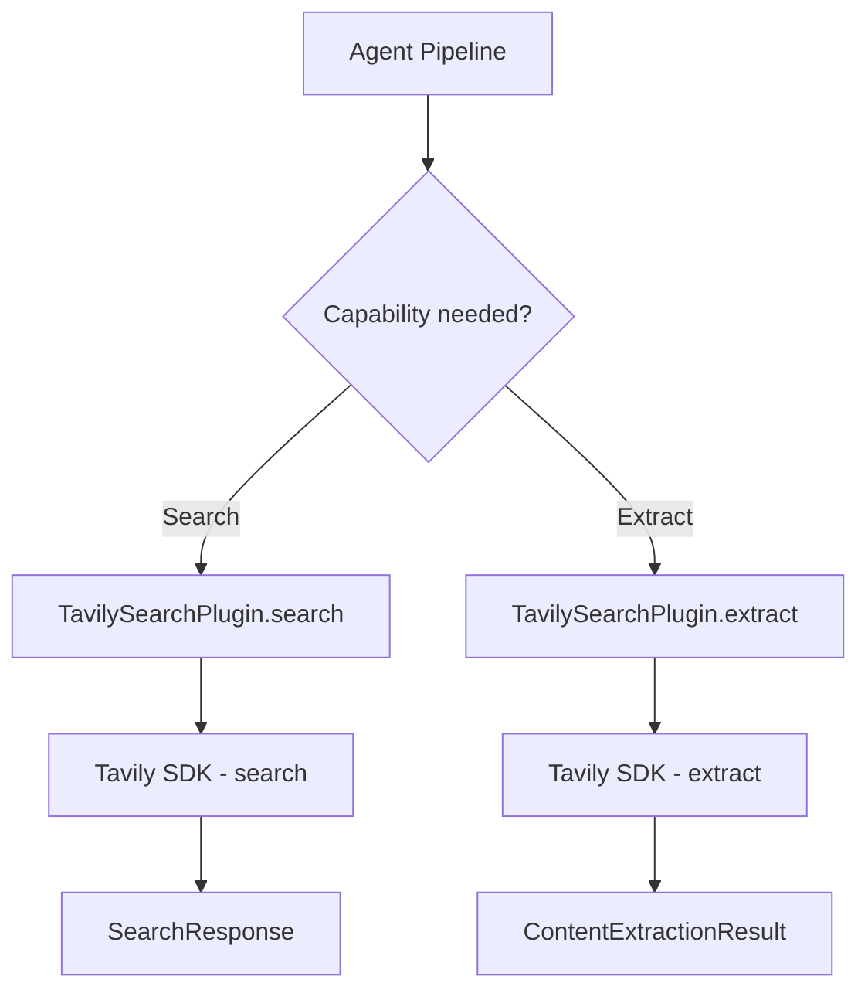
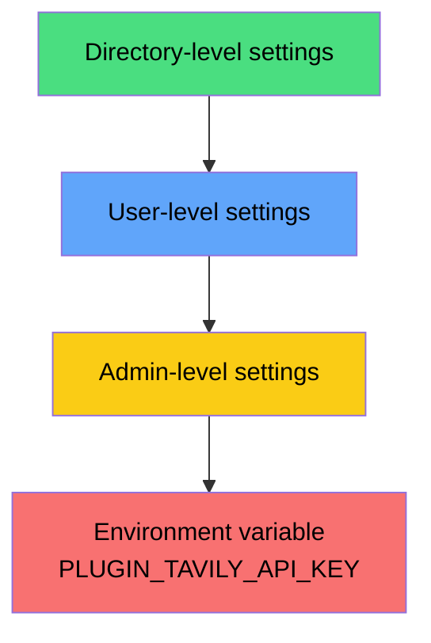
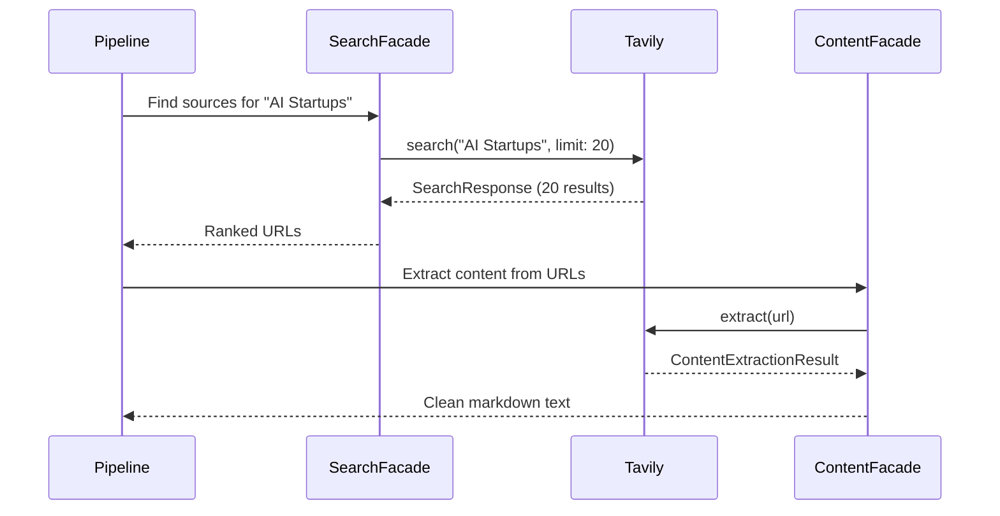

# Tavily Search Plugin

The Tavily plugin provides AI-optimized web search and content extraction through the [Tavily API](https://tavily.com). It is the default search provider in Ever Works and powers source discovery during directory generation.

**Source:** `packages/plugins/tavily/src/tavily.plugin.ts`

## Overview

| Property | Value |
|---|---|
| Plugin ID | `tavily` |
| Category | `search` |
| Capabilities | `search`, `content-extractor` |
| Version | `1.0.0` |
| Configuration Mode | `hybrid` |
| Auto-enable | Yes |
| System plugin | Yes |
| Default for | `search` capability |
| SDK | `@tavily/core` |

The plugin implements three interfaces: `IPlugin`, `ISearchPlugin`, and `IContentExtractorPlugin`. It is a system plugin that is auto-enabled and serves as the default search provider.

## Architecture



### Dual Capability

Unlike single-purpose plugins, Tavily handles both search and content extraction:

| Capability | Method | Description |
|---|---|---|
| `search` | `search(options)` | Find web pages relevant to a query |
| `content-extractor` | `extract(options)` | Pull clean text content from a URL |

During directory generation, the pipeline uses the search capability to discover sources and the content extraction capability to pull full text from those sources.

## Configuration

### Settings Schema

| Setting | Type | Required | Scope | Description |
|---|---|---|---|---|
| `apiKey` | `string` | Yes | `user` | Tavily API key (marked as secret) |

The API key is mapped to the environment variable `PLUGIN_TAVILY_API_KEY` via the `x-envVar` schema extension:

```json
{
    "apiKey": {
        "type": "string",
        "title": "API Key",
        "description": "Your Tavily API key. Get one at https://tavily.com",
        "x-secret": true,
        "x-envVar": "PLUGIN_TAVILY_API_KEY",
        "x-scope": "user"
    }
}
```

### Configuration Mode: Hybrid

The `hybrid` configuration mode means:

- **Admin level**: The platform administrator can set a shared API key that all users inherit.
- **User level**: Individual users can provide their own API key, which takes precedence over the admin key.
- **Environment variable**: As a final fallback, the key is read from `PLUGIN_TAVILY_API_KEY` in the API `.env` file.



## Search

### Method Signature

```typescript
async search(options: SearchOptions): Promise<SearchResponse>
```

### Search Options

| Option | Type | Default | Description |
|---|---|---|---|
| `query` | `string` | (required) | The search query |
| `limit` | `number` | `20` | Maximum number of results to return |
| `includeDomains` | `string[]` | (empty) | Only include results from these domains |
| `excludeDomains` | `string[]` | (empty) | Exclude results from these domains |
| `settings` | `PluginSettings` | (resolved) | Plugin settings including the API key |

### Search Behavior

The plugin uses `searchDepth: 'advanced'` for all queries, which performs a more thorough search at the cost of slightly slower results. The response is transformed into the standard `SearchResponse` format:

```typescript
const response = await client.search(options.query, {
    searchDepth: 'advanced',
    maxResults,
    includeDomains: options.includeDomains,
    excludeDomains: options.excludeDomains
});
```

### Search Result Fields

Each result in the `SearchResponse` contains:

| Field | Source | Description |
|---|---|---|
| `title` | Tavily `title` | Page title |
| `url` | Tavily `url` | Page URL |
| `snippet` | Tavily `content` | Extracted text snippet |
| `position` | Index + 1 | Result ranking position |
| `publishedDate` | Tavily `publishedDate` | Publication date if available |
| `metadata.score` | Tavily `score` | Relevance score |
| `metadata.rawContent` | Tavily `rawContent` | Full extracted content |

## Content Extraction

### Single URL Extraction

```typescript
async extract(options: ContentExtractionOptions): Promise<ContentExtractionResult>
```

Extracts clean text content from a single URL using the Tavily extract API:

```typescript
const response = await client.extract([options.url]);
```

The result includes:

| Field | Description |
|---|---|
| `success` | Whether extraction succeeded |
| `url` | The requested URL |
| `finalUrl` | The resolved URL if it differs from the request |
| `content` | Extracted text content |
| `markdown` | Content in markdown format |
| `wordCount` | Number of words extracted |
| `duration` | Time taken in milliseconds |

### Batch Extraction

```typescript
async extractBatch(
    urls: readonly string[],
    options?: Partial<ContentExtractionOptions>
): Promise<readonly ContentExtractionResult[]>
```

Extracts content from multiple URLs in a single API call. All URLs are sent to Tavily together and results are mapped back to the original URL order. If the batch call fails, all results are returned with `success: false`.

### URL Support

The `canExtract()` method accepts any `http:` or `https:` URL:

```typescript
async canExtract(url: string): Promise<boolean> {
    const parsed = new URL(url);
    return parsed.protocol === 'http:' || parsed.protocol === 'https:';
}
```

Supported output formats: `text`, `markdown`.

## Error Handling

Both search and extraction methods wrap their logic in try/catch blocks. Search errors are logged and re-thrown (so the pipeline can handle them), while extraction errors are returned as failed results with error details:

```typescript
// Search: re-throws
catch (error) {
    this.context?.logger.error(`Tavily failed: ${error.message}`);
    throw error;
}

// Extract: returns failure
catch (error) {
    return {
        success: false,
        url: options.url,
        error: error.message,
        duration: Date.now() - startTime
    };
}
```

## How Tavily Is Used in the Pipeline

During directory generation, Tavily participates in two stages:

1. **Source Discovery** -- The search facade calls `search()` with queries derived from the directory prompt and subject to find relevant web pages.
2. **Content Extraction** -- The content extraction facade calls `extract()` on discovered URLs to pull full text that the AI uses to generate item descriptions.



## Getting Started

1. Create an account at [tavily.com](https://tavily.com).
2. Copy your API key from the Tavily dashboard.
3. Enter the key in the plugin settings or set the `PLUGIN_TAVILY_API_KEY` environment variable.
4. Tavily is auto-enabled and will be used automatically during directory generation.

## Troubleshooting

| Issue | Cause | Solution |
|---|---|---|
| "Tavily API key not configured" | No API key at any settings level | Set the key in plugin settings or `.env` |
| Search returns empty results | Query too specific or domain filters too strict | Broaden the query or remove domain filters |
| Extraction returns no content | Page blocks automated access | Try a different content extractor plugin |
| Rate limit errors | Too many API calls | Check your Tavily plan limits and reduce batch sizes |
