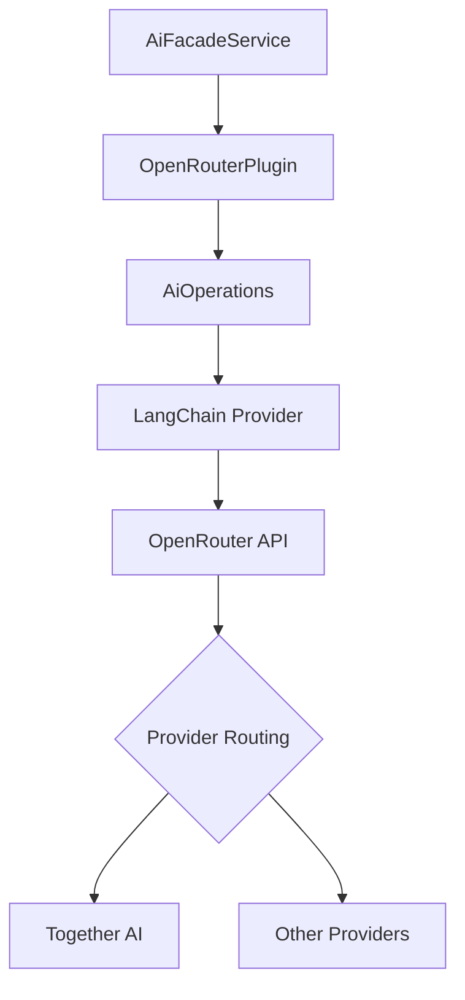

# Together AI Models via OpenRouter

Ever Works does not include a standalone Together AI plugin. Together AI models -- including open-source models like Llama, Mistral, and Qwen -- are accessed through the **OpenRouter** plugin. This page explains how to configure and use Together AI models for work generation.

**Related source files:**

| File                                                                                 | Purpose                                 |
| ------------------------------------------------------------------------------------ | --------------------------------------- |
| `packages/plugins/openrouter/src/openrouter.plugin.ts`                               | OpenRouter AI provider plugin           |
| `packages/plugin/src/ai/reasoning.utils.ts`                                          | Reasoning config for open-source models |
| `apps/internal-cli/src/commands/config/ai-providers/ai-provider-registry.service.ts` | Provider registry with model lists      |

## What is Together AI?

Together AI is a cloud platform for running open-source AI models. It provides fast inference for popular models such as Meta Llama, Mistral, Qwen, and others. Through OpenRouter, these models become available in Ever Works without any additional plugin.

## Available Models

Together AI models are available on OpenRouter with the `together/` or provider-specific prefixes:

| Model ID (OpenRouter)               | Base Model       | Description                    |
| ----------------------------------- | ---------------- | ------------------------------ |
| `meta-llama/llama-3.3-70b-instruct` | Llama 3.3 70B    | High-quality open-source model |
| `meta-llama/llama-4-scout`          | Llama 4 Scout    | Latest Llama generation        |
| `meta-llama/llama-4-maverick`       | Llama 4 Maverick | Large-context Llama 4 variant  |
| `mistralai/mistral-large`           | Mistral Large    | Strong multilingual model      |
| `qwen/qwen-2.5-72b-instruct`        | Qwen 2.5 72B     | Competitive open-source model  |

:::note
Together AI hosts many open-source models. OpenRouter may route to Together AI or another provider based on availability and cost. Check [openrouter.ai/models](https://openrouter.ai/models) for current availability.
:::

## Configuration

### Setting Up Together AI Models

1. Navigate to **Settings > Plugins** in the Ever Works dashboard.
2. Ensure the **OpenRouter** plugin is enabled.
3. Enter your OpenRouter API key.
4. Set model fields to open-source model IDs:

| Setting              | Recommended Value                        |
| -------------------- | ---------------------------------------- |
| Default Model        | `meta-llama/llama-3.3-70b-instruct`      |
| Simple Tasks Model   | `meta-llama/llama-3.3-70b-instruct:free` |
| Standard Tasks Model | `meta-llama/llama-3.3-70b-instruct`      |
| Complex Tasks Model  | `meta-llama/llama-4-maverick`            |

### Environment Variables

```bash
PLUGIN_OPENROUTER_API_KEY=sk-or-...
PLUGIN_OPENROUTER_DEFAULT_MODEL=meta-llama/llama-3.3-70b-instruct
PLUGIN_OPENROUTER_SIMPLE_MODEL=meta-llama/llama-3.3-70b-instruct:free
PLUGIN_OPENROUTER_COMPLEX_MODEL=meta-llama/llama-4-maverick
```

### Free Models

OpenRouter offers some models with a `:free` suffix (e.g., `meta-llama/llama-3.3-70b-instruct:free`). These use donated compute and have rate limits, but cost nothing. They are suitable for simple pipeline tasks like tag generation and short descriptions.

## Architecture



OpenRouter automatically selects the best provider for each model request. When you specify a model like `meta-llama/llama-3.3-70b-instruct`, OpenRouter may route to Together AI, Fireworks AI, or another provider hosting that model, depending on availability and cost.

## Tiered Model Strategy

Open-source models from Together AI work well in cost-optimized configurations:

| Tier     | Use Case              | Recommended Model                        | Cost     |
| -------- | --------------------- | ---------------------------------------- | -------- |
| Simple   | Tags, classifications | `meta-llama/llama-3.3-70b-instruct:free` | Free     |
| Standard | Summaries, listings   | `meta-llama/llama-3.3-70b-instruct`      | Low      |
| Complex  | Full page generation  | `meta-llama/llama-4-maverick`            | Moderate |

### Mixing with Commercial Models

You can combine open-source models for cost-sensitive tasks with commercial models for quality-critical tasks:

| Tier     | Model                                    | Provider               | Cost Level |
| -------- | ---------------------------------------- | ---------------------- | ---------- |
| Simple   | `meta-llama/llama-3.3-70b-instruct:free` | Meta (via Together AI) | Free       |
| Standard | `openai/gpt-4o`                          | OpenAI                 | Moderate   |
| Complex  | `anthropic/claude-sonnet-4`              | Anthropic              | Higher     |

## Capabilities

| Capability        | Llama 3.3 70B | Llama 4 Scout/Maverick |
| ----------------- | ------------- | ---------------------- |
| Structured output | Yes           | Yes                    |
| Streaming         | Yes           | Yes                    |
| Tool calling      | Yes           | Yes                    |
| Vision            | No            | Model-dependent        |
| Embeddings        | No            | No                     |

### Embedding Limitation

Open-source models on Together AI generally do not provide embedding endpoints through OpenRouter. If your workflow requires embeddings for semantic search:

- Use the **OpenAI** plugin for embeddings alongside Together AI models for generation.
- Or use the **Ollama** plugin with a local embedding model.
- Or use the **Google Gemini** plugin which includes embedding support.

## Alternative: Local Models via Ollama

If you prefer to run open-source models locally instead of through Together AI, the **Ollama** plugin provides direct access:

| Approach         | Together AI (via OpenRouter)  | Ollama (Local)              |
| ---------------- | ----------------------------- | --------------------------- |
| Hosting          | Cloud (Together AI servers)   | Self-hosted                 |
| API key          | OpenRouter API key required   | No API key needed           |
| Cost             | Per-token pricing (some free) | Free (your hardware)        |
| Speed            | Fast (datacenter GPUs)        | Depends on local hardware   |
| Privacy          | Data sent to cloud            | Data stays local            |
| Available models | Wide selection                | Any Ollama-compatible model |

## Troubleshooting

| Issue                      | Cause                                             | Solution                                                              |
| -------------------------- | ------------------------------------------------- | --------------------------------------------------------------------- |
| Model not available        | Model removed or renamed on OpenRouter            | Check current model list at openrouter.ai                             |
| Rate limited on free model | Free tier has strict rate limits                  | Switch to paid model or wait                                          |
| Poor output quality        | Model not suited for task                         | Try a larger model or commercial alternative                          |
| Timeout on large requests  | Open-source models may be slower for long outputs | Reduce `maxTokens` or use a faster model                              |
| JSON parsing errors        | Some models have weaker structured output         | Enable structured output mode or use a model with better JSON support |

## Further Reading

- [OpenRouter Plugin](./openrouter-plugin.md) -- full OpenRouter configuration
- [Ollama Plugin](./ollama-plugin.md) -- running open-source models locally
- [Groq Plugin](./groq-plugin.md) -- fast inference for open-source models
- [AI Provider Plugins](./ai-provider-plugins.md) -- all AI provider options
