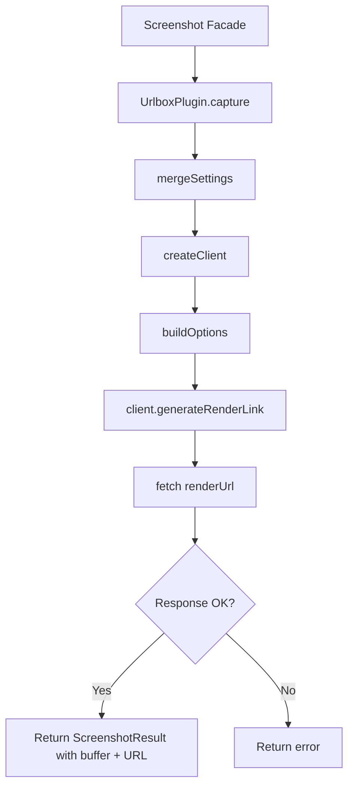

# Urlbox Plugin

The Urlbox plugin captures website screenshots using the [Urlbox API](https://urlbox.com). It generates preview images for directory items during the generation pipeline, with support for retina rendering, image quality control, and automatic cookie banner removal.

**Source:** `packages/plugins/urlbox/src/urlbox.plugin.ts`

## Overview

| Property | Value |
|---|---|
| Plugin ID | `urlbox` |
| Category | `screenshot` |
| Capabilities | `screenshot` |
| Version | `1.0.0` |
| Configuration Mode | `hybrid` |
| Auto-enable | No |
| Built-in | No |
| System Plugin | No |
| Dependencies | `urlbox` |

The plugin implements `IPlugin` and `IScreenshotPlugin`. It uses the official `urlbox` npm package to generate render links and download the resulting images.

## Architecture



### Render Link Flow

Urlbox uses a two-step approach:

1. **Generate render link** -- the SDK builds a URL that encodes all capture options (viewport, format, quality, etc.) and signs it with the API secret
2. **Fetch the image** -- the plugin makes a standard `fetch()` request to the render link, which triggers Urlbox to capture the screenshot and return the image

## Configuration

### Settings Schema

| Setting | Type | Required | Default | Scope | Description |
|---|---|---|---|---|---|
| `apiKey` | `string` | Yes | -- | `user` | Urlbox API key (secret) |
| `apiSecret` | `string` | No | -- | `user` | API secret for signed render links (secret) |
| `viewportWidth` | `number` | No | `1280` | -- | Viewport width in pixels (320--3840) |
| `viewportHeight` | `number` | No | `1024` | -- | Viewport height in pixels (200--2160) |
| `format` | `string` | No | `"png"` | -- | Image format: `png`, `jpg`, `jpeg`, or `webp` |
| `fullPage` | `boolean` | No | `false` | -- | Capture the full scrollable page |
| `quality` | `number` | No | `80` | -- | Image quality for lossy formats (1--100) |
| `retina` | `boolean` | No | `false` | -- | Enable retina/HiDPI rendering (2x scale) |
| `blockAds` | `boolean` | No | `true` | -- | Block ads during capture |
| `hideCookieBanners` | `boolean` | No | `true` | -- | Hide cookie consent banners |

### Environment Variables

| Variable | Description |
|---|---|
| `PLUGIN_URLBOX_API_KEY` | API key fallback |
| `PLUGIN_URLBOX_API_SECRET` | API secret fallback |
| `PLUGIN_URLBOX_VIEWPORT_WIDTH` | Viewport width fallback |
| `PLUGIN_URLBOX_VIEWPORT_HEIGHT` | Viewport height fallback |
| `PLUGIN_URLBOX_FORMAT` | Image format fallback |

### Settings Resolution

API keys are resolved through the standard 4-level hierarchy:

1. Directory settings (highest priority)
2. User settings
3. Admin settings
4. Environment variables (lowest priority)

## Features

### Screenshot Capture

```typescript
async capture(options: ScreenshotOptions): Promise<ScreenshotResult>
```

Generates a render link, fetches the screenshot, and returns the image as a `Buffer`, base64 string, and URL. Per-call options override plugin-level defaults.

### URL Generation

```typescript
async getScreenshotUrl(options: ScreenshotOptions): Promise<string | null>
```

Generates a render link URL without downloading the image. Useful for embedding screenshot URLs directly in content.

### Credential Validation

```typescript
async validateCredentials(): Promise<ScreenshotValidationResult>
```

Verifies API credentials by generating a test render link and checking that it points to `api.urlbox.com`.

### Image Quality Control

The `quality` setting (1--100) controls compression for lossy formats like JPG and WebP. Higher values produce better quality at larger file sizes. This setting has no effect on PNG format.

### Retina Rendering

When `retina` is enabled, Urlbox renders the page at 2x device pixel ratio. This produces sharper images on HiDPI displays but doubles the image dimensions and increases file size.

### Cookie Banner Hiding

Cookie consent banners are hidden by default (`hideCookieBanners: true`). This is mapped to the `hide_cookie_banners` option in the Urlbox SDK's `RenderOptions`.

### Render Delay and Selector Waiting

- `delay` -- wait a specified number of milliseconds before capturing
- `waitForSelector` -- mapped to the `selector` render option, waits until a specific element appears

### Supported Formats

- `png` -- lossless, best for UI screenshots
- `jpg` / `jpeg` -- lossy, smaller file size
- `webp` -- modern format with excellent compression

### Maximum Dimensions

The maximum viewport dimensions are 3840 x 2160 pixels (4K UHD).

## Render Options Mapping

The plugin maps `ScreenshotOptions` to Urlbox `RenderOptions`:

| Plugin Option | Urlbox RenderOption | Notes |
|---|---|---|
| `viewportWidth` | `width` | Viewport width |
| `viewportHeight` | `height` | Viewport height |
| `format` | `format` | Cast to `RenderOptions['format']` |
| `fullPage` | `full_page` | Full page capture |
| `blockAds` | `block_ads` | Ad blocking |
| `blockCookieBanners` | `hide_cookie_banners` | Cookie banner removal |
| `delay` | `delay` | Milliseconds before capture |
| `waitForSelector` | `selector` | CSS selector to wait for |
| `userAgent` | `user_agent` | Custom user agent string |

## Usage in Pipelines

During directory generation, the screenshot facade sends capture requests to Urlbox for items that have a source URL. The resulting images are stored as item preview thumbnails.

## Comparison with ScreenshotOne

| Feature | Urlbox | ScreenshotOne |
|---|---|---|
| SDK | `urlbox` | `screenshotone-api-sdk` |
| Default viewport | 1280 x 1024 | 1280 x 800 |
| Quality control | Yes (1--100 slider) | No |
| Retina rendering | Boolean toggle (2x) | Device scale factor (0.5--3) |
| Cookie banner blocking | Default enabled | Per-request |
| Tracker blocking | No | Yes |
| Ad blocking | Yes | Yes |
| Server-side caching | No | Yes (with TTL) |
| Supported formats | PNG, JPG, JPEG, WebP | PNG, JPG, JPEG, WebP |
| Max dimensions | 3840 x 2160 | 3840 x 2160 |

Urlbox provides a quality slider and simple retina toggle. ScreenshotOne offers more granular device scale factor control, tracker blocking, and built-in server-side caching.

## API Reference

### Class: `UrlboxPlugin`

```typescript
class UrlboxPlugin implements IPlugin, IScreenshotPlugin {
  readonly id: 'urlbox';
  readonly category: 'screenshot';

  capture(options: ScreenshotOptions): Promise<ScreenshotResult>;
  getScreenshotUrl(options: ScreenshotOptions): Promise<string | null>;
  validateCredentials(): Promise<ScreenshotValidationResult>;
  getSupportedFormats(): readonly ScreenshotFormat[];
  getMaxDimensions(): { width: number; height: number };
}
```

### ScreenshotResult Fields

| Field | Description |
|---|---|
| `success` | Whether capture succeeded |
| `imageBuffer` | Raw image data as a Buffer |
| `imageBase64` | Base64-encoded image string |
| `imageUrl` | The render link URL |
| `width` | Viewport width used |
| `height` | Viewport height used |
| `fileSize` | Image file size in bytes |
| `error` | Error message (on failure) |

## Getting Started

1. Sign up at [urlbox.com](https://urlbox.com)
2. Copy your API key and API secret
3. Enable the Urlbox plugin on the Plugins page
4. Enter your credentials in the plugin settings
5. Select Urlbox as the screenshot provider for your directory

## Troubleshooting

| Issue | Cause | Solution |
|---|---|---|
| "API key not configured" | Missing credentials | Set the API key in plugin settings or via environment variable |
| Blank or incomplete screenshots | Page loads dynamic content | Use the `delay` option or `waitForSelector` |
| Cookie banners in screenshots | `hideCookieBanners` disabled | Set `hideCookieBanners` to `true` (default) |
| Blurry images | Retina mode disabled | Enable `retina` for HiDPI output |
| Large file sizes | High quality + retina | Lower `quality` value or disable `retina` |
| Render failed with status 4xx | Invalid API key or quota exceeded | Verify credentials and check Urlbox dashboard for usage |
