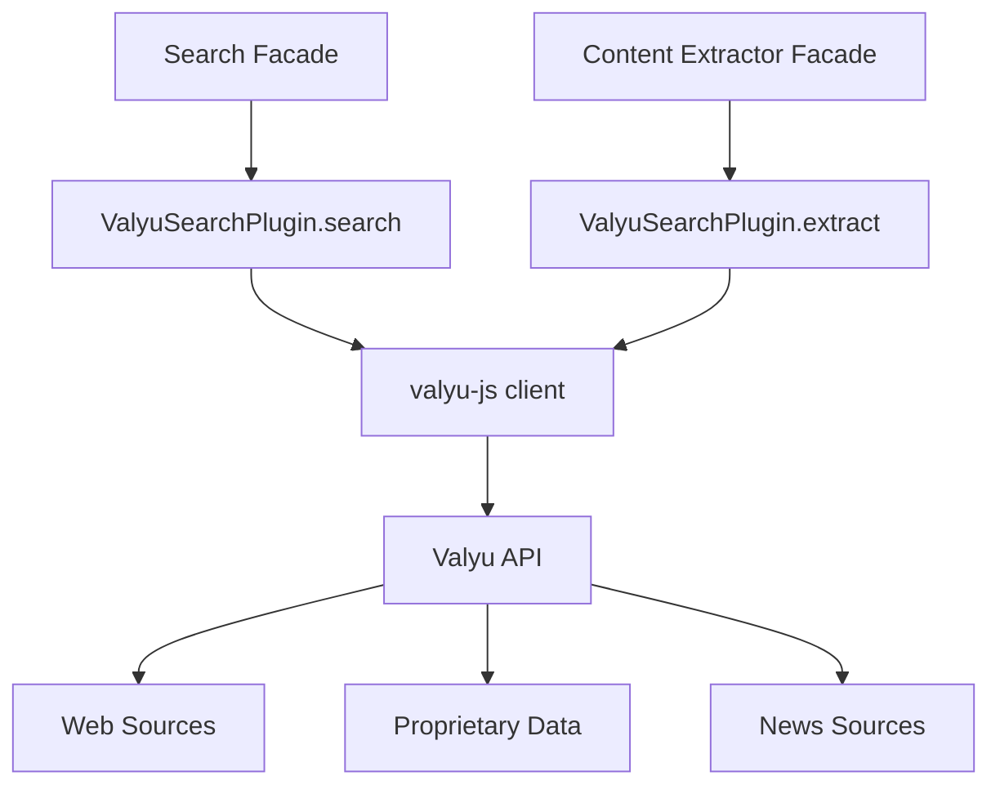

# Valyu Plugin

The Valyu plugin provides AI-native search and content extraction across web and proprietary data sources using the [Valyu API](https://valyu.ai). It is a dual-capability plugin that serves as both a search provider and a content extractor through a single API key.

**Source:** `packages/plugins/valyu/src/valyu.plugin.ts`

## Overview

| Property           | Value                         |
| ------------------ | ----------------------------- |
| Plugin ID          | `valyu`                       |
| Category           | `search`                      |
| Capabilities       | `search`, `content-extractor` |
| Version            | `1.0.0`                       |
| Configuration Mode | `hybrid`                      |
| Auto-enable        | No                            |
| Built-in           | Yes                           |
| System Plugin      | No                            |
| Dependencies       | `valyu-js`                    |

The plugin implements `IPlugin`, `ISearchPlugin`, and `IContentExtractorPlugin`. This dual-capability design means a single Valyu API key provides both search and content extraction, reducing the number of services you need to configure.

## Architecture



### Dual-Capability Design

Unlike most plugins that serve a single role, the Valyu plugin registers for two capabilities:

- **Search** -- discovers relevant URLs and content for work items
- **Content extraction** -- pulls full text and markdown from web pages

Both capabilities share the same API client and credentials.

## Configuration

### Settings Schema

| Setting          | Type     | Required | Default    | Scope  | Description               |
| ---------------- | -------- | -------- | ---------- | ------ | ------------------------- |
| `apiKey`         | `string` | Yes      | --         | `user` | Valyu API key (secret)    |
| `responseLength` | `string` | No       | `"medium"` | --     | Content volume per result |

### Response Length Options

| Value    | Approximate Characters |
| -------- | ---------------------- |
| `short`  | ~25,000                |
| `medium` | ~50,000                |
| `large`  | ~100,000               |
| `max`    | Unlimited              |

### Environment Variables

| Variable               | Description      |
| ---------------------- | ---------------- |
| `PLUGIN_VALYU_API_KEY` | API key fallback |

## Search

### Search Method

```typescript
async search(options: SearchOptions): Promise<SearchResponse>
```

Searches across all Valyu data sources (web, proprietary, and news) using `searchType: 'all'`. Results include titles, URLs, content snippets, relevance scores, and publication dates.

### Search Options

The plugin maps standard `SearchOptions` to Valyu-specific parameters:

| SearchOptions Field | Valyu Parameter         | Description                      |
| ------------------- | ----------------------- | -------------------------------- |
| `query`             | First argument          | The search query string          |
| `limit`             | `maxNumResults`         | Maximum results (default: 20)    |
| `includeDomains`    | `includedSources`       | Restrict to specific domains     |
| `excludeDomains`    | `excludeSources`        | Exclude specific domains         |
| `region`            | `countryCode`           | Country code filter (uppercased) |
| `timeRange`         | `startDate` / `endDate` | Date range filter                |

### Time Range Filtering

The plugin converts the standard `timeRange` values to date ranges:

| Time Range | Start Date  |
| ---------- | ----------- |
| `day`      | 1 day ago   |
| `week`     | 7 days ago  |
| `month`    | 1 month ago |
| `year`     | 1 year ago  |
| `all`      | No filter   |

### Search Result Fields

Each result includes:

| Field                     | Description              |
| ------------------------- | ------------------------ |
| `title`                   | Page title               |
| `url`                     | Source URL               |
| `snippet`                 | Content excerpt          |
| `position`                | Result ranking (1-based) |
| `publishedDate`           | Publication date         |
| `metadata.relevanceScore` | Valyu relevance score    |
| `metadata.source`         | Source identifier        |
| `metadata.description`    | Source description       |

## Content Extraction

### Single URL Extraction

```typescript
async extract(options: ContentExtractionOptions): Promise<ContentExtractionResult>
```

Extracts content from a single URL using the Valyu `contents()` API. Returns the extracted text as both plain content and markdown.

### Batch Extraction

```typescript
async extractBatch(
    urls: readonly string[],
    options?: Partial<ContentExtractionOptions>
): Promise<readonly ContentExtractionResult[]>
```

Processes URLs in batches of **10** using the Valyu `contents()` API. This is more efficient than sequential extraction because the API handles multiple URLs in a single request. If the batch call fails, all URLs in that batch return errors.

### URL Filtering

The `canExtract()` method accepts any HTTP or HTTPS URL, making Valyu a general-purpose content extractor.

## Usage in Pipelines

During work generation, the search facade uses Valyu to:

1. **Find information** about each item via search queries
2. **Discover source URLs** for items that need them
3. **Extract content** from web pages for enrichment

Valyu is particularly useful when your work covers academic or specialized topics, since it can pull from proprietary data sources like arXiv and PubMed.

## Comparison with Other Search Plugins

| Feature                  | Valyu              | Tavily       | Exa                | SerpAPI      |
| ------------------------ | ------------------ | ------------ | ------------------ | ------------ |
| Search                   | Yes                | Yes          | Yes                | Yes          |
| Content extraction       | Yes (dual)         | Yes (dual)   | No                 | No           |
| Proprietary data sources | Yes                | No           | No                 | No           |
| News search              | Yes (included)     | No           | Yes (category)     | Yes (engine) |
| AI-optimized results     | Yes                | Yes          | Yes                | No           |
| Response length control  | Yes (4 levels)     | No           | No                 | No           |
| Domain filtering         | Include or exclude | Include only | Include or exclude | Site prefix  |
| Date filtering           | Date range         | No           | No                 | No           |
| Relevance scoring        | Yes                | Yes          | Yes                | No           |
| Batch extraction         | Yes (groups of 10) | No           | No                 | No           |

Valyu stands out with its multi-source search across web, proprietary, and news data, along with configurable response length. Tavily offers a similar dual-capability design but without proprietary data access.

## API Reference

### Class: `ValyuSearchPlugin`

```typescript
class ValyuSearchPlugin implements IPlugin, ISearchPlugin, IContentExtractorPlugin {
	readonly id: 'valyu';
	readonly category: 'search';

	search(options: SearchOptions): Promise<SearchResponse>;
	extract(options: ContentExtractionOptions): Promise<ContentExtractionResult>;
	extractBatch(
		urls: readonly string[],
		options?: Partial<ContentExtractionOptions>
	): Promise<readonly ContentExtractionResult[]>;
	canExtract(url: string): Promise<boolean>;
	getSupportedFormats(): readonly ('text' | 'html' | 'markdown')[];
	getRateLimitInfo(): Promise<RateLimitInfo>;
}
```

## Getting Started

1. Create an account at [valyu.ai](https://valyu.ai)
2. Copy your API key from the Valyu dashboard
3. Enable the Valyu plugin on the Plugins page
4. Enter the API key in the plugin settings
5. Select Valyu as the search provider and/or content extractor for your work

## Troubleshooting

| Issue                             | Cause                                     | Solution                                                       |
| --------------------------------- | ----------------------------------------- | -------------------------------------------------------------- |
| "API key not configured"          | Missing credentials                       | Set the API key in plugin settings or via environment variable |
| No search results                 | Query too specific or restrictive filters | Broaden the query or remove domain/date filters                |
| Empty content extraction          | Target page blocks automated access       | Try a different content extractor (e.g., Firecrawl)            |
| Batch extraction partial failures | Some URLs are inaccessible                | Check individual result `success` fields for per-URL status    |
| Large response sizes              | `responseLength` set too high             | Use `"short"` or `"medium"` for faster responses               |
