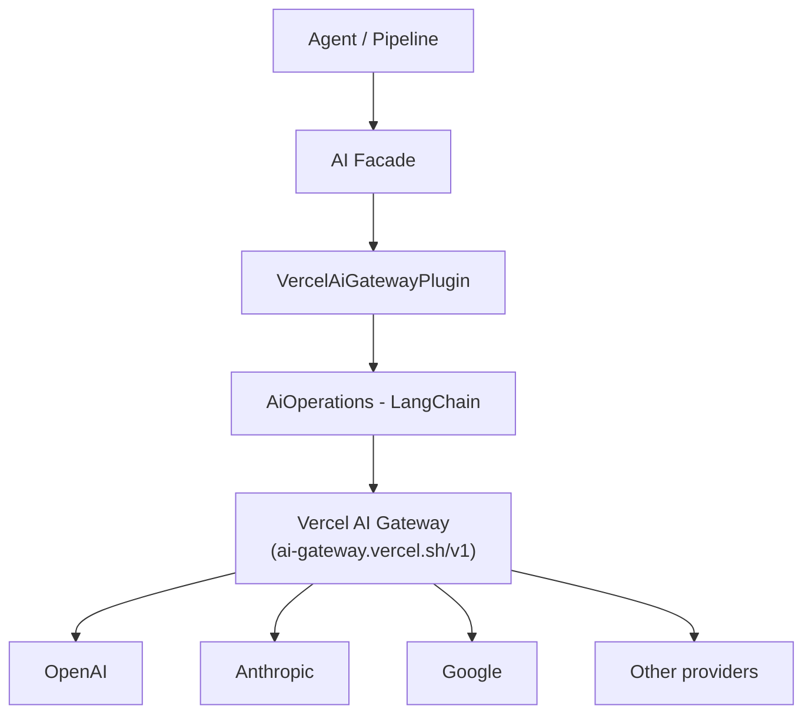

# Vercel AI Gateway Plugin

The Vercel AI Gateway plugin provides AI capabilities through the [Vercel AI Gateway](https://vercel.com/docs/ai-gateway), a unified API endpoint that gives access to models from multiple providers (OpenAI, Anthropic, Google, and others) through a single OpenAI-compatible interface.

**Source:** `packages/plugins/vercel-ai-gateway/src/vercel-ai-gateway.plugin.ts`

## Overview

| Property | Value |
|---|---|
| Plugin ID | `vercel-ai-gateway` |
| Category | `ai-provider` |
| Capabilities | `ai-provider` |
| Version | `1.0.0` |
| Configuration Mode | `hybrid` |
| Auto-enable | No |
| System plugin | No |
| Visibility | `public` |
| Dependencies | `@langchain/openai`, `@langchain/core` |

The plugin extends `BaseAiProvider` from `@ever-works/plugin/abstract` and uses `AiOperations` from `@ever-works/plugin/ai` for all AI operations. It communicates through the OpenAI-compatible protocol, which means it works with any model accessible through the Vercel AI Gateway.

## Architecture



### OpenAI-Compatible Protocol

The Vercel AI Gateway exposes an OpenAI-compatible API at `https://ai-gateway.vercel.sh/v1`. This means:

- All requests use the same format as OpenAI API calls.
- Model names use the `provider/model` format (e.g., `openai/gpt-4o`, `anthropic/claude-sonnet-4-20250514`).
- The plugin delegates to `AiOperations` with `providerType: 'openai'`.

## Configuration

### Settings Schema

| Setting | Type | Required | Default | Scope | Description |
|---|---|---|---|---|---|
| `apiKey` | `string` | Yes | -- | `user` | Vercel AI Gateway API key (secret) |
| `defaultModel` | `string` | Yes | `openai/gpt-5.1` | `global` | Model for all AI tasks (unless tier-specific) |
| `simpleModel` | `string` | No | `openai/gpt-5-nano` | `global` | Model for tags, short descriptions |
| `mediumModel` | `string` | No | `openai/gpt-4o` | `global` | Model for listings, summaries |
| `complexModel` | `string` | No | `openai/gpt-5.1` | `global` | Model for full page generation |
| `baseUrl` | `string` | No | `https://ai-gateway.vercel.sh/v1` | -- | Custom endpoint (hidden) |
| `temperature` | `number` | No | `0.7` | -- | Generation temperature 0--2 (hidden) |
| `maxTokens` | `number` | No | `4096` | -- | Max response tokens (hidden) |

### Environment Variables

| Variable | Description |
|---|---|
| `PLUGIN_VERCEL_AI_GATEWAY_API_KEY` | API key fallback |
| `PLUGIN_VERCEL_AI_GATEWAY_DEFAULT_MODEL` | Default model fallback |
| `PLUGIN_VERCEL_AI_GATEWAY_SIMPLE_MODEL` | Simple model fallback |
| `PLUGIN_VERCEL_AI_GATEWAY_MEDIUM_MODEL` | Medium model fallback |
| `PLUGIN_VERCEL_AI_GATEWAY_COMPLEX_MODEL` | Complex model fallback |
| `PLUGIN_VERCEL_AI_GATEWAY_BASE_URL` | Base URL fallback |

### Three-Tier Model System

The plugin supports assigning different models to different task complexities, optimizing cost and quality:

| Tier | Setting | Handles | Recommended Model |
|---|---|---|---|
| **Simple** | `simpleModel` | Tags, short descriptions, classifications | Fast, inexpensive model |
| **Standard** | `mediumModel` | Listings, summaries, content reformatting | Balanced model |
| **Complex** | `complexModel` | Full page generation, multi-step analysis | Most capable model |

If a tier-specific model is not set, the `defaultModel` is used as a fallback for all tasks.

## AI Capabilities

### Supported Features

| Capability | Supported |
|---|---|
| Chat completion | Yes |
| Streaming | Yes |
| Structured output | Yes |
| Tool calling | Yes |
| Vision | No |
| Embeddings | Yes |
| Max context length | 128,000 tokens |

### Chat Completion

```typescript
async createChatCompletion(options: ChatCompletionOptions): Promise<ChatCompletionResponse>
```

Sends a chat completion request through the AI Gateway. Settings are resolved from the plugin configuration and merged with per-call options.

### Streaming Chat Completion

```typescript
async *createStreamingChatCompletion(options: ChatCompletionOptions): AsyncIterable<ChatCompletionChunk>
```

Provides streaming responses for real-time output. The AI facade can use this for progressive content generation in the pipeline.

### Embeddings

```typescript
async createEmbedding(options: EmbeddingOptions): Promise<EmbeddingResponse>
```

Generates text embeddings using the configured model. Embeddings are used for semantic similarity and search operations.

### Model Listing

```typescript
async listModels(settings?: PluginSettings): Promise<readonly AiModel[]>
```

Lists available models from the AI Gateway. This powers the model selection UI in the admin panel.

### Connection Testing

```typescript
async isAvailable(settings?: PluginSettings): Promise<boolean>
```

Tests whether the AI Gateway is reachable and the API key is valid by making a test connection.

## Comparison with Other AI Providers

| Feature | Vercel AI Gateway | OpenAI | Anthropic | Google AI |
|---|---|---|---|---|
| Multi-provider access | Yes (unified) | OpenAI only | Anthropic only | Google only |
| API compatibility | OpenAI-compatible | Native | Native | Native |
| Model switching | Change model name | Change provider | Change provider | Change provider |
| Account management | Single API key | Per-provider | Per-provider | Per-provider |
| Vercel integration | Native | Manual | Manual | Manual |
| Vision support | Depends on model | Yes | Yes | Yes |
| Custom endpoints | Yes (`baseUrl`) | Yes | No | No |

The Vercel AI Gateway is ideal when you want to experiment with models from different providers without managing separate accounts. Dedicated provider plugins (OpenAI, Anthropic, Google) offer deeper integration with provider-specific features like vision and advanced tool calling.

## Settings Resolution

The plugin overrides the `resolveConfig()` method from `BaseAiProvider` to merge settings:

```typescript
protected override resolveConfig(settings?: PluginSettings): Partial<AiOperationsConfig> {
    const config: Partial<AiOperationsConfig> = {};
    if (s.apiKey && typeof s.apiKey === 'string') config.apiKey = s.apiKey;
    if (s.baseUrl && typeof s.baseUrl === 'string') config.baseURL = s.baseUrl;
    if (typeof s.temperature === 'number') config.temperature = s.temperature;
    if (typeof s.maxTokens === 'number') config.maxTokens = s.maxTokens;
    return config;
}
```

This ensures that only valid, typed values are forwarded to the underlying LangChain operations.

## Getting Started

1. Set up Vercel AI Gateway in your [Vercel dashboard](https://vercel.com/docs/ai-gateway).
2. Generate an API key from the AI Gateway settings.
3. Enable the Vercel AI Gateway plugin.
4. Enter the API key in the plugin settings.
5. Select models for each complexity tier using the `provider/model` format.
6. Set this plugin as the active AI provider for your directory.

## Troubleshooting

| Issue | Cause | Solution |
|---|---|---|
| "Plugin not loaded" | `onLoad` not called | Restart the plugin or server |
| Connection test fails | Invalid API key or network issue | Verify the key and check connectivity to `ai-gateway.vercel.sh` |
| Model not found | Invalid model name format | Use `provider/model` format (e.g., `openai/gpt-4o`) |
| Slow responses | Large `maxTokens` or complex model | Reduce `maxTokens` or use a faster model for simple tasks |
| Unexpected model behavior | Temperature too high | Lower `temperature` toward 0 for more consistent output |
