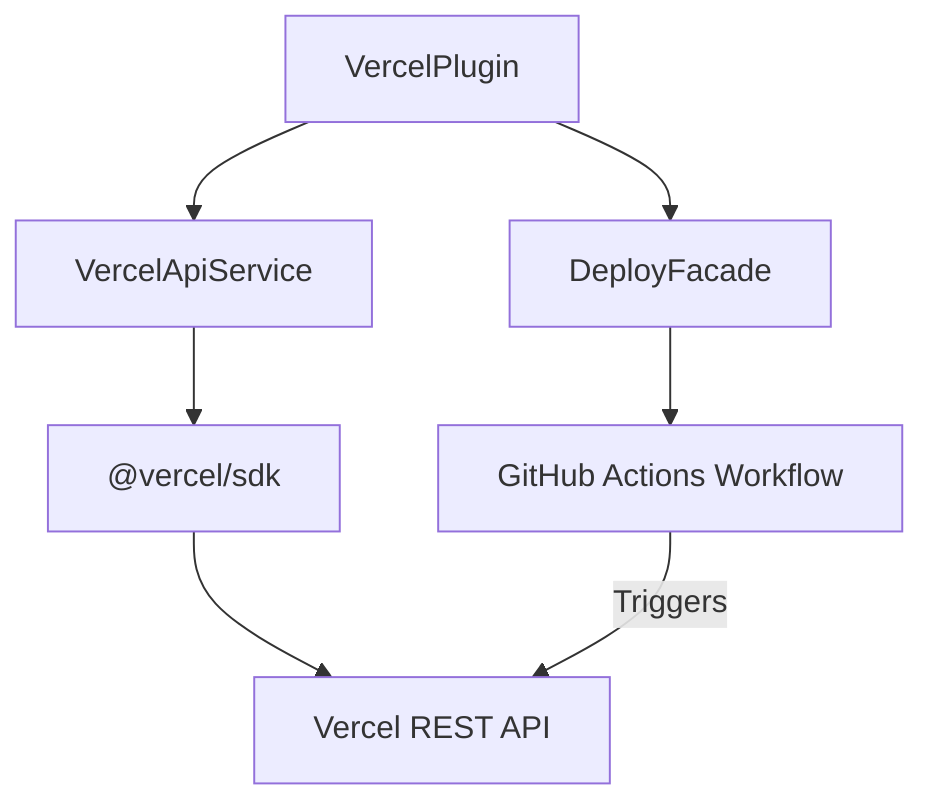
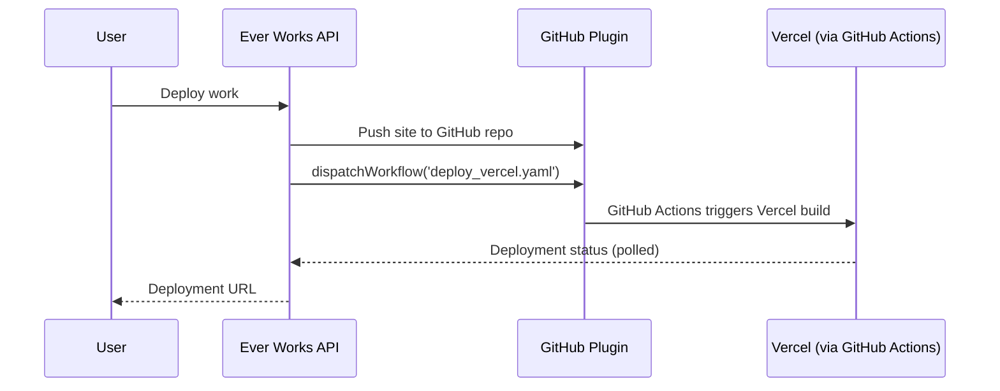
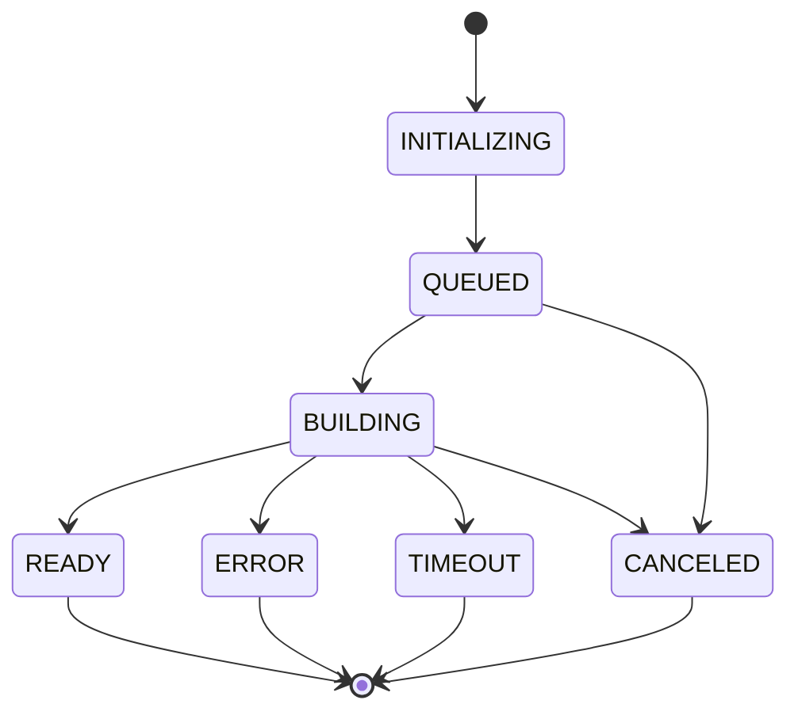

# Vercel Deployment Plugin

The Vercel plugin enables one-click publishing of works as live websites on [Vercel](https://vercel.com). It integrates with the Vercel API to manage projects, track deployments, and look up existing sites.

**Source:** `packages/plugins/vercel/src/`

## Overview

| Property           | Value                   |
| ------------------ | ----------------------- |
| Plugin ID          | `vercel`                |
| Category           | `deployment`            |
| Capabilities       | `deployment`            |
| Version            | `1.0.0`                 |
| Configuration Mode | `user-required`         |
| System Plugin      | Yes                     |
| Auto-enable        | Yes                     |
| Visibility         | `user-only`             |
| Default for        | `deployment` capability |

The plugin implements `IPlugin` and `IDeploymentPlugin`. It is the default deployment provider and is automatically enabled for all users.

## Architecture



The Vercel plugin does not directly deploy code. Instead, deployment is orchestrated through GitHub Actions: the platform pushes content to a GitHub repository and triggers a workflow that builds and deploys to Vercel.

## Configuration

### Settings Schema

| Setting            | Type     | Required | Scope  | Description                                                            |
| ------------------ | -------- | -------- | ------ | ---------------------------------------------------------------------- |
| `apiToken`         | `string` | Yes      | `user` | Personal Vercel API token. Marked as secret.                           |
| `defaultTeamScope` | `string` | No       | `user` | Default Vercel team for deployments. Leave empty for personal account. |

### Obtaining a Token

1. Go to [vercel.com/account/tokens](https://vercel.com/account/tokens).
2. Create a new token with the required permissions.
3. Enter it in the plugin settings.

Users must provide their own Vercel token (`configurationMode: 'user-required'`).

## Deployment Flow

The `deploy()` method returns a pending result because actual deployment is handled through the GitHub Actions workflow:



## API Service

The `VercelApiService` wraps the `@vercel/sdk` for all Vercel API interactions.

### Token Validation

```typescript
async validateToken(token: string): Promise<VercelUser | null>
```

Validates a token by calling `vercel.user.getAuthUser()`. Returns user info or `null` on failure.

### Teams

```typescript
async getTeams(token: string): Promise<VercelTeam[]>
```

Returns the teams the authenticated user belongs to:

```typescript
interface VercelTeam {
	id: string;
	slug: string;
	name: string | null;
	createdAt?: number;
}
```

### Projects

```typescript
async getProjects(token: string, options?: {
  search?: string;
  teamScope?: string;
  limit?: number;
}): Promise<VercelProject[]>
```

Lists projects with optional search and team filtering. Default limit is 100.

### Project Domains

```typescript
async getProjectDomains(projectId: string, token: string, teamScope?: string):
  Promise<Array<{ name: string; verified: boolean }>>
```

Returns domains associated with a project, distinguishing between custom domains and `.vercel.app` domains.

### Deployments

```typescript
async getDeployments(projectId: string, token: string, options?: {
  teamScope?: string;
  limit?: number;
}): Promise<VercelDeployment[]>
```

Lists deployments for a project, each with:

```typescript
interface VercelDeployment {
	uid: string;
	name: string;
	url?: string;
	readyState?: VercelDeploymentState;
	createdAt?: number;
	alias?: string[];
}
```

### Deployment States

```typescript
type VercelDeploymentState = 'BUILDING' | 'ERROR' | 'INITIALIZING' | 'QUEUED' | 'READY' | 'CANCELED' | 'TIMEOUT';
```

### Deployment Lookup

The plugin provides two lookup methods:

**By project name:**

```typescript
async lookupProject(projectName: string, token: string, teamScope?: string):
  Promise<{ found: boolean; project?: VercelProject; website?: string; deploymentState?: string }>
```

Searches for a project, gets its domains and latest deployment, and returns the best website URL (preferring custom domains over `.vercel.app`).

**Across all scopes:**

```typescript
async lookupDeploymentAcrossScopes(projectName: string, token: string,
  matcher: (project: VercelProject) => boolean):
  Promise<{ found: boolean; website?: string; deploymentState?: string; teamScope?: string }>
```

Searches the personal account and all teams the user belongs to, returning the first match.

## Plugin Methods

### IDeploymentPlugin Interface

| Method                                              | Description                                                                   |
| --------------------------------------------------- | ----------------------------------------------------------------------------- |
| `deploy(config, token)`                             | Returns a pending deployment result. Actual deployment is via GitHub Actions. |
| `getDeploymentStatus(id, token)`                    | Returns pending status. Actual tracking is done by the verifier service.      |
| `validateToken(token)`                              | Validates the Vercel API token.                                               |
| `getTeams(token)`                                   | Lists user's Vercel teams.                                                    |
| `listProjects(token)`                               | Lists projects under the default team scope.                                  |
| `getProject(projectId, token)`                      | Gets a specific project by ID.                                                |
| `lookupExistingDeployment(name, token, teamScope?)` | Finds existing deployment for a work.                                    |
| `getAuthenticatedUser(token)`                       | Returns username and email for the token.                                     |

### Direct API Access

The plugin exposes its internal API service for use by platform facades:

```typescript
getApiService(): VercelApiService
```

This allows the `DeployFacade` and other services to use Vercel API methods directly when needed.

## Error Handling

The API service handles errors gracefully:

- Invalid tokens return `null` or empty arrays instead of throwing.
- SDK response quirks (data in `rawValue`) are handled with try/catch fallbacks.
- All get methods return empty defaults on failure.

## Project Type

```typescript
interface VercelProject {
	id: string;
	name: string;
	link?: {
		type?: string;
		repo?: string;
		org?: string;
		repoId?: number;
		deployHooks?: unknown[];
		productionBranch?: string;
	};
	latestDeployments?: VercelDeployment[];
}
```

The `link` field connects a Vercel project to its source GitHub repository, including the production branch for deployments.

## Usage in the Platform

When a user deploys a work:

1. The platform checks `validateToken()` to confirm the user's Vercel token is valid.
2. `lookupExistingDeployment()` checks if a Vercel project already exists.
3. If the user has teams, they are prompted to select a deployment target.
4. The GitHub plugin pushes content and triggers the Vercel deployment workflow.
5. The platform polls deployment status until it reaches a terminal state (`READY`, `ERROR`, `CANCELED`, or `TIMEOUT`).


