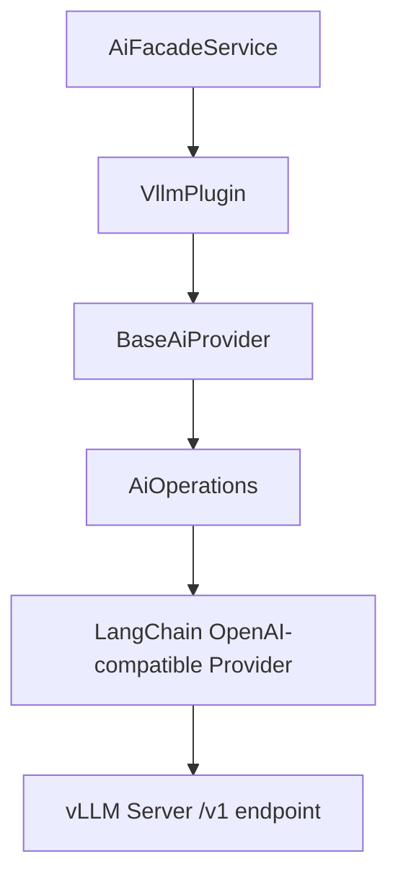

# vLLM AI Provider Plugin

The vLLM plugin connects Ever Works to a self-hosted [vLLM](https://docs.vllm.ai) server for high-throughput, private AI inference. It extends `BaseAiProvider` and uses the shared `AiOperations` layer that wraps LangChain under the hood.

**Source:** `packages/plugins/vllm/src/vllm.plugin.ts`

## Overview

| Property           | Value           |
| ------------------ | --------------- |
| Plugin ID          | `vllm`          |
| Category           | `ai-provider`   |
| Capabilities       | `ai-provider`   |
| Version            | `1.0.0`         |
| Configuration Mode | `user-required` |
| Provider Type      | `vllm`          |
| Auto-enable        | No              |
| Built-in           | Yes             |
| Visibility         | `public`        |

vLLM is a high-throughput inference engine (PagedAttention) for open-source models, usually deployed on a GPU server. It exposes an OpenAI-compatible API, so Ever Works can use it for content generation, conversations, and embeddings while keeping data on your own infrastructure.

## Architecture



The plugin talks to vLLM through its OpenAI-compatible `/v1` API endpoint. vLLM serves the model it was launched with (`vllm serve --model ...`).

## Configuration

### Settings Schema

| Setting        | Type     | Default | Scope    | Description                                                          |
| -------------- | -------- | ------- | -------- | -------------------------------------------------------------------- |
| `baseUrl`      | `string` | —       | `user`   | Address of the vLLM server (e.g. `http://localhost:8000/v1`)         |
| `apiKey`       | `string` | `EMPTY` | `user`   | Only required if the server was started with `--api-key` (encrypted) |
| `defaultModel` | `string` | —       | `global` | Used for all AI tasks unless a tier-specific model is set            |
| `simpleModel`  | `string` | —       | `global` | Handles tags, short descriptions, and quick classifications          |
| `mediumModel`  | `string` | —       | `global` | Handles listings, summaries, and content reformatting                |
| `complexModel` | `string` | —       | `global` | Handles full page generation and multi-step analysis                 |
| `temperature`  | `number` | `0.7`   | hidden   | Controls output randomness (0 = deterministic, 2 = creative)         |
| `maxTokens`    | `number` | `4096`  | hidden   | Maximum length of each AI-generated response                         |

The `apiKey` field is marked `x-secret`, so a real token is stored encrypted. It defaults to vLLM's documented `EMPTY` placeholder, which an unsecured server accepts. Model fields use `x-widget: model-select` and have **no hardcoded default** — set them to the model id vLLM was launched with.

### Required Fields

- `baseUrl` — the vLLM server address
- `defaultModel` — at least one model must be selected

## Networking note (managed cloud vs self-hosted)

The inference HTTP call is made by whoever runs work generation. For the **managed Ever Works cloud** to use your vLLM server, the `baseUrl` must be reachable from where generation runs — i.e. a public or VPN-reachable URL secured with `--api-key`. A `localhost` URL only resolves correctly when Ever Works itself runs on the **same machine or LAN** as the vLLM server (self-hosted deployment). vLLM is the most common "remote endpoint" case because it is typically GPU-hosted rather than on a laptop.

## Model Capabilities

```typescript
getCapabilities(): AiModelCapabilities {
    return {
        supportsStructuredOutput: true,
        supportsStreaming: true,
        supportsToolCalling: true,
        supportsVision: true,
        maxContextLength: 128000
    };
}
```

These are advisory hints — actual support depends on the served model and the flags vLLM was started with (e.g. tool calling needs `--enable-auto-tool-choice`).

## Lifecycle

### Loading

```typescript
async onLoad(context: PluginContext): Promise<void> {
    await super.onLoad(context);
    this.aiOps = new AiOperations({
        apiKey: 'EMPTY',
        model: this.getDefaultModelId(),
        baseURL: 'http://localhost:8000/v1',
        temperature: 0.7,
        maxTokens: 4096,
        providerType: 'vllm'
    });
}
```

When a request arrives, `resolveConfig()` merges the user's saved settings (base URL, API key, selected model) on top of these defaults before executing.

### Availability Check

`isAvailable()` calls `AiOperations.testConnection()` with the resolved configuration. The setup UI uses this (via `validateConnection()`) to detect connectivity and authentication before saving.

## Getting Started

1. Start a vLLM OpenAI-compatible server: `vllm serve <model>` (listens on `http://localhost:8000` by default).
2. If you secured it with `--api-key <token>`, have that token ready.
3. Enable the vLLM plugin in **Settings → Plugins**.
4. Set the **vLLM Server URL** (include the `/v1` suffix) and, if needed, the **API Key**.
5. Select the model your server is serving for each task complexity tier.

## Troubleshooting

| Issue                     | Cause                                               | Solution                                                                       |
| ------------------------- | --------------------------------------------------- | ------------------------------------------------------------------------------ |
| Plugin shows unavailable  | Server not running or unreachable from Ever Works   | Confirm `vllm serve` is up and the base URL is reachable (see networking note) |
| `401` / `Invalid API key` | Server started with `--api-key` but token missing   | Enter the exact `--api-key` token in the **API Key** field                     |
| `Model not found`         | Selected model differs from the one vLLM is serving | Set the model fields to the value passed to `vllm serve --model ...`           |
| No models in dropdown     | Connection failed before `listModels()` could run   | Fix the base URL / API key first, then re-open the model picker                |
