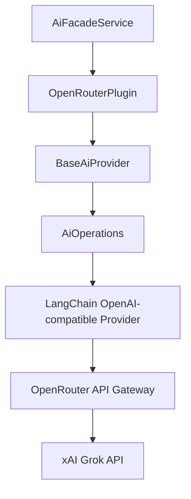
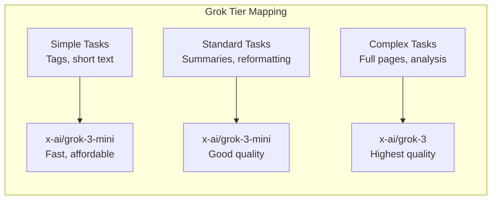

# xAI Grok Models via OpenRouter

Ever Works does not include a standalone xAI plugin. Grok models from xAI are accessed through the **OpenRouter** plugin, which aggregates hundreds of AI models behind a single API key. This page describes how to use Grok models for directory generation and AI conversations.

**Related source files:**

| File                                                                                 | Purpose                               |
| ------------------------------------------------------------------------------------ | ------------------------------------- |
| `packages/plugins/openrouter/src/openrouter.plugin.ts`                               | OpenRouter AI provider plugin         |
| `apps/internal-cli/src/commands/config/ai-providers/ai-provider-registry.service.ts` | Provider registry listing Grok models |

## Available Grok Models

The AI provider registry includes Grok models in the OpenRouter model list:

```typescript
// From ai-provider-registry.service.ts
models: [
	// ...
	'x-ai/grok-3-mini-beta'
];
```

Grok models available through OpenRouter use the `x-ai/` prefix:

| Model ID                | Description       | Best For                             |
| ----------------------- | ----------------- | ------------------------------------ |
| `x-ai/grok-3`           | Grok 3 full model | Complex content generation, analysis |
| `x-ai/grok-3-mini`      | Grok 3 Mini       | Fast, cost-effective general tasks   |
| `x-ai/grok-3-mini-beta` | Grok 3 Mini Beta  | Early access to latest capabilities  |
| `x-ai/grok-2`           | Grok 2            | General purpose AI tasks             |

:::note
Model availability on OpenRouter changes over time. Check [openrouter.ai/models](https://openrouter.ai/models) for the current list of available Grok models and their pricing.
:::

## Configuration

### Setting Up Grok Models

1. Navigate to **Settings > Plugins** in the Ever Works dashboard.
2. Ensure the **OpenRouter** plugin is enabled (default).
3. Enter your OpenRouter API key.
4. Set model fields to Grok model IDs:

| Setting              | Value              |
| -------------------- | ------------------ |
| Default Model        | `x-ai/grok-3-mini` |
| Simple Tasks Model   | `x-ai/grok-3-mini` |
| Standard Tasks Model | `x-ai/grok-3-mini` |
| Complex Tasks Model  | `x-ai/grok-3`      |

### Environment Variables

```bash
PLUGIN_OPENROUTER_API_KEY=sk-or-...
PLUGIN_OPENROUTER_DEFAULT_MODEL=x-ai/grok-3-mini
PLUGIN_OPENROUTER_SIMPLE_MODEL=x-ai/grok-3-mini
PLUGIN_OPENROUTER_MEDIUM_MODEL=x-ai/grok-3-mini
PLUGIN_OPENROUTER_COMPLEX_MODEL=x-ai/grok-3
```

## How It Works

Grok models are accessed through the same OpenRouter pipeline as every other provider:



OpenRouter's API is OpenAI-compatible, so the plugin uses LangChain's OpenAI provider with `baseURL` set to `https://openrouter.ai/api/v1`. The `x-ai/` prefix in the model ID tells OpenRouter to route the request to xAI's infrastructure.

## Tiered Model Strategy

Grok models pair well in a tiered configuration:



You can also mix Grok with other providers across tiers:

| Tier     | Model               | Provider |
| -------- | ------------------- | -------- |
| Simple   | `openai/gpt-5-nano` | OpenAI   |
| Standard | `x-ai/grok-3-mini`  | xAI      |
| Complex  | `x-ai/grok-3`       | xAI      |

## Capabilities

| Capability         | Grok 3          | Grok 3 Mini     |
| ------------------ | --------------- | --------------- |
| Structured output  | Yes             | Yes             |
| Streaming          | Yes             | Yes             |
| Tool calling       | Yes             | Yes             |
| Vision             | Model-dependent | Model-dependent |
| Max context length | 128,000 tokens  | 128,000 tokens  |

:::note
Capability details depend on the specific model version available on OpenRouter. The OpenRouter plugin reports `supportsVision: false` at the plugin level, but individual Grok models may support vision when accessed directly.
:::

## Comparison with Other Providers

| Aspect          | Grok (via OpenRouter) | OpenAI (direct)   | Groq                |
| --------------- | --------------------- | ----------------- | ------------------- |
| Setup           | OpenRouter API key    | OpenAI API key    | Groq API key        |
| Model selection | `x-ai/grok-*`         | `gpt-*`, `o*`     | Llama, Qwen         |
| Embeddings      | Depends on model      | Yes               | No                  |
| Speed           | Standard              | Standard          | Ultra-fast          |
| Cost            | Varies by model       | Per-token pricing | Free tier available |

## Reasoning Model Handling

Grok models are not currently listed in the platform's reasoning model configuration (`reasoning.utils.ts`). This means no automatic reasoning effort parameters are applied. If xAI introduces reasoning-specific models in the future, the platform will need a pattern entry similar to:

```typescript
{
    pattern: /grok-.*-reasoning/,
    openrouter: { reasoning: { effort: 'low' } }
}
```

Until then, Grok models operate in standard chat completion mode.

## Troubleshooting

| Issue                   | Cause                                               | Solution                                                                                  |
| ----------------------- | --------------------------------------------------- | ----------------------------------------------------------------------------------------- |
| Model not found         | Incorrect model ID or model removed from OpenRouter | Verify the model ID at [openrouter.ai/models](https://openrouter.ai/models)               |
| Authentication error    | Invalid or expired OpenRouter API key               | Regenerate your key at [openrouter.ai/settings/keys](https://openrouter.ai/settings/keys) |
| Rate limit exceeded     | Too many requests to xAI via OpenRouter             | Wait and retry; consider upgrading your OpenRouter plan                                   |
| Embedding not supported | Grok may not offer embedding models                 | Use OpenAI or Google Gemini for embeddings alongside Grok                                 |
| High costs              | Grok full models may be expensive                   | Use `grok-3-mini` for simple and standard tiers                                           |

## Cost Optimization

- Use `grok-3-mini` for the majority of pipeline tasks (simple and standard tiers).
- Reserve `grok-3` for complex content generation only.
- Monitor usage through the [OpenRouter dashboard](https://openrouter.ai/activity).
- Compare per-token pricing against alternatives -- OpenRouter shows cost per model.

## Further Reading

- [OpenRouter Plugin](./openrouter-plugin.md) -- complete OpenRouter configuration reference
- [DeepSeek Models](./deepseek-plugin.md) -- using DeepSeek models via OpenRouter
- [AI Provider Plugins](./ai-provider-plugins.md) -- overview of all AI provider options
- [Plugin Settings](./settings.md) -- how plugin settings resolution works
