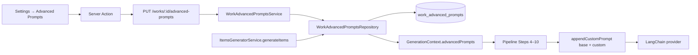

# Implementation Plan: Advanced Prompts

**Feature ID**: `advanced-prompts`
**Spec**: `./spec.md`
**Tasks**: `./tasks.md`
**Status**: `Done` (Retrospective)
**Last updated**: 2026-05-02

---

## 1. Architecture



The feature is purely additive: a new one-to-one entity per work,
two new endpoints, one new context field, and a single utility
(`appendCustomPrompt`) called from seven pipeline steps. The base
prompts shipped with each step remain untouched.

## 2. Tech Choices

| Concern              | Choice                                                          | Rationale                                                                                 |
| -------------------- | --------------------------------------------------------------- | ----------------------------------------------------------------------------------------- |
| Storage              | New TypeORM entity with `@OneToOne(Work)` + cascade             | One row per work, FK-clean delete                                                         |
| Field typing         | All seven prompt fields `text NULL`                             | Optional override per step; null means "use base prompt"                                  |
| Append vs replace    | **Append** with `## Additional User Instructions:` separator    | Preserves correctness of base prompts; users can't break core extraction logic            |
| Validation           | class-validator `@MaxLength(2000)` + `sanitizeString` Transform | Bounded length keeps token budget predictable; sanitiser strips `<script>`-style payloads |
| Loading at run start | Repository lookup once per generation, not per step             | Avoids 7× DB hits per work run; values are immutable for the run's duration               |
| Checkpoint behaviour | Always reload fresh on resume, **not** restored from checkpoint | Latest user edits take effect on the next attempt without invalidating the checkpoint     |
| UI shape             | One collapsible section, 7 textareas, single Save               | Matches the rest of the work settings page; no per-field state machine                    |

## 3. Data Model

```ts
// packages/agent/src/entities/work-advanced-prompts.entity.ts
@Entity({ name: 'work_advanced_prompts' })
export class WorkAdvancedPrompts {
	@PrimaryGeneratedColumn('uuid') id: string;

	@Column({ unique: true }) workId: string;

	@OneToOne(() => Work, { onDelete: 'CASCADE' })
	@JoinColumn({ name: 'workId' })
	work: Work;

	@Column({ type: 'text', nullable: true }) relevanceAssessment?: string | null;
	@Column({ type: 'text', nullable: true }) itemGeneration?: string | null;
	@Column({ type: 'text', nullable: true }) itemExtraction?: string | null;
	@Column({ type: 'text', nullable: true }) searchQuery?: string | null;
	@Column({ type: 'text', nullable: true }) categorization?: string | null;
	@Column({ type: 'text', nullable: true }) deduplication?: string | null;
	@Column({ type: 'text', nullable: true }) sourceValidation?: string | null;

	@CreateDateColumn() createdAt: Date;
	@UpdateDateColumn() updatedAt: Date;
}
```

Migration is additive and forward-only: new table, unique index on
`workId`, no changes to existing tables.

## 4. API Surface

| Method | Endpoint                          | Auth                  | Description                       |
| ------ | --------------------------------- | --------------------- | --------------------------------- |
| `GET`  | `/api/works/:id/advanced-prompts` | JWT (viewer or above) | Returns the prompts row or `null` |
| `PUT`  | `/api/works/:id/advanced-prompts` | JWT (editor or above) | Upserts the prompts row           |

Request DTO (`UpdateWorkAdvancedPromptsDto`) has all seven
fields as `@IsOptional() @IsString() @MaxLength(2000)`.
Response shape mirrors the entity with timestamps as ISO strings.

Errors:

- `404` — work not found
- `403` — user lacks editor role on PUT
- `400` — any field exceeds 2000 chars

## 5. Plugin Surface

None. Custom prompts are appended to in-tree base prompts before they
hit the LangChain wrapper inside `AiOperations`. No capability or
plugin contract changes.

## 6. Web / CLI Surface

- New component `apps/web/src/components/works/detail/settings/AdvancedPromptsSettings.tsx`
  embedded in the Settings tab of the work detail page.
- New server action `updateAdvancedPrompts(workId, data)` under
  `apps/web/src/app/actions/dashboard/works.ts`.
- New API client functions under `apps/web/src/lib/api/work.ts`.
- Translation keys under `dashboard.workDetail.settings.advancedPrompts.*`
  in `apps/web/messages/<locale>.json`.

No CLI surface — the feature is per-work and exposed only
through the dashboard.

## 7. Background Jobs

None. Prompt updates take effect on the next generation run; existing
checkpointed runs continue with the prompts they were started with
because the loader runs at the top of `generateItems`.

## 8. Security & Permissions

- Authorization gated on work editor role (Owner / Manager / Editor).
- Length cap (2000 chars/field) bounds token usage at ~14k extra
  tokens per run worst-case.
- `sanitizeString` Transform strips HTML/script-like payloads before
  persistence.
- The `appendCustomPrompt` separator (`## Additional User Instructions:`)
  scopes user-supplied content under a clearly demarcated section so
  it can't masquerade as system instructions to the model.
- No new `@Public()` endpoints.

## 9. Observability

- The activity log records `work_advanced_prompts_updated`
  with the field names that changed (not the values — values may
  contain user IP).
- No new metrics; existing per-step latency / token-count metrics
  cover the cost impact.

## 10. Phased Rollout

Originally shipped without a feature flag — additive schema, no risk
to runs without a row (loader returns `undefined`, every step
short-circuits in `appendCustomPrompt`).

## 11. Risks & Mitigations

| Risk                                                                        | Mitigation                                                                            |
| --------------------------------------------------------------------------- | ------------------------------------------------------------------------------------- |
| User writes prompt that breaks JSON schema enforcement (e.g. "ignore JSON") | Append happens **after** schema instructions; structured-output validators still gate |
| 7× 2000-char prompts blow the model context                                 | Total append budget capped at 14k tokens; well below any frontier model limit         |
| Saved prompt contains secrets users don't want logged                       | Activity log records field names only; PostHog events do not include prompt content   |
| User expectations of "replace" rather than "append"                         | UI label and tooltip explicitly say "These instructions are added to..."              |

## 12. Constitution Reconciliation

- **I (Plugin-first)**: N/A — feature lives in agent core; no plugin surface
- **II (Capability-driven)**: prompts feed existing capabilities (AI provider) untouched
- **III (Source-of-truth repos)**: prompts are config, not content; stored in platform DB rather than the data repo
- **IV (Trigger.dev)**: no new long-running work
- **V (Forward-only migrations)**: additive only — new table, unique index, no column drops
- **VI (Tests)**: unit tests cover entity, repository, service, the `appendCustomPrompt` utility, and one e2e test for the controller
- **VII (Secret hygiene)**: prompt content treated as non-secret config; activity log records keys only
- **VIII (Plugin counts)**: no change
- **IX (Behaviour-first)**: spec authored before service shape was finalised
- **X (Backwards-compat)**: existing API consumers untouched; new endpoints are additive

## 13. References

- Spec: `./spec.md`
- Implementation: `packages/agent/src/services/work-advanced-prompts.service.ts`,
  `apps/web/src/components/works/detail/settings/AdvancedPromptsSettings.tsx`
- Pipeline integration: `packages/agent/src/items-generator/utils/prompt.util.ts`
