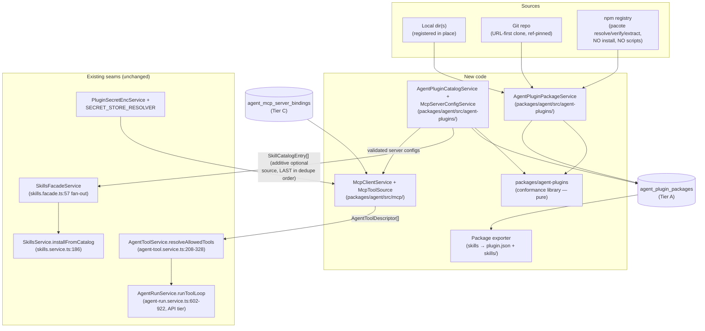

# Implementation Plan: Agent Plugins Standard Interop

**Feature ID**: `agent-plugins`
**Spec**: [`./spec.md`](./spec.md)
**Tasks**: [`./tasks.md`](./tasks.md)
**ADR**: [ADR-018](../../decisions/018-agent-plugins-standard-interop.md)
**Status**: `Draft`
**Last updated**: 2026-08-09

Every file:line reference below was verified against `develop` @ `1cccb4e4e`
(2026-08-09). Implementers: re-verify seams that matter before coding — this repo
moves fast.

---

## 1. Architecture Summary

**Tier decision (verified)**: the LLM tool loop executes in the **API process** —
the Trigger.dev worker binds `AgentRunService` as a `createRemoteProxy` RPC stub
(`packages/tasks/src/trigger/worker/modules/trigger-internal.module.ts:126-131`;
load-bearing comment :186-192 "Execution is API-side today"). Therefore the MCP
client, package files, `PLUGIN_DATA`, and skill materialization all live **API-side
only**. The worker needs zero changes. Fleet-node (`node`-runtime) runs are
explicitly out of scope for MCP tools in v1 (that dispatch path is diverted at
`apps/api/src/tasks/tasks.module.ts:73-86`; behavior on fleet nodes is unverified —
MCP tool sources MUST no-op there rather than fail).

---

## 2. New packages & modules

### 2.1 `packages/agent-plugins` — conformance library (new, pure)

`@ever-works/agent-plugins`. Zero NestJS/TypeORM deps; MIT; publishable (it is a
useful OSS artifact on its own: a TypeScript reference loader for Agent Plugins
v1.0.0). Contents:

| Module             | Responsibility                                                                                                                                                                                                                                                                                                                                                                                                                             |
| ------------------ | ------------------------------------------------------------------------------------------------------------------------------------------------------------------------------------------------------------------------------------------------------------------------------------------------------------------------------------------------------------------------------------------------------------------------------------------ |
| `src/manifest.ts`  | Closed `plugin.json` parse + validate with the spec's exact severity split (AP-4): returns `{ manifest, warnings[] }` or a typed fatal error. Vendored canonical JSON Schemas under `src/schemas/1.0.0/` (imported via `resolveJsonModule` so they ship in `dist/` — do NOT place at package root: both packaging scripts copy `dist/` only, `scripts/prepare-docker-plugins.js:39-62`, `packages/tasks/scripts/prepare-plugins.js:50-67`) |
| `src/skills.ts`    | `skills/` discovery (immediate children only, `SKILL.md` regular-file check) + Agent Skills frontmatter validation (name/dir match, charset, description length, `allowed-tools` **space-separated-string → string[]** tokenizer). Skip-one semantics (AP-9)                                                                                                                                                                               |
| `src/mcp.ts`       | Closed `mcp.json` parse; per-server closed-union validation (stdio / streamable-http / sse); URL rules (https-unless-loopback, no userinfo/fragment); header case-insensitive dup detection; reserved-env-key rejection                                                                                                                                                                                                                    |
| `src/paths.ts`     | Containment: `resolveWithinRoot(root, rel)` with `realpath` symlink resolution (AP-10). Modeled on `confinePluginEntry` (`plugin-loader.service.ts:832-860`) but exported + covering non-js files                                                                                                                                                                                                                                          |
| `src/expand.ts`    | `${PLUGIN_ROOT}`/`${PLUGIN_DATA}` single-pass non-recursive expansion for args elements / env values / cwd only (AP-17)                                                                                                                                                                                                                                                                                                                    |
| `src/serialize.ts` | Export side: `plugin.json` emitter, SKILL.md emitter (frontmatter YAML via `gray-matter` — new dep **of this package**; today only `packages/plugins/everworks-skills/package.json:35` has it, and `matter.stringify` has zero uses repo-wide), slug→spec-name guard (full rule: ≤64, no `--`, no leading/trailing hyphen)                                                                                                                 |
| `fixtures/`        | Conformance corpus: valid + malformed packages for every AP requirement. **Add `packages/agent-plugins/fixtures/` to `.prettierignore`** — the root glob `**/*.{ts,tsx,jsx,json,css,md}` (root `package.json:45`) makes `format:check` FAIL on deliberately-malformed fixtures and `pnpm format` would rewrite them                                                                                                                        |

Validation engine: Ajv 8 (own declared dep — pnpm strict node_modules means we
cannot lean on `packages/agent`'s copy) for the two JSON schemas, plus hand-rolled
checks for everything schemas can't express (severity split, dir-name match,
containment). `skills-ref` (Python) optionally runs in CI as an oracle — non-blocking
job.

### 2.2 Platform bridge services (new, in `packages/agent/src/agent-plugins/`)

**Why not a native plugin** (design decision, forced by verified constraints):
native plugins are instantiated bare — `plugin-loader.service.ts:364`
`return new PluginClass();` — receiving only `PluginContext` (logger/cache/http/
settings; NO repository access, by trust design), so a plugin cannot query the
Tier A `agent_plugin_packages` table; and `ISkillsProviderPlugin.listEntries` is
scope-blind (`skills-provider.interface.ts:36-42` — limit/offset/tags/search
only), so tenant-scoped catalogs cannot flow through that seam without
cross-tenant leakage. Platform services have neither problem — and they can call
the existing gates (`assertBody`-family checks, `packages/agent/src/utils/
secret-scan.ts`) directly, which a standalone plugin package cannot import.

- **`AgentPluginCatalogService`**: reads registered package rows (scoped through
  the caller's request scope) + package files via the conformance library →
  `SkillCatalogEntry[]` with provenance. Wired into `SkillsFacadeService.
listEntries` as an **additive, `@Optional()`-injected second source**, merged
  LAST so the existing first-wins slug dedupe (`skills.facade.ts:88-92`) and the
  `defaultForCapabilities`-first plugin ordering (`base.facade.ts:284-289`)
  guarantee package entries can never displace `everworks-skills` entries.
  Existing facade behavior with the feature flag off (or no packages installed)
  is bit-identical. Entry `version` (required by
  `skills-provider.interface.ts:31`) = package `version` when parseable, else
  content-hash-derived (AP-21). `SkillCatalogEntry` gains **optional** readonly
  provenance fields (`packageName?`, `packageVersion?`, `sourceKind?`) —
  additive interface change only — so US-5's source labels have a data carrier.
  Pre-flight findings (64KB cap, secret scan, injection tokens) computed here by
  calling the same util functions the install path enforces.
- **`McpServerConfigService`**: resolves a run's bound MCP servers
  (`agent_mcp_server_bindings` rows → package `mcp.json` configs via the
  conformance library) with per-server validation findings. Consumed only by
  `McpClientService` (§2.4). No new plugin capability string, no
  `PLUGIN_CAPABILITIES`/`facade-capabilities.ts` append — the closed typed
  capability map (`packages/plugin/src/contracts/facade-capabilities.ts:101-106`)
  stays untouched.
- **Update checks**: the catalog service implements the update-available
  computation for git/npm packages and the facade surfaces it — this also adds
  the missing caller for the existing `checkForUpdates` provider seam (zero
  non-test callers today) so `everworks-skills` catalog updates surface too.

### 2.3 `packages/agent/src/agent-plugins/` — package lifecycle (new module in agent)

`AgentPluginPackageService` + repositories + source acquirers:

- **local**: register a directory in place (no copy). Sources configured via
  `AGENT_PLUGINS_DIR` scan root(s) + per-deployment settings. Desktop home:
  `<userData>/agent-plugins` (`apps/desktop/src/main/main.ts:131-134` userData
  precedent); headless node: XDG/APPDATA convention
  (`apps/node/src/core/config-store.ts:80-97`).
- **git**: new URL-first clone entry point built on isomorphic-git primitives
  (`packages/plugin/src/git/git-operations.ts:68-76` `git.clone({fs, http,
onAuth})`; `cloneBranch` :269-295 is the closest existing function). The existing
  `GitFacade.cloneOrPull` path is provider-account-centric and does NOT fit
  arbitrary URLs — do not force it. Ref-pinned; shallow; clone into
  `<AGENT_PLUGINS_DIR>/<name>/<ref>` then validate.
- **npm**: reuse the pacote pipeline shape from
  `plugin-installer.service.ts:152-267` — `pacote.manifest` (resolve + sha512) →
  allowlist check **before network** → `pacote.extract` — **minus the node_modules
  symlink step** (:229-231; spec packages are never `import()`-ed) and minus any
  dependency installation (data packages have none). Registry config reuses the
  `PluginsModuleOptions` shape (registryUrl/github/token).
- **Allowlist**: new sibling table `agent_plugin_package_allowlist` mirroring
  `plugin-allowlist.entity.ts:26-71` (packageName/versionRange/integrity/source/
  enabled). **Never reuse `plugin_allowlist`** — a row there authorizes _code_
  install. Local-dir sources bypass allowlists by nature → gated by deployment
  mode (operator-configured dirs only).
- Boot: `warmupFromDb()`-style re-materialization for git/npm sources
  (`plugin-installer.service.ts:104-137` precedent) — per-replica installs, no
  shared volume, consistent with EW-693's committed architecture
  (`apps/api/src/config/constants.ts:341`).

### 2.4 `packages/agent/src/mcp/` — MCP client (new module in agent)

Official SDK: `@modelcontextprotocol/sdk` **1.27.1 already in the tree**
(`apps/mcp/package.json:27`; lockfile-resolved) with every client class needed:
`Client` (`client/index.js`), `StdioClientTransport` (`client/stdio.js`),
`StreamableHTTPClientTransport` (`client/streamableHttp.js`), `SSEClientTransport`
(`client/sse.js`). Add the dep to `packages/agent` (its own declaration — pnpm
strict).

- `McpClientService`: connection lifecycle per (run, binding). Lazy connect at
  tool-resolution time; disconnect at run end; per-server failure isolation per
  spec §6.2.2 (failed connect → skip server, WARN run-log, continue — mirrors the
  suppressed-skill WARN pattern at `agent-run.service.ts:1594-1607`).
- `McpToolSource`: the injection seam is a **new optional token-injected source
  inside `AgentToolService.resolveAllowedTools`** — exactly the
  `AGENT_DOMAIN_TOOL_SOURCES`/`buildDomainTools` pattern
  (`agent-tool.service.ts:181-183, 321, 363-518`). Descriptors emitted there
  inherit the entire existing funnel for free: grant-matrix filtering
  (`resolveGrantedTools` :540-580), the run-level funnel + WARN logs
  (`agent-run.service.ts:1471-1505`), delegation-scope narrowing (:1529-1556),
  credential interpolation (:600-664), and untrusted tool-result fencing
  (:818-823).
- Tool naming: `mcp__<serverName>__<toolName>`, length-capped; server-supplied
  tool **names and descriptions are sanitized** (length caps, control-char strip)
  and MUST NOT shadow built-ins — collision with any existing descriptor name →
  the MCP tool is dropped with a WARN (the `descriptorByName` map at
  `agent-run.service.ts:656-661` is last-write-wins; we must never reach it with a
  colliding name).
- **stdio subprocess**: from-scratch env via the `buildSubprocessEnv` pattern
  (`packages/plugins/claude-code/src/utils/subprocess-env.ts:15-90`, audit C-10):
  PATH/HOME/TMPDIR + package `env` (expanded) as overrides + `PLUGIN_ROOT`/
  `PLUGIN_DATA` set last (overrides-win loop :85-87 is exactly the spec's overlay
  order). `command` containment via the conformance library. Gate: see §5.
- **streamable-http/sse**: SSRF policy layered on the EW-711 work — deny
  cluster-internal/link-local/metadata targets by default (the spec's URL rules
  reject plain-http non-loopback targets, but an `https://ever-works-api.internal`
  -shaped cluster target passes them; our egress policy must deny it). Redirect
  handling per AP-15 is **runtime client behavior**: never forward
  package-configured headers cross-origin without explicit user authorization,
  and never forward client-generated credential headers cross-origin at all —
  implemented and tested in T25, not just statically validated.
- Credentials: per-binding encrypted `secretSettings` (AES-256-GCM
  `PluginSecretEncService` pattern — note the key is
  **`PLUGIN_SECRET_ENCRYPTION_KEY`**, not `PLATFORM_ENCRYPTION_KEY`:
  `plugin-secret-enc.service.ts:22-71`) **and** optional `credentialsSecretRef`
  resolved through `SECRET_STORE_RESOLVER`
  (`secret-store-resolver.interface.ts:52-64`; both patterns already coexist in
  the platform). Injected as client-generated headers (http) / env overrides
  (stdio) at connect time; masked on read (partialReveal,
  `plugin-operations.service.ts:1776-1799`).

### 2.5 Entities (new; Tier per tenants-and-organizations spec §126-143)

Register every one in **`packages/agent/src/database/_entities-inventory.ts`**
(the ENTITIES array moved there; `database.config.ts:52` imports it) + migration
in the SAME PR (`apps/api/src/migrations/`, latest is
`1785000000000-CreateTermsAcceptance.ts`).

| Entity                           | Tier                                                                                                                   | Shape (template)                                                                                                                                                                                                                                                                                                                                                                                                                                                                                                    |
| -------------------------------- | ---------------------------------------------------------------------------------------------------------------------- | ------------------------------------------------------------------------------------------------------------------------------------------------------------------------------------------------------------------------------------------------------------------------------------------------------------------------------------------------------------------------------------------------------------------------------------------------------------------------------------------------------------------- |
| `agent_plugin_packages`          | **A** (`tenantId`+`organizationId` nullable uuid, no `@ManyToOne`, **no XOR CHECK** — known migration-abort bug class) | Mirrors `PluginEntity`'s EW-693 columns (`plugin.entity.ts:132-174`): `name` (spec name), `version` nullable, `manifest` json, `source: 'local'\|'git'\|'npm'`, `sourceRef` (dir path / git url#ref / npm spec), `integrity` nullable, `installPath`, `dataPath`, `installState`, `installError`, `contentHash`, per-component findings json (skipped skills, disabled MCP reasons), `dataManifest` json (PLUGIN_DATA object-storage key manifest — see §3 SaaS persistence)                                        |
| `agent_plugin_package_allowlist` | D (global, like `plugin_allowlist`)                                                                                    | `packageName`, `versionRange`, `integrity?`, `source: 'npm'\|'git'`, `enabled`                                                                                                                                                                                                                                                                                                                                                                                                                                      |
| `agent_mcp_server_bindings`      | **C** (denorm pair)                                                                                                    | `skill_bindings` template (`skill-binding.entity.ts` provides: subject FK CASCADE, `targetType` (5-valued there; restricted here to `'agent'\|'work'\|'tenant'`), `targetId` nullable-for-tenant, `userId`, unique index) **PLUS net-new columns**: `serverName`, `enabled`, `settings`/`secretSettings` json, `credentialsSecretRef` varchar(128) nullable; unique `(packageId, serverName, targetType, targetId)`. v1 API creates agent-scoped bindings only; the column shape supports work/tenant targets later |
| `skill_files` (Phase 5)          | C                                                                                                                      | Sidecar store: `skillId` FK, `relPath`, `sha256`, `size`, `mime`, bytes via `IStoragePlugin` at `agent-plugins/<sha256>` — copy the `user_uploads` validation shape (`uploads.service.ts`: magic-byte sniff, sha256 naming, size caps). NOTE: the uploads stack does NOT secret-scan — wire `assertNoSecrets` (`packages/agent/src/utils/secret-scan.ts`) as a NEW check on text-like files only; NO injection-token gate on scripts (that gate is for prompt-bound bodies only, `skills.service.ts:394-405`)       |

**Scope model**: package install rows are per-tenant/org (Tier A — the platform's
`Skill` already is; do NOT copy the unscoped code-plugin tables). Enablement
resolution copies the `resolvePluginEnabled` pure-function shape
(`plugin-registry.service.ts:31-56`).

**Account transfer**: new tables need explicit whitelist entries in ALL of:
`packages/agent/src/account-transfer/types.ts` + the export-service literal +
both import paths + `SyncPushOptions` toggle threading (the 3-place — now
4-place — whitelist bug class). Export a _reference_ (name+version+source), never
package content; secrets masked by the existing machinery; `credentialsSecretRef`
pointers deliberately omitted (deployment-local meaning).

**Import contract for package references** (ordered — bindings depend on a
destination-local `packageId`, so resolution runs FIRST): (1) match an installed
package by `(name, source)` with a compatible version → remap `packageId` and
import bindings against it; (2) package absent → recreate the package row as
`installState: 'available'` (a pending reference — import NEVER auto-fetches
git/npm content, that is a supply-chain decision the destination operator makes)
and import its bindings with `enabled: false`, flagged "pending package install"
in the import report; (3) source disallowed by the destination's allowlist or
deployment mode → skip those bindings with a per-item report entry; (4) ambiguous
match (multiple installed versions/sources of the same name) → prefer exact
`(name, version, source)`, else fall to case (2)'s pending-reference path. Never
fail the whole import for a package-resolution miss — skip-and-report, matching
the existing import philosophy (masked-secret refusal, per-item warnings).

### 2.6 API + CLI + UI (all additive)

- `apps/api/src/agent-plugins/`: controller (`GET/POST /api/agent-plugins`,
  `POST /api/agent-plugins/install`, `GET /:id`, `DELETE /:id/install`,
  `GET /:id/findings`, bindings CRUD under `/api/agents/:id/mcp-servers` +
  standalone `DELETE /api/mcp-server-bindings/:id` — the skills controller pair
  is the template, `skills.controller.ts` + `skill-bindings.controller.ts`).
  Throttle installs 5/min/user (`plugins.controller.ts:116-120` precedent).
  New DTOs need validation-authz-matrix e2e coverage (global
  `forbidNonWhitelisted` pins 400-on-unknown-field).
- CLI: `apps/cli/src/commands/plugins/` gains `agent-plugins` verbs
  (list/install/uninstall/status/export) following
  `dynamic.command.ts:61-196` (requireAuth + getApiService + ora/chalk +
  `buildDynamicSubcommands` mount pattern).
- Web UI: packages list + install flow under `(dashboard)/settings`
  (allowlist admin page parallel to
  `admin/plugins/allowlist/page.tsx`); **MCP Servers tab** on
  `/agents/[id]` beside the existing skills tab; source labels in the skills
  catalog. Every string in ALL locale files `apps/web/messages/*.json`
  (duplicate-key landmine — validate).
- Domain chat tools for the new entities (in-code DoD at
  `agent-tool.service.ts:317-319`) via a new entry in the
  `AGENT_DOMAIN_TOOL_SOURCES` bundle.
- Module-shape pin specs updated in the same PR as any provider add
  (`apps/api/src/agents/agents.module.spec.ts:178-201` (the
  `AGENT_DOMAIN_TOOL_SOURCES` inject-array pin) and `:205`,
  `apps/api/src/trigger/trigger-internal.module.spec.ts`).
- OpenAPI: run `generate:openapi` full-app bootstrap as the DI gate
  (`apps/api/package.json:19`); no committed openapi.json exists (verified) —
  the MCP image bakes the spec at build. New endpoints do NOT auto-appear as
  apps/mcp tools (`whitelist.ts` is manual) — add `agent-plugins` entries there
  in the final phase or declare out of scope.

---

## 3. Data & deployment wiring

| Concern           | Design                                                                                                                                                                                                                                                                                                                                                                                                                                                                                  |
| ----------------- | --------------------------------------------------------------------------------------------------------------------------------------------------------------------------------------------------------------------------------------------------------------------------------------------------------------------------------------------------------------------------------------------------------------------------------------------------------------------------------------- |
| Packages dir      | `AGENT_PLUGINS_DIR`, **optional-with-default** `/app/agent-plugins` (constants.ts `installDir()` :389 pattern — avoids the required-env crash-loop class). NEVER at `/app/plugins` (prohibition comment, `k8s-manifest.prod.yaml:396-413`)                                                                                                                                                                                                                                              |
| PLUGIN_DATA root  | `AGENT_PLUGINS_DATA_DIR`, default `/app/agent-plugins-data`; per-package dir keyed **per (tenant, package)** — a shared stdio server must never mix tenant data                                                                                                                                                                                                                                                                                                                         |
| SaaS persistence  | Per-replica local dirs + **DB/object-storage write-through**: package bytes re-materialized on boot (warmupFromDb precedent); PLUGIN_DATA synced through the boot-selected `IStoragePlugin` (`storage.interface.ts` putObject/getObject; no list op → the key manifest is a declared **`dataManifest` json column on `agent_plugin_packages`** — not a separate table, no extra migration). RWO PVC does not fit the 2-replica API; emptyDir alone violates the spec's persistence MUST |
| Self-host/desktop | Plain disk dirs; desktop bundle staging extended in `apps/desktop/scripts/prepare-bundle.js` (:147-149 copies `plugins/` — add `agent-plugins/`)                                                                                                                                                                                                                                                                                                                                        |
| Env wiring        | The 2026-06-12 checklist: k8s manifests (dev/stage/prod) + deploy workflow env blocks + `.env.example` + compose env files + e2e.yml if boot-required (they are NOT — defaults). ArgoCD-managed live env source is outside this repo — flag to operator explicitly                                                                                                                                                                                                                      |
| Feature flag      | `FEATURE_AGENT_PLUGINS` default **false** (`FEATURE_DYNAMIC_PLUGINS` precedent, constants.ts:316-325)                                                                                                                                                                                                                                                                                                                                                                                   |
| Worker tier       | **No changes.** Execution is API-side; do not ship packages to the Trigger bundle. (The worker's own lazy-install path for code plugins is structurally unwired today — `TriggerInternalModule` lacks the installer provider — do not copy that trap)                                                                                                                                                                                                                                   |

---

## 4. Skills flow details

1. **Ingest** (catalog service → facade): conformance lib parses; `allowed-tools`
   tokenized to `allowedTools: string[]` **at ingest only** (never a global
   normalizer/backfill — `filterSkillsByToolGrants`
   (`packages/agent/src/policy/skill-activation.ts:59-97`) _suppresses_ skills
   whose declared tools are all refused; a backfill would silently change live
   run behavior); unknown frontmatter keys preserved (open
   `SkillFrontmatter` index sig, `skill.entity.ts:32-38`).
2. **Install**: through the existing `installFromCatalog`
   (`skills.service.ts:186`) — the 64KB body cap + secret scan + injection-token
   gate (:394-405) apply unchanged. Oversized/gated bodies are surfaced as
   per-skill findings at package validation time (pre-flight the checks in the
   catalog service's `listEntries` so the card can warn _before_ install fails).
3. **Slug collision**: spec skill names are `[a-z0-9-]` ≤64 — a strict subset of
   the slug DTO `/^[a-z0-9-]{1,80}$/` (`skill.dto.ts:176`). Facade dedupe is
   first-wins with `defaultForCapabilities` providers sorted first — package
   skills can never displace `everworks-skills` entries.
4. **Progressive disclosure** (optional additive enhancement, own task): emit
   one-line `<skill-available slug name description/>` stubs for bound skills
   dropped by budget/grants, so the model can `getSkillBody` them — closes the
   Agent Skills level-1 gap. Today's full-body injection for surviving skills
   (`prompt-assembler.service.ts:256-274`, budget
   `agent.maxSkillContextTokens ?? 4000`) is UNCHANGED.
5. **Sidecars** (Phase 5): stored via `skill_files`; materialized into the
   claude-code plugin's workspace at its "Step 2: Prepare Context" seam
   (`claude-code.plugin.ts:542-558`) as
   `<workspace>/.claude/skills/<name>/…` + `.mcp.json` — subdirectories are
   collection-safe (`readGeneratedItems` filters to top-level `*.json`,
   `cli-pipeline/workspace.ts:234-235`). **Execution-gate split (Greptile P1)**:
   that runner executes with `--dangerously-skip-permissions` and no sandbox,
   so materialized files are reachable code — therefore only `references/` +
   `assets/` (with any executable bits stripped) materialize by default;
   `scripts/` materialize solely for packages that pass the stdio-grade triple
   gate (§5 sidecar row), and `.mcp.json` is written only for servers the run's
   bindings actually enable. The Wave-2 Task-workspace `workspaceCwd` is a
   **dead-end today** (declared `agent-run.service.ts:99`, zero consumers) —
   materialization into Task workspaces is deferred until that middle exists;
   do not promise it.
6. **e2e trap**: `apps/web/e2e/flow-skills-catalog-pagination.spec.ts` pins 10
   catalog slugs in the first page (:46-57, :522-523), asserts total ≤200
   (:549-551) and disjoint tag math (:633). The platform catalog source is
   feature-flag-off by default and empty without installed packages, so CI
   catalogs are unchanged; any task enabling it in e2e must revisit that spec
   explicitly.

---

## 5. Security model (net-new decisions, per ADR-018)

| Threat                                | Control                                                                                                                                                                                                                                                                                                                                                                                                                                                                                                                                                                                                                                                                                                                                                                                                         |
| ------------------------------------- | --------------------------------------------------------------------------------------------------------------------------------------------------------------------------------------------------------------------------------------------------------------------------------------------------------------------------------------------------------------------------------------------------------------------------------------------------------------------------------------------------------------------------------------------------------------------------------------------------------------------------------------------------------------------------------------------------------------------------------------------------------------------------------------------------------------- |
| stdio = code execution on the API pod | Triple gate: (1) `FEATURE_AGENT_PLUGINS`; (2) deployment-mode setting `AGENT_PLUGINS_STDIO` default off in cloud, on-able for self-host/desktop; (3) per-binding explicit user enable. From-scratch subprocess env; command/cwd containment; no shell interpretation (single-token exec)                                                                                                                                                                                                                                                                                                                                                                                                                                                                                                                        |
| Supply chain (git/npm)                | Allowlist-before-network (sibling table); sha512 for npm; commit-pin policy for git (record resolved SHA on install; re-fetch compares); local dirs = operator-trust only                                                                                                                                                                                                                                                                                                                                                                                                                                                                                                                                                                                                                                       |
| Prompt injection via skill bodies     | Existing: `neutralizeInjectedBlock` fencing + `assertBody` gates apply unchanged (imports route through `SkillsService`)                                                                                                                                                                                                                                                                                                                                                                                                                                                                                                                                                                                                                                                                                        |
| Malicious sidecars                    | **`scripts/` are an execution route, not passive data** (Greptile P1, PR #2000): the claude-code runner spawns with `--dangerously-skip-permissions`, cwd = workspace, no sandbox — a materialized script is arbitrary code execution with the API process identity, bypassing the stdio gate via the file route. Control: sidecar materialization is SPLIT — `references/` + `assets/` (non-executable) materialize under the standard validation (sha256 naming, MIME sniff, size caps, NEW text-only secret scan); **`scripts/` materialize ONLY when the package passes the same triple gate as stdio execution** (feature flag + `AGENT_PLUGINS_STDIO`-family deployment setting + per-package explicit enable) — scripts-to-runner ≡ code execution, gated as such, default OFF everywhere, v1 SaaS never |
| MCP tool schema injection             | Sanitize server-supplied names/descriptions; collision-with-builtin → drop + WARN; tool RESULTS already fenced (`agent-run.service.ts:818-823`)                                                                                                                                                                                                                                                                                                                                                                                                                                                                                                                                                                                                                                                                 |
| SSRF via server URLs                  | Spec URL rules + EW-711-style egress deny for cluster-internal/metadata ranges                                                                                                                                                                                                                                                                                                                                                                                                                                                                                                                                                                                                                                                                                                                                  |
| Tenant data mixing                    | PLUGIN_DATA keyed per (tenant, package); Tier A/C scope columns + stamping subscriber (`scope-stamping.subscriber.ts:95-122`)                                                                                                                                                                                                                                                                                                                                                                                                                                                                                                                                                                                                                                                                                   |
| Credential leakage                    | Package env/headers treated as visible data (spec); real creds only in encrypted settings / secret-ref; masked reads; masked account-transfer export; never in `mcp.json` we emit                                                                                                                                                                                                                                                                                                                                                                                                                                                                                                                                                                                                                               |

---

## 6. Export flow

1. Select skills at a scope → validate slugs against the FULL spec name rule
   (≤64, no `--`, no leading/trailing hyphen; prompt rename otherwise) → emit
   `plugin.json` (name, version, our
   metadata under `extensions["works.ever"]`) + `skills/<slug>/SKILL.md`
   (frontmatter YAML preserving unknown keys; `allowedTools` → space-separated
   `allowed-tools`) + stored sidecars → zip. Round-trip test is the gate (AP-22).
2. MCP package descriptor for our own server:
   `{"type":"streamable-http","url":"https://mcp.ever.works/mcp"}` — the live
   endpoint (Ingress + `main.http.ts:52`; prod auth mode `per-user-jwt`), auth
   documented as client-generated `x-ever-works-jwt` header, never embedded.
   (An npx-able stdio form requires publishing `apps/mcp` with a `bin` — it is
   `private: true` today; separate decision, out of v1.)

---

## 7. Observability, billing, limits

- WARN run-log rows for every skipped server/tool/skill (mirrors
  `agent-run.service.ts:1594-1607` pattern) + package findings persisted on the
  row.
- PostHog events: package installed/removed, MCP server bound/connected/failed,
  MCP tool invoked (new domain-events file beside
  `packages/monitoring/src/posthog/kb-events.ts`).
- **Decision needed at Phase 3**: do MCP tool calls emit `PluginUsageEvent` and
  count against budgets (`budget-guard.service.ts`; TODO at
  `agent-run.service.ts:1384-1432`)? Recommended: count invocations as usage
  events from day one; cost-weighting deferred.
- Sentry tagging on install/connect errors (installer `tagSentryError` precedent
  :446-475).
