# AW-04 — Live Feed · Implementation Plan

> Translates [spec.md](./spec.md) into architecture, data model, and phasing.
> The plan owns implementation detail; the spec owns behaviour.
> Ordered work lives in [tasks.md](./tasks.md).

**Epic ID:** `AW-04-live-feed`
**Spec:** [./spec.md](./spec.md) · **Tasks:** [./tasks.md](./tasks.md)
**Status:** `Draft`
**Last updated:** 2026-09-06

---

## 1. Current state in the codebase

Everything below was read in this worktree before being cited.

### 1.1 The record we read

| Thing                                                                                                                                             | Path                                                                                                                                                        |
| ------------------------------------------------------------------------------------------------------------------------------------------------- | ----------------------------------------------------------------------------------------------------------------------------------------------------------- |
| Entity (`@Entity('activity_log')`)                                                                                                                | [`packages/agent/src/entities/activity-log.entity.ts`](../../../../../packages/agent/src/entities/activity-log.entity.ts)                                   |
| Action-type enum (162 members) + `ActivityStatus` + `CreateActivityLogDto` (line 321) + `ActivityLogQueryOptions` (line 335)                      | [`packages/agent/src/entities/activity-log.types.ts`](../../../../../packages/agent/src/entities/activity-log.types.ts)                                     |
| Write chokepoint — `log()` (line 95) → `repository.create()` → `dispatchAnalytics()`                                                              | [`packages/agent/src/activity-log/activity-log.service.ts`](../../../../../packages/agent/src/activity-log/activity-log.service.ts)                         |
| Reads — `findAll` (317), `findByWork` (333), `findAgentEvents` (348), `findResourceEvents` (363), `countRunning` (373), `summarizeStatuses` (377) | same file                                                                                                                                                   |
| Repository                                                                                                                                        | [`packages/agent/src/database/repositories/activity-log.repository.ts`](../../../../../packages/agent/src/database/repositories/activity-log.repository.ts) |
| Nest module                                                                                                                                       | [`packages/agent/src/activity-log/activity-log.module.ts`](../../../../../packages/agent/src/activity-log/activity-log.module.ts)                           |
| Barrel                                                                                                                                            | [`packages/agent/src/activity-log/index.ts`](../../../../../packages/agent/src/activity-log/index.ts)                                                       |

Existing entity columns: `id`, `userId`, `workId?`, `actionType` (varchar 50), `action` (varchar 100),
`status`, `summary` (varchar 500), `details?` / `metadata?` (simple-json), `ingestEventId?`,
`ipAddress?`, `userAgent?`, `tenantId?` / `organizationId?` (Tier-C scope), `createdAt`, `updatedAt`.
Existing indexes: `(userId, createdAt)`, `(userId, actionType)`, `(userId, workId)`,
`(userId, status)` and the partial unique `(workId, ingestEventId) WHERE ingestEventId IS NOT NULL`.

**There is no actor column.** Agent-scoped reads today match on `details.resourceId`
(`findAgentEvents`, docstring at line 344) — a JSON probe, unindexable, and only present for the
action types whose writers happen to set it.

### 1.2 The API surface today

[`apps/api/src/activity-log/activity-log.controller.ts`](../../../../../apps/api/src/activity-log/activity-log.controller.ts)
(base `api/activity-log`): `GET /` (line 86, offset paging), `GET /running-count` (131),
`GET /summary` (144), `GET /export` (157), `POST /ingest` (206, `@Public()` +
[`PlatformSecretGuard`](../../../../../apps/api/src/activity-log/guards/platform-secret.guard.ts)),
`GET /:id` (263). Module at
[`activity-log.module.ts`](../../../../../apps/api/src/activity-log/activity-log.module.ts);
existing controller spec at
[`activity-log.controller.spec.ts`](../../../../../apps/api/src/activity-log/activity-log.controller.spec.ts).

### 1.3 The event bus today

- Typed domain events: [`packages/agent/src/events/`](../../../../../packages/agent/src/events/) —
  `base.ts` (an abstract `BaseEvent` with a static `EVENT_NAME`), `work-created.event.ts`,
  `work-generation-completed.event.ts`, `work-status-changed.event.ts`,
  `works-config-sync-failed.event.ts`, `works-config-sync-requested.event.ts`,
  `deployment.events.ts`, `fleet-job.events.ts`, and the barrel
  [`index.ts`](../../../../../packages/agent/src/events/index.ts).
- API-side events: [`apps/api/src/events/index.ts`](../../../../../apps/api/src/events/index.ts).
- The only fan-in listener today:
  [`apps/api/src/activity-log/activity-log.listener.ts`](../../../../../apps/api/src/activity-log/activity-log.listener.ts)
  (`@OnEvent` for ~10 event classes). **There is no `activity written` event** — the feed needs one.
- The optional-`EventEmitter2` pattern to copy is
  [`packages/agent/src/notifications/notification.service.ts`](../../../../../packages/agent/src/notifications/notification.service.ts)
  (`dispatchFanout()` emits `notifications-v2.fanout-requested`, no-op when the emitter is not
  bound) with the listener at
  [`apps/api/src/notifications/notification-fanout.listener.ts`](../../../../../apps/api/src/notifications/notification-fanout.listener.ts).

### 1.4 There is already an SSE pattern in this repo — reuse it

The one working push transport is the per-agent inbox stream:

| Layer                                                                                                                                                                            | Path                                                                                                                        |
| -------------------------------------------------------------------------------------------------------------------------------------------------------------------------------- | --------------------------------------------------------------------------------------------------------------------------- |
| API endpoint (`GET email/messages/stream`, line 178) — headers at 189-192, 5s poll, 15s heartbeat comment, 10-minute lifetime cap, `cleanup()` on `req`/`res`/`req.socket` close | [`apps/api/src/email/email.controller.ts`](../../../../../apps/api/src/email/email.controller.ts)                           |
| Same-origin BFF proxy (EventSource cannot set an `Authorization` header, so the cookie is exchanged server-side and the upstream body is piped)                                  | [`apps/web/src/app/api/email/messages/stream/route.ts`](../../../../../apps/web/src/app/api/email/messages/stream/route.ts) |
| Client hook with poll fallback                                                                                                                                                   | [`apps/web/src/lib/hooks/use-inbox-stream.ts`](../../../../../apps/web/src/lib/hooks/use-inbox-stream.ts)                   |

The feed copies this three-layer shape exactly and improves one thing: the API side is driven by
the in-process event bus rather than a per-connection DB poll (§2.2).

### 1.5 The web surface today

| Thing                                                                                                                                                                                     | Path                                                                                                                                                                                                                                                                                                     |
| ----------------------------------------------------------------------------------------------------------------------------------------------------------------------------------------- | -------------------------------------------------------------------------------------------------------------------------------------------------------------------------------------------------------------------------------------------------------------------------------------------------------- |
| Activity page shell + client (`POLL_INTERVAL = 5000` at line 21; `type ActivityTab = 'log' \| 'schedules'` at line 19; tab persisted under `activity-tab` at 82-105; URL sync at 111-123) | [`apps/web/src/app/[locale]/(dashboard)/activity/page.tsx`](<../../../../../apps/web/src/app/[locale]/(dashboard)/activity/page.tsx>), [`activity-client.tsx`](<../../../../../apps/web/src/app/[locale]/(dashboard)/activity/activity-client.tsx>)                                                      |
| Row/badge components (`TYPE_COLORS` / `TYPE_TO_I18N` cover ~15 of 162 action types)                                                                                                       | [`apps/web/src/components/activity-log/`](../../../../../apps/web/src/components/activity-log/) — `ActivityTable.tsx`, `ActivityTypeBadge.tsx`, `ActivityStatusBadge.tsx`, `ActivityTimestamp.tsx`, `ActivityFilters.tsx`, `ActivityEmptyState.tsx`, `ActivityDetailModal.tsx`, `ActivityKanbanView.tsx` |
| Server actions / typed client                                                                                                                                                             | [`apps/web/src/app/actions/activity-log.ts`](../../../../../apps/web/src/app/actions/activity-log.ts), [`apps/web/src/lib/api/activity-log.ts`](../../../../../apps/web/src/lib/api/activity-log.ts)                                                                                                     |
| BFF proxies                                                                                                                                                                               | [`apps/web/src/app/api/activity-log/`](../../../../../apps/web/src/app/api/activity-log/)                                                                                                                                                                                                                |
| Routes constant (`DASHBOARD_ACTIVITY: '/activity'`, line 110)                                                                                                                             | [`apps/web/src/lib/constants.ts`](../../../../../apps/web/src/lib/constants.ts)                                                                                                                                                                                                                          |
| Sidebar (activity nav item at line 198; badge slot at 385)                                                                                                                                | [`apps/web/src/components/dashboard/DashboardSidebar.tsx`](../../../../../apps/web/src/components/dashboard/DashboardSidebar.tsx), [`SidebarActivityIndicator.tsx`](../../../../../apps/web/src/components/dashboard/SidebarActivityIndicator.tsx)                                                       |
| Page header primitive                                                                                                                                                                     | [`apps/web/src/components/common/PageHeader.tsx`](../../../../../apps/web/src/components/common/PageHeader.tsx)                                                                                                                                                                                          |
| Messages (`dashboard.activity.*`; 21 locale files)                                                                                                                                        | [`apps/web/messages/`](../../../../../apps/web/messages/)                                                                                                                                                                                                                                                |

### 1.6 The actor side

| Thing                                                                                                                                                                                                                                                                   | Path                                                                                                                |
| ----------------------------------------------------------------------------------------------------------------------------------------------------------------------------------------------------------------------------------------------------------------------- | ------------------------------------------------------------------------------------------------------------------- |
| `Agent` entity — `name` (248), `slug` (250), `status` (307, `AgentStatus` at 49: `draft/active/running/paused/error/archived`), `avatarMode` (363), `avatarIcon` (367), `avatarImageUploadId` (375); indexes `idx_agents_user_status` (204)                             | [`packages/agent/src/entities/agent.entity.ts`](../../../../../packages/agent/src/entities/agent.entity.ts)         |
| `AgentRun` — `AgentRunTriggerKind = 'heartbeat' \| 'manual' \| 'task' \| 'chat' \| 'event'` (line 18), `triggerKind` (66)                                                                                                                                               | [`packages/agent/src/entities/agent-run.entity.ts`](../../../../../packages/agent/src/entities/agent-run.entity.ts) |
| Run lifecycle — `execute()` (247) and `finalize()` (1474). The terminal-activity emit is **gated on `context.kind === 'heartbeat'`** (1512 failed / 1541 completed); `logActivity()` helper at 2155-2188 stamps `details.resourceType = 'agent'` / `details.resourceId` | [`packages/agent/src/agents/agent-run.service.ts`](../../../../../packages/agent/src/agents/agent-run.service.ts)   |

**That gate is the emission gap in spec FR-53/FR-54.** A manual, task, chat or event run writes an
`AgentRun` row and nothing in `activity_log`.

### 1.7 Everything else the plan leans on

| Thing                                                                                            | Path                                                                                                                                                                                                      |
| ------------------------------------------------------------------------------------------------ | --------------------------------------------------------------------------------------------------------------------------------------------------------------------------------------------------------- |
| Request-scoped `{tenantId, organizationId}` via `AsyncLocalStorage`                              | [`apps/api/src/scope/scope-context.service.ts`](../../../../../apps/api/src/scope/scope-context.service.ts)                                                                                               |
| Tier-C auto-stamping subscriber                                                                  | [`apps/api/src/scope/scope-stamping.subscriber.ts`](../../../../../apps/api/src/scope/scope-stamping.subscriber.ts)                                                                                       |
| Migrations (latest on `develop` at time of writing: `1790100000000-AddReleaseVerification.ts`)   | [`apps/api/src/migrations/`](../../../../../apps/api/src/migrations/)                                                                                                                                     |
| Contracts package                                                                                | [`packages/contracts/src/api/`](../../../../../packages/contracts/src/api/) + [`index.ts`](../../../../../packages/contracts/src/api/index.ts)                                                            |
| Deterministic-counts + optional-AI-narrative precedent, with scan caps and degradation reasons   | [`packages/agent/src/digest/digest.service.ts`](../../../../../packages/agent/src/digest/digest.service.ts)                                                                                               |
| The only sanctioned model path                                                                   | [`packages/agent/src/facades/ai.facade.ts`](../../../../../packages/agent/src/facades/ai.facade.ts)                                                                                                       |
| Job-runtime tasks + barrel                                                                       | [`packages/tasks/src/tasks/trigger/`](../../../../../packages/tasks/src/tasks/trigger/), [`index.ts`](../../../../../packages/tasks/src/tasks/trigger/index.ts)                                           |
| Repository barrel-less convention — repositories are imported by path, specs sit beside the file | [`packages/agent/src/database/repositories/`](../../../../../packages/agent/src/database/repositories/)                                                                                                   |
| Web test runners — Vitest (`pnpm test` → `vitest run`), Playwright (`pnpm test:e2e`)             | [`apps/web/vitest.config.ts`](../../../../../apps/web/vitest.config.ts), [`apps/web/playwright.config.ts`](../../../../../apps/web/playwright.config.ts), [`apps/web/e2e/`](../../../../../apps/web/e2e/) |

---

## 2. Architecture and the seam

### 2.1 Where the feed plugs in

```
        ┌─────────────────────────────────────────────────────────────────┐
        │  ~35 call sites across apps/api + packages/agent                │
        │  (agents, tasks, missions, goals, KB, MCP, inbox, skills, …)    │
        └───────────────────────────┬─────────────────────────────────────┘
                                    │  ActivityLogService.log(entry)
                                    ▼
                    ┌────────────────────────────────────┐
                    │  ActivityLogService  (UNCHANGED    │
                    │  signature; +1 optional emit)      │
                    │    repository.create()             │
                    │    dispatchAnalytics()   (today)   │
                    │    dispatchFeedEvent()   (NEW)     │
                    └───────┬──────────────────┬─────────┘
                            │                  │
                 activity_log row         EventEmitter2
                 (the ONLY store)      'activity.logged'
                            │                  │
        ┌───────────────────┴──────┐           ▼
        │  FeedService (read only) │   ┌───────────────────────┐
        │   • keyset page          │   │ FeedStreamRegistry    │
        │   • actor roster         │◄──┤  userId → Set<res>    │
        │   • away summary counts  │   │  push + 15s safety    │
        │   • narration {key,args} │   │  poll (multi-pod)     │
        └───────────┬──────────────┘   └───────────┬───────────┘
                    │ GET /api/feed                │ GET /api/feed/stream (SSE)
                    ▼                              ▼
        ┌───────────────────────────────────────────────────────┐
        │  apps/web  —  /feed page                              │
        │   RSC shell (first page, server-rendered)             │
        │   + feed-client (keyset paging, EventSource via BFF,  │
        │     seen watermark, divider, filters, queue pill)     │
        └───────────────────────────────────────────────────────┘
```



```mermaid
flowchart LR
    W[~35 writer call sites] -->|log&#40;&#41;| S[ActivityLogService]
    S --> DB[(activity_log)]
    S -->|activity.logged| EB[EventEmitter2]
    EB --> R[FeedStreamRegistry]
    R -->|SSE push| BFF[web BFF /api/feed/stream]
    BFF --> C[feed-client]
    C -->|keyset page| API[GET /api/feed]
    API --> F[FeedService]
    F --> DB
    F --> N[FeedNarrator]
    C -->|POST /api/feed/seen| RS[FeedReadStateService]
    RS --> DB2[(feed_read_state)]
```

### 2.2 Push, with a safety poll — and why both

A single API pod can push: the writer and the SSE connection share a process, so
`EventEmitter2` delivers in-process with no infrastructure. A multi-pod deployment cannot: a record
written on pod A never reaches a subscriber on pod B. Adding Redis pub/sub for this alone is not
justified (there is no such transport in the platform today).

So each open stream does **both**:

1. **Push** — `FeedStreamRegistry` holds `Map<userId, Set<Subscriber>>`. On `activity.logged` it
   writes the matching entries to each subscriber whose filter accepts them. Latency ≈ 0.
2. **Safety poll** — every **15 s** each subscriber issues one indexed keyset read for anything
   newer than the last id it emitted, and emits the difference. This bounds cross-pod latency at
   15 s (inside spec FR-4's 5 s p95 only because the same-pod push covers the common case; the
   poll is the correctness net, not the latency budget). One query per subscriber per 15 s, on
   `(userId, createdAt, id)`.

Every emitted id goes into a per-connection `Set` so push and poll cannot double-emit. The set is
capped at 2,000 ids (FIFO eviction) so a long-lived connection cannot grow unbounded.

### 2.3 Cursors

Keyset, never offset. Cursor = base64url of `{ "t": <createdAt ISO>, "i": <id> }`, compared as
`(createdAt, id) < (:t, :i)` with `ORDER BY createdAt DESC, id DESC`. This is why FR-46 holds:
inserts at the head cannot shift a page boundary. A cursor that fails to decode, or whose `t` is
not a valid date, yields `400 { error: 'invalid-cursor' }`; the client drops it and reloads page 1.

### 2.4 Actor resolution

Write-time (preferred): every `log()` caller that knows the acting agent passes
`actorKind: 'agent'`, `actorAgentId`, `actorLabel` (the agent's `name` at that moment). Read-time
fallback for rows written before this epic, in order:

1. `actorAgentId` set → agent actor.
2. `details.resourceType === 'agent'` and `details.resourceId` is a uuid → agent actor, label
   resolved from a batched agent lookup (one `IN (...)` query per page, ≤ 30 ids).
3. `actionType` in the auth/settings/work-CRUD cluster → `user` actor, label = the signed-in user's
   display name.
4. `actionType` is `external_event_ingested` / `git_*` / `website_*` → `external` actor, label from
   `metadata.source`.
5. Otherwise → `system`, label `Ever Works`.

**No backfill migration.** Historic rows keep `actorKind IS NULL` and are resolved by the ladder
above. This is deliberate: a full-table `UPDATE` on the platform's largest audit table is exactly
the kind of destructive-adjacent migration Principle V exists to avoid.

### 2.5 Feed kinds

Derived, never stored. `resolveFeedKind(actionType, status)`:

| Kind       | Rule                                                                                                                                                            |
| ---------- | --------------------------------------------------------------------------------------------------------------------------------------------------------------- |
| `problem`  | `status IN ('failed','cancelled')`, **or** action type ends in `_failed` / `_refused` / `_tripped` / `_exceeded` / `_capped`. Evaluated **first** (spec FR-18). |
| `decision` | `inbox_item_created`, `inbox_item_answered`, and the approval/escalation action types                                                                           |
| `delivery` | the `kb_*` document lifecycle, `git_merged`, deployment-completed, generation-completed, export                                                                 |
| `system`   | settings, plugins, MCP, environments, repo-connections, auth/account, member/team                                                                               |
| `work`     | everything else — the agent / run / mission / task / goal / skill / idea clusters                                                                               |

The mapping table lives beside the narrator so one file answers "what does the feed do with this
action type".

### 2.6 Narration contract

The API returns **structure, not English**:

```
narration: { key: 'agentRunCompleted', params: { actor: 'Ivy', subject: 'Weekly source validation' } }
```

The web renders ``t(`dashboard.feed.narration.${key}`, params)``. This keeps translation on the web
side where the 21 message files live, keeps the API locale-free, and lets the same payload serve the
CLI and MCP surfaces later. Every param is passed through a sanitiser that strips `<` and `>` and
truncates to 120 characters with `…` (spec FR-16) — the same defence
[`NotificationService`](../../../../../packages/agent/src/notifications/notification.service.ts)
applies with `sanitizeLabel`. An action type with no entry in the narrator table returns
`{ key: 'fallback', params: { actor, action } }` where `action` is the humanised action type.

**Allow-listed params only.** Each narrator entry declares which `details` keys it may read. A key
not on that entry's list is unreachable, which is what makes spec FR-20/S20 enforceable rather than
aspirational.

---

## 3. Data model

> **Migration timestamps.** This epic uses its reserved block from the program rules
> ([README §5 rule 10](../README.md#5-rules-every-epic-spec-in-this-program-must-follow)): slot 00 `1791040000000`, slot 01 `1791040100000`. Every epic has
> its own block, so no two plans can name the same timestamp. Epics still land in an arbitrary
> order, so before merge the implementing PR rebases on `develop` and, if a migration newer than
> its own has landed in [`apps/api/src/migrations/`](../../../../../apps/api/src/migrations/),
> re-stamps to exceed it — a duplicate or out-of-order timestamp is a silent ordering bug, not a
> build error.

### 3.1 Additive columns on `activity_log` (P1)

In [`packages/agent/src/entities/activity-log.entity.ts`](../../../../../packages/agent/src/entities/activity-log.entity.ts):

```ts
/** AW-04 — who did it. NULL on rows written before this epic; the feed
 *  resolves those at read time (plan §2.4). */
@Column({ type: 'varchar', length: 16, nullable: true })
actorKind?: 'agent' | 'user' | 'external' | 'system' | null;

/** FK-less by the Tier-C convention used for tenantId/organizationId above:
 *  deleting an Agent must NOT rewrite history, so the label below is the
 *  display source of truth. */
@Column({ type: 'uuid', nullable: true })
actorAgentId?: string | null;

/** Display name captured at write time (spec FR-13). */
@Column({ type: 'varchar', length: 120, nullable: true })
actorLabel?: string | null;
```

New indexes on the same entity:

```ts
@Index('idx_activity_log_user_actor_created', ['userId', 'actorAgentId', 'createdAt'])
@Index('idx_activity_log_user_created_id', ['userId', 'createdAt', 'id'])
```

`CreateActivityLogDto`
([`activity-log.types.ts:321`](../../../../../packages/agent/src/entities/activity-log.types.ts))
gains the same three fields, all optional — every one of the ~35 existing call sites compiles
unchanged.

**Migration:** `apps/api/src/migrations/1791040000000-AddActivityLogFeedActor.ts` — three
`ADD COLUMN ... NULL` plus two `CREATE INDEX`. Forward-only, no backfill, no `NOT NULL`, no
`DROP`. `down()` drops only what `up()` added.

### 3.2 New action-type enum members (P2) — no migration

`actionType` is a plain `varchar(50)`; the enum is a TypeScript-side constraint only, exactly as
the file's own comments state at lines 148-151 and 251-262. Appended to
[`activity-log.types.ts`](../../../../../packages/agent/src/entities/activity-log.types.ts),
nothing reordered:

```ts
AGENT_RUN_STARTED   = 'agent_run_started',
AGENT_RUN_COMPLETED = 'agent_run_completed',
AGENT_RUN_FAILED    = 'agent_run_failed',
```

The three existing `agent_heartbeat_*` members stay exactly as they are and keep being emitted for
`triggerKind === 'heartbeat'`, so the Activity page's status cards and the schedules work are
untouched. The new members cover the other four trigger kinds.

### 3.3 New entity `FeedReadState` (P2)

`packages/agent/src/entities/feed-read-state.entity.ts`, table `feed_read_state`. One row per
(user, organization) — per-organization because spec FR-27 requires the unseen count to respect the
active scope.

| Column                    | Type                  | Notes                                         |
| ------------------------- | --------------------- | --------------------------------------------- |
| `id`                      | uuid PK               |                                               |
| `userId`                  | uuid, indexed         | `@ManyToOne(User, { onDelete: 'CASCADE' })`   |
| `organizationId`          | uuid, nullable        | Tier-A scope; `NULL` = bare-tenant scope      |
| `tenantId`                | uuid, nullable        | Tier-A scope                                  |
| `lastSeenAt`              | timestamptz, NOT NULL | The watermark. Monotonic (spec FR-25)         |
| `lastSeenActivityId`      | uuid, nullable        | Tiebreaker for the `(createdAt, id)` ordering |
| `lastOpenedAt`            | timestamptz, nullable | Drives the "you were away for X" line         |
| `awaySummaryDismissedAt`  | timestamptz, nullable | Spec FR-34                                    |
| `createdAt` / `updatedAt` | timestamptz           |                                               |

Null-safe uniqueness, following the partial-unique-index style already used on `activity_log`
(and the `uq_agents_user_scope_slug` note in
[`agent.entity.ts:195-201`](../../../../../packages/agent/src/entities/agent.entity.ts)):

```ts
@Index('uq_feed_read_state_user_org', ['userId', 'organizationId'], {
    unique: true, where: '"organizationId" IS NOT NULL',
})
@Index('uq_feed_read_state_user_no_org', ['userId'], {
    unique: true, where: '"organizationId" IS NULL',
})
```

Exported from
[`packages/agent/src/entities/index.ts`](../../../../../packages/agent/src/entities/index.ts).

**Migration:** `apps/api/src/migrations/1791040100000-CreateFeedReadState.ts` — `CREATE TABLE` +
the two partial unique indexes + the FK. Forward-only.

### 3.4 Contracts

New folder `packages/contracts/src/api/feed/`:

- `feed-kind.ts` — `export type FeedKind = 'work' | 'decision' | 'delivery' | 'problem' | 'system';`
- `feed.dto.ts` —
  `FeedActorDto { kind; agentId?; label; avatarMode?; avatarIcon? }`,
  `FeedNarrationDto { key: string; params: Record<string, string | number> }`,
  `FeedEntryDto { id; createdAt; kind; status; actor; narration; href?; runId?; workId? }`,
  `FeedPageDto { items: FeedEntryDto[]; nextCursor: string | null; hasMore: boolean; unseenCount: number; lastSeenAt: string | null }`,
  `FeedActorSummaryDto { agentId; label; status; count }`,
  `FeedAwaySummaryDto { awayForMs; windowStart; windowEnd; truncatedToWindow; truncatedToScanCap; total; byKind: Record<FeedKind, number>; topActors: FeedActorSummaryDto[]; otherActorCount; decisionsWaiting; failures; narrative?: { text; model; tokens } | null }`
- `index.ts` re-exporting them; add the folder to
  [`packages/contracts/src/api/index.ts`](../../../../../packages/contracts/src/api/index.ts).

---

## 4. API

New controller `apps/api/src/activity-log/feed.controller.ts`, base path **`api/feed`**, registered
in the existing
[`activity-log.module.ts`](../../../../../apps/api/src/activity-log/activity-log.module.ts) — one
module, one store. Guarded by `AuthSessionGuard`; `@CurrentUser()` supplies `userId`; scope comes
from `ScopeContextService`, **never** from a request parameter (the reasoning is spelled out in
[`digest.controller.ts`](../../../../../apps/api/src/digest/digest.controller.ts) — a `userId`
query param would be a ready-made cross-tenant oracle).

| Method | Path                             | Query / body                                                                                                       | Response                                 | Throttle                 |
| ------ | -------------------------------- | ------------------------------------------------------------------------------------------------------------------ | ---------------------------------------- | ------------------------ |
| `GET`  | `/api/feed`                      | `agentIds` (csv uuid, ≤20), `kinds` (csv of 5), `failedOnly` (bool), `cursor` (opaque), `limit` (1-50, default 30) | `FeedPageDto`                            | 120/min                  |
| `GET`  | `/api/feed/stream`               | `agentIds`, `kinds`, `failedOnly`, `lastEventId`                                                                   | `text/event-stream`                      | 12/min, max 3 concurrent |
| `GET`  | `/api/feed/actors`               | `windowHours` (1-720, default 168)                                                                                 | `{ actors: FeedActorSummaryDto[] }`      | 60/min                   |
| `GET`  | `/api/feed/away-summary`         | —                                                                                                                  | `FeedAwaySummaryDto \| { shown: false }` | 20/min                   |
| `POST` | `/api/feed/seen`                 | `{ upToActivityId?: string; upToCreatedAt?: string }`                                                              | `{ lastSeenAt; unseenCount }`            | 60/min                   |
| `POST` | `/api/feed/away-summary/dismiss` | —                                                                                                                  | `204`                                    | 30/min                   |

DTO classes with `class-validator` decorators live in `apps/api/src/activity-log/dto/`, beside the
existing [`ingest-event.dto.ts`](../../../../../apps/api/src/activity-log/dto/ingest-event.dto.ts):
`feed-query.dto.ts`, `feed-seen.dto.ts`, `feed-actors-query.dto.ts`.

Error contract:

| Status                                      | When                                      |
| ------------------------------------------- | ----------------------------------------- |
| `400 { error: 'invalid-cursor' }`           | cursor fails to decode                    |
| `400 { error: 'too-many-agents', max: 20 }` | more than 20 `agentIds`                   |
| `401`                                       | no session                                |
| `429` + `Retry-After: 30`                   | 4th concurrent stream, or a throttle trip |

### 4.1 The SSE endpoint in detail

Mirrors [`email.controller.ts:178-255`](../../../../../apps/api/src/email/email.controller.ts):
`Content-Type: text/event-stream`, `Cache-Control: no-cache, no-transform`,
`Connection: keep-alive`, `flushHeaders()`. Then:

- register with `FeedStreamRegistry` (`apps/api/src/activity-log/feed-stream.registry.ts`)
- `: ping` comment every **15 s**
- safety poll every **15 s** (plan §2.2)
- hard `cleanup()` at **10 minutes** ending the response so `EventSource` reconnects
- `cleanup()` also on `req.on('close')`, `res.on('close')` and `req.socket.on('close')` — the
  belt-and-braces set the email controller documents, because an abrupt RST fires none of the
  higher-level events and would otherwise leak a timer per zombie connection
- events are named `feed` (not the default `message`) and carry `id:` set to the entry id, so a
  reconnecting `EventSource` sends `Last-Event-ID` and the server resumes from it

`FeedStreamListener` (`apps/api/src/activity-log/feed-stream.listener.ts`) subscribes to
`activity.logged` with `{ async: true, suppressErrors: true }` — the same posture as
[`notification-fanout.listener.ts`](../../../../../apps/api/src/notifications/notification-fanout.listener.ts),
so a fan-out failure can never surface to the writer that logged the activity.

### 4.2 The event

`packages/agent/src/events/activity-logged.event.ts`:

```ts
export class ActivityLoggedEvent extends BaseEvent {
	static EVENT_NAME = 'activity.logged';
	constructor(public readonly activity: ActivityLog) {
		super();
	}
}
```

Exported from [`packages/agent/src/events/index.ts`](../../../../../packages/agent/src/events/index.ts).
`ActivityLogService` gains an `@Optional() @Inject(EventEmitter2)` and a private
`dispatchFeedEvent(activity)` called from `log()` immediately after `dispatchAnalytics(activity)` —
a no-op when the emitter is not bound, so the existing agent-package unit tests stay independent of
the API wiring (this is precisely the `NotificationService.dispatchFanout()` shape).

---

## 5. Web

### 5.1 Route and shell

- `apps/web/src/app/[locale]/(dashboard)/feed/page.tsx` — RSC shell. Server-fetches page 1, the
  actor roster and the away summary in parallel, and passes them to the client as initial props so
  the first paint is real content, not a skeleton (the pattern
  [`activity/page.tsx`](<../../../../../apps/web/src/app/[locale]/(dashboard)/activity/page.tsx>)
  already uses).
- `apps/web/src/app/[locale]/(dashboard)/feed/feed-client.tsx` — `'use client'`. Owns filter state,
  the entry list, the queue, the divider anchor and the connection state machine.
- `apps/web/src/lib/constants.ts` — add `DASHBOARD_FEED: '/feed'` beside `DASHBOARD_ACTIVITY`
  (line 110).
- [`DashboardSidebar.tsx`](../../../../../apps/web/src/components/dashboard/DashboardSidebar.tsx) —
  insert the nav item **immediately above** the existing activity item (line 198), rendering the new
  `SidebarFeedBadge`.
- `apps/web/src/components/dashboard/SidebarFeedBadge.tsx` — count badge; polls
  `GET /api/feed` with `limit=1` at most every 30 s via SWR, or reads the count already pushed on an
  open stream when one exists in this tab.

**`/activity` is not touched.** No new tab, no changed default, no altered poll. Spec §7.

### 5.2 Components — `apps/web/src/components/feed/`

| File                       | Responsibility                                                                                                            |
| -------------------------- | ------------------------------------------------------------------------------------------------------------------------- |
| `FeedList.tsx`             | Virtual-free list (30-row pages, ≤600 rows/visit — no virtualiser needed), the divider slot, the sentinel for auto-paging |
| `FeedRow.tsx`              | Avatar, actor, narrated line, kind pill, relative time, activation target                                                 |
| `FeedKindPill.tsx`         | The 5 kinds; text label always present (never colour-only)                                                                |
| `FeedDivider.tsx`          | Sticky `New · N` separator, `role="separator"` with `aria-label`                                                          |
| `FeedFilters.tsx`          | Agent chips (≤12) + kind chips + `Only failed`                                                                            |
| `FeedAgentPicker.tsx`      | Searchable overflow dialog, 20-selection cap and its inline message                                                       |
| `AwaySummaryCard.tsx`      | All four card states: normal, truncated, failed, dismissed                                                                |
| `FeedNewPill.tsx`          | `↑ N new`, pinned                                                                                                         |
| `FeedConnectionBanner.tsx` | `live` / `connecting` / `reconnecting` / `degraded` / `otherTab`                                                          |
| `FeedEmptyState.tsx`       | Never-any and filtered-empty variants                                                                                     |
| `FeedErrorState.tsx`       | Load failure, with both actions                                                                                           |
| `FeedEndCard.tsx`          | The 90-day / 20-page terminal card                                                                                        |
| `FeedSkeleton.tsx`         | 6 skeleton rows, same row height as the real row so nothing shifts                                                        |

### 5.3 Hooks — `apps/web/src/lib/hooks/`

| File                 | Responsibility                                                                                                                                           |
| -------------------- | -------------------------------------------------------------------------------------------------------------------------------------------------------- |
| `use-feed-stream.ts` | `EventSource` against the BFF; backoff 1s→30s ±20% jitter; 3-failure → 10 s poll fallback; leadership handshake so only one tab streams (spec FR-8, S10) |
| `use-feed-paging.ts` | Cursor state, `IntersectionObserver` at `rootMargin: '400px'`, page/day floors, dedupe by entry id                                                       |
| `use-feed-seen.ts`   | Watermark advance rule (visible + focused ≥3 s + top row in view, throttled to 2 s), `Mark all seen`, cross-tab sync                                     |

**Cross-tab leadership** uses `BroadcastChannel('ever-works-feed')` with a `localStorage` lease key
`feed-stream-leader` (holder id + expiry, renewed every 5 s, taken over after a 12 s stale lease).
Followers receive entries relayed over the channel; if `BroadcastChannel` is unavailable they fall
back to the 10 s poll. The same channel relays `seen` so spec S16 holds without a server round trip.

### 5.4 Data plumbing

- BFF SSE proxy: `apps/web/src/app/api/feed/stream/route.ts` — a near-copy of
  [`api/email/messages/stream/route.ts`](../../../../../apps/web/src/app/api/email/messages/stream/route.ts):
  `export const dynamic = 'force-dynamic'`, read the auth cookie, forward as a bearer to
  `${API_URL}/feed/stream`, pipe `upstream.body` through. **The token never reaches the browser.**
- Typed client: `apps/web/src/lib/api/feed.ts` (`feedAPI.page()`, `.actors()`, `.awaySummary()`,
  `.markSeen()`, `.dismissAwaySummary()`) via `serverFetch`, mirroring
  [`lib/api/activity-log.ts`](../../../../../apps/web/src/lib/api/activity-log.ts) and attaching the
  `X-Scope-Slug` header.
- Server actions: `apps/web/src/app/actions/feed.ts` — auth-guarded wrappers, mirroring
  [`app/actions/activity-log.ts`](../../../../../apps/web/src/app/actions/activity-log.ts).
- Client-side mutations (`markSeen`, `dismissAwaySummary`) also need same-origin BFF routes because
  they run from the client: `apps/web/src/app/api/feed/seen/route.ts` and
  `apps/web/src/app/api/feed/away-summary/dismiss/route.ts`, both thin cookie-forwarding proxies
  like the ones already under
  [`apps/web/src/app/api/activity-log/`](../../../../../apps/web/src/app/api/activity-log/).

### 5.5 Destination resolution (`href`)

Computed **server-side** in `FeedService` from the route constants so the client stays dumb, in this
order: `details.runId` → the run receipt route; else `details.taskId` → task detail; else
`details.missionId` → mission detail; else `actorAgentId` → agent detail; else `workId` → work
detail; else `details.resourceType`/`resourceId` → the matching detail route; else `null` (the row
renders as plain text, spec FR-19).

---

## 6. Background work

**P1 and P2 introduce no background job.** The SSE connection is a request-scoped HTTP response, not
retryable work; the away summary is a bounded synchronous read (1,000-row scan cap, 3 s budget,
§3 of the spec); the seen watermark is a single indexed upsert. Adding a job for any of these would
be ceremony, and Principle IV is about long-running/retryable/scheduled work, not about every async
call.

**One job in P3**, for the optional written narrative (spec FR-36). A model call inside an
interactive request is exactly what Principle IV forbids, so:

| Piece                            | Path                                                                                                                                                                                |
| -------------------------------- | ----------------------------------------------------------------------------------------------------------------------------------------------------------------------------------- |
| DI symbol + dispatcher interface | `packages/agent/src/tasks/feed-away-summary-dispatcher.ts` — `export const FEED_AWAY_SUMMARY_DISPATCHER = Symbol('FEED_AWAY_SUMMARY_DISPATCHER')`                                   |
| Task                             | `packages/tasks/src/tasks/trigger/feed-away-summary.task.ts`, registered in [`packages/tasks/src/tasks/trigger/index.ts`](../../../../../packages/tasks/src/tasks/trigger/index.ts) |
| Model access                     | via [`AiFacadeService`](../../../../../packages/agent/src/facades/ai.facade.ts) only, with the digest's caps (1,200 chars / 400 tokens) and its degrade-with-a-reason posture       |

`GET /api/feed/away-summary` returns the deterministic counts immediately with
`narrative: null, narrativeStatus: 'queued'`, enqueues through the symbol, and the card polls once
after 3 s. Call sites depend **only** on the symbol — never on `@trigger.dev/sdk`. Idempotency key:
`feed-away:${userId}:${organizationId ?? 'none'}:${windowStartEpoch}`, so a retry rewrites the same
result instead of spending twice.

**Deliberately rejected:** a cron that pre-computes away summaries for every user. It would spend
model budget for users who never open the feed, and the counts would be stale by the time they did.

---

## 7. Plugin boundaries

Nothing in this epic is an external integration.

- No new provider, no new capability interface, no new plugin package. The feed reads first-party
  tables and reuses first-party endpoints (Principle I is satisfied by having nothing to satisfy).
- **No plugin id appears anywhere outside a plugin.** The two places a plugin id could leak in are
  (a) the `external` actor label for `external_event_ingested` / `git_*` rows and (b) the away
  summary's per-source counts. Both read the id from `metadata.source` **as data** and render it
  through the generic `dashboard.feed.narration.externalEventIngested` key with the source as a
  parameter. There is no `if (source === 'github')` branch anywhere in the feed code, and a lint
  rule check is part of the review (Principle II).
- If a future connector plugin wants to contribute its own narration, that becomes a narrator-entry
  registration on the plugin contract — out of scope here, and flagged in spec §9.

---

## 8. i18n

All keys under a new `dashboard.feed` namespace in
[`apps/web/messages/en.json`](../../../../../apps/web/messages/en.json), then propagated to the 20
sibling locales (`ar bg de es fr he hi id it ja ko nl pl pt ru th tr uk vi zh`). **Leaf names are
camelCase and contain no literal `.`** — a dot in a leaf makes next-intl throw at runtime and reds
several e2e shards at once.

```
dashboard.feed
  title, subtitle, live, connecting, reconnecting, degraded, degradedRetry, otherTab
  markAllSeen, newDivider, newPill, loadOlder
  filters: agentsLabel, kindsLabel, onlyFailed, clearFilters, agentLimit
  agentPicker: title, search, selectedCount, clearAll, done
  kinds: work, decision, delivery, problem, system
  away:
    heading, lead, truncatedWindow, scanCapNote, kindsLine, actorsLine,
    showFailures, showDecisions, failedTitle, failedBody, retry, dismiss,
    narrativeCost
  empty: title, body, createAgent, startMission
  emptyFiltered: title, body
  error: title, body, retry, openActivityLog
  end: title, body, openActivityLog
  time: justNow, minutesAgo, hoursAgo, yesterdayAt, absolute
  narration:
    fallback
    agentRunStarted, agentRunCompleted, agentRunFailed, agentRunCancelled,
    agentRunTriggered, agentHeartbeatStarted, agentHeartbeatCompleted,
    agentHeartbeatFailed, agentCreated, agentPaused, agentResumed,
    agentBudgetExceeded, agentFileEdited, agentTaskAssigned,
    missionCreated, missionCompleted, missionFailed, missionPaused,
    missionResumed, missionTick, missionTickCapped,
    taskCreated, taskAssigned, taskTransitioned, taskCommented,
    taskCompleted, taskMerged, taskMergeRefused, taskRecurrenceFired,
    goalLoopStarted, goalLoopCompleted, goalIterationDispatched,
    goalLimitTripped,
    ideaGenerated, ideaAccepted, ideaFailed,
    skillInvoked, skillInstalled, skillAttachedToAgent,
    inboxItemCreated, inboxItemAnswered,
    kbDocumentCreated, kbDocumentUpdated, kbReembedCompleted,
    gitPushed, gitCommitted, gitMerged,
    externalEventIngested, scheduleExecuted, deploymentCompleted,
    generationCompleted, memoryFolderSynced
```

That narration block is **48 bespoke keys plus `fallback`**, satisfying spec FR-14. Two other
namespaces get one key each: `dashboard.sidebar.navigation.feed` and `metadata.pages.feed`.

Copy values come verbatim from [spec.md §6.9](./spec.md#69-exact-user-visible-copy). The propagation
script at `apps/web/scripts/translate-messages.mjs` (`pnpm --filter web translate:messages`) handles
the 20 siblings; every locale must end with the same key set or the hydration spec fails.

---

## 9. Telemetry and failure modes

### 9.1 Telemetry

No new `ActivityActionType` is added for the feed's own use — spec FR-57 forbids the feed appearing
in itself, and a `feed_opened` action type would also recurse straight into the SSE fan-out.
Instrumentation goes to the product-analytics and error paths instead, via
[`packages/monitoring/`](../../../../../packages/monitoring/):

| Signal                                                                         | Where         | Why                                                                                                      |
| ------------------------------------------------------------------------------ | ------------- | -------------------------------------------------------------------------------------------------------- |
| `feed_opened` `{ unseenCount, awayMs, hadSummary }`                            | web, on mount | Is the away summary earning its place?                                                                   |
| `feed_marked_seen` `{ method: 'auto' \| 'manual', unseenCleared }`             | web           | Is the auto-advance rule (FR-23) too eager or too shy?                                                   |
| `feed_filter_changed` `{ agentCount, kinds, failedOnly }`                      | web           | Which filter dimension actually gets used                                                                |
| `feed_page_loaded` `{ pageIndex, itemCount, ms }`                              | web           | Paging depth in real sessions                                                                            |
| `feed_stream_state` `{ state, attempt, reason }`                               | web           | Reconnect health from the client's point of view                                                         |
| `feed.stream.open` / `.close` / `.rejected` gauges + `feed.stream.subscribers` | API           | Concurrency ceiling in practice; is 3-per-user right?                                                    |
| `feed.push.latencyMs` / `feed.poll.caughtCount`                                | API           | How often the safety poll catches something the push missed — a rising number means a real multi-pod gap |
| `feed.narration.fallbackRate`                                                  | API           | The share of entries with no bespoke narration; the number FR-14's follow-ups are steered by             |
| Sentry tags `feature:aw-04-live-feed`, `feed.kind`, `feed.actorKind`           | API + web     | Grouping                                                                                                 |

### 9.2 Failure modes and the chosen behaviour

| Mode                                                          | Behaviour                                                                                                                                  |
| ------------------------------------------------------------- | ------------------------------------------------------------------------------------------------------------------------------------------ |
| `EventEmitter2` not bound (agent-package unit tests, CLI)     | `dispatchFeedEvent()` returns immediately; the row is still written. The feed degrades to its 15 s safety poll                             |
| A listener throws                                             | `{ suppressErrors: true }` — never surfaces to the writer. Logged and counted                                                              |
| Multi-pod write                                               | Safety poll picks it up within 15 s (§2.2)                                                                                                 |
| Abrupt socket RST                                             | Triple `close` binding (`req`, `res`, `req.socket`) + the 10-minute lifetime cap, both copied from the email controller, so no timer leaks |
| Slow away-summary                                             | 3 s budget, then the "couldn't summarise" card; the feed itself is unaffected                                                              |
| Cursor from an older deploy                                   | `400 invalid-cursor`; the client discards it and reloads page 1                                                                            |
| A record with an unmapped action type                         | Generic narration; `feed.narration.fallbackRate` rises; nothing is hidden (FR-15)                                                          |
| A narration param containing markup or a secret-shaped string | Allow-list + `<`/`>` strip + 120-char truncation, applied before storage-free interpolation on the client (FR-16)                          |
| Clock skew moving the watermark past a backdated row          | Known and accepted at a few seconds; escalated in spec §9 as an open question                                                              |
| Agent deleted                                                 | `actorLabel` survives; `href` resolves to `null`; the row renders as plain text (S19)                                                      |

---

## 10. Test plan

### 10.1 Unit — agent package (Jest)

| File                                                                            | Covers                                                                                                                                                                                     |
| ------------------------------------------------------------------------------- | ------------------------------------------------------------------------------------------------------------------------------------------------------------------------------------------ |
| `packages/agent/src/activity-log/feed-narration.spec.ts`                        | Every one of the 48 narrator entries returns the right key; unknown action type → `fallback`; `<`/`>` stripped; 120-char truncation; a `details` key outside the allow-list is unreachable |
| `packages/agent/src/activity-log/feed-kind.spec.ts`                             | The 5-kind mapping, and that `problem` wins over the cluster rule for a failed status (FR-18)                                                                                              |
| `packages/agent/src/activity-log/feed.service.spec.ts`                          | Keyset cursor encode/decode; ordering stability with a head insert mid-page; scope filtering; actor-resolution ladder (all 5 rungs); `href` resolution order; the 20-agent cap             |
| `packages/agent/src/activity-log/feed-read-state.service.spec.ts`               | Lazy create; monotonic watermark (a backwards write is a no-op, FR-25); unseen count; per-organization isolation; dismiss/re-arm                                                           |
| `packages/agent/src/activity-log/feed-away-summary.service.spec.ts`             | 30-minute and ≥1-unseen gates; 7-day clamp; 1,000-row scan cap and its flag; top-5 + remainder; zero-window → not shown                                                                    |
| `packages/agent/src/activity-log/activity-log.service.spec.ts` (extend)         | `log()` emits `activity.logged` once; is a no-op with no emitter; a throwing listener does not fail `log()`                                                                                |
| `packages/agent/src/database/repositories/activity-log.repository.feed.spec.ts` | The keyset predicate and the agent/kind filters produce the expected query shape                                                                                                           |
| `packages/agent/src/agents/__tests__/agent-run-feed-activity.spec.ts`           | `finalize()` emits the terminal record for all 5 trigger kinds; heartbeat still uses the heartbeat action types; a retry does not double-write                                             |

### 10.2 Controller specs — API (Jest)

| File                                                     | Covers                                                                                                                                                                                                                                 |
| -------------------------------------------------------- | -------------------------------------------------------------------------------------------------------------------------------------------------------------------------------------------------------------------------------------- |
| `apps/api/src/activity-log/feed.controller.spec.ts`      | All 6 endpoints: auth required; scope from `ScopeContextService` not from the request; `400 invalid-cursor`; `400 too-many-agents`; limit clamped to 50; `POST /seen` idempotent and monotonic; away-summary `{ shown: false }` branch |
| `apps/api/src/activity-log/feed-stream.registry.spec.ts` | Subscribe/unsubscribe; the 4th concurrent connection is rejected with `Retry-After`; per-connection dedupe set and its 2,000 cap; filter matching                                                                                      |
| `apps/api/src/activity-log/feed-stream.listener.spec.ts` | `activity.logged` reaches only matching subscribers; a listener error is suppressed                                                                                                                                                    |

### 10.3 Web unit (Vitest)

| File                                                         | Covers                                                                                              |
| ------------------------------------------------------------ | --------------------------------------------------------------------------------------------------- |
| `apps/web/src/components/feed/FeedRow.unit.spec.tsx`         | Narration key + params render; missing `href` renders plain text; kind pill always carries text     |
| `apps/web/src/components/feed/AwaySummaryCard.unit.spec.tsx` | All four card states; every number is an interactive filter control (FR-32)                         |
| `apps/web/src/lib/hooks/use-feed-stream.unit.spec.ts`        | Backoff schedule and jitter bounds; 3-failure → poll fallback; leader lease acquire/renew/take-over |
| `apps/web/src/lib/hooks/use-feed-seen.unit.spec.ts`          | The three-condition advance rule; the 2 s throttle; no advance while the tab is hidden              |
| `apps/web/src/lib/hooks/use-feed-paging.unit.spec.ts`        | No duplicate ids across pages; the 20-page and 90-day floors                                        |

### 10.4 e2e (Playwright, `apps/web/e2e/`)

| File                           | Covers                                                                                                                                                |
| ------------------------------ | ----------------------------------------------------------------------------------------------------------------------------------------------------- |
| `feed-live.spec.ts`            | S1 — a written record appears within 5 s; the connection banner states; S9 reconnect with no duplicates; S10 second-tab notice                        |
| `feed-seen-divider.spec.ts`    | S2/S3/S16 — divider placement and anchoring, **Mark all seen**, badge clearing, reload persistence, two-tab agreement                                 |
| `feed-away-summary.spec.ts`    | S2/S14 — card contents, the truncation lines, dismissal persistence, the filter-on-click behaviour                                                    |
| `feed-filters-paging.spec.ts`  | S4/S5/S8/S12/S15 — agent filter + URL round-trip, the 20-cap message, infinite paging without repeats, only-failed, filtered-empty, the terminal card |
| `feed-empty-and-error.spec.ts` | S11/S13 — the never-any empty state and the load-error state                                                                                          |
| `feed-scope-isolation.spec.ts` | S18 — switching organization changes the feed, the badge and the summary; the other organization's records are unreachable                            |
| `feed-a11y.spec.ts`            | Keyboard flow end to end (§6.10) and an axe pass with zero serious/critical violations                                                                |

### 10.5 Regression guard

`apps/web/e2e/activity-log.spec.ts` and the existing `flow-activity-*.spec.ts` suite must pass
unchanged — that is the proof that `/activity` was not disturbed.

---

## 11. Phasing

Each phase is independently shippable and leaves `develop` green.

### P1 — the feed itself

Actor columns + migration; `FeedService`, narrator (48 entries) and kind mapper; `GET /api/feed`,
`/actors`; the `/feed` route, list, rows, filters, paging, empty/error/end states; the sidebar entry
**without** a badge; `dashboard.feed` i18n across 21 locales; unit + controller + `feed-filters-paging`,
`feed-empty-and-error` e2e. **No streaming yet** — the client refreshes every 10 s, which is the
same fallback path P2 will need anyway, so the code is not throwaway.

Ships value on its own: a legible, filterable, infinitely scrollable narration of what agents did.

### P2 — live, seen, and the gaps closed

`activity.logged` event + `dispatchFeedEvent`; `FeedStreamRegistry` + listener; `GET /api/feed/stream`
and the BFF proxy; `use-feed-stream` with backoff, fallback and tab leadership; the queue pill.
`FeedReadState` entity + migration; `/seen`, `/away-summary`, `/away-summary/dismiss`; the divider,
the sidebar badge, the away summary card. The three new run action types and the widened
`finalize()` emitters (FR-53/54) with deterministic idempotency keys. Remaining e2e specs.

### P3 — polish and the pieces other epics need

The optional written narrative behind its dispatcher and task (§6); the compact feed block
[AW-19](../AW-19-home/) embeds; narration coverage beyond 48 entries, steered by
`feed.narration.fallbackRate`; the `?` shortcut sheet handed to
[AW-01](../AW-01-command-palette/); the attention hooks [AW-13](../AW-13-attention-controls/) needs.

Sequencing: P1 has no dependencies. P2 depends on P1's read model only. P3 depends on P2.

---

## 12. Constitution compliance

| Gate                                                | Status | Justification                                                                                                                                                                                                                                                                                                                                                                   |
| --------------------------------------------------- | ------ | ------------------------------------------------------------------------------------------------------------------------------------------------------------------------------------------------------------------------------------------------------------------------------------------------------------------------------------------------------------------------------- |
| **I — Plugin-first**                                | ✅ N/A | No external integration is introduced. Everything read is a first-party table; everything called is a first-party endpoint.                                                                                                                                                                                                                                                     |
| **II — Capability-driven, no hardcoded plugin ids** | ✅     | The only place a plugin id appears is as _data_ in `metadata.source`, rendered through a generic narration key with the source as a parameter. No `if (source === …)` branch exists in feed code (§7).                                                                                                                                                                          |
| **III — Source-of-truth repos**                     | ✅ N/A | The feed reads platform metadata (the audit trail). No work content moves into the database.                                                                                                                                                                                                                                                                                    |
| **IV — Job runtime via `*_DISPATCHER`**             | ✅     | P1/P2 introduce no long-running or retryable work, and say so explicitly (§6). P3's model call is dispatched through `FEED_AWAY_SUMMARY_DISPATCHER`; no call site imports a vendor SDK.                                                                                                                                                                                         |
| **V — Forward-only migrations, same PR**            | ✅     | Two migrations, each shipping in the PR that changes the entity: `1791040000000-AddActivityLogFeedActor.ts` (3 nullable columns + 2 indexes, no backfill) and `1791040100000-CreateFeedReadState.ts` (new table). No `DROP`, no `NOT NULL` on an existing table, no rename. The three new action-type members need no migration — `actionType` is a plain `varchar(50)` (§3.2). |
| **VI — Tests are a prerequisite**                   | ✅     | 8 unit specs, 3 controller specs, 5 web unit specs, 7 e2e specs, plus the untouched-`/activity` regression guard (§10).                                                                                                                                                                                                                                                         |
| **VII — Secret hygiene**                            | ✅     | Narration reads an explicit per-action-type allow-list of `details` keys; every param is `<`/`>`-stripped and truncated. No credential can reach a feed line, and nothing new is logged.                                                                                                                                                                                        |
| **VIII — Plugin counts in the canonical doc**       | ✅ N/A | No plugin is added or removed.                                                                                                                                                                                                                                                                                                                                                  |
| **IX — Behaviour-first spec**                       | ✅     | [spec.md](./spec.md) contains no class name, file path or code; every implementation detail lives here.                                                                                                                                                                                                                                                                         |
| **X — Backwards compatibility**                     | ✅     | Purely additive: 3 optional entity columns, 3 appended enum members, 1 new table, 6 new endpoints under a new base path, 1 new route. No existing DTO field changes shape; no existing endpoint changes behaviour; `/activity` is untouched.                                                                                                                                    |

Program rules ([README §5](../README.md)) are met as well: additive only (#1); no duplicate noun —
the single new entity is justified in [spec §5.1](./spec.md#51-why-one-new-entity-is-justified) and
carries no new product vocabulary (#2); the plan owns implementation (#3); i18n leaf keys are
camelCase with no literal dot (#8); and the cost question (#9) is answered — the feed itself spends
nothing, and the one optional paid path (P3's narrative) displays its model and token cost on the
card that used it.

---

## 13. Risks

| Risk                                                                                 | Likelihood | Impact | Mitigation                                                                                                                     |
| ------------------------------------------------------------------------------------ | ---------- | ------ | ------------------------------------------------------------------------------------------------------------------------------ |
| SSE connections exhaust the API's socket budget                                      | Medium     | High   | 3 per user, 10-minute lifetime cap, triple-bound cleanup, `feed.stream.subscribers` gauge with an alert                        |
| The safety poll becomes the real transport in a multi-pod deploy and 15 s feels slow | Medium     | Medium | `feed.poll.caughtCount` measures it directly; if it rises, that is the evidence for adding a shared bus — not a guess made now |
| Narration coverage stalls at 48 and most rows read generically                       | Medium     | Medium | `feed.narration.fallbackRate` is a shipped metric, and P3 is explicitly steered by it                                          |
| Two migrations against the largest audit table lock it                               | Low        | High   | Both are metadata-only (`ADD COLUMN ... NULL`); the two new indexes are created concurrently in the migration's raw SQL        |
| The auto-advance rule (FR-23) marks things seen the user did not read                | Medium     | Medium | Three simultaneous conditions plus a 2 s throttle, and `feed_marked_seen{method}` tells us the auto/manual split after launch  |
| Cross-tab leadership misbehaves on browsers without `BroadcastChannel`               | Low        | Low    | Explicit fallback to the 10 s poll in every tab                                                                                |

## 14. References

- Spec: [./spec.md](./spec.md) · Tasks: [./tasks.md](./tasks.md)
- Program: [../README.md](../README.md) · Tracker: [../TRACKER.md](../TRACKER.md)
- Constitution: [../../../../../.specify/memory/constitution.md](../../../../../.specify/memory/constitution.md)
- Existing specs this extends: [activity-log](../../activity-log/), [schedules](../../schedules/),
  [notifications](../../notifications/), [event-subscriptions](../../event-subscriptions/)
