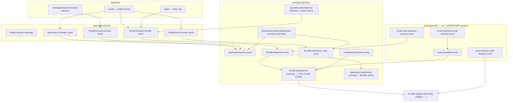

# AW-05 — Agent email end to end · Implementation plan

> Translates [`spec.md`](./spec.md) into architecture, data model, endpoints, jobs and phases.
> The plan owns implementation detail; the spec owns behaviour.

**Epic ID**: `AW-05-agent-email`
**Spec**: [`./spec.md`](./spec.md) · **Tasks**: [`./tasks.md`](./tasks.md)
**Status**: `Draft`
**Last updated**: 2026-09-06

---

## 1. Current state in the codebase

Everything below was read, not assumed. Paths are repo-relative and verified to exist.

### 1.1 What already works and must not be broken

| Area                                                        | Where                                                                                                                                                                                                                                                                                                                                                                                                                                                                                                                                                  | State                                                                                                                                                                                                                                                                                                                                    |
| ----------------------------------------------------------- | ------------------------------------------------------------------------------------------------------------------------------------------------------------------------------------------------------------------------------------------------------------------------------------------------------------------------------------------------------------------------------------------------------------------------------------------------------------------------------------------------------------------------------------------------------ | ---------------------------------------------------------------------------------------------------------------------------------------------------------------------------------------------------------------------------------------------------------------------------------------------------------------------------------------- | ------------------------------------------------------------------------ |
| Tenant address registry + CRUD + verification-token confirm | [`apps/api/src/email/email.controller.ts`](../../../../../apps/api/src/email/email.controller.ts), [`email.service.ts`](../../../../../apps/api/src/email/email.service.ts)                                                                                                                                                                                                                                                                                                                                                                            | Working. Owner-scoped. `verificationToken` / `verificationTokenExpiresAt` stripped at the boundary by [`email-address.projection.ts`](../../../../../apps/api/src/email/email-address.projection.ts).                                                                                                                                    |
| Outbound send through a resolved provider plugin            | [`packages/agent/src/facades/email.facade.ts`](../../../../../packages/agent/src/facades/email.facade.ts) `EmailFacadeService.send()`                                                                                                                                                                                                                                                                                                                                                                                                                  | Working. Persists `email_messages`, emits a `PluginUsageEvent` with `capability='email'`. **This is the single choke point every send path converges on — the cap gate goes here.**                                                                                                                                                      |
| Inbound webhook, signature-verified per owning tenant       | `POST /api/email/inbound/:pluginId` in [`email.controller.ts`](../../../../../apps/api/src/email/email.controller.ts) (throttled 600/60s, `@Public()`)                                                                                                                                                                                                                                                                                                                                                                                                 | Working. Non-leaking ack (`{received:true}`) per EW-718.                                                                                                                                                                                                                                                                                 |
| Inbound routing → Task spawn or conversation thread         | [`packages/agent/src/notifications/default-inbound-email-dispatcher.service.ts`](../../../../../packages/agent/src/notifications/default-inbound-email-dispatcher.service.ts), contract in [`agent-inbound-email-dispatcher.ts`](../../../../../packages/agent/src/notifications/agent-inbound-email-dispatcher.ts)                                                                                                                                                                                                                                    | Working. `deriveThreadKey()` already normalises `Re:`/`Fwd:` prefixes. `INBOUND_EMAIL_TASK_SPAWNER` bound in [`apps/api/src/agents/agents.module.ts`](../../../../../apps/api/src/agents/agents.module.ts). Its JSDoc already flags inbound `subject`/`bodyText`/`from` as attacker-controlled — that guidance becomes enforceable here. |
| Delivery-event webhook folding onto `deliveryStatus`        | `POST /api/email/events/:pluginId`                                                                                                                                                                                                                                                                                                                                                                                                                                                                                                                     | Working, latest-status-wins.                                                                                                                                                                                                                                                                                                             |
| Agent `sendEmail` / `messageAgent` tools                    | [`packages/agent/src/agents/agent-tool.service.ts`](../../../../../packages/agent/src/agents/agent-tool.service.ts) (`buildSendEmailTool`, `buildMessageAgentTool`), contract [`agent-email-facade.ts`](../../../../../packages/agent/src/agents/agent-email-facade.ts)                                                                                                                                                                                                                                                                                | Working. Sends immediately — this is what the draft gate intercepts.                                                                                                                                                                                                                                                                     |
| SSE stream of new messages                                  | `GET /api/email/messages/stream` in [`email.controller.ts`](../../../../../apps/api/src/email/email.controller.ts); BFF proxy [`apps/web/src/app/api/email/messages/stream/route.ts`](../../../../../apps/web/src/app/api/email/messages/stream/route.ts)                                                                                                                                                                                                                                                                                              | Working server-side (5s poll, 15s heartbeat, 10-min lifetime cap). **No client consumes it** — the hook its own JSDoc describes was never built.                                                                                                                                                                                         |
| Per-agent message list / detail / composer                  | [`apps/web/src/components/agents/AgentInboxPanel.tsx`](../../../../../apps/web/src/components/agents/AgentInboxPanel.tsx), [`MessageDetail.tsx`](../../../../../apps/web/src/components/agents/MessageDetail.tsx), [`Composer.tsx`](../../../../../apps/web/src/components/agents/Composer.tsx) under `apps/web/src/app/[locale]/(dashboard)/agents/[id]/inbox/`                                                                                                                                                                                       | Working but unreachable — no tab in [`AgentDetailTabs.tsx`](../../../../../apps/web/src/components/agents/AgentDetailTabs.tsx), no `DASHBOARD_AGENT_INBOX` in [`apps/web/src/lib/constants.ts`](../../../../../apps/web/src/lib/constants.ts).                                                                                           |
| Escalations                                                 | entity [`packages/agent/src/entities/agent-escalation.entity.ts`](../../../../../packages/agent/src/entities/agent-escalation.entity.ts), service [`agent-escalation.service.ts`](../../../../../packages/agent/src/agents/agent-escalation.service.ts), agent tool [`agent-escalation-tools.ts`](../../../../../packages/agent/src/agents/agent-escalation-tools.ts), controller [`apps/api/src/escalations/escalations.controller.ts`](../../../../../apps/api/src/escalations/escalations.controller.ts) (`GET /`, `GET /:id`, `POST /:id/resolve`) | Working. Reason codes are a TS union in [`packages/contracts/src/agents/escalation.types.ts`](../../../../../packages/contracts/src/agents/escalation.types.ts) over a `varchar(32)` column — adding a member needs no migration.                                                                                                        |
| Approvals (agent action proposals)                          | entity [`agent-action-proposal.entity.ts`](../../../../../packages/agent/src/entities/agent-action-proposal.entity.ts), service [`agent-approvals.service.ts`](../../../../../packages/agent/src/agent-approvals/agent-approvals.service.ts), controller [`apps/api/src/agent-approvals/agent-approvals.controller.ts`](../../../../../apps/api/src/agent-approvals/agent-approvals.controller.ts)                                                                                                                                                     | Working. `actionType` already includes `'send_message'`; `decidedVia` already distinguishes `user` from `guardrail`. **A draft is exactly this shape** — no new approval concept needed.                                                                                                                                                 |
| Budget/cap enforcement precedent                            | [`packages/agent/src/budgets/budget-guard.service.ts`](../../../../../packages/agent/src/budgets/budget-guard.service.ts) + [`budget-exceeded.exception.ts`](../../../../../packages/agent/src/budgets/budget-exceeded.exception.ts) (HTTP 402 with structured `details`)                                                                                                                                                                                                                                                                              | The exact pattern the send cap copies.                                                                                                                                                                                                                                                                                                   |
| Job-runtime dispatch                                        | dispatcher symbols in [`packages/agent/src/facades/index.ts`](../../../../../packages/agent/src/facades/index.ts) and per-domain modules; bindings in [`packages/tasks/src/trigger/trigger.module.ts`](../../../../../packages/tasks/src/trigger/trigger.module.ts) via `JobRuntimeProviderRegistry`; tasks in [`packages/tasks/src/tasks/trigger/`](../../../../../packages/tasks/src/tasks/trigger/)                                                                                                                                                 | 19 `*_DISPATCHER` symbols today. [`notification-channel-delivery.task.ts`](../../../../../packages/tasks/src/tasks/trigger/notification-channel-delivery.task.ts) already demonstrates **delayed** enqueue for quiet hours — the scheduled-send mechanism.                                                                               |
| Provider plugins                                            | `packages/plugins/{postmark,mailgun,sendgrid,resend,mailchimp-transactional}/src/`                                                                                                                                                                                                                                                                                                                                                                                                                                                                     | 5 outbound; only Postmark + Mailgun declare inbound.                                                                                                                                                                                                                                                                                     |
| DNS capability                                              | [`packages/plugin/src/contracts/capabilities/dns.interface.ts`](../../../../../packages/plugin/src/contracts/capabilities/dns.interface.ts), plugin `packages/plugins/cloudflare-dns/`                                                                                                                                                                                                                                                                                                                                                                 | `DnsRecordType` is `'CNAME'                                                                                                                                                                                                                                                                                                              | 'A'` only — no TXT, no MX. Relevant to the P3 one-click-publish stretch. |

### 1.2 The gaps this epic closes

1. **No per-agent binding surface.** `agent_email_assignments` has an entity and a repository; nothing writes it. Confirmed: no controller route, no CLI path.
2. **No pre-send state.** `email_messages` has only `deliveryStatus`, which is post-send provider telemetry.
3. **No caps.** `POST /api/email/messages` carries no `@Throttle` while both webhook routes carry `600/60s`. There is no per-inbox or per-workspace ceiling anywhere.
4. **No inbound filtering.** Every inbound message that resolves an assignment reaches an Agent's reasoning.
5. **No sending-domain concept.** One free-text `defaultSenderDomain` in one plugin's settings schema, read nowhere.
6. **Threading is inbound-only.** Outbound rows never get a `conversationId`; the entity JSDoc documents `taskId` XOR `conversationId`.
7. **Verification loop is broken.** `triggerVerification` discards the token the plugin returns and no plugin's `verifyAddress()` actually sends mail. Agent Inbox provisioning bypasses this entirely (the platform owns the mail domain and marks the address verified at allocation), and P2 fixes the tenant-address loop as a side effect of adding a verification template.

---

## 2. Architecture and the seam



### 2.1 The three seams

**Seam 1 — the send choke point.** Every outbound path (`buildSendEmailTool`, `buildMessageAgentTool`, `EmailService.sendMessage`, an approved draft, a firing schedule) already funnels into `EmailFacadeService.send()`. Both the **outbound rule check** and the **cap gate** go at the top of that method, before `resolveOutboundPlugin`. This is the only place they can be, and it is why FR-63 ("no privileged bypass") is achievable at all. `EmailFacadeService` gains two optional injected collaborators (`EmailSendCapGuard`, `EmailRuleResolver`) following the `@Optional()` pattern it already uses for its five repositories, so unit contexts that construct the facade bare keep working.

**Seam 2 — the draft gate.** `AgentEmailFacadeAdapter` (bound to `AGENT_EMAIL_FACADE` in `apps/api/src/agents/agents.module.ts`) currently forwards straight to `EmailFacadeService.send`. It instead calls `EmailDraftService.submit()`, which reads the inbox mode:

- `draft-review` → persist `email_messages` with `status='draft'`, create an `agent_action_proposals` row (`actionType='send_message'`, payload `{kind:'email-draft', emailMessageId, inboxId, threadId}`), return a structured "held for approval" result to the model.
- `auto-send` → same proposal row, auto-decided (`status='approved'`, `decidedVia='guardrail'`), then straight through to `EmailFacadeService.send`. The proposal row is the audit trail either way.

**Seam 3 — the inbound filter.** `DefaultInboundEmailDispatcher.dispatch()` gains a first step: resolve the recipient to an Agent Inbox, run `EmailRuleResolver.evaluate({direction:'inbound', address: from, inboxId})`. On `block`, persist the message with `status='blocked'` and `blockedByRuleId`, return `{handled:true, reason:'blocked-by-rule'}` and **return before** any Task spawn, conversation write or Run. Nothing reaches a model. This is the prompt-injection-surface reduction the existing JSDoc asks for.

### 2.2 Thread grouping — the one invariant that changes

The `EmailMessage` JSDoc documents "either `taskId` OR `conversationId` is set (never both)". That rule was a v1.1 dispatch-mode discriminator; it is superseded here. Going forward **every** message gets a `conversationId` (its thread), and `taskId` is an additional, orthogonal link to the Task an inbound message spawned. Dispatch mode continues to live on `agent_email_assignments.dispatchMode`, which is where it belonged. In DB terms this is purely additive: a previously-`NULL` nullable column becomes populated. The migration backfills threads for orphan messages (§3.3). The JSDoc on the entity is updated in the same PR so the comment does not lie.

---

## 3. Data model

Migrations live in [`apps/api/src/migrations/`](../../../../../apps/api/src/migrations/) (174 files today; the API self-applies on boot via `migrationsRun`). Generate from `apps/api/` with `pnpm typeorm migration:generate -d typeorm.config.ts src/migrations/<Name>`. Every migration below is **forward-only, additive, existence-guarded**, and uses portable `TableColumn` DDL because CI runs better-sqlite3 while production runs Postgres — the pattern in [`1789100000000-AddTaskGraphFanout.ts`](../../../../../apps/api/src/migrations/1789100000000-AddTaskGraphFanout.ts).

Adding an entity means touching **four** registries, not one:
`packages/agent/src/entities/index.ts`, `packages/agent/src/database/_entities-inventory.ts`,
`packages/agent/src/database/_entity-names.ts`, `packages/agent/src/database/_repository-inventory.ts`.

### 3.1 New tables

#### `agent_inboxes` — the Agent's mail identity and policy

```ts
@Entity({ name: 'agent_inboxes' })
@Index('uq_agent_inboxes_agent', ['agentId'], { unique: true })
@Index('uq_agent_inboxes_address', ['address'], { unique: true })
@Index('idx_agent_inboxes_user_state', ['userId', 'state'])
export class AgentInbox {
  id: string;                      // uuid pk
  userId: string;                  // uuid, owner
  agentId: string;                 // uuid, unique — FR-2, exactly one inbox per agent
  emailAddressId: string;          // uuid → tenant_email_addresses.id
  address: string;                 // varchar(254), unique, the live address
  localPart: string;               // varchar(64)
  sendingDomainId: string | null;  // uuid → email_sending_domains.id; NULL = platform default
  previousAddresses: { address: string; expiresAt: string }[] | null; // simple-json, max 5 (FR-5)
  mode: 'draft-review' | 'auto-send';        // varchar(16), default 'draft-review' (FR-79)
  standingInstructions: string | null;        // text, max 8000 chars enforced in the DTO (FR-77)
  instructionsHistory: { text: string; editedAt: string; editedBy: string }[] | null; // simple-json, max 10 (FR-82)
  learnFromEdits: boolean;         // default true (FR-28)
  allowListMode: 'additive' | 'exclusive';    // varchar(16), default 'additive' (FR-55)
  dailySendCap: number;            // int, default 100, clamped 1..1000 (FR-60)
  state: 'active' | 'cap-paused' | 'suspended' | 'released';  // varchar(16), default 'active'
  capPausedUntil: Date | null;     // portable date (FR-65)
  capNotifiedAt: Date | null;      // 80% threshold, once per window (FR-69)
  addressReleasedAt: Date | null;  // 30-day hold after agent archive (FR-8)
  tenantId: string | null;
  organizationId: string | null;
  createdAt / updatedAt
}
```

No `@ManyToOne` to `Agent` — same cycle-avoidance posture as `email_messages` (EW-654). `emailAddressId` keeps a `@ManyToOne` to `TenantEmailAddress` with `onDelete: 'RESTRICT'` so an address bound to a live inbox cannot be deleted out from under it.

#### `email_rules` — allow and block

```ts
@Entity({ name: 'email_rules' })
@Index('idx_email_rules_lookup', ['userId', 'direction', 'matchValue'])
@Index('idx_email_rules_inbox', ['inboxId'])
export class EmailRule {
  id: string;
  userId: string;
  inboxId: string | null;          // NULL = workspace scope (FR-50)
  ruleType: 'allow' | 'block';     // varchar(8)
  matchKind: 'address' | 'domain'; // varchar(8)
  matchValue: string;              // varchar(254), lower-cased at write, '@example.com' for domain
  direction: 'inbound' | 'outbound' | 'both';  // varchar(16), default 'both'
  note: string | null;             // varchar(200)
  matchCount7d: number;            // int, default 0 — rolled by the sweeper (FR-57)
  lastMatchedAt: Date | null;
  tenantId / organizationId / createdAt / updatedAt
}
```

Precedence (FR-53) is a **pure function** so it is trivially unit-testable:

```
score(rule) = (rule.inboxId ? 4 : 0) + (rule.matchKind === 'address' ? 2 : 0) + (rule.ruleType === 'allow' ? 1 : 0)
winner = argmax(score) over matching rules
verdict = winner ? winner.ruleType
        : (allowListMode === 'exclusive' && anyAllowRuleExistsForDirection) ? 'block'
        : 'allow'
```

The bit-weights encode the chant exactly: inbox beats workspace (4), exact beats domain (2), allow beats block (1). Ties are impossible because `(inboxId, matchKind, matchValue, direction, ruleType)` is unique.

#### `email_sending_domains`

```ts
@Entity({ name: 'email_sending_domains' })
@Index('uq_email_sending_domains_user_domain', ['userId', 'domain'], { unique: true })
export class EmailSendingDomain {
  id: string;
  userId: string;
  domain: string;                  // varchar(253)
  pluginId: string;                // varchar(64) — which provider owns verification
  status: 'pending' | 'verifying' | 'verified' | 'unverified' | 'failed' | 'removed'; // varchar(16)
  records: { type: 'TXT'|'MX'|'CNAME'; host: string; value: string; ttl: number; purpose: 'spf'|'dkim'|'dmarc'|'mx' }[]; // simple-json (FR-71)
  lastCheckedAt: Date | null;
  nextCheckAt: Date | null;        // 15-min cadence (FR-72)
  checkAttempts: number;           // int, default 0; give up after 288 (72h / 15m)
  verifiedAt: Date | null;
  failureReason: string | null;    // varchar(500)
  tenantId / organizationId / createdAt / updatedAt
}
```

Distinct from the website `custom_domains` concept: different provider capability, different record types, different lifecycle.

### 3.2 Additive columns on existing tables

**`email_messages`** — all nullable or defaulted, nothing dropped:

| Column              | Type                                | Why                                                                              |
| ------------------- | ----------------------------------- | -------------------------------------------------------------------------------- |
| `status`            | `varchar(16)`, default `'sent'`     | FR-21 state machine                                                              |
| `inboxId`           | `uuid` null                         | which Agent Inbox owns it                                                        |
| `threadId`          | _(reuse existing `conversationId`)_ | §2.2 — now always populated                                                      |
| `approvalId`        | `uuid` null                         | the `agent_action_proposals` row for a draft (FR-23)                             |
| `escalationId`      | `uuid` null                         | the `agent_escalations` row (FR-40)                                              |
| `runId`             | `uuid` null                         | FR-16 / FR-87 — the Run that wrote it                                            |
| `scheduledFor`      | timestamptz null                    | FR-41                                                                            |
| `scheduledTimezone` | `varchar(64)` null                  | FR-43, the recipient timezone used                                               |
| `scheduleJobId`     | `varchar(120)` null                 | the job-runtime run id, for cancellation                                         |
| `sendAttempts`      | `int`, default 0                    | FR-48 retry accounting                                                           |
| `readAt`            | timestamptz null                    | unread axis (FR-14)                                                              |
| `draftHistory`      | `simple-json` null                  | last 10 versions (FR-27), each `{body, subject, authoredBy, authoredAt, notes?}` |
| `reviseCount`       | `int`, default 0                    | FR-29 ceiling of 5                                                               |
| `staleSince`        | timestamptz null                    | FR-32                                                                            |
| `attachmentsMeta`   | `simple-json` null                  | up to 25 `{filename, contentType, sizeBytes}` (spec §7)                          |
| `blockedByRuleId`   | `uuid` null                         | FR-51 / FR-58                                                                    |
| `failureReason`     | `varchar(500)` null                 | FR-18 provider error text on the card                                            |

Indices added: `idx_email_messages_inbox_status_created (inboxId, status, createdAt)`,
`idx_email_messages_scheduled (status, scheduledFor)` — the sweeper's only query —
`idx_email_messages_cap_window (inboxId, status, sentAt)` — the cap query.

**`email_conversations`** (the thread):

| Column           | Type                            | Why                                                        |
| ---------------- | ------------------------------- | ---------------------------------------------------------- |
| `inboxId`        | `uuid` null                     | direct thread → inbox link, avoids a join through messages |
| `userId`         | `uuid` null                     | owner-scoped list queries without a join                   |
| `subject`        | `varchar(998)` null             | FR-14 row rendering                                        |
| `messageCount`   | `int`, default 0                | FR-14 count pill                                           |
| `unreadCount`    | `int`, default 0                | FR-11 per-inbox badge                                      |
| `hasAttachments` | `boolean`, default false        | FR-14 indicator                                            |
| `dominantStatus` | `varchar(16)` null              | FR-14 badge, precomputed                                   |
| `escalationId`   | `uuid` null                     | FR-37                                                      |
| `state`          | `varchar(16)`, default `'open'` | `open` / `archived`                                        |
| `lastInboundAt`  | timestamptz null                | FR-32 staleness comparison                                 |

Index: `idx_email_conversations_inbox_state_last (inboxId, state, lastMessageAt)`.

**Enum-shaped additions with no schema change** (both are TS unions over `varchar` columns):

- `AgentEscalationReasonCode` gains `'email-escalated'` in
  [`packages/contracts/src/agents/escalation.types.ts`](../../../../../packages/contracts/src/agents/escalation.types.ts)
  (`varchar(32)`, list also feeds `@IsIn` validators — append only, never reorder).
- `ActivityActionType` in
  [`packages/agent/src/entities/activity-log.types.ts`](../../../../../packages/agent/src/entities/activity-log.types.ts)
  gains `EMAIL_INBOX_PROVISIONED`, `EMAIL_DRAFT_CREATED`, `EMAIL_DRAFT_APPROVED`,
  `EMAIL_DRAFT_REVISED`, `EMAIL_DRAFT_DISCARDED`, `EMAIL_SEND_SCHEDULED`,
  `EMAIL_SEND_CANCELLED`, `EMAIL_SENT`, `EMAIL_SEND_REFUSED`, `EMAIL_BLOCKED_BY_RULE`,
  `EMAIL_RULE_CHANGED`, `EMAIL_MODE_CHANGED`, `EMAIL_DOMAIN_VERIFIED`,
  `EMAIL_DOMAIN_UNVERIFIED`. `actionType` is a free `varchar(50)`; no migration.

### 3.3 The migrations (three, in order)

Timestamps are AW-05 slots 00–02 of the program's reserved migration blocks ([README §5 rule 10](../README.md#5-rules-every-epic-spec-in-this-program-must-follow));
the implementing PR re-stamps them before merge if `develop` has moved past them.

1. **`1791050000000-AddAgentInboxesAndEmailRules.ts`** — creates `agent_inboxes`, `email_rules`,
   `email_sending_domains`. Pure `CREATE TABLE` + indices. No data touched.
2. **`1791050100000-AddEmailMessageLifecycle.ts`** — the additive columns on `email_messages` and
   `email_conversations`, plus the three new indices. **Backfill in the same migration:**
    - `UPDATE email_messages SET status='received' WHERE direction='inbound' AND status IS NULL`
    - `UPDATE email_messages SET status='sent' WHERE direction='outbound' AND status IS NULL`
    - `UPDATE email_messages SET readAt = createdAt WHERE direction='outbound'` (own sends are read)
      Batched at 5,000 rows so a large table does not hold a long transaction.
3. **`1791050200000-BackfillEmailThreads.ts`** — for every `email_messages` row with a NULL
   `conversationId`, find-or-create an `email_conversations` row keyed
   `(agentId, deriveThreadKey(subject))` using the **existing** helper from
   [`agent-inbound-email-dispatcher.ts`](../../../../../packages/agent/src/notifications/agent-inbound-email-dispatcher.ts),
   then set `conversationId`; finally recompute `messageCount` / `hasAttachments` /
   `lastMessageAt` / `subject` per thread. Idempotent and re-runnable (guards on NULL), batched at
   2,000 rows. Runs after (2) so `status` is already populated.

Provisioning an Agent Inbox does **not** backfill anything: existing `agent_email_assignments`
rows keep working untouched, and an inbox is created only when a user asks for one.

### 3.4 Contracts (`packages/contracts`)

New `packages/contracts/src/email/` (barrel exported from
[`packages/contracts/src/index.ts`](../../../../../packages/contracts/src/index.ts) alongside the
existing `./inbox/index.js`), holding: `EmailMessageStatus`, `AgentInboxMode`,
`EmailRuleType` / `EmailRuleMatchKind` / `EmailRuleDirection`, `EmailSendingDomainStatus`,
`AgentInboxDto`, `EmailThreadDto`, `EmailMessageDto`, `EmailRuleDto`, `EmailSendingDomainDto`,
`EmailCapMeterDto`, and the hard caps as exported constants, mirroring the existing
[`packages/contracts/src/inbox/inbox.types.ts`](../../../../../packages/contracts/src/inbox/inbox.types.ts)
posture:

```ts
export const EMAIL_INBOX_DEFAULT_DAILY_CAP = 100;
export const EMAIL_INBOX_MIN_DAILY_CAP = 1;
export const EMAIL_INBOX_MAX_DAILY_CAP = 1000;
export const EMAIL_INBOX_BURST_SENDS = 10; // per 60s
export const EMAIL_INBOX_BURST_WINDOW_MS = 60_000;
export const EMAIL_INBOX_BURST_RECIPIENTS = 20; // per 300s
export const EMAIL_INBOX_RECIPIENT_WINDOW_MS = 300_000;
export const EMAIL_WORKSPACE_DAILY_CAP = 500;
export const EMAIL_WORKSPACE_MONTHLY_CAP = 10_000;
export const EMAIL_MAX_RECIPIENTS_PER_MESSAGE = 50;
export const EMAIL_MAX_SCHEDULED_PER_INBOX = 200;
export const EMAIL_SCHEDULE_MIN_LEAD_MS = 60_000;
export const EMAIL_SCHEDULE_MAX_HORIZON_DAYS = 90;
export const EMAIL_MAX_REVISIONS = 5;
export const EMAIL_MAX_REVISE_NOTE_CHARS = 2_000;
export const EMAIL_DRAFT_VERSION_HISTORY = 10;
export const EMAIL_DRAFT_WARN_DAYS = 7;
export const EMAIL_DRAFT_EXPIRE_DAYS = 14;
export const EMAIL_MAX_STANDING_INSTRUCTION_CHARS = 8_000;
export const EMAIL_MAX_RULES_PER_WORKSPACE = 500;
export const EMAIL_MAX_RULES_PER_INBOX = 200;
export const EMAIL_MAX_SENDING_DOMAINS = 5;
export const EMAIL_ADDRESS_ALIAS_GRACE_DAYS = 30;
export const EMAIL_BLOCKED_RETENTION_DAYS = 30;
export const EMAIL_SEND_UNDO_GRACE_MS = 5_000;
export const EMAIL_BOUNCE_AUTO_GATE_THRESHOLD = 3; // per 24h
export const EMAIL_MAX_ATTACHMENT_META = 25;
export const EMAIL_DOMAIN_CHECK_INTERVAL_MS = 900_000; // 15m
export const EMAIL_DOMAIN_MAX_CHECKS = 288; // 72h
```

Every number in the spec appears exactly once, here.

---

## 4. API

New controllers under `apps/api/src/email/`, registered in
[`email.module.ts`](../../../../../apps/api/src/email/email.module.ts). All are
`@UseGuards(AuthSessionGuard)` + `@ApiBearerAuth('JWT-auth')` + `@CurrentUser()`, owner-scoped in
the service (never in the controller), and follow the existing "foreign id returns the same 404 as
a missing id" posture from [`inbox.controller.ts`](../../../../../apps/api/src/inbox/inbox.controller.ts).
Nothing existing changes shape (Constitution X).

### 4.1 `agent-inbox.controller.ts` — `@Controller('api/email/inboxes')`

| Method   | Path       | Body / query                                                                                                                    | Auth                                                                                  | Notes                                                                                                                         |
| -------- | ---------- | ------------------------------------------------------------------------------------------------------------------------------- | ------------------------------------------------------------------------------------- | ----------------------------------------------------------------------------------------------------------------------------- |
| `GET`    | `/`        | —                                                                                                                               | agent read                                                                            | `{ inboxes: AgentInboxDto[] }` with `unreadCount` + `capMeter`.                                                               |
| `POST`   | `/`        | `ProvisionInboxDto { agentId, localPart?, sendingDomainId? }`                                                                   | agent write                                                                           | 201. Idempotent: returns the existing inbox with 200 if one exists (FR-2). `@Throttle({ long: { limit: 10, ttl: 60_000 } })`. |
| `GET`    | `/:id`     | —                                                                                                                               | agent read                                                                            |                                                                                                                               |
| `PATCH`  | `/:id`     | `UpdateInboxDto { localPart?, sendingDomainId?, mode?, standingInstructions?, learnFromEdits?, allowListMode?, dailySendCap? }` | `mode`/`dailySendCap`/`sendingDomainId` require workspace owner; the rest agent write | 200                                                                                                                           |
| `DELETE` | `/:id`     | —                                                                                                                               | agent write                                                                           | 204. Cancels outstanding schedules, keeps history (FR-7).                                                                     |
| `GET`    | `/:id/cap` | —                                                                                                                               | agent read                                                                            | `EmailCapMeterDto` — three windows, used/held/remaining, `windowClearsAt`.                                                    |

`ProvisionInboxDto` validators: `@IsUUID() agentId`, `@IsOptional() @Matches(/^[a-z0-9][a-z0-9._-]{1,62}[a-z0-9]$/) @Length(3,64) localPart`.
`UpdateInboxDto`: `@IsIn(['draft-review','auto-send'])`, `@IsInt() @Min(1) @Max(1000) dailySendCap`,
`@MaxLength(8000) standingInstructions`.

### 4.2 `email-threads.controller.ts` — `@Controller('api/email/threads')`

| Method  | Path   | Query / body                              | Notes                                                         |
| ------- | ------ | ----------------------------------------- | ------------------------------------------------------------- | ------ | ------ | ----------- | ----------------------------------------------------- | -------------------------------------------------------------------------------------------------------------------------------------- |
| `GET`   | `/`    | `inboxId?` (omit = all), `filter=received | sent                                                          | unread | drafts | escalations | scheduled`, `q?`, `limit`(1–50, default 50),`cursor?` | `{ threads, meta: { nextCursor, counts: Record<filter, number> } }`. Cursor is `(lastMessageAt, id)` keyset — never OFFSET, per FR-17. |
| `GET`   | `/:id` | —                                         | Thread + ordered messages + quoted-history flags + run links. |
| `PATCH` | `/:id` | `{ read?: boolean, archived?: boolean }`  |                                                               |

### 4.3 Message lifecycle — added to the existing `email.controller.ts`

Declared **before** the existing `messages/:id` route, mirroring the route-order note already in
that file for `messages/stream`.

| Method  | Path                                  | Body                                                                     | Notes                                                                                                                                                                                                                                            |
| ------- | ------------------------------------- | ------------------------------------------------------------------------ | ------------------------------------------------------------------------------------------------------------------------------------------------------------------------------------------------------------------------------------------------ |
| `POST`  | `/api/email/messages/:id/approve`     | `ApproveDraftDto { subject?, bodyText?, bodyHtml?, sendAt?, timezone? }` | Applies the inline edit, approves the linked proposal, sends (or schedules when `sendAt` is present). CAS on `status='draft'` → 409 `AlreadyDecided` with `{ decidedBy, decidedAt }` (FR-33). `@Throttle({ long: { limit: 60, ttl: 60_000 } })`. |
| `POST`  | `/api/email/messages/:id/revise`      | `ReviseDraftDto { notes }` `@MaxLength(2000)`                            | 202. 409 when `reviseCount >= 5`. Dispatches a Run.                                                                                                                                                                                              |
| `POST`  | `/api/email/messages/:id/discard`     | —                                                                        | 204. CAS on `draft`/`scheduled`.                                                                                                                                                                                                                 |
| `POST`  | `/api/email/messages/:id/schedule`    | `ScheduleSendDto { sendAt, timezone? }`                                  | `@IsISO8601()`; rejects `< now+60s` or `> now+90d`; 429 when the inbox already holds 200.                                                                                                                                                        |
| `POST`  | `/api/email/messages/:id/cancel-send` | —                                                                        | CAS `scheduled → draft`; **409 `TooLate`** if the row already moved to `sending`/`sent` (FR-44, S13).                                                                                                                                            |
| `POST`  | `/api/email/messages/:id/retry`       | —                                                                        | `failed → sending` (S18). Reuses the original `messageRef` so the provider's idempotency cache prevents a duplicate.                                                                                                                             |
| `PATCH` | `/api/email/messages/:id/read`        | `{ unread?: boolean }`                                                   | Mirrors the operator-inbox convention.                                                                                                                                                                                                           |

**`POST /api/email/messages` (existing compose) gains `@Throttle({ long: { ttl: 60_000, limit: 30 } })`** — closing gap §1.2.3 at the HTTP layer, independent of the cap gate at the domain layer. It also gains optional `sendAt` / `saveAsDraft` fields; every existing field keeps its meaning.

### 4.4 `email-rules.controller.ts` — `@Controller('api/email/rules')`

`GET /` (`?inboxId=&direction=`), `POST /` (`CreateRuleDto { ruleType, matchKind, matchValue, direction?, inboxId?, note? }`), `PATCH /:id`, `DELETE /:id`, and `GET /blocked` (`?inboxId=&limit=`) for the 30-day blocked view (FR-58). Rule writes require workspace-owner rights and emit an activity-log row (FR-59).

### 4.5 `email-domains.controller.ts` — `@Controller('api/email/domains')`

`GET /`, `POST /` (`AddDomainDto { domain, pluginId }` → returns the records to publish),
`POST /:id/verify` (manual re-check, `@Throttle({ long: { limit: 10, ttl: 60_000 } })`),
`POST /:id/assign` (`{ inboxIds?: string[], all?: boolean }`), `DELETE /:id` (returns the impact
count first via `GET /:id/impact`). All workspace-owner only (FR-76).

### 4.6 Error contracts

`EmailSendCapExceededException extends HttpException` (HTTP **429**), modelled directly on
[`budget-exceeded.exception.ts`](../../../../../packages/agent/src/budgets/budget-exceeded.exception.ts):

```ts
{ statusCode: 429, error: 'EmailSendCapExceeded',
  message: "Nova's inbox has used 100 of 100 sends in the last 24 hours. Capacity returns at 14:05.",
  details: { scope: 'inbox'|'workspace', limitKind: 'daily'|'burst'|'recipients'|'monthly'|'recipientsPerMessage',
             used: number, cap: number, windowSeconds: number, retryAfterSeconds: number, inboxId?: string } }
```

`EmailRecipientBlockedException` (HTTP **403**, `error: 'EmailRecipientBlocked'`, details carry
`{ recipient, ruleId, matchValue, scope }`). Both are shaped so the agent tool can hand the model
a readable sentence and the web client can render the banner without string-matching.

---

## 5. Web

### 5.1 Routes

| Route                                                          | Owns                                                                                     |
| -------------------------------------------------------------- | ---------------------------------------------------------------------------------------- |
| `apps/web/src/app/[locale]/(dashboard)/email/page.tsx`         | The unified Email screen (spec §6.1)                                                     |
| `.../(dashboard)/email/[threadId]/page.tsx`                    | Thread deep-link; on desktop it hydrates the right pane                                  |
| `.../(dashboard)/email/compose/page.tsx`                       | Compose (spec §6.7)                                                                      |
| `.../(dashboard)/settings/integrations/email-domains/page.tsx` | Sending domains (spec §6.9)                                                              |
| `.../(dashboard)/agents/[id]/inbox/page.tsx`                   | **Existing route, upgraded in place** — renders the same thread list scoped to one Agent |

Route constants added to [`apps/web/src/lib/constants.ts`](../../../../../apps/web/src/lib/constants.ts):
`DASHBOARD_EMAIL: '/email'`, `DASHBOARD_EMAIL_THREAD: (id) => '/email/' + id`,
`DASHBOARD_EMAIL_COMPOSE: '/email/compose'`,
`DASHBOARD_AGENT_INBOX: (id) => '/agents/' + id + '/inbox'` (the missing constant),
`SETTINGS_EMAIL_DOMAINS: '/settings/integrations/email-domains'`.

### 5.2 Shell integration

- **Sidebar**: one entry in [`DashboardSidebar.tsx`](../../../../../apps/web/src/components/dashboard/DashboardSidebar.tsx)'s `navigation` array — `{ name: t('navigation.email'), href: ROUTES.DASHBOARD_EMAIL, icon: Mail }` — placed directly after the existing `inbox` entry, with a `SidebarEmailBadge` copied from the shape of [`SidebarInboxBadge.tsx`](../../../../../apps/web/src/components/dashboard/SidebarInboxBadge.tsx) (30s poll, same badge styling).
- **Agent tab**: one entry appended to [`AgentDetailTabs.tsx`](../../../../../apps/web/src/components/agents/AgentDetailTabs.tsx) — `{ key: 'inbox', href: ROUTES.DASHBOARD_AGENT_INBOX(agentId), label: t('inbox') }` — closing the orphan-route gap.

Nothing is removed from either.

### 5.3 Components — `apps/web/src/components/email/`

| Component                          | Responsibility                                                                                                                                                                                                                        |
| ---------------------------------- | ------------------------------------------------------------------------------------------------------------------------------------------------------------------------------------------------------------------------------------- |
| `EmailScreen.tsx`                  | `'use client'` shell: switcher + filter bar + list + detail pane; owns URL state (`?inbox=&filter=&thread=`)                                                                                                                          |
| `InboxSwitcher.tsx`                | All-row + per-inbox rows with unread counts; `[` / `]` navigation                                                                                                                                                                     |
| `EmailFilterBar.tsx`               | The six filters with counts; `1`–`6` shortcuts                                                                                                                                                                                        |
| `ThreadList.tsx` + `ThreadRow.tsx` | Keyset-paginated virtualised list; `j`/`k`/`Enter`                                                                                                                                                                                    |
| `ThreadView.tsx`                   | Ordered `MessageCard`s + the sticky cap footer                                                                                                                                                                                        |
| `MessageCard.tsx`                  | One card; delegates to a status-specific footer                                                                                                                                                                                       |
| `DraftCard.tsx`                    | Inline editor (contenteditable-free `<textarea>` that grows), the four controls, Version history disclosure, stale banner                                                                                                             |
| `EscalationCard.tsx`               | Reason, decision-needed, Dismiss / Instruct, My-Decisions link                                                                                                                                                                        |
| `ScheduledCard.tsx`                | Countdown (one `setInterval` per view, not per card), Cancel send, Edit & reschedule                                                                                                                                                  |
| `SendGraceToast.tsx`               | The 5-second Undo (spec §6.3)                                                                                                                                                                                                         |
| `ReviseDialog.tsx`                 | Notes + counter + revision-of-5 indicator                                                                                                                                                                                             |
| `ComposeSheet.tsx`                 | Send-as selector with the live cap line; blocked-recipient inline error                                                                                                                                                               |
| `InboxSettingsSheet.tsx`           | Four sections: Identity, Standing instructions, Rules & lists, Sending limits                                                                                                                                                         |
| `CapMeter.tsx`                     | Three bars: used / held / remaining                                                                                                                                                                                                   |
| `RulesTable.tsx`                   | Rules + allow-list-mode radio + the precedence explainer                                                                                                                                                                              |
| `SendingDomainsSettings.tsx`       | Domain list, add wizard, records table with copy buttons, remove-impact dialog                                                                                                                                                        |
| `SanitizedHtmlBody.tsx`            | Sandboxed `<iframe srcDoc>` with `sandbox=""`, remote images stripped until **Load images** — the posture the existing [`MessageDetail.tsx`](../../../../../apps/web/src/components/agents/MessageDetail.tsx) comments already demand |
| `useEmailStream.ts`                | **The hook the SSE endpoint was built for and never got** — `EventSource` on `/api/email/messages/stream`, `mutate()` on each event, exponential-backoff reconnect, plain 30s polling fallback                                        |

`EmailScreen`, `ThreadList` and `ThreadView` are the only client components that fetch; everything
below them is presentational and takes props, per the composition rules in
`.claude/skills/vercel-composition-patterns/`.

### 5.4 Data plumbing

- Server actions in `apps/web/src/app/actions/dashboard/email.ts` for reads (thread list, thread, inboxes, cap meter, rules, domains).
- API client `apps/web/src/lib/api/email-threads.ts` + `apps/web/src/lib/api/agent-inboxes.ts`, mirroring [`apps/web/src/lib/api/email-addresses.ts`](../../../../../apps/web/src/lib/api/email-addresses.ts) (server-only `serverFetch`, `X-Scope-Slug` attached).
- BFF route handlers under `apps/web/src/app/api/email/` for the client-side mutations that need the bearer token without shipping it to the browser — `threads/route.ts`, `messages/[id]/approve/route.ts`, `.../revise`, `.../discard`, `.../schedule`, `.../cancel-send`. Each mirrors the existing [`apps/web/src/app/api/email/messages/route.ts`](../../../../../apps/web/src/app/api/email/messages/route.ts) exactly: `getAuthAccessCookie()`, 401 on no token, forward, no cookie leakage.
- Client state via SWR keyed on `(inboxId, filter, cursor)`, revalidated by `useEmailStream`.

---

## 6. Background work

Every job is dispatched through a `*_DISPATCHER` DI symbol resolved by
`JobRuntimeProviderRegistry` in [`packages/tasks/src/trigger/trigger.module.ts`](../../../../../packages/tasks/src/trigger/trigger.module.ts).
**No call site imports `@trigger.dev/sdk`** (Constitution IV). New symbols are declared next to
the email facade in `packages/agent/src/facades/` and re-exported from
[`packages/agent/src/facades/index.ts`](../../../../../packages/agent/src/facades/index.ts).

| Symbol                            | Task file (`packages/tasks/src/tasks/trigger/`) | Trigger                                                                                                                                                                                                            | Does                                                                                                                                                                                                 | Idempotency                                                                                                                                                                                         |
| --------------------------------- | ----------------------------------------------- | ------------------------------------------------------------------------------------------------------------------------------------------------------------------------------------------------------------------ | ---------------------------------------------------------------------------------------------------------------------------------------------------------------------------------------------------- | --------------------------------------------------------------------------------------------------------------------------------------------------------------------------------------------------- |
| `EMAIL_SCHEDULED_SEND_DISPATCHER` | `email-scheduled-send.task.ts`                  | enqueued with `delay` at schedule time (the pattern [`notification-channel-delivery.task.ts`](../../../../../packages/tasks/src/tasks/trigger/notification-channel-delivery.task.ts) already uses for quiet hours) | Fires one scheduled message through `EmailFacadeService.send`                                                                                                                                        | CAS `UPDATE email_messages SET status='sending' WHERE id=:id AND status='scheduled'`; 0 rows → exit. Plus the provider-side `messageRef` idempotency cache. FR-49 holds even if the job runs twice. |
| —                                 | `email-scheduled-send-sweeper.task.ts`          | cron `*/5 * * * *`                                                                                                                                                                                                 | Safety net: any row `status='scheduled' AND scheduledFor <= now()` older than 2 minutes gets re-enqueued. Covers a lost delayed job (runtime switch, provider restart).                              | Same CAS.                                                                                                                                                                                           |
| —                                 | `email-domain-verify-sweeper.task.ts`           | cron `*/5 * * * *`                                                                                                                                                                                                 | Picks domains with `nextCheckAt <= now()`, calls the provider's `verifySendingDomain`, advances `status` / `nextCheckAt` / `checkAttempts`; also re-checks `verified` domains once every 24h (FR-75) | `DistributedTaskLockService.runExclusive('email-domain-verify')` — one sweeper at a time.                                                                                                           |
| —                                 | `email-draft-staleness-sweeper.task.ts`         | cron `17 3 * * *` (off-the-hour, per the `kb-reconcile` rationale)                                                                                                                                                 | Warns at 7 days, auto-discards at 14 (FR-31); rolls `email_rules.matchCount7d` (FR-57); expires address aliases and blocked-mail retention past 30 days                                              | Idempotent by date comparison.                                                                                                                                                                      |
| `EMAIL_DRAFT_REVISE_DISPATCHER`   | _(no new task)_                                 | on `POST /:id/revise`                                                                                                                                                                                              | Reuses the existing `agent-task-execute` path via the already-bound `AGENT_TASK_EXECUTE_DISPATCHER` — a revise is a Run, not a new job kind                                                          | The Task carries the message id; a second revise while one is in flight is rejected at the controller (409).                                                                                        |

The delayed-enqueue + cron-sweeper pair is deliberate: a delayed job is an optimisation for
punctuality, the sweeper is the correctness guarantee. Neither alone is enough.

---

## 7. Plugin boundaries

**Constitution I** — no external integration in core. Two additive, **optional** methods on the
existing outbound interface in
[`packages/plugin/src/contracts/capabilities/email-provider.interface.ts`](../../../../../packages/plugin/src/contracts/capabilities/email-provider.interface.ts):

```ts
export interface EmailSendingDomainRecord {
	readonly type: 'TXT' | 'MX' | 'CNAME';
	readonly host: string;
	readonly value: string;
	readonly ttl: number;
	readonly purpose: 'spf' | 'dkim' | 'dmarc' | 'mx';
}
export interface EmailSendingDomainStatus {
	readonly verified: boolean;
	readonly records: readonly EmailSendingDomainRecord[];
	readonly failureReason?: string;
}
export interface IEmailOutboundPlugin extends IPlugin {
	// …existing members unchanged…
	describeSendingDomain?(domain: string, options: EmailOptions): Promise<EmailSendingDomainStatus>;
	verifySendingDomain?(domain: string, options: EmailOptions): Promise<EmailSendingDomainStatus>;
}
```

Optional keeps every existing plugin compiling (Constitution X). Two new capability strings in
[`packages/plugin/src/contracts/facade-capabilities.ts`](../../../../../packages/plugin/src/contracts/facade-capabilities.ts):
`EMAIL_SENDING_DOMAIN: 'email-sending-domain'` and `EMAIL_SCHEDULED_SEND: 'email-scheduled-send'`
(the latter reserved for providers with native scheduling; we do not use it in P1 — our scheduler
is ours, so cancel-until-fire is ours to guarantee).

Implementations: **Postmark** and **Mailgun** in P2 (both already declare inbound, so both have a
receiving path for a custom domain); **Resend** and **SendGrid** in P3. A provider without the
capability makes the "Add domain" button unavailable for that provider with the copy
`{provider} does not support custom sending domains yet.` — never a crash.

**Constitution II** — the domain controller never names a plugin. It asks
`EmailFacadeService.resolveOutboundPlugin({userId})` and then feature-detects
`describeSendingDomain`. The one place a plugin id is written is `email_sending_domains.pluginId`,
which is data (which provider verified this domain), not a code-level hardcode — identical to
`tenant_email_addresses.pluginId` today.

**One-click DNS publish (P3 stretch)** would go through the existing `IDnsOperations` contract in
[`dns.interface.ts`](../../../../../packages/plugin/src/contracts/capabilities/dns.interface.ts).
It is blocked today because `DnsRecordType` is `'CNAME' | 'A'` only; SPF/DKIM/DMARC need `TXT` and
inbound needs `MX`. Extending that union is additive and cheap, but it is a separate change with
its own blast radius, so it is explicitly P3 and out of P1/P2.

---

## 8. i18n

Keys added to [`apps/web/messages/en.json`](../../../../../apps/web/messages/en.json). Leaf names
are **camelCase and contain no literal `.`** — next-intl rejects dotted leaves at runtime and the
hydration spec turns that into a five-shard e2e failure. The 20 sibling locale files get the same
key tree; untranslated values may ship as English and be filled by the translation pass.

New namespace `dashboard.email`:

```
dashboard.email.title                       "Email"
dashboard.email.compose                     "Compose"
dashboard.email.search                      "Search this view"
dashboard.email.showingCount                "Showing {shown} of {total}"
dashboard.email.loadMore                    "Load more"
dashboard.email.sortNewest                  "Newest"
dashboard.email.filters.received|sent|unread|drafts|escalations|scheduled
dashboard.email.switcher.title              "Inboxes"
dashboard.email.switcher.all                "All"
dashboard.email.switcher.giveAddress        "Give an agent an address"
dashboard.email.empty.received|sent|unread|drafts|escalations|scheduled
dashboard.email.empty.noInboxTitle          "None of your agents has an email address yet."
dashboard.email.empty.noInboxBody
dashboard.email.empty.noInboxCta            "Give {agent} an address"
dashboard.email.empty.noInboxNote           "Starts in Draft for review — nothing sends without you."
dashboard.email.error.loadFailed            "We could not load your mail. Nothing was sent or lost."
dashboard.email.error.tryAgain              "Try again"
dashboard.email.status.received|draft|revising|scheduled|sending|sent|failed|escalated|discarded|blocked
dashboard.email.chip.new                    "NEW"
dashboard.email.thread.backToAll            "All inboxes"
dashboard.email.thread.messageCount         "{count} messages"
dashboard.email.thread.quotedHistory        "Show quoted history ({count} earlier messages)"
dashboard.email.thread.capFooter            "{agent}'s inbox: {used} of {cap} sends used in the last 24 hours."
dashboard.email.draft.approveSend           "Approve & send"
dashboard.email.draft.revise                "Revise with {agent}"
dashboard.email.draft.schedule              "Schedule…"
dashboard.email.draft.discard               "Discard"
dashboard.email.draft.editInline            "click to edit inline"
dashboard.email.draft.versionHistory        "Version history ({count})"
dashboard.email.draft.writtenBy             "Written by Run #{runId} · {tokens} tokens · {cost}"
dashboard.email.draft.staleWarning          "{sender} wrote again after {agent} drafted this. Read the new message first."
dashboard.email.draft.approveAnyway         "Approve & send anyway"
dashboard.email.draft.recommended           "recommended"
dashboard.email.draft.alreadyApproved       "{name} already approved this — it went out at {time}."
dashboard.email.draft.autoDiscarded         "Discarded — nobody approved it for 14 days"
dashboard.email.sending.toast               "Sending to {recipient}…"
dashboard.email.sending.undo                "Undo"
dashboard.email.revise.title                "Revise with {agent}"
dashboard.email.revise.prompt               "What should change?"
dashboard.email.revise.counter              "{used} / 2000"
dashboard.email.revise.revisionOf           "Revision {n} of 5"
dashboard.email.revise.sendBack             "Send it back"
dashboard.email.revise.exhausted            "{agent} has revised this 5 times. Edit it yourself, approve it, or discard it."
dashboard.email.escalation.heading          "{agent} escalated this"
dashboard.email.escalation.decisionNeeded   "What I need you to decide"
dashboard.email.escalation.raisedBy         "Raised by Run #{runId} · triggered by the message above"
dashboard.email.escalation.instruct         "Instruct {agent}"
dashboard.email.escalation.dismiss          "Dismiss"
dashboard.email.escalation.dismissConfirm   "Dismiss this? {agent} will not reply to this thread."
dashboard.email.escalation.alsoInDecisions  "Also in My Decisions"
dashboard.email.scheduled.countdown         "Sends in {countdown}"
dashboard.email.scheduled.absolute          "{absolute} {recipientTz} · {localAbsolute} your time"
dashboard.email.scheduled.holding           "Holding 1 of {agent}'s {cap} daily sends until it fires."
dashboard.email.scheduled.cancel            "Cancel send"
dashboard.email.scheduled.reschedule        "Edit & reschedule"
dashboard.email.scheduled.tooLate           "Too late — this message already went out."
dashboard.email.scheduled.limitReached      "{agent} already has 200 scheduled sends waiting. Cancel some first."
dashboard.email.compose.sendAs              "Send as"
dashboard.email.compose.capNote             "This counts against {agent}'s send cap. {used} of {cap} used today."
dashboard.email.compose.to|cc|bcc|subject
dashboard.email.compose.saveDraft           "Save as draft"
dashboard.email.compose.send                "Send"
dashboard.email.compose.blockedRecipient    "You cannot write to {recipient} — a block rule on {match} applies to this inbox."
dashboard.email.compose.reviewRules         "Review rules"
dashboard.email.cap.pausedTitle             "{agent}'s inbox is paused — cap reached."
dashboard.email.cap.pausedBody              "{used} of {cap} sends used in the last 24 hours. Capacity returns at {time}."
dashboard.email.cap.pausedNote              "Nothing is lost; sending resumes on its own."
dashboard.email.cap.openMeter               "Open cap meter"
dashboard.email.cap.last24h                 "Last 24 hours"
dashboard.email.cap.last60s                 "Last 60 seconds"
dashboard.email.cap.recipients5m            "Recipients / 5m"
dashboard.email.cap.breakdown               "{sent} sent · {held} held · {left} left"
dashboard.email.cap.workspaceLine           "Workspace: {dayUsed} of {dayCap} today · {monthUsed} of {monthCap} this month"
dashboard.email.cap.enforcedNote            "Caps are enforced when a message is sent. Nothing can raise them from a prompt."
dashboard.email.settings.title              "{agent}'s inbox"
dashboard.email.settings.sectionIdentity    "Identity"
dashboard.email.settings.sectionInstructions "Standing instructions"
dashboard.email.settings.sectionRules       "Rules & lists"
dashboard.email.settings.sectionLimits      "Sending limits"
dashboard.email.settings.modeDraftReview    "Draft for review — nothing sends until you approve it"
dashboard.email.settings.modeAutoSend       "Auto-send — {agent} may send within its standing instructions"
dashboard.email.settings.autoSendConfirm    "Turn off the approval gate? {agent} will send replies without showing them to you first. Rules and send caps still apply."
dashboard.email.settings.keepGate           "Keep the gate"
dashboard.email.settings.turnItOff          "Turn it off"
dashboard.email.settings.learnFromEdits     "Use my edits to teach {agent} my writing voice"
dashboard.email.settings.dontLearnThis      "Don't learn this"
dashboard.email.settings.previousAddress    "Previous address {address} still receives until {date}."
dashboard.email.rules.add                   "Add rule"
dashboard.email.rules.columns.type|match|direction|scope|matches|last
dashboard.email.rules.allowListModeAdditive  "Additive — allow rules only override blocks"
dashboard.email.rules.allowListModeExclusive "Exclusive — only allowed senders get through"
dashboard.email.rules.emptyAllowNote        "An empty allow-list means no restriction, not “allow nothing”."
dashboard.email.rules.precedence            "Precedence: this inbox beats workspace · exact address beats domain · allow beats block."
dashboard.email.rules.blockedView           "Blocked ({count})"
dashboard.email.rules.blockedNote           "{agent} never saw these."
dashboard.email.domains.title               "Email domains"
dashboard.email.domains.add                 "Add domain"
dashboard.email.domains.publishRecords      "Publish these DNS records at your registrar, then press Check now."
dashboard.email.domains.checkNow            "Check now"
dashboard.email.domains.later               "I'll do this later"
dashboard.email.domains.autoChecking        "Checking automatically every 15 minutes for 72 hours."
dashboard.email.domains.purposeExplainer    "SPF authorises sending · DKIM signs each message · DMARC tells receivers what to do when a check fails · MX routes replies back to your agents."
dashboard.email.domains.failed              "We could not verify {domain} after 72 hours."
dashboard.email.domains.checkAgain          "Check again"
dashboard.email.domains.removeImpact        "{count} inboxes send from {domain}. They will fall back to {fallback} and keep receiving at their old address for 30 days."
dashboard.email.domains.unsupported         "{provider} does not support custom sending domains yet."
dashboard.email.a11y.readOnly               "You have read-only access to this inbox."
dashboard.email.a11y.loadImages             "Load images"
dashboard.email.shortcuts.*                 (the table in spec §6.10)
```

Two keys added elsewhere: `dashboard.sidebar.navigation.email` and `dashboard.sidebar.emailUnread`
(alongside the existing `inbox` / `inboxUnread`), and `dashboard.agentsPage.tabs.inbox`.
The existing `notifications-v2.*` namespace is **left untouched** — the legacy per-agent panel
keeps its strings so nothing regresses while the new components roll out.

---

## 9. Telemetry and failure modes

### 9.1 Activity log

Every action type from §3.2 is emitted through
[`ActivityLogService`](../../../../../packages/agent/src/activity-log/activity-log.service.ts) with
`{ actorUserId, agentId, inboxId, messageId?, runId?, threadId? }` in metadata and **never** the
message body (bodies are user content and can be large; the log carries ids, the message row
carries content). Rule and mode changes log the actor and the values — mode is not a secret.

### 9.2 Sentry

New tags on every email span: `email.inboxId`, `email.status`, `email.pluginId`,
`email.capLimitKind` (on a refusal). Breadcrumbs on: cap refusal, rule block, provider failure,
scheduled-send CAS miss, approval race loss. Provider error bodies are captured; **no address
local parts, no subjects, no bodies**.

### 9.3 Metrics

`email_sends_total{result=sent|refused_cap|refused_rule|failed}`,
`email_drafts_total{outcome=approved|edited|revised|discarded|expired}`,
`email_draft_time_to_decision_seconds` (the number that tells us whether the loop is working),
`email_inbound_total{outcome=delivered|blocked}`,
`email_scheduled_fired_total{result}`, `email_domain_verify_total{result}`.

### 9.4 Failure modes and the designed response

| Failure                                              | Response                                                                                                                                                                                                                         |
| ---------------------------------------------------- | -------------------------------------------------------------------------------------------------------------------------------------------------------------------------------------------------------------------------------- |
| Provider 5xx on an approved draft                    | `status='failed'`, `failureReason` on the card, **no cap consumed**, `Try again` reuses the original `messageRef` so a provider that actually accepted it deduplicates rather than double-sending                                |
| Job runtime unreachable at schedule time             | Schedule still persists (`status='scheduled'`, `scheduleJobId=null`); the 5-minute sweeper is the delivery guarantee                                                                                                             |
| Job runs twice                                       | CAS on `status` means the second run does nothing                                                                                                                                                                                |
| Two approvers race                                   | CAS on `status='draft'` → one send; the loser gets 409 with who and when                                                                                                                                                         |
| Cancel races the fire                                | CAS ordering makes it unambiguous; whoever's `UPDATE` matches wins, the other gets 409 `TooLate`                                                                                                                                 |
| Cap counter query slow under load                    | `idx_email_messages_cap_window` is covering; the 60s and 300s windows read ≤ ~50 rows by construction                                                                                                                            |
| Domain records removed at the registrar              | Detected within 24h by the sweeper; inbox falls back within 1h; owner notified                                                                                                                                                   |
| Inbound flood                                        | Provider webhook stays throttled at 600/60s; rules drop before any model call; inbound creates no send capacity                                                                                                                  |
| Prompt injection in an inbound body                  | Rules run upstream; the body is wrapped in the demarcated non-instruction envelope the `InboundEmailTaskSpawner` JSDoc already prescribes; caps are read from persisted rows only (FR-67), so no model output can move a counter |
| A draft references an inbox whose agent was archived | The draft is discarded by the staleness sweeper with a visible reason; the address enters its 30-day hold                                                                                                                        |

---

## 10. Test plan

Runners per workspace: **Jest** for `packages/agent` and `apps/api`, **Vitest** for
`packages/plugin*`, **Playwright** for `apps/web/e2e`.

### 10.1 Unit — `packages/agent`

| File                                                                                        | Covers                                                                                                                                                                                                                                                                                                                                           |
| ------------------------------------------------------------------------------------------- | ------------------------------------------------------------------------------------------------------------------------------------------------------------------------------------------------------------------------------------------------------------------------------------------------------------------------------------------------ |
| `packages/agent/src/email/__tests__/email-rule-resolver.spec.ts`                            | FR-50…FR-55. Table-driven over the score function: workspace-block vs inbox-exact-allow (S12), domain-allow vs exact-block, empty allow-list in both modes, exclusive mode with a non-matching address, direction filtering, case/whitespace normalisation, no-rules default                                                                     |
| `packages/agent/src/email/__tests__/email-send-cap-guard.spec.ts`                           | FR-60…FR-69. Rolling-window arithmetic with a frozen clock: 100th passes / 101st refused; capacity returning as a send ages out (not at midnight); scheduled reservation held and released; 1 message → 5 recipients counts 1 send + 5 recipients; 51 recipients refused; workspace day and 30-day ceilings; the exception's `retryAfterSeconds` |
| `packages/agent/src/email/__tests__/email-draft.service.spec.ts`                            | FR-21…FR-33. Every state transition and every forbidden one; the approval-race CAS; revise ceiling; version-history cap of 10; stale marking on new inbound                                                                                                                                                                                      |
| `packages/agent/src/email/__tests__/agent-inbox.service.spec.ts`                            | FR-1…FR-9. Idempotent provisioning; local-part validation and uniqueness; alias retention of 5 / 30 days; delete cancels schedules                                                                                                                                                                                                               |
| `packages/agent/src/email/__tests__/email-sending-domain.service.spec.ts`                   | FR-70…FR-76. Verify state machine, 288-attempt give-up, fallback on removal, re-verify of a verified domain                                                                                                                                                                                                                                      |
| `packages/agent/src/notifications/__tests__/default-inbound-email-dispatcher.rules.spec.ts` | FR-51. Asserts that a blocked message creates **no** thread, **no** Task and makes **no** spawner call                                                                                                                                                                                                                                           |
| `packages/agent/src/facades/__tests__/email.facade.cap.spec.ts`                             | FR-63. Every send path refused identically; the guard runs before `resolveOutboundPlugin`                                                                                                                                                                                                                                                        |

### 10.2 Controller specs — `apps/api` (extend the existing pattern; `email.controller.spec.ts` already exists)

- `apps/api/src/email/agent-inbox.controller.spec.ts`
- `apps/api/src/email/email-threads.controller.spec.ts`
- `apps/api/src/email/email-rules.controller.spec.ts`
- `apps/api/src/email/email-domains.controller.spec.ts`
- additions to `apps/api/src/email/email.controller.spec.ts` for approve / revise / discard /
  schedule / cancel-send / retry, including the 409 bodies and the new `@Throttle` on compose.

Each asserts: owner scoping (foreign id → the same 404 as a missing id), DTO validation
rejections, the exact error `statusCode` + `error` + `details` shape, and that no secret field
appears in any response.

### 10.3 End-to-end — `apps/web/e2e` (764 specs today; these are additive)

| File                                    | Flow                                                                                                     |
| --------------------------------------- | -------------------------------------------------------------------------------------------------------- |
| `flow-agent-inbox-provisioning.spec.ts` | S1 — provision, address appears, mode is Draft for review, meter reads 0/100                             |
| `flow-email-draft-approve.spec.ts`      | S3 + S4 — approve as-is, Undo within the grace window, approve after an inline edit, version history     |
| `flow-email-draft-revise.spec.ts`       | S5 + the revision ceiling                                                                                |
| `flow-email-escalation.spec.ts`         | S6 + S15 — escalate, Dismiss, Instruct, cross-surface resolution with My Decisions                       |
| `flow-email-scheduled-send.spec.ts`     | S7 + S13 — countdown, cancel, cancel-too-late 409                                                        |
| `flow-email-rules-precedence.spec.ts`   | S11 + S12 + the Blocked view                                                                             |
| `flow-email-send-cap.spec.ts`           | S10 — 101st refused, paused banner, meter, auto-resume                                                   |
| `flow-email-domain-verify.spec.ts`      | S9 + S19 — records shown, verification, remove-impact dialog                                             |
| `flow-email-unified-view.spec.ts`       | S2 + S20 — switcher, six filters, per-filter empty states, live arrival                                  |
| `sec-email-inbox-cross-tenant.spec.ts`  | S16 + FR-86 — read-only collaborator blocked server-side, cross-tenant id indistinguishable from missing |
| `accessibility-email.spec.ts`           | Keyboard table from spec §6.10, focus order, badge text, axe pass                                        |

Existing email specs (`notifications-v2-inbox.spec.ts`, `flow-agent-inbox-messaging.spec.ts`,
`flow-email-addresses-deep.spec.ts`, `email-bounce-handling.spec.ts`, `sec-pin-email-agent-ownership.spec.ts`)
must stay green untouched — they are the regression proof that this epic is additive.

### 10.4 Plugin tests — Vitest

`packages/plugins/postmark/src/postmark.sending-domain.spec.ts` and the Mailgun equivalent:
`describeSendingDomain` returns SPF/DKIM/DMARC/MX records; `verifySendingDomain` maps the
provider's response to the four states; a provider error becomes `failureReason`, never a throw
that crashes the sweeper.

---

## 11. Phasing

Each phase is independently shippable and leaves `develop` green. No phase depends on a later one.

### P1 — the loop (the epic's whole point)

Everything needed to answer "did it, what did it say, and can I stop it".

- Migrations 1–3; the three new entities and their repositories; contracts package.
- `AgentInboxService`, `EmailDraftService`, `EmailSendCapGuard`, `EmailRuleResolver`.
- The cap gate and the outbound rule check inside `EmailFacadeService.send`.
- The draft gate inside the `AGENT_EMAIL_FACADE` adapter; the inbound rule check inside
  `DefaultInboundEmailDispatcher`.
- Endpoints: inboxes, threads, message lifecycle (approve / revise / discard / read), rules;
  `@Throttle` on the existing compose route.
- Web: `/email` unified screen, thread view, draft card with the four controls and the Undo
  grace, escalation card, inbox settings with the cap meter and the rules table, the sidebar
  entry, the Agent Inbox tab, `useEmailStream`.
- Escalation reason code, approval kind, the `AgentActionProposalDecidedEvent` the email module
  listens on.
- Activity-log emitters; the notification defaults from FR-83.
- All of §10.1, §10.2 and the first seven e2e specs.

Ships without: scheduled sends, custom domains.
**Not shipping scheduled sends in P1 is deliberate** — the schedule button is simply absent, not
disabled, so nothing half-works.

### P2 — later and elsewhere

- `scheduledFor` lifecycle: schedule / cancel-send / reschedule endpoints, the scheduled card with
  the countdown, cap reservation, `email-scheduled-send` task + the 5-minute sweeper.
- Sending domains end to end: entity is already in P1's migration, so P2 is service + endpoints +
  settings page + `describeSendingDomain` / `verifySendingDomain` on Postmark and Mailgun + the
  verification sweeper.
- The draft-staleness sweeper (7-day warning, 14-day auto-discard, rule counters, alias expiry).
- The tenant-address verification loop fix: persist the plugin's token and actually send it via a
  new verification template in `packages/email-templates/` — closing gap §1.2.7 for the pre-existing
  tenant-address flow.
- Bounce handling: 3-in-24h forces `draft-review`, reason on the card.
- Remaining e2e specs.

### P3 — depth

- `describeSendingDomain` / `verifySendingDomain` on Resend and SendGrid; `EMAIL_INBOUND` on
  SendGrid via its Inbound Parse API (closing the long-standing inbound-coverage shortfall).
- One-click DNS publish for a connected DNS zone — requires extending `DnsRecordType` with `TXT`
  and `MX`.
- Attachment content: storage, download, outbound attachments.
- Search over bodies with a real index rather than `ILIKE`.
- "Learn from my edits" consolidation against AW-07's memory load meter.
- The blocked-mail restore action ("this was not spam, deliver it").

---

## 12. Constitution compliance

| Gate                            | Status   | Justification                                                                                                                                                                                                                                                                                                                                                                                                 |
| ------------------------------- | -------- | ------------------------------------------------------------------------------------------------------------------------------------------------------------------------------------------------------------------------------------------------------------------------------------------------------------------------------------------------------------------------------------------------------------- |
| **I — Plugin-first**            | ✅       | Sending-domain description/verification are optional methods on the existing email-provider capability, implemented inside provider plugin packages. Core gets no HTTP client for any provider.                                                                                                                                                                                                               |
| **II — Capability-driven**      | ✅       | Domains and sends resolve through `EmailFacadeService`; no plugin id is written in core code. The `pluginId` columns are data, matching the existing `tenant_email_addresses.pluginId` precedent.                                                                                                                                                                                                             |
| **III — Source-of-truth repos** | ✅ (n/a) | Mail is operational data, like `activity_log` and `agent_runs`. No work content moves into the database.                                                                                                                                                                                                                                                                                                      |
| **IV — Job runtime**            | ✅       | Four background jobs, all reached through `*_DISPATCHER` DI symbols resolved by `JobRuntimeProviderRegistry`. No call site imports `@trigger.dev/sdk`. Delayed enqueue plus a cron sweeper, matching the notification-delivery precedent.                                                                                                                                                                     |
| **V — Forward-only migrations** | ✅       | Three additive, existence-guarded migrations under `apps/api/src/migrations/`. No `DROP`, no rename. The two backfills are batched and idempotent. Portable `TableColumn` DDL for the sqlite CI stack.                                                                                                                                                                                                        |
| **VI — Tests**                  | ✅       | 7 unit suites, 5 controller suites, 11 e2e specs, 2 plugin suites — named in §10, and every FR maps to at least one.                                                                                                                                                                                                                                                                                          |
| **VII — Secrets**               | ✅       | Domain credentials live in plugin settings marked `x-secret`. No endpoint returns a webhook secret, verification token or credential; the existing `toPublicEmailAddress` stripping stays. Sentry captures ids, never bodies, subjects or local parts.                                                                                                                                                        |
| **VIII — Plugin counts**        | ✅       | No new plugin package. `docs/plugin-system/built-in-plugins.md` gains only the two new capability strings against the existing five providers.                                                                                                                                                                                                                                                                |
| **IX — Behaviour-first spec**   | ✅       | `spec.md` names no class, file or endpoint; all of that is here.                                                                                                                                                                                                                                                                                                                                              |
| **X — Backwards compatible**    | ✅       | Existing endpoints keep their shapes and gain only optional fields; new plugin methods are optional; the legacy per-agent routes and their i18n namespace keep working; `email_messages.status` defaults so pre-existing rows read correctly; the superseded "one link or the other" rule populates a nullable column rather than changing a populated one, and the entity JSDoc is corrected in the same PR. |

## 13. References

- Spec: [`./spec.md`](./spec.md) · Tasks: [`./tasks.md`](./tasks.md)
- Program: [`../README.md`](../README.md)
- Constitution: [`../../../../../.specify/memory/constitution.md`](../../../../../.specify/memory/constitution.md)
- Prior specs extended: [`../../email-providers/`](../../email-providers/),
  [`../../agent-inbox-ui/`](../../agent-inbox-ui/),
  [`../../notification-channels/`](../../notification-channels/)
- Migration policy: [`docs/database/migrations.md`](../../../../database/migrations.md)
- Job-runtime ADRs: [`../../../decisions/015-job-runtime-provider-pluggability.md`](../../../decisions/015-job-runtime-provider-pluggability.md),
  [`../../../decisions/017-tenant-scoped-job-runtime-overlay.md`](../../../decisions/017-tenant-scoped-job-runtime-overlay.md)
