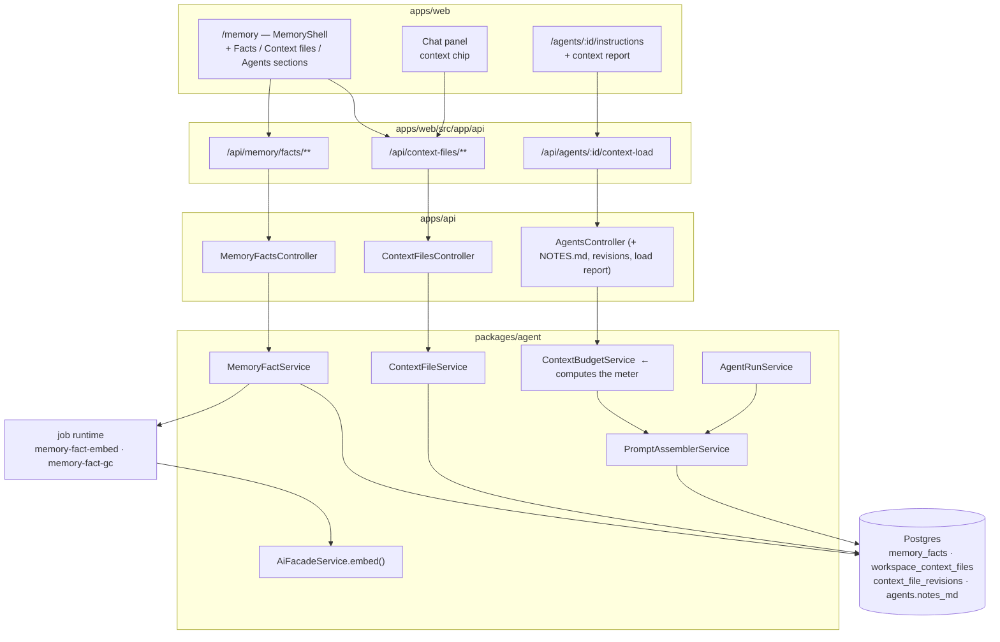

# Implementation Plan: Memory, context files & the load meter

> Translates [`spec.md`](./spec.md) into architecture and tech choices. The plan
> owns implementation detail; the spec owns behaviour.

**Feature ID**: `AW-07-memory-context`
**Spec**: [`./spec.md`](./spec.md) · **Tasks**: [`./tasks.md`](./tasks.md)
**Status**: `Draft`
**Last updated**: 2026-09-06

---

## 1. Current state in the codebase

Every path below was opened before being cited.

### 1.1 The Memory surface that exists today

| What | Where | State |
| --- | --- | --- |
| Memory page (server) | [`apps/web/src/app/[locale]/(dashboard)/memory/page.tsx`](<../../../../../apps/web/src/app/[locale]/(dashboard)/memory/page.tsx>) | Server-fetches the document aggregation plus the meetings block, renders the client shell. |
| Memory shell (client) | [`apps/web/src/components/memory/MemoryShell.tsx`](../../../../../apps/web/src/components/memory/MemoryShell.tsx) | Search / filter chips / view toggle over the `/api/memory` BFF proxy. Uses the `dashboard.memoryPage` namespace. |
| Sibling panels | `apps/web/src/components/memory/` — `MemoryFilesPanel.tsx`, `MemoryUploadsPanel.tsx`, `MemoryReviewPanel.tsx`, `MemoryMeetingsPanel.tsx`, `AgentMemoryPanel.tsx`, `MemoryConsolidationSettings.tsx`, `MemoryFilePreview.tsx`, barrel `index.ts` | All shipped, each with a `*.unit.spec.tsx`. |
| Org-wide memory API | [`apps/api/src/works/org-memory.controller.ts`](../../../../../apps/api/src/works/org-memory.controller.ts) | `GET memory`, `GET memory/health`, `POST memory/consolidate`, consolidation settings, review accept/reject, uploads. Guarded by `AuthSessionGuard`, org resolved through `ScopeContextService`. |
| Memory Files API | [`apps/api/src/memory-files/memory-files.controller.ts`](../../../../../apps/api/src/memory-files/memory-files.controller.ts) | Unified folder/file tree across both upload spines. |
| Web BFF proxies | `apps/web/src/app/api/memory/**` (`route.ts`, `health/`, `review/`, `uploads/`, `consolidation/settings/`, `files/**`) | The pattern every new BFF route should copy. |
| Route constant | [`apps/web/src/lib/constants.ts`](../../../../../apps/web/src/lib/constants.ts) — `DASHBOARD_MEMORY: '/memory'` (line 164) | Sidebar entry lives in [`DashboardSidebar.tsx`](../../../../../apps/web/src/components/dashboard/DashboardSidebar.tsx) around line 191. |

**The gap:** none of this holds an atomic fact. `MemoryShell` renders documents,
uploads, meetings and provider sessions.

### 1.2 The memory-provider capability (optional, external)

| What | Where |
| --- | --- |
| Capability contract | [`packages/plugin/src/contracts/capabilities/agent-memory.interface.ts`](../../../../../packages/plugin/src/contracts/capabilities/agent-memory.interface.ts) — `openSession`, `saveMemory`, `searchMemory`, `buildContext`, optional `deleteEntry` / `listSessions` / `exportAll`. |
| Facade | [`packages/agent/src/facades/agent-memory.facade.ts`](../../../../../packages/agent/src/facades/agent-memory.facade.ts) |
| API | [`apps/api/src/plugins-capabilities/agent-memory/agent-memory.controller.ts`](../../../../../apps/api/src/plugins-capabilities/agent-memory/agent-memory.controller.ts) — includes `/check-availability` and `DELETE /entries/:entryId` |
| Provider plugin | `packages/plugins/agentmemory/` |
| Recall splice helper | [`packages/agent/src/services/memory-recall.ts`](../../../../../packages/agent/src/services/memory-recall.ts) — `resolveMemoryRecall`, `buildMemoryRecallBlock`, `neutralizeRecallContent`, `DEFAULT_RECALL_MAX_TOKENS = 1500`, `DEFAULT_RECALL_TIMEOUT_MS = 10_000` |
| Consumer | [`packages/agent/src/agents/agent-run.service.ts`](../../../../../packages/agent/src/agents/agent-run.service.ts) — imports `resolveMemoryRecall` at line 39, checks `agent.memoryRecallEnabled` at line 387, resolves recall at line 398 |

**The gap:** with no provider enabled, `check-availability` is false and nothing
is remembered — silently. There is no first-party durable store, and no UI ever
lists individual records, so `DELETE /entries/:entryId` has no reachable caller.

### 1.3 Prompt assembly — where the load meter has to plug in

[`packages/agent/src/agents/prompt-assembler.service.ts`](../../../../../packages/agent/src/agents/prompt-assembler.service.ts) (493 lines) is the single
place a run's instruction message is built:

- `PROMPT_SEGMENTS` — the ordered segment list: `identity`, `role`,
  `capabilities`, `operating-loop`, `tools`, `skills`,
  `scope-advanced-prompts`, `scope-context`, `recent-activity`, `recent-runs`,
  `output-contract`.
- `SEGMENT_TOKEN_CAPS` — per-segment caps; `identity`, `role`, `capabilities`,
  `operating-loop` and `scope-advanced-prompts` are **`null` (uncapped)** today.
- `TOTAL_SYSTEM_TOKEN_TARGET = 12_000` — the global backstop.
- `assemble()` returns `AssembledPrompt` with `segments: Array<{name, tokens,
  included}>` and `truncations: AssemblyTruncation[]` — **the meter's data
  already exists in memory and is thrown away.**
- `estimateTokens(text)` — `Math.ceil(text.length / 4)`.
- `truncateTailFirst(text, capTokens)` — *keeps the end, drops the beginning*,
  prefixing `[…truncated N chars…]`. Correct for feed-shaped segments; wrong for
  an authored file whose first lines are the important ones.
- `neutralizeInjectedBlock` / `neutralizeTurnField` — the injection hardening
  every new untrusted segment must reuse.

### 1.4 Agent files

| What | Where |
| --- | --- |
| Service | [`packages/agent/src/agents/agent-file.service.ts`](../../../../../packages/agent/src/agents/agent-file.service.ts) — `AgentFileName` union, `AGENT_FILE_NAMES` allow-list, `MAX_FILE_BYTES = 64 * 1024`, `read`, `write` (optimistic concurrency on `expectedHash`), `hashOf` (sha256 over the sentinel-joined 5-file concat), `assertNoSecrets`, `AGENT_FILE_EDITED` activity row with a 5 KB diff sample |
| Columns | [`packages/agent/src/entities/agent.entity.ts`](../../../../../packages/agent/src/entities/agent.entity.ts) — `soulMd` (383), `agentsMd` (386), `heartbeatMd` (389), `toolsMd` (392), `agentYml` (395), `contentHash` (399), plus `maxSkillContextTokens` (291) and `memoryRecallEnabled` (302) |
| Endpoints | [`apps/api/src/agents/agents.controller.ts`](../../../../../apps/api/src/agents/agents.controller.ts) — `GET/PUT /api/agents/:id/files/:name`, throttled 60/min |
| Editor | [`apps/web/src/app/[locale]/(dashboard)/agents/[id]/instructions/page.tsx`](<../../../../../apps/web/src/app/[locale]/(dashboard)/agents/[id]/instructions/page.tsx>) + [`AgentInstructionsEditor.tsx`](../../../../../apps/web/src/components/agents/AgentInstructionsEditor.tsx) — five pills, plain textarea, 800 ms autosave |
| Permission | `AgentPermissions.canEditAgentFiles` on the agent entity (8 booleans, all default `false`) |

**The gap:** no notes file, no revision history, and the editor never shows how
much of a file survives assembly.

### 1.5 Agent tools

[`packages/agent/src/agents/agent-tool.service.ts`](../../../../../packages/agent/src/agents/agent-tool.service.ts) appends every agent's tool
set at lines 412–413. `buildGetKbDocumentTool` (line 1761) is a permanent
placeholder that always returns an error object — noted here only so nobody
mistakes it for the on-demand context-file tool this epic adds; fixing it is
AW-06's job.

### 1.6 Vectors and embeddings

| What | Where |
| --- | --- |
| Embedding call | [`packages/agent/src/facades/ai.facade.ts`](../../../../../packages/agent/src/facades/ai.facade.ts) — `async embed(...)` at line 514, capability-resolved |
| pgvector enablement | [`apps/api/src/migrations/1779970000000-EnablePgvectorExtension.ts`](../../../../../apps/api/src/migrations/1779970000000-EnablePgvectorExtension.ts) |
| The pattern to copy | [`apps/api/src/migrations/1779975000000-CreateWorkKnowledgeChunks.ts`](../../../../../apps/api/src/migrations/1779975000000-CreateWorkKnowledgeChunks.ts) — `vector(1536)` on Postgres, `TEXT` on SQLite, `ivfflat … vector_cosine_ops WITH (lists = 100)` |
| Entity-side shape | [`packages/agent/src/entities/work-knowledge-chunk.entity.ts`](../../../../../packages/agent/src/entities/work-knowledge-chunk.entity.ts) — `embedding: number[]` stored `simple-json`, real column added by raw SQL |

### 1.7 Chat

| What | Where |
| --- | --- |
| Panel mount | [`apps/web/src/app/[locale]/(dashboard)/layout-client.tsx`](<../../../../../apps/web/src/app/[locale]/(dashboard)/layout-client.tsx>) — `ChatPanel` at 413/443, `ChatPanelProvider` at 513 |
| Open/close control | [`apps/web/src/lib/hooks/use-chat-panel.tsx`](../../../../../apps/web/src/lib/hooks/use-chat-panel.tsx) — `useChatPanel(): { open, setOpen } | null` |
| Chat state | [`apps/web/src/components/ai/ChatProvider.tsx`](../../../../../apps/web/src/components/ai/ChatProvider.tsx) — `ChatContextValue.sendMessage(text, attachments?)` (line 51) |
| Attachments | [`apps/web/src/components/ai/ChatAttachments.tsx`](../../../../../apps/web/src/components/ai/ChatAttachments.tsx) and [`apps/web/src/lib/ai/attachments.ts`](../../../../../apps/web/src/lib/ai/attachments.ts) — `ChatAttachmentRef { name, url, mimeType?, kind?: 'upload' | 'github-repo' }`, `formatAttachmentsBlock` renders the fenced, sanitised attachments block |
| Chat tools | `apps/web/src/lib/ai/tools/` (per-domain `*.tools.ts` + `tool-selection.ts`) |
| Chat route | [`apps/web/src/app/api/chat/route.ts`](../../../../../apps/web/src/app/api/chat/route.ts) |

**The gap:** `ChatAttachmentRef.kind` has no value for "a context file", and no
caller can open the panel with a message pre-filled.

### 1.8 Scoping, activity, jobs

- Scope: [`apps/api/src/scope/scope-context.service.ts`](../../../../../apps/api/src/scope/scope-context.service.ts) — org id comes from
  `ScopeContextService`, never from the client; `ScopeOwnershipGuard` is a global
  guard.
- Activity: [`packages/agent/src/entities/activity-log.types.ts`](../../../../../packages/agent/src/entities/activity-log.types.ts) — `ActivityActionType`
  is a TypeScript enum over a `varchar(50)` column ([`activity-log.entity.ts:44`](../../../../../packages/agent/src/entities/activity-log.entity.ts)),
  so **adding members needs no migration**. `AGENT_FILE_EDITED` (line 204) and
  `MEMORY_FOLDER_*` (126–128) already exist.
- Jobs: dispatcher symbols live in `packages/agent/src/tasks/` (e.g.
  [`kb-embed-document-dispatcher.ts`](../../../../../packages/agent/src/tasks/kb-embed-document-dispatcher.ts)); the producer side is implemented by
  [`packages/tasks/src/trigger/trigger.service.ts`](../../../../../packages/tasks/src/trigger/trigger.service.ts); task definitions live in
  `packages/tasks/src/tasks/trigger/` and are exported from its `index.ts`.
- Migrations: [`apps/api/src/migrations/`](../../../../../apps/api/src/migrations) (self-applied on boot, `RUN_MIGRATIONS`).

## 2. Architecture and the seam



### 2.1 The single most important design decision

`ContextBudgetService` **must not** be a second implementation of the budget
maths. `PromptAssemblerService.assemble()` already produces `segments[]` and
`truncations[]`; today they are discarded. The plan is:

1. Extract the pure part of the assembler into an exported, side-effect-free
   `measureSegments(input): SegmentMeasurement[]` in the same file.
2. `assemble()` calls it, then renders.
3. `ContextBudgetService` calls it too, with the *saved* file bodies rather than
   run-time bodies, and returns the load report.

That is how spec **FR-50** ("the meter agrees with the run, to the token") is
satisfied by construction instead of by discipline. Any drift becomes a failing
unit test in the existing
[`packages/agent/src/agents/__tests__/prompt-assembler.service.spec.ts`](../../../../../packages/agent/src/agents/__tests__/prompt-assembler.service.spec.ts).

### 2.2 Truncation change

Add, next to `truncateTailFirst`, a second exported helper:

```ts
export function truncateMiddleOut(text: string, capTokens: number): {
    text: string;
    skipped: { startChar: number; endChar: number; chars: number } | null;
};
```

Head share `Math.floor(capChars * 0.7)`, tail share `capChars - headShare -
markerChars`, marker line
`\n[… N characters skipped by the load budget …]\n`. Authored-file segments
(`identity`, `role`, `notes`, `capabilities`, `operating-loop`,
`workspace-context`, `scope-advanced-prompts`) switch to it. Feed-shaped segments
(`recent-activity`, `recent-runs`, `tools`, `skills`, `scope-context`) keep
`truncateTailFirst` — do not touch them; their "newest preserved" semantics are
correct.

### 2.3 Segment table changes

In `SEGMENT_TOKEN_CAPS`, plus two new members of `PROMPT_SEGMENTS` inserted
**after `operating-loop`** and **before `tools`** (order matters — shared truth
before the agent's toolbox):

| Segment | Before | After |
| --- | --- | --- |
| `identity` | `null` | `1200` |
| `role` | `null` | `1200` |
| `notes` | — | `1500` (new segment) |
| `capabilities` | `null` | `400` |
| `operating-loop` | `null` | `800` |
| `workspace-context` | — | `1500` (new segment) |
| `memory-facts` | — | `1200` (new segment) |
| `tools` | `1500` | unchanged |
| `skills` | `4000` | unchanged (still overridden by `maxSkillContextTokens`) |
| `scope-advanced-prompts` | `null` | `600` |
| `scope-context` | `800` | unchanged |
| `recent-activity` | `1200` | unchanged |
| `recent-runs` | `800` | unchanged |
| `output-contract` | `150` | unchanged |
| `TOTAL_SYSTEM_TOKEN_TARGET` | `12_000` | `17_000` |

Sum of segment caps = 16,850 < 17,000, so the global backstop becomes
unreachable in normal operation and stays only as a defence against a future
uncapped segment. State that in the code comment.

`memory-facts` replaces nothing: `resolveMemoryRecall` from the provider
capability keeps running exactly as it does, appended by `AgentRunService` after
assembly. The first-party facts block is a **separate** segment inside the
assembler. Both may be present; both are fenced.

## 3. Data model

Entities live in `packages/agent/src/entities/`; migrations in
`apps/api/src/migrations/` (verified locations — `packages/agent` has no
migrations directory). Every entity is exported from
[`packages/agent/src/entities/index.ts`](../../../../../packages/agent/src/entities/index.ts).

### 3.1 New entity — `MemoryFact`

`packages/agent/src/entities/memory-fact.entity.ts` → table `memory_facts`.

| Column | Type | Notes |
| --- | --- | --- |
| `id` | uuid PK | |
| `userId` | uuid, indexed | owner, as every Tier A entity |
| `tenantId` | uuid null | scope denorm |
| `organizationId` | uuid null | scope denorm; `NULL` = personal workspace |
| `scope` | varchar(16) | `'workspace' \| 'agent'` |
| `agentId` | uuid null, FK `agents.id` `ON DELETE CASCADE` | required when `scope='agent'` (CHECK) |
| `body` | varchar(500) | 1–500 chars, trimmed |
| `status` | varchar(16) | `'proposed' \| 'active' \| 'forgotten'` |
| `origin` | varchar(16) | `'user' \| 'agent' \| 'consolidation' \| 'import'` |
| `sourceRunId` | uuid null | no FK — runs are reaped; service-layer integrity |
| `sourceConversationId` | uuid null | |
| `sourceAgentId` | uuid null | which agent proposed it |
| `pinned` | boolean default false | |
| `embedding` | `vector(1536)` on Postgres, `TEXT` on SQLite | entity declares `simple-json` `number[] \| null` |
| `embeddingModel` | varchar(128) null | so a model change can be swept |
| `embeddingDims` | int null | |
| `recallCount` | int default 0 | |
| `lastRecalledAt` | timestamptz null | |
| `supersedesFactId` | uuid null | set by tidy-up merges |
| `forgottenAt` | timestamptz null | purge clock |
| `createdAt` / `updatedAt` | timestamptz | |

Indexes:
- `idx_memory_facts_owner_status` on `(userId, organizationId, status)`
- `idx_memory_facts_agent` on `(agentId)` where `agentId IS NOT NULL`
- `idx_memory_facts_forgotten_at` on `(forgottenAt)` — drives the purge sweep
- `idx_memory_facts_embedding` — `ivfflat (embedding vector_cosine_ops) WITH (lists = 100)`, Postgres only
- partial unique `uq_memory_facts_body` on `(userId, organizationId, lower(body))` where `status <> 'forgotten'` — cheap exact-duplicate defence; near-duplicates are the tidy-up flow's job

CHECK constraints:
- `chk_memory_facts_agent_scope`: `(scope = 'agent' AND agent_id IS NOT NULL) OR (scope = 'workspace' AND agent_id IS NULL)`
- `chk_memory_facts_body_len`: `char_length(body) BETWEEN 1 AND 500`

### 3.2 New entity — `WorkspaceContextFile`

`packages/agent/src/entities/workspace-context-file.entity.ts` → table
`workspace_context_files`.

| Column | Type | Notes |
| --- | --- | --- |
| `id` | uuid PK | |
| `userId` / `tenantId` / `organizationId` | uuid (+2 null) | same scope triple |
| `slug` | varchar(32) | one of `about-you`, `organization`, `people`, `glossary`, `voice`, `roster` |
| `body` | text | ≤ 64 KB enforced in the service, matching `MAX_FILE_BYTES` |
| `loadMode` | varchar(16) | `'always' \| 'onDemand'` |
| `contentHash` | varchar(64) | sha256 of `body`; the ETag for optimistic concurrency |
| `bodyBytes` | int | denormalised for the list |
| `updatedByUserId` / `updatedByAgentId` | uuid null | last writer |
| `createdAt` / `updatedAt` | timestamptz | |

Unique: `uq_workspace_context_files_slug` on `(userId, organizationId, slug)`.
Rows are created lazily on first read (`getOrCreate`), so no seeding migration.

The slug list lives in `packages/agent/src/entities/context-file-types.ts`
alongside `WORKSPACE_CONTEXT_FILE_SLUGS`, the default load modes, and
`MAX_ALWAYS_LOADED_WORKSPACE_FILES = 3`, mirroring how
[`kb-types.ts`](../../../../../packages/agent/src/entities/kb-types.ts) carries the KB enums and transition tables.

### 3.3 New entity — `ContextFileRevision`

`packages/agent/src/entities/context-file-revision.entity.ts` → table
`context_file_revisions`. Covers **both** families so agent files finally get a
rollback path.

| Column | Type | Notes |
| --- | --- | --- |
| `id` | uuid PK | |
| `userId` / `organizationId` | uuid (+null) | scope |
| `targetType` | varchar(16) | `'workspace' \| 'agent'` |
| `targetId` | uuid | workspace-file id, or agent id |
| `fileKey` | varchar(32) | context-file slug, or an `AgentFileName` |
| `body` | text | the body **before** the write that created this revision |
| `contentHash` | varchar(64) | |
| `authorKind` | varchar(8) | `'user' \| 'agent' \| 'system'` |
| `authorUserId` / `authorAgentId` | uuid null | |
| `createdAt` | timestamptz | |

Index `idx_context_file_revisions_target` on `(targetType, targetId, fileKey, createdAt DESC)`.
Retention (service-enforced on write, swept nightly): keep the newest 20 per
`(targetType, targetId, fileKey)` **plus** everything newer than 30 days.

### 3.4 Changed entity — `Agent`

Add one column to [`agent.entity.ts`](../../../../../packages/agent/src/entities/agent.entity.ts), beside `agentYml`:

```ts
/** NOTES.md — the only agent file an agent may write on its own initiative. */
@Column({ type: 'text', nullable: true })
notesMd?: string | null;
```

`AgentFileName` in `agent-file.service.ts` gains `'NOTES.md'`;
`AGENT_FILE_NAMES` gains it in position 3 (after `AGENTS.md`); `hashOf` appends
`+ 'AGENTYML/NOTES' + merged.NOTES` at the **end** of the concat.

> **Why the ETag does not break.** `contentHash` is stored, and `read()` returns
> the stored value. Existing rows keep their stored hash until the next write, at
> which point it is recomputed with the new formula and the caller's
> `expectedHash` (read moments earlier) still matches the *old stored* value.
> No backfill, no 409 storm. Cover it with a regression test.

### 3.5 Changed entity — `AgentRun` (P2 only)

```ts
/** Per-segment instruction budget actually spent by this run. */
@Column({ type: 'simple-json', nullable: true })
contextLoad?: RunContextLoad | null;
```

`RunContextLoad = { totalTokens: number; segments: Array<{ name; cap; used;
skippedChars }> }`. Additive, nullable, no backfill. Feeds AW-09's run receipt.

### 3.6 Migrations (forward-only, `apps/api/src/migrations/`)

Timestamps are AW-07 slots 00–04 of the program's reserved migration blocks ([README §5 rule 10](../README.md#5-rules-every-epic-spec-in-this-program-must-follow)),
in apply order; the implementing PR re-stamps them before merge if `develop` has moved past them.

| File | Contents |
| --- | --- |
| `1791070000000-CreateMemoryFacts.ts` | `memory_facts` table, all indexes, both CHECKs. `vector(1536)` when `connection.options.type === 'postgres'`, else `TEXT`; `ivfflat` index Postgres-only. Copy the branching from `1779975000000-CreateWorkKnowledgeChunks.ts`. `down()` drops indexes then the table. |
| `1791070100000-CreateWorkspaceContextFiles.ts` | `workspace_context_files` + unique index. |
| `1791070200000-CreateContextFileRevisions.ts` | `context_file_revisions` + target index. |
| `1791070300000-AddAgentNotesMd.ts` | `ALTER TABLE "agents" ADD COLUMN "notes_md" text NULL`. |
| `1791070400000-AddAgentRunContextLoad.ts` (P2) | `ALTER TABLE "agent_runs" ADD COLUMN "context_load" text NULL`. |

All additive. No `DROP COLUMN`, no rename, no data loss on revert.

### 3.7 Contracts (`packages/contracts/src/`)

New folder `packages/contracts/src/memory/` exporting from its `index.ts`, and
re-exported from [`packages/contracts/src/index.ts`](../../../../../packages/contracts/src/index.ts):

```ts
// memory-fact.types.ts
export const MEMORY_FACT_STATUSES = ['proposed', 'active', 'forgotten'] as const;
export const MEMORY_FACT_ORIGINS = ['user', 'agent', 'consolidation', 'import'] as const;
export const MEMORY_FACT_SCOPES = ['workspace', 'agent'] as const;
export const MEMORY_FACT_BODY_MAX = 500;
export const MEMORY_FACT_ACTIVE_MAX = 2000;
export const MEMORY_FACT_PROPOSED_MAX = 200;
export const MEMORY_FACT_PINNED_MAX = 20;
export const MEMORY_FACT_RECALL_TOP_K = 8;
export const MEMORY_FACT_RECALL_MIN_SCORE = 0.72;
export const MEMORY_FACT_SEARCH_TOP_K = 50;
export const MEMORY_FACT_SEARCH_MIN_SCORE = 0.55;
export const MEMORY_FACT_RECALL_MAX_TOKENS = 1200;
export const MEMORY_FACT_FORGET_RETENTION_DAYS = 30;
export interface MemoryFactDto { /* … */ }
export interface MemoryFactListDto { facts: MemoryFactDto[]; total: number; counts: Record<MemoryFactStatus, number>; nextCursor?: string; semantic: boolean; }

// context-file.types.ts
export const WORKSPACE_CONTEXT_FILE_SLUGS = ['about-you','organization','people','glossary','voice','roster'] as const;
export const CONTEXT_FILE_LOAD_MODES = ['always', 'onDemand'] as const;
export const MAX_ALWAYS_LOADED_WORKSPACE_FILES = 3;
export const CONTEXT_FILE_REVISION_KEEP = 20;
export const CONTEXT_FILE_REVISION_KEEP_DAYS = 30;
export interface ContextFileDto { /* … */ }

// context-load.types.ts
export type ContextSegmentState = 'under' | 'near' | 'over';
export interface ContextSegmentReport {
    name: string; label: string; capTokens: number; usedTokens: number;
    includedTokens: number; skippedChars: number;
    skippedRange: { startChar: number; endChar: number } | null;
    state: ContextSegmentState;
}
export interface ContextLoadReport { totalTokens: number; totalCapTokens: number; segments: ContextSegmentReport[]; measuredAt: string; }
```

Placing these in `@ever-works/contracts` means the MCP server (`apps/mcp/`) and
the CLI can consume the same shapes without importing the agent package.

## 4. API surface

All new endpoints: `@UseGuards(AuthSessionGuard)`, `@CurrentUser()` for the
owner, organization from `ScopeContextService` (never from the body), Swagger
decorators, class-validator DTOs, cross-workspace ids → `404`.

### 4.1 New module — `apps/api/src/memory-facts/`

`memory-facts.module.ts`, `memory-facts.controller.ts`, `dto/`.
Registered in [`apps/api/src/api.module.ts`](../../../../../apps/api/src/api.module.ts).

| Method | Path | Body / query | Response | Throttle |
| --- | --- | --- | --- | --- |
| `GET` | `/api/memory/facts` | `q?`, `status?`, `scope?`, `agentId?`, `pinnedOnly?`, `limit?≤50`, `cursor?` | `MemoryFactListDto` (`semantic: boolean` says whether meaning-matching was used) | 120/min |
| `POST` | `/api/memory/facts` | `CreateMemoryFactDto { body, scope?, agentId?, pinned? }` | `MemoryFactDto` · `409` when the workspace is at 2,000 active | 60/min |
| `PATCH` | `/api/memory/facts/:id` | `UpdateMemoryFactDto { body?, scope?, agentId?, pinned? }` | `MemoryFactDto` · `409` on the 21st pin | 60/min |
| `POST` | `/api/memory/facts/:id/forget` | — | `{ id, status: 'forgotten', restorableUntil }` | 60/min |
| `POST` | `/api/memory/facts/:id/restore` | — | `MemoryFactDto` · `410` when past 30 days | 60/min |
| `POST` | `/api/memory/facts/:id/accept` | — | `MemoryFactDto` (proposed → active) | 60/min |
| `POST` | `/api/memory/facts/:id/discard` | — | `204` (proposed → forgotten) | 60/min |
| `POST` | `/api/memory/facts/forget-all` | `{ confirm: 'FORGET ALL' }` | `{ forgotten: number }` · `422` on a wrong confirm string | **3/hour** |
| `GET` | `/api/memory/facts/stats` | — | `{ active, proposed, forgotten, pinned, capacity: 2000, semantic: boolean }` | 120/min |

`GET /api/memory/facts` with `q`: embed the query through
`AiFacadeService.embed`, run the ANN query, union with a `LOWER(body) LIKE` scan,
dedupe by id, sort by score descending with literal hits floored at the score
threshold so they always appear. When embedding is unavailable, skip the ANN leg
and return `semantic: false`.

### 4.2 New module — `apps/api/src/context-files/`

| Method | Path | Body | Response |
| --- | --- | --- | --- |
| `GET` | `/api/context-files` | — | `{ files: ContextFileDto[]; alwaysLoadedCount; alwaysLoadedMax: 3; loadReport: ContextLoadReport }` |
| `GET` | `/api/context-files/:slug` | — | `ContextFileDto` (creates the empty row on first read) |
| `PUT` | `/api/context-files/:slug` | `{ body: string; expectedHash?: string }` | `{ contentHash, loadReport }` · `409` on hash mismatch (with `currentHash` and the current body so the client can offer **Compare**) · `422` on a secret hit or > 64 KB |
| `PATCH` | `/api/context-files/:slug/load-mode` | `{ loadMode: 'always' \| 'onDemand' }` | `ContextFileDto` · `422` naming the current three when a fourth `always` is requested |
| `GET` | `/api/context-files/:slug/revisions` | `limit?≤20` | `ContextFileRevisionDto[]` |
| `POST` | `/api/context-files/:slug/revisions/:revisionId/restore` | — | `{ contentHash }` — writes a **new** revision |

Writes throttled 60/min. Every write calls `assertNoSecrets` from
[`packages/agent/src/utils/secret-scan.ts`](../../../../../packages/agent/src/utils/secret-scan.ts) in hard-reject mode, exactly as
`AgentFileService.write` does.

### 4.3 Extensions to `apps/api/src/agents/agents.controller.ts`

| Method | Path | Change |
| --- | --- | --- |
| `GET`/`PUT` | `/api/agents/:id/files/:name` | `:name` now also accepts `NOTES.md`. Validation stays the `AGENT_FILE_NAMES` allow-list, so nothing else opens up. |
| `GET` | `/api/agents/:id/files/:name/revisions` | **New** — `ContextFileRevisionDto[]`, newest first |
| `POST` | `/api/agents/:id/files/:name/revisions/:revisionId/restore` | **New** |
| `GET` | `/api/agents/:id/context-load` | **New** — the whole-agent `ContextLoadReport` (spec §6.7). Reads saved bodies; runs nothing. |
| `GET` | `/api/agents/:id/files/:name/load-report` | **New** — the single-file slice, so the editor can poll cheaply while typing (debounced client-side; see §5.4) |

### 4.4 Web BFF routes (`apps/web/src/app/api/`)

Thin proxies in the shape of `apps/web/src/app/api/memory/route.ts`:

- `memory/facts/route.ts` (GET, POST)
- `memory/facts/[id]/route.ts` (PATCH)
- `memory/facts/[id]/forget/route.ts`, `.../restore/route.ts`, `.../accept/route.ts`, `.../discard/route.ts`
- `memory/facts/forget-all/route.ts`
- `context-files/route.ts`, `context-files/[slug]/route.ts`,
  `context-files/[slug]/load-mode/route.ts`,
  `context-files/[slug]/revisions/route.ts`,
  `context-files/[slug]/revisions/[revisionId]/restore/route.ts`
- `agents/[id]/context-load/route.ts`

Each forwards the workspace selector header the same way the existing memory
proxies do.

### 4.5 Agent tool — on-demand context files

In [`agent-tool.service.ts`](../../../../../packages/agent/src/agents/agent-tool.service.ts), beside the tool pushes at lines 412–413:

```
getContextFile({ slug })  →  { slug, title, body }   // onDemand files only
```

- Only the six workspace slugs are addressable; anything else returns a typed
  refusal, not an exception.
- Files whose `loadMode` is `always` return a short note pointing at the block
  the agent already has, so the model does not spend a call re-reading it.
- The returned body passes through `neutralizeInjectedBlock` and is fenced as
  reference data, matching every other untrusted segment.
- No permission gate: reading shared workspace context is what an agent is for.

Writes are a **separate** tool, `updateContextFile({ slug, body })`, gated on
`AgentPermissions.canEditAgentFiles`; without the grant the tool is not offered
at all and the model is told so in the tools block.

## 5. Web surface

### 5.1 Memory page composition (additive)

[`memory/page.tsx`](<../../../../../apps/web/src/app/[locale]/(dashboard)/memory/page.tsx>) gains three parallel server fetches
(each `.catch()`-guarded exactly like the current ones so a failure degrades one
block instead of the page): facts page 1, the context-file list, and the agent
list for the rail. `MemoryShell` gains a `section` prop and renders the new left
rail; the existing panels move **under** an "Also here" group without changing
their internals.

New components under `apps/web/src/components/memory/`:

| File | Role |
| --- | --- |
| `MemoryRail.tsx` | Sections, counts, the ⟳ always-loaded marker, `g`-prefixed jumps |
| `FactsPanel.tsx` | Search box, filter pills (All / Pinned / Proposed / Forgotten), list, pagination, empty / no-result / over-cap states |
| `FactRow.tsx` | One fact: text, provenance line, relevance bar in search mode, inline edit, row actions, keyboard handling |
| `FactComposer.tsx` | Add / edit form with a live character counter against 500 |
| `ForgetAllDialog.tsx` | Blast-radius copy + the typed `FORGET ALL` gate |
| `ContextFilePanel.tsx` | Editor shell: Write / Preview toggle, load mode control, save, history, conflict banner |
| `ContextFileEditor.tsx` | The textarea (same posture as `AgentInstructionsEditor` — no rich editor in v1) |
| `ContextFilePreview.tsx` | Rendered body with the marked skipped block, `n` / `N` navigation |
| `LoadMeter.tsx` | The bar + numbers + state; **the only place** the three states are styled |
| `AgentContextReport.tsx` | The fourteen-segment table (spec §6.7) |
| `AskAnAgentButton.tsx` | Opens the chat panel with the attachment + pre-filled text |
| `ContextFileHistoryDialog.tsx` | Revision list + restore |

Each ships a `*.unit.spec.tsx` beside it, matching the existing convention in
that folder.

### 5.2 Agent instructions tab

[`AgentInstructionsEditor.tsx`](../../../../../apps/web/src/components/agents/AgentInstructionsEditor.tsx) gains a sixth pill (**Notes**), a
`<LoadMeter />` under the textarea, the Write/Preview toggle, and
`<AskAnAgentButton />`. `<AgentContextReport />` renders above the pills. The
existing 800 ms autosave debounce stays; the load report is fetched on a separate
400 ms debounce so typing feels immediate and the meter follows.

The instructions page pill labels become captions rather than filenames:
`Identity`, `Role`, `Notes`, `Operating loop`, `Tools`, `Manifest`, with the
filename shown as secondary text. Filenames themselves are unchanged.

### 5.3 Chat integration

- `ChatAttachmentRef.kind` in [`attachments.ts`](../../../../../apps/web/src/lib/ai/attachments.ts) gains `'context-file'`. The
  `url` points at the BFF read route (`/api/context-files/voice` or
  `/api/agents/:id/files/NOTES.md`), so `formatAttachmentsBlock` keeps working
  with no change to its sanitiser.
- `ChatContextValue` gains `composeMessage(text: string, attachments?:
  ReadonlyArray<ChatAttachmentRef>): void` — sets the composer's draft **without
  sending**. `AskAnAgentButton` calls `useChatPanel()?.setOpen(true)` then
  `composeMessage(...)`.
- `ChatAttachments.tsx` renders a `'context-file'` chip with a document icon and,
  on click, opens the existing preview overlay with the file's *budgeted* text
  and the same marked skipped block — `ContextFilePreview` is reused, not
  reimplemented (spec FR-55/FR-56).
- New chat tools in `apps/web/src/lib/ai/tools/context-files.tools.ts`
  (`readContextFile`, `updateContextFile`) wired through
  `apps/web/src/lib/ai/tools/tool-selection.ts` so they are only offered when the
  conversation actually concerns a context file.

### 5.4 Data fetching

Server components fetch the first page through new API clients
`apps/web/src/lib/api/memory-facts.ts` and `apps/web/src/lib/api/context-files.ts`
(mirroring [`lib/api/memory.ts`](../../../../../apps/web/src/lib/api/memory.ts)). Interactive updates go through the BFF
proxies with the browser fetch helper `MemoryShell` already uses, which stamps
the per-tab workspace selector. Server actions live in
`apps/web/src/app/actions/memory-facts.ts` and
`apps/web/src/app/actions/context-files.ts`, following
[`app/actions/skills.ts`](../../../../../apps/web/src/app/actions/skills.ts).

Optimistic UI: pin, forget and restore apply optimistically and roll back on
failure. Fact edits do **not** — a failed save must never look saved.

## 6. Background work

Two jobs, both dispatched through the job-runtime abstraction. Call sites depend
only on the `*_DISPATCHER` DI symbols; nothing outside `packages/tasks` imports a
runtime SDK (Constitution IV).

| Dispatcher symbol | File | Task | Trigger | Idempotency |
| --- | --- | --- | --- | --- |
| `MEMORY_FACT_EMBED_DISPATCHER` | `packages/agent/src/tasks/memory-fact-embed-dispatcher.ts` | `packages/tasks/src/tasks/trigger/memory-fact-embed.task.ts` | Enqueued by `MemoryFactService` after create / body-edit / accept | Re-embeds from the current body and writes `embeddingModel` + `embeddingDims`; running twice is a no-op. Queue-limited like `kb-embed-document`. |
| `MEMORY_FACT_GC_DISPATCHER` | `packages/agent/src/tasks/memory-fact-gc-dispatcher.ts` | `packages/tasks/src/tasks/trigger/memory-fact-gc.task.ts` | Cron `13 4 * * *` (deliberately clear of the 03:xx and `37 8` crons already in that folder) | Purges facts `forgotten` more than 30 days ago; prunes context-file revisions past the keep rule; re-embeds facts whose `embeddingModel` differs from the resolved default, capped at 500 facts per tick |

Both are registered in
[`packages/tasks/src/tasks/trigger/index.ts`](../../../../../packages/tasks/src/tasks/trigger/index.ts) and implemented producer-side in
[`packages/tasks/src/trigger/trigger.service.ts`](../../../../../packages/tasks/src/trigger/trigger.service.ts), returning `null` when the
runtime is unconfigured. A `null` return means the fact stays unembedded:
literal search still finds it, semantic recall skips it, and the nightly sweep
picks it up. **A missing job runtime must never make a fact un-saveable.**

`resolveMemoryRecall`'s 10 s best-effort timeout is the model for the first-party
recall path, tightened to **2,000 ms** (spec NFR-2) because this query is a local
ANN lookup rather than a network round-trip to an external store.

## 7. Plugin boundaries

- **No new plugin.** Memory facts and context files are first-party platform data
  describing how *our* agents behave; nothing external is integrated.
- **Embeddings** are requested through `AiFacadeService.embed()`, which resolves
  an `ai-provider` plugin through the capability cascade. No provider id appears
  in this feature's code (Constitution II).
- **Vector storage** uses the platform's own Postgres column, the same way
  `work_knowledge_chunks` does. The `vector-store` plugin capability
  (`packages/plugins/pgvector`, `packages/plugins/qdrant`) stays scoped to Work
  Knowledge Base chunks; facts are not chunked documents and routing them through
  a per-Work vector namespace would be a category error. If a future epic wants
  facts in an external vector store, that is a capability extension, and it is
  called out in §11 as deliberately deferred.
- **The existing memory-provider capability is untouched.** `agentmemory` and any
  community provider keep their contract, their endpoints, their facade and their
  panel. This epic adds a parallel first-party tier; it does not migrate, proxy
  or deprecate the plugin path.
- **No hardcoded plugin id** appears anywhere in the new code. The degraded-mode
  note in the UI links to the plugins settings page by route constant, not by
  provider name.

## 8. i18n

All new copy lands in [`apps/web/messages/en.json`](../../../../../apps/web/messages/en.json). Leaf key names are
camelCase and contain **no literal dot** — a dot in a leaf name is rejected by the
i18n runtime and reds several end-to-end shards at once.

New namespace `dashboard.memoryPage.facts`:

`title` · `subtitle` · `searchPlaceholder` · `addFact` · `addFirstFact` ·
`forgetAll` · `filterAll` · `filterPinned` · `filterProposed` · `filterForgotten` ·
`emptyTitle` · `emptySubtitle` · `emptyStarterPromptLabel` · `emptyStarterPrompt` ·
`copyPrompt` · `copied` · `noResultsTitle` · `clearSearch` · `addQueryAsFact` ·
`degradedSearchNote` · `degradedSearchCta` · `loadMore` · `showingCount` ·
`originYou` · `originAgent` · `originTidyUp` · `originImport` ·
`usedInRuns` · `fromRun` · `pinned` · `pin` · `unpin` · `edit` · `forget` ·
`restore` · `accept` · `discard` · `limitToAgent` · `copyText` · `openRun` ·
`bodyCounter` · `bodyTooLong` · `saveFailed` ·
`forgottenToast` · `undo` · `restoredToast` ·
`inFlightNotice` · `capacityFullTitle` · `capacityFullBody` · `tidyUp` ·
`showOldestFirst` · `proposedBadge` · `proposedBy` · `proposalBacklogFull`

New namespace `dashboard.memoryPage.forgetAllDialog`:

`title` · `body` · `notAffected` · `resumeNote` · `confirmLabel` · `confirmWord` ·
`cancel` · `confirm` · `failed`

New namespace `dashboard.memoryPage.contextFiles`:

`sectionTitle` · `loadedEveryRun` · `readOnDemand` · `changeLoadMode` ·
`alwaysLimitReached` · `write` · `preview` · `save` · `saved` · `savedAgo` ·
`takesEffectNextRun` · `history` · `restoreRevision` · `restoredRevision` ·
`conflictTitle` · `conflictBody` · `conflictChangedBy` · `compare` · `reload` ·
`keepMyText` · `secretRejected` · `tooLarge` ·
`fileAboutYouTitle` · `fileAboutYouHint` ·
`fileOrganizationTitle` · `fileOrganizationHint` ·
`filePeopleTitle` · `filePeopleHint` ·
`fileGlossaryTitle` · `fileGlossaryHint` ·
`fileVoiceTitle` · `fileVoiceHint` ·
`fileRosterTitle` · `fileRosterHint`

New namespace `dashboard.memoryPage.loadMeter`:

`label` · `usedOfBudget` · `allOfIt` · `nearBudget` · `overBudget` ·
`skippedTokens` · `trimHint` · `showSkipped` · `skippedBannerTitle` ·
`skippedBannerDetail` · `skippedBannerAdvice` · `authoringRule` ·
`nextSkipped` · `previousSkipped` · `measuredNote` · `agreesWithLastRun` ·
`screenReaderSummary` · `measureFailed` · `retry`

New namespace `dashboard.memoryPage.agentContext`:

`title` · `totalOfBudget` · `segmentIdentity` · `segmentRole` · `segmentNotes` ·
`segmentCapabilities` · `segmentOperatingLoop` · `segmentTools` · `segmentSkills` ·
`segmentWorkspaceContext` · `segmentMemoryFacts` · `segmentScopePrompts` ·
`segmentScopeContext` · `segmentRecentActivity` · `segmentRecentRuns` ·
`segmentOutputContract` · `openFile` · `emptyTitle` · `emptySubtitle` ·
`skillsBound` · `factsBreakdown` · `noneSet`

New namespace `dashboard.memoryPage.askAnAgent`:

`button` · `agentPrefill` · `workspacePrefill` · `pickAgent` · `chipTitle` ·
`chipSubtitle` · `cannotEditTitle` · `cannotEditBody` · `applyChange` ·
`discardChange`

Additions to the existing `dashboard.agentsPage` namespace:

`tabs.instructions` keeps its value; add `instructions.pillIdentity`,
`instructions.pillRole`, `instructions.pillNotes`, `instructions.pillOperatingLoop`,
`instructions.pillTools`, `instructions.pillManifest`,
`instructions.contextReportTitle`.

The 20 sibling locale files in `apps/web/messages/` receive the same keys; English
values are acceptable placeholders for locales awaiting translation, consistent
with how new namespaces land today.

## 9. Telemetry and failure modes

### 9.1 Activity feed

New `ActivityActionType` members appended to
[`activity-log.types.ts`](../../../../../packages/agent/src/entities/activity-log.types.ts) — additive only, **no migration** because the
column is `varchar(50)` and the enum is a TypeScript-side constraint:

```
MEMORY_FACT_CREATED     = 'memory_fact_created'
MEMORY_FACT_UPDATED     = 'memory_fact_updated'
MEMORY_FACT_FORGOTTEN   = 'memory_fact_forgotten'
MEMORY_FACT_RESTORED    = 'memory_fact_restored'
MEMORY_FACT_ACCEPTED    = 'memory_fact_accepted'
MEMORY_FACT_DISCARDED   = 'memory_fact_discarded'
MEMORY_FACTS_CLEARED    = 'memory_facts_cleared'
CONTEXT_FILE_UPDATED    = 'context_file_updated'
CONTEXT_FILE_RESTORED   = 'context_file_restored'
CONTEXT_FILE_MODE_CHANGED = 'context_file_mode_changed'
CONTEXT_BUDGET_EXCEEDED = 'context_budget_exceeded'
```

`AGENT_FILE_EDITED` is reused for Notes writes — no second word for the same
event. Details payloads carry ids, hashes and counts; **never** a fact body or a
file body (they can contain business-sensitive prose), except the existing
5 KB diff sample already produced for agent files.

### 9.2 Run logs

`AgentRunService` writes one `AgentRunLog` row per run when any segment
truncates, level `WARN`, step `context-budget`, metadata
`{ segment, capTokens, originalTokens, truncatedTokens, skippedChars }`. This is
the signal that tells us whether the FR-47 numbers are right; without it we are
guessing.

Additional run-log lines: `memory-recall` (facts injected / count / tokens /
`empty` / `timeout`), `memory-capture` (proposal stored / dropped with reason).

### 9.3 Product analytics

Emitted through the existing monitoring package: `memory_fact_captured`
(`origin`), `memory_fact_forgotten`, `memory_facts_cleared` (`count`),
`memory_search_performed` (`semantic`, `resultCount`),
`context_file_saved` (`slug`, `overBudget`),
`context_budget_exceeded` (`segment`, `overByTokens`),
`ask_an_agent_opened` (`fileKind`).

### 9.4 Failure modes and their handling

| Failure | Behaviour |
| --- | --- |
| No embedding provider resolves | Facts still save. `semantic: false` on list/search. UI shows the degraded note. Embedding is retried by the nightly sweep. |
| Database has no vector support (SQLite, local CLI, tests) | Same as above, decided by a capability probe at query time — never by an environment check in a component. |
| Job runtime unconfigured | Dispatchers return `null`; facts save unembedded; sweep backfills. |
| Embedding call throws | Job retries with the runtime's backoff. Three failures leave the fact unembedded and log once. |
| Recall query slower than 2,000 ms | The run proceeds with no facts block and logs `memory-recall timeout`. Never fails the run. |
| Workspace at 2,000 facts | Human write → `409` with the number. Agent write during a run → run-log line, run continues. |
| Proposal backlog at 200 | Proposal dropped, one run-log line, run continues. |
| Concurrent context-file save | `409` with `currentHash` and the current body; the client keeps the user's text. |
| Secret detected in a file body | `422` naming the field; value never echoed or logged (Constitution VII). |
| A fact body containing forged fence or chat-template markers | Neutralised by the shared helper before injection, exactly as recalled provider memory is. |
| An agent tries to write another agent's file | Rejected at the service layer before any permission check, and logged. |

## 10. Test plan

### 10.1 Unit — `packages/agent` (Jest)

| File | Covers |
| --- | --- |
| `packages/agent/src/agents/__tests__/prompt-assembler-budgets.spec.ts` | The FR-47 table: every segment's cap, the 17,000 total, that the sum of caps is below the total, and that the previously-uncapped segments are now capped |
| `packages/agent/src/agents/__tests__/truncate-middle-out.spec.ts` | 70/30 split, marker insertion, exact `skipped` range, idempotence, a body one character over the cap, a body of exactly the cap, an empty body |
| `packages/agent/src/agents/__tests__/context-budget.service.spec.ts` | The meter equals `assemble()`'s own numbers for the same inputs (FR-50), `under`/`near`/`over` boundaries at 89.9 / 90 / 100.1 % |
| `packages/agent/src/services/__tests__/memory-fact.service.spec.ts` | 500-char bound, 2,000 active cap, 200 proposal cap, 20 pin cap, proposed-vs-active by origin, forget → restore inside 30 days, restore refused past 30 days, forget-all blast radius (context files and agent files untouched) |
| `packages/agent/src/services/__tests__/memory-fact-recall.spec.ts` | Top-8, 0.72 threshold, 1,200-token cap dropping whole facts lowest-score-first, pinned always first, loud-empty block, recall disabled, timeout path |
| `packages/agent/src/services/__tests__/memory-fact-search.spec.ts` | Semantic + literal fusion, literal hits always present, degraded mode when no provider, 0.55 threshold, 50-result cap |
| `packages/agent/src/services/__tests__/context-file.service.spec.ts` | Lazy create, 64 KB bound, secret rejection, `expectedHash` conflict, three-always-loaded cap, proportional split of the shared 1,500-token budget, revision retention (20 + 30 days) |
| `packages/agent/src/agents/__tests__/agent-file-notes.spec.ts` | `NOTES.md` accepted, path allow-list unchanged for anything else, the ETag-stability regression from §3.4, cross-agent write rejected |

### 10.2 Controller specs — `apps/api` (Jest)

| File | Covers |
| --- | --- |
| `apps/api/src/memory-facts/memory-facts.controller.spec.ts` | Every route: auth, org scoping from `ScopeContextService`, cross-workspace id → 404, DTO validation, 409/410/422 paths, the `FORGET ALL` confirm string, throttle metadata present |
| `apps/api/src/context-files/context-files.controller.spec.ts` | Slug allow-list (an unknown slug 404s, never 500s), conflict response shape, load-mode 422, revision restore |
| `apps/api/src/agents/agents.controller.context.spec.ts` (**new**, following the topic-scoped naming already used by `agents.controller.environment.spec.ts` / `.runtime.spec.ts` / `.session-detail.spec.ts` — there is no single `agents.controller.spec.ts`) | `NOTES.md` accepted on both verbs, `context-load` shape, revisions and restore |

### 10.3 End-to-end — `apps/web/e2e` (Playwright)

| File | Journey |
| --- | --- |
| `apps/web/e2e/flow-memory-facts-journey.spec.ts` | Add → search → edit → forget → undo → restore from Forgotten; empty and no-result states |
| `apps/web/e2e/flow-memory-forget-all.spec.ts` | Confirm gate, blast-radius copy, and an assertion that a context file and an agent file are byte-identical afterwards |
| `apps/web/e2e/flow-context-files-load-meter.spec.ts` | Write a small file (meter under), paste an oversized body (meter over), open Preview, assert the marked block, its character count and line range, and `n`/`N` navigation |
| `apps/web/e2e/flow-agent-context-report.spec.ts` | The fourteen segments render with budgets; the Notes pill exists; the report matches the single-file meter |
| `apps/web/e2e/flow-ask-an-agent-update-file.spec.ts` | Button opens the panel, chip present, message pre-filled and **not sent**, chip expands to the budgeted text with the skipped block |
| `apps/web/e2e/flow-memory-facts-degraded-search.spec.ts` | With embeddings unavailable: literal search works, the note renders, nothing errors |
| `apps/web/e2e/flow-context-file-conflict.spec.ts` | Two-tab concurrent save; the second is refused and the typed text survives |

Existing suites that must stay green unchanged: `flow-memory-ui-journey.spec.ts`,
`flow-org-memory-page-deep.spec.ts`, `flow-memory-consolidation-deep.spec.ts`,
`flow-agent-memory-lifecycle.spec.ts`, `agent-instruction-files-ui.spec.ts`.
Any red in those means the additive rule was broken.

### 10.4 Component unit specs — `apps/web` (Vitest)

`LoadMeter.unit.spec.tsx`, `FactRow.unit.spec.tsx`, `FactsPanel.unit.spec.tsx`,
`ForgetAllDialog.unit.spec.tsx`, `ContextFilePreview.unit.spec.tsx`,
`AgentContextReport.unit.spec.tsx`, `AskAnAgentButton.unit.spec.tsx` — following
the `*.unit.spec.tsx` convention already used throughout
`apps/web/src/components/memory/`. Prefer `getByRole`/`getByLabelText` queries;
`*ByRole` under load is the known flake family in that app, so keep assertions
scoped to a container rather than the whole document.

## 11. Phasing

Each phase is independently shippable and leaves `develop` green.

### P1 — Facts (no prompt changes)

The whole fact tier, end to end, with **zero** change to prompt assembly. Nothing
an agent receives changes, so the blast radius is a new page section and a new
table.

- Entity, migration, contracts, repository, service, controller, BFF routes.
- `FactsPanel` + rail + all states.
- Embed job + nightly sweep.
- Chat capture: the assistant's existing tool set gains "remember this", writing
  an active fact from the human's own turn.
- Search (semantic + literal fusion + degraded mode).

Ships value on its own: the user can finally see and curate what is remembered,
even before anything reads it.

### P2 — Context files, the load meter, and injection

- `WorkspaceContextFile` + `ContextFileRevision` + `agents.notes_md` migrations.
- The assembler change: new segments, new caps, `truncateMiddleOut`, the raised
  total, `measureSegments` extraction.
- `ContextBudgetService`, the load-report endpoints, `LoadMeter`,
  `ContextFilePreview`, `AgentContextReport`.
- Facts recall wired into the assembler as the `memory-facts` segment.
- `agent_runs.context_load` written per run.
- The `getContextFile` / `updateContextFile` agent tools.

This is the phase that changes what agents receive, so it lands behind the
telemetry from §9.2 and is watched for a week before P3.

### P3 — Ask an agent, revisions UI, agent-written facts

- `composeMessage` on the chat context, the `'context-file'` attachment kind, the
  chip expansion reusing `ContextFilePreview`.
- `AskAnAgentButton` on every editor; the permission-denied diff path.
- Revision history dialog and restore on both families.
- Agent-side capture: the run-time "remember" tool producing **proposed** facts,
  the review surface, accept / discard, and the backlog cap.

## 12. Constitution compliance

| Gate | Verdict |
| --- | --- |
| **I — Plugin-first** | ✅ No external integration is added. Embeddings go through the AI facade; the optional memory-provider plugin capability is untouched and keeps running beside the new tier. |
| **II — Capability-driven** | ✅ No plugin id appears outside a plugin package; embedding and vector availability are probed by capability, and the degraded-mode UI links to settings by route constant, not provider name. |
| **III — Source-of-truth repos** | ✅ Facts and context files describe agent behaviour, not Work content; Work data repositories are not read or written by this feature. |
| **IV — Job runtime** | ✅ `memory-fact-embed` and `memory-fact-gc` are dispatched through `MEMORY_FACT_EMBED_DISPATCHER` / `MEMORY_FACT_GC_DISPATCHER`; no runtime SDK is imported outside `packages/tasks`. Endpoints never block on a job. |
| **V — Forward-only migrations** | ✅ Five additive migrations in `apps/api/src/migrations/`; three `CREATE TABLE`, two `ADD COLUMN`; no drop, no rename, reversible `down()` on each. |
| **VI — Tests** | ✅ §10 names 8 agent unit specs, 3 controller specs, 7 end-to-end specs and 7 component specs, all listed as first-class tasks. |
| **VII — Secrets** | ✅ Context-file writes reuse `assertNoSecrets` in hard-reject mode; no body is written to an activity-log detail payload; error messages name the field, never the value. |
| **VIII — Plugin counts** | ✅ No plugin is added or removed; the canonical plugin document is untouched. |
| **IX — Behaviour-first spec** | ✅ `spec.md` names no class, path or endpoint; every implementation detail is in this document. |
| **X — Backwards compatibility** | ✅ No endpoint changes shape. `:name` on the agent-file routes widens its allow-list by one value. Every new response field is additive, every new column nullable. The `contentHash` formula change is proven non-breaking by the §3.4 regression test. |

### 12.1 Program rules

| Program rule | Verdict |
| --- | --- |
| #1 Additive only | ✅ Every existing memory panel, endpoint and agent file survives untouched; five existing end-to-end suites are listed as must-stay-green. |
| #2 No duplicate nouns | ✅ One new noun, **Context file**, justified in spec §5.1 and added to the program vocabulary table in the same change. "Personality" and "Identity" are deliberately *not* new files (spec §5.2). |
| #3 Behaviour-first spec | ✅ |
| #4 Plugin-first for anything external | ✅ Nothing external. |
| #5 Background work via the job runtime | ✅ |
| #6 Schema changes ship with a migration | ✅ Same change, five migrations. |
| #7 Tests are a prerequisite | ✅ |
| #8 i18n keys, camelCase leaves, no literal dot | ✅ §8 lists every key. |
| #9 Every new surface answers "what did it cost?" | ⚠️ Partially. The instruction budget rise from 12,000 to 17,000 tokens is a real per-run cost. P2 writes `agent_runs.context_load`, which is the raw material for the receipt; surfacing it as money is AW-09 / AW-17, and it is called out as an open question in spec §9. |

## 13. References

- Spec: [`./spec.md`](./spec.md) · Tasks: [`./tasks.md`](./tasks.md)
- Program: [Agent Workspace README](../README.md)
- Constitution: [`.specify/memory/constitution.md`](../../../../../.specify/memory/constitution.md)
- House style: [`docs/specs/features/schedules/spec.md`](../../schedules/spec.md)
- Migration policy: [`docs/database/migrations.md`](../../../../database/migrations.md)
