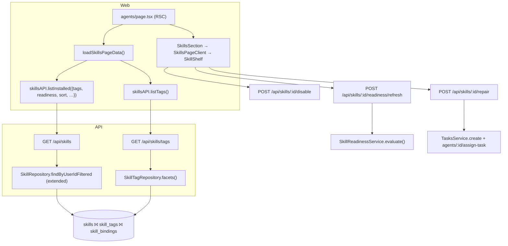
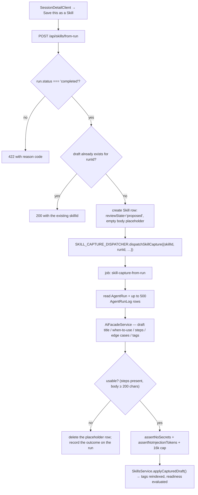

# Implementation Plan: Skills shelf

> Translates [`spec.md`](./spec.md) into architecture and tech choices. The plan owns
> implementation detail; the spec owns behaviour. **Every path below was opened in the worktree
> before it was written down** — no path in this document is invented.

**Epic ID**: `AW-08-skills-shelf`
**Spec**: [`./spec.md`](./spec.md) · **Tasks**: [`./tasks.md`](./tasks.md)
**Status**: `Draft`
**Last updated**: 2026-09-06

---

## 1. Current state in the codebase

### 1.1 What ships today

| Layer        | File                                                                                                                                                                | What it does                                                                                                                                                                                                                                                                                                                                                                                                                         |
| ------------ | ------------------------------------------------------------------------------------------------------------------------------------------------------------------- | ------------------------------------------------------------------------------------------------------------------------------------------------------------------------------------------------------------------------------------------------------------------------------------------------------------------------------------------------------------------------------------------------------------------------------------ | --------------------- |
| Entity       | [`packages/agent/src/entities/skill.entity.ts`](../../../../../packages/agent/src/entities/skill.entity.ts)                                                         | `skills` table. `ownerType`/`ownerId` (five-way lattice), `slug` (unique per owner), `invocationSlug`, `title`, `description`, `frontmatter` (`simple-json`: `name`, `description`, `allowedTools?`, `tags?`), `instructionsMd`, `contentHash`, `sourcePath`/`sourceCatalogSlug`/`sourceCatalogVersion`, `version`, plus the Tier-A `tenantId`/`organizationId` scope columns. **No enabled flag. No queryable tags. No readiness.** |
| Entity       | [`skill-binding.entity.ts`](../../../../../packages/agent/src/entities/skill-binding.entity.ts)                                                                     | `skill_bindings`. `targetType` (`agent`/`work`/`mission`/`idea`/`tenant`), nullable `targetId`, `injectIntoAgent` (default `true`), `injectIntoGenerator` (default `false`), `priority` (default `100`, lower wins). Unique on `(skillId, targetType, targetId)`.                                                                                                                                                                    |
| Entity       | [`skill-file.entity.ts`](../../../../../packages/agent/src/entities/skill-file.entity.ts)                                                                           | `skill_files`. Companion files, bytes in the uploads spine. `MAX_SKILL_FILE_BYTES = 2 MB`, `MAX_FILES_PER_SKILL = 20`.                                                                                                                                                                                                                                                                                                               |
| Repository   | [`database/repositories/skill.repository.ts`](../../../../../packages/agent/src/database/repositories/skill.repository.ts)                                          | `findByUserIdFiltered` — the shelf's query. Filters `ownerType`, `ownerId`, `search` (escaped `LIKE` over `title`/`slug`/`description`), orders `updatedAt DESC`, `take`/`skip`.                                                                                                                                                                                                                                                     |
| Repository   | [`database/repositories/skill-binding.repository.ts`](../../../../../packages/agent/src/database/repositories/skill-binding.repository.ts)                          | **`resolveActive()` — the single source of truth for "which Skills apply to this AI call".** Joins bindings to skills on the target OR-set, filters `injectIntoAgent`/`injectIntoGenerator`, orders by `priority ASC, createdAt ASC`, dedupes by `skillId` (first wins).                                                                                                                                                             |
| Service      | [`packages/agent/src/skills/skills.service.ts`](../../../../../packages/agent/src/skills/skills.service.ts)                                                         | CRUD, `installFromCatalog` (writes `sourcePath = catalogProviderId`), binding CRUD, activity-log emission, `MAX_BODY_BYTES = 64 KB`, `assertNoSecrets` + `assertNoInjectionTokens` on every body write.                                                                                                                                                                                                                              |
| Policy       | [`packages/agent/src/policy/skill-activation.ts`](../../../../../packages/agent/src/policy/skill-activation.ts)                                                     | `filterSkillsByToolGrants(skills, resolved)` → `{ active, suppressed }`. A Skill whose declared `allowedTools` are **all** refused is suppressed; declaring none keeps it active; keeping one keeps it active. **Pure — no I/O.** This is the exact predicate the `blocked_by_access` badge needs.                                                                                                                                   |
| Policy       | [`credential-resolver.ts`](../../../../../packages/agent/src/policy/credential-resolver.ts)                                                                         | `CredentialResolver.resolve(ctx, keys)` returns a `Map` that **omits keys it cannot supply** ("the caller distinguishes missing from empty"). `CREDENTIAL_RESOLVER` DI token; `EnvCredentialResolver` is the shipped implementation. This is the exact seam the `missing_requirements` badge needs, and it never returns values to a caller that only diffs key sets.                                                                |
| Policy       | [`tool-credentials.ts`](../../../../../packages/agent/src/policy/tool-credentials.ts)                                                                               | `requiredCredentialsForTool(toolName)` over `TOOL_CREDENTIAL_REQUIREMENTS` (currently frozen-empty, by design) + `TOOL_CREDENTIAL_CATALOG` (`{ description, envVar }` per key). CI check `checkToolCredentialDeclarations`.                                                                                                                                                                                                          |
| Run assembly | [`packages/agent/src/agents/agent-run.service.ts`](../../../../../packages/agent/src/agents/agent-run.service.ts) `resolveSkillsForRun` (line ~1912)                | Calls `resolveActive`, then `filterSkillsByToolGrants`, then writes one `WARN` run-log line per suppressed skill (`step: 'skills'`, metadata `{ slug, refusedTools }`) — **and nothing else consumes that**.                                                                                                                                                                                                                         |
| Tools        | [`agent-tool.service.ts`](../../../../../packages/agent/src/agents/agent-tool.service.ts)                                                                           | `resolveAllowedTools` (sync; permission flags + service presence) and `resolveGrantedTools` (async; appends MCP descriptors, then partitions by the grant matrix, returning `{ tools, refused }`).                                                                                                                                                                                                                                   |
| MCP          | [`packages/agent/src/mcp/mcp-tool-source.ts`](../../../../../packages/agent/src/mcp/mcp-tool-source.ts)                                                             | Tool names are `mcp__<connection.name>__<tool>`, capped at `MCP_TOOL_NAME_MAX = 128`. So a declared tool name **carries its connection's name**, which is how a missing connection is named without a lookup table.                                                                                                                                                                                                                  |
| MCP          | [`mcp-server-connection.entity.ts`](../../../../../packages/agent/src/entities/mcp-server-connection.entity.ts)                                                     | `name`, `url`, `transport`, `enabled`, `source`, `lastError`. Read-only for this epic.                                                                                                                                                                                                                                                                                                                                               |
| Facade       | [`packages/agent/src/facades/skills.facade.ts`](../../../../../packages/agent/src/facades/skills.facade.ts)                                                         | Catalogue union across enabled `skills-provider` plugins + the agent-package source. Also carries `checkForUpdates`, which **still has no HTTP caller** (see §12 open work).                                                                                                                                                                                                                                                         |
| Contract     | [`packages/plugin/src/contracts/capabilities/skills-provider.interface.ts`](../../../../../packages/plugin/src/contracts/capabilities/skills-provider.interface.ts) | `SkillCatalogEntry` with `tags: string[]`, `sourceUrl?`, and the package-provenance trio `packageName?`/`packageVersion?`/`sourceKind?` (`plugin`/`local`/`git`/`npm`).                                                                                                                                                                                                                                                              |
| Contract     | [`packages/contracts/src/skills/gtm-skills.ts`](../../../../../packages/contracts/src/skills/gtm-skills.ts)                                                         | First-party Skill definitions. `tags` is documented as _"Catalog tags — drive the Skills page filters"_ — a filter that has never existed.                                                                                                                                                                                                                                                                                           |
| API          | [`apps/api/src/skills/skills.controller.ts`](../../../../../apps/api/src/skills/skills.controller.ts)                                                               | `GET catalog`, `GET catalog/:slug`, `GET /` (list), `GET invocable`, `GET :id`, `POST /`, `PATCH :id`, `DELETE :id`, `POST install`, companion-file routes, `GET :id/bindings`, `POST :id/bindings`. Throttles are `{ long: { limit: 30                                                                                                                                                                                              | 60, ttl: 60_000 } }`. |
| API          | [`apps/api/src/skills/dto/skill.dto.ts`](../../../../../apps/api/src/skills/dto/skill.dto.ts)                                                                       | `ListSkillsQueryDto`, `ListSkillCatalogQueryDto`, `CreateSkillDto`, `UpdateSkillDto`, `UploadSkillFileDto`, `InstallCatalogSkillDto`, `CreateSkillBindingDto`.                                                                                                                                                                                                                                                                       |
| API          | [`apps/api/src/agents/agents.controller.ts`](../../../../../apps/api/src/agents/agents.controller.ts)                                                               | `GET :id/runs/:runId` returns the run plus up to 500 structured logs. `POST :id/assign-task` creates the `AgentRun` for a `(taskId, agentId)` pair through the concurrency valve and enqueues `agent-task-execute`. `GET :id/skills` lists per-agent bound skills.                                                                                                                                                                   |
| Web          | [`apps/web/src/components/skills/SkillsPageClient.tsx`](../../../../../apps/web/src/components/skills/SkillsPageClient.tsx)                                         | The catalogue client: three tabs, one search form, `InstalledList` (card grid), `CatalogList`, `CustomSection`, `Pagination`. Reads `basePath`/`hash` so it can live on `/agents#skills`.                                                                                                                                                                                                                                            |
| Web          | [`SkillsSection.tsx`](../../../../../apps/web/src/components/skills/SkillsSection.tsx)                                                                              | The server wrapper that hangs the client off the Agents page under `id="skills"`.                                                                                                                                                                                                                                                                                                                                                    |
| Web          | [`SkillDetailClient.tsx`](../../../../../apps/web/src/components/skills/SkillDetailClient.tsx)                                                                      | Header → Write/Preview body editor (800 ms autosave) → bindings → companion files → delete.                                                                                                                                                                                                                                                                                                                                          |
| Web          | [`apps/web/src/lib/skills-page-data.ts`](../../../../../apps/web/src/lib/skills-page-data.ts)                                                                       | `SKILLS_PAGE_SIZE = 50`, `parseSkillsSearchParams` (whitelists exactly four params), `loadSkillsPageData`, `buildSkillsHref`. Shared by the Agents page and the `/skills` redirect so the two cannot drift.                                                                                                                                                                                                                          |
| Web          | [`apps/web/src/lib/api/skills.ts`](../../../../../apps/web/src/lib/api/skills.ts)                                                                                   | `server-only` typed client; hand-maintained mirror of the agent-side types.                                                                                                                                                                                                                                                                                                                                                          |
| Web          | [`apps/web/src/app/actions/skills.ts`](../../../../../apps/web/src/app/actions/skills.ts)                                                                           | `installCatalogSkillAction`, `createCustomSkillAction`, `updateSkillAction`, `deleteSkillAction`, `createBindingAction`, `deleteBindingAction`, `listSkillFilesAction`, `deleteSkillFileAction`, `loadBindingTargetOptionsAction`.                                                                                                                                                                                                   |
| Web          | [`apps/web/src/components/agents/SessionDetailClient.tsx`](../../../../../apps/web/src/components/agents/SessionDetailClient.tsx)                                   | The run page, mounted at [`agents/sessions/[runId]/page.tsx`](<../../../../../apps/web/src/app/[locale]/(dashboard)/agents/sessions/[runId]/page.tsx>). Header + chips + timeline + steer/interrupt controls. i18n namespace `dashboard.agentsPage.sessions.detail`.                                                                                                                                                                 |

### 1.2 The exact blockers

- **Tags are unqueryable.** `frontmatter` is a `simple-json` column — a text blob in Postgres.
  There is no index, no facet query, and no way to express `WHERE tag = 'billing'` without a
  full scan and a JSON parse per row. A tag filter therefore needs a row per (Skill, tag).
- **There is no per-Skill off switch.** The nearest thing is `SkillBinding.injectIntoAgent`,
  which is per-binding. Turning a Skill off workspace-wide today means editing N rows, and
  turning it back on means remembering which N.
- **Nothing computes readiness.** `filterSkillsByToolGrants` is called exactly once, inside
  `resolveSkillsForRun`, at run time, with a grant matrix resolved for one Agent. Nothing calls
  it ahead of time and nothing persists its verdict.
- **`resolveActive` has no exclusion hook.** It is a single hand-built query builder; the off
  switch has to be an explicit predicate inside it, or the switch silently does nothing.
- **The run's suppression signal is write-only.** `resolveSkillsForRun` appends a `WARN`
  `agent_run_logs` row and moves on. No index, no aggregate, no read path.
- **Capture has nowhere to land.** `SkillsService.create` writes a live Skill immediately. There
  is no "proposed" state on `skills`, unlike `work_knowledge_documents`, which already carries
  `reviewState: 'proposed' | 'accepted'` for exactly this "an agent wrote it, a human accepts
  it" posture.
- **`ListSkillsQueryDto` whitelists four params** and `parseSkillsSearchParams` whitelists four
  URL params. Both have to grow together or the shelf's filters die at either boundary.

### 1.3 What already exists and must be reused, not rebuilt

- **The suppression predicate** — `filterSkillsByToolGrants` is pure and already returns the
  refusal per tool. The readiness service calls it; it does not reimplement it.
- **The credential port** — `CredentialResolver.resolve` already returns "what I could supply".
  The readiness service diffs the requested key set against the returned key set. It never
  touches a value, which is what makes FR-25 structurally true rather than a promise.
- **The MCP naming convention** — `mcp__<server>__<tool>` means the connection name is a
  substring of the tool name. No new mapping table.
- **The review posture** — `WorkKnowledgeDocument.reviewState` (`proposed`/`accepted`,
  `null ≡ accepted`) and its `POST …/accept` endpoint are the shape the captured-Skill flow
  copies verbatim, including the word.
- **The dispatcher pattern** — [`packages/agent/src/tasks/kb-reembed-work-dispatcher.ts`](../../../../../packages/agent/src/tasks/kb-reembed-work-dispatcher.ts)
  is the template: a type-only interface plus a `Symbol()` token, listed in
  [`_tasks-symbols.ts`](../../../../../packages/agent/src/tasks/_tasks-symbols.ts).
- **The scheduled-sweep shape** — [`packages/tasks/src/tasks/trigger/kb-reconcile.task.ts`](../../../../../packages/tasks/src/tasks/trigger/kb-reconcile.task.ts)
  (`schedules.task`, daily, deliberately offset cron, caps per tick, PostHog event at the end).
- **Scope stamping** — [`apps/api/src/scope/scope-stamping.subscriber.ts`](../../../../../apps/api/src/scope/scope-stamping.subscriber.ts)
  auto-fills `tenantId`/`organizationId` on any entity declaring both columns.
- **The catalogue's provenance fields** — `sourcePath` already holds the catalogue provider id
  for installed Skills, and `SkillCatalogEntry.sourceKind`/`packageName` distinguish package
  entries. Provenance is **derived**, not a new column.
- **Task + assign-task** — a repair is an ordinary `Task` with `missionId = null` (the column is
  nullable) plus `POST /api/agents/:id/assign-task`. No new work-item concept.

---

## 2. Architecture and the seam this plugs into

### 2.1 One new service, one new read model, one new exclusion

```
                       ┌──────────────────────────────────────────────┐
                       │  SkillReadinessService   (NEW, agent pkg)    │
                       │                                              │
   reads (never writes)│  • bindings for the Skill  ──► needs_setup   │
   ┌───────────────────┤  • filterSkillsByToolGrants ─► blocked       │
   │                   │  • requiredCredentialsForTool + resolver     │
   │                   │        key-set diff  ───────► missing (cred) │
   │                   │  • mcp__<server>__ prefix vs                 │
   │                   │        mcp_server_connections ► missing (conn)│
   │                   │  • plugin settings schema required-key check │
   │                   │        ─────────────────────► missing (plugin)│
   │                   └──────────────────┬───────────────────────────┘
   │                                      │ writes ONLY these three columns
   │                                      ▼
   │        skills.readiness · skills.readinessDetail · skills.readinessCheckedAt
   │                                      │
   │                                      ▼
   │        ┌─────────────────────────────────────────────────────────┐
   │        │  GET /api/skills           (extended: tags, readiness,  │
   │        │                             provenance, enabled, sort)  │
   │        │  GET /api/skills/tags      (NEW facet)                  │
   │        │  POST /api/skills/:id/{enable,disable,readiness/refresh,│
   │        │        repair,accept}      (NEW)                        │
   │        │  POST /api/skills/from-run (NEW)                        │
   │        └─────────────────────────────────────────────────────────┘
   │
   └── skill_bindings · agents · mcp_server_connections · user_plugins · tool_grants
       (all read-only from this epic's point of view)

   AND, in the run path, ONE new predicate:

       SkillBindingRepository.resolveActive()
           … existing target OR-set + inject flags …
       +   AND skill.disabledAt IS NULL
       +   AND (skill.reviewState IS NULL OR skill.reviewState <> 'proposed')
```

That is the whole architectural change. The off switch is one `AND` in one query. Readiness is
a cached column filled by a service that only reads. Nothing about priority, dedup, or scope
resolution moves.

### 2.2 Request flow — the shelf



### 2.3 Request flow — capture from a run



The placeholder row created **before** the job is deliberate: it is what makes FR-48
("a second request returns the same draft") a unique-index guarantee rather than a race.

---

## 3. Data model

### 3.1 `skills` — five additive columns

All nullable or defaulted; no existing column is touched, renamed or re-typed.

| Column               | Type                                                                                                                                       | Default     | Why                                                                                                                                                                                                                                                                                      |
| -------------------- | ------------------------------------------------------------------------------------------------------------------------------------------ | ----------- | ---------------------------------------------------------------------------------------------------------------------------------------------------------------------------------------------------------------------------------------------------------------------------------------- |
| `disabledAt`         | `timestamptz NULL` (via `PortableDateColumn({ nullable: true })` from [`_types.ts`](../../../../../packages/agent/src/entities/_types.ts)) | `NULL`      | The off switch. `NULL` = on. A timestamp rather than a boolean so "when did this stop being used" is answerable without an audit join.                                                                                                                                                   |
| `readiness`          | `varchar(24) NOT NULL`                                                                                                                     | `'unknown'` | Cached verdict. One of `ready`, `needs_setup`, `missing_requirements`, `blocked_by_access`, `unknown`. `disabled` and `needs_review` are **not** stored here — they are derived at read time from `disabledAt` / `reviewState`, so the two switches cannot desynchronise from the cache. |
| `readinessDetail`    | `simple-json NULL`                                                                                                                         | `NULL`      | `SkillReadinessDetail` (§3.3). Bounded: at most 20 requirement rows, each ≤ 200 chars. Never contains a credential value.                                                                                                                                                                |
| `readinessCheckedAt` | `timestamptz NULL`                                                                                                                         | `NULL`      | Drives the 60-minute staleness sweep and the "Checked 6 minutes ago" line.                                                                                                                                                                                                               |
| `reviewState`        | `varchar(16) NULL`                                                                                                                         | `NULL`      | `'proposed'` or `NULL` (≡ accepted). Same vocabulary and same nullable-means-accepted convention as `work_knowledge_documents.reviewState`.                                                                                                                                              |
| `capturedFromRunId`  | `uuid NULL`                                                                                                                                | `NULL`      | The `agent_runs.id` a captured Skill was drafted from. **No FK** — deleting a run must not delete a Skill, and the entities barrel avoids cross-family relations by convention (see the EW-654 note in `user.entity.ts`).                                                                |

New indexes on `skills`:

| Index                          | Columns                                                                     | Why                                                     |
| ------------------------------ | --------------------------------------------------------------------------- | ------------------------------------------------------- |
| `idx_skills_user_readiness`    | `(userId, readiness)`                                                       | The "needs attention" filter and the summary count.     |
| `idx_skills_readiness_checked` | `(readinessCheckedAt)`                                                      | The sweep's "oldest first" scan.                        |
| `uq_skills_captured_run`       | `(capturedFromRunId)` UNIQUE, partial `WHERE capturedFromRunId IS NOT NULL` | Makes "one draft per run" a database guarantee (FR-48). |

### 3.2 `skill_tags` — the new table

```
skill_tags
├── id              uuid          PK
├── skillId         uuid          NOT NULL   (CASCADE with skills.id)
├── userId          uuid          NOT NULL   (CASCADE with user.id)
├── tag             varchar(40)   NOT NULL   (normalised: lower-case, [a-z0-9-])
├── tenantId        uuid          NULL       (Tier C scope stamp)
├── organizationId  uuid          NULL       (Tier C scope stamp)
└── createdAt       timestamptz   NOT NULL

uq_skill_tags_skill_tag   UNIQUE (skillId, tag)
idx_skill_tags_user_tag           (userId, tag)      ← facet counts + the AND filter
idx_skill_tags_skill              (skillId)          ← reindex on write
```

Entity file `packages/agent/src/entities/skill-tag.entity.ts`, following the family's
conventions exactly: `@ManyToOne` to `Skill` and `User` with `onDelete: 'CASCADE'`, no
`@ManyToOne` to tenant/organization (cycle avoidance), scope columns declared so
`scope-stamping.subscriber.ts` fills them.

Registration, all four steps (the drift spec in `database.module.spec.ts` fails loudly
otherwise):

1. `export * from './skill-tag.entity'` in [`packages/agent/src/entities/index.ts`](../../../../../packages/agent/src/entities/index.ts).
2. `'SkillTag'` into `AGENT_ENTITY_NAMES` in [`_entity-names.ts`](../../../../../packages/agent/src/database/_entity-names.ts) (alphabetical, next to `Skill`/`SkillBinding`/`SkillFile`).
3. `SkillTag` into `ENTITIES` in [`_entities-inventory.ts`](../../../../../packages/agent/src/database/_entities-inventory.ts) (import + array entry).
4. `TypeOrmModule.forFeature([… SkillTag])` in [`packages/agent/src/skills/skills.module.ts`](../../../../../packages/agent/src/skills/skills.module.ts).

**Tags are derived, never authored.** `SkillsService.create`, `update` and
`installFromCatalog` each call `SkillTagRepository.replaceForSkill(skillId, userId, tags)` in
the same transaction as the Skill write, deriving `tags` from `frontmatter.tags`. There is no
tag endpoint that writes.

### 3.3 New shared types

`packages/contracts/src/skills/readiness.ts` (re-exported from
[`packages/contracts/src/skills/index.ts`](../../../../../packages/contracts/src/skills/index.ts)):

```ts
export const SKILL_READINESS_STATES = [
	'ready',
	'needs_setup',
	'missing_requirements',
	'blocked_by_access',
	'unknown'
] as const;
export type SkillReadinessState = (typeof SKILL_READINESS_STATES)[number];

/** What the CARD renders — the stored state widened by the two switches. */
export const SKILL_CARD_STATES = [...SKILL_READINESS_STATES, 'disabled', 'needs_review'] as const;
export type SkillCardState = (typeof SKILL_CARD_STATES)[number];

export type SkillRequirementKind = 'tool' | 'credential' | 'connection' | 'pluginSetting';
export type SkillRequirementStatus = 'met' | 'missing' | 'refused' | 'unknown';

export interface SkillRequirement {
	kind: SkillRequirementKind;
	/** The identifier a person can act on: a tool name, a credential KEY, a connection name. */
	id: string;
	status: SkillRequirementStatus;
	/** Stable machine reason; the UI maps it to translated copy. Never free prose. */
	reason?:
		| 'notSet'
		| 'notConnected'
		| 'disabled'
		| 'refusedByGrants'
		| 'pluginNotEnabled'
		| 'settingMissing'
		| 'checkFailed';
	/** Deep-link hint the web app turns into a route. Never a URL from a plugin. */
	fixTarget?: { surface: 'credentials' | 'connections' | 'plugins' | 'access'; ref: string };
}

export interface SkillReadinessDetail {
	requirements: SkillRequirement[]; // ≤ 20, truncated with `truncated: true`
	truncated?: boolean;
	boundTargetCount: number; // 0 ⇒ needs_setup
	mutedBindingCount: number;
	evaluatedForAgentIds: string[]; // ≤ 10, the agents the verdict was computed against
	evaluatedAt: string; // ISO
}

export const SKILL_TAG_MAX_LENGTH = 40;
export const SKILL_TAGS_PER_SKILL_MAX = 12;
export const SKILL_TAG_FACET_LIMIT = 200;
export const SKILL_TAG_CHIPS_SHOWN = 12;
export const SKILL_TAG_FILTER_MAX = 6;
export const SKILL_READINESS_TTL_MS = 60 * 60_000;
export const SKILL_READINESS_SWEEP_BATCH = 500;
export const SKILL_READINESS_SWEEP_PER_USER = 200;
export const SKILL_CAPTURE_BODY_MAX_CHARS = 16_000;
export const SKILL_CAPTURE_BODY_MIN_CHARS = 200;
export const SKILL_CAPTURE_BUDGET_MS = 90_000;
```

### 3.4 The migration (Constitution V, forward-only)

One file, one PR: `apps/api/src/migrations/1791080000000-AddSkillShelfReadinessAndTags.ts`.
The timestamp is AW-08 slot 00 of the program's reserved migration blocks ([README §5 rule 10](../README.md#5-rules-every-epic-spec-in-this-program-must-follow)),
above the newest on `develop` at time of writing, `1790100000000-AddReleaseVerification.ts` — verified by
listing [`apps/api/src/migrations/`](../../../../../apps/api/src/migrations). Re-stamp before merge
if a newer migration has landed.

`up()`:

1. `ALTER TABLE "skills" ADD COLUMN "disabledAt" TIMESTAMP WITH TIME ZONE NULL`
2. `ALTER TABLE "skills" ADD COLUMN "readiness" character varying(24) NOT NULL DEFAULT 'unknown'`
3. `ALTER TABLE "skills" ADD COLUMN "readinessDetail" text NULL`
4. `ALTER TABLE "skills" ADD COLUMN "readinessCheckedAt" TIMESTAMP WITH TIME ZONE NULL`
5. `ALTER TABLE "skills" ADD COLUMN "reviewState" character varying(16) NULL`
6. `ALTER TABLE "skills" ADD COLUMN "capturedFromRunId" uuid NULL`
7. `CREATE INDEX "idx_skills_user_readiness" ON "skills" ("userId", "readiness")`
8. `CREATE INDEX "idx_skills_readiness_checked" ON "skills" ("readinessCheckedAt")`
9. `CREATE UNIQUE INDEX "uq_skills_captured_run" ON "skills" ("capturedFromRunId") WHERE "capturedFromRunId" IS NOT NULL`
10. `CREATE TABLE "skill_tags" (…)` + its three indexes
11. **Backfill**, idempotent and re-runnable:
    `INSERT INTO "skill_tags" (id, "skillId", "userId", tag, "tenantId", "organizationId", "createdAt")`
    selecting from `skills` with the frontmatter `tags` array expanded, normalised in SQL
    (`lower(btrim(t))`, hyphenated, `~ '^[a-z0-9][a-z0-9-]*$'`, `left(…, 40)`), `LIMIT 12` per
    skill, guarded by `ON CONFLICT ("skillId", tag) DO NOTHING`.
    On SQLite (dev/test) the JSON expansion is unavailable, so the backfill is skipped there and
    the reindex happens lazily on the next Skill write; the migration branches on
    `queryRunner.connection.options.type`, the way the existing raw-SQL migrations in this
    directory do.

`down()`: drop the three indexes, drop `skill_tags`, drop the six columns. Non-destructive of
anything that existed before the migration.

> The `readiness` column is **NOT NULL DEFAULT 'unknown'** rather than backfilled to `'ready'`.
> Claiming readiness we have not verified is the one failure this whole epic exists to prevent
> (FR-12/S12). Every pre-existing Skill starts as **Couldn't check** and is corrected by the
> first sweep, within 60 minutes of deploy.

---

## 4. API

All endpoints are on the existing `@Controller('api/skills')` in
[`apps/api/src/skills/skills.controller.ts`](../../../../../apps/api/src/skills/skills.controller.ts)
unless stated. All are JWT-guarded by the global guard (no `@Public()`), all are scoped with
`@CurrentUser()` + the `ScopeContext` the controller already resolves, and all answer **404**
for another workspace's id.

> **Route-order rule:** `GET /tags` and `POST /from-run` must be declared **before** the
> `:id` routes, exactly as the existing `GET invocable` is ("Must be declared before `:id`
> route" — the controller's own comment).

### 4.1 Extended: `GET /api/skills`

`ListSkillsQueryDto` gains, all optional:

| Param        | Type                                                  | Validation                                                           |
| ------------ | ----------------------------------------------------- | -------------------------------------------------------------------- |
| `tags`       | `string` (comma-separated)                            | ≤ 6 entries, each ≤ 40 chars, `^[a-z0-9][a-z0-9-]*$`. AND semantics. |
| `readiness`  | `SkillCardState \| 'attention'`                       | `attention` = every state except `ready`.                            |
| `provenance` | `'firstParty' \| 'plugin' \| 'package' \| 'authored'` |                                                                      |
| `enabled`    | `'true' \| 'false'`                                   |                                                                      |
| `sort`       | `'updated' \| 'name' \| 'attention'`                  | default `updated`                                                    |

Response row gains (existing fields unchanged, per Constitution X):

```ts
{
  …Skill,
  tags: string[];
  cardState: SkillCardState;          // readiness widened by disabledAt / reviewState
  readiness: SkillReadinessState;     // the stored verdict
  readinessDetail: SkillReadinessDetail | null;
  readinessCheckedAt: string | null;
  disabledAt: string | null;
  reviewState: 'proposed' | null;
  capturedFromRunId: string | null;
  provenance: 'firstParty' | 'plugin' | 'package' | 'authored';
  boundTargetCount: number;
  openRepairTaskId: string | null;
}
```

Response `meta` gains `counts: Record<SkillCardState, number>` for the summary line, computed
by a single grouped count so the shelf does not need a second round trip.

`provenance` derivation (no new column): `authored` when `sourceCatalogSlug IS NULL`;
otherwise `firstParty` when `sourcePath = 'everworks-skills'`, `package` when `sourcePath`
starts with `pkg:`, else `plugin`. The literal `'everworks-skills'` lives **inside**
`packages/plugins/everworks-skills/` and is exported as `EVERWORKS_SKILLS_PROVIDER_ID`; the API
imports the constant, never the string (Constitution II — see §7).

### 4.2 New endpoints

| Method | Path                                | Body / query                  | Returns                                                                  | Throttle                                  |
| ------ | ----------------------------------- | ----------------------------- | ------------------------------------------------------------------------ | ----------------------------------------- |
| `GET`  | `/api/skills/tags`                  | `?limit` (≤ 200, default 200) | `{ tags: Array<{ tag: string; count: number }>; total: number }`         | inherits default                          |
| `POST` | `/api/skills/:id/enable`            | —                             | `{ id, cardState, readiness, disabledAt: null }`                         | `{ long: { limit: 60, ttl: 60_000 } }`    |
| `POST` | `/api/skills/:id/disable`           | —                             | `{ id, cardState: 'disabled', disabledAt }`                              | `{ long: { limit: 60, ttl: 60_000 } }`    |
| `GET`  | `/api/skills/:id/readiness`         | —                             | `{ readiness, readinessDetail, readinessCheckedAt, cardState }` (cached) | inherits                                  |
| `POST` | `/api/skills/:id/readiness/refresh` | —                             | same shape, freshly computed                                             | `{ long: { limit: 30, ttl: 60_000 } }`    |
| `POST` | `/api/skills/:id/repair`            | `RepairSkillDto`              | `202` `{ kind, taskId?, runId?, bindingId?, readiness }`                 | `{ long: { limit: 10, ttl: 60_000 } }`    |
| `POST` | `/api/skills/:id/accept`            | —                             | the accepted Skill row                                                   | `{ long: { limit: 30, ttl: 60_000 } }`    |
| `POST` | `/api/skills/from-run`              | `CaptureSkillFromRunDto`      | `202` `{ skillId, state: 'drafting' }`                                   | `{ long: { limit: 10, ttl: 3_600_000 } }` |

`RepairSkillDto`:

```ts
{
  action: 'attach' | 'unmute' | 'enable' | 'recheck' | 'delegate';
  // action=attach
  targetType?: 'agent' | 'work' | 'mission' | 'idea' | 'tenant';
  targetId?: string;      // required unless targetType === 'tenant'
  // action=delegate
  agentId?: string;       // required
  restart?: boolean;      // cancel an existing open repair Task and open a new one
}
```

`CaptureSkillFromRunDto`:

```ts
{
  runId: string;                            // uuid, must belong to the caller
  agentId: string;                          // uuid, the run's agent
  ownerType: SkillOwnerType;                // default 'agent'
  ownerId: string;                          // default = agentId
  title?: string;                           // ≤ 120 chars
  emphasis?: string;                        // ≤ 280 chars, passed to the drafting prompt
}
```

**Error contract** (matching the codebase's existing posture):

| Situation                                                                | Status | Body                                                        |
| ------------------------------------------------------------------------ | ------ | ----------------------------------------------------------- |
| Skill/run belongs to another workspace                                   | `404`  | `Skill <id> not found.`                                     |
| `from-run` on a non-`completed` run                                      | `422`  | `{ code: 'runNotCompleted', status: '<actual>' }`           |
| `repair action=delegate` with an open repair Task and `restart !== true` | `409`  | `{ code: 'repairInProgress', taskId, agentName, openedAt }` |
| `repair action=attach` duplicating an existing binding                   | `409`  | `{ code: 'bindingExists', bindingId }`                      |
| `accept` on a Skill that is not `proposed`                               | `422`  | `{ code: 'notProposed' }`                                   |
| `> 6 tags` in the filter                                                 | `400`  | `Six tags is the limit for one filter.`                     |

### 4.3 Web BFF routes

The web app's server components call the API through the `server-only`
[`apps/web/src/lib/api/skills.ts`](../../../../../apps/web/src/lib/api/skills.ts) client, so no
new BFF route is needed for reads. The two client-side interactions that must not go through a
server action round trip (the card toggle and the card-level re-check, both of which need to
feel instant) get thin BFF proxies mirroring the existing
[`apps/web/src/app/api/skills/[id]/files/route.ts`](../../../../../apps/web/src/app/api/skills/%5Bid%5D/files/route.ts):

- `apps/web/src/app/api/skills/[id]/enable/route.ts` (`POST`)
- `apps/web/src/app/api/skills/[id]/disable/route.ts` (`POST`)
- `apps/web/src/app/api/skills/[id]/readiness/route.ts` (`GET`, `POST` for refresh)

Everything else (repair, accept, capture) goes through new server actions in
[`apps/web/src/app/actions/skills.ts`](../../../../../apps/web/src/app/actions/skills.ts) so it
picks up `revalidatePath` for free.

---

## 5. Web

### 5.1 Where it hangs

The shelf stays exactly where navigation consolidation put it: the `#skills` block on
[`apps/web/src/app/[locale]/(dashboard)/agents/page.tsx`](<../../../../../apps/web/src/app/%5Blocale%5D/(dashboard)/agents/page.tsx>),
rendered by [`SkillsSection.tsx`](../../../../../apps/web/src/components/skills/SkillsSection.tsx)
→ [`SkillsPageClient.tsx`](../../../../../apps/web/src/components/skills/SkillsPageClient.tsx).
`/skills` keeps redirecting there. No new route, no sidebar change.

### 5.2 Components

| Component             | File                                                     | Type   | Notes                                                                                                                                                                                                                                 |
| --------------------- | -------------------------------------------------------- | ------ | ------------------------------------------------------------------------------------------------------------------------------------------------------------------------------------------------------------------------------------- |
| `SkillShelf`          | `apps/web/src/components/skills/SkillShelf.tsx`          | client | Replaces the body of the existing `InstalledList` function inside `SkillsPageClient`. Owns the grid, the summary line and the empty states. `InstalledList` is kept as a thin wrapper so the file's other two sections are untouched. |
| `SkillShelfCard`      | `apps/web/src/components/skills/SkillShelfCard.tsx`      | client | One card: title, description, tags, provenance chip, version, toggle, badge, repair actions.                                                                                                                                          |
| `SkillReadinessBadge` | `apps/web/src/components/skills/SkillReadinessBadge.tsx` | client | Pure presentational: `SkillCardState` → icon + translated label + optional enumerated list. Used by the card **and** the detail panel, so the two can never disagree.                                                                 |
| `SkillTagFilter`      | `apps/web/src/components/skills/SkillTagFilter.tsx`      | client | Chip row with counts, roving-tabindex keyboard model, `+{n} more` popover with its own search box, 6-selection cap.                                                                                                                   |
| `SkillRepairDialog`   | `apps/web/src/components/skills/SkillRepairDialog.tsx`   | client | Enumerated missing items with per-item deep links, plus the agent picker and the delegate button. Handles the `409 repairInProgress` variant.                                                                                         |
| `SkillAttachDialog`   | `apps/web/src/components/skills/SkillAttachDialog.tsx`   | client | Reuses `loadBindingTargetOptionsAction` (already used by `SkillDetailClient`'s add-binding form) so the picker behaves identically in both places.                                                                                    |
| `SkillReadinessPanel` | `apps/web/src/components/skills/SkillReadinessPanel.tsx` | client | The detail-page panel: state, checked-at, `Re-check`, and the requirements table.                                                                                                                                                     |
| `SkillReviewBanner`   | `apps/web/src/components/skills/SkillReviewBanner.tsx`   | client | `Needs your review` banner with Accept/Discard. Mirrors the KB review banner's shape and copy rhythm.                                                                                                                                 |
| `SkillCaptureDialog`  | `apps/web/src/components/skills/SkillCaptureDialog.tsx`  | client | Mounted from the run page. Scope picker + title + emphasis.                                                                                                                                                                           |

Modified files (additive only):

- `SkillsPageClient.tsx` — `InstalledList` delegates to `SkillShelf`; `updateUrl` learns the new
  params; the search input's placeholder key changes value only.
- `SkillDetailClient.tsx` — `SkillReadinessPanel` + `SkillReviewBanner` + a "Where it came from"
  block inserted **above** the existing instructions section. Nothing below moves.
- `SessionDetailClient.tsx` — one header action rendering `SkillCaptureDialog`, gated on
  `run.status === 'completed'`.
- `apps/web/src/lib/skills-page-data.ts` — `parseSkillsSearchParams` whitelists five more
  params; `loadSkillsPageData` fetches the tag facets alongside the two existing calls in the
  same `Promise.all`; `buildSkillsHref` learns to serialise them.
- `apps/web/src/lib/api/skills.ts` — the hand-maintained type mirror grows the new fields and
  the four new client methods.
- `apps/web/src/lib/constants.ts` — no new route constant is required; the shelf reuses
  `ROUTES.DASHBOARD_AGENTS_SKILLS`.

### 5.3 State and data fetching

- **Server-first.** The shelf's first paint, badges included, comes from
  `loadSkillsPageData()` in the Agents page's existing `Promise.all`. FR-8 forbids a second
  wave, so readiness must be part of the list response, not a per-card fetch.
- **Filters live in the URL.** `SkillShelf` mirrors the existing `updateUrl` /
  `router.replace(basePath + params + hash)` pattern already in `SkillsPageClient` — the same
  pattern that keeps the block anchored at `#skills` instead of navigating to `/skills`.
- **The toggle is optimistic.** `SkillShelfCard` flips local state, calls the BFF route, and
  reverts with an inline error on failure. Because the endpoint is idempotent (FR-18), a
  double-click cannot produce an inconsistent state; because the last write wins (S13), no
  conflict dialog is needed.
- **Re-check is a transition.** `useTransition` around the refresh call; the badge shows a
  spinner in place of its icon, never a layout-shifting skeleton.
- **Capture polls once.** After `202 drafting`, the run page polls
  `GET /api/skills/:id/readiness` every 5 seconds for at most 120 seconds, then falls back to a
  static "check the shelf" line. It reuses the poll cadence `SessionDetailClient` already runs
  for live runs rather than introducing a second timer.

---

## 6. Background work

Both jobs go through the configured job-runtime provider via `*_DISPATCHER` DI symbols
(Constitution IV). Neither imports a vendor SDK at the call site.

### 6.1 Dispatchers (agent package)

`packages/agent/src/tasks/skill-readiness-sweep-dispatcher.ts`:

```ts
export interface SkillReadinessSweepDispatcher {
	dispatchSkillReadinessSweep(payload: SkillReadinessSweepPayload): Promise<string | null>;
}
export const SKILL_READINESS_SWEEP_DISPATCHER = Symbol('SKILL_READINESS_SWEEP_DISPATCHER');
```

`packages/agent/src/tasks/skill-capture-dispatcher.ts`:

```ts
export interface SkillCaptureDispatcher {
	dispatchSkillCapture(payload: SkillCapturePayload): Promise<string>;
}
export const SKILL_CAPTURE_DISPATCHER = Symbol('SKILL_CAPTURE_DISPATCHER');
```

Capture **propagates** dispatch errors (a dropped capture leaves a placeholder Skill row
stranded in `proposed` with an empty body — unacceptable), following the
`KbReembedWorkDispatcher` precedent's reasoning verbatim. The sweep returns `string | null` and
treats a null as a soft failure the next tick recovers, following the KB media dispatchers.

Both symbol names are added to `TASKS_BARREL_RUNTIME_SYMBOLS` in
[`packages/agent/src/tasks/_tasks-symbols.ts`](../../../../../packages/agent/src/tasks/_tasks-symbols.ts)
(alphabetical) and exported from [`packages/agent/src/tasks/index.ts`](../../../../../packages/agent/src/tasks/index.ts),
or `tasks.spec.ts` reds on the next merge — the exact failure that file exists to prevent.

### 6.2 `skill-readiness-sweep` (scheduled)

`packages/tasks/src/tasks/trigger/skill-readiness-sweep.task.ts`, a `schedules.task` modelled
on [`kb-reconcile.task.ts`](../../../../../packages/tasks/src/tasks/trigger/kb-reconcile.task.ts).

- **Cron `17 * * * *`** — hourly at :17. Deliberately off the 03:xx cluster
  (`kb-reconcile` at `42 3`) and off `memory-consolidation-tick` at `37 8`, and off the top of
  the hour where the heartbeat dispatchers live.
- Selects `skills` where `readinessCheckedAt IS NULL OR readinessCheckedAt < now() - 60 min`,
  ordered `readinessCheckedAt ASC NULLS FIRST`, `LIMIT 500`, with a per-`userId` cap of 200
  applied in the query (`ROW_NUMBER() OVER (PARTITION BY "userId")`).
- For each, calls `SkillReadinessService.evaluate(skill)` and writes the three readiness columns
  with a scoped `UPDATE … WHERE id = :id AND "userId" = :userId`.
- Emits `skill.readiness.sweep.completed` with `{ scanned, changed, byState, durationMs }`.
  Counters only — never a Skill body, a tag, or a credential key.
- Mutual exclusion: the tick is naturally idempotent (recomputing a verdict is a pure function
  of current state), so no distributed lock is needed. Overlapping ticks converge.

### 6.3 `skill-capture-from-run` (one-shot)

`packages/tasks/src/tasks/trigger/skill-capture-from-run.task.ts`.

- Payload `{ skillId, runId, agentId, userId, tenantId, organizationId, emphasis? }`.
- Reads the `AgentRun` and up to 500 `AgentRunLog` rows (the same cap
  `agents.controller.ts` already uses for the run-detail endpoint), keeping `step`, `level`,
  `message` and the tool-name field of `metadata`. **Log messages are treated as untrusted
  input** and are wrapped in a delimited block in the drafting prompt, the way
  `memory-recall.ts` already fences recalled memory before it reaches a model.
- Calls `AiFacadeService` (never a provider SDK) for one structured completion whose schema is
  `{ title, whenToUse, steps: string[], edgeCases: string[], tags: string[] }`.
- Renders the Markdown body from that structure in code, not by asking the model for Markdown —
  so the "Edge cases" section is guaranteed present and separately addressable (FR-44).
- Runs `assertNoSecrets` + `assertNoInjectionTokens` (both already applied to every Skill body
  by `SkillsService`) and the 16,000-char cap before writing.
- **Not usable** (no steps, or body < 200 chars) → deletes the placeholder row and appends a
  single `INFO` `agent_run_logs` row with `step: 'skill-capture'` so the run page can render the
  outcome without a new table.
- `maxDuration` 90 s, retries 1. A retry re-reads the placeholder and is safe because the write
  is a full replace keyed by `skillId`.
- Emits `skill.capture.completed` with `{ outcome: 'created' | 'discarded' | 'rejected', reason?, durationMs }`.

### 6.4 Where readiness is also recomputed synchronously

- On every `SkillsService.create` / `update` / `installFromCatalog` (the Skill's own definition
  changed).
- On every binding create/delete (the reach changed).
- On enable / disable / accept (the switches changed).
- In `AgentRunService.resolveSkillsForRun`, **inside the existing suppressed-skill loop** — the
  loop that today only writes a `WARN` log line also writes
  `readiness = 'blocked_by_access'` for that Skill (FR-32). Best-effort and fire-and-forget,
  the same posture as the existing `void this.runLogs?.append(...).catch(() => undefined)`
  around it: a failed readiness write must never fail a run.

---

## 7. Plugin boundaries

- **No new plugin package is required.** This epic adds no external integration. It _reads_
  what the plugin system already knows: which `skills-provider` plugins are enabled (through
  `SkillsFacadeService`), which plugin settings are unset (through
  [`plugin-settings.service.ts`](../../../../../packages/agent/src/plugins/services/plugin-settings.service.ts)
  and [`settings-schema-validator.service.ts`](../../../../../packages/agent/src/plugins/services/settings-schema-validator.service.ts)),
  and which MCP connections exist.
- **Constitution II — no hardcoded plugin id outside the plugin.** The one place a plugin id is
  needed is provenance (`firstParty` vs `plugin`). The literal is exported from the plugin that
  owns it: `export const EVERWORKS_SKILLS_PROVIDER_ID = 'everworks-skills'` in
  [`packages/plugins/everworks-skills/src/index.ts`](../../../../../packages/plugins/everworks-skills/src/index.ts),
  imported by the API's provenance mapper. Nothing else in this epic names a plugin.
- **The readiness check asks facades, never plugins.** Whether a capability is available is a
  question for the facade resolver; whether a _setting_ is missing is a question for
  `SettingsSchemaValidatorService.validateSettings(...)`, which already returns the offending
  key names in its `errors` array. The readiness service parses **which keys**, not the values.
- **No outbound calls (FR-29).** `mcp_server_connections.enabled` and `.lastError` are read from
  the row; the MCP tool source is never asked to connect. This is what keeps a slow third party
  from making the shelf slow, and it is also what keeps the check safe to run 500 times an hour.

---

## 8. i18n

All keys under [`apps/web/messages/en.json`](../../../../../apps/web/messages/en.json). Leaf key
names are camelCase and contain **no literal dot** — a dot in a leaf name is rejected by the
message runtime and reds several e2e shards at once.

> **Read the listings below as paths through a nested object, not as flat keys.**
> `shelf.searchPlaceholder` means `{"dashboard":{"skillsPage":{"shelf":{"searchPlaceholder": …}}}}`.
> Every leaf name (`searchPlaceholder`, `sortLabel`, `attentionSummary`, …) is a single
> camelCase token with no `.` in it.

New sub-tree `dashboard.skillsPage.shelf`:

```
shelf.searchPlaceholder            "Search skills by title, tag or description"
shelf.sortLabel                    "Sort"
shelf.sortUpdated                  "Recently updated"
shelf.sortName                     "Name (A–Z)"
shelf.sortAttention                "Needs attention first"
shelf.tagsLabel                    "Tags:"
shelf.tagsMore                     "+{count} more"
shelf.tagsSearchPlaceholder        "Find a tag"
shelf.tagsLimitTooltip             "Six tags is the limit for one filter."
shelf.attentionSummary             "{count} of {total} Skills need you."
shelf.attentionAllReady            "All {total} Skills are ready."
shelf.attentionFilterOn            "Show only these"
shelf.attentionFilterOff           "Show all"
shelf.reach                        "Reaching {count, plural, =0 {no agents} =1 {1 agent} other {# agents}}"
shelf.toggleOn                     "On"
shelf.toggleOff                    "Off"
shelf.toggleAriaOn                 "Skill is on"
shelf.toggleAriaOff                "Skill is off"
shelf.toggleHint                   "Takes effect on the next run."
shelf.emptyTitle                   "No Skills yet."
shelf.emptyBody                    "Skills are how one good run becomes something your agents can repeat. Install one from the catalogue, write one, or finish a run and save it."
shelf.emptyBrowse                  "Browse catalogue"
shelf.emptyNew                     "New Skill"
shelf.emptyFromRun                 "Save from a run"
shelf.emptyFromRunTooltip          "Available once a run finishes."
shelf.noResultsTagged              "No Skills match “{query}” in “{tags}”."
shelf.noResultsPlain               "No Skills match “{query}”."
shelf.clearFilters                 "Clear filters"
shelf.pastEnd                      "No results on this page."
shelf.backToFirstPage              "Back to the first page"
```

New sub-tree `dashboard.skillsPage.readiness`:

```
readiness.checkedAgo               "Checked {ago}"
readiness.recheck                  "Re-check"
readiness.panelTitle               "Readiness"
readiness.requirementsTitle        "Requirements"
readiness.provenanceTitle          "Where it came from"

readiness.needsSetupTitle          "Not reaching any agent"
readiness.needsSetupBody           "Nothing is bound to it, so no run will pick it up."
readiness.needsSetupMuted          "Every binding it has is switched off for agent runs."
readiness.missingTitle             "{count, plural, =1 {Missing 1 requirement} other {Missing # requirements}}"
readiness.missingBody              "This Skill won’t be able to finish the job until it’s connected."
readiness.blockedTitle             "Blocked by your access rules"
readiness.blockedBody              "Every tool this Skill uses is refused for this Agent."
readiness.reviewTitle              "Needs your review"
readiness.reviewBody               "Drafted from a run on {date}. It won’t be used until you accept it."
readiness.disabledTitle            "Switched off"
readiness.disabledBody             "Off. Nothing else changed — flip it back on any time."
readiness.unknownTitle             "Couldn’t check"
readiness.unknownBody              "We couldn’t work out whether this is ready. Last checked {ago}."
readiness.repairInProgressTitle    "Repair in progress"
readiness.repairInProgressBody     "{agentName} is fixing this — opened {ago}."
readiness.openTask                 "Open the Task"

readiness.kindTool                 "Tool"
readiness.kindCredential           "Credential"
readiness.kindConnection           "Connection"
readiness.kindPluginSetting        "Plugin setting"
readiness.statusMet                "available"
readiness.statusNotSet             "not set"
readiness.statusNotConnected       "not connected"
readiness.statusRefused            "refused by your access rules"
readiness.statusUnknown            "couldn’t check"
readiness.truncated                "…and {count} more"

readiness.provenanceFirstParty     "First-party"
readiness.provenancePlugin         "From a plugin"
readiness.provenancePackage        "From a package"
readiness.provenanceAuthored       "Yours"
readiness.provenanceAuthoredLong   "Written in this workspace."
readiness.provenanceCapturedLong   "Drafted from a run by {agentName} on {date}."
readiness.openRun                  "Open that run"
```

New sub-tree `dashboard.skillsPage.repair`:

```
repair.dialogTitle                 "Fix “{title}”"
repair.summary                     "{count, plural, =1 {One thing is missing.} other {# things are missing.}}"
repair.fixItHere                   "Fix it here"
repair.attachTo                    "Attach to…"
repair.setIt                       "Set it"
repair.connect                     "Connect"
repair.reviewAccess                "Review access"
repair.unmute                      "Switch its bindings back on"
repair.orDelegate                  "Or hand it to someone:"
repair.agentLabel                  "Agent"
repair.askAgent                    "Ask {agentName} to fix this"
repair.askAgentGeneric             "Ask an agent to fix this"
repair.delegateHint                "They’ll get a Task listing exactly what’s missing, and you’ll see it on the mission board like any other work."
repair.started                     "{agentName} is on it."
repair.alreadyOpen                 "{agentName} is already fixing this — opened {ago}."
repair.restart                     "Cancel that and start over"
repair.deniedOwnerOnly             "Only a workspace owner can connect this."
repair.failed                      "That didn’t work. Try again, or ask an agent."
```

New sub-tree `dashboard.skillsPage.capture` (rendered on the run page, which lives in
`dashboard.agentsPage.sessions` — the two keys that appear on that surface are added under
`dashboard.agentsPage.sessions.detail.saveAsSkill*` and delegate their body copy to
`dashboard.skillsPage.capture`, so the Skill vocabulary has one home):

```
capture.action                     "Save this as a Skill"
capture.actionDisabledTooltip      "Save a Skill from a run that finished cleanly — this one didn’t."
capture.actionView                 "View the Skill from this run"
capture.dialogTitle                "Save this as a Skill"
capture.dialogBody                 "{agentName} will write it up from what it just did — the steps and the things that went sideways — so the next run does it the same way."
capture.attachLabel                "Attach it to"
capture.attachThisAgent            "{agentName} (this agent)"
capture.titleLabel                 "Title (optional)"
capture.emphasisLabel              "Anything to stress?"
capture.submit                     "Draft the Skill"
capture.drafting                   "Drafting — this takes about a minute."
capture.nothingUsable              "There wasn’t enough in this run to make a Skill. Try one where the agent actually did the work end to end."
capture.rejected                   "The draft couldn’t be saved — it contained something that isn’t allowed in a Skill body."
capture.acceptTitle                "Accept “{title}”"
capture.acceptUnbound              "Nothing is attached to it yet, so nothing would pick it up."
capture.acceptWithout              "Accept without attaching"
capture.accept                     "Accept"
capture.discard                    "Discard"
capture.discardConfirm             "Discard this draft? It’ll be deleted. The run it came from is untouched."
capture.discardKeep                "Keep it"
```

The 20 sibling locale files in `apps/web/messages/` receive the same keys. Untranslated values
fall back to English through the existing next-intl fallback chain; no key may be absent.

---

## 9. Telemetry and failure modes

### 9.1 Events (PostHog, through the existing monitoring package — counters and ids only)

| Event                             | Properties                                                                             |
| --------------------------------- | -------------------------------------------------------------------------------------- |
| `skill.shelf.viewed`              | `{ total, byState: Record<SkillCardState, number>, tagCount }`                         |
| `skill.shelf.filtered`            | `{ hasQuery, tagCount, readiness, sort }` — never the query text or tag names          |
| `skill.toggled`                   | `{ skillId, direction: 'on' \| 'off' }`                                                |
| `skill.readiness.evaluated`       | `{ skillId, from, to, durationMs, trigger: 'write' \| 'refresh' \| 'sweep' \| 'run' }` |
| `skill.readiness.sweep.completed` | `{ scanned, changed, byState, durationMs }`                                            |
| `skill.repair.started`            | `{ skillId, action, delegated: boolean }`                                              |
| `skill.repair.finished`           | `{ skillId, outcome: 'fixed' \| 'failed' \| 'abandoned', durationMs }`                 |
| `skill.capture.started`           | `{ runId, agentId, hasEmphasis }`                                                      |
| `skill.capture.completed`         | `{ outcome: 'created' \| 'discarded' \| 'rejected', reason?, durationMs }`             |
| `skill.capture.accepted`          | `{ skillId, attachedInline: boolean }`                                                 |

Nothing in this list carries a Skill body, a tag string, a credential key, a connection URL, or
a search query. `readinessDetail` is never serialised into telemetry.

### 9.2 Failure modes and the chosen behaviour

| Failure                                                    | Behaviour                                                                                                  | Why                                                                                                                                                                                                                                                      |
| ---------------------------------------------------------- | ---------------------------------------------------------------------------------------------------------- | -------------------------------------------------------------------------------------------------------------------------------------------------------------------------------------------------------------------------------------------------------- |
| Grant matrix resolution throws                             | Readiness → `unknown`, **not** `ready` and **not** `blocked`                                               | Mirrors `resolveGrantedTools`, which degrades loudly rather than failing closed and taking the product down on a transient database blip — but the _shelf_ must not inherit that optimism, because a false `ready` is exactly the bug this epic removes. |
| Credential resolver throws                                 | Those keys → `unknown`; other requirement kinds still evaluated                                            | Partial information beats none, and the badge distinguishes them.                                                                                                                                                                                        |
| MCP connection row missing for a declared `mcp__x__y` tool | Requirement `{ kind: 'connection', id: 'x', status: 'missing', reason: 'notConnected' }`                   | The connection's name is in the tool name; no lookup can fail.                                                                                                                                                                                           |
| MCP connection exists but `enabled = false`                | `reason: 'disabled'`                                                                                       | Distinct from absent — the repair is different (switch it on, not create it).                                                                                                                                                                            |
| Readiness write races the sweep                            | Last write wins; both compute the same verdict from the same state                                         | The evaluation is pure; convergence is automatic.                                                                                                                                                                                                        |
| Tag reindex fails mid-write                                | The whole Skill write rolls back                                                                           | Tags disagreeing with the definition would break FR-14, which is a correctness claim, not a nicety.                                                                                                                                                      |
| Repair Task creation succeeds, run dispatch fails          | Task stays open, card shows `Repair in progress`, run is retried by the queue                              | The Task is the durable record; the run is the attempt.                                                                                                                                                                                                  |
| Capture job never starts                                   | Placeholder Skill stays `proposed` with an empty body                                                      | Which is why the capture dispatcher **propagates** rather than swallowing. A stranded placeholder is also swept: the readiness sweep deletes `proposed` Skills with an empty body older than 24 hours.                                                   |
| Drafting model returns prose instead of the schema         | Treated as "not usable" → placeholder deleted, run gets the `skill-capture` log line                       | Never store a shape we did not ask for.                                                                                                                                                                                                                  |
| A person deletes the Skill mid-capture                     | The job's final write is `UPDATE … WHERE id = :id AND "userId" = :userId`, affects 0 rows, job exits clean | No resurrection of a deleted row.                                                                                                                                                                                                                        |
| 10,000 Skills in one workspace                             | Shelf pages at 50; sweep caps at 200/user/tick, so a full pass takes 50 hours for that user                | Acceptable: readiness is hygiene, not a live signal, and `Re-check` is always one click away. Flagged in §12.                                                                                                                                            |

---

## 10. Test plan

Per Constitution VI. Every file below is named; none of them exists yet unless marked.

### 10.1 Unit — agent package (Jest)

| File                                                                                           | Covers                                                                                                                                                                                                                                                                                                                                                                                                                                                                                                  |
| ---------------------------------------------------------------------------------------------- | ------------------------------------------------------------------------------------------------------------------------------------------------------------------------------------------------------------------------------------------------------------------------------------------------------------------------------------------------------------------------------------------------------------------------------------------------------------------------------------------------------- |
| `packages/agent/src/skills/__tests__/skill-readiness.service.spec.ts`                          | Every branch of `evaluate()`: no bindings → `needs_setup`; all bindings muted → `needs_setup`; all tools refused → `blocked_by_access`; one of three allowed → **not** blocked; declares nothing → `ready`; credential key omitted by the resolver → `missing_requirements` naming the key; `mcp__x__y` with no `x` row → connection missing; `x` row with `enabled=false` → `disabled` reason; resolver throws → `unknown`; grant resolution throws → `unknown`; detail truncation at 20 requirements. |
| `packages/agent/src/skills/__tests__/skill-readiness-precedence.spec.ts`                       | The precedence ladder of FR-22 as a table test over all 7 card states × the two switches.                                                                                                                                                                                                                                                                                                                                                                                                               |
| `packages/agent/src/skills/__tests__/skill-tags.spec.ts`                                       | Normalisation (case, spaces→hyphens, illegal chars, 40-char clamp), the 12-tag cap and its reported drop, `replaceForSkill` add/remove/no-op.                                                                                                                                                                                                                                                                                                                                                           |
| `packages/agent/src/skills/__tests__/skills.service.disable.spec.ts`                           | Enable/disable idempotency; bindings untouched (count, target, priority and both inject flags asserted before and after); activity row emitted with direction and **without** the body.                                                                                                                                                                                                                                                                                                                 |
| `packages/agent/src/skills/__tests__/skill-capture.spec.ts`                                    | Body rendering from the structured draft (Edge cases section always present); the 200-char and 16,000-char gates; secret and control-sequence rejection; "not usable" → no row; the same-run idempotency path.                                                                                                                                                                                                                                                                                          |
| `packages/agent/src/database/repositories/__tests__/skill-binding.repository.disabled.spec.ts` | `resolveActive` excludes `disabledAt IS NOT NULL` and excludes `reviewState = 'proposed'`, and still returns everything it returned before for untouched rows (a golden-set assertion, so the new predicate cannot narrow anything else).                                                                                                                                                                                                                                                               |
| `packages/agent/src/database/repositories/__tests__/skill-tag.repository.spec.ts`              | Facet ordering (count desc, then alphabetical), the 200 cap, and AND-semantics for multi-tag filtering.                                                                                                                                                                                                                                                                                                                                                                                                 |
| `packages/agent/src/agents/__tests__/agent-run.skill-suppression.spec.ts`                      | The suppressed-skill loop writes readiness as well as the `WARN` log, and a readiness write failure does **not** fail the run.                                                                                                                                                                                                                                                                                                                                                                          |
| `packages/agent/src/tasks/__tests__/skill-dispatchers.spec.ts`                                 | Both symbols are `Symbol(...)`, not `Symbol.for`, and both names appear in `TASKS_BARREL_RUNTIME_SYMBOLS` (the barrel drift guard).                                                                                                                                                                                                                                                                                                                                                                     |
| `packages/agent/src/entities/__tests__/skill-tag.entity.spec.ts`                               | Index names, both scope columns present (so the stamping subscriber picks it up), `PortableDateColumn` used for every date.                                                                                                                                                                                                                                                                                                                                                                             |

### 10.2 Controller specs (Jest, `apps/api`)

Extend [`apps/api/src/skills/skills.controller.spec.ts`](../../../../../apps/api/src/skills/skills.controller.spec.ts)
and add `apps/api/src/skills/skills.controller.shelf.spec.ts`:

- `GET /api/skills` with `tags`, `readiness`, `provenance`, `enabled`, `sort` — each filter,
  each rejection (7 tags → 400, bad tag characters → 400), and the `meta.counts` shape.
- `GET /api/skills/tags` — the 200 cap and the ordering.
- Route order: a Skill whose id is literally `tags` cannot shadow the facet route.
- `POST :id/enable` / `disable` — idempotency, cross-user 404, response shape.
- `POST :id/readiness/refresh` — throttle metadata present, cached fallback on timeout.
- `POST :id/repair` — all five actions; `409 repairInProgress` without `restart`; `restart:true`
  cancels and reopens; `attach` duplicate → `409 bindingExists`; permission-denied path.
- `POST :id/accept` — `422 notProposed` for a normal Skill; success clears the state.
- `POST /from-run` — `422 runNotCompleted` for each non-completed status; same-run second call
  returns the same `skillId`; cross-user run → 404; returns `202` without waiting.
- Every new endpoint asserts a cross-workspace id answers **404**, never 403.

### 10.3 e2e (Playwright, `apps/web/e2e/`)

New specs, named to sit beside the existing `skills*.spec.ts` family:

| File                                             | Golden path                                                                                                                                                                                                      |
| ------------------------------------------------ | ---------------------------------------------------------------------------------------------------------------------------------------------------------------------------------------------------------------- |
| `apps/web/e2e/skills-shelf-badges.spec.ts`       | Seed four Skills — unbound, muted-bindings, missing-credential, healthy — open `/agents#skills`, assert the four badges by their text, assert the summary line count, click it and assert the grid narrows.      |
| `apps/web/e2e/skills-shelf-tags.spec.ts`         | Chip row renders with counts; select one, then two (AND); the seventh is disabled; `+n more` opens and searches; URL round-trips.                                                                                |
| `apps/web/e2e/skills-shelf-toggle.spec.ts`       | Toggle off → card state + helper copy; reload → still off; bindings page unchanged; toggle on → restored.                                                                                                        |
| `apps/web/e2e/skills-shelf-repair.spec.ts`       | Unbound Skill → **Attach to…** → binding created → badge clears in place. Missing requirement → **Ask an agent** → Task created with the enumerated description → second attempt shows the already-open variant. |
| `apps/web/e2e/skills-capture-from-run.spec.ts`   | Completed run → **Save this as a Skill** → drafting → draft appears badged **Needs your review** → accept with inline attach → the Skill is live. Also: failed run → action disabled with the tooltip.           |
| `apps/web/e2e/skills-shelf-empty-states.spec.ts` | The three empty states and the load-error banner.                                                                                                                                                                |
| `apps/web/e2e/skills-shelf-a11y.spec.ts`         | axe over the shelf, both dialogs and the detail panels; `/` focuses search; roving tabindex across chips; badge text is exposed, not colour-only.                                                                |

Existing specs that must keep passing untouched, as the additive-only guarantee:
`skills.spec.ts`, `skills-list-filter.spec.ts`, `flow-skill-crud-scoping.spec.ts`,
`flow-skill-bindings-deep.spec.ts`, `flow-skill-context-assembly.spec.ts`,
`sec-pin-skills-scoping.spec.ts`.

### 10.4 Web unit (Vitest)

`SkillReadinessBadge.unit.spec.tsx`, `SkillTagFilter.unit.spec.tsx`,
`SkillShelfCard.unit.spec.tsx`, `SkillRepairDialog.unit.spec.tsx`,
`SkillCaptureDialog.unit.spec.tsx`, plus an extension to the existing
`apps/web/src/lib/skills-page-data.unit.spec.ts` covering the five new whitelisted params and
`buildSkillsHref`'s round-trip.

> Use `getByRole` sparingly in `apps/web` specs and prefer `getByTestId` for the grid cards —
> the repo's `*ByRole` queries are the usual source of load-sensitive flakes in this workspace.

---

## 11. Phasing

Each phase is independently shippable and leaves `develop` green and deployable.

### P1 — The shelf reads true (spec FR-1…FR-32, FR-51…FR-56)

Migration, `skill_tags`, the off switch, `SkillReadinessService`, the extended list endpoint,
the facet endpoint, enable/disable/readiness endpoints, `SkillShelf` + card + badge + tag
filter, the detail panels, the hourly sweep, i18n, unit + controller + three e2e specs.

**Ships value alone**: the shelf tells the truth and can be pruned. No repair, no capture.

### P2 — Repair (FR-33…FR-40)

`POST :id/repair` with all five actions, the repair dialog, the attach dialog, the
open-repair-Task guard, the deep-link map, the permission-denied variant, `skills-shelf-repair`
e2e.

**Depends on P1** only for the readiness detail it acts on.

### P3 — Capture from a run (FR-41…FR-50)

`reviewState` behaviour, `POST /from-run`, the capture dispatcher and job, the run-page action
and dialog, the review banner, accept/discard with inline attach, the stranded-placeholder
sweep, `skills-capture-from-run` e2e.

**Depends on P1** for the review state's exclusion in `resolveActive`. Independent of P2.

---

## 12. Constitution compliance checklist

- [x] **I — Plugin-first.** No external integration is added. The only plugin interaction is
      reading what the registry and facades already expose.
- [x] **II — Capability-driven, no hardcoded plugin ids.** The single id needed (provenance) is
      exported from `packages/plugins/everworks-skills/` and imported as a constant; capability
      questions go through `SkillsFacadeService` and the settings services, never a plugin id.
- [x] **III — Source-of-truth repositories.** Skills are platform metadata, not Work content;
      nothing here writes to a user repository or moves content out of one.
- [x] **IV — Job-runtime provider.** Both jobs are dispatched through
      `SKILL_READINESS_SWEEP_DISPATCHER` / `SKILL_CAPTURE_DISPATCHER`; no call site imports a
      vendor SDK; the capture endpoint returns `202` without blocking on the worker.
- [x] **V — Forward-only migrations.** One migration, six additive columns, one new table,
      three new indexes, an idempotent backfill, a `down()` that drops only what `up()` created.
      No rename, no `DROP COLUMN` of anything pre-existing.
- [x] **VI — Tests are a prerequisite.** Ten agent-package unit specs, two controller specs,
      seven e2e specs, six web unit specs, all named in §10 and carried as first-class tasks.
- [x] **VII — Secret hygiene.** The readiness check diffs **key sets**; no value is read,
      returned, logged, or put in telemetry. `readinessDetail` stores identifiers only. Existing
      `assertNoSecrets` screening applies unchanged to captured bodies.
- [x] **VIII — Plugin counts.** No plugin added or removed; `built-in-plugins.md` is untouched.
- [x] **IX — Behaviour-first spec.** `spec.md` contains no class name, file path or code; every
      identifier in this document is here and not there.
- [x] **X — Backwards compatibility.** Every existing field on every existing response is
      preserved; new fields are additive; new query params are optional with today's behaviour
      as the default; `resolveActive`'s signature is unchanged.
- [x] **Program rule #1 — additive.** No route, component, endpoint, column, enum member or
      i18n key is removed or renamed. The `/skills` redirect, the three catalogue sections and
      every binding semantic stay exactly as they are.
- [x] **Program rule #2 — no duplicate nouns.** One new entity (`SkillTag`), justified in
      spec §5.2. Readiness is an attribute, a repair is a `Task`, a capture produces a `Skill`,
      and the draft state reuses the word `proposed` the product already uses.
- [x] **Program rule #9 — every surface answers "what did it cost?"** Capture and delegated
      repair both spend tokens, and both do it inside a `Run` that already carries its own cost
      accounting; the shelf links to that run from the Skill's provenance block and from the
      repair Task.

### Known gaps carried forward, not silently absorbed

- `SkillsFacadeService.checkForUpdates` still has no HTTP caller after this epic. Deliberate —
  see spec §9.
- The sweep's per-user cap makes a full pass slow for a workspace with thousands of Skills
  (§9.2). Acceptable at current scale; revisit if a workspace crosses 2,000 Skills.
- Readiness is evaluated optimistically across the agents in a Skill's scope (spec §9, last
  open question). The per-agent detail is stored in `readinessDetail.evaluatedForAgentIds` so a
  future change to worst-case semantics needs no migration.
