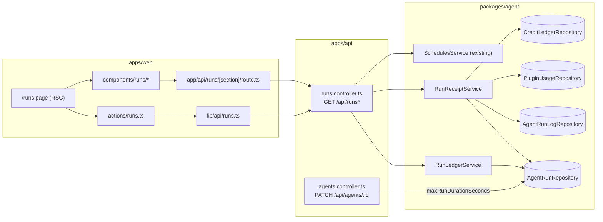

# AW-09 — Runs and receipts · Implementation plan

> Translates [spec.md](./spec.md) into architecture, data model and phasing.
> The plan owns implementation detail; the spec owns behaviour.

**Epic ID:** `AW-09-runs-receipts`
**Spec:** [`./spec.md`](./spec.md) · **Tasks:** [`./tasks.md`](./tasks.md)
**Status:** `Draft`
**Last updated:** 2026-09-06

---

## 1. Current state in the codebase

Everything in this section was read in the working tree before being written down. Paths are
repo-relative and each one exists today.

### 1.1 The Run record and its history

| What exists                             | Where                                                                                                                                                                                                                                                                                                                                                                                                        | What it already gives us                                                                                                                                                                                                                                                                                                                                                                                                                                                                                                                                                                                             |
| --------------------------------------- | ------------------------------------------------------------------------------------------------------------------------------------------------------------------------------------------------------------------------------------------------------------------------------------------------------------------------------------------------------------------------------------------------------------ | -------------------------------------------------------------------------------------------------------------------------------------------------------------------------------------------------------------------------------------------------------------------------------------------------------------------------------------------------------------------------------------------------------------------------------------------------------------------------------------------------------------------------------------------------------------------------------------------------------------------- |
| `AgentRun` entity (`agent_runs`)        | [`packages/agent/src/entities/agent-run.entity.ts`](../../../../../packages/agent/src/entities/agent-run.entity.ts)                                                                                                                                                                                                                                                                                          | `agentId`, `userId`, `triggerKind` (`heartbeat \| manual \| task \| chat \| event`), `status` (`queued \| running \| completed \| failed \| cancelled`), `startedAt`, `finishedAt`, `durationMs`, `errorMessage`, `summary`, `taskId`, `chatMessageId`, `workId`, `totalTokens`, `costCents`, `changedFilesCount`, `currentActivity`, `runnerKind`, `workspaceMeta.filesTouched`, `awaitingInput`, `queuedReason`, `attentionReason`, gate fields, `tenantId`/`organizationId`. Indexes include `idx_agent_runs_user_created` on `(userId, createdAt)` and `idx_agent_runs_agent_started` on `(agentId, startedAt)`. |
| `AgentRunLog` entity (`agent_run_logs`) | [`packages/agent/src/entities/agent-run-log.entity.ts`](../../../../../packages/agent/src/entities/agent-run-log.entity.ts)                                                                                                                                                                                                                                                                                  | Per-run structured rows: `level`, `step`, `message`, `metadata`. The timeline the receipt renders is stored here.                                                                                                                                                                                                                                                                                                                                                                                                                                                                                                    |
| Timeline capture                        | [`packages/agent/src/agents/run-capture.ts`](../../../../../packages/agent/src/agents/run-capture.ts)                                                                                                                                                                                                                                                                                                        | Writes `assistant-message`, `user-message`, `tool-invocation` and `capture-truncated` rows. Constants already fixed: `CAPTURE_PREVIEW_MAX_CHARS = 4096`, `CAPTURE_MESSAGE_MAX_CHARS = 8192`, `CAPTURE_MAX_ENTRIES = 200`, `FILES_TOUCHED_CAP = 200`.                                                                                                                                                                                                                                                                                                                                                                 |
| Run execution loop                      | [`packages/agent/src/agents/agent-run.service.ts`](../../../../../packages/agent/src/agents/agent-run.service.ts)                                                                                                                                                                                                                                                                                            | Per model round-trip it folds `round.usage.totalTokens` into `agent_runs.totalTokens` and writes an `INFO` `ai-dispatch` run-log row whose `metadata` carries `model`, `promptTokens`, `completionTokens`, `totalTokens`. **The split is in free-form metadata only; nothing durable holds it, and no cache figure is captured anywhere.** Skill resolution happens in the same service (`resolveSkillsForRun`, `selectSkillsWithinBudget`) and only surfaces as `WARN` `skills` / `prompt-assembly` log rows.                                                                                                       |
| Sessions list endpoint                  | [`apps/api/src/agents/agents.controller.ts`](../../../../../apps/api/src/agents/agents.controller.ts) `GET /api/agents/runs` (declared before the `:id` routes so the literal `runs` segment never hits `ParseUUIDPipe`)                                                                                                                                                                                     | Owner-scoped list with `status`/`workId`/`agentId`/`taskId`/`kind`/`attention` filters and offset paging. **No date range.**                                                                                                                                                                                                                                                                                                                                                                                                                                                                                         |
| Session detail endpoint                 | same file, `GET /api/agents/runs/:runId/detail`                                                                                                                                                                                                                                                                                                                                                              | Run projection + `counts` + `filesTouched` + a cursor-paged timeline built from `SESSION_TIMELINE_STEPS`.                                                                                                                                                                                                                                                                                                                                                                                                                                                                                                            |
| Repositories                            | [`agent-run.repository.ts`](../../../../../packages/agent/src/database/repositories/agent-run.repository.ts), [`agent-run-log.repository.ts`](../../../../../packages/agent/src/database/repositories/agent-run-log.repository.ts)                                                                                                                                                                           | `listSessionsForUser`, `findTimelineByRun`, `countByRunSteps`.                                                                                                                                                                                                                                                                                                                                                                                                                                                                                                                                                       |
| Web surfaces                            | [`apps/web/src/app/[locale]/(dashboard)/agents/sessions/page.tsx`](<../../../../../apps/web/src/app/[locale]/(dashboard)/agents/sessions/page.tsx>), [`.../sessions/[runId]/page.tsx`](<../../../../../apps/web/src/app/[locale]/(dashboard)/agents/sessions/[runId]/page.tsx>), [`.../agents/[id]/activity/page.tsx`](<../../../../../apps/web/src/app/[locale]/(dashboard)/agents/[id]/activity/page.tsx>) | Flat, undated session list; run detail with steering; per-Agent interleaved run+event timeline.                                                                                                                                                                                                                                                                                                                                                                                                                                                                                                                      |
| Client types                            | [`apps/web/src/lib/api/agents.shared.ts`](../../../../../apps/web/src/lib/api/agents.shared.ts)                                                                                                                                                                                                                                                                                                              | `AgentRunSession`, `AgentRunSessionDetail`, `AgentRunTimelineEntry`, `timelineEntryCursor`.                                                                                                                                                                                                                                                                                                                                                                                                                                                                                                                          |

### 1.2 Cost and metering

| What exists                                | Where                                                                                                                                                                                                                              | Note                                                                                                                                                                                                                                                                                                                             |
| ------------------------------------------ | ---------------------------------------------------------------------------------------------------------------------------------------------------------------------------------------------------------------------------------- | -------------------------------------------------------------------------------------------------------------------------------------------------------------------------------------------------------------------------------------------------------------------------------------------------------------------------------- |
| `PluginUsageEvent` (`plugin_usage_events`) | [`packages/agent/src/entities/plugin-usage-event.entity.ts`](../../../../../packages/agent/src/entities/plugin-usage-event.entity.ts)                                                                                              | One row per metered provider call. Carries `capability`, `pluginId`, `units`, `costCents`, `modelId`, `metadata`, and attribution `agentId`/`taskId`/`runId`/`ownerType`/`ownerId`, with an index on `(runId, occurredAt)`. **No token-split columns.**                                                                          |
| Usage writer                               | [`packages/agent/src/usage/plugin-usage.service.ts`](../../../../../packages/agent/src/usage/plugin-usage.service.ts)                                                                                                              | `record(input)` — the single write path.                                                                                                                                                                                                                                                                                         |
| AI facade                                  | [`packages/agent/src/facades/ai.facade.ts`](../../../../../packages/agent/src/facades/ai.facade.ts)                                                                                                                                | Calls `pluginUsageService.record({ units: usage.totalTokens, modelId: response.model, metadata: { promptTokens, completionTokens } })`. This is the seam where the split becomes columns.                                                                                                                                        |
| Provider token tracker                     | [`packages/plugin/src/ai/token-usage.tracker.ts`](../../../../../packages/plugin/src/ai/token-usage.tracker.ts)                                                                                                                    | `TokenUsage { inputTokens, outputTokens, totalTokens }` only. Reads a tolerant set of provider field names. **Nothing reads cache fields.**                                                                                                                                                                                      |
| Token mapping                              | [`packages/plugin/src/ai/ai-operations.ts`](../../../../../packages/plugin/src/ai/ai-operations.ts) `mapTokenUsage`                                                                                                                | Maps the tracker to `{ promptTokens, completionTokens, totalTokens }`.                                                                                                                                                                                                                                                           |
| Dispatch shape                             | [`packages/agent/src/agents/agent-ai-dispatch-facade.ts`](../../../../../packages/agent/src/agents/agent-ai-dispatch-facade.ts)                                                                                                    | `usage?: { promptTokens; completionTokens; totalTokens }`.                                                                                                                                                                                                                                                                       |
| Settlement                                 | [`packages/agent/src/subscriptions/credits/run-cost-settlement.service.ts`](../../../../../packages/agent/src/subscriptions/credits/run-cost-settlement.service.ts)                                                                | On terminal transition, sums the run's usage events, stamps `agent_runs.costCents`, and writes one `CONSUMPTION` credit-ledger row keyed `run:{runId}`.                                                                                                                                                                          |
| Cost dashboard                             | [`apps/api/src/subscriptions/costs.controller.ts`](../../../../../apps/api/src/subscriptions/costs.controller.ts) + [`costs-summary.service.ts`](../../../../../packages/agent/src/subscriptions/credits/costs-summary.service.ts) | `summary`/`daily`/`by-agent`/`by-model`/`top-runs` over a rolling 7/30/90-day window. The `by-agent` endpoint's own description states there is no cache-hit column _"because the metering path does not record cached-read tokens, and a derived percentage would be fabricated"_ — this epic is what makes that column honest. |
| Credit ledger                              | [`packages/agent/src/database/repositories/credit-ledger.repository.ts`](../../../../../packages/agent/src/database/repositories/credit-ledger.repository.ts)                                                                      | Movements correlate to a run via `refType`/`refId`.                                                                                                                                                                                                                                                                              |
| Retention                                  | [`apps/api/src/budgets/plugin-usage-cleanup.service.ts`](../../../../../apps/api/src/budgets/plugin-usage-cleanup.service.ts)                                                                                                      | Prunes `plugin_usage_events` older than 12 months. `agent_runs` is not pruned — hence spec §4.5 FR-36.                                                                                                                                                                                                                           |

### 1.3 Schedules (the Upcoming panel's source)

The unified schedule projection already shipped and needs no change:

- [`packages/agent/src/schedules/schedules.service.ts`](../../../../../packages/agent/src/schedules/schedules.service.ts) — `getSchedules(...)` unions recurring Tasks, Agent heartbeats, Work schedules, Mission ticks, source-validation, data-sync and inbound triggers.
- [`packages/agent/src/schedules/schedule-view.types.ts`](../../../../../packages/agent/src/schedules/schedule-view.types.ts) — `ScheduleView` with `id` (`${sourceType}:${ownerId}`), `ownerName`, `ownerLink`, `cadenceHuman`, `nextRunAt`, `status`, `enabled`.
- [`apps/api/src/schedules/schedules.controller.ts`](../../../../../apps/api/src/schedules/schedules.controller.ts) — `GET /api/schedules`.

### 1.4 The run time limit

| What exists           | Where                                                                                                                                                                                                                                                                         | Value                                                                    |
| --------------------- | ----------------------------------------------------------------------------------------------------------------------------------------------------------------------------------------------------------------------------------------------------------------------------- | ------------------------------------------------------------------------ |
| Instance-wide ceiling | [`packages/agent/src/config/index.ts`](../../../../../packages/agent/src/config/index.ts) `agents.getMaxRunDurationSeconds()`                                                                                                                                                 | `AGENT_MAX_RUN_DURATION_SECONDS`, default **1800**.                      |
| Applied to heartbeats | [`packages/tasks/src/tasks/trigger/agent-heartbeat.task.ts`](../../../../../packages/tasks/src/tasks/trigger/agent-heartbeat.task.ts)                                                                                                                                         | `maxDuration: config.agents.getMaxRunDurationSeconds()`.                 |
| Applied to task runs  | [`packages/tasks/src/tasks/trigger/agent-task-execute.task.ts`](../../../../../packages/tasks/src/tasks/trigger/agent-task-execute.task.ts)                                                                                                                                   | Pinned `maxDuration: 3600`.                                              |
| Stale reaper          | [`packages/agent/src/agents/agent-run-sweeper.service.ts`](../../../../../packages/agent/src/agents/agent-run-sweeper.service.ts) + [`packages/tasks/src/tasks/trigger/agent-run-sweeper.task.ts`](../../../../../packages/tasks/src/tasks/trigger/agent-run-sweeper.task.ts) | Cron `23 */2 * * *`; sweep age derived from the ceiling with a 3× floor. |
| Per-Agent override    | **does not exist** — [`packages/agent/src/entities/agent.entity.ts`](../../../../../packages/agent/src/entities/agent.entity.ts) has no duration column.                                                                                                                      | This is what "Raise the time limit" writes.                              |

### 1.5 Web shell the new page hangs off

- Dashboard group: `apps/web/src/app/[locale]/(dashboard)/` with [`layout.tsx`](<../../../../../apps/web/src/app/[locale]/(dashboard)/layout.tsx>).
- Sidebar: [`apps/web/src/components/dashboard/DashboardSidebar.tsx`](../../../../../apps/web/src/components/dashboard/DashboardSidebar.tsx) (entries built from `ROUTES` + `t('navigation.*')`).
- Routes: [`apps/web/src/lib/constants.ts`](../../../../../apps/web/src/lib/constants.ts) (`DASHBOARD_AGENT_SESSIONS`, `DASHBOARD_ACTIVITY`, …).
- BFF proxy patterns to copy: [`apps/web/src/app/api/usage/costs/[section]/route.ts`](../../../../../apps/web/src/app/api/usage/costs/[section]/route.ts) (closed section allowlist) and [`apps/web/src/app/api/credits/usage/export/route.ts`](../../../../../apps/web/src/app/api/credits/usage/export/route.ts) (streams `response.body`, never buffers).
- Server-action + typed-client pattern: [`apps/web/src/app/actions/activity-log.ts`](../../../../../apps/web/src/app/actions/activity-log.ts) + [`apps/web/src/lib/api/activity-log.ts`](../../../../../apps/web/src/lib/api/activity-log.ts).

### 1.6 Summary of the delta

Nothing in the data path has to be rebuilt. Three things are genuinely missing and this plan adds
exactly those, plus one new read surface:

1. **A window-shaped read model** over `agent_runs` (list, aggregates, per-day calendar counts).
2. **Durable per-run telemetry** — the token split including cache, the models used, the Skills
   loaded/dropped/suppressed, the tool-call count, the classified failure reason and the time
   limit that was in force.
3. **A per-Agent run time limit** so the failure remediation has something to write.

---

## 2. Architecture and the seam it plugs into



**Seams used, not invented:**

- **Read model in the agent package, controller in the API.** The same split the Costs dashboard
  uses (`CostsSummaryService` in `packages/agent`, thin controller in `apps/api`), so the MCP
  server and CLI can consume the ledger later without a second implementation.
- **Existing repositories only.** No raw cross-table SQL and no new TypeORM data source. Scope
  filters stay inside the repositories where they already are.
- **The Schedules projection is consumed, not reimplemented.** `GET /api/runs/upcoming` is a thin
  projection over `SchedulesService.getSchedules(...)` — the Upcoming panel and the
  Activity → Schedules tab can never disagree because there is one producer.
- **Metering stays at the facade.** Token columns are populated where usage is already recorded
  ([`ai.facade.ts`](../../../../../packages/agent/src/facades/ai.facade.ts)); no call site changes.
- **Remediation reuses an existing endpoint.** `PATCH /api/agents/:id` gains one optional field.
  No new write surface, no new authorization logic, no new IDOR risk.

**What deliberately does not move:** `GET /api/agents/runs`, `GET /api/agents/runs/:runId/detail`,
the Sessions pages, the per-Agent Activity tab and the Costs dashboard all keep their exact
current behaviour. `SessionDetailClient` is not rewritten; its timeline renderer is extracted so
the receipt can reuse it (see §5.3).

---

## 3. Data model

Two additive, forward-only migrations. Every column is nullable, so no backfill is required and
no existing row changes meaning. `down()` drops only what the matching `up()` added.

### 3.1 Entity changes

**[`packages/agent/src/entities/agent-run.entity.ts`](../../../../../packages/agent/src/entities/agent-run.entity.ts)** — additive columns and two new exported types:

```ts
/** Classified cause of a failed run. Closed set; `unknown` is the honest default. */
export type RunFailureCode =
    | 'timeout'
    | 'provider-error'
    | 'tool-error'
    | 'budget-stop'
    | 'credits-exhausted'
    | 'guardrail-refusal'
    | 'cancelled-by-user'
    | 'swept-stale'
    | 'unknown';

/** One Skill the run resolved, and what happened to it. */
export interface RunSkillUse {
    skillId: string;
    slug: string;
    priority: number;
    state: 'loaded' | 'dropped' | 'suppressed';
    /** Machine reason for `dropped` / `suppressed`; null when loaded. */
    reason: 'skill-budget' | 'tool-grant' | null;
    /** Estimated tokens the Skill body contributed; null when not measured. */
    tokens: number | null;
}

// ── Migration A (P2) ───────────────────────────────────────────────
@Column({ type: 'int', nullable: true }) inputTokens?: number | null;
@Column({ type: 'int', nullable: true }) outputTokens?: number | null;
@Column({ type: 'int', nullable: true }) cacheReadTokens?: number | null;
@Column({ type: 'int', nullable: true }) cacheWriteTokens?: number | null;
/** Every model id this run used, in first-use order. */
@Column({ type: 'simple-json', nullable: true }) modelIds?: string[] | null;
/** The model that carried the most tokens — what the row's MODEL column shows. */
@Column({ type: 'varchar', length: 128, nullable: true }) primaryModelId?: string | null;
@Column({ type: 'simple-json', nullable: true }) skillsUsed?: RunSkillUse[] | null;
@Column({ type: 'int', nullable: true }) toolCallCount?: number | null;
/** Credits actually debited for this run; null = never settled. */
@Column({ type: 'int', nullable: true }) creditsDebited?: number | null;

// ── Migration B (P3) ───────────────────────────────────────────────
@Column({ type: 'varchar', length: 24, nullable: true }) failureCode?: RunFailureCode | null;
/** The run-duration ceiling in force when this run started, in seconds. */
@Column({ type: 'int', nullable: true }) effectiveTimeoutSeconds?: number | null;
```

New index (Migration A): `idx_agent_runs_user_started` on `(userId, startedAt)` — the ledger's
primary access path is "my runs between two instants". The existing
`idx_agent_runs_user_created` on `(userId, createdAt)` stays and serves the queued-but-never-started
tail.

**[`packages/agent/src/entities/plugin-usage-event.entity.ts`](../../../../../packages/agent/src/entities/plugin-usage-event.entity.ts)** — Migration A:

```ts
@Column({ type: 'int', nullable: true }) inputTokens?: number | null;
@Column({ type: 'int', nullable: true }) outputTokens?: number | null;
@Column({ type: 'int', nullable: true }) cacheReadTokens?: number | null;
@Column({ type: 'int', nullable: true }) cacheWriteTokens?: number | null;
```

`units` keeps its current meaning (total tokens for AI rows, call count elsewhere) — Principle X.
The new columns are the itemisation, not a replacement.

**[`packages/agent/src/entities/agent.entity.ts`](../../../../../packages/agent/src/entities/agent.entity.ts)** — Migration B:

```ts
/**
 * Per-Agent run-duration ceiling in seconds. `null` = inherit the
 * deployment default (`AGENT_MAX_RUN_DURATION_SECONDS`, 1800).
 * Range enforced at the DTO: 60 … 14400.
 */
@Column({ type: 'int', nullable: true }) maxRunDurationSeconds?: number | null;
```

**`AgentRunTriggerKind`** gains one union member, `'email'`, reserved for AW-05's inbound-mail
runs. The column is already `varchar(16)`, so this is a TypeScript-only change with **no
migration**. No row carries it until AW-05 writes one; the trigger filter hides values with a
zero count in the window.

### 3.2 Migrations

Both live in [`apps/api/src/migrations/`](../../../../../apps/api/src/migrations) (timestamp-prefixed,
stamped from AW-09's reserved block — [README §5 rule 10](../README.md#5-rules-every-epic-spec-in-this-program-must-follow) — and re-stamped before merge if `develop` has moved past them). Per Constitution V they
ship in the **same PR** as the entity change.

| File                                                                    | Phase | Contents                                                                                                                                                                                                                                                                                                                                                                    |
| ----------------------------------------------------------------------- | ----- | --------------------------------------------------------------------------------------------------------------------------------------------------------------------------------------------------------------------------------------------------------------------------------------------------------------------------------------------------------------------------- |
| `apps/api/src/migrations/1791090000000-AddRunReceiptTelemetry.ts`       | P2    | `ALTER TABLE agent_runs` add `inputTokens`, `outputTokens`, `cacheReadTokens`, `cacheWriteTokens`, `modelIds`, `primaryModelId`, `skillsUsed`, `toolCallCount`, `creditsDebited`; `CREATE INDEX idx_agent_runs_user_started ON agent_runs (userId, startedAt)`; `ALTER TABLE plugin_usage_events` add `inputTokens`, `outputTokens`, `cacheReadTokens`, `cacheWriteTokens`. |
| `apps/api/src/migrations/1791090100000-AddAgentRunFailureAndTimeout.ts` | P3    | `ALTER TABLE agent_runs` add `failureCode`, `effectiveTimeoutSeconds`; `ALTER TABLE agents` add `maxRunDurationSeconds`.                                                                                                                                                                                                                                                    |

Generation command from `apps/api/`:
`pnpm typeorm migration:generate -d typeorm.config.ts src/migrations/AddRunReceiptTelemetry`,
then rename the generated file to the timestamp above and verify the SQL is additive only —
no `DROP COLUMN`, no `NOT NULL` without a default, no type narrowing.

**No new tables.** The receipt and the upcoming fire are read-time projections (spec §5).

### 3.3 Contracts

New folder `packages/contracts/src/runs/` with `run-ledger.types.ts` and `index.ts`, re-exported
from [`packages/contracts/src/index.ts`](../../../../../packages/contracts/src/index.ts) alongside
`./agents/index.js`. The root export already exists, so `package.json` `exports` needs no change.

```ts
export type RunLedgerGranularity = 'day' | 'week' | 'month';

export interface RunLedgerWindow {
	granularity: RunLedgerGranularity;
	/** Inclusive start, ISO 8601 with offset, resolved in the caller's timezone. */
	from: string;
	/** Exclusive end. */
	to: string;
	timezone: string;
	/** True when the requested window was clamped to the 12-month reach. */
	clamped: boolean;
}

export interface RunLedgerRow {
	id: string;
	agentId: string;
	agentName: string;
	agentArchived: boolean;
	triggerKind: AgentRunTriggerKind;
	status: AgentRunStatus;
	failureCode: RunFailureCode | null;
	startedAt: string | null;
	createdAt: string;
	finishedAt: string | null;
	durationMs: number | null;
	primaryModelId: string | null;
	modelCount: number;
	costCents: number | null;
	creditsDebited: number | null;
	totalTokens: number | null;
	summary: string | null;
	errorMessage: string | null;
	currentActivity: string | null;
	missionId: string | null;
	missionTitle: string | null;
	taskId: string | null;
	workId: string | null;
	/** `${sourceType}:${ownerId}` when the run came from a schedule, else null. */
	scheduleKey: string | null;
	attentionReason: string | null;
	awaitingInput: boolean;
}

export interface RunLedgerPage {
	window: RunLedgerWindow;
	rows: RunLedgerRow[];
	/** Opaque `<epochMillis>_<uuid>`; null = last page. */
	nextCursor: string | null;
	total: number;
	limit: number;
}

export interface RunWindowStats {
	window: RunLedgerWindow;
	total: number;
	byStatus: Record<AgentRunStatus, number>;
	/** completed / terminal, 0–100 with one decimal; null when terminal = 0. */
	successRate: number | null;
	errorCount: number;
	totalDurationMs: number;
	costCents: number;
	creditsDebited: number;
	tokens: RunTokenSplit;
	byTrigger: Record<string, number>;
	/** Schedules with >= 2 failures in the window (spec FR-43). */
	repeatFailures: Array<{ scheduleKey: string; ownerName: string; ownerLink: string; failures: number }>;
}

export interface RunTokenSplit {
	input: number | null;
	output: number | null;
	cacheRead: number | null;
	cacheWrite: number | null;
	total: number | null;
}

export interface RunCalendarDay {
	/** `YYYY-MM-DD` in the caller's timezone. */
	date: string;
	runs: number;
	failures: number;
}

export interface RunCostBreakdown {
	totalCents: number | null;
	currency: string;
	creditsDebited: number | null;
	/** False once the run's usage rows have aged past the 12-month prune. */
	detailRetained: boolean;
	tokens: RunTokenSplit;
	byModel: Array<{ modelId: string | null; costCents: number; tokens: RunTokenSplit }>;
	byCapability: Array<{ capability: string; calls: number; costCents: number }>;
	/** True when every provider call resolved a user-owned key (no platform charge). */
	byoKeyOnly: boolean;
}

export interface RunReceipt {
	row: RunLedgerRow;
	cost: RunCostBreakdown;
	skills: RunSkillUse[];
	failure: {
		code: RunFailureCode;
		message: string;
		effectiveTimeoutSeconds: number | null;
		timeoutSource: 'agent' | 'default' | null;
	} | null;
	filesTouched: string[];
	counts: { messages: number; toolCalls: number; filesTouched: number };
	related: {
		missionId: string | null;
		missionTitle: string | null;
		taskId: string | null;
		taskTitle: string | null;
		workId: string | null;
		workName: string | null;
		scheduleKey: string | null;
		scheduleLink: string | null;
	};
	/** Reuses the existing timeline shape — not a second definition. */
	timeline: { entries: AgentRunTimelineEntry[]; nextCursor: string | null; limit: number; captureTruncated: boolean };
}

export interface UpcomingFire {
	/** The ScheduleView id — `${sourceType}:${ownerId}`. Not a run id. */
	scheduleKey: string;
	ownerName: string;
	ownerLink: string;
	cadenceHuman: string;
	nextRunAt: string;
	agentId: string | null;
}
```

`AgentRunTimelineEntry` is imported from the existing agents contract rather than redeclared —
one definition, per program rule 2.

---

## 4. API

New module `apps/api/src/runs/` — `runs.module.ts`, `runs.controller.ts`, `dto/run-ledger.dto.ts`.
Registered in [`apps/api/src/api.module.ts`](../../../../../apps/api/src/api.module.ts). It imports
the agent package's `AgentsModule` (for the ledger/receipt services), `SchedulesModule` and
`SubscriptionsModule`.

All endpoints: `@ApiTags('Runs')`, `@ApiBearerAuth('JWT-auth')`, `@UseGuards(AuthSessionGuard)`,
`@CurrentUser()`. **No endpoint accepts a user, tenant or Organization id** — Organization scope
comes from `ScopeContextService` / the `X-Scope-Slug` header, exactly as the Costs controller does
and for the same reason.

Route order in the controller: the literal segments `stats`, `calendar`, `upcoming` and `export`
are declared **before** `:runId`, so the literal never reaches `ParseUUIDPipe` — the same guard
comment that exists on `GET /api/agents/runs` today.

| #   | Method  | Path                                                   | Auth    | Throttle                | Phase |
| --- | ------- | ------------------------------------------------------ | ------- | ----------------------- | ----- |
| 1   | `GET`   | `/api/runs`                                            | session | `long: 120/60s`         | P1    |
| 2   | `GET`   | `/api/runs/stats`                                      | session | `long: 120/60s`         | P1    |
| 3   | `GET`   | `/api/runs/calendar`                                   | session | `long: 60/60s`          | P1    |
| 4   | `GET`   | `/api/runs/export`                                     | session | `long: 10/60s`          | P2    |
| 5   | `GET`   | `/api/runs/upcoming`                                   | session | `long: 60/60s`          | P3    |
| 6   | `GET`   | `/api/runs/:runId/receipt`                             | session | `long: 120/60s`         | P1    |
| 7   | `PATCH` | `/api/agents/:id` _(existing, one new optional field)_ | session | existing `long: 30/60s` | P3    |

### 4.1 `GET /api/runs` — the ledger page

`ListRunsQueryDto` (class-validator, all optional except the window pair):

| Field                 | Rules                                                                                                                                                                                                                                     |
| --------------------- | ----------------------------------------------------------------------------------------------------------------------------------------------------------------------------------------------------------------------------------------- |
| `from`, `to`          | `@IsISO8601()`. Both required together. `to - from` ≤ **93 days**; `from` ≥ now − 12 months; `to` ≤ now + 7 days. Violations → `400 { code: 'runs.windowOutOfRange' }`.                                                                   |
| `granularity`         | `@IsIn(['day','week','month'])`, default `day`. Echoed back for the client's labelling; the server trusts `from`/`to`.                                                                                                                    |
| `timezone`            | `@IsString()` validated against `Intl.supportedValuesOf('timeZone')` plus explicit `UTC`/`GMT` (the same allowance the notification quiet-hours DTO makes for a documented V8 quirk). Default: the caller's profile timezone, then `UTC`. |
| `agentId`             | `@IsUUID('4', { each: true })`, max **20** values.                                                                                                                                                                                        |
| `kind`                | `@IsIn(TRIGGER_KINDS, { each: true })`.                                                                                                                                                                                                   |
| `status`              | `@IsIn(RUN_STATUSES, { each: true })`.                                                                                                                                                                                                    |
| `failureCode`         | `@IsIn(FAILURE_CODES, { each: true })`.                                                                                                                                                                                                   |
| `missionId`, `workId` | `@IsUUID('4')`.                                                                                                                                                                                                                           |
| `modelId`             | `@IsString() @MaxLength(128)`.                                                                                                                                                                                                            |
| `q`                   | `@IsString() @MinLength(2) @MaxLength(200)`.                                                                                                                                                                                              |
| `limit`               | `@Type(() => Number) @IsInt() @Min(1) @Max(200)`, default **50**.                                                                                                                                                                         |
| `cursor`              | `@IsString() @MaxLength(128)` — opaque `<epochMillis>_<uuid>`, the same shape the session timeline already uses.                                                                                                                          |

`@Type(() => Number)` before `@IsInt()` on every numeric query field — without it a query string's
`'50'` never satisfies the numeric validator (the trap already documented on the Costs DTO).

Response: `RunLedgerPage`. Errors: `400` invalid window / bad filter, `401` unauthenticated.

### 4.2 `GET /api/runs/stats`

Same query DTO minus `limit`/`cursor`. Response: `RunWindowStats`. `repeatFailures` is computed in
the same pass: group the window's failed rows by derived `scheduleKey`, keep groups of **≥ 2**.

### 4.3 `GET /api/runs/calendar`

`RunCalendarQueryDto`: `month` (`@Matches(/^\d{4}-\d{2}$/)`), `timezone`, plus the same filter
fields. Response `{ month, timezone, days: RunCalendarDay[] }` — one entry per day that has at
least one run. Backs the mini-calendar's two markers.

### 4.4 `GET /api/runs/export`

Same query DTO as stats plus `format` (`@IsIn(['csv'])`, default `csv`). The controller asks the
service for a count first; over **50,000** rows or a window over **92 days** it returns
`400 { code: 'runs.exportTooLarge', limit, actual }` **before** any query streams. On success it
sets `Content-Type: text/csv; charset=utf-8` and
`Content-Disposition: attachment; filename="runs-<from>-<to>.csv"` and streams row batches of
1,000, mirroring the credits export which pipes rather than buffering.

Columns: `runId, startedAt, finishedAt, durationMs, agentName, triggerKind, status, failureCode,
primaryModelId, inputTokens, outputTokens, cacheReadTokens, totalTokens, costCents, creditsDebited,
missionTitle, taskId, workId, summary`. `summary` is CSV-escaped and truncated to 500 characters.

### 4.5 `GET /api/runs/upcoming`

`UpcomingFiresQueryDto`: `horizonDays` (`@IsInt() @Min(1) @Max(7)`, default **7**), `limit`
(`@IsInt() @Min(1) @Max(50)`, default **20**). The controller calls
`SchedulesService.getSchedules(userId, scope, { enabledOnly: true })`, drops rows whose
`nextRunAt` is null or outside the horizon, sorts ascending, slices to `limit`, and maps each to
`UpcomingFire`. No new query and no second definition of "what is scheduled".

Response: `{ horizonDays, generatedAt, fires: UpcomingFire[] }`. `generatedAt` lets the client
compute countdowns against server time rather than a possibly-skewed clock.

### 4.6 `GET /api/runs/:runId/receipt`

`@Param('runId', ParseUUIDPipe)` plus `RunReceiptQueryDto` (`cursor`, `limit` ≤ 200 for the
timeline page). The service loads the run **scoped to the caller** and returns `404` for both a
missing id and a foreign id — never `403`, so the endpoint is not an existence oracle (the posture
already used by the digest and escalations controllers).

Response: `RunReceipt`. The `cost` block is populated in P2; in P1 it carries the settled
`totalCents`/`creditsDebited` with `detailRetained: false` and empty breakdowns, so the shape never
changes between phases — Principle X.

### 4.7 `PATCH /api/agents/:id` — one new optional field

[`apps/api/src/agents/dto/agent.dto.ts`](../../../../../apps/api/src/agents/dto/agent.dto.ts)'s
`UpdateAgentDto` gains:

```ts
@IsOptional()
@Type(() => Number)
@IsInt()
@Min(60)
@Max(14400)
maxRunDurationSeconds?: number | null;
```

No new endpoint, no new guard, no new ownership check. `null` clears the override back to the
deployment default. The service records the change through the existing agent-update activity-log
path (`agent_updated`) with the field name in `details` — the value is not a secret, so it is
logged in full.

---

## 5. Web

### 5.1 Routes and navigation

| Path            | File                                                          | Notes                                                                                                                                                                                                                                                                                    |
| --------------- | ------------------------------------------------------------- | ---------------------------------------------------------------------------------------------------------------------------------------------------------------------------------------------------------------------------------------------------------------------------------------- |
| `/runs`         | `apps/web/src/app/[locale]/(dashboard)/runs/page.tsx`         | RSC shell. Reads `searchParams` for granularity / anchor date / filters, resolves the caller's timezone, does the first `getRuns` + `getRunStats` fetch with `Promise.allSettled` so one failure cannot 500 the page, and hands both to the client component with their own error flags. |
| `/runs/[runId]` | `apps/web/src/app/[locale]/(dashboard)/runs/[runId]/page.tsx` | Standalone receipt for deep links, refresh and sharing. `notFound()` when the receipt read 404s.                                                                                                                                                                                         |

`ROUTES` additions in [`apps/web/src/lib/constants.ts`](../../../../../apps/web/src/lib/constants.ts):
`DASHBOARD_RUNS: '/runs'` and `DASHBOARD_RUN: (runId: string) => '/runs/' + runId`.

Sidebar entry in [`DashboardSidebar.tsx`](../../../../../apps/web/src/components/dashboard/DashboardSidebar.tsx):
`{ name: t('navigation.runs'), href: ROUTES.DASHBOARD_RUNS, icon: Receipt }` placed directly above
the existing Activity entry — Runs answers "what did my agents do", Activity answers "what changed
in my workspace", and adjacency makes the distinction learnable.

Cross-links added (all additive, nothing removed):

- Sessions list gains a header link **"Open in Runs"** → `/runs?agentId=…`.
- Session detail gains **"Open receipt"** → `/runs/{runId}`.
- Per-Agent Activity tab gains **"See this agent in Runs"**.
- The Costs dashboard's _Top runs_ rows link to `/runs/{runId}` instead of dead-ending.

### 5.2 Components

All new, under `apps/web/src/components/runs/`:

| File                           | Responsibility                                                                                                                                                                                                                                              |
| ------------------------------ | ----------------------------------------------------------------------------------------------------------------------------------------------------------------------------------------------------------------------------------------------------------- |
| `RunsClient.tsx`               | `'use client'` shell. Owns granularity, anchor date, filters, focused row, open receipt id. Mirrors all of it into the URL with `router.replace` (the pattern already used by the activity client). Owns the 5 s conditional poll and the keyboard handler. |
| `RunsCalendarBar.tsx`          | Day/Week/Month segmented control, Previous/Next, Today, the timezone line, and the mini-calendar trigger.                                                                                                                                                   |
| `RunsMiniCalendar.tsx`         | Month grid fed by `GET /api/runs/calendar`; two marker shapes; 12-month reach; announces the reach in text.                                                                                                                                                 |
| `RunsFilters.tsx`              | Agent / trigger / outcome / Mission / Work / model multi-selects, the search box, the active-count chip and **Clear filters**.                                                                                                                              |
| `RunsTable.tsx` + `RunRow.tsx` | The list. `<table>` with a caption naming window and filters; one row per run; live elapsed timer for `running`; the `⚙` schedule jump; roving `j`/`k` focus.                                                                                               |
| `RunsRail.tsx`                 | Window aggregates, each a filter shortcut; explicit scope wording; independent loading and error state.                                                                                                                                                     |
| `UpcomingFiresPanel.tsx`       | Upcoming list, 1 s countdown tick via one shared interval, paused on `document.hidden`, 60 s refetch and refetch on focus.                                                                                                                                  |
| `RunReceiptPanel.tsx`          | The drawer. Composes the blocks below; focus-trapped dialog; `Esc` closes and returns focus.                                                                                                                                                                |
| `RunReceiptCost.tsx`           | Cost, credits, token split, per-model and per-capability tables, the retention notice, the "so far" labelling.                                                                                                                                              |
| `RunReceiptSkills.tsx`         | Loaded / dropped / suppressed Skills with reasons and links.                                                                                                                                                                                                |
| `RunReceiptFailure.tsx`        | Classified reason, exact error, and the **Raise the time limit** flow.                                                                                                                                                                                      |
| `RaiseTimeLimitDialog.tsx`     | Re-reads the Agent's current limit, proposes the next ladder value, confirms, calls the server action, toasts, and handles the already-raised and at-ceiling cases.                                                                                         |
| `RepeatFailureBanner.tsx`      | The `≥ 2 failures from one schedule` banner; dismissal held in `sessionStorage`.                                                                                                                                                                            |
| `RunsEmptyState.tsx`           | The three empty variants (no runs ever / nothing this day / no filter matches).                                                                                                                                                                             |
| `RunsShortcutSheet.tsx`        | The `?` overlay.                                                                                                                                                                                                                                            |
| `runs.shared.ts`               | Client-safe mirrors of the contract types plus `runRowCursor()`, `formatTokenSplit()`, `nextTimeLimitStep()`. Pure, unit-tested, importable from client components.                                                                                         |

**Reuse, not reimplementation:** the timeline renderer inside
[`SessionDetailClient.tsx`](../../../../../apps/web/src/components/agents/SessionDetailClient.tsx)
is extracted unchanged into `apps/web/src/components/agents/RunTimeline.tsx` and imported by both
the session detail page and `RunReceiptPanel`. `SessionDetailClient` keeps its public behaviour;
its existing unit spec must stay green as the definition of "unchanged".

### 5.3 Data fetching

- **Server**: `apps/web/src/app/actions/runs.ts` (`getRuns`, `getRunStats`, `getRunCalendar`,
  `getRunReceipt`, `getUpcomingFires`, `raiseAgentTimeLimit`) → `apps/web/src/lib/api/runs.ts`
  (`server-only`, `serverFetch`, forwards `X-Scope-Slug`).
- **Client refetch** (window stepping, filter changes, the poll): `apps/web/src/app/api/runs/[section]/route.ts`,
  a thin cookie→Bearer proxy with a **closed section allowlist** (`list`, `stats`, `calendar`,
  `upcoming`, `receipt`) and an **explicit query-param allowlist** — never the raw query string,
  matching the documented posture of the credits and costs proxies.
- **CSV**: `apps/web/src/app/api/runs/export/route.ts` pipes `response.body` straight through
  (the static `export` segment resolves ahead of the sibling `[section]`).

### 5.4 State rules

- Granularity persists in `localStorage` under `runs-granularity`; the anchor date does not.
- Every other piece of view state lives in the URL: `?g=day&d=2026-09-08&agent=…&kind=…&status=…&q=…&run=…`.
- Polling starts only when `windowIncludesNow && rows.some(r => r.status === 'queued' || r.status === 'running')`,
  and stops on `document.hidden`.
- A poll response is merged by id; scroll position, focused row and open receipt are preserved.

---

## 6. Background work

**This epic adds no new job.** Constitution IV is satisfied by not needing a dispatcher: every
number on the surface is either already stamped by the run path or computed at read time.

Two existing background paths are _extended in place_, both already scheduled through the
configured job-runtime provider:

| Existing job                                         | File                                                                                                                                                                                                                                                | Extension                                                                                                                                                                                                                                                                 | Phase |
| ---------------------------------------------------- | --------------------------------------------------------------------------------------------------------------------------------------------------------------------------------------------------------------------------------------------------- | ------------------------------------------------------------------------------------------------------------------------------------------------------------------------------------------------------------------------------------------------------------------------- | ----- |
| `agent-run-sweeper` (cron `23 */2 * * *`)            | [`packages/tasks/src/tasks/trigger/agent-run-sweeper.task.ts`](../../../../../packages/tasks/src/tasks/trigger/agent-run-sweeper.task.ts) → [`agent-run-sweeper.service.ts`](../../../../../packages/agent/src/agents/agent-run-sweeper.service.ts) | When it reaps a stale run, stamp `failureCode` — `'timeout'` when the run's elapsed time exceeded `effectiveTimeoutSeconds`, else `'swept-stale'`. Same CAS write it already performs; one extra column.                                                                  | P3    |
| `agent-heartbeat` / `agent-task-execute` `onFailure` | [`agent-heartbeat.task.ts`](../../../../../packages/tasks/src/tasks/trigger/agent-heartbeat.task.ts), [`agent-task-execute.task.ts`](../../../../../packages/tasks/src/tasks/trigger/agent-task-execute.task.ts)                                    | Classify the failure into `RunFailureCode` when marking the run failed, and stamp `effectiveTimeoutSeconds` at dispatch. Tasks are already registered with the provider; `maxDuration` becomes `agent.maxRunDurationSeconds ?? config.agents.getMaxRunDurationSeconds()`. | P3    |

Neither change imports a vendor SDK at a call site, and neither introduces a direct queue call —
the existing `*_DISPATCHER` symbols and `schedules.task()` registrations are untouched.

Settlement stays where it is: `RunCostSettlementService` already runs at the terminal transition
and gains the token/credit rollup writes (§7 below), not a new job.

---

## 7. Metering: how the token split becomes durable

Four small edits along one existing path. No new package, no new facade.

1. **[`packages/plugin/src/ai/token-usage.tracker.ts`](../../../../../packages/plugin/src/ai/token-usage.tracker.ts)** —
   extend `TokenUsage` with optional `cacheReadTokens` / `cacheWriteTokens` and read them from the
   tolerant field set the tracker already uses (`cache_read_input_tokens`,
   `cache_creation_input_tokens`, `cached_tokens`, `input_token_details.cache_read`, and their
   camelCase twins). Both stay `undefined` when a provider reports nothing — **never coerced to 0**,
   because that is the difference between "no cache" and "not measured" (spec FR-28, FR-59).
   Field-name tolerance is not a plugin id: nothing here names a provider, so Principle II holds.
2. **[`packages/plugin/src/ai/ai-operations.ts`](../../../../../packages/plugin/src/ai/ai-operations.ts)** —
   `mapTokenUsage` passes the two optional fields through.
3. **[`packages/agent/src/agents/agent-ai-dispatch-facade.ts`](../../../../../packages/agent/src/agents/agent-ai-dispatch-facade.ts)** —
   widen the `usage` shape with the same two optional fields.
4. **[`packages/agent/src/facades/ai.facade.ts`](../../../../../packages/agent/src/facades/ai.facade.ts)** —
   pass `inputTokens`/`outputTokens`/`cacheReadTokens`/`cacheWriteTokens` into
   `pluginUsageService.record(...)`, which writes them to the new `plugin_usage_events` columns.
   `metadata.promptTokens`/`completionTokens` stay written for one release cycle (Principle X)
   and are then dropped in a follow-up.

Per-run rollups:

- **While running** — [`agent-run.service.ts`](../../../../../packages/agent/src/agents/agent-run.service.ts)
  already folds each round's total into `agent_runs.totalTokens`; it additionally folds the four
  split counters, appends `round.model` to `modelIds`, and increments `toolCallCount`. Incremental,
  for the same reason the total already is: the Sessions cockpit reads these columns while the run
  is open.
- **Skills** — after `selectSkillsWithinBudget(...)` resolves, the service writes the
  `RunSkillUse[]` array to `agent_runs.skillsUsed` in one update: `loaded` for the selected set,
  `dropped` (`reason: 'skill-budget'`) for those the budget cut, `suppressed`
  (`reason: 'tool-grant'`) for those the grant filter removed. The existing `WARN` log rows stay.
- **At settlement** — [`run-cost-settlement.service.ts`](../../../../../packages/agent/src/subscriptions/credits/run-cost-settlement.service.ts)
  additionally stamps `primaryModelId` (highest token count among the run's usage rows) and
  `creditsDebited` (the amount of the `CONSUMPTION` row it writes). It already runs under the
  `run:{runId}` idempotency key, so a retried settlement cannot double-count.
- **Backfill** — none. Runs that predate the migration keep `null` in the new columns and the
  receipt renders the honest "not measured" copy. A backfill from `plugin_usage_events.metadata`
  is possible for prompt/completion but not for cache, so a half-backfill would create exactly the
  fabricated number FR-59 forbids. Explicitly not done.

---

## 8. i18n

All new user-visible strings are keys under **`dashboard.runsPage`** in
[`apps/web/messages/en.json`](../../../../../apps/web/messages/en.json), plus two keys outside it.
Leaf names are camelCase and **contain no literal `.`** — a dot in a leaf name is rejected by
`next-intl` at runtime and reds the hydration spec across every locale shard.

```
dashboard.sidebar.navigation.runs          "Runs"
metadata.pages.runs                        "Runs"

dashboard.runsPage.title                   "Runs"
dashboard.runsPage.subtitle                "Every agent execution, what it did and what it cost."
dashboard.runsPage.timezoneNote            "Times shown in {timezone}"
dashboard.runsPage.today                   "Today"
dashboard.runsPage.previousWindow          "Previous"
dashboard.runsPage.nextWindow              "Next"
dashboard.runsPage.jumpToDate              "Jump to date"
dashboard.runsPage.clampedNotice           "Runs reach back 12 months. Showing the earliest window available."
dashboard.runsPage.showingCount            "Showing {shown} of {total}"
dashboard.runsPage.exportCsv               "Export CSV"

dashboard.runsPage.granularity.day         "Day"
dashboard.runsPage.granularity.week        "Week"
dashboard.runsPage.granularity.month       "Month"

dashboard.runsPage.columns.time            "Time"
dashboard.runsPage.columns.agent           "Agent"
dashboard.runsPage.columns.trigger         "Trigger"
dashboard.runsPage.columns.duration        "Duration"
dashboard.runsPage.columns.model           "Model"
dashboard.runsPage.columns.cost            "Cost"
dashboard.runsPage.columns.outcome         "Outcome"

dashboard.runsPage.trigger.heartbeat       "Scheduled"
dashboard.runsPage.trigger.manual          "Manual"
dashboard.runsPage.trigger.task            "Task"
dashboard.runsPage.trigger.chat            "Chat reply"
dashboard.runsPage.trigger.email           "Email triage"
dashboard.runsPage.trigger.event           "Event"

dashboard.runsPage.outcome.queued          "Waiting"
dashboard.runsPage.outcome.running         "Running"
dashboard.runsPage.outcome.completed       "Succeeded"
dashboard.runsPage.outcome.failed          "Failed"
dashboard.runsPage.outcome.cancelled       "Cancelled"

dashboard.runsPage.rail.headingDay         "THIS DAY"
dashboard.runsPage.rail.headingWeek        "THIS WEEK"
dashboard.runsPage.rail.headingMonth       "THIS MONTH"
dashboard.runsPage.rail.runs               "Runs"
dashboard.runsPage.rail.succeeded          "Succeeded"
dashboard.runsPage.rail.errors             "Errors"
dashboard.runsPage.rail.agentTime          "Agent time"
dashboard.runsPage.rail.spend              "Spend"
dashboard.runsPage.rail.tokens             "Tokens"
dashboard.runsPage.rail.notEnoughData      "Not enough finished runs in this window"

dashboard.runsPage.filters.search          "Search summaries and errors"
dashboard.runsPage.filters.agent           "Agent"
dashboard.runsPage.filters.trigger         "Trigger"
dashboard.runsPage.filters.outcome         "Outcome"
dashboard.runsPage.filters.mission         "Mission"
dashboard.runsPage.filters.work            "Work"
dashboard.runsPage.filters.model           "Model"
dashboard.runsPage.filters.clear           "Clear filters"
dashboard.runsPage.filters.activeCount     "{count} active"
dashboard.runsPage.filters.archivedSuffix  "{name} (archived)"
dashboard.runsPage.filters.searchTooShort  "Type at least 2 characters"

dashboard.runsPage.calendar.hasRuns        "has runs"
dashboard.runsPage.calendar.hasFailures    "has failures"
dashboard.runsPage.calendar.reachNotice    "Reaches back to {month} {year}"

dashboard.runsPage.empty.neverTitle        "No runs yet"
dashboard.runsPage.empty.neverBody         "A run appears here the moment an agent starts working — whether you asked it to, a schedule woke it, or a Task was assigned to it."
dashboard.runsPage.empty.createAgent       "Create an Agent"
dashboard.runsPage.empty.createSchedule    "Set up a schedule"
dashboard.runsPage.empty.dayTitle          "Nothing ran on this day"
dashboard.runsPage.empty.dayBody           "Your agents were idle between {start} and {end}."
dashboard.runsPage.empty.jumpChip          "{weekday}, {date} — {count} runs"
dashboard.runsPage.empty.filtersTitle      "No runs match these filters in this window"
dashboard.runsPage.empty.widenWindow       "Search the last 90 days instead"

dashboard.runsPage.errors.loadWindow       "We could not load runs for this window."
dashboard.runsPage.errors.stateKept        "Your filters and the selected date are unchanged."
dashboard.runsPage.errors.retry            "Retry"
dashboard.runsPage.errors.report           "Report a problem"
dashboard.runsPage.errors.loadRail         "We could not load the totals for this window."
dashboard.runsPage.errors.loadUpcoming     "We could not load what is coming up."
dashboard.runsPage.errors.notFound         "This run does not exist, or you do not have access to it"

dashboard.runsPage.loading.day             "Loading runs for this day…"
dashboard.runsPage.loading.week            "Loading runs for this week…"
dashboard.runsPage.loading.month           "Loading runs for this month…"

dashboard.runsPage.upcoming.heading        "UPCOMING"
dashboard.runsPage.upcoming.empty          "Nothing scheduled in the next 7 days."
dashboard.runsPage.upcoming.createSchedule "Set up a schedule"
dashboard.runsPage.upcoming.countdown      "in {countdown}"

dashboard.runsPage.repeatFailure.body      "{count} runs from the same schedule failed in this window — the schedule is more likely at fault than any single run."
dashboard.runsPage.repeatFailure.open      "Open the schedule"
dashboard.runsPage.repeatFailure.dismiss   "Dismiss"

dashboard.runsPage.receipt.summary         "SUMMARY"
dashboard.runsPage.receipt.noSummary       "No summary was recorded for this run"
dashboard.runsPage.receipt.cost            "COST"
dashboard.runsPage.receipt.costSoFar       "COST (so far)"
dashboard.runsPage.receipt.credits         "{count} credits"
dashboard.runsPage.receipt.inputTokens     "Input tokens"
dashboard.runsPage.receipt.outputTokens    "Output tokens"
dashboard.runsPage.receipt.cacheRead       "Cached read"
dashboard.runsPage.receipt.cacheWrite      "Cached write"
dashboard.runsPage.receipt.notReported     "Not reported by this provider"
dashboard.runsPage.receipt.cachePercent    "{percent} % of input"
dashboard.runsPage.receipt.notAttributable "Not attributable"
dashboard.runsPage.receipt.ownKey          "Your own provider key — no platform charge"
dashboard.runsPage.receipt.retentionNotice "Itemised usage for this run is older than 12 months and is no longer retained. The settled total above is unchanged."
dashboard.runsPage.receipt.skills          "SKILLS USED"
dashboard.runsPage.receipt.skillLoaded     "loaded"
dashboard.runsPage.receipt.skillDropped    "dropped — over the Agent's {limit}-token Skill budget"
dashboard.runsPage.receipt.skillSuppressed "suppressed — this Agent is not granted the tools this Skill needs"
dashboard.runsPage.receipt.noSkills        "This run loaded no Skills"
dashboard.runsPage.receipt.timeline        "TIMELINE"
dashboard.runsPage.receipt.entryCount      "{count} entries"
dashboard.runsPage.receipt.loadOlder       "Load older entries"
dashboard.runsPage.receipt.captureCapped   "Older entries were omitted — this run reached its capture limit of 200 entries."
dashboard.runsPage.receipt.filesTouched    "FILES TOUCHED"
dashboard.runsPage.receipt.fileCount       "{count} files"
dashboard.runsPage.receipt.relatedWork     "RELATED WORK"
dashboard.runsPage.receipt.noMission       "This run was not part of a Mission"
dashboard.runsPage.receipt.openSchedule    "Open the schedule that ran this"
dashboard.runsPage.receipt.close           "Close"

dashboard.runsPage.failure.heading         "WHAT WENT WRONG"
dashboard.runsPage.failure.exactError      "Exact error"
dashboard.runsPage.failure.timeout         "This run hit its time limit."
dashboard.runsPage.failure.timeoutDetail   "It ran for {duration}, which is the limit currently in force for the {agent} agent ({source})."
dashboard.runsPage.failure.sourceDefault   "inherited from the workspace default"
dashboard.runsPage.failure.sourceAgent     "set on this Agent"
dashboard.runsPage.failure.providerError   "A model provider call failed."
dashboard.runsPage.failure.toolError       "A tool call failed and the run could not recover."
dashboard.runsPage.failure.budgetStop      "A spend cap stopped this run."
dashboard.runsPage.failure.creditsOut      "There were not enough credits to finish this run."
dashboard.runsPage.failure.guardrail       "A guardrail refused this action."
dashboard.runsPage.failure.cancelledByUser "Cancelled by you."
dashboard.runsPage.failure.sweptStale      "This run stopped reporting and was closed by the platform."
dashboard.runsPage.failure.unknown         "This run failed."
dashboard.runsPage.failure.openAgent       "Open the Agent"

dashboard.runsPage.timeLimit.raise         "Raise the time limit"
dashboard.runsPage.timeLimit.dialogTitle   "Raise the time limit for {agent}?"
dashboard.runsPage.timeLimit.now           "Now"
dashboard.runsPage.timeLimit.after         "After"
dashboard.runsPage.timeLimit.body          "This applies to future runs of this Agent only. It does not re-run anything and does not change any other Agent."
dashboard.runsPage.timeLimit.cancel        "Cancel"
dashboard.runsPage.timeLimit.confirm       "Raise to {value}"
dashboard.runsPage.timeLimit.success       "{agent} can now run for up to {value}."
dashboard.runsPage.timeLimit.noChange      "{agent}'s time limit is already {value} — no change made."
dashboard.runsPage.timeLimit.atCeiling     "This Agent is already at the maximum time limit of 4 hours. This run is doing too much for one execution — split the work into smaller Tasks."
dashboard.runsPage.timeLimit.noPermission  "You need permission to change this Agent's settings."

dashboard.runsPage.export.tooManyRows      "That is more than 50,000 runs."
dashboard.runsPage.export.narrowIt         "Narrow the window or the filters and try again."
dashboard.runsPage.export.windowTooLong    "Exports cover at most 92 days. Choose a shorter window."
dashboard.runsPage.export.gotIt            "Got it"

dashboard.runsPage.shortcuts.title         "Keyboard shortcuts"
dashboard.runsPage.shortcuts.window        "Previous / next window"
dashboard.runsPage.shortcuts.today         "Today"
dashboard.runsPage.shortcuts.views         "Day / Week / Month"
dashboard.runsPage.shortcuts.rows          "Next / previous run"
dashboard.runsPage.shortcuts.open          "Open the receipt"
dashboard.runsPage.shortcuts.close         "Close the receipt"
dashboard.runsPage.shortcuts.search        "Search"
dashboard.runsPage.shortcuts.filters       "Filters"
dashboard.runsPage.shortcuts.help          "This list"

dashboard.agentsPage.sessions.openInRuns   "Open in Runs"
dashboard.agentsPage.sessions.detail.openReceipt "Open receipt"
```

The 20 sibling locale files in `apps/web/messages/` receive the same **keys**; values may ship as
the English string until translation lands, per the repo's existing practice. A missing key is a
runtime failure; an untranslated value is not.

---

## 9. Telemetry and failure modes

### 9.1 Analytics

Product events through the existing PostHog binding
([`packages/monitoring/src/posthog/`](../../../../../packages/monitoring/src/posthog)), fired
client-side from `RunsClient`:

| Event                                            | Properties                                                                   | Why                                                                                            |
| ------------------------------------------------ | ---------------------------------------------------------------------------- | ---------------------------------------------------------------------------------------------- |
| `runs_window_changed`                            | `granularity`, `direction` (`prev`/`next`/`today`/`calendar`), `viaKeyboard` | Tells us whether calendar navigation is used, and whether the shortcuts earn their complexity. |
| `runs_filter_applied`                            | `dimension`, `valueCount`                                                    | Which filters matter; unused ones get cut.                                                     |
| `runs_receipt_opened`                            | `status`, `failureCode`, `hasCostDetail`                                     | Is the receipt read mostly for forensics or for money?                                         |
| `runs_time_limit_raised`                         | `fromSeconds`, `toSeconds`, `agentId`                                        | The remediation's actual usage, and whether the ladder's steps are the right ones.             |
| `runs_repeat_failure_banner_shown` / `_followed` | `failures`                                                                   | Does the ≥ 2 threshold produce a signal people act on?                                         |
| `runs_export_requested` / `_refused`             | `rowCount`, `windowDays`, `reason`                                           | Whether the 50,000-row cap is set in the right place.                                          |

### 9.2 Activity log

Runs writes **no** activity-log rows for reads. The one write it performs — raising an Agent's
time limit — flows through the existing agent-update path and appears as an `agent_updated` entry
with the field name in `details`.

Runs deliberately does **not** duplicate the activity log. The activity log answers "what changed
in my workspace"; Runs answers "what did my agents execute". Closing the _emission_ gaps for
automated schedule fires in the activity log is the schedules feature's own scope, already
specified, and is not repeated here.

### 9.3 Failure modes and their handling

| Failure                           | Blast radius            | Handling                                                                                                                                       |
| --------------------------------- | ----------------------- | ---------------------------------------------------------------------------------------------------------------------------------------------- |
| Ledger query slow or failing      | The list only           | `Promise.allSettled` on the server; independent client error state; rail and upcoming keep rendering (spec FR-58).                             |
| Stats query failing               | The rail only           | Rail shows its own error; the list is untouched.                                                                                               |
| Schedules projection failing      | Upcoming only           | Panel shows its error copy; the ledger is unaffected.                                                                                          |
| Receipt cost aggregation slow     | The cost block          | Cost is fetched with the receipt but rendered progressively; a failure shows "cost unavailable" while the summary, skills and timeline render. |
| Usage rows pruned (>12 months)    | Cost detail only        | `detailRetained: false`; retention notice; settled total still shown.                                                                          |
| Provider reports no cache tokens  | Two rows in the receipt | `null` → "Not reported by this provider". **Never 0.**                                                                                         |
| Run predates the migration        | The whole cost block    | `null` columns render as not-measured copy; nothing is inferred.                                                                               |
| Poll storm from many open tabs    | API load                | Poll only when the window includes now _and_ a non-terminal run is listed; stop on `document.hidden`; throttle 120/min.                        |
| Clock skew on countdowns          | Upcoming only           | Countdowns computed against the server's `generatedAt`, not the browser clock.                                                                 |
| Two people raise the same limit   | One write               | The dialog re-reads the current value and reports "no change made" instead of overwriting.                                                     |
| Very large window requested       | API                     | DTO rejects >93 days before any query runs.                                                                                                    |
| Secret echoed in a provider error | The receipt             | Error text is redacted at write time by the run service and again at render; the receipt never renders raw markup.                             |

---

## 10. Test plan

Per Constitution VI, every phase ships its own tests. Agent package = Jest; API = Jest; web unit =
Vitest-style `*.unit.spec.tsx` beside the component; web end-to-end = Playwright in `apps/web/e2e/`.

### 10.1 Unit — agent package (Jest)

| File                                                                                      | Covers                                                                                                                                                                                                                                   |
| ----------------------------------------------------------------------------------------- | ---------------------------------------------------------------------------------------------------------------------------------------------------------------------------------------------------------------------------------------- |
| `packages/agent/src/agents/run-ledger.service.spec.ts`                                    | Window resolution across Day/Week/Month, Monday week start, DST boundaries in a non-UTC zone, the 12-month/7-day clamp, cursor stability while rows are inserted, filter composition (AND across / OR within), `scheduleKey` derivation. |
| `packages/agent/src/agents/run-window-stats.spec.ts`                                      | Success-rate maths, suppression at zero terminal runs, token summation with `null` mixed in, repeat-failure grouping at exactly 1 / 2 / 3 failures.                                                                                      |
| `packages/agent/src/agents/run-failure-classifier.spec.ts`                                | Every `RunFailureCode` branch, including "timeout only when elapsed ≥ effective limit" and the `unknown` fallback.                                                                                                                       |
| `packages/agent/src/agents/run-receipt.service.spec.ts`                                   | Receipt assembly, `detailRetained` flip past 12 months, BYO-key-only detection, per-model and per-capability grouping, "not attributable" vs `0`.                                                                                        |
| `packages/agent/src/agents/run-skill-capture.spec.ts`                                     | `RunSkillUse[]` produced from the loaded/dropped/suppressed sets with the right reasons.                                                                                                                                                 |
| `packages/agent/src/database/repositories/agent-run.ledger.spec.ts`                       | Repository-level scope filter: a second user's rows are unreachable through every filter combination.                                                                                                                                    |
| `packages/plugin/src/ai/token-usage.tracker.spec.ts` _(extend existing coverage)_         | Cache fields read from each tolerated field name; absent cache stays `undefined`, never `0`.                                                                                                                                             |
| `packages/agent/src/subscriptions/credits/run-cost-settlement.service.spec.ts` _(extend)_ | `primaryModelId` and `creditsDebited` stamped once; a retried settlement does not double-count.                                                                                                                                          |

### 10.2 Controller specs — API (Jest, beside the controller)

| File                                                    | Covers                                                                                                                                                                                                                                                          |
| ------------------------------------------------------- | --------------------------------------------------------------------------------------------------------------------------------------------------------------------------------------------------------------------------------------------------------------- |
| `apps/api/src/runs/runs.controller.spec.ts`             | Route ordering (`stats`/`calendar`/`upcoming`/`export` never reach `ParseUUIDPipe`); DTO rejection of a 120-day window, `limit=500`, a 1-character `q`, an unknown timezone; default `limit=50`; that no query parameter can name another user or Organization. |
| `apps/api/src/runs/runs.controller.receipt.spec.ts`     | `404` for both an unknown and a foreign run id, with byte-identical bodies; timeline paging; the P1-shaped cost block.                                                                                                                                          |
| `apps/api/src/runs/runs.controller.export.spec.ts`      | Refusal at 50,001 rows and at 93 days _before_ streaming; headers; streamed, non-buffered body.                                                                                                                                                                 |
| `apps/api/src/runs/runs.controller.upcoming.spec.ts`    | Horizon and limit clamps; paused/disabled/ended schedules excluded; ascending order; `generatedAt` present.                                                                                                                                                     |
| `apps/api/src/agents/agents.controller.timeout.spec.ts` | `PATCH /api/agents/:id` accepts `maxRunDurationSeconds` in 60…14400, rejects 59 and 14401, accepts `null`, and 404s cross-user.                                                                                                                                 |

### 10.3 Web unit (beside the component)

`RunsCalendarBar.unit.spec.tsx`, `RunsMiniCalendar.unit.spec.tsx`, `RunsRail.unit.spec.tsx`,
`RunReceiptCost.unit.spec.tsx`, `RunReceiptFailure.unit.spec.tsx`,
`RaiseTimeLimitDialog.unit.spec.tsx`, `UpcomingFiresPanel.unit.spec.tsx`,
`runs.shared.unit.spec.ts` — covering the ladder function, token formatting with `null`,
"not reported" vs `0`, countdown formatting, and the keyboard map's "no input focused" guard.
Query by role and label text rather than by test id, and keep the existing
`SessionDetailClient.unit.spec.tsx` green as the proof the timeline extraction changed nothing.

### 10.4 End-to-end (Playwright, `apps/web/e2e/`)

| File                                            | Golden path                                                                                                                                                                                                    |
| ----------------------------------------------- | -------------------------------------------------------------------------------------------------------------------------------------------------------------------------------------------------------------- |
| `apps/web/e2e/runs-ledger.spec.ts`              | Open `/runs`; assert Day/today and the timezone line; press `w`, `←`, `t`; assert the URL reflects each; assert the rail scope wording changes with granularity.                                               |
| `apps/web/e2e/runs-filters.spec.ts`             | Apply Agent + outcome; assert the list narrows and the rail recomputes; reload and assert the view is restored; clear filters.                                                                                 |
| `apps/web/e2e/runs-receipt.spec.ts`             | Open a completed run's receipt; assert summary, skills, token split and related-work links; `Esc` returns focus to the row; open `/runs/{id}` directly.                                                        |
| `apps/web/e2e/runs-failure-remediation.spec.ts` | Open a timed-out run; assert the classified reason and the shortcut; raise the limit; assert the toast and that a second attempt reports "no change made"; assert the at-ceiling copy for an Agent at 4 hours. |
| `apps/web/e2e/runs-empty-and-errors.spec.ts`    | Never-ran empty state; nothing-on-this-day with jump chips; no-filter-match; a stubbed 500 on the list leaving the rail and calendar rendered.                                                                 |
| `apps/web/e2e/runs-upcoming.spec.ts`            | Upcoming entries with countdowns; a paused schedule absent; the empty copy; following an entry lands on the schedule.                                                                                          |
| `apps/web/e2e/runs-accessibility.spec.ts`       | Axe pass on the ledger and the open receipt; focus trap; table caption; outcome conveyed by icon **and** text.                                                                                                 |

Add every new spec to the existing shard mapping and to `apps/web/e2e/COVERAGE.md`.

---

## 11. Phasing

Each phase is independently shippable and leaves `develop` green on its own.

### P1 — The ledger (no migration)

Ships the whole navigation and reading experience over data that already exists.

- Contracts `packages/contracts/src/runs/`.
- `RunLedgerService` + `RunReceiptService` (cost block shaped but sparse) in `packages/agent/src/agents/`.
- `apps/api/src/runs/` module with `GET /api/runs`, `/stats`, `/calendar`, `/:runId/receipt`.
- `/runs` and `/runs/[runId]` pages, all components except cost detail, upcoming and remediation.
- Sidebar entry, `ROUTES`, i18n, cross-links from Sessions / Agent activity / Costs top-runs.
- Timeline renderer extracted and shared.
- **Exit criteria**: spec acceptance groups _Ledger_, _Navigation_, _Filters and rail_, plus the
  receipt criteria that do not involve token split or Skills. Existing Sessions specs still green.

### P2 — The cost breakdown (migration A)

- Entity + migration `1791090000000-AddRunReceiptTelemetry.ts`.
- Token tracker → AI operations → dispatch facade → AI facade token-split pass-through.
- Per-run rollups (`inputTokens`…`toolCallCount`, `skillsUsed`) and settlement stamps
  (`primaryModelId`, `creditsDebited`).
- Receipt cost and skills blocks; rail spend and token figures; `GET /api/runs/export`.
- **Exit criteria**: cost, token-split and Skills acceptance criteria; a provider without cache
  reporting renders "not reported", never `0`; a pre-migration run renders "not measured".

### P3 — Upcoming and remediation (migration B)

- Entity + migration `1791090100000-AddAgentRunFailureAndTimeout.ts`.
- Failure classification in the run tasks and the sweeper; `effectiveTimeoutSeconds` stamped at
  dispatch; `maxDuration` resolved from the Agent then the deployment default.
- `maxRunDurationSeconds` on `UpdateAgentDto`; the dialog and server action.
- `GET /api/runs/upcoming` and the Upcoming panel; the repeat-failure banner.
- **Exit criteria**: the _Failures_ and _Upcoming_ acceptance groups, including the already-raised,
  at-ceiling and no-permission cases.

Dependencies: P2 and P3 both depend on P1's surface; they are independent of each other and may
land in either order. **AW-10** and **AW-17** should not start until P1 is merged, since both
consume the window model and the receipt link.

---

## 12. Constitution compliance checklist

- [x] **I — Plugin-first.** No new external integration. The only provider-adjacent change reads
      additional token fields inside the existing shared AI abstraction; no provider is named and no
      inline client is created.
- [x] **II — Capability-driven.** No plugin id appears outside a plugin package. Model and
      capability labels on the receipt come from recorded usage rows; the cache-field tolerance in
      the token tracker is field-name matching, not provider branching.
- [x] **III — Source-of-truth repos.** Untouched. Runs reads execution telemetry, which is platform
      data by definition; no work content moves into the database.
- [x] **IV — Job runtime.** No new job and no direct queue call. The two background behaviours this
      epic touches are extensions inside tasks already registered with the configured provider; the
      `*_DISPATCHER` symbols are not bypassed and no vendor SDK is imported at a call site.
- [x] **V — Forward-only migrations.** Two additive migrations in `apps/api/src/migrations/`,
      shipped in the same PR as their entity change, every column nullable, no backfill, no
      destructive step, `down()` limited to dropping what `up()` added.
- [x] **VI — Tests.** Unit specs for window/aggregate/classification/receipt logic, controller specs
      for all five new endpoints and the extended agent PATCH, web unit specs per component, and
      seven Playwright specs covering every new user-visible flow including the unhappy paths.
- [x] **VII — Secrets.** No new secret-bearing field. Previews are already redacted and size-capped
      at capture; error text is redacted again at render; the receipt never renders markup.
- [x] **VIII — Plugin counts.** No plugin added or removed; the canonical list is untouched.
- [x] **IX — Behaviour-first split.** `spec.md` carries no class name, path or code; every
      implementation detail lives in this document.
- [x] **X — Backwards compatibility.** Every schema and contract change is additive and nullable.
      Existing endpoints keep their shapes; `metadata.promptTokens`/`completionTokens` remain written
      for one release cycle after the columns land before any removal is proposed.

---

## 13. References

- Spec: [`./spec.md`](./spec.md) · Tasks: [`./tasks.md`](./tasks.md)
- Program: [Agent Workspace README](../README.md) · [TRACKER](../TRACKER.md)
- Existing specs read for this plan: [`schedules/`](../../schedules/), [`agents/`](../../agents/),
  [`billing/`](../../billing/), [`activity-log/`](../../activity-log/)
- Constitution: [`.specify/memory/constitution.md`](../../../../../.specify/memory/constitution.md)
- Database and migration conventions: [`docs/specs/architecture/database.md`](../../../architecture/database.md)
