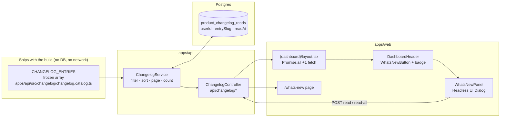

# AW-14 — What's new · in-product changelog · Implementation Plan

**Epic:** `AW-14-whats-new` · **Program:** [Agent Workspace](../README.md)
**Spec:** [spec.md](./spec.md) · **Tasks:** [tasks.md](./tasks.md)
**Status:** Draft v1 · **Owner:** Engineering · **Date:** 2026-09-06
**Size:** S · **Blocking dependencies:** none

> **Additive-only.** One new table, one new API module, one new web route, one new top-bar
> control, one new component folder. Nothing existing is removed, renamed or re-bound.
>
> **The load-bearing design decision:** the entry catalogue is **code, not data**. Only
> per-person read state is persisted. §3.1 explains why, and what it buys.

---

## 1. Current state in the codebase

Every path below was verified to exist in this worktree before being cited.

### 1.1 The dashboard shell — where the control hangs

| File                                                                              | What it does today                                                                                                                                                                                                                                                                               | Why it matters here                                                                                                                                                                  |
| --------------------------------------------------------------------------------- | ------------------------------------------------------------------------------------------------------------------------------------------------------------------------------------------------------------------------------------------------------------------------------------------------ | ------------------------------------------------------------------------------------------------------------------------------------------------------------------------------------ |
| `apps/web/src/app/[locale]/(dashboard)/layout.tsx`                                | Server component. Auth-gates the group, then runs a single `Promise.all` of 7 independently `.catch()`-guarded fetches (fresh profile, work stats, plugin list, onboarding state + catalog, `versionAPI.get()`, `healthAPI.getJobRuntimeConfigured()`) and hands the result to the client shell. | The unread count becomes an **8th entry in that same `Promise.all`**, `.catch(() => null)`-guarded like the rest. No new round trip after first paint (spec FR-31).                  |
| `apps/web/src/app/[locale]/(dashboard)/layout-client.tsx`                         | Client shell. Owns sidebar/chat state, mounts `DashboardHeader`, `HelpDrawer`, `PostHogIdentify`, `DashboardToasts`, `JobRuntimeDegradedBanner`. Already owns the open/closed state of one slide-over (`HelpDrawer`).                                                                            | Owns the panel's `open` boolean and the live unread count, exactly as it already owns `helpOpen`.                                                                                    |
| `apps/web/src/components/dashboard/DashboardHeader.tsx`                           | 124 lines. Right-hand cluster is `NotificationDropdown` → `ThemeToggle` → help button, each wrapped in `Tooltip`. Takes an optional `onHelpClick` callback and an optional `onboardingBadge` object.                                                                                             | The control is inserted **before** `NotificationDropdown`, following the same optional-prop shape (`whatsNew?: { unreadCount, onOpen }`) that `onboardingBadge` already establishes. |
| `apps/web/src/components/dashboard/HelpDrawer.tsx`                                | 601 lines. Headless UI `Dialog` + `Transition` slide-over with 4 tabs, `open`/`onClose` props, fully i18n'd from `dashboard.header.help.*`.                                                                                                                                                      | The single best in-repo template for the panel: same library, same transition, same close affordance, same prop contract.                                                            |
| `apps/web/src/components/dashboard/NotificationDropdown.tsx`                      | 386 lines. Polls every 30 s, renders a counted badge, and carries `isSafeNavTarget()` (lines 27–43) — a documented open-redirect guard rejecting `//`, `/\`, and cross-origin targets.                                                                                                           | Two things to copy, one thing **not** to: copy the badge treatment and the safe-target logic; **do not** copy the 30 s poll (FR-31 forbids a new interval).                          |
| `apps/web/src/components/dashboard/DashboardSidebar.tsx`                          | 628 lines, hardcoded 14-item nav array; carries `SidebarInboxBadge` (30 s poll) and `SidebarActivityIndicator`.                                                                                                                                                                                  | Deliberately untouched. What's-new is a top-bar concern; it does not contend for one of the 14 sidebar slots.                                                                        |
| `apps/web/src/components/common/EmptyState.tsx`                                   | Shared `title`/`description`/`action`/`icon` primitive, already used by the home page.                                                                                                                                                                                                           | Reused for both empty states (spec §6.4, §6.5) instead of a fourth bespoke empty-state component.                                                                                    |
| `apps/web/src/components/ui/tooltip.tsx`, `apps/web/src/components/ui/dialog.tsx` | Hand-rolled `Tooltip`; `Dialog` wraps Headless UI.                                                                                                                                                                                                                                               | Tooltip for the control; the panel goes straight to Headless UI like `HelpDrawer` does.                                                                                              |
| `apps/web/src/lib/constants.ts`                                                   | `ROUTES` (lines 107–304) is the single source of truth for paths.                                                                                                                                                                                                                                | Gains `DASHBOARD_WHATS_NEW: '/whats-new'`.                                                                                                                                           |

### 1.2 The pattern this epic copies for its catalogue

`apps/api/src/notifications/notification-event-type-bootstrap.service.ts` holds a frozen
`CORE_EVENTS: readonly CoreEventRow[]` array of 15 records in TypeScript, mirrored by a seed
migration (`apps/api/src/migrations/1780000010000-SeedNotificationEventTypes.ts`) and upserted
at `OnApplicationBootstrap` so environments booting with `synchronize: true` still get the
registry.

That is exactly the shape of "content that ships with the build", and it is the model here —
**minus the database half**. §3.1 explains why we keep the array and drop the table.

### 1.3 The read/write plumbing this epic copies

| File                                                                                   | Pattern to mirror                                                                                                                                                                                                        |
| -------------------------------------------------------------------------------------- | ------------------------------------------------------------------------------------------------------------------------------------------------------------------------------------------------------------------------ |
| `apps/api/src/notifications/notifications.controller.ts`                               | `@Controller('api/notifications')` + `@UseGuards(AuthSessionGuard)` + `@CurrentUser()` + `@Header('Cache-Control', 'private, no-store')` + `@ApiTags`/`@ApiOperation`/`@ApiQuery` so the MCP server picks the routes up. |
| `apps/api/src/activity-log/activity-log.controller.ts:213`                             | `@Throttle({ long: { limit: 60, ttl: 60_000 } })` — the in-repo rate-limit idiom.                                                                                                                                        |
| `apps/api/src/notifications/notifications.module.ts`, `apps/api/src/api.module.ts:136` | How a feature module is declared and registered.                                                                                                                                                                         |
| `apps/web/src/lib/api/notifications.ts`                                                | `import 'server-only'` + typed `xxxAPI` object built on `serverFetch`/`serverMutation` from `apps/web/src/lib/api/server-api.ts`.                                                                                        |
| `apps/web/src/lib/api/version.ts`                                                      | `cache()` + `next: { revalidate: 300 }` + `return null` on failure — the exact caching/degradation shape FR-31 and FR-47 ask for.                                                                                        |
| `apps/web/src/app/actions/notifications.ts`                                            | `'use server'` wrappers returning `{ success, …, error }` result objects rather than throwing.                                                                                                                           |

### 1.4 Entity / repository registration surface

Adding an entity to `@ever-works/agent` touches four files, and a drift spec fails CI if any is
missed (documented in the header comments of the inventory files themselves):

1. `packages/agent/src/entities/index.ts` — barrel export.
2. `packages/agent/src/database/_entity-names.ts` — the string-only `AGENT_ENTITY_NAMES` list
   (alphabetical), read by `database.config.spec.ts` inside its `jest.mock` factory.
3. `packages/agent/src/database/_entities-inventory.ts` — the real `ENTITIES` array
   (`database.config.ts:52` imports it; `database.config.ts:113` feeds it to TypeORM).
4. `packages/agent/src/database/_repository-inventory.ts` — `REPOSITORY_PROVIDERS`, spread into
   `database.module.ts`'s `providers` + `exports`, plus a barrel line in
   `packages/agent/src/database/index.ts`.

`packages/agent/src/database/database.module.spec.ts` carries the drift checks for 2–4.

### 1.5 What does **not** exist today

- No changelog, release-notes, "what's new", or product-announcement surface anywhere in
  `apps/web/src` or `apps/api/src`.
- No `product_changelog*` table, entity, module, route or i18n namespace.
- No per-person read state for anything other than `notifications.isRead`.
- The only build-identity surface is the footer chip fed by `apps/web/src/lib/api/version.ts`
  ← `apps/api/src/health/build-info.ts`. It is a machine identifier, not a changelog.

---

## 2. Architecture and the seam it plugs into



**The seam.** The dashboard shell already performs one batched server-side fetch on load and
already renders a counted badge next to a top-bar control. This epic adds one promise to that
batch and one control to that cluster. Nothing else in the shell changes shape.

**Why the panel is a sibling of `HelpDrawer`, not a tab inside it.** The Help drawer answers
"how do I do this?"; What's-new answers "what changed?". They have different lifetimes (help is
evergreen, changelog is dated), different state (help has none, changelog has per-person read
state) and different entry points (help has `?`, changelog has a counted badge). Merging them
would put a counted, decaying badge on an evergreen surface. P2 adds a one-line cross-link
from the Help drawer's Resources tab instead.

---

## 3. Data model

### 3.1 The decision: catalogue in code, read state in the database

Two designs were considered.

|                                                       | **A — entries in a table** (mirrors the notification event-type registry)             | **B — entries in a frozen array, only read state in a table** ✅ |
| ----------------------------------------------------- | ------------------------------------------------------------------------------------- | ---------------------------------------------------------------- |
| Tables added                                          | 2 (`product_changelog_entries`, `product_changelog_reads`)                            | 1 (`product_changelog_reads`)                                    |
| Publishing an entry                                   | code change **+** seed migration **+** bootstrap upsert, three places to keep in sync | code change, one place                                           |
| Can the changelog describe a feature the build lacks? | Yes — a stale row survives a rollback and lies to the reader                          | **No, structurally** (spec FR-1, S-14)                           |
| Rollback behaviour                                    | Rows persist after the code is rolled back                                            | Entry vanishes with the build that introduced it                 |
| Air-gapped / self-hosted                              | Works, once seeded                                                                    | Works, always                                                    |
| List/sort/page cost                                   | SQL over ≤200 rows                                                                    | Array ops over ≤200 frozen objects, zero I/O                     |
| Orphan risk                                           | Rows for entries removed from the build                                               | Read rows only (FR-22 prunes them)                               |

**B is chosen.** Spec FR-1 and FR-2 are the requirements; B satisfies them by construction
rather than by discipline. The catalogue is bounded (FR-27 caps the product at 200 entries),
immutable at runtime (FR-3), and identical for every reader (out-of-scope §7.2), so it has none
of the properties that would justify a table.

### 3.2 New entity

`packages/agent/src/entities/product-changelog-read.entity.ts`

```ts
import { Column, CreateDateColumn, Entity, Index, PrimaryGeneratedColumn, Unique } from 'typeorm';

/**
 * AW-14 — one row per (person, product changelog entry) meaning
 * "this person has seen this entry".
 *
 * Absent row = unread. There is no un-read transition (spec FR-21).
 *
 * `entrySlug` is a SOFT reference into `CHANGELOG_ENTRIES`
 * (apps/api/src/changelog/changelog.catalog.ts) — the catalogue ships with
 * the build, so there is deliberately no FK. Rows whose slug is absent from
 * the running build are ignored when counting and pruned after 30 days
 * (spec FR-22).
 *
 * NOT workspace-scoped: read state follows the person, never the active
 * Organization (spec FR-13). No tenantId / organizationId columns — this is
 * the rare table where their absence is the requirement.
 */
@Entity({ name: 'product_changelog_reads' })
@Unique('uq_product_changelog_read_user_entry', ['userId', 'entrySlug'])
@Index('idx_product_changelog_read_user', ['userId'])
export class ProductChangelogRead {
	@PrimaryGeneratedColumn('uuid')
	id: string;

	@Column({ type: 'uuid' })
	userId: string;

	/** Slug from CHANGELOG_ENTRIES. Matches `[a-z0-9-]{3,64}` (spec FR-6). */
	@Column({ type: 'varchar', length: 64 })
	entrySlug: string;

	@CreateDateColumn({ type: 'timestamptz' })
	readAt: Date;
}
```

FK on `userId` → `users(id)` with `ON DELETE CASCADE`, declared at the DB level in the
migration only (no entity-level `@ManyToOne`), matching the cycle-avoidance convention already
used across the Tier-C tables.

### 3.3 New enums (contracts, not database)

`packages/contracts/src/api/changelog/changelog.enum.ts`

```ts
/** Spec FR-9 — closed set of 6. */
export const CHANGELOG_CATEGORIES = ['agents', 'decisions', 'knowledge', 'connections', 'costs', 'platform'] as const;
export type ChangelogCategory = (typeof CHANGELOG_CATEGORIES)[number];

/** Spec FR-10 — closed set of 4. Badge only; never a filter. */
export const CHANGELOG_KINDS = ['new', 'improved', 'fixed', 'security'] as const;
export type ChangelogKind = (typeof CHANGELOG_KINDS)[number];
```

No database enum type is created — nothing persists a category or a kind.

### 3.4 Migration (Constitution V — ships in the SAME PR as the entity)

`apps/api/src/migrations/1791140000000-CreateProductChangelogReads.ts`

`1791140000000` is AW-14 slot 00 of the program's reserved migration blocks ([README §5 rule 10](../README.md#5-rules-every-epic-spec-in-this-program-must-follow)).
It sits above the newest migration on `develop` at time of writing (`1790100000000-AddReleaseVerification.ts`) and
cannot collide with another epic's plan. Before merge, rebase on `develop`; if a newer migration
has landed, re-stamp the filename and class name to exceed it.

```ts
import { MigrationInterface, QueryRunner, Table, TableForeignKey } from 'typeorm';

/**
 * AW-14 — What's new (in-product changelog).
 *
 * Creates ONE table: per-person read state for product changelog entries.
 * The entries themselves are not stored — they ship with the build
 * (apps/api/src/changelog/changelog.catalog.ts). See
 * docs/specs/features/agent-workspace/AW-14-whats-new/plan.md §3.1.
 *
 * Forward-only. `ifNotExists` on create; `down()` drops only the table this
 * migration created and touches no pre-existing object.
 */
export class CreateProductChangelogReads1791140000000 implements MigrationInterface {
	public async up(queryRunner: QueryRunner): Promise<void> {
		await queryRunner.createTable(
			new Table({
				name: 'product_changelog_reads',
				columns: [
					{
						name: 'id',
						type: 'uuid',
						isPrimary: true,
						generationStrategy: 'uuid',
						default: 'uuid_generate_v4()'
					},
					{ name: 'userId', type: 'uuid', isNullable: false },
					{ name: 'entrySlug', type: 'varchar', length: '64', isNullable: false },
					{ name: 'readAt', type: 'timestamptz', default: 'now()', isNullable: false }
				],
				uniques: [
					{
						name: 'uq_product_changelog_read_user_entry',
						columnNames: ['userId', 'entrySlug']
					}
				],
				indices: [{ name: 'idx_product_changelog_read_user', columnNames: ['userId'] }]
			}),
			true
		);

		await queryRunner.createForeignKey(
			'product_changelog_reads',
			new TableForeignKey({
				name: 'fk_product_changelog_read_user',
				columnNames: ['userId'],
				referencedTableName: 'users',
				referencedColumnNames: ['id'],
				onDelete: 'CASCADE'
			})
		);
	}

	public async down(queryRunner: QueryRunner): Promise<void> {
		await queryRunner.dropTable('product_changelog_reads', true);
	}
}
```

**No backfill.** The signup-baseline rule (spec FR-14) means "everything published before your
account existed is read" is answered by a comparison against `users.createdAt` at query time —
zero rows written for existing accounts, and the unread count is correct for every one of them
on the first request after deploy.

### 3.5 The catalogue

`apps/api/src/changelog/changelog.catalog.ts` — an `as const` array, alphabetically irrelevant,
ordered newest-first by convention (the service sorts anyway):

```ts
export interface ChangelogCatalogEntry {
	readonly slug: string; // FR-6: [a-z0-9-]{3,64}, unique, never reused
	readonly title: string; // FR-5: ≤ 80
	readonly body: string; // FR-5: ≤ 600, ≤ 3 paragraphs, plain text
	readonly category: ChangelogCategory;
	readonly kind: ChangelogKind;
	readonly publishedAt: string; // ISO-8601 date, FR-7 gates on it
	readonly pinned?: boolean; // FR-8: at most one in the whole array
	readonly cta?: { readonly label: string; readonly href: string }; // FR-4, FR-39
}

export const CHANGELOG_ENTRIES: readonly ChangelogCatalogEntry[] = [
	/* … */
] as const;
```

Every constraint in FR-5/6/8/39 is asserted by `changelog.catalog.spec.ts` (§10), which is the
CI gate spec FR-41 requires. Authoring guidance lives beside the file in
`apps/api/src/changelog/README.md`.

### 3.6 DTOs / wire contracts

`packages/contracts/src/api/changelog/changelog.dto.ts`, exported from
`packages/contracts/src/api/changelog/index.ts` and re-exported from
`packages/contracts/src/api/index.ts` (which already re-exports six such folders):

```ts
export interface ChangelogEntryDto {
	slug: string;
	title: string;
	body: string;
	category: ChangelogCategory;
	kind: ChangelogKind;
	publishedAt: string; // ISO-8601
	pinned: boolean;
	cta: { label: string; href: string } | null; // null when absent OR unsafe (FR-40)
	isRead: boolean;
}

export interface ChangelogListResponseDto {
	entries: ChangelogEntryDto[];
	nextCursor: string | null; // the slug of the last returned entry
	total: number; // visible entries in this build, ignoring filter
	unreadCount: number; // always unfiltered (FR-38)
	categoriesWithEntries: ChangelogCategory[]; // drives disabled chips (FR-37)
}

export interface ChangelogUnreadCountResponseDto {
	count: number;
}

export interface ChangelogMarkReadResponseDto {
	unreadCount: number;
}
```

`packages/contracts` is consumed by external API clients, so these are additive-only exports
(Constitution X).

---

## 4. API surface

New module `apps/api/src/changelog/`, base path `api/changelog`, `@UseGuards(AuthSessionGuard)`
on the controller, `@ApiTags('Changelog')` + `@ApiBearerAuth('JWT-auth')` so the MCP server and
OpenAPI doc pick it up. Every response carries
`@Header('Cache-Control', 'private, no-store')` — read state is per person.

| Method | Path                          | Query / body                                                                                 | Response                                                   | Auth          | Throttle                                |
| ------ | ----------------------------- | -------------------------------------------------------------------------------------------- | ---------------------------------------------------------- | ------------- | --------------------------------------- |
| `GET`  | `/api/changelog`              | `category?: ChangelogCategory`, `limit?: number` (default `20`, max `50`), `cursor?: string` | `ChangelogListResponseDto`                                 | Authenticated | `{ long: { limit: 120, ttl: 60_000 } }` |
| `GET`  | `/api/changelog/unread-count` | —                                                                                            | `ChangelogUnreadCountResponseDto`                          | Authenticated | `{ long: { limit: 120, ttl: 60_000 } }` |
| `GET`  | `/api/changelog/:slug`        | path `slug`                                                                                  | `ChangelogEntryDto` · **404** if absent or still scheduled | Authenticated | `{ long: { limit: 120, ttl: 60_000 } }` |
| `POST` | `/api/changelog/read`         | `MarkChangelogReadDto`                                                                       | `ChangelogMarkReadResponseDto`                             | Authenticated | `{ long: { limit: 60, ttl: 60_000 } }`  |
| `POST` | `/api/changelog/read-all`     | —                                                                                            | `ChangelogMarkReadResponseDto`                             | Authenticated | `{ long: { limit: 10, ttl: 60_000 } }`  |

**Request DTO** (`apps/api/src/changelog/dto/mark-changelog-read.dto.ts`):

```ts
export class MarkChangelogReadDto {
	@IsArray()
	@ArrayNotEmpty()
	@ArrayMaxSize(25) // spec FR-17
	@IsString({ each: true })
	@Matches(/^[a-z0-9-]{3,64}$/, { each: true }) // spec FR-6
	slugs: string[];
}
```

**Route-order note.** `GET /:slug` must be declared **after** `GET /unread-count` in the
controller, or `unread-count` is swallowed as a slug. The slug regex makes it harmless either
way, but the ordering is asserted in the controller spec.

**Semantics worth stating:**

- `GET /api/changelog` never 404s. An empty catalogue returns
  `{ entries: [], nextCursor: null, total: 0, unreadCount: 0, categoriesWithEntries: [] }`
  (spec S-13).
- `GET /api/changelog/:slug` returns the same 404 body for "never existed" and "scheduled",
  so the endpoint is not an existence oracle for unreleased work (spec S-15).
- `POST /read` accepts slugs not present in this build and silently ignores them — a client
  racing a deploy must not error. Rows are written with `INSERT … ON CONFLICT DO NOTHING`
  semantics, making it idempotent under concurrency (spec S-17, FR-18).
- `POST /read-all` writes one row per currently-visible-and-unread entry in a single statement,
  then returns `{ unreadCount: 0 }`. Idempotent (spec FR-19).
- **Unread count query** (spec FR-15) — no join to a catalogue table, because there isn't one:
  the service takes the newest 50 visible slugs from `CHANGELOG_ENTRIES`, drops any whose
  `publishedAt <= users.createdAt`, and counts how many of the remainder have no read row:

    ```sql
    SELECT count(*) FROM unnest($2::text[]) AS s(slug)
    WHERE NOT EXISTS (
      SELECT 1 FROM product_changelog_reads r
      WHERE r."userId" = $1 AND r."entrySlug" = s.slug
    );
    ```

    One index-only probe per candidate slug, ≤ 50 candidates, on
    `uq_product_changelog_read_user_entry`.

**Nothing is workspace-scoped.** No `X-Scope-Slug` handling, no `ScopeContextService`, no
`organizationId` filter — deliberate, per spec FR-13, and called out in the controller's doc
comment so a later scope sweep does not "fix" it.

---

## 5. Web

### 5.1 New files

| Path                                                                   | Purpose                                                                                                                                                                                                                                                                                                            |
| ---------------------------------------------------------------------- | ------------------------------------------------------------------------------------------------------------------------------------------------------------------------------------------------------------------------------------------------------------------------------------------------------------------ |
| `apps/web/src/lib/api/changelog.ts`                                    | `import 'server-only'` typed client (`changelogAPI.list/get/unreadCount/markRead/markAllRead`) over `serverFetch`/`serverMutation` from `apps/web/src/lib/api/server-api.ts`. `unreadCount` wrapped in `cache()` with `next: { revalidate: 300 }` and `catch → null`, mirroring `apps/web/src/lib/api/version.ts`. |
| `apps/web/src/app/actions/changelog.ts`                                | `'use server'` wrappers returning `{ success, …, error }` objects, mirroring `apps/web/src/app/actions/notifications.ts`.                                                                                                                                                                                          |
| `apps/web/src/components/dashboard/WhatsNewButton.tsx`                 | The top-bar control: sparkle icon, `Tooltip`, badge (hidden at 0/unknown, `9+` above 9), `aria-expanded`, accessible name from `dashboard.whatsNew.controlLabelUnread`.                                                                                                                                            |
| `apps/web/src/components/whats-new/WhatsNewPanel.tsx`                  | Headless UI `Dialog` + `Transition` right slide-over, `w-full sm:w-[420px]`. Modelled directly on `apps/web/src/components/dashboard/HelpDrawer.tsx` (same imports, same `open`/`onClose` contract, same close button treatment).                                                                                  |
| `apps/web/src/components/whats-new/ChangelogList.tsx`                  | Shared list body used by **both** the panel and the page — cards, skeletons, empty states, error state. One implementation, two hosts.                                                                                                                                                                             |
| `apps/web/src/components/whats-new/ChangelogEntryCard.tsx`             | One entry: unread dot + `sr-only` "Unread", kind badge, category, localised date, title, plain-text body, optional CTA button, optional permalink icon button (page only).                                                                                                                                         |
| `apps/web/src/components/whats-new/ChangelogFilterChips.tsx`           | Roving-tabindex chip row (`All` + 6), disabled chips for categories absent from `categoriesWithEntries`.                                                                                                                                                                                                           |
| `apps/web/src/components/whats-new/use-changelog-read-tracker.ts`      | `IntersectionObserver` at `threshold: 0.5`, a 1000 ms dwell timer per entry, and a 2000 ms batching window capped at 25 slugs per flush (spec FR-16, FR-17). Flushes on unmount and on `visibilitychange → hidden`.                                                                                                |
| `apps/web/src/lib/utils/safe-nav-target.ts`                            | `isSafeInAppPath(raw: string): boolean` — the FR-39 guard: exactly one leading `/`, not `//`, not `/\`, no scheme, no `\` anywhere.                                                                                                                                                                                |
| `apps/web/src/app/[locale]/(dashboard)/whats-new/page.tsx`             | Server component: reads `?category=` and `?entry=`, fetches page 1, renders the client.                                                                                                                                                                                                                            |
| `apps/web/src/app/[locale]/(dashboard)/whats-new/whats-new-client.tsx` | Client: month grouping, `Load more` to the 200 cap, permalink copy + highlight, unknown-slug state.                                                                                                                                                                                                                |

### 5.2 Modified files (all additive)

| Path                                                      | Change                                                                                                                                                                                                                                                                |
| --------------------------------------------------------- | --------------------------------------------------------------------------------------------------------------------------------------------------------------------------------------------------------------------------------------------------------------------- |
| `apps/web/src/app/[locale]/(dashboard)/layout.tsx`        | Add `changelogAPI.unreadCount().catch(() => null)` as the 8th promise in the existing `Promise.all`; pass `changelogUnreadCount` to `DashboardLayoutClient`.                                                                                                          |
| `apps/web/src/app/[locale]/(dashboard)/layout-client.tsx` | Add `whatsNewOpen` state (mirroring the existing `helpOpen`), a `unreadCount` state seeded from the server prop, the focus-refresh effect (FR-31: refetch on `focus` only when ≥ 900 000 ms since last fetch), and mount `<WhatsNewPanel />` beside `<HelpDrawer />`. |
| `apps/web/src/components/dashboard/DashboardHeader.tsx`   | New optional prop `whatsNew?: { unreadCount: number \| null; onOpen: () => void }`; render `<WhatsNewButton />` immediately before `<NotificationDropdown />` in the right-hand cluster. Absent prop → nothing renders (keeps every existing usage compiling).        |
| `apps/web/src/lib/constants.ts`                           | Add `DASHBOARD_WHATS_NEW: '/whats-new'` to `ROUTES`, with a comment naming this epic.                                                                                                                                                                                 |
| `apps/web/src/components/dashboard/HelpDrawer.tsx`        | P2: one entry in the Resources tab, "What's new", opening the panel.                                                                                                                                                                                                  |
| `apps/web/messages/en.json` + 20 locale files             | The `dashboard.whatsNew` namespace (§8).                                                                                                                                                                                                                              |

**Not modified:** `NotificationDropdown.tsx` keeps its own private `isSafeNavTarget`.
Consolidating the two guards is a tempting one-line refactor and is deliberately declined here —
the notification path is security-sensitive and out of this epic's blast radius. The duplication
is noted in the new helper's doc comment as a follow-up.

### 5.3 State and data fetching

```
  server (layout.tsx)                    client (layout-client.tsx)
  ────────────────────                   ──────────────────────────
  unreadCount ──── prop ───────────────► useState(unreadCount)
                                             │
                                             ├─ focus event & ≥900s stale ──► server action ──► setState
                                             │
                                             ├─ panel opened ──────────────► server action (list, page 1)
                                             │                                    │
                                             │                                    ▼
                                             │                            ChangelogList (client)
                                             │                                    │
                                             ├─◄─ onReadBatch(slugs) ────── use-changelog-read-tracker
                                             │      (server action → unreadCount) │
                                             └─◄─ onMarkAllRead() ────────── Mark all as read button
```

- The panel fetches its first page **when it opens**, not on shell load — the count is the only
  thing the shell pays for.
- The list is _not_ re-fetched after a read batch; the response's `unreadCount` updates the
  badge and the card flips its own dot locally. This satisfies FR-20 (entries never move).
- No `setInterval` anywhere in this feature. The only repeat trigger is the window `focus`
  handler gated at 900 s.

---

## 6. Background work

**This epic introduces no background job**, and that is a design outcome rather than an
omission:

- There is nothing to compute ahead of time — the unread count is one index-only count over
  ≤ 50 candidate slugs.
- There is nothing to deliver — spec §7.6 rules out email, bell, chat and digest delivery.
- There is nothing to ingest — the catalogue ships with the build.

The one candidate is the FR-22 prune of read rows whose slug no longer exists in the build. It
is **deferred to P3 and only if row counts warrant it** (at one entry per week and one row per
reader per entry, a 10 000-account deployment accumulates ~500 000 rows/year — small, and the
count query never scans them).

If and when it lands, it MUST follow Constitution IV: a `PRODUCT_CHANGELOG_PRUNE_DISPATCHER`
symbol declared in `packages/agent/src/tasks/`, bound through the binding factory in
`packages/agent/src/tasks/job-runtime.providers.ts`, and invoked only via that DI symbol. It
must **not** be a `@Cron` on the API process (the shape
`apps/api/src/notifications/notification-cleanup.service.ts` uses today) and must **not**
`import '@trigger.dev/sdk'` at any call site.

---

## 7. Plugin boundaries

**No new plugin, no facade change, no plugin id anywhere.**

- Constitution I (plugin-first) is about _external integrations_. This epic has none: no
  outbound HTTP, no third-party API, no provider, no credential. The catalogue is a local
  constant; the only network hop is web → our own API.
- Constitution II (no hardcoded plugin ids outside the plugin): no plugin id appears in any
  file this epic adds or modifies. Category values (`agents`, `decisions`, …) are product areas,
  not plugin ids, and are defined once in `packages/contracts/src/api/changelog/changelog.enum.ts`.
- A changelog entry MAY have a CTA pointing at a plugin-related screen (e.g. the connections
  list). That is a **route**, validated by the FR-41 CI check against `ROUTES`, not a plugin
  reference.

---

## 8. i18n

New namespace `dashboard.whatsNew` in `apps/web/messages/en.json`, mirrored into all 20 sibling
locales (`ar, bg, de, es, fr, he, hi, id, it, ja, ko, nl, pl, pt, ru, th, tr, uk, vi, zh`).
Every leaf name is camelCase and contains **no literal dot** — the next-intl constraint that
reds whole e2e shards when violated.

```
dashboard.whatsNew.title                     "What's new"
dashboard.whatsNew.controlLabel              "What's new"
dashboard.whatsNew.controlLabelUnread        "What's new — {count} unread"
dashboard.whatsNew.badgeOverflow             "9+"
dashboard.whatsNew.close                     "Close what's new"
dashboard.whatsNew.subtitleUnread            "{count} updates you haven't read"
dashboard.whatsNew.subtitleUnreadOne         "1 update you haven't read"
dashboard.whatsNew.subtitleCaughtUp          "All caught up"
dashboard.whatsNew.markAllRead               "Mark all as read"
dashboard.whatsNew.markedAllRead             "All caught up"
dashboard.whatsNew.seeAll                    "See all updates"
dashboard.whatsNew.unread                    "Unread"
dashboard.whatsNew.pinned                    "Pinned"
dashboard.whatsNew.pageSubtitle              "Everything we've shipped, newest first."
dashboard.whatsNew.loadMore                  "Load more"
dashboard.whatsNew.capReached                "That's the last 200 updates."
dashboard.whatsNew.copyLink                  "Copy link to this update"
dashboard.whatsNew.linkCopied                "Link copied"

dashboard.whatsNew.filters.all               "All"
dashboard.whatsNew.filters.agents            "Agents & Missions"
dashboard.whatsNew.filters.decisions         "Decisions & Safety"
dashboard.whatsNew.filters.knowledge         "Knowledge & Memory"
dashboard.whatsNew.filters.connections       "Connections & Computers"
dashboard.whatsNew.filters.costs             "Runs & Costs"
dashboard.whatsNew.filters.platform          "Platform"
dashboard.whatsNew.filters.emptyTooltip      "No updates in this area yet"

dashboard.whatsNew.kinds.new                 "New"
dashboard.whatsNew.kinds.improved            "Improved"
dashboard.whatsNew.kinds.fixed               "Fixed"
dashboard.whatsNew.kinds.security            "Security"

dashboard.whatsNew.empty.title               "No updates yet"
dashboard.whatsNew.empty.description         "New releases will show up here."
dashboard.whatsNew.emptyFiltered.title       "Nothing here yet"
dashboard.whatsNew.emptyFiltered.description "No updates in {category}."
dashboard.whatsNew.emptyFiltered.action      "Show all updates"
dashboard.whatsNew.error.title               "Couldn't load updates."
dashboard.whatsNew.error.retry               "Try again"
dashboard.whatsNew.notFound.title            "That update isn't available on this version."
dashboard.whatsNew.notFound.action           "See all updates"
```

Plus one key in the existing metadata namespace for the page title:
`metadata.pages.whatsNew` → `"What's new"`.

**Entry titles and bodies are not translated** (spec FR-11, open question Q-1). They are content
served by the API, exactly as notification titles are today, and never pass through next-intl.

---

## 9. Telemetry and failure modes

### 9.1 Telemetry

Four PostHog events, captured client-side through the provider already mounted at
`apps/web/src/components/posthog/PostHogProvider.tsx` (identity is already established by
`apps/web/src/components/posthog/PostHogIdentify.tsx`, mounted in `layout-client.tsx`):

| Event                     | Properties                                                                     | Answers                                                                                   |
| ------------------------- | ------------------------------------------------------------------------------ | ----------------------------------------------------------------------------------------- |
| `changelog_opened`        | `surface` (`panel` \| `page`), `unread_count`                                  | Is the badge earning its place?                                                           |
| `changelog_entry_read`    | `slug`, `category`, `surface`, `trigger` (`visibility` \| `cta` \| `mark_all`) | Are people reading or just clearing?                                                      |
| `changelog_cta_followed`  | `slug`, `category`                                                             | Which announcements actually drive discovery — the number this whole epic exists to move. |
| `changelog_mark_all_read` | `unread_count_before`                                                          | Is the list being cleared unread (a signal entries are too many or too dull)?             |

No entry title, no body text, no dwell time, no referrer (spec FR-49, FR-50). No new
server-side activity-log action type: a changelog read is not workspace activity and must not
appear in an audit trail (spec §5.2).

Sentry: the panel's error boundary tags `feature: whats-new` and `surface: panel|page`. Nothing
in this feature is on a critical path, so no alerting rule is added.

### 9.2 Failure modes

| Failure                                                           | Blast radius                     | Behaviour                                                                                       | Guard                                                 |
| ----------------------------------------------------------------- | -------------------------------- | ----------------------------------------------------------------------------------------------- | ----------------------------------------------------- |
| `GET /unread-count` fails or times out during shell render        | None — one of 8 sibling promises | `.catch(() => null)` → no badge; shell renders normally                                         | Spec FR-47; identical treatment to `versionAPI.get()` |
| `GET /api/changelog` fails when the panel opens                   | Panel only                       | Error state + `Try again`                                                                       | Spec FR-46 / S-10                                     |
| `POST /read` fails                                                | Nothing visible                  | ≤ 2 retries, then dropped silently; entry re-marks on next view                                 | Spec FR-48                                            |
| `POST /read-all` throttled                                        | Button only                      | Retryable error surfaced as the panel error state; **no partial writes** (single statement)     | Spec FR-44 / S-20                                     |
| Catalogue contains a malformed entry                              | Would be the whole panel         | **Cannot ship** — `changelog.catalog.spec.ts` fails CI first (spec FR-41)                       | §10                                                   |
| CTA target invalid at runtime (older build, hand-edited response) | One card                         | Button not rendered; card renders in full                                                       | Spec FR-40 / S-18                                     |
| Read rows reference slugs absent from the build                   | Count correctness                | Ignored by the count query by construction; pruned after 30 days                                | Spec FR-22                                            |
| Two tabs mark the same entry read concurrently                    | None                             | `ON CONFLICT DO NOTHING` → one row                                                              | Spec S-17                                             |
| Clock skew makes a scheduled entry briefly visible                | One entry, briefly               | Comparison is server-side against the API's clock only; the client never gates on `publishedAt` | Spec FR-7                                             |

---

## 10. Test plan

### 10.1 Unit — API (Jest)

| File                                                  | Covers                                                                                                                                                                                                                                                                                                                                                                                                                                                                                                                                                         |
| ----------------------------------------------------- | -------------------------------------------------------------------------------------------------------------------------------------------------------------------------------------------------------------------------------------------------------------------------------------------------------------------------------------------------------------------------------------------------------------------------------------------------------------------------------------------------------------------------------------------------------------- |
| `apps/api/src/changelog/changelog.catalog.spec.ts`    | **The CI authoring gate (spec FR-41).** Every entry: slug matches `^[a-z0-9-]{3,64}$` and is unique; title ≤ 80; body ≤ 600 and ≤ 3 paragraphs; `category` ∈ `CHANGELOG_CATEGORIES`; `kind` ∈ `CHANGELOG_KINDS`; `publishedAt` parses as ISO-8601; CTA label ≤ 32; CTA href passes `isSafeInAppPath` **and** resolves against a route the build serves; at most one `pinned: true` in the whole array.                                                                                                                                                         |
| `apps/api/src/changelog/changelog.service.spec.ts`    | Scheduled entries excluded (FR-7); pinned sorts first, then `publishedAt desc`, ties by slug asc (FR-8); cursor paging returns disjoint pages and a null `nextCursor` at the end; `limit` clamps at 50; category filter; `categoriesWithEntries` reflects only visible entries (FR-37); signup baseline — entries older than `users.createdAt` are read with zero rows (FR-14); unread capped at the newest 50 (FR-15); unknown slugs in `markRead` ignored; `markRead` and `markAllRead` idempotent (FR-18, FR-19); `markAllRead` ignores any filter (FR-19). |
| `apps/api/src/changelog/changelog.controller.spec.ts` | `AuthSessionGuard` applied; `Cache-Control: private, no-store` on every response; `GET /unread-count` is not swallowed by `GET /:slug`; `GET /:slug` 404s identically for absent and scheduled entries (S-15); `MarkChangelogReadDto` rejects > 25 slugs, an empty array, and a slug failing the regex; `@Throttle` limits match spec FR-44.                                                                                                                                                                                                                   |

### 10.2 Unit — web (Vitest, `apps/web/vitest.config.ts`)

| File                                                                        | Covers                                                                                                                                                                                                                        |
| --------------------------------------------------------------------------- | ----------------------------------------------------------------------------------------------------------------------------------------------------------------------------------------------------------------------------- |
| `apps/web/src/lib/utils/safe-nav-target.unit.spec.ts`                       | Accepts `/works/1`; rejects `//evil.example`, `/\evil`, `https://evil.example`, `javascript:alert(1)`, `mailto:`, `` (empty), and a path containing a backslash (FR-39).                                                      |
| `apps/web/src/components/dashboard/WhatsNewButton.unit.spec.tsx`            | No badge at `0`; no badge at `null`; `3` renders `3`; `27` renders `9+`; accessible name switches between `controlLabel` and `controlLabelUnread` (FR-24, S-11, S-22).                                                        |
| `apps/web/src/components/whats-new/ChangelogEntryCard.unit.spec.tsx`        | Unread dot + `sr-only` "Unread" (FR-53); read card keeps its position (FR-20); CTA rendered for a safe href; CTA **not** rendered for an unsafe one while the card still renders (FR-40).                                     |
| `apps/web/src/components/whats-new/ChangelogFilterChips.unit.spec.tsx`      | 7 chips; `All` selected by default (FR-34); a category absent from `categoriesWithEntries` is disabled, not hidden, with its tooltip (FR-37); `←`/`→` roving tabindex (FR-52).                                                |
| `apps/web/src/components/whats-new/use-changelog-read-tracker.unit.spec.ts` | 50 % visibility for < 1000 ms → no mark; ≥ 1000 ms → mark; batches within 2000 ms; never more than 25 slugs per flush; flushes on unmount and on tab hide (FR-16, FR-17).                                                     |
| `apps/web/src/components/whats-new/WhatsNewPanel.unit.spec.tsx`             | Loading skeletons; global empty vs filtered empty are different copy (S-12, S-13); error state offers retry (S-10); `Escape` closes and restores focus to the opener (FR-51, S-21); filter resets to `All` on reopen (FR-35). |

### 10.3 E2E (Playwright, `apps/web/e2e/`)

| File                                      | Golden path                                                                                                                                                                                                                                                                                      |
| ----------------------------------------- | ------------------------------------------------------------------------------------------------------------------------------------------------------------------------------------------------------------------------------------------------------------------------------------------------ |
| `apps/web/e2e/whats-new-panel.spec.ts`    | Sign in with unread entries → badge shows the count → open panel → scroll the first entry into view → badge decrements and the entry stays put → follow a CTA → lands on the target route and the entry is read → reopen → "Mark all as read" → badge gone → reload → still gone (S-1…S-5, S-6). |
| `apps/web/e2e/whats-new-page.spec.ts`     | `/whats-new` renders month groups → filter chip narrows and reflects in the address → `Load more` appends → copy a permalink → open it in a new context → the entry is scrolled to and highlighted → open a bogus slug → the version-message state renders, not a 500 (S-8, S-15, FR-36).        |
| `apps/web/e2e/whats-new-degraded.spec.ts` | Route-intercept `**/api/changelog/unread-count` to 500 → shell renders, control present, **no badge**; intercept `**/api/changelog` to 500 → panel error + retry; intercept `**/api/changelog/read` to 500 → reading is unaffected and no error toast appears (S-10, S-11, FR-48).               |

Accessibility is covered by the existing `apps/web/e2e/accessibility.spec.ts` /
`accessibility-axe-deep.spec.ts` sweeps once `/whats-new` is added to their route list.

### 10.4 Drift guards that come for free

`packages/agent/src/database/database.module.spec.ts` fails if `ProductChangelogRead` is added
to the entities barrel but missed in `_entity-names.ts` / `_entities-inventory.ts`, or if the
repository is wired without being listed in `_repository-inventory.ts`.

---

## 11. Phasing

Each phase is one PR against `develop`, is independently shippable, and leaves `develop` green.

### P1 — The count and the panel

Read state, the endpoints, the control, the panel. Value alone: people can see and clear what
shipped.

- Entity + migration + repository + the four registration files.
- `apps/api/src/changelog/` module: catalogue (seeded with the first real entries), service,
  controller, DTO.
- Contracts folder + re-export.
- Web: server-only client, server actions, `WhatsNewButton`, `WhatsNewPanel`, `ChangelogList`,
  `ChangelogEntryCard`, read tracker.
- Shell wiring: the 8th promise in `layout.tsx`, panel state in `layout-client.tsx`, the
  optional prop in `DashboardHeader.tsx`.
- Full i18n namespace across 21 locale files.
- Full keyboard + dialog accessibility (FR-51, FR-52).
- Tests: `changelog.service.spec.ts`, `changelog.controller.spec.ts`,
  `WhatsNewButton.unit.spec.tsx`, `use-changelog-read-tracker.unit.spec.ts`,
  `WhatsNewPanel.unit.spec.tsx`, `whats-new-panel.spec.ts`, `whats-new-degraded.spec.ts`.

**Not in P1:** category chips, CTAs, the full page, permalinks, pinning, telemetry.
Cards render without buttons; the panel's footer link is absent until P2.

### P2 — Filters, calls-to-action, and the page

The half that turns a list into a discovery surface.

- `ChangelogFilterChips` + `categoriesWithEntries` + disabled chips.
- `isSafeInAppPath` helper + CTA rendering + `changelog.catalog.spec.ts` as the CI gate
  (FR-41).
- Pinned support (sorting + the `Pinned` marker).
- `/whats-new` page + `whats-new-client.tsx` + `DASHBOARD_WHATS_NEW` in `ROUTES` +
  `metadata.pages.whatsNew`.
- Month grouping, `Load more` to the 200 cap, permalink copy + highlight, unknown-slug state,
  `?category=` / `?entry=` handling.
- Discovery: the panel's "See all updates" link, one Help-drawer Resources entry, and — where
  the command palette exists — a "What's new" command.
- Tests: `changelog.catalog.spec.ts`, `safe-nav-target.unit.spec.ts`,
  `ChangelogEntryCard.unit.spec.tsx`, `ChangelogFilterChips.unit.spec.tsx`,
  `whats-new-page.spec.ts`; `/whats-new` added to the axe sweeps.

### P3 — Polish and hygiene

- The four PostHog events (FR-50).
- Focus-refresh of the count at the 900 s threshold (FR-31).
- `apps/api/src/changelog/README.md` — the authoring guide — plus a one-line
  "Did this change need a What's-new entry?" prompt in the PR template.
- Only if row counts warrant it: the FR-22 orphan-read prune, dispatched through a
  `*_DISPATCHER` DI symbol per §6.

---

## 12. Constitution compliance

| Gate                                                  | Status | Justification                                                                                                                                                                                                                                                                                            |
| ----------------------------------------------------- | ------ | -------------------------------------------------------------------------------------------------------------------------------------------------------------------------------------------------------------------------------------------------------------------------------------------------------- |
| **I — Plugin-first**                                  | ✅ n/a | No external integration of any kind: no outbound HTTP, no provider, no credential. The catalogue is a local constant; the only network hop is web → our own API.                                                                                                                                         |
| **II — Capability-driven, no hardcoded plugin ids**   | ✅     | No plugin id appears in any added or modified file. Category values are product areas, defined once in `packages/contracts/src/api/changelog/changelog.enum.ts`, and are not resolvable to plugins.                                                                                                      |
| **III — Source-of-truth repositories**                | ✅ n/a | Nothing here is Work content. The catalogue is product metadata that ships with the build; the only persisted data is per-person read state, which belongs in our database by definition.                                                                                                                |
| **IV — Background work via the job-runtime provider** | ✅     | No background work is introduced (§6). The one deferred candidate is specified to go through a `*_DISPATCHER` DI symbol bound in `packages/agent/src/tasks/job-runtime.providers.ts`, never `@Cron` and never a direct vendor SDK import.                                                                |
| **V — Forward-only migrations, same PR**              | ✅     | `apps/api/src/migrations/1791140000000-CreateProductChangelogReads.ts` ships in the same PR as `packages/agent/src/entities/product-changelog-read.entity.ts`. Create-only, `ifNotExists`, no backfill needed (the signup baseline is a query-time comparison), `down()` drops only what `up()` created. |
| **VI — Tests are a prerequisite**                     | ✅     | Jest service + controller specs, Vitest component/hook specs, three Playwright specs, and a catalogue spec that is itself a product requirement (FR-41). Named in §10.                                                                                                                                   |
| **VII — Privacy & secret hygiene**                    | ✅     | No secrets exist in this feature. Read rows hold `(userId, entrySlug, readAt)` and nothing else (FR-49). Analytics carry no free text (FR-50). Responses are `private, no-store`. The `:slug` 404 is not an existence oracle.                                                                            |
| **VIII — Single source of truth for plugin counts**   | ✅ n/a | No plugin is added; `docs/plugin-system/built-in-plugins.md` is untouched.                                                                                                                                                                                                                               |
| **IX — Behaviour-first spec, plan owns detail**       | ✅     | `spec.md` names no class, no path and no code; every path, DTO and file name lives here.                                                                                                                                                                                                                 |
| **X — Backwards compatibility**                       | ✅     | Every contracts export, every route, every i18n key and the `DashboardHeader` prop are additive. The header's new prop is optional, so all existing call sites compile unchanged. No public field is renamed or removed.                                                                                 |

---

## 13. References

- Spec: [`./spec.md`](./spec.md) · Tasks: [`./tasks.md`](./tasks.md)
- Program: [`../README.md`](../README.md) — rules §5, vocabulary §1
- Constitution: [`../../../../../.specify/memory/constitution.md`](../../../../../.specify/memory/constitution.md)
- House-style worked example: [`../../schedules/plan.md`](../../schedules/plan.md)
  </content>
