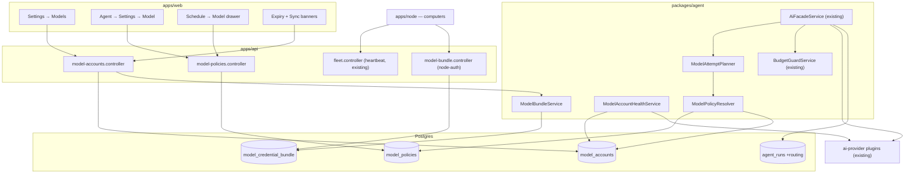

# Implementation Plan: Model accounts, priority chains and fallbacks

> Translates [`spec.md`](./spec.md) into architecture and tech choices. The plan owns
> implementation detail; the spec owns behaviour. Ordered work is in [`tasks.md`](./tasks.md).

**Epic ID**: `AW-16-models-tokens`
**Program**: [`agent-workspace`](../README.md)
**Spec**: [`./spec.md`](./spec.md) · **Tasks**: [`./tasks.md`](./tasks.md)
**Status**: `Draft`
**Last updated**: 2026-09-06

---

## 1. Current state in the codebase

Every path below was opened before being cited.

### 1.1 The model path today

| Concern                    | Where it lives now                                                                                                                                          | What it does                                                                                                                                                                                                                                             |
| -------------------------- | ----------------------------------------------------------------------------------------------------------------------------------------------------------- | -------------------------------------------------------------------------------------------------------------------------------------------------------------------------------------------------------------------------------------------------------- |
| Capability facade          | `packages/agent/src/facades/ai.facade.ts` (1059 lines)                                                                                                      | `askJson`, `createChatCompletion`, `createStreamingChatCompletion`, `embed`, `transcribe`, `testConnection`, `getAvailableModels`, `getProviderConfig`, `resolveModelMetadata`, `resolveModelContextLength`.                                             |
| Facade contract            | `packages/plugin/src/facades/ai-facade.interface.ts`                                                                                                        | `AiRoutingOptions` has exactly five fields — `complexity`, `taskId`, `autoEscalate`, `providerOverride`, `modelOverride`. No effort, no timeout, no fallback.                                                                                            |
| Call-site context          | `packages/plugin/src/facades/facade-options.interface.ts`                                                                                                   | `FacadeOptions` = `userId`, `workId?`, `providerOverride?`, `agentId?`, `taskId?`, `runId?`. This is the object every call already threads; it is where the resolved policy will ride.                                                                   |
| Plugin/settings resolution | `packages/agent/src/facades/base.facade.ts`                                                                                                                 | `resolvePlugin()` and `getResolvedSettings()` implement the work → user → admin cascade (Constitution II).                                                                                                                                               |
| Model choice               | `ai.facade.ts:1025` `resolveModel()`                                                                                                                        | `routing.modelOverride` → `{complexity}Model` setting → `defaultModel` setting → plugin default.                                                                                                                                                         |
| "Fallback" today           | `ai.facade.ts:295` `withEscalation()` / `:318` `escalateModel()`                                                                                            | Retries **once**, on the **same plugin and the same credential**, at the next complexity alias. There is no cross-provider path.                                                                                                                         |
| Budget gate                | `ai.facade.ts:93` `enforceBudget()`                                                                                                                         | Calls `BudgetGuardService.checkBudget`, throws before the plugin is reached. Must remain a hard stop (spec FR-46).                                                                                                                                       |
| Usage ledger               | `packages/agent/src/entities/plugin-usage-event.entity.ts`                                                                                                  | Carries `pluginId`, `modelId`, `costCents`, `agentId`, `taskId`, `runId`, `ownerType`/`ownerId`, `tenantId`/`organizationId`. Written by every facade method.                                                                                            |
| Model catalogue            | `packages/agent/src/facades/model-catalog.ts`                                                                                                               | Live merge of two public catalogue endpoints, 10 s timeout, 16 MB read cap; the facade caches it in-process for 1 hour (`CACHE_TTL = 3_600_000`). `matchModelCatalogEntry` does exact then loosened id matching.                                         |
| Reasoning today            | `packages/plugin/src/ai/reasoning.utils.ts`                                                                                                                 | A hardcoded model-name-regex registry that only ever _reduces_ thinking. Not a setting, not exposed.                                                                                                                                                     |
| Timeout today              | `packages/plugin/src/ai/ai-operations.ts`                                                                                                                   | One hardcoded `TIMEOUT_MS = 15_000` inside `testConnection`. Regular calls take a caller-supplied `AbortSignal` and otherwise have no deadline.                                                                                                          |
| Per-agent override         | `packages/agent/src/entities/agent.entity.ts:273-277`                                                                                                       | `aiProviderId?: string \| null` and `modelId?: string \| null`, under the comment `// ── AI provider routing ──`. Flat, single-valued, no chain, no effort.                                                                                              |
| Run record                 | `packages/agent/src/entities/agent-run.entity.ts`                                                                                                           | Has `totalTokens` and `costCents`; **no** model, provider or account. `AgentRunStatus = 'queued' \| 'running' \| 'completed' \| 'failed' \| 'cancelled'`.                                                                                                |
| Provider settings storage  | `packages/agent/src/plugins/entities/plugin.entity.ts`, `user-plugin.entity.ts`, `work-plugin.entity.ts`                                                    | `settings` / `secretSettings` JSON blobs. One blob per scope, hence exactly one credential per provider.                                                                                                                                                 |
| Secret encryption          | `packages/agent/src/plugins/services/plugin-secret-enc.service.ts`, wrapped by `packages/agent/src/entities/_secret-json-column.ts` (`EncryptedJsonColumn`) | AES-256-GCM `enc::v1::` envelope as a transparent TypeORM transformer; passes through when no key is configured; re-encrypts legacy plaintext on next write.                                                                                             |
| HTTP surface               | `apps/api/src/plugins/plugins.controller.ts`                                                                                                                | `GET plugins/:pluginId/models`, `GET plugins/:pluginId/connection-status`, `PATCH plugins/:pluginId/settings`, `POST plugins/:pluginId/validate-connection`, plus the work-scoped variants. Settings PATCH validates presence, not catalogue membership. |
| Web — provider settings    | `apps/web/src/app/[locale]/(dashboard)/settings/plugins/[category]/page.tsx`                                                                                | Generic per-category plugin settings cards; the AI category renders the four model-alias pickers.                                                                                                                                                        |
| Web — per-agent override   | `apps/web/src/app/[locale]/(dashboard)/agents/[id]/settings/page.tsx`                                                                                       | Picks `aiProviderId` + `modelId`; also calls `listByCategory('ai-gateway')` which resolves to `[]` because that category does not exist in `PLUGIN_CATEGORIES` (`packages/plugin/src/contracts/plugin-manifest.types.ts`).                               |
| Web — model widgets        | `apps/web/src/components/plugins/form/PluginModelSelect.tsx`, `apps/web/src/components/ai/ChatModelSelector.tsx`, `apps/web/src/lib/ai/model-catalog.ts`    | The existing model-picker vocabulary to reuse rather than reinvent.                                                                                                                                                                                      |
| Settings shell             | `apps/web/src/app/[locale]/(dashboard)/settings/layout.tsx` + `settings-layout-client.tsx`                                                                  | Static tab list plus a dynamic plugin section. New tabs are added here.                                                                                                                                                                                  |
| Dashboard banner precedent | `apps/web/src/components/dashboard/JobRuntimeDegradedBanner.tsx`, mounted at `apps/web/src/app/[locale]/(dashboard)/layout-client.tsx:511`                  | Hydration-gated, localStorage-dismissed, renders nothing on `null`. Exactly the shape both new banners take.                                                                                                                                             |
| Live-probed contract       | `apps/web/e2e/flow-plugin-ai-models-catalogue.spec.ts`                                                                                                      | Documents the verified behaviour of the models/settings endpoints. Must stay green.                                                                                                                                                                      |

### 1.2 Fleet — how credentials reach a computer today

| Concern                         | Where                                                                                                                                          | Notes                                                                                                                                                                                                                    |
| ------------------------------- | ---------------------------------------------------------------------------------------------------------------------------------------------- | ------------------------------------------------------------------------------------------------------------------------------------------------------------------------------------------------------------------------ |
| Node entity                     | `packages/agent/src/entities/fleet-node.entity.ts`                                                                                             | `enrollmentTokenHash` (unique), `credentialIssuedAt`, `previousCredentialHash`, `previousCredentialExpiresAt`, `rotationRequestedAt`, `cliVersion`, `status`.                                                            |
| Node HTTP                       | `apps/api/src/fleet/fleet.controller.ts`                                                                                                       | `POST fleet/heartbeat` is `@Public()` and authenticates on the node secret; the response already carries a server→node instruction (`rotationRequested`). `POST fleet/rotate-credential` is the node-initiated rotation. |
| Node loop                       | `apps/node/src/core/heartbeat.ts`, `apps/node/src/core/types.ts`                                                                               | `DEFAULT_HEARTBEAT_INTERVAL_MS = 60_000`, exponential backoff on failure.                                                                                                                                                |
| Node secrets                    | `apps/node/src/core/secret-store.ts`                                                                                                           | OS keychain first (`@napi-rs/keyring`, service `ever-works-node`), file fallback with an owner-only ACL and a loud warning.                                                                                              |
| Node model execution            | `apps/node/src/core/executors/model-cli.ts`, `apps/node/src/core/model-cli-probe.ts`                                                           | Spawns local model CLIs with an allow-listed `envPassthrough`; values are read from the machine's own `process.env` and scrubbed out of reported output. **This is why credentials today arrive on a machine by hand.**  |
| Credential versioning precedent | `packages/agent/src/entities/tenant-credential-snapshot.entity.ts` + `CredentialVersionService` (`packages/agent/src/tasks/_tasks-symbols.ts`) | Monotonic `credentialVersion`, per-version snapshots, graceful drain. The pattern this epic copies for bundles.                                                                                                          |

### 1.3 The three things that are currently written and never read

1. An operator setup flow writes an ordered fallback-provider configuration value that nothing
   in `packages/agent`, `apps/api` or `apps/web` reads. This epic **does not** read it either
   (spec §9 open question); it is left exactly as it is.
2. `apps/web/src/app/[locale]/(dashboard)/agents/[id]/settings/page.tsx` fetches an
   `ai-gateway` plugin category that `PLUGIN_CATEGORIES` does not contain. The new Agent Model
   panel simply does not make that call; the existing page section is left untouched until it
   is replaced in P1 T18.
3. `docs/specs/architecture/ai-facade.md` describes an `AiRoutingOptions` shape that the code
   does not have. This epic changes the real interface, so that doc is corrected in the same
   PR (tasks T41).

## 2. Architecture and the seam

Everything routes through **one new service** that sits between the call site and the existing
facade, and **one new resolver** that produces its input. Nothing else in the call path moves.



### 2.1 The seam, precisely

`AiFacadeService.askJson` / `createChatCompletion` / `createStreamingChatCompletion` today do:

```
resolvePlugin → getResolvedSettings → resolveModel → enforceBudget → withEscalation(call)
```

They will do:

```
resolvePlugin → getResolvedSettings
  → ModelAttemptPlanner.plan(facadeOptions)     ← NEW, returns an ordered attempt list
  → enforceBudget (unchanged, before attempt 1, and only once)
  → runAttempts(list)                           ← NEW, replaces withEscalation
  → record routing on the run                   ← NEW
```

Four rules keep this additive:

1. **`plan()` returning an empty policy is the current behaviour.** When a workspace has no
   Model Account and no Model Policy, the planner returns exactly one attempt — the plugin and
   model `resolveModel()` would have chosen, with the plugin's own credential from
   `getResolvedSettings()`. Zero behaviour change on upgrade (spec FR-35, Constitution X).
2. **`withEscalation` is not deleted.** When a policy has no fallback chain and `complexity` is
   set, the planner emits the same-plugin tier escalation as attempt 2, preserving today's
   only retry.
3. **`enforceBudget` runs once, before the first attempt, and a `BudgetExceededException`
   propagates without touching the attempt list** (spec FR-46).
4. **`FacadeOptions` is extended, never replaced.** Two optional fields (`scheduleId?`,
   `policyOverride?`) join the six that exist; every current call site compiles unchanged.

### 2.2 Failure classification — the one place that decides

`ModelFailureClassifier` (pure function, no I/O) maps a provider error to one of five
outcomes. It is the only place in the epic that reads an error.

| Class               | Signals                                                         | Effect                                                                        |
| ------------------- | --------------------------------------------------------------- | ----------------------------------------------------------------------------- |
| `rate_limited`      | HTTP 429; provider error codes advertising a retry delay        | next **account**, same model; cooldown = `Retry-After` or 60 s, capped 30 min |
| `credential`        | HTTP 401, 403; provider "invalid key"/"revoked" codes           | account → `invalid` immediately; next **account**; cooldown 15 min            |
| `transient`         | HTTP 5xx, connection reset, DNS failure, attempt-deadline abort | next **account**; cooldown 60 s (5 min after 3 in 5 min)                      |
| `context_too_large` | provider context-window rejections                              | next **chain entry with a larger known window**, else fail                    |
| `fatal`             | HTTP 400/404/422, unknown model id, schema failure              | fail the call immediately, no further attempts                                |

A budget block never reaches the classifier — it is thrown before attempt 1.

### 2.3 Why a resolver and not columns on three tables

Adding `primaryModel`, `fallbackModels`, `reasoningEffort`, `runTimeoutSeconds` to `agents`,
to `work_schedules`, to `missions`, to `tasks` and to a workspace row would be five copies of
the same four fields, five migrations, and five places for the ladder to drift. One
`model_policies` table keyed by `(scopeType, scopeId, scopeVariant)` gives one migration, one
resolver, one unique index, and one place to test narrowest-wins.

## 3. Data model

### 3.1 New entity — `ModelAccount`

`packages/agent/src/entities/model-account.entity.ts`, exported from
`packages/agent/src/entities/index.ts`.

```ts
@Entity({ name: 'model_accounts' })
@Index('idx_model_accounts_scope_provider', ['tenantId', 'organizationId', 'providerPluginId'])
@Index('idx_model_accounts_health', ['tenantId', 'health'])
export class ModelAccount {
	@PrimaryGeneratedColumn('uuid') id: string;

	@Column('uuid') userId: string; // creator / owner of record
	@Column({ type: 'uuid', nullable: true }) tenantId?: string | null;
	@Column({ type: 'uuid', nullable: true }) organizationId?: string | null;

	/** Plugin id of an installed ai-provider plugin. Never a hardcoded literal in core. */
	@Column({ type: 'varchar', length: 128 }) providerPluginId: string;

	@Column({ type: 'varchar', length: 60 }) label: string;

	/** 1..N, contiguous within (scope, providerPluginId). The failover order. */
	@Column({ type: 'int' }) position: number;

	/** working | expiring | expired | invalid | paused | unknown */
	@Column({ type: 'varchar', length: 16, default: 'unknown' }) health: ModelAccountHealth;

	@Column({ type: 'boolean', default: true }) enabled: boolean;

	/**
	 * The provider's own credential fields, keyed exactly as that plugin's
	 * settings schema declares them. Envelope-encrypted at rest by the same
	 * transformer plugin `secretSettings` uses. NEVER serialised outward.
	 */
	@EncryptedJsonColumn({ nullable: true })
	credentials?: Record<string, string> | null;

	/** Bumped on every credential write; mirrors the tenant-overlay idiom. */
	@Column({ type: 'int', default: 1 }) credentialVersion: number;

	@PortableDateColumn({ nullable: true }) credentialExpiresAt?: Date | null;
	@PortableDateColumn({ nullable: true }) lastCheckedAt?: Date | null;
	@PortableDateColumn({ nullable: true }) lastUsedAt?: Date | null;

	/** Short machine token: rate_limited | credential | transient. NULL = no cooldown. */
	@Column({ type: 'varchar', length: 24, nullable: true }) cooldownReason?: string | null;
	@PortableDateColumn({ nullable: true }) cooldownUntil?: Date | null;
	@Column({ type: 'int', default: 0 }) consecutiveFailures: number;

	@CreateDateColumn() createdAt: Date;
	@UpdateDateColumn() updatedAt: Date;
}
```

Constraints enforced by the migration, not the entity:

- `UNIQUE (tenantId, organizationId, providerPluginId, label)` — spec FR-3.
- `UNIQUE (tenantId, organizationId, providerPluginId, position)`, applied **deferred** so a
  reorder can swap two rows in one transaction.
- A row's lifetime follows its workspace, never the person who wrote it (same on
  `model_policies`): FK `ownerUserId → users(id)` `ON DELETE CASCADE` (set only for a
  personal workspace), FK `organizationId → organizations(id)` `ON DELETE CASCADE`, and
  FK `userId → users(id)` `ON DELETE SET NULL` (`userId` is nullable: the creator or
  last writer is a record, so deleting a member never deletes an organization's
  credentials or policies).

Counting limits (8 per provider, 32 per workspace) are service-enforced with a `SELECT
COUNT` inside the same transaction as the insert; a DB constraint cannot express "8 per
provider per scope" portably across Postgres and better-sqlite3. On Postgres every add
takes a transaction-scoped advisory lock keyed by the workspace, then one keyed by
workspace + provider (reorder, rename, reconnect and remove take only the latter), so
concurrent adds cannot both pass either count.

### 3.2 New entity — `ModelPolicy`

`packages/agent/src/entities/model-policy.entity.ts`.

```ts
export type ModelPolicyScopeType = 'workspace' | 'agent' | 'schedule';
export type ReasoningEffort = 'minimal' | 'low' | 'medium' | 'high';

export interface ModelChainEntry {
	providerPluginId: string;
	modelId: string;
	/** true when the id was not in the visible catalogue at save time (spec FR-30). */
	unverified?: boolean;
}

@Entity({ name: 'model_policies' })
@Index('idx_model_policies_scope', ['tenantId', 'organizationId', 'scopeType', 'scopeId'])
export class ModelPolicy {
	@PrimaryGeneratedColumn('uuid') id: string;

	@Column('uuid') userId: string;
	@Column({ type: 'uuid', nullable: true }) tenantId?: string | null;
	@Column({ type: 'uuid', nullable: true }) organizationId?: string | null;

	@Column({ type: 'varchar', length: 16 }) scopeType: ModelPolicyScopeType;

	/** NULL for 'workspace'; the Agent id or the schedule's owning entity id otherwise. */
	@Column({ type: 'uuid', nullable: true }) scopeId?: string | null;

	/**
	 * Only for scopeType='schedule'. Which recurring definition on that owner:
	 * work_schedule | agent_heartbeat | mission_tick | recurring_task |
	 * source_validation | data_sync — the same source vocabulary the Schedules
	 * read model uses (docs/specs/features/schedules/spec.md §1.3).
	 */
	@Column({ type: 'varchar', length: 32, nullable: true }) scopeVariant?: string | null;

	/** NULL = this level does not set a primary; inherit outward. */
	@Column({ type: 'simple-json', nullable: true }) primaryModel?: ModelChainEntry | null;

	/** NULL = inherit. [] = "explicitly no fallbacks". Max 3 entries. */
	@Column({ type: 'simple-json', nullable: true }) fallbackModels?: ModelChainEntry[] | null;

	@Column({ type: 'varchar', length: 8, nullable: true }) reasoningEffort?: ReasoningEffort | null;
	@Column({ type: 'int', nullable: true }) runTimeoutSeconds?: number | null;
	@Column({ type: 'int', nullable: true }) attemptTimeoutSeconds?: number | null;

	@CreateDateColumn() createdAt: Date;
	@UpdateDateColumn() updatedAt: Date;
}
```

- `UNIQUE (tenantId, organizationId, scopeType, scopeId, scopeVariant)` — one policy per scope.
- `scopeType='workspace'` rows carry `scopeId IS NULL` and `scopeVariant IS NULL`.
- Every field is independently nullable so a Schedule can set only the model (spec §5.3).
- `simple-json` (portable Postgres `jsonb` / SQLite text) matches the convention already used
  by `agent_runs.workspaceMeta` and `agents.*` json columns.

### 3.3 New entity — `ModelCredentialBundle`

`packages/agent/src/entities/model-credential-bundle.entity.ts`. One row per workspace scope.

```ts
@Entity({ name: 'model_credential_bundle' })
export class ModelCredentialBundle {
	@PrimaryGeneratedColumn('uuid') id: string;
	@Column({ type: 'uuid', nullable: true }) tenantId?: string | null;
	@Column({ type: 'uuid', nullable: true }) organizationId?: string | null;

	/** Monotonic. Bumped by ModelBundleService on any account/policy write. */
	@Column({ type: 'int', default: 1 }) version: number;

	/** sha256 of the canonicalised bundle body; lets a node skip a no-op apply. */
	@Column({ type: 'varchar', length: 64, nullable: true }) contentHash?: string | null;

	@PortableDateColumn({ nullable: true }) publishedAt?: Date | null;
	@Column({ type: 'uuid', nullable: true }) publishedByUserId?: string | null;
	@CreateDateColumn() createdAt: Date;
	@UpdateDateColumn() updatedAt: Date;
}
```

`UNIQUE (tenantId, organizationId)`.

### 3.4 Additive columns on existing tables

| Table         | Column                      | Type               | Why                                                                                                                              |
| ------------- | --------------------------- | ------------------ | -------------------------------------------------------------------------------------------------------------------------------- |
| `agent_runs`  | `modelRouting`              | `simple-json` NULL | The routing record (spec FR-79..84). Shape below.                                                                                |
| `fleet_nodes` | `appliedModelBundleVersion` | `int` NULL         | What the computer reports it has applied (spec FR-71). NULL on every pre-existing row and on every node running an older daemon. |
| `fleet_nodes` | `modelBundleRequestedAt`    | `timestamp` NULL   | Set by _Send now_; cleared when the node reports the current version.                                                            |

`agent_runs.modelRouting` shape (written by the facade, read by AW-09's receipt):

```ts
interface AgentRunModelRouting {
	provider: string; // plugin id that answered
	model: string; // model id that answered
	accountId?: string; // NULL when the plugin's own settings answered
	accountLabel?: string;
	effort: ReasoningEffort | 'not-applicable';
	runTimeoutSeconds: number;
	outcome: 'answered' | 'timeout' | 'exhausted' | 'budget-blocked' | 'fatal';
	attempts: Array<{
		provider: string;
		model: string;
		accountLabel?: string;
		result: 'ok' | 'rate_limited' | 'credential' | 'transient' | 'context_too_large' | 'fatal';
		ms: number;
	}>;
	truncatedAtAttemptCeiling?: boolean;
}
```

No credential value, no header, no partial key ever enters this object — enforced by a unit
test that asserts the serialised object contains none of the account's credential values
(`packages/agent/src/facades/__tests__/model-attempt-planner.redaction.spec.ts`).

### 3.5 Additive enum members (no migration)

`packages/agent/src/entities/activity-log.types.ts` — `ActivityActionType` is stored in a
`varchar(50)` column (`activity-log.entity.ts:42`), so appending members is a TypeScript-side
change only:

```
MODEL_ACCOUNT_ADDED       = 'model_account_added'
MODEL_ACCOUNT_UPDATED     = 'model_account_updated'
MODEL_ACCOUNT_REORDERED   = 'model_account_reordered'
MODEL_ACCOUNT_PAUSED      = 'model_account_paused'
MODEL_ACCOUNT_RESUMED     = 'model_account_resumed'
MODEL_ACCOUNT_RECONNECTED = 'model_account_reconnected'
MODEL_ACCOUNT_REMOVED     = 'model_account_removed'
MODEL_POLICY_UPDATED      = 'model_policy_updated'
MODEL_BUNDLE_PUBLISHED    = 'model_bundle_published'
```

Longest is 25 characters. Appended at the end; nothing reordered or removed (Constitution X).

### 3.6 Migrations — forward-only, in the same PR as the entities

All three live in `apps/api/src/migrations/`, timestamp-prefixed, following the portable-DDL
convention of `1789000000000-AddFleetCredentialRotation.ts` (`TableColumn` / `Table` objects,
every step guarded on the current table shape so a partially-applied database converges,
`down()` reverses everything). Timestamps are AW-16 slots 00–02 of the program's reserved
migration blocks ([README §5 rule 10](../README.md#5-rules-every-epic-spec-in-this-program-must-follow)); re-stamp before merge if `develop` has moved past them.

1. `apps/api/src/migrations/1791160000000-CreateModelAccountsAndPolicies.ts`
    - `CREATE TABLE model_accounts` with the two unique indexes and the FK.
    - `CREATE TABLE model_policies` with its unique index.
    - No backfill: a workspace with no rows resolves to today's behaviour (spec FR-35).
2. `apps/api/src/migrations/1791160100000-AddAgentRunModelRouting.ts`
    - `ALTER TABLE agent_runs ADD COLUMN modelRouting` (nullable json/text). No default, no
      backfill — a pre-existing run genuinely has no routing record and must not claim one.
3. `apps/api/src/migrations/1791160200000-CreateModelCredentialBundle.ts`
    - `CREATE TABLE model_credential_bundle` with its unique index.
    - `ALTER TABLE fleet_nodes ADD COLUMN appliedModelBundleVersion` (int NULL) and
      `modelBundleRequestedAt` (timestamp NULL).

Each ships with a migration spec under `apps/api/src/migrations/__tests__/`, matching the
existing `AddFleetCredentialRotation.spec.ts` pattern: apply on an empty schema, apply twice
(idempotent), revert, and assert no `DROP COLUMN` on a pre-existing column.

### 3.7 Contracts

New shared types under `packages/contracts/src/api/model-routing/` (exported from
`packages/contracts/src/api/index.ts`), because the web client, the API DTOs, the MCP surface
and `apps/node` all need the same shapes:

- `ModelAccountView` — **no credential field of any kind**: `id`, `providerPluginId`,
  `providerName`, `label`, `position`, `health`, `enabled`, `credentialExpiresAt`,
  `lastUsedAt`, `lastCheckedAt`, `cooldownUntil`.
- `ModelChainEntry`, `ReasoningEffort`, `ModelPolicyScopeType`, `ModelPolicyView`,
  `ResolvedModelPolicy`.
- `AgentRunModelRouting` (§3.4) — consumed by AW-09's receipt.
- `ModelBundleView` — `version`, `contentHash`, `accounts: Array<{ id, providerPluginId,
envVarNames: string[] }>`. The **view** never carries values; only the node-authenticated
  fetch (§4.4) returns material.

## 4. API surface

Three new controllers plus two touched ones. Every authenticated route uses the standard
`@CurrentUser()` guard and the active-scope resolution the rest of the dashboard uses
(`packages/contracts/src/api/active-scope.ts`); every mutating route additionally requires
workspace-admin (spec FR-85).

### 4.1 `apps/api/src/model-routing/model-accounts.controller.ts` — `@Controller('api/model-accounts')`

| Method   | Path               | Body / params                            | Auth   | Returns                                                                                      |
| -------- | ------------------ | ---------------------------------------- | ------ | -------------------------------------------------------------------------------------------- |
| `GET`    | `/`                | `?providerPluginId` optional             | member | `ModelAccountView[]`, grouped by provider, ordered by `position`                             |
| `POST`   | `/`                | `CreateModelAccountDto`                  | admin  | `201` `ModelAccountView`                                                                     |
| `PATCH`  | `/:id`             | `UpdateModelAccountDto` (label, enabled) | admin  | `ModelAccountView`                                                                           |
| `POST`   | `/:id/credentials` | `ReplaceCredentialsDto`                  | admin  | `ModelAccountView` (verified first)                                                          |
| `POST`   | `/reorder`         | `ReorderModelAccountsDto`                | admin  | `ModelAccountView[]`                                                                         |
| `POST`   | `/:id/check`       | —                                        | admin  | `{ health, checkedAt }`                                                                      |
| `DELETE` | `/:id`             | —                                        | admin  | `{ ok: true, renumbered: ModelAccountView[] }`                                               |
| `GET`    | `/providers`       | —                                        | member | installed AI-provider plugins + their credential field descriptors, from the plugin manifest |

DTOs live in `apps/api/src/model-routing/dto/`, class-validator decorated:

```ts
export class CreateModelAccountDto {
	@IsString() @Length(1, 128) providerPluginId: string;
	@IsString() @Length(1, 60) label: string;
	@IsObject() credentials: Record<string, string>; // keys validated against the plugin schema
	@IsIn(['first', 'last']) position: 'first' | 'last';
}

export class ReorderModelAccountsDto {
	@IsString() @Length(1, 128) providerPluginId: string;
	@IsArray() @ArrayMaxSize(8) @IsUUID('4', { each: true }) orderedIds: string[];
	@IsInt() expectedVersion: number; // optimistic concurrency (spec S17)
}
```

Errors: `409` with `code: 'stale_order'` on a version mismatch (spec S17); `409`
`code: 'limit_reached'` with `{ limit, scope }` on FR-1/FR-2; `422`
`code: 'credential_rejected'` on FR-9; `403` on a non-admin mutation.

**Response serialisation is fail-closed**: `ModelAccountView` is built by an explicit mapper
(`toModelAccountView`), never by spreading the entity, and a controller spec asserts that the
JSON body of every route contains none of `credentials`, `credentialVersion` or any value the
test wrote (spec FR-87).

### 4.2 `apps/api/src/model-routing/model-policies.controller.ts` — `@Controller('api/model-policies')`

| Method   | Path                          | Auth   | Notes                                                                                                                                                   |
| -------- | ----------------------------- | ------ | ------------------------------------------------------------------------------------------------------------------------------------------------------- |
| `GET`    | `/workspace`                  | member | The workspace policy, or `null`                                                                                                                         |
| `PUT`    | `/workspace`                  | admin  | Upsert                                                                                                                                                  |
| `DELETE` | `/workspace`                  | admin  | Revert to plugin defaults                                                                                                                               |
| `GET`    | `/agent/:agentId`             | member | Agent policy or `null`                                                                                                                                  |
| `PUT`    | `/agent/:agentId`             | admin  | Upsert                                                                                                                                                  |
| `DELETE` | `/agent/:agentId`             | admin  | Return to inheriting                                                                                                                                    |
| `GET`    | `/schedule/:ownerId/:variant` | member | Schedule policy or `null`                                                                                                                               |
| `PUT`    | `/schedule/:ownerId/:variant` | admin  | Upsert                                                                                                                                                  |
| `DELETE` | `/schedule/:ownerId/:variant` | admin  | Return to inheriting                                                                                                                                    |
| `GET`    | `/resolved`                   | member | `?agentId&scheduleOwnerId&scheduleVariant` → the `ResolvedModelPolicy` the runtime would use, with a `source` per field. Powers "you are overriding X". |

`UpsertModelPolicyDto` validation carries the spec's invariants so they cannot be bypassed by
an API client:

- `@ArrayMaxSize(3)` on `fallbackModels` (FR-38).
- A custom `@NotPrimaryInFallbacks()` validator (FR-39).
- A custom `@UniqueChainEntries()` validator (FR-41).
- `@Min(60) @Max(7200)` on `runTimeoutSeconds` (FR-53).
- `@Min(15) @Max(600)` on `attemptTimeoutSeconds` (FR-57).
- `@IsIn(['minimal','low','medium','high'])` on `reasoningEffort` (FR-47).

### 4.3 `apps/api/src/model-routing/model-bundle.controller.ts` — `@Controller('api/model-bundle')`

| Method | Path      | Auth   | Notes                                                                      |
| ------ | --------- | ------ | -------------------------------------------------------------------------- |
| `GET`  | `/status` | member | `{ version, outOfSyncCount, unreachable: [{ nodeId, name, lastSeenAt }] }` |
| `POST` | `/send`   | admin  | Sets `modelBundleRequestedAt` on every enrolled node; `202 Accepted`       |

### 4.4 Node-authenticated fetch — on the existing fleet controller

`apps/api/src/fleet/fleet.controller.ts` gains one route beside `heartbeat` and
`rotate-credential`, following their exact shape (`@Public()`, node-secret authenticated,
throttled, one undifferentiated failure message):

| Method | Path                 | Auth                               | Notes                                                                                                                         |
| ------ | -------------------- | ---------------------------------- | ----------------------------------------------------------------------------------------------------------------------------- |
| `POST` | `fleet/model-bundle` | node secret (`{ nodeId, secret }`) | Returns the current bundle **with credential material**, once. Node applies it and reports the version on its next heartbeat. |

And `FleetHeartbeatDto` / `FleetHeartbeatResponse`
(`packages/contracts/src/fleet/fleet-node.types.ts`) each gain one optional field:

- request: `modelBundleVersion?: number` — what the node has applied. Absent means "leave
  alone", matching the existing additive-telemetry contract used by `cliVersion` and
  `diskFreeBytes`, so an older daemon never blanks the column.
- response: `modelBundleRequested?: boolean` — the same instruction shape as the existing
  `rotationRequested`.

Security posture for this one route (Constitution VII): transport is the same authenticated
node channel that already carries the heartbeat secret; the body is never logged; the node
writes each value into its OS keychain via `apps/node/src/core/secret-store.ts`; the response
is not cacheable; and `@Throttle` limits it well below the heartbeat allowance because a node
needs it only when a version changes.

### 4.5 Touched existing surfaces

- `apps/api/src/plugins/plugins.controller.ts` — **unchanged**. The live-probed contract in
  `apps/web/e2e/flow-plugin-ai-models-catalogue.spec.ts` keeps passing exactly as written.
- `apps/api/src/agents/agents.controller.ts` — unchanged. The Agent's existing
  `aiProviderId`/`modelId` fields keep their meaning and are read by the resolver as a policy
  of one when no `model_policies` row exists for that Agent.

## 5. Web surface

### 5.1 New route

`apps/web/src/app/[locale]/(dashboard)/settings/models/page.tsx` — RSC entry, fetches
accounts + workspace policy + bundle status with `Promise.allSettled` so any one failure
degrades to its own error panel rather than 500-ing the page (the pattern
`settings/work-agent/page.tsx` documents in its own header comment).

Registered as a tab in `apps/web/src/app/[locale]/(dashboard)/settings/settings-layout-client.tsx`,
inserted after `connections` and before `job-runtime`.

### 5.2 New components — `apps/web/src/components/settings/`

| Component                   | Responsibility                                                                                                                                                                                                          |
| --------------------------- | ----------------------------------------------------------------------------------------------------------------------------------------------------------------------------------------------------------------------- |
| `ModelSettings.tsx`         | Client shell: two panels, dirty tracking, `Cmd/Ctrl+S`, conflict handling.                                                                                                                                              |
| `ModelAccountsPanel.tsx`    | Grouped account list; add / rename / replace / pause / reorder / remove; roving tabindex + `Alt+↑`/`Alt+↓` with a polite `aria-live` announcement.                                                                      |
| `ModelAccountRow.tsx`       | One row: position, label, health pill, last-used link into Runs, `[···]` menu.                                                                                                                                          |
| `AddModelAccountDialog.tsx` | Credential fields rendered **from the plugin's declared schema** (never a hardcoded field list); "Check and add" performs verification before save.                                                                     |
| `ModelDefaultsPanel.tsx`    | Primary picker, chain builder, effort radio group, run-timeout field.                                                                                                                                                   |
| `ModelChainBuilder.tsx`     | The ordered fallback list. Owns FR-39/40/41: the picker's option list is built by filtering out the current primary and any entry already present.                                                                      |
| `ModelPickerField.tsx`      | Wraps the existing catalogue client (`apps/web/src/lib/ai/model-catalog.ts`), reusing the search + tiering vocabulary of `apps/web/src/components/ai/ChatModelSelector.tsx`. Free-typed ids allowed, badged unverified. |
| `ModelBundleSyncBanner.tsx` | Sync states; mounted both in the page and in the dashboard shell.                                                                                                                                                       |

Agent + schedule overrides:

| Component                                                   | Where it mounts                                                                                                                                               |
| ----------------------------------------------------------- | ------------------------------------------------------------------------------------------------------------------------------------------------------------- |
| `apps/web/src/components/agents/AgentModelPanel.tsx`        | New section inside `apps/web/src/app/[locale]/(dashboard)/agents/[id]/settings/page.tsx`, replacing the provider/model pair.                                  |
| `apps/web/src/components/schedules/ScheduleModelDrawer.tsx` | Opened from a schedule row; the surface that owns the row belongs to AW-10, so the drawer is exported standalone and takes `{ ownerId, variant, agentName }`. |

Dashboard banner:

`apps/web/src/components/dashboard/ModelAccountHealthBanner.tsx`, mounted in
`apps/web/src/app/[locale]/(dashboard)/layout-client.tsx` immediately after
`<JobRuntimeDegradedBanner />` and built on the same three rules: hydration-gated,
`localStorage` dismissal keyed by the set of unhealthy account ids (so it reappears when the
set changes, spec FR-67), and `null` input renders nothing.

### 5.3 Client + state

- API clients: `apps/web/src/lib/api/model-accounts.ts`, `model-policies.ts`,
  `model-bundle.ts`, following the existing `apps/web/src/lib/api/*.ts` shape and going
  through the BFF proxy (`apps/web/src/lib/api/bff-proxy.ts`) with the active-scope header, so
  the workspace scoping is the same one every other Tier A read uses.
- Local state only; no new global store. The accounts list is optimistic on reorder and rolls
  back on a `409 stale_order`.
- Server-side render for first paint (spec: 1.5 s p95), client mutation thereafter.

## 6. Background work

Two scheduled jobs and one fan-out. All three are dispatched through the configured
job-runtime provider (Constitution IV) — they are Trigger.dev `schedules.task()` definitions
in `packages/tasks/src/tasks/trigger/`, exported from that directory's `index.ts`, and they
reach domain services through `withWorkerContext` exactly as
`packages/tasks/src/tasks/trigger/agent-run-sweeper.task.ts` does. Nothing in this epic calls
a queue directly, and no call site imports a vendor SDK.

| Task file                                                                 | Cron                                                                   | What it does                                                                                                                                    | Idempotency                                                                                                                                                                              |
| ------------------------------------------------------------------------- | ---------------------------------------------------------------------- | ----------------------------------------------------------------------------------------------------------------------------------------------- | ---------------------------------------------------------------------------------------------------------------------------------------------------------------------------------------- |
| `packages/tasks/src/tasks/trigger/model-account-health.task.ts`           | `19 */6 * * *` (offset off the hour, per the `kb-reconcile` rationale) | Probes every non-paused account via the plugin's own cheapest identity/catalogue call; writes `health`, `lastCheckedAt`, `credentialExpiresAt`. | Atomic `UPDATE model_accounts SET lastCheckedAt = now() WHERE id = $1 AND (lastCheckedAt IS NULL OR lastCheckedAt < $cutoff)` claims each row; a second overlapping tick claims nothing. |
| `packages/tasks/src/tasks/trigger/model-account-cooldown-sweeper.task.ts` | `*/5 * * *`                                                            | Clears `cooldownUntil`/`cooldownReason` that have elapsed and decays `consecutiveFailures`. Belt to the inline clear on the attempt path.       | Idempotent by construction — a `WHERE cooldownUntil < now()` update.                                                                                                                     |
| `packages/tasks/src/tasks/trigger/model-bundle-fanout.task.ts`            | on demand, via `MODEL_BUNDLE_FANOUT_DISPATCHER`                        | Stamps `modelBundleRequestedAt` on every enrolled node of a workspace after a bundle version bump; the nodes pull on their own beat.            | Keyed on `(workspaceScope, version)`; re-running for a version already stamped is a no-op.                                                                                               |

New dispatcher symbol, following the `webhook-delivery-dispatcher.ts` shape exactly:

- `packages/agent/src/tasks/model-bundle-fanout-dispatcher.ts` exporting
  `MODEL_BUNDLE_FANOUT_DISPATCHER = Symbol.for('MODEL_BUNDLE_FANOUT_DISPATCHER')` and the
  producer-side interface.
- Re-exported from `packages/agent/src/tasks/index.ts`.
- **Name added to `TASKS_BARREL_RUNTIME_SYMBOLS` in
  `packages/agent/src/tasks/_tasks-symbols.ts`** (alphabetical insertion) — that file's own
  header records that forgetting this fails CI one merge late.
- Bound through `packages/agent/src/tasks/job-runtime.providers.ts` like the other eleven, so
  it routes to whichever provider `EVER_WORKS_JOB_RUNTIME` (or the tenant overlay) selects.

Health probing must never fail a Run or block a page render (spec FR-69): the task wraps each
account in its own `try/catch` and a failure sets `health = 'unknown'`, never `invalid`. Only
a _rejection_ — from a probe or a live call — sets `invalid`.

## 7. Plugin boundaries

- **No new plugin package, and no new provider client.** This epic stores credentials for and
  orders accounts against the AI-provider plugins that are already installed
  (`packages/plugins/*` declaring the `ai-provider` capability). Constitution I is satisfied
  because nothing external is reached except through those plugins.
- **No hardcoded plugin id anywhere outside a plugin** (Constitution II). Concretely:
    - `GET /api/model-accounts/providers` builds its list from the plugin registry by
      capability, never from a literal array.
    - The Add-account dialog renders its fields from the plugin's declared settings schema —
      including `x-secret` (Constitution VII) — so a provider that authenticates with something
      other than a single key works without a code change.
    - The credential keys stored in `ModelAccount.credentials` are exactly the plugin's own
      setting names, so the planner can merge them over `getResolvedSettings()` output without
      translation.
    - No copy string in `apps/web/messages/en.json` names a provider; provider names are
      interpolated from the manifest at render time.
- **Two small additions to the plugin contract**, both optional, both defaulting to today's
  behaviour, published as a minor `@ever-works/plugin` bump (Constitution X):
    1. `IAiProviderPlugin.reasoningSupport?: (modelId: string) => ReasoningEffort[] | null` —
       lets a provider declare which effort levels a model actually exposes, so FR-49/FR-50 are
       answered by the provider rather than guessed by core. Absent → core falls back to the
       existing `packages/plugin/src/ai/reasoning.utils.ts` registry, which is left untouched.
    2. `IAiProviderPlugin.checkCredential?: (settings) => Promise<{ ok: boolean; expiresAt?: Date }>`
       — the cheap identity check FR-62 wants. Absent → the health task falls back to
       `listModels`, and if that is also unavailable, to `health = 'unknown'`.
- `AiRoutingOptions` (`packages/plugin/src/facades/ai-facade.interface.ts`) gains
  `reasoningEffort?`, `attemptTimeoutMs?` and `scheduleId?` — all optional, all additive, so
  every existing caller compiles. This finally makes the real interface a superset of what
  `docs/specs/architecture/ai-facade.md` has claimed since 2026-05-01; that document is
  corrected in the same PR rather than left drifting further.

## 8. i18n

All keys go under `apps/web/messages/en.json`. **Leaf key names are camelCase and contain no
literal `.`** — a literal dot in a leaf breaks next-intl at runtime and reds several e2e
shards at once. Placeholders use next-intl's `{name}` form.

### 8.1 New namespace `dashboard.settings.models`

```
title, subtitle
accounts.heading, accounts.help, accounts.addAccount, accounts.empty,
accounts.emptyCta, accounts.lastUsed, accounts.never, accounts.position,
accounts.orderSaved, accounts.reorderAnnounce, accounts.pausedHint
accounts.menu.moveUp, accounts.menu.moveDown, accounts.menu.rename,
accounts.menu.replaceKey, accounts.menu.pause, accounts.menu.resume,
accounts.menu.remove
accounts.health.working, accounts.health.expiring, accounts.health.expired,
accounts.health.invalid, accounts.health.paused, accounts.health.unknown,
accounts.health.checking
accounts.limit.perProvider, accounts.limit.workspace
accounts.remove.title, accounts.remove.withFallback, accounts.remove.noFallback,
accounts.remove.confirm, accounts.remove.cancel
add.title, add.nameLabel, add.nameHelp, add.credentialHelp, add.positionLabel,
add.positionFirst, add.positionLast, add.billingNote, add.submit, add.checking,
add.rejected, add.duplicateName
defaults.heading, defaults.primaryLabel, defaults.primaryNone,
defaults.fallbackHeading, defaults.fallbackHelp, defaults.fallbackEmpty,
defaults.addFallback, defaults.primaryRemovedFromChain, defaults.chainTooLong,
defaults.noAccountBadge, defaults.unverifiedBadge, defaults.catalogueUnavailable
effort.heading, effort.help, effort.minimal, effort.low, effort.medium,
effort.high, effort.notSupported, effort.useWorkspace
timeout.heading, timeout.help, timeout.unitMinutes, timeout.warning
save, discard, saved, conflict, loadError, retry, readOnlyTooltip
```

### 8.2 New namespace `dashboard.agentModel`

```
heading, useWorkspaceDefault, chooseForAgent, overriding, resetToDefault,
workspaceDefaultIs, modelLabel, save, discard
```

### 8.3 New namespace `dashboard.scheduleModel`

```
heading, inheritFromAgent, chooseForSchedule, modelLabel, effortLabel,
timeoutLabel, tradeoffHelp, cancel, save
```

### 8.4 New namespace `dashboard.modelBanners`

```
expiringOne, expiringMany, brokenWithFallback, brokenNoFallback,
reconnect, review, dismiss,
syncPending, syncSending, syncUnreachable, syncSendNow
```

### 8.5 New namespace `dashboard.runReceipt.routing` (rendered by AW-09)

```
heading, ranOn, effort, effortNotApplicable, timeoutNotReached, timeoutReached,
earlierAttempts, attemptRateLimited, attemptCredential, attemptTransient,
attemptContextTooLarge, attemptFatal, stoppedAtCeiling, noModelCall
```

### 8.6 Existing keys touched

- `dashboard.settings.tabs.models` — one new leaf, value `"Models"`.
- `metadata.pages.settingsModels` — page title for the new route.

The 20 sibling locale files in `apps/web/messages/` receive the same key set. Nothing is
renamed; nothing is removed.

## 9. Telemetry and failure modes

### 9.1 Activity log

One entry per mutation, using the nine new `ActivityActionType` members (§3.5). Each entry's
`action` string names the account label and the field that changed; the `metadata` carries
`{ providerPluginId, fromPosition, toPosition }` or `{ field }` — **never a credential value**
(Constitution VII, spec FR-89).

### 9.2 Metrics and Sentry

| Signal                                                                          | Shape                                                                                                         |
| ------------------------------------------------------------------------------- | ------------------------------------------------------------------------------------------------------------- |
| `model_attempt_total`                                                           | counter, tags `provider`, `result` (`ok`/`rate_limited`/`credential`/`transient`/`context_too_large`/`fatal`) |
| `model_fallback_depth`                                                          | histogram, 1..6 — how deep calls actually go. The number that tells us whether the chain is doing anything.   |
| `model_call_duration_ms`                                                        | histogram, tag `provider`                                                                                     |
| `model_account_health`                                                          | gauge per health value                                                                                        |
| `model_bundle_lag_seconds`                                                      | histogram — publish → node-applied. Backs the FR-74 p95.                                                      |
| Sentry tag `model.provider` / `model.account` (label, not id) / `model.attempt` | on any exception raised from an attempt                                                                       |

Credential values are never a tag, a breadcrumb, a message or an extra. The redaction spec in
§3.4 covers the routing record; a second spec covers the Sentry scope builder.

### 9.3 Failure modes and what the user sees

| Failure                                     | Blast radius      | Behaviour                                                                                                                                                                                    |
| ------------------------------------------- | ----------------- | -------------------------------------------------------------------------------------------------------------------------------------------------------------------------------------------- |
| `model_accounts` unreachable at call time   | one call          | The planner falls back to the plugin's own `getResolvedSettings()` credential — i.e. today's behaviour — and records `accountId: null`. Runs do not fail because the accounts table is down. |
| Policy row unreadable                       | one call          | Same: fall through the ladder to the plugin default.                                                                                                                                         |
| Health task down                            | none              | Health goes stale, not wrong. `lastCheckedAt` ages and the UI shows the age.                                                                                                                 |
| Catalogue endpoints down                    | model picker only | The 1-hour in-process cache serves; if empty, the picker degrades to free-typed ids with the unverified badge.                                                                               |
| Bundle fetch fails on a node                | that computer     | Node keeps the credentials it already has; the sync banner keeps showing it as pending until it succeeds or goes unreachable. No run is failed for this.                                     |
| An `unverified` model id is genuinely wrong | one call          | Provider rejects it as `fatal`; the chain does **not** walk (FR-44); the error names the id.                                                                                                 |
| Reorder race                                | one save          | `409 stale_order`; the list reloads; no partial order is written.                                                                                                                            |
| Attempt ceiling hit                         | one call          | `outcome: 'exhausted'`, `truncatedAtAttemptCeiling: true`, one run-log line, one Run failure.                                                                                                |
| Encryption key absent (dev)                 | dev only          | `PluginSecretEncService` passes values through in plaintext exactly as it does for `secretSettings` today; a boot warning already exists. Production sets the key.                           |

## 10. Test plan

### 10.1 Unit — `packages/agent` (Jest)

| File                                                                           | Covers                                                                                                                                                                                                                                            |
| ------------------------------------------------------------------------------ | ------------------------------------------------------------------------------------------------------------------------------------------------------------------------------------------------------------------------------------------------- |
| `packages/agent/src/facades/__tests__/model-policy-resolver.spec.ts`           | The ladder: per-field narrowest-wins across workspace/agent/schedule; a Schedule that sets only the model inherits effort and timeout; deleted scopes; the legacy path where an Agent has `aiProviderId`/`modelId` and no policy row (FR-25..36). |
| `packages/agent/src/facades/__tests__/model-attempt-planner.spec.ts`           | Attempt-list construction: models outer × accounts inner; paused and cooling-down accounts absent; no duplicate pairs; ceiling of 6; a chain entry with no account skipped without consuming an attempt (FR-15..24, FR-42).                       |
| `packages/agent/src/facades/__tests__/model-failure-classifier.spec.ts`        | Every row of the §2.2 table, including that 400/422 is `fatal` and that a context rejection only advances when a later entry is larger (FR-43..45).                                                                                               |
| `packages/agent/src/facades/__tests__/model-attempt-planner.redaction.spec.ts` | The serialised routing record contains none of the account's credential values, in whole or in substring (FR-83).                                                                                                                                 |
| `packages/agent/src/facades/__tests__/ai.facade.spec.ts` (extended)            | The no-policy path is byte-identical to today; budget block short-circuits before attempt 1 and tries no fallback (FR-46); in-flight runs keep their resolved routing (FR-32).                                                                    |
| `packages/agent/src/services/__tests__/model-account.service.spec.ts`          | Limits of 8 and 32; contiguous renumbering on delete; duplicate label rejection; optimistic reorder conflict; pause/resume preserving position (FR-1..12).                                                                                        |
| `packages/agent/src/services/__tests__/model-account-health.service.spec.ts`   | 14-day and 3-day thresholds; probe failure sets `unknown` not `invalid`; a live rejection sets `invalid` immediately; cooldown arithmetic incl. the 30-minute cap (FR-20..22, FR-60..69).                                                         |
| `packages/agent/src/services/__tests__/model-bundle.service.spec.ts`           | Version monotonicity; content hash stability under key reordering; out-of-sync and unreachable counting at the 10-minute threshold (FR-70..78).                                                                                                   |

### 10.2 Controller specs — `apps/api` (Jest)

| File                                                                                                                                                 | Covers                                                                                                                                                                                                                         |
| ---------------------------------------------------------------------------------------------------------------------------------------------------- | ------------------------------------------------------------------------------------------------------------------------------------------------------------------------------------------------------------------------------ |
| `apps/api/src/model-routing/__tests__/model-accounts.controller.spec.ts`                                                                             | Every route's auth matrix (member reads, admin writes, 403 otherwise); the fail-closed serialisation assertion (no credential in any body); 409 shapes for both limits and for `stale_order`; 422 on a rejected credential.    |
| `apps/api/src/model-routing/__tests__/model-policies.controller.spec.ts`                                                                             | DTO validation rejects a fallback list of 4, a chain containing the primary, a duplicate entry, a timeout of 30 s or 3 h, an effort of `extreme`; `GET /resolved` returns a per-field `source`.                                |
| `apps/api/src/model-routing/__tests__/model-bundle.controller.spec.ts`                                                                               | `GET /status` counts; `POST /send` is admin-only and returns 202.                                                                                                                                                              |
| `apps/api/src/fleet/__tests__/fleet-model-bundle.controller.spec.ts`                                                                                 | The node route rejects a bad node secret with the same undifferentiated message as `heartbeat`; a valid fetch returns material; the heartbeat accepts and stores `modelBundleVersion` and omitting it leaves the column alone. |
| `apps/api/src/migrations/__tests__/CreateModelAccountsAndPolicies.spec.ts`, `AddAgentRunModelRouting.spec.ts`, `CreateModelCredentialBundle.spec.ts` | Apply, re-apply, revert; no `DROP COLUMN` on a pre-existing column.                                                                                                                                                            |

### 10.3 End-to-end — `apps/web/e2e` (Playwright)

| File                                                                                                 | Covers                                                                                                                                                                                                                          |
| ---------------------------------------------------------------------------------------------------- | ------------------------------------------------------------------------------------------------------------------------------------------------------------------------------------------------------------------------------- |
| `apps/web/e2e/settings-model-accounts.spec.ts`                                                       | Add a second account; both appear numbered; reorder in three interactions; pause and resume; remove with the consequence-naming confirm; the two over-limit states; the read-only state for a non-admin; the load-error panel.  |
| `apps/web/e2e/settings-model-defaults.spec.ts`                                                       | Set a default; add fallbacks; the picker never lists the primary; changing the primary removes it from the chain and says so; the chain-too-long note; effort radios; timeout bounds and the "schedules will time out" warning. |
| `apps/web/e2e/model-override-ladder.spec.ts`                                                         | Agent override shows what it overrides and resets in one action; schedule override beats agent; both show the inherited value by name; `GET /resolved` matches what the UI claims.                                              |
| `apps/web/e2e/model-account-health-banner.spec.ts`                                                   | Expiring-in-2-days banner; broken-with-fallback and broken-without-fallback variants; dismissal persists; the banner returns when the unhealthy set changes.                                                                    |
| `apps/web/e2e/model-bundle-sync.spec.ts`                                                             | Pending / sending / unreachable / cleared; no banner at all with zero enrolled computers.                                                                                                                                       |
| `apps/web/e2e/flow-plugin-ai-models-catalogue.spec.ts` (existing — **must stay green, do not edit**) | The live-probed plugin/models contract is unchanged by this epic.                                                                                                                                                               |

### 10.4 Node — `apps/node` (Vitest)

| File                                            | Covers                                                                                                                                                                                                                               |
| ----------------------------------------------- | ------------------------------------------------------------------------------------------------------------------------------------------------------------------------------------------------------------------------------------ |
| `apps/node/src/core/model-bundle-apply.spec.ts` | Applying a bundle writes each value through `secret-store.ts` and never to a log; a fetch failure keeps the previously applied version; the applied version is reported on the next heartbeat; an unchanged content hash is a no-op. |

## 11. Phasing

Each phase is independently shippable, leaves `develop` green, and is useful on its own.

### P1 — Accounts, the ladder, and what actually ran

Entities, both first migrations, `ModelAccount` CRUD + reorder + health states, the workspace
/ agent / schedule policy with primary model + effort + timeout, the resolver, the routing
record on `agent_runs`, the health task, the expiry banner, Settings → Models, the Agent panel
and the Schedule drawer.

**No failover yet** — the planner emits exactly one attempt (the resolved primary on the
highest-priority usable account) and falls back to today's `withEscalation` behaviour. That
alone fixes the two biggest gaps: more than one credential per provider, and a Run that says
what ran.

Ships green because: no existing call path changes when no account and no policy exist, and
the new tables are unreferenced by anything old.

### P2 — Failover

`ModelFailureClassifier`, the attempt planner's full product of chains, cooldowns, the
fallback chain UI with the primary-exclusion rule, the run timeout as a hard stop, the
per-attempt deadline, and the multi-attempt routing record.

Ships green because: an empty fallback list produces exactly the P1 attempt list.

### P3 — Credentials on computers

`model_credential_bundle`, the third migration, the bundle service and its fan-out dispatcher,
the node-authenticated fetch, the two heartbeat fields, `apps/node` apply-and-report, the sync
banner and _Send now_.

Ships green because: a node that never reports a version is simply not counted, and a
workspace with no enrolled computers renders no banner (FR-78).

## 12. Constitution reconciliation

| Principle                       | How this plan satisfies it                                                                                                                                                                                                                                                                                   |
| ------------------------------- | ------------------------------------------------------------------------------------------------------------------------------------------------------------------------------------------------------------------------------------------------------------------------------------------------------------ |
| **I — Plugin-first**            | No provider client is written. Credentials are stored for, and calls are made through, the installed `ai-provider` plugins via `AiFacadeService`. The two new plugin-contract methods are optional and defaulted.                                                                                            |
| **II — Capability-driven**      | The provider list comes from the registry by capability; credential fields come from each plugin's declared schema; no plugin id literal exists in `apps/api`, `apps/web` or any i18n value.                                                                                                                 |
| **III — Source-of-truth repos** | Untouched. This epic stores configuration and credentials, never work content.                                                                                                                                                                                                                               |
| **IV — Job runtime**            | Health probing, cooldown sweeping and bundle fan-out are `schedules.task()` / dispatcher-symbol work routed through `job-runtime.providers.ts`. No direct queue call, no vendor SDK import at any call site, and the new symbol is registered in `_tasks-symbols.ts`.                                        |
| **V — Forward-only migrations** | Three additive migrations in `apps/api/src/migrations/`, shipped in the same PRs as their entities, each with an idempotent-apply and revert spec, none dropping or renaming anything.                                                                                                                       |
| **VI — Tests**                  | Eight unit suites, five controller/migration suites, five e2e specs and one node suite, enumerated in §10, all written with the code they cover.                                                                                                                                                             |
| **VII — Secrets**               | Credentials use the existing `EncryptedJsonColumn` envelope; the view mapper is explicit and fail-closed; a redaction spec asserts absence in the routing record and the Sentry scope; the activity log records field names only; the node transport is authenticated, unlogged and keychain-backed.         |
| **VIII — Plugin counts**        | No plugin added or removed; `docs/plugin-system/built-in-plugins.md` is untouched.                                                                                                                                                                                                                           |
| **IX — Behaviour-first specs**  | [`spec.md`](./spec.md) contains no class name, file path or code; all of that lives here.                                                                                                                                                                                                                    |
| **X — Compatibility**           | `FacadeOptions` and `AiRoutingOptions` gain optional fields only; `Agent.aiProviderId`/`modelId` keep working and are read as a policy of one; the plugin-contract additions ship as a minor `@ever-works/plugin` bump; the existing plugin/models HTTP contract and its live-probed e2e spec are unchanged. |

## 13. References

- Spec: [`./spec.md`](./spec.md) · Tasks: [`./tasks.md`](./tasks.md)
- Program: [`../README.md`](../README.md)
- Constitution: [`../../../../../.specify/memory/constitution.md`](../../../../../.specify/memory/constitution.md)
- Schedule source vocabulary reused by `ModelPolicy.scopeVariant`:
  [`../../schedules/spec.md`](../../schedules/spec.md)
- Architecture doc corrected by this epic: `docs/specs/architecture/ai-facade.md`
