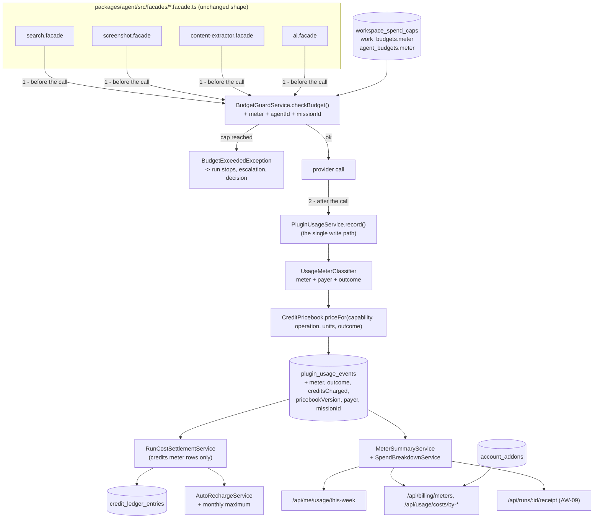

# Implementation Plan: Costs, caps and credits

> Translates [`spec.md`](./spec.md) into architecture and tech choices. The plan owns
> implementation detail; the spec owns behaviour. The ordered work lives in
> [`tasks.md`](./tasks.md).

**Epic ID**: `AW-17-costs-caps`
**Spec**: [`./spec.md`](./spec.md) · **Tasks**: [`./tasks.md`](./tasks.md)
**Status**: `Draft`
**Last updated**: 2026-09-06
**Blocking dependency**: AW-09 P2 must be merged (the receipt's cost block is the surface this
epic itemises into).

---

## 1. Current state in the codebase

Every path below was opened before it was written down.

### 1.1 The metering path — one choke point, no meter

| Concern | Where it lives today |
| --- | --- |
| The usage record | `packages/agent/src/entities/plugin-usage-event.entity.ts` — `capability` (`ai`, `mcp`, `search`, `screenshot`, `extractor`, `email`, `notification_channel`, `metrics`), `units`, `costCents`, `currency`, `modelId`, `metadata`, and attribution columns `agentId` / `taskId` / `runId` / `ownerType` + `ownerId`. |
| The single write path | `packages/agent/src/usage/plugin-usage.service.ts` — `record()`. Every facade calls it; nothing else writes the table. |
| Reads and aggregations | `packages/agent/src/database/repositories/plugin-usage.repository.ts` — 25 query methods including `getRunCostByPlugin`, `getSpendByModelForUser`, `getSpendByAgentForUser`, `getSpendByWorkForUser`, `getDailySpendByAgentForUser`, `findPageForUserExport`. |
| The callers | `packages/agent/src/facades/{ai,search,screenshot,content-extractor,email,notification-channel,metrics}.facade.ts` — each resolves a plugin, calls `budgetGuard.checkBudget(...)`, makes the call, then `pluginUsageService.record({...})` with `pricing?.costPerCallCents`. |
| Plugin-declared prices | `getPricing?(): PluginPricing` on every capability interface in `packages/plugin/src/contracts/capabilities/` (search, screenshot, content-extractor, email-provider, notification-channel, metrics-provider, connector). |
| Model cost metadata | `packages/agent/src/facades/model-catalog.ts` — `ModelCatalogEntry` with `inputCostPer1k` / `outputCostPer1k`. |

**The gap.** `PluginUsageEvent` has no meter, no outcome, no credits figure, no price-list
version and no Mission attribution. `record()` stores what a call *cost the platform*, never what
it *costs the owner* or *who paid the provider*.

### 1.2 Credits — one blended balance, priced after the fact

| Concern | Where it lives today |
| --- | --- |
| The ledger | `packages/agent/src/entities/credit-ledger-entry.entity.ts` — append-only, `kind` ∈ `purchase` / `grant` / `daily-free` / `consumption` / `adjustment` / `expiry`, bucket accounting with `remainingCredits` + nullable `expiresAt`, unique `idempotencyKey`, `refType` / `refId`. |
| Ledger writes | `packages/agent/src/subscriptions/credits/credit-ledger.service.ts` |
| Settlement | `packages/agent/src/subscriptions/credits/run-cost-settlement.service.ts` — sums a Run's usage rows at terminal, stamps `agent_runs.costCents`, converts the *billable share* into one `consumption` row keyed `run:{runId}`. |
| The own-key exemption | The same file. Provenance is re-resolved **at settlement** through `PluginSettingsService.getResolvedSettings`; the class constant `BYOK_EXEMPTION_UNRESOLVED_BILLS_FULL = true` documents that unresolvable provenance is billed at the platform rate. |
| The margin | `packages/agent/src/config/index.ts` → `billing.credits.getMarginPercent()` (env `CREDITS_MARGIN_PERCENT`, else the catalog value) and `getCreditsPerDollar()` (default 100). |
| Packs | `packages/agent/src/subscriptions/billing/credit-packs.ts` — server-authored table: `credits-1000` $10, `credits-5500` $50, `credits-25000` $200. |
| Pricing view | `packages/agent/src/subscriptions/billing/credits-pricing.ts` — `creditsPerDollar`, `marginPercent`, `dailyFreeCredits`, packs, pay-as-you-go tiers. |
| Monthly allowance | `packages/agent/src/subscriptions/credits/plan-credit-grant.service.ts` — one grant per **allowance month** anchored to the subscription, `expiresAt` = end of that month, ref type `plan-allowance`. |
| Daily allowance + expiry sweep | `packages/agent/src/subscriptions/credits/credits-sweep.service.ts`, driven by `packages/tasks/src/tasks/trigger/credits-daily-grant.task.ts` (`5 0 * * *`). |
| Overflow metering | `packages/agent/src/subscriptions/billing/payg.service.ts` + `packages/agent/src/entities/credit-meter-event.entity.ts`, flushed by `packages/tasks/src/tasks/trigger/credits-meter-flush.task.ts` (`*/5 * * * *`). Has a monthly cap in credits (`PAYG_MIN_MONTHLY_CAP_CREDITS = 500`, ceiling from `PAYG_MAX_MONTHLY_CAP_CREDITS`). |
| Auto-recharge | `packages/agent/src/subscriptions/billing/auto-recharge.service.ts` + the `autoRecharge*` columns on `packages/agent/src/entities/billing-profile.entity.ts`: enabled, threshold, pack id, single-flight key, failure count. **No monthly maximum anywhere.** |

**The gap.** One `consumption` row per Run, blended across every capability, priced as
`costCents × (1 + margin)`. Nothing records what kind of call the credits paid for; nothing
publishes a price before the call; a cached or failed call is priced exactly like a successful
one.

### 1.3 Caps — three mechanisms, one of them inert

| Concern | Where it lives today |
| --- | --- |
| Per-Work / Mission / Idea budget | `packages/agent/src/entities/work-budget.entity.ts` — `scope` (`global` / `plugin`), `monthlyCapCents`, `allowOverage`, polymorphic `ownerType` (`work` / `idea` / `mission` / `agent`, from `packages/agent/src/entities/_types.ts`) + `ownerId`. CRUD at `apps/api/src/budgets/budgets.controller.ts` (`api/works/:workId/budgets`). |
| Per-Agent budget | `packages/agent/src/entities/agent-budget.entity.ts` — `intervalUnit` (`hour`/`day`/`week`/`month`/`unlimited`), `intervalAnchor`, `capCents`, `allowOverage`, unique per `agentId`. **No controller anywhere calls its repository's `upsert()`.** |
| Enforcement | `packages/agent/src/budgets/budget-guard.service.ts` — `checkBudget(workId, userId, capability, pluginId)` called from each facade; period arithmetic in `packages/agent/src/budgets/budget.service.ts`; refusal via `packages/agent/src/budgets/budget-exceeded.exception.ts`. |
| Alerting | `packages/agent/src/budgets/budget-threshold-crossed.event.ts` → `apps/api/src/budgets/budget-alert.handler.ts`; thresholds `75` / `90` / `100` / `overage` from `packages/agent/src/entities/work-budget-alert-state.entity.ts`, one row per (budget, threshold, period). |
| Dispatch-time credit gate | `packages/agent/src/agents/run-dispatch-gate.service.ts` + `packages/agent/src/agents/run-credits-precheck.ts`, gated by `config.billing.credits.isEnforcementEnabled()`. |
| Per-Node daily model ceiling | `fleet_nodes.dailyCostCeilingCents` / `dailyCostTrippedOn`, added by `apps/api/src/migrations/1788300000000-AddFleetCostAccounting.ts`; editor at `apps/web/src/components/settings/FleetCostCeiling.tsx` with helpers in `apps/web/src/components/settings/fleet-cost-ceiling.shared.ts` and the contract constant `FLEET_MAX_DAILY_COST_CEILING_CENTS` in `packages/contracts/src/fleet/fleet-node.types.ts`. |
| The Agent read surface | `apps/api/src/agents/agents.controller.ts` → `GET /api/agents/:id/budget` returns `capCents: null` unconditionally; the page at `apps/web/src/app/[locale]/(dashboard)/agents/[id]/budgets/page.tsx` therefore always shows "no cap configured". |

**The gap.** No Workspace scope. No meter on any cap. The per-Agent cap cannot be set and reads
zero spend. Auto-recharge has no ceiling. The Fleet ceiling is invisible from Billing.

### 1.4 The money surfaces

| Surface | File |
| --- | --- |
| Billing page | `apps/web/src/app/[locale]/(dashboard)/settings/billing/page.tsx` → `apps/web/src/components/settings/BillingSettings.tsx` |
| Payment method | `apps/web/src/app/[locale]/(dashboard)/settings/billing/payment-method/page.tsx` → `apps/web/src/components/settings/PaymentMethodSettings.tsx` |
| Usage page (2 tabs) | `apps/web/src/app/[locale]/(dashboard)/settings/usage/page.tsx`, tab switch in `apps/web/src/components/settings/usage/UsageTabs.tsx`, Overview in `apps/web/src/components/settings/UsageCreditsSettings.tsx`, Costs in `apps/web/src/components/settings/costs/CostsSettings.tsx` (+ `CostsByModelList.tsx`, `CostsDailyStackedChart.tsx`) |
| Settings nav | `apps/web/src/app/[locale]/(dashboard)/settings/settings-layout-client.tsx` |
| Credits API | `apps/api/src/subscriptions/credits.controller.ts` (`api/credits`: `balance`, `pricing`, `ledger`, `usage-summary`, `usage/export`) |
| Costs API | `apps/api/src/subscriptions/costs.controller.ts` (`api/usage/costs`: `summary`, `daily`, `by-agent`, `by-model`, `top-runs`) |
| Billing API | `apps/api/src/billing/billing.controller.ts`, `payg.controller.ts`, `payment-method.controller.ts`, `plan-checkout.controller.ts`, `seats.controller.ts`, `billing-webhook.controller.ts` |
| Account-wide usage | `apps/api/src/budgets/account-usage.controller.ts` (`api/me/usage/account-wide` — drives the dashboard "Month Spend" tile) |
| Web proxies | `apps/web/src/app/api/credits/{ledger,usage-summary,usage/export}/route.ts` and `apps/web/src/app/api/usage/costs/[section]/route.ts` — each allowlists forwarded query params and matches `[section]` against a closed list |
| Retention | `apps/api/src/budgets/plugin-usage-cleanup.service.ts` — prunes usage rows older than 12 months under a distributed lock |
| Approvals surface | `apps/web/src/components/approvals/ApprovalsQueue.tsx`, backed by `apps/api/src/agent-approvals/agent-approvals.controller.ts` |
| Escalation record | `packages/agent/src/entities/agent-escalation.entity.ts` with reason codes in `packages/contracts/src/agents/escalation.types.ts` (already carries `budget-stop`) |

### 1.5 Summary of the delta

| # | Today | After this epic |
| --- | --- | --- |
| 1 | One blended balance | Three meters, classified at capture, stored on the row |
| 2 | Price derived from provider cost × margin | Published, versioned price list keyed on capability + operation |
| 3 | Own-key exemption guessed at settlement | Paying account class stamped at the call |
| 4 | Cached and failed calls priced like successes | Outcome on the row; both zero-rated |
| 5 | No Mission axis | `missionId` on the usage row; a third breakdown |
| 6 | Per-Agent cap unsettable, spend hard-coded `0` | Full CRUD, real aggregation, real refusal |
| 7 | No Workspace ceiling | `workspace_spend_caps`, per meter, no overage switch |
| 8 | Auto-recharge unbounded per month | Monthly maximum, hard refusal, one decision per month |
| 9 | Provisioned units unbilled and unexplained | `account_addons`, pro-rated, never touching credits |
| 10 | Money only in Settings | Home line, Billing breakdowns, receipt itemisation |

---

## 2. Architecture and the seam it plugs into

The whole epic hangs off **one existing choke point** — `PluginUsageService.record()` — plus
**one existing guard** — `BudgetGuardService.checkBudget()`. No facade grows new logic beyond
passing two extra fields it already knows.



Three deliberate choices:

1. **Classification at capture, never at read.** `UsageMeterClassifier` runs inside
   `record()`, where the caller's `FacadeOptions` still carry the resolved settings source. This
   is what retires `RunCostSettlementService.BYOK_EXEMPTION_UNRESOLVED_BILLS_FULL`: settlement
   stops re-resolving provenance and simply sums rows whose `meter = 'credits'`.
2. **Pricing keyed on capability + operation, never on a Plugin id.** `CreditPricebook` is a
   server-authored code table in the same style as `credit-packs.ts`. Constitution II is
   preserved by construction: swapping the search Plugin cannot change a price, because the price
   never mentions a Plugin.
3. **One guard, four scopes.** `BudgetGuardService` already resolves Work / Idea / Mission /
   Agent budgets through one polymorphic SQL path. Adding `workspace` as a fifth owner type and a
   `meter` filter keeps a single enforcement point rather than a second, parallel one.

---

## 3. Data model

### 3.1 Entity changes

**`packages/agent/src/entities/plugin-usage-event.entity.ts`** — six additive columns:

```ts
/** Which of the three meters this unit of spend belongs to. Never null on new rows. */
@Column({ type: 'varchar', length: 16, nullable: true })
meter?: UsageMeter | null;              // 'model' | 'credits' | 'addon' | null = pre-cutover

/** Who paid the provider. Stamped at the call, never re-derived. */
@Column({ type: 'varchar', length: 16, nullable: true })
payer?: UsagePayer | null;              // 'workspace' | 'platform' | 'unconfirmed'

/** Did the call actually do new work? Drives zero-rating. */
@Column({ type: 'varchar', length: 12, nullable: true })
outcome?: UsageOutcome | null;          // 'ok' | 'cached' | 'failed'

/** Credits charged for this row. 0 for model/addon meters and zero-rated outcomes. */
@Column({ type: 'int', default: 0 })
creditsCharged: number;

/** `capability.operation` key priced, plus the price-list version that priced it. */
@Column({ type: 'varchar', length: 64, nullable: true })
priceKey?: string | null;               // e.g. 'search.query', 'ai.managed.frontier'

@Column({ type: 'int', nullable: true })
priceVersion?: number | null;

/** Mission attribution, denormalised from the Task at record time. No FK — audit outlives. */
@Column({ type: 'uuid', nullable: true })
missionId?: string | null;
```

New indexes on the same entity:

```
idx_plugin_usage_meter_user_occurred   (userId, meter, occurredAt)
idx_plugin_usage_pricekey_user_occurred(userId, priceKey, occurredAt)
idx_plugin_usage_mission_occurred      (missionId, occurredAt)
```

New leaf types in `packages/agent/src/entities/_types.ts` (same cycle-break rationale as
`BudgetOwnerType`), re-exported from `packages/contracts/src/billing/meter.types.ts`:

```ts
export enum UsageMeter   { MODEL = 'model', CREDITS = 'credits', ADDON = 'addon' }
export enum UsagePayer   { WORKSPACE = 'workspace', PLATFORM = 'platform', UNCONFIRMED = 'unconfirmed' }
export enum UsageOutcome { OK = 'ok', CACHED = 'cached', FAILED = 'failed' }
```

**`packages/agent/src/entities/_types.ts`** — one new `BudgetOwnerType` member:

```ts
export enum BudgetOwnerType {
    WORK = 'work', IDEA = 'idea', MISSION = 'mission', AGENT = 'agent',
    /** AW-17 — the Workspace-wide ceiling. Owner = users.id (or organizations.id when scoped). */
    WORKSPACE = 'workspace',
}
```

**New: `packages/agent/src/entities/workspace-spend-cap.entity.ts`** (`workspace_spend_caps`)

```ts
@Entity({ name: 'workspace_spend_caps' })
@Index('uq_workspace_spend_caps_owner_meter', ['userId', 'organizationId', 'meter'], { unique: true })
export class WorkspaceSpendCap {
    id: string;                       // uuid pk
    userId: string;                   // uuid, owner
    organizationId?: string | null;   // uuid, null = personal Workspace scope
    tenantId?: string | null;         // uuid, Tier-C denorm, stamped by the scope subscriber
    meter: UsageMeter | 'all';        // varchar(16)
    capCents: number;                 // int, >= 100
    currency: string;                 // varchar(3), default 'usd'
    periodUnit: 'month';              // varchar(8) — calendar month in v1, room to grow
    state: 'ok' | 'warning' | 'stopped' | 'exceeded';  // varchar(12), materialised by the evaluator
    stoppedAt?: Date | null;          // PortableDateColumn
    version: number;                  // int, default 1 — optimistic concurrency for FR-20 / S20
    createdAt: Date; updatedAt: Date;
}
```

There is **no `allowOverage` column** — spec FR-45. That absence is the feature.

**`packages/agent/src/entities/work-budget.entity.ts`** and
**`packages/agent/src/entities/agent-budget.entity.ts`** — one additive column each:

```ts
/** Which meter this budget governs. NULL = all meters (the pre-AW-17 meaning). */
@Column({ type: 'varchar', length: 16, nullable: true })
meter?: UsageMeter | null;
```

Both keep `allowOverage` untouched — Constitution X, and spec FR-45's "label which is which".

**`packages/agent/src/entities/billing-profile.entity.ts`** — three additive columns:

```ts
/** Hard monthly ceiling on auto-recharge spend, in cents. NULL = auto-recharge cannot be on. */
@Column({ type: 'int', nullable: true })
autoRechargeMonthlyCapCents?: number | null;

/** `YYYY-MM` (UTC) the counter below belongs to. */
@Column({ type: 'varchar', length: 7, nullable: true })
autoRechargeMonthKey?: string | null;

/** Cents already auto-recharged inside `autoRechargeMonthKey`. Reset on roll-over. */
@Column({ type: 'int', default: 0 })
autoRechargeMonthSpentCents: number;
```

**New: `packages/agent/src/entities/account-addon.entity.ts`** (`account_addons`)

```ts
@Entity({ name: 'account_addons' })
@Index('idx_account_addons_user_status', ['userId', 'status'])
@Index('uq_account_addons_ref', ['addonCode', 'refType', 'refId'], { unique: true })
export class AccountAddon {
    id: string;
    userId: string;
    organizationId?: string | null;
    tenantId?: string | null;
    addonCode: string;                // varchar(64): 'agent-inbox' | 'fleet-node' | 'seat'
    refType?: string | null;          // varchar(32): 'tenant-email-address' | 'fleet-node' | null
    refId?: string | null;            // varchar(128) — not uuid: refs are not all uuids
    quantity: number;                 // int, default 1
    unitPriceCents: number;           // int, snapshot at activation — never re-read from a catalog
    currency: string;                 // varchar(3), default 'usd'
    status: 'pending' | 'active' | 'removed' | 'failed' | 'orphan';  // varchar(12)
    providerSubscriptionItemRef?: string | null;  // varchar(128), opaque
    activatedAt?: Date | null;
    removedAt?: Date | null;
    createdAt: Date; updatedAt: Date;
}
```

**New (not an entity): `packages/agent/src/subscriptions/billing/credit-pricebook.ts`** — the
published price list, in the exact style of `credit-packs.ts` (server-authored, not
env-configurable, ships with a test):

```ts
export interface CreditPrice {
    readonly key: string;        // 'search.query' — capability.operation, NEVER a plugin id
    readonly group: 'research' | 'data' | 'analysis' | 'models';
    readonly credits: number;    // per unit
    readonly unit: string;       // 'query' | 'page' | 'capture' | 'lookup' | '1k-tokens'
}
export const CREDIT_PRICEBOOK_VERSION = 4;
export const CREDIT_PRICEBOOK_EFFECTIVE_FROM = '2026-09-12';
export const CREDIT_PRICEBOOK: readonly CreditPrice[] = [ /* spec §6.4, verbatim */ ];
```

Historical versions are kept in the same file as a frozen map
(`CREDIT_PRICEBOOK_HISTORY: Record<number, readonly CreditPrice[]>`) so a receipt for an old Run
can render the price that actually applied (spec FR-22, S28) without a database read.

### 3.2 Migrations — forward-only, additive, one per phase

Constitution V: every entity change above ships its migration in the **same** pull request.

**`apps/api/src/migrations/1789700000000-AddUsageMeterClassification.ts`** (P1)
`up()`:
1. `ALTER TABLE plugin_usage_events ADD COLUMN meter varchar(16) NULL`, then `payer varchar(16)
   NULL`, `outcome varchar(12) NULL`, `creditsCharged int NOT NULL DEFAULT 0`,
   `priceKey varchar(64) NULL`, `priceVersion int NULL`, `missionId uuid NULL` — each guarded by
   a `hasColumn` check so a partially applied database converges.
2. Create the three indexes named in §3.1, each guarded by `hasIndex`.
3. **No backfill of `meter`.** Pre-cutover rows keep `meter IS NULL` and are reported under the
   "before meters were separated" label (spec FR-8, S23). Inferring a meter from `capability`
   would be exactly the guess the spec forbids.
4. Backfill `missionId` for rows that have a `taskId`, in batches of 5,000:
   `UPDATE plugin_usage_events pue SET "missionId" = t."missionId" FROM tasks t
    WHERE t.id = pue."taskId" AND pue."missionId" IS NULL AND t."missionId" IS NOT NULL`
   — additive, re-runnable, and safe to interrupt.
`down()`: drop the three indexes and the seven columns. No data is destroyed that existed before.

**`apps/api/src/migrations/1789710000000-AddSpendCapsAndMeterScopedBudgets.ts`** (P2)
`up()`:
1. `CREATE TABLE workspace_spend_caps` with the unique index
   `uq_workspace_spend_caps_owner_meter` — declared **in the migration**, not as a decorator
   `@Index`, because it is partial (`WHERE "organizationId" IS NULL` and its complement) for the
   same NULL-is-distinct reason documented on `work_budgets`.
2. `ALTER TABLE work_budgets ADD COLUMN meter varchar(16) NULL`;
   `ALTER TABLE agent_budgets ADD COLUMN meter varchar(16) NULL`. NULL keeps today's meaning.
3. `ALTER TABLE billing_profiles` add `autoRechargeMonthlyCapCents int NULL`,
   `autoRechargeMonthKey varchar(7) NULL`, `autoRechargeMonthSpentCents int NOT NULL DEFAULT 0`.
4. Backfill: for every `billing_profiles` row with `autoRechargeEnabled = true` and no ceiling,
   set `autoRechargeMonthlyCapCents = 10000` ($100, the shipped default) so no existing
   auto-recharge is silently left unbounded and none is silently switched off.
`down()`: drop the table and the five columns.

**`apps/api/src/migrations/1789720000000-AddAccountAddons.ts`** (P3)
`up()`: `CREATE TABLE account_addons` with both indexes; backfill one `active` row per existing
agent inbox (`tenant_email_addresses`) and per enrolled `fleet_nodes` row, with
`status = 'pending'` and `unitPriceCents` from the shipped catalogue, so nothing is billed until
an operator confirms the backfill. `down()`: `DROP TABLE account_addons`.

Every migration is generated with
`cd apps/api && pnpm typeorm migration:generate -d typeorm.config.ts src/migrations/<Name>` and
then hand-edited to add the guards and the batched backfills.

Both new entities must also be registered in
`packages/agent/src/database/_entities-inventory.ts` and exported from
`packages/agent/src/entities/index.ts` — this repo has no `autoLoadEntities`, and a
`forFeature`'d but unregistered entity throws on first query.

### 3.3 Contracts

New file `packages/contracts/src/billing/meter.types.ts`, exported through
`packages/contracts/src/billing/index.ts` and `packages/contracts/src/index.ts`:

```ts
export type UsageMeterId = 'model' | 'credits' | 'addon';
export type UsagePayerId = 'workspace' | 'platform' | 'unconfirmed';
export type UsageOutcomeId = 'ok' | 'cached' | 'failed';
export type SpendCapScope = 'workspace' | 'agent' | 'mission' | 'work' | 'node';
export type SpendCapState = 'ok' | 'warning' | 'stopped' | 'exceeded';
export type AddonCode = 'agent-inbox' | 'fleet-node' | 'seat';
export type AddonStatus = 'pending' | 'active' | 'removed' | 'failed' | 'orphan';

export const SPEND_CAP_MIN_CENTS = 100;                 // $1.00
export const SPEND_CAP_THRESHOLDS = [75, 90, 100] as const;
export const SPEND_CAP_PROPAGATION_MS = 30_000;         // FR-47
export const AUTO_RECHARGE_MONTHLY_CAP_DEFAULT_CENTS = 10_000;   // $100
export const AUTO_RECHARGE_MONTHLY_CAP_MIN_CENTS = 1_000;        // $10
export const AUTO_RECHARGE_MONTHLY_CAP_MAX_CENTS = 200_000;      // $2,000
export const AUTO_RECHARGE_MAX_CONSECUTIVE_FAILURES = 3;
export const ADDON_MAX_UNITS_PER_KIND = 25;
export const USAGE_CACHE_FRESHNESS_HOURS = 24;
export const USAGE_EXPORT_MAX_ROWS = 50_000;
export const USAGE_EXPORT_MAX_DAYS = 92;
export const BREAKDOWN_TOP_N = 10;
export const UNCONFIRMED_PAYER_ALERT_RATIO = 0.001;              // FR-7
```

One additive member on `packages/contracts/src/agents/escalation.types.ts` — the file's own
comment permits adding, never renaming:

```ts
| 'credits-exhausted'   // the balance could not cover the call; distinct from 'budget-stop'
```

`AGENT_ESCALATION_REASON_CODES` gains the same value.

---

## 4. API

Every route is session-guarded and owner-scoped; none accepts a user, Organization or tenant
selector from the caller (spec FR-75). Money-moving routes keep the existing fail-closed posture:
`BillingProviderNotConfiguredError` → `503`, never a silent success.

### 4.1 New — `apps/api/src/billing/meters.controller.ts` → `@Controller('api/billing/meters')`

| Method | Path | Response | Notes |
| --- | --- | --- | --- |
| GET | `/api/billing/meters` | `MetersSummaryDto` | `?period=this-month\|last-month\|7d\|30d\|90d` (default `this-month`). Three cards + the pre-cutover residual. |

```ts
interface MetersSummaryDto {
    period: { id: string; startsAt: string; endsAt: string; timezone: string };
    currency: string;
    model:   { costCents: number | null; accounts: { label: string; costCents: number | null }[];
               tokens: { input: number; output: number; cachedRead: number } };
    credits: { used: number; allowanceUsed: number; allowanceTotal: number;
               packBalance: number; allowanceExpiresAt: string | null;
               capCents: number | null; capUsedPercent: number | null };
    addons:  { monthlyCents: number; lines: { code: AddonCode; label: string; quantity: number }[] };
    preMeterResidual: { credits: number; sinceLabel: string } | null;
}
```

### 4.2 New — `apps/api/src/billing/price-list.controller.ts` → `@Controller('api/billing/price-list')`

| Method | Path | Auth | Notes |
| --- | --- | --- | --- |
| GET | `/api/billing/price-list` | session | Returns the current version, its effective date, the grouped entries and `creditsPerDollar`. `?version=3` returns a historical version from `CREDIT_PRICEBOOK_HISTORY`. Readable with no payment provider configured (spec FR-23). |

### 4.3 New — `apps/api/src/budgets/spend-caps.controller.ts` → `@Controller('api/spend-caps')`

| Method | Path | Body / query | Notes |
| --- | --- | --- | --- |
| GET | `/api/spend-caps` | — | One list across all five scopes: `workspace_spend_caps`, `work_budgets` (Work / Mission / Idea rows), `agent_budgets`, and the read-only Fleet node ceilings. Each row carries `scope`, `targetId`, `targetLabel`, `targetArchived`, `meter`, `period`, `capCents`, `spentCents`, `percent`, `state`, `editable`, `allowOverage`, `version`. |
| POST | `/api/spend-caps` | `CreateSpendCapDto` | `{ scope, targetId?, meter, periodUnit, capCents }`. `409` when a cap already exists for that (scope, target, meter). Routes to the right table by `scope`. |
| PATCH | `/api/spend-caps/:id` | `UpdateSpendCapDto` + `If-Match: <version>` | `409 CAP_VERSION_CONFLICT` with the current value in the body when the version is stale (spec S20). |
| DELETE | `/api/spend-caps/:id` | — | Idempotent. |

`scope = 'node'` rows are `editable: false`; `POST`/`PATCH`/`DELETE` against one returns `400`
with `NODE_CEILING_READ_ONLY` and the Fleet route to use (spec FR-56).
Write routes require billing permission; read requires Workspace read.
`@Throttle({ long: { limit: 30, ttl: 60_000 } })` on every write, matching the Agents controller.

### 4.4 New — `apps/api/src/agents/agent-budget.controller.ts` → `@Controller('api/agents/:agentId/budget')`

| Method | Path | Notes |
| --- | --- | --- |
| GET | `/api/agents/:agentId/budget` | Real `capCents`, real `spentCents` for the current period, `meter`, `intervalUnit`, `allowOverage`, `state`. |
| PUT | `/api/agents/:agentId/budget` | Upsert — finally calls the repository `upsert()` that has existed unused. |
| DELETE | `/api/agents/:agentId/budget` | Remove the cap. |

`apps/api/src/agents/agents.controller.ts`'s existing `GET /api/agents/:id/budget` is **kept**
(Constitution X) and changed to delegate to the same service, so it stops returning
`capCents: null` unconditionally.

### 4.5 New — `apps/api/src/billing/addons.controller.ts` → `@Controller('api/billing/addons')`

| Method | Path | Notes |
| --- | --- | --- |
| GET | `/api/billing/addons` | Active, pending, removed and orphan lines + the monthly total. |
| GET | `/api/billing/addons/preview` | `?code=&quantity=` → `{ proratedCents, fullMonthlyCents, periodEndsAt }` (spec FR-37). |
| POST | `/api/billing/addons` | `{ code, refType?, refId?, quantity }`. `409` on the unique ref. `400 ADDON_LIMIT_REACHED` above 25 per kind. |
| DELETE | `/api/billing/addons/:id` | Pro-rated credit + provider quantity update. `seat` rows return `400 SEAT_MANAGED_ELSEWHERE`. |

### 4.6 Extended — existing controllers

| File | Change |
| --- | --- |
| `apps/api/src/budgets/account-usage.controller.ts` | New `GET /api/me/usage/this-week` — the Home line. Returns the three figures plus `stoppedBy: { capId, label } \| null`. Cached 60 s per user. |
| `apps/api/src/subscriptions/costs.controller.ts` | Three new sections on the existing `api/usage/costs` prefix: `by-tool`, `by-mission`, `by-meter`. Same shape as `by-agent`. |
| `apps/api/src/subscriptions/credits.controller.ts` | `GET /api/credits/usage/export` gains the columns `meter`, `priceKey`, `outcome`, `creditsCharged`, `priceVersion`, `missionId`; refuses above 50,000 rows / 92 days **before** streaming (spec FR-80). `GET /api/credits/pricing` gains `pricebookVersion`. |
| `apps/api/src/billing/billing.controller.ts` | `GET/PUT /api/billing/auto-recharge` gain `monthlyCapCents` and read-only `monthlyUsedCents`. `PUT` with `enabled: true` and no `monthlyCapCents` → `400 AUTO_RECHARGE_CAP_REQUIRED` (spec FR-60). |
| `apps/api/src/billing/billing-webhook.controller.ts` | On a confirmed auto-recharge purchase, increments `autoRechargeMonthSpentCents` inside the same transaction that credits the ledger. Remains the sole writer of provider-confirmed state. |

### 4.7 Next.js proxies

- `apps/web/src/app/api/usage/costs/[section]/route.ts` — extend the closed `[section]`
  allowlist with `by-tool`, `by-mission`, `by-meter`. Nothing else changes; unknown sections keep
  404-ing before reaching the API.
- New `apps/web/src/app/api/billing/meters/route.ts` and
  `apps/web/src/app/api/billing/price-list/route.ts` — same pattern: forward the auth cookie as a
  Bearer token, allowlist `period` and `version` explicitly, never forward the raw query string.

---

## 5. Web

### 5.1 Routes

| Route | File | New? |
| --- | --- | --- |
| `/settings/billing` | `apps/web/src/app/[locale]/(dashboard)/settings/billing/page.tsx` | modified — three meter cards and the breakdown block mount above the existing sections, which are untouched |
| `/settings/billing/caps` | `apps/web/src/app/[locale]/(dashboard)/settings/billing/caps/page.tsx` | **new** |
| `/settings/billing/price-list` | `apps/web/src/app/[locale]/(dashboard)/settings/billing/price-list/page.tsx` | **new** |
| `/settings/billing/addons` | `apps/web/src/app/[locale]/(dashboard)/settings/billing/addons/page.tsx` | **new** |
| `/settings/usage?tab=breakdown` | `apps/web/src/components/settings/usage/UsageTabs.tsx` + `usage-tabs.shared.ts` | modified — a third tab beside Overview and Costs |

Sub-routes of `/settings/billing` are reached from the Billing page itself, so
`apps/web/src/app/[locale]/(dashboard)/settings/settings-layout-client.tsx` gains **no** new
top-level tabs — the settings tree is already 18 items deep and this epic does not lengthen it.

### 5.2 Components

| Component | File | Notes |
| --- | --- | --- |
| `MeterCards` | `apps/web/src/components/settings/billing/MeterCards.tsx` | Server component. Three cards, spec §6.2. Renders zero-states as sentences, never blank boxes. |
| `SpendBreakdown` | `apps/web/src/components/settings/billing/SpendBreakdown.tsx` | Client. Three panels fetched independently (`Promise.allSettled`) so one failing never blanks the others (spec S27). |
| `CreditPriceList` | `apps/web/src/components/settings/billing/CreditPriceList.tsx` | Server. Pure render of the price-list payload; grouped, with the version footer. |
| `SpendCapsTable` | `apps/web/src/components/settings/billing/SpendCapsTable.tsx` | Client. Rows for all five scopes; `editable: false` rows link out instead of opening the dialog. |
| `SpendCapDialog` | `apps/web/src/components/settings/billing/SpendCapDialog.tsx` | Client. Spec §6.6. Focus-trapped, `Esc` closes, `Enter` submits, sends `If-Match`. |
| `AddonsList` | `apps/web/src/components/settings/billing/AddonsList.tsx` | Client. Pro-ration preview before confirm; removal confirmation quotes the credit. |
| `WeekSpendCard` | `apps/web/src/components/spend/WeekSpendCard.tsx` | Client, **self-contained**. Mounted by Home (AW-19) and, until AW-19 lands, at the top of `BillingSettings.tsx`. Polls at 60 s, pauses on `document.hidden`. |
| `RunCostMeters` | `apps/web/src/components/runs/RunCostMeters.tsx` | Client. Fills AW-09's receipt Cost block with the three-meter itemisation of spec §6.8. |
| shared helpers | `apps/web/src/components/settings/billing/spend-format.shared.ts` | Pure cents/credits formatters, unit-tested without React — same pattern as `fleet-cost-ceiling.shared.ts`. |

### 5.3 State and data fetching

- Period selection lives in the URL (`?period=`), parsed server-side, exactly as
  `apps/web/src/app/[locale]/(dashboard)/settings/usage/page.tsx` already does with
  `parseUsagePeriod`. Reload reproduces the view.
- The Billing page fetches meters, breakdowns, caps and add-ons with `Promise.allSettled`;
  only the meters call is rethrown (the page cannot render truthfully without it), matching the
  posture already documented on the Work Agent settings page. Everything else degrades to its own
  error card.
- `WeekSpendCard` fetches through the Next.js proxy, revalidates every 60 s, and stops entirely
  while the tab is hidden (spec FR-67).
- Cap writes are optimistic **only** for the row's own state chip; the cap value itself is
  re-read from the response so a `409` never leaves a wrong number on screen.
- Nothing on these surfaces subscribes to a socket. Polling matches the rest of the dashboard.

---

## 6. Background work

Constitution IV: every job is registered through the configured job-runtime provider and
dispatched through a `*_DISPATCHER` DI symbol. No call site imports a third-party SDK directly.

| Job | Kind | Cadence | File | What it does |
| --- | --- | --- | --- | --- |
| `spend-cap-evaluate` | `schedules.task` | `*/10 * * * *` | `packages/tasks/src/tasks/trigger/spend-cap-evaluate.task.ts` | Recomputes current-period spend for every cap, materialises `state`, fires `BudgetThresholdCrossedEvent` for newly crossed 75 / 90 / 100, raises the decision on entering `stopped`, and rolls `workspace_spend_caps.state` back to `ok` when a period turns over. Idempotent through the existing per-(budget, threshold, period) alert-state rows. |
| `usage-mission-backfill` | one-shot fan-out | manual | `packages/tasks/src/tasks/trigger/usage-mission-backfill.task.ts` | Finishes the batched `missionId` backfill outside the migration for very large tables. Re-runnable; a completed batch is a no-op. |
| `addon-reconcile` | `schedules.task` | `17 3 * * *` | `packages/tasks/src/tasks/trigger/addon-reconcile.task.ts` | Reconciles `account_addons` against the provider subscription and against the provisioned units; flips vanished units to `orphan` (spec FR-40) and stops billing them. |
| `credits-daily-grant` | existing | `5 0 * * *` | `packages/tasks/src/tasks/trigger/credits-daily-grant.task.ts` | Unchanged. Also resets `autoRechargeMonthSpentCents` when `autoRechargeMonthKey` is stale. |
| `credits-meter-flush` | existing | `*/5 * * * *` | `packages/tasks/src/tasks/trigger/credits-meter-flush.task.ts` | Unchanged. |
| `PluginUsageCleanupService.pruneOldEvents` | existing Nest cron | `EVERY_DAY_AT_4AM` | `apps/api/src/budgets/plugin-usage-cleanup.service.ts` | Unchanged; the 12-month retention window is what spec FR-81 and S24 describe. |

New dispatcher symbols in `packages/agent/src/tasks/_tasks-symbols.ts`, bound in
`packages/agent/src/tasks/job-runtime.providers.ts`:
`SPEND_CAP_EVALUATE_DISPATCHER`, `USAGE_MISSION_BACKFILL_DISPATCHER`,
`ADDON_RECONCILE_DISPATCHER`.

Mutual exclusion: the cap evaluator claims each cap row with an atomic
`UPDATE … SET evaluatingAt = now() WHERE evaluatingAt IS NULL OR evaluatingAt < now() - interval '5 minutes'`
— it owns a row, so it does not need `DistributedTaskLockService`. The add-on reconciler has no
owning row and takes the distributed lock instead.

---

## 7. Plugin boundaries

- **No new plugin package.** Every priced call already reaches a provider through an existing
  capability facade. Constitution I is satisfied because nothing external is added.
- **No hardcoded plugin id outside a plugin.** `CREDIT_PRICEBOOK` keys are
  `capability.operation` strings (`search.query`, `screenshot.capture`, `extractor.page`,
  `ai.managed.frontier`). A test in
  `packages/agent/src/subscriptions/billing/credit-pricebook.spec.ts` asserts that **no
  price key matches any registered plugin id**, so Constitution II is enforced by CI rather than
  by review.
- **Plugin-declared prices stay advisory.** `getPricing()` continues to feed `costCents` — the
  provider's own cost, used for meter 1 display and for operator margin analysis. It does **not**
  feed `creditsCharged`; credits come from the pricebook only. The two numbers are stored side by
  side deliberately so a drift between them is visible rather than blended.
- **Model tiers** (`ai.managed.fast` / `.balanced` / `.frontier`) resolve from the cost metadata
  in `packages/agent/src/facades/model-catalog.ts` (`inputCostPer1k` / `outputCostPer1k`) through
  a small pure function in the pricebook file, not from a hardcoded model list. A model with no
  catalog entry has no price key — see spec §9's first open question.
- **Payer resolution** reads the same `ResolvedSetting.source` that
  `RunCostSettlementService` reads today, but at call time, inside `BaseFacadeService`'s
  `getResolvedSettings` result which the facade already has in hand. No new plugin API.

---

## 8. i18n

All new keys in `apps/web/messages/en.json`. Leaf key names are camelCase and contain no literal
dot — a dot in a leaf name is rejected by the runtime and reds several e2e shards at once.

```
dashboard.settings.billing.meters.title            "Meters"
dashboard.settings.billing.meters.modelTitle       "Model usage"
dashboard.settings.billing.meters.modelSubtitle    "paid to your own provider accounts"
dashboard.settings.billing.meters.modelNoMarkup    "We add nothing to this figure."
dashboard.settings.billing.meters.modelEmpty       "No model usage yet. Connect a model account to keep this at zero on our side."
dashboard.settings.billing.meters.modelNotPriced   "Not priced by this provider"
dashboard.settings.billing.meters.creditsTitle     "Credits"
dashboard.settings.billing.meters.creditsAllowance "{used} allowance used"
dashboard.settings.billing.meters.creditsPacks     "{used} from packs"
dashboard.settings.billing.meters.creditsLeft      "{left} left · no expiry"
dashboard.settings.billing.meters.creditsCap       "Cap {amount} · {percent}% used"
dashboard.settings.billing.meters.creditsEmpty     "No credits used yet. Your allowance renews on {date}."
dashboard.settings.billing.meters.addonsTitle      "Add-ons"
dashboard.settings.billing.meters.addonsNoCredits  "Never draws credits."
dashboard.settings.billing.meters.addonsEmpty      "No add-ons."
dashboard.settings.billing.meters.noOverlap        "Each unit of spend belongs to exactly one of these three. They never overlap."
dashboard.settings.billing.meters.paymentsOff      "Card payments are not enabled on this deployment. Usage, caps and the price list still work."
dashboard.settings.billing.meters.loadError        "We could not load your meters."

dashboard.settings.billing.breakdown.title         "Where the credits went"
dashboard.settings.billing.breakdown.byTool        "By tool"
dashboard.settings.billing.breakdown.byAgent       "By Agent"
dashboard.settings.billing.breakdown.byMission     "By Mission"
dashboard.settings.billing.breakdown.everythingElse "Everything else"
dashboard.settings.billing.breakdown.noMission     "Not in a Mission"
dashboard.settings.billing.breakdown.seeAll        "See all"
dashboard.settings.billing.breakdown.panelError    "We could not load spend by {dimension}."
dashboard.settings.billing.breakdown.preMeter      "{credits} credits are from records made before meters were separated (before {date})."

dashboard.settings.billing.priceList.title         "Credit price list"
dashboard.settings.billing.priceList.version       "Version {version} · in effect since {date}"
dashboard.settings.billing.priceList.lead          "What one call costs. Cached results and failed calls cost nothing."
dashboard.settings.billing.priceList.notCharged    "not charged by us"
dashboard.settings.billing.priceList.historyNote   "Earlier calls were priced at version {version}. Nothing is ever re-priced."
dashboard.settings.billing.priceList.rate          "{credits} credits = {money}."
dashboard.settings.billing.priceList.groupResearch "Research"
dashboard.settings.billing.priceList.groupData     "Data"
dashboard.settings.billing.priceList.groupAnalysis "Analysis"
dashboard.settings.billing.priceList.groupModels   "Models"

dashboard.settings.billing.caps.title              "Caps"
dashboard.settings.billing.caps.lead               "A cap is a refusal. When it is reached, the next call does not happen."
dashboard.settings.billing.caps.add                "Add a cap"
dashboard.settings.billing.caps.scope              "Scope"
dashboard.settings.billing.caps.target             "Target"
dashboard.settings.billing.caps.meter              "Meter"
dashboard.settings.billing.caps.period             "Period"
dashboard.settings.billing.caps.cap                "Cap"
dashboard.settings.billing.caps.spent              "Spent"
dashboard.settings.billing.caps.stateOk            "ok"
dashboard.settings.billing.caps.stateWarning       "warning"
dashboard.settings.billing.caps.stateStopped       "stopped"
dashboard.settings.billing.caps.stateExceeded      "exceeded"
dashboard.settings.billing.caps.overageOn          "overage on"
dashboard.settings.billing.caps.overageHint        "This older budget warns instead of stopping. Workspace caps always stop."
dashboard.settings.billing.caps.readOnly           "read-only"
dashboard.settings.billing.caps.hardStopHint       "This is a hard stop. {target} will stop spending on this meter when it reaches {amount}, until {date}."
dashboard.settings.billing.caps.stoppedBanner      "{target} is stopped."
dashboard.settings.billing.caps.openDecision       "Open the decision"
dashboard.settings.billing.caps.empty              "No caps yet. Nothing is stopping your agents from spending."
dashboard.settings.billing.caps.loadError          "We could not load your caps."
dashboard.settings.billing.caps.minAmount          "Enter an amount of at least {amount}."
dashboard.settings.billing.caps.duplicate          "{target} already has a cap on this meter. Edit that one instead."
dashboard.settings.billing.caps.alreadySpent       "{target} has already spent {amount} this period. This cap will stop it immediately."
dashboard.settings.billing.caps.conflict           "This cap was changed to {amount} by {name} a moment ago. Reload to see the current value."
dashboard.settings.billing.caps.noPermission       "You need billing permission to change this."

dashboard.settings.billing.addons.title            "Add-ons"
dashboard.settings.billing.addons.summary          "{amount} per month · never draws credits"
dashboard.settings.billing.addons.agentInbox       "Agent inbox"
dashboard.settings.billing.addons.fleetNode        "Dedicated computer"
dashboard.settings.billing.addons.seats            "Extra seats"
dashboard.settings.billing.addons.manageSeats      "Manage seats"
dashboard.settings.billing.addons.active           "active"
dashboard.settings.billing.addons.removedOn        "removed {date}"
dashboard.settings.billing.addons.proration        "Adding one now costs {prorated} for the rest of this period, then {full} per month."
dashboard.settings.billing.addons.removeConfirm    "Remove this add-on? You will be credited {amount} for the rest of this period, and you will not be billed for it from {date}."
dashboard.settings.billing.addons.orphan           "This add-on's inbox no longer exists. It has not been billed since {date}."
dashboard.settings.billing.addons.removeLine       "Remove the line"
dashboard.settings.billing.addons.limitReached     "You can have at most {max} of these. Remove one first."

dashboard.settings.billing.autoRecharge.monthlyCap     "Monthly maximum"
dashboard.settings.billing.autoRecharge.monthlyCapHint "Auto-recharge will never spend more than this in a calendar month."
dashboard.settings.billing.autoRecharge.monthlyCapUsed "{used} of {cap} used this month"
dashboard.settings.billing.autoRecharge.capRequired    "Set a monthly maximum before turning auto-recharge on."
dashboard.settings.billing.autoRecharge.disabledAfterFailures "Auto-recharge turned itself off after {count} failed attempts. Check your payment method and turn it back on."

dashboard.spendWeek.title           "This week"
dashboard.spendWeek.credits         "{used} of {allowance} credits"
dashboard.spendWeek.ownModels       "{amount} own models"
dashboard.spendWeek.addons          "{amount} add-ons"
dashboard.spendWeek.renews          "Allowance renews {date} · {remaining} left"
dashboard.spendWeek.loading         "Loading this week's spend…"
dashboard.spendWeek.empty           "Nothing spent this week."
dashboard.spendWeek.error           "We could not load this week's spend."
dashboard.spendWeek.stopped         "Stopped — {capName} reached."
dashboard.spendWeek.openDecisions   "Open decisions"

dashboard.runs.receipt.cost.modelPaidBy       "Billed by your provider to your account \"{label}\". Ever Works adds nothing."
dashboard.runs.receipt.cost.creditsLine       "{charged} charged · {cached} from cache"
dashboard.runs.receipt.cost.failedNoCharge    "{count} failed, no charge"
dashboard.runs.receipt.cost.forcedFresh       "forced fresh"
dashboard.runs.receipt.cost.addonsNotApplicable "Not applicable to a single run."
dashboard.runs.receipt.cost.pricedAt          "Priced at credit price list version {version}."
dashboard.runs.receipt.cost.unconfirmedPayer  "We could not confirm which account paid for this call."
dashboard.runs.receipt.cost.mismatch          "These lines do not add up to the settled total. We are showing both."
dashboard.runs.receipt.cost.agedOut           "Itemised usage for this Run is older than 12 months and is no longer retained. The total is unchanged."

dashboard.approvals.spend.capTitle        "{target} reached its {amount} {period} cap"
dashboard.approvals.spend.capBody         "{target} stopped mid-run on \"{mission}\". Its {meter} cap for {month} is fully used. The cap resets on {date}."
dashboard.approvals.spend.raiseTo         "Raise to {amount}"
dashboard.approvals.spend.raiseOther      "Raise to a different amount"
dashboard.approvals.spend.leaveStopped    "Leave it stopped"
dashboard.approvals.spend.rechargeTitle   "Auto-recharge reached its {amount} monthly maximum"
dashboard.approvals.spend.rechargeBody    "We did not charge your card. Your balance is {credits} credits."
dashboard.approvals.spend.raiseMaximum    "Raise the maximum"
dashboard.approvals.spend.buyPack         "Buy a pack now"
dashboard.approvals.spend.leaveOff        "Leave it off until {date}"

dashboard.settings.usage.tabs.breakdown   "Breakdown"

errors.billing.capVersionConflict   "That cap changed while you were editing it."
errors.billing.nodeCeilingReadOnly  "This ceiling is set on the computer itself."
errors.billing.autoRechargeCapRequired "Auto-recharge needs a monthly maximum."
errors.billing.addonLimitReached    "You have reached the limit for this add-on."
errors.billing.seatManagedElsewhere "Seats are changed on the seats control."
errors.billing.exportTooLarge       "That is more than {max} rows. Narrow the period and try again."
```

---

## 9. Telemetry and failure modes

### 9.1 Analytics (PostHog, through `packages/monitoring/`)

| Event | Properties | Why |
| --- | --- | --- |
| `spend_meter_viewed` | `period`, `meter` | Does anyone actually read the cards? |
| `price_list_viewed` | `version`, `entry_clicked` | Is a published price changing behaviour? |
| `spend_cap_created` | `scope`, `meter`, `period`, `cap_cents` | Which scope people reach for first |
| `spend_cap_stopped` | `scope`, `meter`, `cap_cents`, `overshoot_cents` | How often a cap actually bites |
| `spend_cap_raised_from_decision` | `scope`, `from_cents`, `to_cents` | Is the decision the right place to fix it? |
| `auto_recharge_ceiling_hit` | `cap_cents`, `month_spent_cents` | The runaway case we are protecting against |
| `addon_added` / `addon_removed` | `code`, `prorated_cents` | Add-on churn |
| `usage_export_refused` | `reason`, `rows`, `days` | Is the 50,000 / 92-day bound wrong? |

### 9.2 Operational counters and alerts

| Counter | Alert |
| --- | --- |
| `usage.payer.unconfirmed_ratio` | Page when it exceeds **0.1%** of metered calls over a rolling 24 h (spec FR-7). |
| `usage.pricebook.miss` | Page on any occurrence — a priced kind of call with no entry means the platform gave something away (spec FR-4). |
| `usage.record.write_failed` | Warn above 10 in 5 minutes. Never fails a Run (spec FR-84). |
| `spend_cap.check_latency_p95` | Warn above 15 ms (spec FR-87). |
| `spend_cap.double_stop` | Page on any occurrence — the concurrency guard leaked (spec FR-50). |
| `addon.orphan_count` | Warn above 0 for more than 24 h. |

### 9.3 Activity log

`apps/api/src/activity-log/` gains four entry types, each attributed to the acting user with old
and new values: `spend_cap_created`, `spend_cap_updated`, `spend_cap_deleted`,
`auto_recharge_cap_updated` (spec FR-57). Add-on add and remove are logged as
`addon_added` / `addon_removed` with the code and the pro-rated amount — never a card detail.

### 9.4 Failure modes

| Failure | Handling |
| --- | --- |
| The classifier throws | Record the row with `payer = 'unconfirmed'`, `meter = 'credits'`, price it, increment the counter. Never drop the row, never fail the call. |
| The pricebook has no entry | `creditsCharged = 0`, `priceKey` stored anyway, page the operator. The call still happens. |
| `record()` fails entirely | Log, increment `usage.record.write_failed`, return `null` exactly as today. The Run is unaffected. |
| The cap evaluator is down | Caps still refuse: `checkBudget` computes spend live on the hot path; the evaluator only *materialises* state and fires threshold events. A stale `state` chip is a display lag, never a missed refusal. |
| The credit ledger is unreachable at settlement | Unchanged from today: best-effort, the Run is never failed, an `AI_CREDITS` notification fires. |
| The payment provider is unreachable | `BillingProviderNotConfiguredError` → `503`; the meters, breakdowns, caps and price list all still render (spec S13). |
| Two concurrent cap crossings | The alert-state row's unique (cap, threshold, period) key makes the second a no-op; the decision writer uses the escalation `dedupKey` (`budget-stop:{capId}:{period}`) for the same reason. |
| A cap references an archived Agent | The row renders with `targetArchived: true` and only `Remove cap` (spec S21). Historical spend still resolves because usage rows carry no FK to `agents`. |
| An add-on's unit is deleted without the hook firing | `addon-reconcile` flips it to `orphan` within 24 h and stops billing it. |

---

## 10. Test plan

### 10.1 Unit — agent package (Jest)

| File | Asserts |
| --- | --- |
| `packages/agent/src/subscriptions/billing/credit-pricebook.spec.ts` | Every entry has a positive credit price and a unit; **no price key equals any registered plugin id** (Constitution II); the historical map is frozen and contains every version ever shipped; `priceFor` returns 0 for `cached` and `failed`. |
| `packages/agent/src/usage/usage-meter-classifier.spec.ts` | The classification function is total: every (capability, payer, kind) triple maps to exactly one meter; workspace-owned → `model`; platform → `credits`; unresolvable → `credits` + `unconfirmed`; a provisioned unit never reaches the classifier. |
| `packages/agent/src/usage/plugin-usage.service.spec.ts` | `record()` stamps meter, payer, outcome, credits, price key, version and `missionId`; a classifier throw still writes a row; a repository throw returns `null` and does not rethrow. |
| `packages/agent/src/subscriptions/credits/run-cost-settlement.service.spec.ts` | Settlement sums **only** `meter = 'credits'` rows; a Run made entirely on workspace-owned credentials produces no ledger row; the `run:{runId}` idempotency key still holds; the old provenance re-resolution path is gone. |
| `packages/agent/src/budgets/budget-guard.service.spec.ts` | Workspace owner type resolves; the meter filter narrows correctly; the strictest of several caps wins and is named; a 100% cap refuses; `allowOverage` still permits on the legacy budgets and is absent on Workspace caps. |
| `packages/agent/src/budgets/spend-cap.service.spec.ts` | Period arithmetic for `month` and the Agent rolling units; state transitions `ok → warning → stopped`; lowering below spend goes straight to `exceeded`; version conflict throws. |
| `packages/agent/src/subscriptions/billing/auto-recharge.service.spec.ts` | A recharge crossing the monthly maximum places **no** provider call; the month counter rolls on a new `YYYY-MM`; the single-flight guard still holds; 3 consecutive failures disable. |
| `packages/agent/src/subscriptions/billing/addon.service.spec.ts` | Pro-ration maths on add and remove for a 28-, 30- and 31-day period; the 25-per-kind limit; a `seat` code is refused; an orphan is never billed. |
| `packages/agent/src/entities/__tests__/workspace-spend-cap.entity.spec.ts` | No `allowOverage` column exists; every date column is portable; both scope columns exist so `apps/api/src/scope/scope-stamping.subscriber.ts` will stamp them. |
| `packages/agent/src/entities/__tests__/account-addon.entity.spec.ts` | Same shape checks plus the unique ref index name. |

### 10.2 Controller specs — API (Jest, beside the controller)

| File | Asserts |
| --- | --- |
| `apps/api/src/billing/meters.controller.spec.ts` | Three cards for each of the five periods; the pre-cutover residual is separate and never folded in; owner scoping; a 503 from the provider does not blank usage. |
| `apps/api/src/billing/price-list.controller.spec.ts` | Readable with no provider configured; `?version=3` returns the frozen historical list; an unknown version 404s. |
| `apps/api/src/budgets/spend-caps.controller.spec.ts` | Create / list / patch / delete across all five scopes; `409` on duplicate; `409 CAP_VERSION_CONFLICT` with the current value; `400 NODE_CEILING_READ_ONLY`; cross-user id is indistinguishable from missing; write requires billing permission. |
| `apps/api/src/agents/agent-budget.controller.spec.ts` | `PUT` then `GET` returns the cap and a **non-zero** current spend from seeded usage rows; `DELETE` clears it; the legacy `GET /api/agents/:id/budget` returns the same numbers. |
| `apps/api/src/billing/addons.controller.spec.ts` | Preview maths; `409` on the unique ref; `400 ADDON_LIMIT_REACHED` at 26; `400 SEAT_MANAGED_ELSEWHERE`. |
| `apps/api/src/billing/billing.controller.spec.ts` (extended) | `PUT auto-recharge` with `enabled: true` and no `monthlyCapCents` → `400`; below $10 or above $2,000 → `400`; `monthlyUsedCents` is read-only. |
| `apps/api/src/subscriptions/costs.controller.spec.ts` (extended) | `by-tool`, `by-mission`, `by-meter` return ranked rows capped at 10 plus `Everything else`; an unknown section 404s. |
| `apps/api/src/subscriptions/credits.controller.spec.ts` (extended) | Export refuses above 50,000 rows and above 92 days **before** streaming; the new columns are present; the query allowlist rejects an unknown param. |
| `apps/api/src/budgets/account-usage.controller.spec.ts` (**new** — the controller ships without one today) | `this-week` returns the three figures in the caller's timezone and `stoppedBy` when a cap is stopped. |

### 10.3 Web unit (Vitest, beside the component)

- `apps/web/src/components/settings/billing/spend-format.shared.unit.spec.ts` — cents/credits
  formatting, the "—" case for unmeasured values, never `0` for unknown.
- `apps/web/src/components/settings/billing/MeterCards.unit.spec.tsx` — three cards, zero-state
  sentences, payments-off copy, no card shows a blended total.
- `apps/web/src/components/settings/billing/SpendCapsTable.unit.spec.tsx` — five scopes, the
  read-only Node row, `overage on` only on legacy budgets.
- `apps/web/src/components/settings/billing/SpendCapDialog.unit.spec.tsx` — focus trap, `Esc`,
  `Enter`, `If-Match` header sent, conflict copy rendered.
- `apps/web/src/components/spend/WeekSpendCard.unit.spec.tsx` — polls at 60 s, stops when hidden,
  error state does not blank the card.
- `apps/web/src/components/runs/RunCostMeters.unit.spec.tsx` — itemisation, cached and failed
  counts, "so far" labelling, reconciliation-mismatch copy.

### 10.4 End-to-end (Playwright, `apps/web/e2e/`)

| File | Covers |
| --- | --- |
| `apps/web/e2e/billing-three-meters.spec.ts` | S1, S3, S29, S13 — the cards, the breakdowns, the zero states, the payments-off deployment. |
| `apps/web/e2e/billing-price-list.spec.ts` | S2, S28 — the list renders without payments, a historical version is reachable, nothing is re-priced. |
| `apps/web/e2e/spend-caps-crud.spec.ts` | S6, S19, S20, S21 — create, lower below spend, version conflict, archived target. |
| `apps/web/e2e/spend-cap-stops-a-run.spec.ts` | S7, S12 — a cap refuses, the Run stops with the reason, the decision appears, raising it from the decision lifts the stop. |
| `apps/web/e2e/auto-recharge-ceiling.spec.ts` | S8 — the ceiling refuses, no card is contacted, one decision per month. |
| `apps/web/e2e/addons-lifecycle.spec.ts` | S9, S10 — pro-rated add, pro-rated remove, credits untouched. |
| `apps/web/e2e/run-receipt-cost-meters.spec.ts` | S4, S5, S15, S16, S17, S24 — itemisation, own-account labelling, cached and failed at zero, forced fresh, aged out. |
| `apps/web/e2e/spend-permissions.spec.ts` | S25, S26 — read-only teammate, cross-account id. |
| `apps/web/e2e/home-week-spend.spec.ts` | S1, S11 — the Home line, the stopped state, the links. |

Every e2e follows the existing house conventions in `apps/web/e2e/COVERAGE.md` and prefers
`getByTestId` over `getByRole` on these dense tables — `*ByRole` is the usual flake source in this
app under CI load.

---

## 11. Phasing

Each phase is independently shippable and leaves `develop` green and deployable.

### P1 — Separate the meters (migration `1789700000000`)

*Delivers spec FR-1…FR-34, FR-65…FR-74, FR-79…FR-88.*

1. Contracts: `packages/contracts/src/billing/meter.types.ts` + the constants.
2. Entity columns + indexes on `plugin-usage-event.entity.ts`, migration, `missionId` backfill.
3. `CreditPricebook` + `UsageMeterClassifier`; `PluginUsageService.record()` stamps everything.
4. Facades pass `outcome` and the resolved settings source. `search`, `screenshot`,
   `content-extractor` and `ai` first; `email`, `notification-channel` and `metrics` classify to
   `addon` / `credits` per the rule.
5. `RunCostSettlementService` sums `meter = 'credits'` rows only, and the provenance
   re-resolution — including `BYOK_EXEMPTION_UNRESOLVED_BILLS_FULL` — is deleted.
6. Read side: `MeterSummaryService`, `SpendBreakdownService`, the new repository methods, the
   three new cost sections, `this-week`, the meters and price-list controllers.
7. Web: meter cards, breakdowns, price list, `WeekSpendCard` (mounted on Billing until AW-19
   lands), the receipt cost block.

**Ships without any cap.** After P1 the product tells the truth about money; it does not yet stop
anything new. Nothing regresses: the existing balance, packs, ledger and pay-as-you-go behave
exactly as before for credits-meter spend.

### P2 — Caps that stop (migration `1789710000000`)

*Delivers spec FR-42…FR-64.*

1. `BudgetOwnerType.WORKSPACE`, `workspace_spend_caps`, `meter` on both existing budget tables,
   auto-recharge ceiling columns, migration with the $100 backfill.
2. `SpendCapService` + `BudgetGuardService` extension; the Workspace scope on the hot path.
3. `spend-caps.controller.ts`, `agent-budget.controller.ts`, and the fix to the legacy Agent
   budget read.
4. `spend-cap-evaluate` scheduled task + its dispatcher symbol.
5. `credits-exhausted` escalation reason code; the two decision writers.
6. Auto-recharge monthly maximum, enforced before any provider call.
7. Web: the caps table, the cap dialog, the auto-recharge ceiling field, the stopped banners, the
   two decision cards.

### P3 — Add-ons (migration `1789720000000`)

*Delivers spec FR-35…FR-41.*

1. `account_addons` + migration with the `pending` backfill.
2. `AddonService` — pro-ration, provider quantity updates through the existing
   `BillingProvider` seam, orphan detection.
3. `addons.controller.ts` + the preview endpoint.
4. `addon-reconcile` scheduled task + its dispatcher symbol.
5. Hooks: creating or deleting an agent inbox or enrolling or unenrolling a Node adds or removes
   the line within 60 s.
6. Web: the add-ons page, the third meter card's real numbers, the "never draws credits"
   statement everywhere an add-on is shown.

**Dependency order.** P1 must merge before P2 (a cap with no meter is meaningless) and before P3
(the third card has nothing to show). AW-09 P2 must merge before P1's receipt work; the rest of
P1 does not depend on it.

---

## 12. Constitution compliance checklist

- [x] **I — Plugin-first.** No new plugin package; every priced call already flows through an
      existing capability facade, and nothing external is introduced.
- [x] **II — Capability-driven.** Prices are keyed on `capability.operation`, never on a Plugin
      id, and a unit test fails CI if any price key collides with a registered plugin id.
- [x] **III — Source-of-truth repositories.** Untouched. Money is platform metadata; no Work
      content moves into the database.
- [x] **IV — Job runtime.** `spend-cap-evaluate`, `addon-reconcile` and `usage-mission-backfill`
      are registered with the configured provider and dispatched through new `*_DISPATCHER` DI
      symbols; no call site imports a third-party SDK directly.
- [x] **V — Migrations forward-only.** Three additive migrations, each shipping in the same pull
      request as its entity change, each guarded to converge on a partially applied database, and
      no `DROP COLUMN` or rename in any `up()`.
- [x] **VI — Tests.** Unit specs in the agent package, a controller spec for every new and
      extended endpoint, six web unit specs and nine Playwright specs, all named in §10.
- [x] **VII — Secrets.** No surface renders a credential; the paying account appears by its
      user-given label only, and provider errors are redacted before display.
- [x] **VIII — Plugin counts.** No plugin added or removed; the canonical plugin doc is untouched.
- [x] **IX — Behaviour-first spec.** [`spec.md`](./spec.md) names no class, file, endpoint or
      column; every implementation detail lives in this document.
- [x] **X — Backwards compatible.** Every new column is nullable or defaulted; the legacy Agent
      budget endpoint keeps its path and shape; existing budgets keep `allowOverage`; the ledger,
      packs, pay-as-you-go, invoices and seats are unchanged; the new escalation reason code is an
      addition, never a rename.

Program-specific gates:

- [x] **Additive only (NN #20).** Nothing removed, nothing renamed. The one deletion is dead
      code: the settlement-time provenance re-resolution that its own comment marks as a
      follow-up.
- [x] **No duplicate nouns.** Three new nouns — Meter, Credit price list, Add-on — each named in
      spec §5 with its justification, and the program vocabulary table gains a row for each in the
      same pull request.
- [x] **Every new surface answers "what did it cost?"** That is the whole epic.
- [x] **i18n.** Every user-visible string is a key in `apps/web/messages/en.json`; every leaf key
      name is camelCase with no literal dot.

---

## 13. References

- Spec: [`./spec.md`](./spec.md) · Tasks: [`./tasks.md`](./tasks.md)
- Program: [`../README.md`](../README.md) · Tracker: [`../TRACKER.md`](../TRACKER.md)
- Constitution: [`../../../../../.specify/memory/constitution.md`](../../../../../.specify/memory/constitution.md)
- Blocking dependency: [`../AW-09-runs-receipts/plan.md`](../AW-09-runs-receipts/plan.md)
- Adjacent epics: [`../AW-16-models-tokens/spec.md`](../AW-16-models-tokens/spec.md),
  [`../AW-15-connections-scopes/spec.md`](../AW-15-connections-scopes/spec.md),
  [`../AW-05-agent-email/spec.md`](../AW-05-agent-email/spec.md)
- Database and migration conventions: [`../../../architecture/database.md`](../../../architecture/database.md)
- Job-runtime providers: [`../../../architecture/job-runtime-providers.md`](../../../architecture/job-runtime-providers.md)
