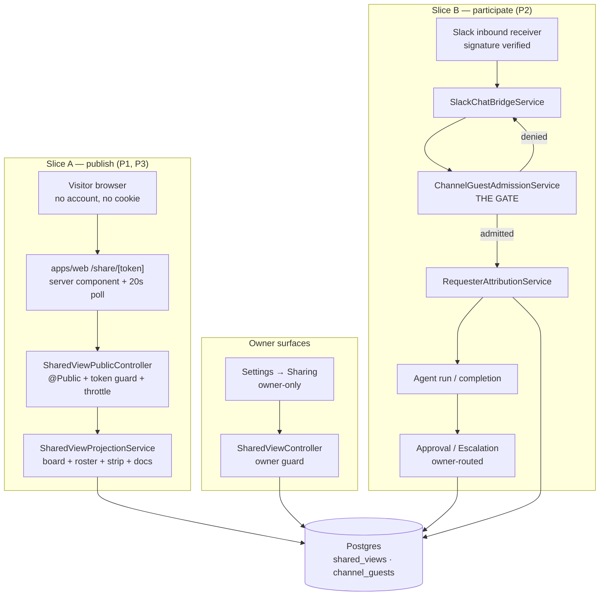

# AW-18 — Implementation Plan: Shared read-only views & channel guests

> Translates [`spec.md`](./spec.md) into architecture, data model and phasing.
> The plan owns implementation detail; the spec owns behaviour
> ([Constitution IX](../../../../../.specify/memory/constitution.md#ix-specs-are-behaviour-first)).

**Feature ID**: `aw-18-shared-dashboards`
**Spec**: [`./spec.md`](./spec.md) · **Tasks**: [`./tasks.md`](./tasks.md)
**Status**: `Draft`
**Last updated**: 2026-09-06
**Blocking dependency**: [AW-02 Mission board](../AW-02-mission-board/spec.md) — the
lane projection this epic publishes.

---

## 1. Current state in the codebase

Everything below was read in this repository. Paths are relative to the monorepo root.

### 1.1 Organizations, Tenants and who "the owner" is

| What exists | Where | What it means for this epic |
| --- | --- | --- |
| `Tenant` entity, `ownerUserId` unique 1:1 with `User` | [`packages/agent/src/entities/tenant.entity.ts`](../../../../../packages/agent/src/entities/tenant.entity.ts) | This is the only unambiguous "owner" the platform has. Every owner-only check in this epic resolves `organization.tenantId → tenant.ownerUserId === currentUser.id`. |
| `Organization` entity | [`packages/agent/src/entities/organization.entity.ts`](../../../../../packages/agent/src/entities/organization.entity.ts) | The Workspace a Shared view hangs off. |
| `OrganizationMember` — roster only, `role` persisted but explicitly **not** an authorization input | [`packages/agent/src/entities/organization-member.entity.ts`](../../../../../packages/agent/src/entities/organization-member.entity.ts) | Why we cannot express "only admins may publish" today, and why we resolve the Tenant owner instead of inventing a role. |
| `OrganizationOwnershipGuard` (member-level; `@OrgAdmin()` currently identical to member) | [`apps/api/src/organizations/guards/organization-ownership.guard.ts`](../../../../../apps/api/src/organizations/guards/organization-ownership.guard.ts), [`apps/api/src/organizations/organization-membership.service.ts`](../../../../../apps/api/src/organizations/organization-membership.service.ts) | Reused unchanged for membership. A **new, narrower** owner guard sits on top of it for the write routes. |
| Scope resolution (`ScopeContext`, `X-Scope-Slug`) | [`apps/api/src/scope/`](../../../../../apps/api/src/scope/) | The owner-facing endpoints resolve the active Organization exactly as every other Tier-A read does. |

### 1.2 The token/hash pattern this epic copies

[`packages/agent/src/entities/organization-invitation.entity.ts`](../../../../../packages/agent/src/entities/organization-invitation.entity.ts)
already implements 256-bit token → `sha256` `tokenHash` with a unique index, the raw
token never stored, and the consumption side split into a `@Public()` preview plus an
authenticated accept
([`apps/api/src/onboarding/org-invite.controller.ts`](../../../../../apps/api/src/onboarding/org-invite.controller.ts)).
The one deliberate divergence here: a **share link must be re-copyable**, so the token
is *also* stored envelope-encrypted using the existing
[`EncryptedJsonColumn`](../../../../../packages/agent/src/entities/_secret-json-column.ts)
helper (AES-256-GCM, `enc::v1::` prefix — the same mechanism
`notification_channels.targetConfig` uses). Lookup is still by hash; decryption happens
only on the owner's own settings read.

### 1.3 The public-route precedent in the web app

- [`apps/web/src/app/[locale]/org-invite/[token]/page.tsx`](../../../../../apps/web/src/app/%5Blocale%5D/org-invite/%5Btoken%5D/page.tsx)
  is a signed-out, token-bearing page living as a sibling of the `(dashboard)` route
  group — exactly the shape `/share/[token]` needs.
- [`apps/web/src/lib/constants.ts`](../../../../../apps/web/src/lib/constants.ts) holds
  `ROUTES` and `PUBLIC_ROUTES` (the list starts at line 321). A route missing from
  `PUBLIC_ROUTES` is not merely redirected by
  [`apps/web/src/proxy.ts`](../../../../../apps/web/src/proxy.ts) — the auth gate also
  **clears the session cookie**, which the existing unit spec
  [`apps/web/src/lib/__tests__/public-routes.unit.spec.ts`](../../../../../apps/web/src/lib/__tests__/public-routes.unit.spec.ts)
  exists to catch. The share route must be added to both.
- There is **no** `robots.ts` in `apps/web/src/app/` today (only
  [`manifest.ts`](../../../../../apps/web/src/app/manifest.ts)), so the crawler-directive
  file is a new App Router metadata route.

### 1.4 The inbound chat path the admission gate plugs into

```
Slack delivery ─► apps/api/src/ingest/slack/slack-events.controller.ts     (@Public, signature-verified)
                     │                    slack-commands.controller.ts
                     ▼
                  SlackChatBridgeService            apps/api/src/ingest/slack/slack-chat-bridge.service.ts
                     │  resolves the OWNER via IngestInstallBinding
                     ▼
                  OpenAiCompatService.handleCompletion   apps/api/src/ai-conversation/openai-compat.service.ts
                     │
                     ▼  reply posted back through the slack-connector plugin
```

- [`packages/agent/src/entities/ingest-install-binding.entity.ts`](../../../../../packages/agent/src/entities/ingest-install-binding.entity.ts)
  is the per-external-workspace → platform-user binding. Its own docblock states the
  invariant this epic depends on: **rows are written by the server only, and only after a
  delivery has passed signature verification — the binding is a record of proven
  ownership, never a user claim.** That is why the allowlist hangs off a binding and why
  the owner cannot type an external workspace id into a form (spec S-20, FR-51).
- The binding's `provider` column is an unconstrained `varchar(32)`, so `telegram` /
  `discord` widen it with no schema change when their inbound legs land.
- Today the bridge admits **any** sender the signature validates. That is the exact line
  the gate is inserted on.

### 1.5 Connections (connected chat channels)

- [`packages/agent/src/entities/notification-channel.entity.ts`](../../../../../packages/agent/src/entities/notification-channel.entity.ts)
  — one row per `(userId, pluginId, name)`, `targetConfig` envelope-encrypted.
- [`apps/api/src/notification-channels/notification-channels.controller.ts`](../../../../../apps/api/src/notification-channels/notification-channels.controller.ts)
  — full CRUD + test-send, already throttled (20/min on create, 30/min on update).
- [`apps/web/src/components/settings/NotificationChannelsSettings.tsx`](../../../../../apps/web/src/components/settings/NotificationChannelsSettings.tsx)
  + [`apps/web/src/app/actions/notification-channels.ts`](../../../../../apps/web/src/app/actions/notification-channels.ts)
  — a fully wired add-channel wizard. The allowlist panel mounts inside this page.
- [`packages/plugin/src/contracts/capabilities/connector.interface.ts`](../../../../../packages/plugin/src/contracts/capabilities/connector.interface.ts)
  already defines `ConnectorInboundEvent`, `ConnectorPairingAuthorizer` and
  `ConnectorAuthorizationDecision` as **contract-only** types. The admission gate
  implements exactly the `ConnectorPairingAuthorizer` shape so that when the connector
  inbound runtime lands, it binds to this service rather than growing a second one.

### 1.6 Decisions

- Approvals: [`packages/agent/src/entities/agent-action-proposal.entity.ts`](../../../../../packages/agent/src/entities/agent-action-proposal.entity.ts)
  + [`apps/api/src/agent-approvals/agent-approvals.controller.ts`](../../../../../apps/api/src/agent-approvals/agent-approvals.controller.ts)
  — owner-scoped by `userId`, idempotent decide (409 on re-decide).
- Escalations: [`packages/agent/src/entities/agent-escalation.entity.ts`](../../../../../packages/agent/src/entities/agent-escalation.entity.ts)
  + [`apps/api/src/escalations/escalations.controller.ts`](../../../../../apps/api/src/escalations/escalations.controller.ts)
  — `open`/`resolved`, CAS on `status='open' AND userId=:me`.
- Both are already single-user-scoped. This epic makes that an **explicit routing rule**
  plus an attribution column, not a new queue.

### 1.7 Knowledge Base

- [`packages/agent/src/entities/work-knowledge-document.entity.ts`](../../../../../packages/agent/src/entities/work-knowledge-document.entity.ts)
  carries `kbDocumentClass`, `status` (`draft`/`active`/`archived`), `reviewState`
  (`proposed`/`accepted`) — the three fields FR-28's publish predicate reads.
  [`packages/agent/src/entities/kb-types.ts`](../../../../../packages/agent/src/entities/kb-types.ts)
  holds the class enum.
- Read endpoints:
  [`apps/api/src/works/kb.controller.ts`](../../../../../apps/api/src/works/kb.controller.ts)
  (`GET works/:id/kb/documents`) and
  [`apps/api/src/works/org-kb.controller.ts`](../../../../../apps/api/src/works/org-kb.controller.ts)
  (`GET organizations/:orgId/kb/documents`). The published projection reads through the
  same repository, never through these controllers.

### 1.8 Activity log and notifications

- [`packages/agent/src/entities/activity-log.types.ts`](../../../../../packages/agent/src/entities/activity-log.types.ts)
  — `ActivityActionType` is a TypeScript-side enum over a free `varchar(50)` column, so
  **adding members needs no migration**.
  [`packages/agent/src/activity-log/activity-log.service.ts`](../../../../../packages/agent/src/activity-log/activity-log.service.ts)
  is the write path.
- [`apps/api/src/notifications/notification-event-type-bootstrap.service.ts`](../../../../../apps/api/src/notifications/notification-event-type-bootstrap.service.ts)
  upserts `CORE_EVENTS` at boot. **A `notify*()` event key that is not in that list can
  never fan out to a channel** — the resolver in
  [`packages/agent/src/notifications/user-notification-subscription.service.ts`](../../../../../packages/agent/src/notifications/user-notification-subscription.service.ts)
  falls back to in-app-only on a registry miss, and it never appears in the preference
  matrix. Both new event keys must be registered there or they are permanently in-app.

### 1.9 Untrusted-text fencing (for FR-65)

- [`packages/agent/src/services/memory-recall.ts`](../../../../../packages/agent/src/services/memory-recall.ts)
  — the existing shared helper that wraps recalled content in a fence, breaks forged
  fence tokens and strips chat-template control markers.
- [`apps/mcp/src/api-client/fence-untrusted.ts`](../../../../../apps/mcp/src/api-client/fence-untrusted.ts)
  — the same posture on the MCP side.
  The guest attribution preamble reuses the first of these; it does not invent a third.

### 1.10 Background work

- Dispatcher DI symbols are registered in
  [`packages/agent/src/tasks/_tasks-symbols.ts`](../../../../../packages/agent/src/tasks/_tasks-symbols.ts)
  and bound onto the active runtime by `buildJobRuntimeProviders()` inside
  [`packages/tasks/src/trigger/trigger.module.ts`](../../../../../packages/tasks/src/trigger/trigger.module.ts).
  Task implementations live in
  [`packages/tasks/src/tasks/trigger/`](../../../../../packages/tasks/src/tasks/trigger/)
  and are exported from its `index.ts`. Call sites depend on the symbol only
  (Constitution IV).

### 1.11 Migrations

175 timestamp-prefixed files live in
[`apps/api/src/migrations/`](../../../../../apps/api/src/migrations/); the newest is
`1789100000000-AddTaskGraphFanout.ts`. New entities must also be registered in
[`packages/agent/src/database/_entities-inventory.ts`](../../../../../packages/agent/src/database/_entities-inventory.ts)
and [`_entity-names.ts`](../../../../../packages/agent/src/database/_entity-names.ts) —
this repo has no `autoLoadEntities`, so a `forFeature`'d-but-unregistered entity throws
`EntityMetadataNotFoundError` on first query, and a drift spec fails CI otherwise.

---

## 2. Architecture and the seam

### 2.1 Two independent slices, one epic



### 2.2 The seam for slice A — a projection service, not a second read model

The published board must never disagree with the private board (FR-15). It therefore
reads the **same** repository query the private board uses (delivered by AW-02) and
passes the rows through a **publish filter** that is a pure function:

```
MissionRow[]  ──►  publishMissionCard(row)  ──►  PublishedMissionCard
                       ▲
                       └── drops every field not on the FR-14 allowlist
```

Two rules keep this honest and testable:

1. `PublishedMissionCard`, `PublishedAgent`, `PublishedActivityLine` and
   `PublishedDocument` are **closed DTO types in `packages/contracts`** with no index
   signature and no passthrough. A field that is not declared cannot be serialised.
2. The publish filters are **pure functions with their own unit specs** that assert the
   exact key set of the output object. Adding a field to a Mission cannot leak it,
   because the key-set assertion fails first.

The same rule governs the activity strip: `PUBLISHABLE_ACTIVITY_ACTIONS` is a frozen
allowlist constant, and a spec asserts that every member of `ActivityActionType` is
either on it or on an explicit `NEVER_PUBLISH` list — so a newly added action type fails
CI until somebody classifies it (FR-20).

### 2.3 The seam for slice B — one gate, in front of everything

`ChannelGuestAdmissionService.authorize(event, ctx)` implements the
`ConnectorPairingAuthorizer` signature already declared in
`packages/plugin/src/contracts/capabilities/connector.interface.ts`, returning
`ConnectorAuthorizationDecision`. It is called from `SlackChatBridgeService` **after**
signature verification and binding resolution and **before** any call into
`OpenAiCompatService`. It reads two tables and a rate-limit bucket; it never calls a
facade, so a denied message costs zero model tokens (FR-61, NFR "Cost").

When the connector inbound runtime lands (the connectors epic, P2), it binds this same
service to its `ConnectorPairingAuthorizer` slot. No second gate is written.

### 2.4 Owner resolution — one helper, one place

`SharedViewOwnerGuard` resolves `organizationId → tenantId → tenant.ownerUserId` and
throws `NotFoundException` (never `ForbiddenException`) on a miss, matching the
404-never-403 convention this area uses uniformly. It composes **after**
`OrganizationOwnershipGuard` so a non-member is rejected by the existing guard first and
never reaches the owner lookup. When per-Organization roles land, this guard is the one
place that changes.

---

## 3. Data model

### 3.1 New entity — `SharedView`

`packages/agent/src/entities/shared-view.entity.ts`, table `shared_views`.

| Column | Type | Notes |
| --- | --- | --- |
| `id` | uuid PK | |
| `organizationId` | uuid, **unique**, FK → `organizations` `ON DELETE CASCADE` | FR-1 (one per Workspace), FR-5 (cascade) |
| `tenantId` | uuid, indexed | Tier-A scope column, copied at creation |
| `ownerUserId` | uuid, FK → `users` | Denormalised for the public read path so it never joins to `tenants` |
| `tokenHash` | varchar(64), **unique index** | `sha256(token)`, the public lookup key |
| `tokenEncrypted` | text, `EncryptedJsonColumn()` | The re-copyable token, owner-read only (FR-7) |
| `status` | varchar(16), default `'active'` | `active` \| `paused` (FR-10) |
| `sections` | jsonb, default `{"board":true,"knowledge":false}` | FR-13, FR-25 |
| `knowledgeClasses` | jsonb `string[]`, default `[]` | FR-26, FR-27 — empty fails closed |
| `searchIndexable` | boolean, default `false` | FR-34 |
| `viewCount` | integer, default `0` | FR-44 |
| `lastViewedAt` | timestamptz, nullable | FR-44 |
| `firstViewNotifiedAt` | timestamptz, nullable | FR-46 — reset to `NULL` on regenerate |
| `tokenRotatedAt` | timestamptz, nullable | FR-48 |
| `rotationCount` | integer, default `0` | FR-48 |
| `createdById` | uuid FK → `users` | audit |
| `createdAt` / `updatedAt` | timestamptz | |

Indexes: `UNIQUE(organizationId)`, `UNIQUE(tokenHash)`, `INDEX(tenantId)`.

> **Why `tokenEncrypted` as well as `tokenHash`.** An invitation token is shown once and
> then consumed; a share link is pasted, re-pasted and re-copied for months. Storing only
> the hash would force a regenerate — which kills every outstanding copy — every time the
> owner needs the link again. Encrypted-at-rest with an owner-only decrypt is the
> Constitution VII-compliant way to keep both properties.

### 3.2 New entity — `ChannelGuest`

`packages/agent/src/entities/channel-guest.entity.ts`, table `channel_guests`.

| Column | Type | Notes |
| --- | --- | --- |
| `id` | uuid PK | |
| `bindingId` | uuid, FK → `ingest_install_bindings` `ON DELETE CASCADE` | The proven-ownership record the allowlist hangs off (FR-51) |
| `ownerUserId` | uuid, FK → `users`, indexed | Denormalised from the binding for the gate's single-row lookup |
| `tenantId` / `organizationId` | uuid, nullable, indexed | Tier-C scope columns |
| `externalUserId` | varchar(128) | Exact identifier on the external service |
| `externalUserHandle` | varchar(128), nullable | Captured from the first admitted delivery, display only |
| `displayName` | varchar(64) | Owner-typed (FR-54) |
| `note` | varchar(200), nullable | |
| `status` | varchar(16), default `'active'` | `active` \| `revoked` |
| `admittedAt` | timestamptz | |
| `lastSeenAt` | timestamptz, nullable | |
| `requestCount` | integer, default `0` | |
| `revokedAt` | timestamptz, nullable | |
| `createdById` | uuid FK → `users` | |
| `createdAt` / `updatedAt` | timestamptz | |

Indexes: `UNIQUE(bindingId, externalUserId)` (FR-58 — the same identity may exist on
another binding), `INDEX(ownerUserId, status)`,
`INDEX(bindingId, externalUserId, status)` — the gate's hot path is one indexed row.

### 3.3 Additive columns on existing tables

All nullable, all safe on rollback (Constitution X).

| Table | Column | Type | Why |
| --- | --- | --- | --- |
| `missions` | `requestedByGuestId` | uuid, nullable, FK → `channel_guests` `ON DELETE SET NULL` | FR-68 |
| `missions` | `requestedByLabel` | varchar(160), nullable | FR-67, FR-73 — retained verbatim after revoke |
| `tasks` | `requestedByGuestId` | uuid, nullable, FK → `channel_guests` `ON DELETE SET NULL` | FR-68 |
| `tasks` | `requestedByLabel` | varchar(160), nullable | FR-67 |
| `agent_action_proposals` | `requestedByGuestId` | uuid, nullable, FK `SET NULL` | FR-69 |
| `agent_action_proposals` | `requestedByLabel` | varchar(160), nullable | FR-69 |
| `agent_escalations` | `requestedByGuestId` | uuid, nullable, FK `SET NULL` | FR-69 |
| `agent_escalations` | `requestedByLabel` | varchar(160), nullable | FR-69 |
| `agent_escalations` | `originConversationRef` | varchar(256), nullable | Where to post the outcome back (FR-78) |
| `agent_action_proposals` | `originConversationRef` | varchar(256), nullable | Same |
| `work_knowledge_documents` | `sharedViewExcluded` | boolean, default `false` | FR-28, **P3 only** |

> `requestedByLabel` is denormalised on purpose. FR-73 requires historical attribution to
> survive a revoke and a rename; a join to `channel_guests` would rewrite history.

### 3.4 Enum additions (no migration required)

`ActivityActionType` in
[`packages/agent/src/entities/activity-log.types.ts`](../../../../../packages/agent/src/entities/activity-log.types.ts)
is a TypeScript enum over a free `varchar(50)` column — appended members need no schema
change:

```
SHARED_VIEW_ENABLED        = 'shared_view_enabled'
SHARED_VIEW_DISABLED       = 'shared_view_disabled'
SHARED_VIEW_REGENERATED    = 'shared_view_regenerated'
SHARED_VIEW_SECTIONS_CHANGED = 'shared_view_sections_changed'
SHARED_VIEW_INDEXING_CHANGED = 'shared_view_indexing_changed'
CHANNEL_GUEST_ADDED        = 'channel_guest_added'
CHANNEL_GUEST_RENAMED      = 'channel_guest_renamed'
CHANNEL_GUEST_REVOKED      = 'channel_guest_revoked'
CHANNEL_GUEST_ADMITTED     = 'channel_guest_admitted'
CHANNEL_GUEST_DENIED       = 'channel_guest_denied'
CHANNEL_GUEST_THROTTLED    = 'channel_guest_throttled'
```

`shared_view_viewed` is deliberately **not** an activity kind — a per-view row would
flood the feed. Views are a counter on the row (FR-44).

### 3.5 Migrations — forward-only, same PR (Constitution V)

Timestamps continue the existing sequence (newest on disk is `1789100000000`).

| File (in `apps/api/src/migrations/`) | Contents | Phase |
| --- | --- | --- |
| `1789200000000-CreateSharedViews.ts` | `CREATE TABLE shared_views` + 3 indexes | P1 |
| `1789210000000-CreateChannelGuests.ts` | `CREATE TABLE channel_guests` + 3 indexes | P2 |
| `1789220000000-AddRequesterAttribution.ts` | 9 nullable columns across `missions`, `tasks`, `agent_action_proposals`, `agent_escalations` + FKs `ON DELETE SET NULL` | P2 |
| `1789230000000-AddKbSharedViewExcluded.ts` | `work_knowledge_documents.shared_view_excluded boolean NOT NULL DEFAULT false` | P3 |

Every `down()` is a plain `DROP`/`DROP COLUMN` of only what its `up()` added. No
existing column is altered, renamed or dropped anywhere in this epic.

### 3.6 Contracts

New DTOs under `packages/contracts/src/api/shared-view/`, exported from that folder's
`index.ts` and re-exported from
[`packages/contracts/src/api/index.ts`](../../../../../packages/contracts/src/api/index.ts):

- `SharedViewSettingsDto` (owner read/write — carries the decrypted token **only** on the
  owner read)
- `SharedViewSectionsDto`, `SharedViewIndexingMode`
- `PublishedBoardDto` — `{ workspaceName, lanes: PublishedLaneDto[], agents:
  PublishedAgentDto[], recent: PublishedActivityLineDto[], generatedAt }`
- `PublishedMissionCardDto`, `PublishedAgentDto`, `PublishedActivityLineDto`
- `PublishedDocumentSummaryDto`, `PublishedDocumentDto`
- `ChannelGuestDto`, `CreateChannelGuestDto`, `UpdateChannelGuestDto`
- `PUBLISHABLE_ACTIVITY_ACTIONS` frozen constant

All published DTOs are **closed** — no index signatures, no `Record<string, unknown>`
escape hatch (§2.2).

---

## 4. API surface

### 4.1 Owner-facing — `apps/api/src/shared-views/shared-views.controller.ts`

`@Controller('api/organizations/:orgId/shared-view')`, guarded by
`AuthSessionGuard` + `OrganizationOwnershipGuard` (class level) + `SharedViewOwnerGuard`
(on every write and on the token-bearing read).

| Method | Path | Body / query | Auth | Notes |
| --- | --- | --- | --- | --- |
| `GET` | `/` | — | member | Settings + counters. `link` present **only** for the Tenant owner (FR-4). |
| `POST` | `/` | — | owner | Create + activate. `201` with the link. Idempotent: re-POST on an existing row returns the current row, `200`. Throttle 10/min. |
| `POST` | `/regenerate` | — | owner | New token, `firstViewNotifiedAt := NULL`, `rotationCount += 1`. Throttle 10/min (FR-9). |
| `PATCH` | `/` | `{ status?, sections?, knowledgeClasses?, searchIndexable? }` | owner | One write per changed facet → one activity row each (FR-47). Throttle 30/min. |
| `DELETE` | `/` | — | owner | Hard-deletes the row; the link dies. Distinct from `PATCH {status:'paused'}`. |
| `GET` | `/preview` | `?section=board\|knowledge` | owner | Runs the **public** projection under the owner's session (FR-45 — no counter). |
| `GET` | `/knowledge-classes` | — | owner | Per-class publishable document counts for the confirm dialog (FR-33). |

### 4.2 Public — `apps/api/src/shared-views/shared-view-public.controller.ts`

`@Controller('api/public/shared-view')`, `@Public()`, no session, no cookie. Every route
takes the token as a **path segment**, resolves it by hash, and 404s identically for
unknown / rotated / paused (FR-11).

| Method | Path | Query | Notes |
| --- | --- | --- | --- |
| `GET` | `/:token/board` | — | `PublishedBoardDto`. Throttle 60/min per token (FR-42). |
| `GET` | `/:token/knowledge` | `?q=&cursor=` | `PublishedDocumentSummaryDto[]`; `q` min 2 chars, page 50, cap 200 (FR-30). |
| `GET` | `/:token/knowledge/:docId` | — | `PublishedDocumentDto`; 404 if class deselected (FR-32) or excluded. |

Response headers on **every** public route, set by a dedicated interceptor:

```
Cache-Control: no-store
Referrer-Policy: no-referrer
X-Robots-Tag: noindex, nofollow, noarchive, nosnippet     ← omitted when searchIndexable
X-Content-Type-Options: nosniff
```

Throttling uses two `@Throttle` buckets — one keyed on the token hash (60/min), one on
the client (600/hour) — and runs **before** the projection query (NFR "Throughput").
`429` carries `Retry-After: 60`.

### 4.3 Channel guests — `apps/api/src/channel-guests/channel-guests.controller.ts`

`@Controller('api/connections/:connectionId/guests')`, `AuthSessionGuard` +
`ConnectionOwnerGuard` (resolves the Connection → its binding → the Tenant owner).
404-never-403 throughout.

| Method | Path | Body | Notes |
| --- | --- | --- | --- |
| `GET` | `/` | — | List + `{ used, max }` counters. Returns `{ bindingReady: false }` when no verified binding exists yet (S-20). |
| `POST` | `/` | `{ externalUserId, displayName, note? }` | `409` on duplicate, `422` over the 25/100 caps. Throttle 20/min. |
| `PATCH` | `/:guestId` | `{ displayName?, note?, status? }` | Rename or revoke. Throttle 30/min. |
| `DELETE` | `/:guestId` | — | Hard delete; historical labels survive (§3.3). |

### 4.4 Web BFF proxies

Owner-side reads/writes go through server actions (§5.2). The **public** page calls the
API directly from its server component — it must never touch a Next.js route handler
that could accidentally read the session cookie.

---

## 5. Web layer

### 5.1 New routes and files

| Path | Kind | Notes |
| --- | --- | --- |
| `apps/web/src/app/[locale]/share/[token]/page.tsx` | Server component | The published page. Sibling of `org-invite/`, so the static `share` segment wins over `[slug]`. Renders board + knowledge tabs; **no** client JS required for first paint (FR-85). |
| `apps/web/src/app/[locale]/share/[token]/not-active.tsx` | Server component | The identical "no longer active" body used by every failure (FR-11). |
| `apps/web/src/components/share/PublishedBoard.tsx` | Client | Lanes, cards, roster, strip; 20 s poll with visibility + idle handling (FR-43). |
| `apps/web/src/components/share/PublishedKnowledge.tsx` | Client | Two-pane list/reader with debounced search. |
| `apps/web/src/components/share/PublishedShell.tsx` | Client | Tabs, footer, live region, keyboard map (§6.12 of the spec). |
| `apps/web/src/app/robots.ts` | Metadata route | New. `Disallow: /share/` unless the request resolves an indexable Shared view (FR-35). |
| `apps/web/src/app/[locale]/(dashboard)/settings/sharing/page.tsx` | Server component | **Settings → Sharing**. |
| `apps/web/src/components/settings/SharingSettings.tsx` | Client | Link card, section toggles, class picker, indexing radio, confirm dialogs. |
| `apps/web/src/components/settings/ChannelGuestsPanel.tsx` | Client | Mounts inside `NotificationChannelsSettings.tsx` per channel. |
| `apps/web/src/app/actions/shared-view.ts` | Server actions | `getSharedView`, `createSharedView`, `regenerateSharedViewLink`, `updateSharedView`, `deleteSharedView`, `getKnowledgeClassCounts`. |
| `apps/web/src/app/actions/channel-guests.ts` | Server actions | `listChannelGuests`, `addChannelGuest`, `updateChannelGuest`, `deleteChannelGuest`. |

### 5.2 Wiring into the existing shell

- Add `DASHBOARD_SETTINGS_SHARING: '/settings/sharing'` and
  `SHARE_VIEW: '/share/:token'` (+ a `shareView(token)` href helper) to `ROUTES` in
  [`apps/web/src/lib/constants.ts`](../../../../../apps/web/src/lib/constants.ts).
- Add `ROUTES.SHARE_VIEW` to `PUBLIC_ROUTES` **in the same commit** — omitting it makes
  [`apps/web/src/proxy.ts`](../../../../../apps/web/src/proxy.ts) bounce the visitor
  *and clear the session cookie*. Extend
  [`apps/web/src/lib/__tests__/public-routes.unit.spec.ts`](../../../../../apps/web/src/lib/__tests__/public-routes.unit.spec.ts)
  to pin it.
- Add the `Sharing` nav entry to
  [`apps/web/src/app/[locale]/(dashboard)/settings/settings-layout-client.tsx`](../../../../../apps/web/src/app/%5Blocale%5D/%28dashboard%29/settings/settings-layout-client.tsx),
  positioned after `Organization`.
- Mount `<ChannelGuestsPanel />` inside
  [`apps/web/src/components/settings/NotificationChannelsSettings.tsx`](../../../../../apps/web/src/components/settings/NotificationChannelsSettings.tsx)
  for each channel row.
- Extend the Mission card and Mission detail header (AW-02 components) and the My
  Decisions row (AW-03) with the optional requester label. Both render nothing when the
  label is absent (FR-72).

### 5.3 State and data fetching

| Surface | Fetch | Cadence |
| --- | --- | --- |
| Published board | Server component does the first render; a client poll replaces the payload | 20 s; paused on `document.hidden`; stopped after 30 min idle |
| Published knowledge list | Server component; client search re-queries | 300 ms debounce |
| Sharing settings | Server component + server actions with `revalidatePath` | on action |
| Guests panel | Server action list + optimistic add/revoke, reconciled on response | on action |

The poll is a plain `fetch` against the public endpoint with `cache: 'no-store'`; on a
`429` the client backs off to 60 s and surfaces the throttled copy; on a network error
it keeps the last good render and shows "couldn't refresh" (NFR "Availability").

---

## 6. Background work (Constitution IV)

Both jobs are dispatched through a `*_DISPATCHER` DI symbol registered in
[`packages/agent/src/tasks/_tasks-symbols.ts`](../../../../../packages/agent/src/tasks/_tasks-symbols.ts)
and bound by `buildJobRuntimeProviders()` in
[`packages/tasks/src/trigger/trigger.module.ts`](../../../../../packages/tasks/src/trigger/trigger.module.ts).
No call site imports a job-runtime SDK directly. Each symbol ships as a
`<name>-dispatcher.ts` + `<name>.types.ts` pair under
[`packages/agent/src/tasks/`](../../../../../packages/agent/src/tasks/), matching the
seven `kb-*` dispatchers already there; the task implementation lives under
[`packages/tasks/src/tasks/trigger/`](../../../../../packages/tasks/src/tasks/trigger/)
and its spec under
[`packages/tasks/src/__tests__/`](../../../../../packages/tasks/src/__tests__/), which is
where every existing task spec in that package lives.

| Symbol | Task file | Trigger | What it does |
| --- | --- | --- | --- |
| `DECISION_OUTCOME_POSTBACK_DISPATCHER` | `packages/tasks/src/tasks/trigger/decision-outcome-postback.task.ts` | Enqueued when an Approval or Escalation carrying `originConversationRef` is settled | Posts the outcome back into the originating conversation through the connector/channel facade within 60 s (FR-78). Retries 30 s → 2 m → 8 m, max 4 attempts; on final failure records the failure so the settled item can show "Couldn't reply in {channel}" (FR-79). |
| `SHARED_VIEW_COUNTER_FLUSH_DISPATCHER` | `packages/tasks/src/tasks/trigger/shared-view-counter-flush.task.ts` | Cron, every 5 minutes | Flushes buffered view counts from the cache into `shared_views.viewCount` / `lastViewedAt`, so a public read never writes to Postgres on the request path (NFR "Latency"). Idempotent: the buffer key is cleared inside the same operation that applies the delta. |

The **first-view notification** (FR-46) is raised inline by the flush task, not on the
request path, via a new `notifySharedViewFirstView()` producer on
[`packages/agent/src/notifications/notification.service.ts`](../../../../../packages/agent/src/notifications/notification.service.ts).

Deliberately **not** background work: the admission gate (must be synchronous, it decides
whether to spend money) and the projection (must be live).

---

## 7. Plugin boundaries (Constitution I & II)

- **No new plugin package.** This epic adds no external integration. It reads from the
  inbound path that already exists and replies through the facade that already exists.
- **No hardcoded plugin id anywhere outside a plugin.** The allowlist keys on a
  Connection and a binding, not on a provider name. The gate reads
  `IngestInstallBinding.provider` as data. Reply delivery goes through
  [`packages/agent/src/facades/notification-channel.facade.ts`](../../../../../packages/agent/src/facades/notification-channel.facade.ts)
  (or, once available, the connector facade), which resolves the plugin by capability.
- **The gate implements a contract the plugin layer already declares.**
  `ChannelGuestAdmissionService.authorize` matches `ConnectorPairingAuthorizer` and
  returns `ConnectorAuthorizationDecision` from
  [`packages/plugin/src/contracts/capabilities/connector.interface.ts`](../../../../../packages/plugin/src/contracts/capabilities/connector.interface.ts),
  so the connector inbound runtime binds to it rather than growing a rival gate.
- **The service-name string shown in the add-guest form** (`"Their ID is on their profile
  in {service}"`) is resolved from the plugin's own manifest display name via the
  registry — never a switch statement over ids in `apps/web`.

---

## 8. i18n

New leaf keys in
[`apps/web/messages/en.json`](../../../../../apps/web/messages/en.json). Leaf names are
**camelCase** and contain **no literal dot** — next-intl rejects dotted leaf names at
runtime and the hydration spec turns that into a multi-shard e2e failure.

### 8.1 `dashboard.sharing` (Settings → Sharing)

```
title, subtitle, navLabel,
offHeading, offBody, seeList, neverSeeList,
turnOn, turnOff, preview, regenerate, copy, copied,
liveBadge, linkLabel,
countersLine, countersNeverOpened,
sectionsHeading, sectionBoard, sectionBoardHelp,
sectionKnowledge, sectionKnowledgeHelp,
classPickerHelp, classPickerFooter,
indexingHeading, indexingBlocked, indexingAllowed,
notOwnerNotice, notOwnerSummary,
regenerateConfirmTitle, regenerateConfirmBody, regenerateConfirmCta,
indexingOnConfirmTitle, indexingOnConfirmBody, indexingOnConfirmCta,
indexingOffConfirmBody,
turnOffConfirmTitle, turnOffConfirmBody, turnOffConfirmCta,
loadError, retry
```

### 8.2 `dashboard.channelGuests` (the allowlist panel)

```
heading, helper, counter, ownerRow, ownerAlwaysAllowed,
addHeading, fieldExternalId, fieldDisplayName, fieldNote, addCta, addHelp,
statusActive, statusRevoked, requestCount, lastSeen, neverMessaged,
notReadyHeading, notReadyBody,
fullHelper,
revokeConfirmTitle, revokeConfirmBody, revokeConfirmCta,
duplicateError, limitError, loadError
```

### 8.3 `share` (a new top-level namespace — the public page has no dashboard chrome)

```
readOnlyBadge, tabBoard, tabKnowledge,
footerUpdated, footerPaused, resume, refreshNow,
emptyBoard, emptyKnowledge,
notActiveTitle, notActiveBody,
throttledTitle, throttledBody,
documentUnpublished, backToDocuments,
searchPlaceholder, searchResults, searchTooShort,
previewBannerOn, previewBannerOff, previewClose,
laneBacklog, laneInFlight, laneNeedsYou, laneDone,
needsDecision, staleFlag, moreCount,
agentsHeading, agentWorking, agentIdle, agentPaused, agentInFlight,
recentlyHeading, poweredBy
```

A new top-level namespace (rather than nesting under `dashboard`) keeps the public
bundle from pulling in dashboard copy the visitor never sees.

### 8.4 `notifications-v2` additions

```
sharedViewFirstViewTitle, sharedViewFirstViewBody,
channelGuestDeniedTitle, channelGuestDeniedBody
```

### 8.5 Agent-facing channel replies

The six strings in spec §6.10 are **not** UI copy — they are produced server-side and must
be localised to the **owner's** locale. They live under `api.channelGuest` in the API's
own message catalogue and are resolved through the same next-intl message store the mail
templates use, with `{ownerName}`, `{note}` and `{channel}` interpolations.

### 8.6 Sibling locales

Add the same keys to the 20 sibling locale files in `apps/web/messages/`. Untranslated
values fall back to English; a missing **key** does not, so the key set must be complete
in every file.

---

## 9. Telemetry and failure modes

### 9.1 Telemetry

| Event | Where | Properties (never the token, never a message body) |
| --- | --- | --- |
| `shared_view.enabled` / `.disabled` / `.regenerated` | Owner controller | `organizationId`, `sections`, `searchIndexable`, `rotationCount` |
| `shared_view.viewed` | Counter flush task, aggregated | `organizationId`, `views` in window, `section` |
| `shared_view.throttled` | Public throttle guard | `bucket` (`token` \| `client`) |
| `channel_guest.added` / `.revoked` | Guests controller | `connectionId`, `provider`, `guestCount` |
| `channel_guest.gate` | Admission service | `outcome` (`admitted` \| `denied` \| `throttled`), `provider` |
| `decision.postback` | Post-back task | `outcome`, `attempt`, `succeeded` |

Redaction: the share token, the external user id and every message body are excluded at
the emit site, not filtered downstream.

### 9.2 Failure modes and the chosen behaviour

| Failure | Behaviour | Why |
| --- | --- | --- |
| Token decrypt fails (key rotation gap) | Owner read returns the settings with `link: null` and a "Couldn't read your link — regenerate it" line. The public path is unaffected (it matches on hash). | The public contract must never depend on the encryption key being present. |
| Projection query times out | Public page serves the last successful render from the client's own memory plus "couldn't refresh"; a cold load returns `503` with the same chrome | Never blank a page a visitor is watching. |
| Activity strip contains an unclassified action type | The line is dropped and a warning is logged; CI has already failed on the classification spec | Fail closed (FR-20). |
| Counter flush task fails | Counts stay buffered and are applied on the next tick; the buffer has a 24 h TTL so a long outage loses counts rather than growing unbounded | A view counter is not worth durable queueing. |
| Post-back task exhausts retries | The settled decision records the failure; the owner sees "Couldn't reply in {channel}" | FR-79. |
| Binding disappears (connection deleted) mid-conversation | Guests cascade-delete with the binding; the gate denies; the post-back task short-circuits | One ownership record, one cascade. |
| Two tabs regenerate simultaneously | The write is an atomic `UPDATE … WHERE rotationCount = :seen`; the loser gets `409` and re-reads | S-10. |
| Guest revoked mid-run | The reply suppression check runs at post time, not at dispatch time | S-17. |
| A `429` on the public path | Never counted as a view, never logged per-request (aggregated only) | FR-45 and log-volume sanity. |

---

## 10. Test plan (Constitution VI)

### 10.1 Unit — `packages/agent` (Jest)

| File | Covers |
| --- | --- |
| `packages/agent/src/entities/__tests__/shared-view.entity.spec.ts` | Column defaults; `sections` default shape; `knowledgeClasses` defaults to `[]` |
| `packages/agent/src/entities/__tests__/channel-guest.entity.spec.ts` | Defaults, status enum |
| `packages/agent/src/shared-views/__tests__/shared-view-token.spec.ts` | 256-bit generation, hash stability, encrypt/decrypt round trip, token never in `toJSON()` |
| `packages/agent/src/shared-views/__tests__/publish-filter.spec.ts` | **Exact key-set assertions** on every published DTO; a Mission with cost/budget/comments fields yields a card without them |
| `packages/agent/src/shared-views/__tests__/publishable-activity.spec.ts` | Every `ActivityActionType` member is on the publish allowlist **or** the never-publish list — fails CI on an unclassified addition |
| `packages/agent/src/shared-views/__tests__/shared-view-projection.service.spec.ts` | Lane order and membership match the private board fixture; archived and trashed Missions absent and uncounted; `+N more` overflow arithmetic |
| `packages/agent/src/shared-views/__tests__/knowledge-publish-predicate.spec.ts` | Draft / archived / proposed / deselected-class / excluded → not published; empty class list → zero documents |
| `packages/agent/src/shared-views/__tests__/shared-view.service.spec.ts` | Create idempotency; regenerate resets `firstViewNotifiedAt`; pause keeps the token; optimistic-concurrency `409` |
| `packages/agent/src/channel-guests/__tests__/channel-guest-admission.service.spec.ts` | Gate order; owner always admitted; revoked denied; caps; the 24 h single-refusal ceiling; zero facade calls on deny |
| `packages/agent/src/channel-guests/__tests__/requester-attribution.service.spec.ts` | Label format; label stamped on mission/task/approval/escalation; owner work has no label; revoked suffix |
| `packages/agent/src/channel-guests/__tests__/guest-text-fence.spec.ts` | Forged boundary markers neutralised; control markers stripped; truncation at 4,000 chars |

### 10.2 Controller specs — `apps/api` (Jest)

| File | Covers |
| --- | --- |
| `apps/api/src/shared-views/shared-views.controller.spec.ts` | Owner-only writes; non-owner member gets settings without the link; non-member `404`; throttle decorators present |
| `apps/api/src/shared-views/shared-view-public.controller.spec.ts` | Unknown / rotated / paused tokens return byte-identical bodies; every security header present; `X-Robots-Tag` omitted only when `searchIndexable`; `429` carries `Retry-After` |
| `apps/api/src/shared-views/shared-view-owner.guard.spec.ts` | Resolves the Tenant owner; throws `NotFoundException`, never `ForbiddenException` |
| `apps/api/src/channel-guests/channel-guests.controller.spec.ts` | CRUD; `bindingReady:false` shape; duplicate `409`; caps `422`; non-owner `404` |
| `apps/api/src/ingest/slack/slack-chat-bridge.service.spec.ts` (extend the existing spec) | The gate is called after signature verification and before `OpenAiCompatService`; a denial short-circuits |

### 10.3 End-to-end

| File | Covers |
| --- | --- |
| `apps/api/test/shared-view.e2e-spec.ts` | Full publish → read → regenerate → old-token-dead cycle against a real HTTP stack |
| `apps/web/e2e/shared-view-publish.spec.ts` | Owner turns sharing on, copies the link, previews as a visitor |
| `apps/web/e2e/shared-view-public-page.spec.ts` | Visit in a **fresh context with no storage state**; board renders; no cookie is set; no sign-in prompt; footer updates |
| `apps/web/e2e/shared-view-revoke.spec.ts` | Regenerate in one context, assert the other context's open page shows "no longer active" within 20 s |
| `apps/web/e2e/shared-view-noindex.spec.ts` | Robots headers/meta/crawler file present when blocked, absent when allowed |
| `apps/web/e2e/shared-view-a11y.spec.ts` | Axe pass on the public page in light and dark; keyboard traversal; 360 px layout |
| `apps/web/e2e/channel-guests.spec.ts` | Add, rename, revoke; caps; the not-ready state; non-owner sees nothing |

Every e2e that visits `/share/:token` must use a browser context with **no** storage
state, or it proves nothing about anonymous access.

---

## 11. Phasing

Each phase is independently shippable and leaves `develop` green.

### P1 — Publish (no new behaviour for anyone who does not turn it on)

1. `SharedView` entity + migration + registry entries.
2. Token service (generate / hash / encrypt / decrypt).
3. Publish filters + closed DTOs + the activity classification spec.
4. Owner controller + owner guard + Settings → Sharing page.
5. Public controller + security-header interceptor + throttle buckets.
6. `/share/[token]` page, `PUBLIC_ROUTES` entry, `robots.ts`.
7. Counter-flush task + first-view notification + event-type registration.
8. i18n (`dashboard.sharing`, `share`) + the tests in §10.

**Ships**: FR-1…FR-24, FR-34…FR-49.
**Does not ship**: the Knowledge section (its toggle renders disabled with "Coming
soon" behind the existing `soon` copy pattern), guests, attribution.

### P2 — Participate

1. `ChannelGuest` entity + migration + registry entries.
2. Attribution columns migration.
3. `ChannelGuestAdmissionService` (the gate) + insertion into the Slack bridge.
4. `RequesterAttributionService` + the fence helper + label stamping.
5. Owner-only decision routing + the post-back task.
6. Guests panel inside the channels settings page + requester label on the Mission card,
   Mission detail and My Decisions row.
7. i18n (`dashboard.channelGuests`, `api.channelGuest`) + the tests in §10.

**Ships**: FR-50…FR-79.

### P3 — Refine

1. Knowledge section: class picker, publish predicate, public list/read/search endpoints,
   the two-pane reader.
2. `work_knowledge_documents.sharedViewExcluded` + the per-document control.
3. Guest activity report on the Sharing page (requests per guest, last 30 days).
4. Resolve the §9 open questions that survive review — link expiry and pairing codes are
   the two most likely to land here.

**Ships**: FR-25…FR-33 and the deferred half of FR-28.

---

## 12. Constitution compliance

| Principle | ✓ | Justification |
| --- | --- | --- |
| **I — Plugin-first architecture** | ✓ | No external integration is added. Outbound replies go through the existing notification-channel facade; inbound rides the existing signature-verified receiver. |
| **II — Capability-driven resolution** | ✓ | The allowlist keys on a Connection and a binding; the provider name is read as data. The add-guest form's service label comes from the plugin manifest via the registry, not a switch in `apps/web`. |
| **III — Source-of-truth repositories** | ✓ | The Knowledge section publishes a projection of documents whose bodies stay in the user's own git repository. Nothing is copied into our database to publish it. |
| **IV — Job runtime via `*_DISPATCHER`** | ✓ | Both background jobs (§6) are enqueued through DI symbols registered in `_tasks-symbols.ts`; no call site imports a job-runtime SDK directly. |
| **V — Forward-only migrations, same PR** | ✓ | Four migrations in `apps/api/src/migrations/` (§3.5), each shipping with the entity change that needs it. Every `down()` drops only what its `up()` added. |
| **VI — Tests are a prerequisite** | ✓ | §10: 10 unit files, 5 controller specs, 7 end-to-end specs, including the key-set assertions that make an accidental field leak a CI failure. |
| **VII — Secret hygiene** | ✓ | The token is stored with `EncryptedJsonColumn`, returned only to the Tenant owner, excluded at every telemetry emit site, and never written to an activity-log row. Visitor IPs are never persisted. |
| **VIII — Single source of truth for plugin lists** | n/a | No plugin is added, removed or re-categorised. |
| **IX — Behaviour-first spec** | ✓ | `spec.md` names no class, no path and no code; every implementation detail lives here. |
| **X — Forward-looking backwards compatibility** | ✓ | Every new column is nullable or defaulted; every endpoint is new; no existing DTO field is renamed or removed; `ActivityActionType` members are appended, never reordered. |
| **Program rule #1 — additive only** | ✓ | Nothing is removed or renamed. The private dashboard, the member roster, the invitation flow and the inbound receiver behave exactly as before for anyone who does not opt in. |
| **Program rule #2 — no duplicate nouns** | ✓ | Two new nouns, both justified in `spec.md` §5.3 and both to be added to the program vocabulary table in the same PR. |
| **Program rule #9 — every surface answers "what did it cost?"** | ✓ | A denied inbound message provably costs zero (the gate runs before any facade call, asserted in §10.1). Admitted guest work produces Runs whose receipts are the existing ones — this epic adds a requester label to them, not a parallel accounting path. |
