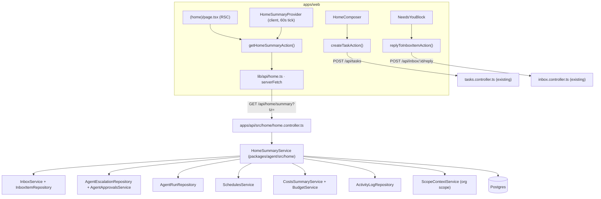

# Implementation Plan: AW-19 — Home, the morning screen

> Translates [`spec.md`](./spec.md) into architecture and tech choices.
> The plan owns implementation detail; the spec owns behaviour.

**Feature ID**: `aw-19-home`
**Spec**: [`./spec.md`](./spec.md)
**Tasks**: [`./tasks.md`](./tasks.md)
**Status**: `Draft`
**Last updated**: 2026-09-06

---

## 1. Current state in the codebase

Every path below was opened before being cited.

### 1.1 The Home route as it stands

| File | What it is today |
| --- | --- |
| [`apps/web/src/app/[locale]/(dashboard)/(home)/page.tsx`](<../../../../../apps/web/src/app/[locale]/(dashboard)/(home)/page.tsx>) | Server component. One `Promise.all` of ~18 independently `.catch()`-defended fetches (works, work stats, Idea proposals ×2 shapes, Missions, account-wide usage, Agents total/active, Tasks in-progress/blocked/recent, recent Agents, pending agent approvals, errored Agents, blocked-Task rows, Teams total, "soon" runs, a 100-row Work pool for Idea→Work matching). Composes the Attention list with `composeAttentionItems()` and hands everything to `DashboardClient`. |
| [`apps/web/src/app/[locale]/(dashboard)/(home)/dashboard-client.tsx`](<../../../../../apps/web/src/app/[locale]/(dashboard)/(home)/dashboard-client.tsx>) | Client component. Renders welcome header → `StatsOverview` → a `divide-y` stack of conditional blocks: `ApprovalsQueue`, `AttentionSection`, `SoonSection`, `MissionsPreviewSection`, `WorkProposalsSection`, recent Works, `RecentTasks`, `AgentsPreviewSection`. |
| [`apps/web/src/app/[locale]/(dashboard)/(home)/dashboard-data.ts`](<../../../../../apps/web/src/app/[locale]/(dashboard)/(home)/dashboard-data.ts>) | `server-only`. Three helpers: `getTeamsTotal()` (probes `/organizations` then each org's `/teams`), `getSoonRuns()` (calls `schedulesAPI.getAll({enabledOnly:true})`, keeps only `work_schedule` and `mission_tick`, caps the preview at `SOON_MAX = 3`), and the pure `composeAttentionItems()` (danger before warning, most-recent first, `ATTENTION_MAX = 6`). |
| [`apps/web/src/app/[locale]/(dashboard)/(home)/dashboard-data.unit.spec.ts`](<../../../../../apps/web/src/app/[locale]/(dashboard)/(home)/dashboard-data.unit.spec.ts>) | Existing unit coverage for those three helpers. |
| [`apps/web/src/app/[locale]/(dashboard)/layout-client.tsx`](<../../../../../apps/web/src/app/[locale]/(dashboard)/layout-client.tsx>) | The shell: sidebar, chat panel, header, `<main id="main-content">`, footer, `JobRuntimeDegradedBanner`, `ScrollTopOnNavigate` (deliberately last child of `<main>`). Wires `useKeyboardShortcuts` once. |

The five known weaknesses this epic fixes, all verified in source:

1. `getSoonRuns()` explicitly drops five of the seven `sourceType` values the
   aggregation returns (`SOON_SOURCE_KINDS` maps only `work_schedule` and
   `mission_tick`) because `SoonSection` has badge copy for two kinds only.
2. `getSoonRuns()` has no day boundary — it returns the soonest three runs
   whether they are in ten minutes or in three weeks.
3. `AttentionKind` in [`apps/web/src/components/dashboard/dashboard-signals.types.ts`](../../../../../apps/web/src/components/dashboard/dashboard-signals.types.ts)
   declares `schedule-failed` and `schedule-paused`, and `composeAttentionItems()`
   never produces either.
4. The 12-tile `StatsOverview` strip is entirely inventory counts; nothing on
   Home is bounded to a day.
5. [`apps/web/src/components/dashboard/RecentActivity.tsx`](../../../../../apps/web/src/components/dashboard/RecentActivity.tsx)
   is dead code: it exports `RecentActivity()` rendering three hard-coded sample
   rows in hard-coded English and is imported by nothing.

### 1.2 The data each new block will read

| Block | Source that already exists | Where |
| --- | --- | --- |
| Needs you — decisions | `InboxService` (`question` / `approval` / `escalation` / `notice`), whose `reply()` proxies to approve/reject and to escalation-resolve | [`packages/agent/src/inbox/inbox.service.ts`](../../../../../packages/agent/src/inbox/inbox.service.ts), [`packages/agent/src/inbox/inbox.types.ts`](../../../../../packages/agent/src/inbox/inbox.types.ts), wire types in [`packages/contracts/src/inbox/inbox.types.ts`](../../../../../packages/contracts/src/inbox/inbox.types.ts) |
| Needs you — the union backstop | `AgentApprovalsService` and `AgentEscalationService` both mirror into the Inbox via `INBOX_PRODUCER`, which is an `@Optional()` injection | [`packages/agent/src/agent-approvals/agent-approvals.service.ts`](../../../../../packages/agent/src/agent-approvals/agent-approvals.service.ts), [`packages/agent/src/agents/agent-escalation.service.ts`](../../../../../packages/agent/src/agents/agent-escalation.service.ts), binding in [`apps/api/src/inbox/inbox.module.ts`](../../../../../apps/api/src/inbox/inbox.module.ts) |
| Needs you — "Also broken" | `composeAttentionItems()` + `AttentionSection` | [`apps/web/src/components/dashboard/AttentionSection.tsx`](../../../../../apps/web/src/components/dashboard/AttentionSection.tsx) |
| Glance counters + Working now | `AgentRun` rows: `status`, `startedAt`, `finishedAt`, `awaitingInput`, `currentActivity` (varchar 300), `attentionReason` | [`packages/agent/src/entities/agent-run.entity.ts`](../../../../../packages/agent/src/entities/agent-run.entity.ts), [`packages/agent/src/database/repositories/agent-run.repository.ts`](../../../../../packages/agent/src/database/repositories/agent-run.repository.ts) |
| Today | `SchedulesService` → `ScheduleView[]` with all seven `sourceType`s, sorted by `nextRunAt` ascending, per-source `try/catch`, `MAX_PER_SOURCE = 500` | [`packages/agent/src/schedules/schedules.service.ts`](../../../../../packages/agent/src/schedules/schedules.service.ts), [`packages/agent/src/schedules/schedule-view.types.ts`](../../../../../packages/agent/src/schedules/schedule-view.types.ts), cadence text in [`packages/agent/src/schedules/cadence.ts`](../../../../../packages/agent/src/schedules/cadence.ts) |
| This week | `CostsSummaryService.getSummary(userId, windowDays)` with `COSTS_WINDOW_DAYS = [7, 30, 90]`, plus `BudgetService.summarizeForUser(userId, prefs)` behind `GET /me/usage/account-wide`. **Both aggregate by `userId` only** — `PluginUsageRepository.getTotalSpendCentsForUser` filters `e.userId = :userId` with no scope predicate — so neither follows the active Organization as they stand. §3.5 adds the scoped read; the cap stays account-wide by definition | [`packages/agent/src/subscriptions/credits/costs-summary.service.ts`](../../../../../packages/agent/src/subscriptions/credits/costs-summary.service.ts), [`apps/api/src/subscriptions/costs.controller.ts`](../../../../../apps/api/src/subscriptions/costs.controller.ts), [`packages/agent/src/budgets/budget.service.ts`](../../../../../packages/agent/src/budgets/budget.service.ts), [`apps/api/src/budgets/account-usage.controller.ts`](../../../../../apps/api/src/budgets/account-usage.controller.ts), [`apps/web/src/lib/api/usage.ts`](../../../../../apps/web/src/lib/api/usage.ts) |
| Recent activity | `ActivityLogRepository` / `ActivityLogService` (`activity_log`, indexed on `(userId, createdAt)`) | [`packages/agent/src/database/repositories/activity-log.repository.ts`](../../../../../packages/agent/src/database/repositories/activity-log.repository.ts), [`apps/api/src/activity-log/activity-log.controller.ts`](../../../../../apps/api/src/activity-log/activity-log.controller.ts) |
| Composer | `POST /api/tasks` (60/min throttle) via `createTaskAction`; a body with no `status` gets the entity default `backlog`, so the Task lands in the board's first lane | [`apps/api/src/tasks/tasks.controller.ts`](../../../../../apps/api/src/tasks/tasks.controller.ts), [`apps/web/src/app/actions/tasks.ts`](../../../../../apps/web/src/app/actions/tasks.ts), client in [`apps/web/src/lib/api/tasks.ts`](../../../../../apps/web/src/lib/api/tasks.ts) |
| Scope | `ScopeContextService` (request-scoped `AsyncLocalStorage`, `getOrganizationId()`) | [`apps/api/src/scope/scope-context.service.ts`](../../../../../apps/api/src/scope/scope-context.service.ts) |

### 1.3 Conventions this plan must match

- New agent-package sub-module → a directory under `packages/agent/src/`, a NestJS
  module, and an `exports` subpath entry in
  [`packages/agent/package.json`](../../../../../packages/agent/package.json)
  (which already lists 52 subpaths including `./schedules`, `./inbox`,
  `./agent-approvals`, `./subscriptions`).
- New entity → the concrete import goes in
  [`packages/agent/src/database/_entities-inventory.ts`](../../../../../packages/agent/src/database/_entities-inventory.ts)
  (never the barrel — it explains why), the class name in
  [`packages/agent/src/database/_entity-names.ts`](../../../../../packages/agent/src/database/_entity-names.ts),
  the repository in [`packages/agent/src/database/_repository-inventory.ts`](../../../../../packages/agent/src/database/_repository-inventory.ts),
  and a re-export in [`packages/agent/src/entities/index.ts`](../../../../../packages/agent/src/entities/index.ts).
- New API module → registered in [`apps/api/src/api.module.ts`](../../../../../apps/api/src/api.module.ts)
  next to `SchedulesModule` and `AgentApprovalsModule`.
- Query DTO → `class-validator` with `@ApiProperty` on every field (the API build
  runs no Swagger CLI plugin, and the MCP server derives its tool schemas from the
  OpenAPI document), matching [`apps/api/src/schedules/dto/schedules-query.dto.ts`](../../../../../apps/api/src/schedules/dto/schedules-query.dto.ts).
- Web server data access → a `server-only` typed client in
  `apps/web/src/lib/api/` calling `serverFetch` from
  [`apps/web/src/lib/api/server-api.ts`](../../../../../apps/web/src/lib/api/server-api.ts)
  (paths must NOT start with `/api` — `API_URL` already ends in `/api`), plus a
  `'use server'` action in `apps/web/src/app/actions/dashboard/`.
- Client-safe types and pure formatters go in a directive-free `*.shared.ts`
  module, the split used by [`apps/web/src/lib/api/costs.shared.ts`](../../../../../apps/web/src/lib/api/costs.shared.ts)
  and [`apps/web/src/components/dashboard/dashboard-signals.types.ts`](../../../../../apps/web/src/components/dashboard/dashboard-signals.types.ts).

---

## 2. Architecture and the seam this plugs into

The seam is **one new read-only aggregation module**, shaped exactly like the
schedules aggregation that already ships: a thin controller in `apps/api`, all
composition in a service in `packages/agent`, no persistence on the read path.



Three rules hold the design together:

1. **Home owns no data.** `HomeSummaryService` reads existing services and
   repositories. It writes nothing on the summary path.
2. **Every block is independently faultable.** The service runs the six block
   builders through `Promise.allSettled` with a per-builder 1500 ms timeout, and
   emits `{ status: 'ok' | 'failed' }` per block. A rejected or timed-out builder
   produces `status: 'failed'` plus a message key — never a silent empty array.
   This is the same per-source fault isolation `SchedulesService` already applies
   across its seven sources, lifted one level.
3. **Home writes only through paths that already exist.** The composer calls the
   Task create endpoint; the decision block calls the Inbox reply endpoint.
   No new write path is introduced for either, so throttles, audit and the
   steer/resume routing are inherited unchanged.

### 2.1 Day boundaries and timezone

`HomeWindow` is a small pure helper computing, from an IANA timezone string and
`now`, the `[dayStart, dayEnd)` instants of the user's local calendar day and the
`[weekStart, now)` instants of the rolling 7-day window. Resolution order for the
timezone:

1. the validated `tz` query parameter (the browser's `Intl.DateTimeFormat().resolvedOptions().timeZone`),
2. `user_notification_preferences.timezone` for the caller
   ([`packages/agent/src/entities/user-notification-preference.entity.ts`](../../../../../packages/agent/src/entities/user-notification-preference.entity.ts)),
3. `UTC`.

Validation reuses the approach already proven in the notification-preferences
controller: accept a value present in `Intl.supportedValuesOf('timeZone')`, plus
an explicit allowance for `UTC`/`GMT` (a documented V8 quirk). An unrecognised
value is a 400, not a silent fallback — a wrong day boundary is a wrong number.
The response echoes the timezone it actually used so the UI can render the
`Times shown in UTC.` footnote (spec FR-18/S18).

### 2.2 Decision-set composition (the de-duplication)

`InboxService` is the canonical unified decision queue today: `AgentApprovalsService`
mirrors each proposal into it (`proposalPending`, idempotent per proposal) and
`AgentEscalationService` mirrors each escalation (`escalationRaised`, idempotent
per escalation). Both injections are `@Optional()`, so a deployment without the
producer bound would silently show an empty decision block. The builder therefore:

1. reads open Inbox items for the caller, keeping `kind ∈ {question, approval, escalation}`;
2. reads open agent action proposals and open escalations for the caller;
3. drops any proposal whose id appears as `proposalId` on a fetched Inbox row, and
   any escalation whose id appears as `escalationId`;
4. unions what remains, sorts by `createdAt` ascending with the ≥72 h group
   floated to the top, and previews the first 5 while reporting the exact total.

Rows that survive step 3 (i.e. were never mirrored) carry `answerHref` only —
they are not inline-answerable from Home, because their answer path is not the
Inbox reply endpoint. This keeps a missing-producer deployment honest instead of
blank.

### 2.3 Server-side micro-cache

A 10-second per-`(userId, organizationId, timezone)` cache in front of
`HomeSummaryService.build()` absorbs the double render of an RSC page plus the
client's first tick. It uses the agent package's existing cache module
([`packages/agent/src/cache/`](../../../../../packages/agent/src/cache)) so it
follows whatever cache backend the deployment configures. Every response carries
`computedAt`; the controller sets `Cache-Control: private, no-store` so nothing
shared ever holds it (the same header the notifications and Task-diff endpoints
already set).

---

## 3. Data model

### 3.1 New entity — `UserHomePreference`

`packages/agent/src/entities/user-home-preference.entity.ts`, table
`user_home_preferences`. Modelled directly on `UserNotificationPreference`
(PK `userId`, `@OneToOne` to `User` with `onDelete: 'CASCADE'`, `@UpdateDateColumn`).

```ts
@Entity({ name: 'user_home_preferences' })
export class UserHomePreference {
    @PrimaryColumn({ type: 'uuid' })
    userId: string;

    @OneToOne(() => User, { onDelete: 'CASCADE' })
    @JoinColumn({ name: 'userId' })
    user?: User;

    /** Block ids the user turned off. NULL / [] = every block visible. */
    @Column({ type: 'simple-json', nullable: true })
    hiddenBlocks?: string[] | null;

    /** Explicit block order. NULL = the default order in spec §4.1. */
    @Column({ type: 'simple-json', nullable: true })
    blockOrder?: string[] | null;

    /** NULL = the age-based default in spec FR-2. */
    @Column({ type: 'boolean', nullable: true })
    workspaceSectionExpanded?: boolean | null;

    @UpdateDateColumn()
    updatedAt: Date;
}
```

`simple-json` (not `jsonb`) matches every other list column in the repo
(`task_template_steps.dependsOn`, `tasks.extraRepos`) and keeps the better-sqlite3
CI/e2e path working. Block ids are validated server-side against a fixed
`HOME_BLOCK_IDS` const so an unknown id can never be stored; unknown ids read back
from an older row are ignored rather than rendered.

Registration, all four places:

- `packages/agent/src/entities/index.ts` — `export * from './user-home-preference.entity';`
- `packages/agent/src/database/_entities-inventory.ts` — concrete import + `ENTITIES` entry
- `packages/agent/src/database/_entity-names.ts` — `'UserHomePreference'`
- `packages/agent/src/database/_repository-inventory.ts` — `UserHomePreferenceRepository`

### 3.2 New indexes on `agent_runs`

Today `agent_runs` carries `idx_agent_runs_user_created (userId, createdAt)`,
`idx_agent_runs_status (status)`, `idx_agent_runs_agent_started (agentId, startedAt)`
and `idx_agent_runs_work_status (workId, status)`. Neither the "my running runs"
scan nor the "my runs that finished today" scan has a covering composite. Two
additive indexes:

- `idx_agent_runs_user_status (userId, status)` — Working-now and the
  `working now` counter.
- `idx_agent_runs_user_finished (userId, finishedAt)` — the `done today` and
  `failed today` counters.

No column is added, altered or dropped.

### 3.3 Migrations — forward-only, one per phase

Constitution V: a TypeORM entity/schema change ships a migration in the **same
PR**. Both live in [`apps/api/src/migrations/`](../../../../../apps/api/src/migrations)
(the newest on `develop` at time of writing is `1790100000000-AddReleaseVerification.ts`), are
timestamp-prefixed from AW-19's reserved block ([README §5 rule 10](../README.md#5-rules-every-epic-spec-in-this-program-must-follow)), and are re-stamped before merge if `develop` has moved past them.

| Phase | File | Contents |
| --- | --- | --- |
| **P1** | `apps/api/src/migrations/1791190000000-AddAgentRunHomeIndexes.ts` | `CREATE INDEX IF NOT EXISTS` for `idx_agent_runs_user_status` and `idx_agent_runs_user_finished`, guarded with `queryRunner.getTable('agent_runs')` + `table.indices.some(...)` existence checks; `down()` drops exactly those two. |
| **P2** | `apps/api/src/migrations/1791190100000-AddUserHomePreferences.ts` | `CREATE TABLE user_home_preferences` (userId uuid PK, hiddenBlocks text nullable, blockOrder text nullable, workspaceSectionExpanded boolean nullable, updatedAt timestamptz default now) + FK to `users(id)` `ON DELETE CASCADE`; existence-guarded; `down()` drops the table. |

Both use portable `Table` / `TableIndex` / `TableForeignKey` DDL rather than raw
Postgres SQL, because CI and the e2e stack run better-sqlite3 while production
runs Postgres — the pattern `1789100000000-AddTaskGraphFanout.ts` documents.

No backfill is needed: every column on the new table is nullable and its absence
is the documented default.

### 3.4 Contracts

New wire types in `packages/contracts/src/home/home.types.ts`, re-exported by
`packages/contracts/src/home/index.ts` and by the root
[`packages/contracts/src/index.ts`](../../../../../packages/contracts/src/index.ts)
(the same treatment `./inbox` gets — the root entry is the only tsup entry that
needs to change, i.e. none, since `src/index.ts` is already an entry). No new
`exports` subpath and no `tsup.config.ts` change.

```ts
export const HOME_BLOCK_IDS = [
    'needsYou', 'glance', 'today', 'thisWeek', 'workingNow', 'recentActivity'
] as const;
export type HomeBlockId = (typeof HOME_BLOCK_IDS)[number];

export type HomeBlockStatus = 'ok' | 'failed';

export interface HomeBlock<T> {
    status: HomeBlockStatus;
    /** Message KEY on failure — never provider text (spec FR-73). */
    errorKey?: string;
    data: T | null;
}

export type HomeDecisionKind = 'question' | 'approval' | 'escalation';

export interface HomeDecisionRow {
    id: string;                       // inbox item id when answerable, else `${source}:${id}`
    kind: HomeDecisionKind;
    title: string;                    // plain text, ≤120 chars, already truncated
    agentName: string | null;
    createdAt: string;                // ISO
    waitingMs: number;
    /** 1–3 options ⇒ answerable inline; else null and the row links out. */
    options: { id: string; label: string }[] | null;
    /** Present when the row is NOT inline-answerable. */
    href: string;
}

export interface HomeDecisions {
    rows: HomeDecisionRow[];          // ≤5
    total: number;                    // exact
    overdueCount: number;             // waiting ≥72h
    alsoBroken: HomeSignalRow[];      // ≤6, shaped like today's AttentionItem
}

export interface HomeGlance {
    needsYou: number; workingNow: number; doneToday: number; failedToday: number;
}

export type HomeScheduleKind =
    | 'recurring_task' | 'agent_heartbeat' | 'work_schedule' | 'mission_tick'
    | 'source_validation' | 'data_sync' | 'inbound_trigger';

export interface HomeScheduleRow {
    id: string; kind: HomeScheduleKind; name: string; href: string;
    at: string;                       // ISO instant of the run
    state: 'ran' | 'due';
    status: 'active' | 'paused' | 'error';
}

export interface HomeToday { ran: HomeScheduleRow[]; due: HomeScheduleRow[]; dueTotal: number; }

export interface HomeSpend {
    // Scoped to the active Organization (or personal scope) — spec FR-37, FR-38.
    windowDays: 7; totalCents: number; currency: string;
    runsCount: number; avgPerRunCents: number | null;
    scope: { kind: 'organization' | 'personal'; name: string | null };
    // Account-wide by definition — spec FR-39a. Never combined with the fields above.
    accountCap: {
        periodSpendCents: number; periodCapCents: number | null;
        percentUsed: number | null; blocked: boolean; allowOverage: boolean;
    };
    everSpent: boolean;               // account-wide; false ⇒ hide the panel (spec FR-43)
}

export interface HomeRunningRow {
    runId: string; agentId: string; agentName: string;
    activity: string | null;          // ≤100 chars, already truncated
    startedAt: string; elapsedMs: number; href: string;
}

export interface HomeWorkingNow { rows: HomeRunningRow[]; total: number; }

export interface HomeActivityRow { id: string; at: string; summary: string; href: string | null; }

export interface HomeSummaryDto {
    computedAt: string;
    timezone: string;                 // the tz actually used
    timezoneFallback: boolean;        // true ⇒ render the UTC footnote
    needsYou: HomeBlock<HomeDecisions>;
    glance: HomeBlock<HomeGlance>;
    today: HomeBlock<HomeToday>;
    thisWeek: HomeBlock<HomeSpend>;
    workingNow: HomeBlock<HomeWorkingNow>;
    recentActivity: HomeBlock<HomeActivityRow[]>;
}

export interface HomePreferencesDto {
    hiddenBlocks: HomeBlockId[];
    blockOrder: HomeBlockId[];
    workspaceSectionExpanded: boolean | null;
}
```

Truncation (titles to 120, activity to 100, schedule names to 60) happens
**server-side** so every client renders the same string and no client has to
re-implement a boundary rule.

### 3.5 Scoped spend read (additive, no schema change)

Home promises every block follows the active Organization (spec FR-69), but the
two spend sources it reuses aggregate across all of a user's Organizations. The
fix follows the repo's existing workspace-scope convention —
[`packages/agent/src/database/ownership-scope.ts`](../../../../../packages/agent/src/database/ownership-scope.ts)
(`OwnershipScope`, `ownershipWhereWith`, `ownershipSqlPredicate`), which
`AgentRunRepository` already uses for its scoped reads — rather than inventing a
Home-only filter:

- `PluginUsageRepository.getTotalSpendCentsForUser(userId, from, to, currency?, scope?)`
  gains an optional trailing `scope`. When present it `andWhere`s
  `ownershipSqlPredicate('e', scope)` over the `tenantId` / `organizationId`
  columns `plugin_usage_events` already carries; when omitted the SQL is
  unchanged, so `BudgetService` enforcement and the costs controller keep today's
  user-wide totals (Constitution X).
- `CostsSummaryService.getSummary(userId, windowDays?, scope?)` threads the same
  optional `scope` to that call and to its run count (the scoped
  `AgentRunRepository` count T4 adds). `CostsController` does not pass it, so the
  costs surface is unchanged.
- `spend.builder.ts` calls `getSummary(userId, 7, scope)` with the request's
  `OwnershipScope` from `ScopeContextService` for `totalCents`, `runsCount` and
  `avgPerRunCents`, and calls `BudgetService.summarizeForUser` **unscoped** for
  `accountCap`. The cap (`accountWideMonthlyCapCents`, `accountWideAllowOverage`)
  is a per-user preference enforced against the user's spend in every
  Organization, so it cannot be scoped in this epic; per-Organization caps belong
  to AW-17's scoped budgets. The UI labels it account-wide (spec FR-39a) instead
  of mixing it silently with the scoped headline.
- `everSpent` is an account-wide existence check (spec FR-43), so an Organization
  with no usage shows `$0.00` rather than hiding the panel.

---

## 4. API surface

New module `apps/api/src/home/`.

| Method | Endpoint | Auth | Throttle | Phase |
| --- | --- | --- | --- | --- |
| `GET` | `/api/home/summary` | session (global `AuthSessionGuard`), `@CurrentUser()` | inherits default | P1 |
| `GET` | `/api/home/preferences` | session | inherits default | P2 |
| `PUT` | `/api/home/preferences` | session | `{ long: { limit: 60, ttl: 60_000 } }` | P2 |

### 4.1 `GET /api/home/summary`

Query DTO — `apps/api/src/home/dto/home-summary-query.dto.ts`:

```ts
export class HomeSummaryQueryDto {
    @ApiPropertyOptional({ description: 'IANA timezone, e.g. Europe/Kyiv' })
    @IsOptional() @IsString() @MaxLength(64)
    @Validate(IsIanaTimezoneConstraint)      // Intl.supportedValuesOf + UTC/GMT
    tz?: string;

    @ApiPropertyOptional({ isArray: true, enum: HOME_BLOCK_IDS,
        description: 'Limit the read to these blocks (per-block Retry).' })
    @IsOptional() @Transform(csvToArray) @IsArray() @IsIn(HOME_BLOCK_IDS, { each: true })
    @ArrayMaxSize(HOME_BLOCK_IDS.length)
    blocks?: HomeBlockId[];
}
```

The global `ValidationPipe` runs `whitelist` + `forbidNonWhitelisted`, so a typo'd
param 400s rather than being ignored — the behaviour the schedules DTO relies on.

- **Response**: `HomeSummaryDto` (§3.4). `200` always when the request is valid;
  block-level failure is reported inside the body, never as an HTTP error.
- **Headers**: `Cache-Control: private, no-store`.
- **No user/org parameter exists.** Scope comes from `@CurrentUser()` and
  `ScopeContextService`. This is the same posture the costs controller documents
  ("spend is the most sensitive read on the platform").
- **Errors**: `400` invalid `tz` or `blocks`; `401` unauthenticated. There is no
  `404` because there is no addressable resource.
- **`blocks` narrowing** is what per-block `Retry` uses: the client re-requests
  `?blocks=today` and merges the one block back in, satisfying spec FR-61.

### 4.2 `GET` / `PUT /api/home/preferences` (P2)

`PUT` body DTO — `apps/api/src/home/dto/home-preferences.dto.ts`:

```ts
export class UpdateHomePreferencesDto {
    @ApiPropertyOptional({ isArray: true, enum: HOME_BLOCK_IDS })
    @IsOptional() @IsArray() @IsIn(HOME_BLOCK_IDS, { each: true })
    @ArrayMaxSize(HOME_BLOCK_IDS.length)
    hiddenBlocks?: HomeBlockId[];

    @ApiPropertyOptional({ isArray: true, enum: HOME_BLOCK_IDS })
    @IsOptional() @IsArray() @IsIn(HOME_BLOCK_IDS, { each: true })
    @ArrayMaxSize(HOME_BLOCK_IDS.length)
    blockOrder?: HomeBlockId[];

    @ApiPropertyOptional() @IsOptional() @IsBoolean()
    workspaceSectionExpanded?: boolean;
}
```

`PUT` is an upsert on `userId` — a user with no row gets one created on their
first change. Duplicate ids inside an array are de-duplicated server-side;
`blockOrder` entries not in `HOME_BLOCK_IDS` are rejected with a `400`.

### 4.3 Endpoints reused unchanged

- `POST /api/tasks` — the composer. Already throttled 60/min. A Task created
  without an explicit `status` takes the entity default `backlog`, so no extra
  field is sent.
- `POST /api/inbox/:id/reply` — inline answering. Already throttled 30/min and
  already returns `InboxReplyOutcome.routed` (`steered` / `resumed` / `approved` /
  `rejected` / `escalation-resolved` / `already-decided` / `none`), which is
  exactly the vocabulary the toasts in spec §6.10 need.

---

## 5. Web layer

### 5.1 New components — `apps/web/src/components/home/`

| File | Kind | Responsibility |
| --- | --- | --- |
| `home.shared.ts` | types-only, no directive | `HOME_BLOCK_IDS` re-export, `formatWaiting()`, `formatElapsed()`, `formatCount()` (`999+`), `greetingKeyForHour()`, `deriveTaskTitle()`. Imported by both server and client, so no `server-only` guard. |
| `HomeSummaryProvider.tsx` | client | Holds the summary in state, owns the 60 s `setInterval` gated on `document.visibilityState`, exposes `refresh()` and `refreshBlock(id)`, computes the "new since you opened this" delta against the count at mount. |
| `HomeGreeting.tsx` | client | Greeting + date + score line (`aria-live="polite"`) + `updated {n}s ago` + manual refresh. |
| `HomeComposer.tsx` | client | The text field, counter, chips, inline errors, draft persistence, `Expand`. Calls `createTaskAction`. |
| `NeedsYouBlock.tsx` | client | Decision rows, waiting chips, inline option buttons, overflow footer, the `Also broken` sub-list (renders the existing `AttentionSection`). Calls `replyToInboxItemAction`. |
| `GlanceCounters.tsx` | client | The four linked counters. |
| `ThisWeekPanel.tsx` | client | Spend headline, run line, cap bar, blocked/overage line, `Manage spend`. |
| `WorkingNowPanel.tsx` | client | Running-run rows, `long run` / `still going` chips, empty state whose action focuses the composer. |
| `RecentActivityBlock.tsx` | client | The 8-row tail. |
| `HomeBlockShell.tsx` | client | One wrapper giving every block its heading, header link, skeleton, empty state and error card with `Retry`. This is what makes "empty ≠ failed" (spec FR-62) structural rather than per-block discipline. |
| `WorkspaceSection.tsx` | client | The collapsible `Your workspace` region wrapping today's blocks unchanged. |
| `HomeBlockMenu.tsx` | client (P2) | Show/hide toggles + reset; calls `updateHomePreferencesAction`. |

### 5.2 Extended, not replaced

- **[`apps/web/src/components/dashboard/SoonSection.tsx`](../../../../../apps/web/src/components/dashboard/SoonSection.tsx)**
  becomes the **Today** panel: new props for `ran` / `due` / `dueTotal`, labels
  for all seven schedule kinds, `ran at {time}` markers, and `paused` / `error`
  chips. Its i18n **keys** are preserved; two **values** change
  (`dashboard.soon.title` "Coming up" → "Today"), the same value-only rename the
  schedules spec performed for the Activity page. Its `SoonRunItem` type in
  `dashboard-signals.types.ts` gains the five missing kinds.
- **[`apps/web/src/components/dashboard/AttentionSection.tsx`](../../../../../apps/web/src/components/dashboard/AttentionSection.tsx)**
  is rendered inside `NeedsYouBlock` as the `Also broken` sub-list. Unchanged
  except for accepting an optional heading override.
- **[`apps/web/src/app/[locale]/(dashboard)/(home)/page.tsx`](<../../../../../apps/web/src/app/[locale]/(dashboard)/(home)/page.tsx>)**
  gains one fetch (`getHomeSummaryAction`) beside the existing `Promise.all`, and
  passes the summary to `DashboardClient`. The existing 18 fetches stay — they
  feed the `Your workspace` section.
- **[`apps/web/src/app/[locale]/(dashboard)/(home)/dashboard-client.tsx`](<../../../../../apps/web/src/app/[locale]/(dashboard)/(home)/dashboard-client.tsx>)**
  renders the morning stack first, then `WorkspaceSection` wrapping today's stack
  verbatim.
- **[`apps/web/src/app/[locale]/(dashboard)/(home)/dashboard-data.ts`](<../../../../../apps/web/src/app/[locale]/(dashboard)/(home)/dashboard-data.ts>)** —
  `getSoonRuns()` and `composeAttentionItems()` are left in place and still
  exported (their unit spec keeps passing); Home stops calling `getSoonRuns()`
  because the server now computes the day-scoped, seven-kind version. The
  function's doc comment gains a pointer to its replacement rather than being
  deleted.
- **[`apps/web/src/lib/hooks/use-keyboard-shortcuts.ts`](../../../../../apps/web/src/lib/hooks/use-keyboard-shortcuts.ts)** —
  today it binds exactly three global keys (`Ctrl/Cmd+K`, `c`, `?`) through one
  `document.keydown` listener with an input-focus guard. `n` and `r` are added
  through the same hook, active only on the Home route, and the two new entries
  are added to the Shortcuts tab in
  [`apps/web/src/components/dashboard/HelpDrawer.tsx`](../../../../../apps/web/src/components/dashboard/HelpDrawer.tsx)
  so the advertised list stays honest.

### 5.3 Data access

- `apps/web/src/lib/api/home.ts` (`server-only`) — `homeAPI.summary({ tz, blocks })`
  and `homeAPI.preferences()` / `homeAPI.updatePreferences()`, all via
  `serverFetch('/home/summary…')` (no leading `/api`).
- `apps/web/src/app/actions/dashboard/home.ts` (`'use server'`) —
  `getHomeSummaryAction`, `refreshHomeBlockAction`, `getHomePreferencesAction`,
  `updateHomePreferencesAction`. Each begins with the `getAuthFromCookie()` →
  `redirect(ROUTES.AUTH_LOGIN)` defence-in-depth guard used by every sibling
  action file, and `updateHomePreferencesAction` calls `revalidatePath` on
  `'/[locale]/(dashboard)/(home)'` exactly as `missions.ts` does.
- Export the new action module from
  [`apps/web/src/app/actions/dashboard/index.ts`](../../../../../apps/web/src/app/actions/dashboard/index.ts).

### 5.4 Client state and fetching

- The RSC fetches the first summary so the morning stack is server-rendered — no
  loading flash on a cold navigation.
- `HomeSummaryProvider` seeds from that server value and takes over refreshing.
  It uses `document.addEventListener('visibilitychange')` to suspend/resume the
  interval (spec FR-54 / S21) and clears the interval on unmount.
- Optimistic updates are local and always reconciled: answering a decision removes
  the row immediately, then a `refreshBlock('needsYou')` re-reads the exact count
  rather than trusting a decrement (spec FR-22 / S12).
- The composer draft lives in `localStorage` under a versioned key
  (`ew:v1:home:composer-draft`), every access wrapped in `try/catch` — the same
  defensive posture `use-theme.ts` documents for locked-down browsers. It is the
  one piece of Home state that is deliberately per-device.

---

## 6. Background work

**None.** Home dispatches no jobs, registers no cron, and enqueues nothing.

Constitution IV compliance is therefore vacuous on the read path and inherited on
the write path: the composer's `POST /api/tasks` reaches whatever the
Task create path already dispatches, which goes through the agent-package
`*_DISPATCHER` DI symbols in
[`packages/agent/src/tasks-domain/task-dispatcher.ts`](../../../../../packages/agent/src/tasks-domain/task-dispatcher.ts).
No file added by this epic imports `@trigger.dev/sdk` or any other runtime SDK.

One consequence worth stating: when no job runtime is configured, the platform's
existing `JobRuntimeNotConfiguredError` surfaces on dispatch, not on create — so
the composer will succeed and nothing will run. Spec S20 requires the success chip
to say so; the flag comes from the health check the dashboard layout already
performs (`healthAPI.getJobRuntimeConfigured()`, consumed by
[`apps/web/src/components/dashboard/JobRuntimeDegradedBanner.tsx`](../../../../../apps/web/src/components/dashboard/JobRuntimeDegradedBanner.tsx)),
passed down as a prop rather than re-fetched.

---

## 7. Plugin boundaries

Nothing in this epic touches an external service, so **no plugin package is added
or modified** (Constitution I is satisfied by not needing it), and **no plugin id
appears anywhere in the new code** (Constitution II).

Two places where a plugin id could have leaked in, and how it is avoided:

- Spend is read through `CostsSummaryService`, which aggregates
  `plugin_usage_events` **by capability and agent**, never by provider id. Home
  renders a currency total, not a provider breakdown.
- Notification channels play no part in Home. Home is a pull surface; nothing is
  delivered.

---

## 8. i18n

One new namespace, `dashboard.home`, in
[`apps/web/messages/en.json`](../../../../../apps/web/messages/en.json), plus a
small number of additive leaves on two existing namespaces. **Every leaf key name
is camelCase and contains no literal `.`** — next-intl rejects dotted leaf names
at runtime and the hydration spec turns that into a multi-shard e2e failure.

```
dashboard.home.greeting.morning            "Good morning, {name}."
dashboard.home.greeting.afternoon          "Good afternoon, {name}."
dashboard.home.greeting.evening            "Good evening, {name}."
dashboard.home.score.needsYou              "{count} need you"
dashboard.home.score.workingNow            "{count} working now"
dashboard.home.score.doneToday             "{count} done today"
dashboard.home.score.failedToday           "{count} failed"
dashboard.home.freshness.seconds           "updated {count}s ago"
dashboard.home.freshness.minutes           "updated {count}m ago"
dashboard.home.freshness.refresh           "Refresh"
dashboard.home.timezoneFootnote            "Times shown in UTC."

dashboard.home.composer.placeholder        "Hand something to your agents…"
dashboard.home.composer.hint               "Describe a job in a sentence. An agent will pick it up."
dashboard.home.composer.send               "Send"
dashboard.home.composer.sending            "Sending"
dashboard.home.composer.expand             "Expand"
dashboard.home.composer.counter            "{used} / {max}"
dashboard.home.composer.created            "Task created — \"{title}\""
dashboard.home.composer.open               "Open"
dashboard.home.composer.failed             "Couldn't create that Task."
dashboard.home.composer.retry              "Try again"
dashboard.home.composer.throttled          "You're creating these faster than we can file them. Try again in a minute."
dashboard.home.composer.noRuntime          "Nothing will run until a job runtime is configured."
dashboard.home.composer.configure          "Configure"

dashboard.home.needsYou.title              "Needs you"
dashboard.home.needsYou.overdue            "{count} waiting over 3 days"
dashboard.home.needsYou.openAll            "Open all ({count})"
dashboard.home.needsYou.moreWaiting        "{count} more waiting"
dashboard.home.needsYou.kinds.approval     "Approve"
dashboard.home.needsYou.kinds.question     "Question"
dashboard.home.needsYou.kinds.escalation   "Escalation"
dashboard.home.needsYou.waitingMinutes     "waiting {count}m"
dashboard.home.needsYou.waitingHours       "waiting {count}h"
dashboard.home.needsYou.waitingDays        "waiting {count}d"
dashboard.home.needsYou.open               "Open"
dashboard.home.needsYou.answering          "Answering…"
dashboard.home.needsYou.emptyTitle         "Nothing needs you right now."
dashboard.home.needsYou.emptyBody          "Your agents will raise anything they can't decide themselves."
dashboard.home.needsYou.toast.steered      "Sent. The agent picked it up."
dashboard.home.needsYou.toast.resumed      "Sent. A run resumed to answer it."
dashboard.home.needsYou.toast.approved     "Approved."
dashboard.home.needsYou.toast.rejected     "Rejected."
dashboard.home.needsYou.toast.resolved     "Resolved."
dashboard.home.needsYou.toast.alreadyDone  "Already answered elsewhere."
dashboard.home.needsYou.toast.failed       "Couldn't send that answer."

dashboard.home.glance.title                "Today at a glance"
dashboard.home.glance.needsYou             "need you"
dashboard.home.glance.workingNow           "working now"
dashboard.home.glance.doneToday            "done today"
dashboard.home.glance.failedToday          "failed today"
dashboard.home.glance.overflow             "999+"

dashboard.home.thisWeek.title              "This week"
dashboard.home.thisWeek.window             "last 7 days in {scope}"
dashboard.home.thisWeek.personalScope      "Personal"
dashboard.home.thisWeek.runs               "{count} runs · {avg} avg per run"
dashboard.home.thisWeek.noAverage          "—"
dashboard.home.thisWeek.capBar             "{percent}% of your account-wide cap this billing period"
dashboard.home.thisWeek.capScopeNote       "The cap applies across all your Organizations."
dashboard.home.thisWeek.manageDescription  "Opens account-wide spend"
dashboard.home.thisWeek.blocked            "New runs are blocked."
dashboard.home.thisWeek.overage            "Overage is allowed."
dashboard.home.thisWeek.noCap              "No spend cap set."
dashboard.home.thisWeek.setCap             "Set a cap"
dashboard.home.thisWeek.manage             "Manage spend"

dashboard.home.workingNow.title            "Working now ({count})"
dashboard.home.workingNow.fallback         "Working…"
dashboard.home.workingNow.longRun          "long run"
dashboard.home.workingNow.stillGoing       "still going"
dashboard.home.workingNow.seeAll           "See all runs"
dashboard.home.workingNow.empty            "Nobody is working right now."
dashboard.home.workingNow.emptyAction      "Hand out some work"

dashboard.home.recentActivity.title        "Recent activity"
dashboard.home.recentActivity.openFeed     "Open the feed"
dashboard.home.recentActivity.empty        "Nothing has happened yet."

dashboard.home.block.errorTitle            "Couldn't load {block}."
dashboard.home.block.retry                 "Retry"
dashboard.home.summaryError.title          "We couldn't load your morning report."
dashboard.home.summaryError.body           "Everything is still running — this screen just can't see it right now."
dashboard.home.summaryError.action         "Try again"
dashboard.home.newSince                    "{count} new since you opened this"

dashboard.home.firstRun.title              "Nothing yet."
dashboard.home.firstRun.body               "Once your agents start working, this is where the morning report lands — what needs you, what ran, what it cost."
dashboard.home.firstRun.action             "Set up your first agent"

dashboard.home.workspace.title             "Your workspace"
dashboard.home.blocks.menu                 "Blocks"
dashboard.home.blocks.showOnHome           "Show on Home"
dashboard.home.blocks.reset                "Reset to defaults"
dashboard.home.blocks.needsYou             "Needs you"
dashboard.home.blocks.glance               "Today at a glance"
dashboard.home.blocks.today                "Today"
dashboard.home.blocks.thisWeek             "This week"
dashboard.home.blocks.workingNow           "Working now"
dashboard.home.blocks.recentActivity       "Recent activity"
```

Additive leaves on existing namespaces:

```
dashboard.soon.title                       "Coming up"  →  "Today"          (value change only)
dashboard.soon.ranAt                       "ran at {time}"                  (new)
dashboard.soon.emptyTitle                  "Nothing scheduled today."       (new)
dashboard.soon.emptyAction                 "Set something up"               (new)
dashboard.soon.nothingElse                 "Nothing else scheduled today."  (new)
dashboard.soon.statusPaused                "paused"                         (new)
dashboard.soon.statusError                 "error"                          (new)
dashboard.soon.source.recurringTask        "recurring task"                 (new)
dashboard.soon.source.agentHeartbeat       "heartbeat"                      (new)
dashboard.soon.source.sourceValidation     "source check"                   (new)
dashboard.soon.source.dataSync             "data sync"                      (new)
dashboard.soon.source.inboundTrigger       "trigger"                        (new)
dashboard.soon.source.work                 (existing, unchanged)
dashboard.soon.source.mission              (existing, unchanged)

dashboard.attention.alsoBroken             "Also broken"                    (new)

dashboard.header.help.shortcuts.compose    "Focus the composer"             (new)
dashboard.header.help.shortcuts.refresh    "Refresh Home"                   (new)
```

Every key above is added to all 21 locale files in `apps/web/messages/`. English
values ship in `en.json`; the other 20 receive translated values in the same PR
(never half-translated — the schedules spec's rule).

---

## 9. Telemetry and failure modes

### 9.1 What is recorded

No new `ActivityActionType` member is added — Home records nothing to the activity
log, because it performs no user-visible domain action of its own. The Task the
composer creates is logged by the existing Task create path.

Through [`packages/monitoring`](../../../../../packages/monitoring):

| Signal | When | Fields |
| --- | --- | --- |
| Error report | A block builder throws or times out | `block`, `reason` (`timeout` \| `error`), the exception, `userId` as a tag |
| Error report | The whole summary fails | `reason`, duration |
| Span | Every summary build | Total duration plus one child span per block, so a slow block is attributable without guessing |
| Product event `home_composer_submitted` | Composer submit | `length` bucket, `outcome` (`created` \| `failed` \| `throttled`) |
| Product event `home_decision_answered` | Inline answer | `kind`, `routed` (from `InboxReplyOutcome`), `waitingBucket` |
| Product event `home_block_hidden` / `home_block_shown` | Block menu toggle | `block` |
| Product event `home_block_retried` | Per-block `Retry` | `block` |

Explicitly **not** recorded: the composer's text, decision titles, activity
summaries, agent names, currency amounts.

### 9.2 Failure modes and the response to each

| Failure | Symptom | Handling |
| --- | --- | --- |
| One block exceeds 1500 ms | that block only | `status: 'failed'` + `errorKey`; block error card with `Retry`; error reported with the block name |
| Inbox producer unbound in a deployment | decisions would be blank | the union backstop (§2.2) reads proposals and escalations directly, so rows still appear (link-out only) |
| Schedules aggregation partially fails | some kinds missing | already isolated per source inside `SchedulesService`; Home reports `ok` with fewer rows, matching that service's documented contract |
| Costs read fails | spend panel | block error card; the rest of Home is unaffected |
| Invalid `tz` from a browser | 400 on every summary | the client sends `tz` only when `Intl` resolves one; a 400 falls back to a `tz`-less retry, which resolves to UTC and renders the footnote |
| Whole summary fails | morning stack | one whole-summary error card; composer stays live; `Your workspace` still renders from its own fetches |
| Refresh storm (many tabs) | repeated identical reads | the 10 s server micro-cache collapses them |
| Answer race with another tab | stale row | `routed: 'already-decided'` → informational toast, then a forced `needsYou` re-read |
| Clock skew between client and server | wrong elapsed times | every duration is computed server-side from `computedAt`; the client renders the number it was given and only interpolates between ticks |

---

## 10. Test plan

Constitution VI: tests ship with the code. Every numeric threshold in spec §4 gets
an assertion.

### 10.1 Unit — agent package (Jest)

| File | Covers |
| --- | --- |
| `packages/agent/src/home/__tests__/home-window.spec.ts` | Local day boundaries across DST transitions, across the date line, for `UTC`, and the rolling-7-day window; an unknown timezone throws rather than silently defaulting |
| `packages/agent/src/home/__tests__/home-summary.service.spec.ts` | `Promise.allSettled` isolation (one builder rejects → one `failed`, five `ok`); the 1500 ms per-block timeout; `blocks` narrowing returns only the asked-for blocks; `computedAt` echo; the 10 s cache returns the same object and a different scope does not hit it |
| `packages/agent/src/home/__tests__/decision-set.spec.ts` | Kind filter excludes `notice`; oldest-first ordering; the ≥72 h float; preview cap 5 with an exact total; the proposal/escalation de-dup against `proposalId`/`escalationId`; un-mirrored rows carry `href` and no `options`; options of length 0, 1, 3 and 4 |
| `packages/agent/src/home/__tests__/run-counters.spec.ts` | `running AND awaitingInput` counts as `needsYou`, never `workingNow`; `done today` / `failed today` boundaries at 23:59:59 and 00:00:00 local; `999+` clamping; longest-running-first ordering; the 30 min and 120 min chip thresholds |
| `packages/agent/src/home/__tests__/today-panel.spec.ts` | All seven kinds map to a label; a null `nextRunAt` is excluded and not counted in `dueTotal`; ran/due split; `disabled` and `ended` excluded, `paused` and `error` included; caps 3 and 6 |
| `packages/agent/src/home/__tests__/spend-panel.spec.ts` | 7-day window pinned; `avgPerRunCents` null at zero runs; the 80% / 100% thresholds; `blocked` vs `allowOverage`; `everSpent: false` for a never-spent account; **scope**: the builder passes the request's `OwnershipScope` to `getSummary` and never to `summarizeForUser`; an Organization with no usage but an account with spend yields `totalCents: 0` and `everSpent: true` |
| `packages/agent/src/database/repositories/plugin-usage.repository.scope.spec.ts` | Usage in Organization A, Organization B and personal scope: `getTotalSpendCentsForUser` with A's scope sums only A, with personal scope sums only personal rows, and with no scope returns the unchanged user-wide total |
| `packages/agent/src/subscriptions/credits/costs-summary.service.scope.spec.ts` | `getSummary` with a scope scopes both spend and run count; without one it is byte-identical to today's result |
| `packages/agent/src/home/__tests__/home-preferences.service.spec.ts` | Upsert on first write; unknown block ids rejected; unknown ids read from an older row ignored; array de-duplication |
| `packages/agent/src/database/repositories/__tests__/user-home-preference.repository.spec.ts` | Owner scoping; cascade on user delete |

### 10.2 Controller specs — API (Jest)

| File | Covers |
| --- | --- |
| `apps/api/src/home/home.controller.spec.ts` | `GET /api/home/summary` returns 200 with every block key present; `Cache-Control: private, no-store`; no user/org parameter is accepted; a caller sees only their own scope; block-level failure is a 200 with `status: 'failed'`; `blocks=today` narrows |
| `apps/api/src/home/dto/home-summary-query.dto.spec.ts` | Valid IANA accepted, `UTC`/`GMT` accepted, garbage 400s, over-64-char 400s; `blocks` CSV parsing; an unknown block id 400s; `forbidNonWhitelisted` rejects an unknown param |
| `apps/api/src/home/dto/home-preferences.dto.spec.ts` | Array validation, size caps, unknown ids rejected |
| `apps/api/src/home/home-preferences.controller.spec.ts` | `GET` on a user with no row returns defaults; `PUT` upserts; `PUT` with an unknown id 400s |

### 10.3 Unit — web (Vitest)

| File | Covers |
| --- | --- |
| `apps/web/src/components/home/home.shared.unit.spec.ts` | `formatWaiting` at 59 m / 60 m / 23 h 59 m / 24 h / 72 h; `formatElapsed`; `formatCount` at 999 / 1000; `greetingKeyForHour` at 04:59 / 05:00 / 11:59 / 12:00 / 17:59 / 18:00; `deriveTaskTitle` word-boundary truncation at 80, a 2-character first sentence, and a sentence with no terminator |
| `apps/web/src/components/home/HomeComposer.unit.spec.tsx` | 2 vs 3 characters and the disabled `Send`; `Enter` vs `Shift+Enter` vs `Ctrl+Enter`; counter appears at 1800 and input refused past 2000; text preserved on failure and focus restored; the throttle message; chips capped at 3; draft restore and clear-on-success |
| `apps/web/src/components/home/NeedsYouBlock.unit.spec.tsx` | Waiting-chip tones; the overdue header suffix; 1–3 options inline vs `Open` only; optimistic removal then reconcile; the already-decided informational path; `Also broken` capped at 6 and excluded from the count; titles rendered as plain text |
| `apps/web/src/components/home/HomeBlockShell.unit.spec.tsx` | Skeleton / empty / error are three distinct renders; `Retry` calls back with the block id |
| `apps/web/src/components/home/HomeSummaryProvider.unit.spec.tsx` | 60 s tick while visible; suspended while hidden; immediate read on becoming visible; the new-since pill appears and dismisses; a refresh does not clear the composer |
| `apps/web/src/components/dashboard/SoonSection.unit.spec.tsx` | All seven kind labels; ran/due split; `+{n} more`; paused/error chips; both empty states |

### 10.4 End-to-end (Playwright, `apps/web/e2e/`)

| File | Covers |
| --- | --- |
| `apps/web/e2e/home-morning.spec.ts` | Spec S1, S4, S5, S6, S7 — block order, the score line, the day-scoped Today panel, the spend headline, the working-now rows, the activity tail |
| `apps/web/e2e/home-composer.spec.ts` | Spec S2, S13, S14, S20 — one sentence creates a Task in the Backlog lane, the chip and its link, failure preserves the text, the throttle message, the length bounds, the no-runtime suffix |
| `apps/web/e2e/home-decisions.spec.ts` | Spec S3, S12, S15, S16, S17 — inline answer with the routed toast, the already-decided path, waiting-on-input placement, the overdue float, the preview cap with the exact total |
| `apps/web/e2e/home-degradation.spec.ts` | Spec S9, S10, S11, S18, S19, S21 — first-run empty, one block failed, whole summary failed, the UTC footnote, an Organization switch, refresh suspended on a hidden tab |
| `apps/web/e2e/home-a11y.spec.ts` | Landmarks and accessible names, keyboard-only decision answering, focus rings, contrast in both themes, a locale switch leaving no English behind |

Existing [`apps/web/e2e/dashboard.spec.ts`](../../../../../apps/web/e2e/dashboard.spec.ts),
`dashboard-authenticated.spec.ts` and `dashboard-comprehensive.spec.ts` must keep
passing unchanged — they assert the shell and the blocks that move into
`Your workspace`, which is exactly the regression signal this epic needs.

---

## 11. Phasing

Each phase is one or more PRs, each independently shippable, each leaving
`develop` green.

### P1 — The morning read (no user-configurable state)

- `packages/agent/src/home/` with `HomeSummaryService`, the six block builders and
  `HomeWindow`; the `./home` subpath in `packages/agent/package.json`.
- `packages/contracts/src/home/` types, re-exported from the root index.
- `apps/api/src/home/` controller + module + query DTO; registered in `api.module.ts`.
- Migration `1791190000000-AddAgentRunHomeIndexes.ts`.
- Web: `home.shared.ts`, `HomeBlockShell`, `HomeGreeting`, `HomeComposer`,
  `NeedsYouBlock`, `GlanceCounters`, extended `SoonSection`, `ThisWeekPanel`,
  `WorkingNowPanel`, `RecentActivityBlock`, `WorkspaceSection`; `page.tsx` and
  `dashboard-client.tsx` rewired; `lib/api/home.ts`; `actions/dashboard/home.ts`.
- i18n: the full `dashboard.home` namespace plus the `dashboard.soon` additions,
  in all 21 locale files.
- Tests: §10.1 (minus preferences), §10.2 (minus preferences), §10.3 (minus the
  provider), `home-morning.spec.ts`, `home-composer.spec.ts`.

Shippable on its own: Home is the morning screen, everything old is below the
fold, nothing is configurable, refresh is on navigation only.

### P2 — Answer without leaving, and personalisation

- Inline decision answering wired to `replyToInboxItemAction` with the routed
  toasts and the already-decided path.
- `UserHomePreference` entity + repository + the four registration points;
  migration `1791190100000-AddUserHomePreferences.ts`;
  `GET`/`PUT /api/home/preferences`; `HomeBlockMenu`; `WorkspaceSection`
  expansion persistence.
- Composer `Expand` handing the typed text to the full Task form.
- Tests: the preferences halves of §10.1/§10.2, `NeedsYouBlock.unit.spec.tsx`,
  `home-decisions.spec.ts`.

### P3 — Keeping it live

- `HomeSummaryProvider` with the 60 s visibility-gated tick, the manual refresh,
  `updated {n}s ago`, the new-since pill, per-block `Retry` via `?blocks=`.
- The `n` and `r` keys through `use-keyboard-shortcuts.ts`, listed in `HelpDrawer`.
- Staleness chips (`long run`, `still going`, the overdue float) if any were
  deferred, and the a11y pass.
- Tests: `HomeSummaryProvider.unit.spec.tsx`, `home-degradation.spec.ts`,
  `home-a11y.spec.ts`.

---

## 12. Risks and mitigations

| Risk | Likelihood | Impact | Mitigation |
| --- | --- | --- | --- |
| Six queries in one request make Home slower than the current 18 parallel ones | Medium | High | Every builder is bounded and indexed (§3.2); builders run concurrently, not serially; a 10 s micro-cache; a hard 1500 ms per block; the span-per-block telemetry makes a regression attributable on day one |
| Two counter rows (the glance row and the stats strip) read as clutter | Medium | Medium | The glance row is time-bounded and the strip is inventory; the strip moves inside a collapsible section that is collapsed by default for established accounts |
| Superseding the coming-up block reads as a removal | Low | Medium | The component and its keys are extended in place, not deleted; only two i18n *values* change, the precedent the schedules spec set |
| The decision de-dup drops a real row | Low | High | De-dup is by explicit id match only (`proposalId` / `escalationId`), never by title or time; covered by `decision-set.spec.ts` |
| Inline answering from a preview surface produces a wrong decision | Low | High | Only items that arrived with 1–3 explicit choices are answerable inline; everything else links out to full context; the answer path, throttle and audit are the existing ones |
| Timezone handling produces wrong "today" counts | Medium | High | One pure helper, DST-tested; an invalid timezone 400s instead of silently defaulting; the response echoes what it used and the UI says so when it fell back |
| 21 locale files drift | Medium | Low | All keys land in one PR per phase; the hydration spec already fails a shard on a missing key |
| The new `n` / `r` keys collide with a future shortcut registry | Medium | Low | Both are registered through the existing hook and advertised in the help panel; AW-01 adopts them when it lands |

---

## 13. Constitution compliance checklist

- [x] **I — Plugin-first.** No external integration; nothing to plug in. No plugin
      package added or changed.
- [x] **II — Capability-driven.** No plugin id appears in any new file. Spend is
      read through the existing costs aggregation, which groups by agent and
      capability, never by provider id.
- [x] **III — Source-of-truth repositories.** Home reads no repository content and
      writes none. The composer creates a Task row; nothing that lives in a user
      repository is read or written.
- [x] **IV — Job runtime.** Home dispatches nothing. The one write path
      (Task create) reaches the existing dispatcher DI symbols; no new file
      imports a runtime SDK.
- [x] **V — Forward-only migrations.** Two additive migrations in
      `apps/api/src/migrations/`, each in the PR that needs it: indexes in P1,
      the preference table in P2. No column is altered or dropped; both are
      existence-guarded and portable across Postgres and better-sqlite3.
- [x] **VI — Tests are a prerequisite.** Eight unit suites, four controller specs,
      six web unit suites and five e2e specs, listed in §10 with the thresholds
      each one pins.
- [x] **VII — Secrets.** Home reads no secret. Block failures carry message keys,
      never provider text (spec FR-73). Telemetry records buckets and outcomes,
      never user or agent content.
- [x] **VIII — Plugin counts.** No plugin list or count changes.
- [x] **IX — Behaviour-first spec.** `spec.md` names no class, path or library;
      every implementation decision lives here.
- [x] **X — Backwards compatibility.** No existing endpoint, response shape,
      entity, table or i18n **key** changes. Two i18n **values** change on the
      superseded block, the value-only precedent the schedules spec established.
      One new module, two new endpoints, one new table, two new indexes — all
      additive.

---

## 14. References

- Spec — [`./spec.md`](./spec.md)
- Tasks — [`./tasks.md`](./tasks.md)
- Program overview — [`../README.md`](../README.md)
- Constitution — [`../../../../../.specify/memory/constitution.md`](../../../../../.specify/memory/constitution.md)
- The schedules aggregation this plan reads and widens — [`../../schedules/spec.md`](../../schedules/spec.md)
- Migration policy — [`docs/database/migrations.md`](../../../../database/migrations.md)
- Database architecture — [`docs/specs/architecture/database.md`](../../../architecture/database.md)
- Job-runtime provider abstraction — [`docs/specs/architecture/job-runtime-providers.md`](../../../architecture/job-runtime-providers.md)
