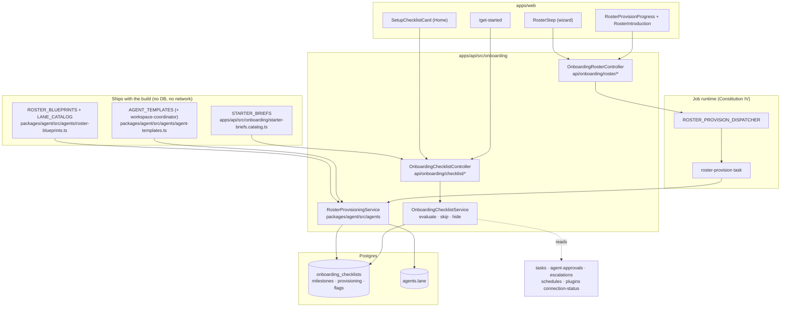

# AW-20 — First-hour onboarding and provisioning · Implementation Plan

**Epic:** `AW-20-onboarding` · **Program:** [Agent Workspace](../README.md)
**Spec:** [spec.md](./spec.md) · **Tasks:** [tasks.md](./tasks.md)
**Status:** Draft v1 · **Owner:** Engineering · **Date:** 2026-09-06
**Size:** M · **Blocking dependencies:** none

> **Additive-only.** One new wizard step, one new table, one new nullable column
> on `agents`, one new API controller pair, one new web route, one new component
> folder, one new dispatcher symbol, one new background task. Nothing existing is
> removed, renamed or re-pointed.
>
> **The load-bearing design decision:** the roster **blueprint catalogue is code,
> not data** — the same call the platform already makes for `AGENT_TEMPLATES` and
> `ROLE_SEED_KITS`. The only persisted things are (a) five per-person milestone
> states, (b) the outcome of the last provisioning run, and (c) one nullable
> `lane` label on `agents`. §3.1 explains why.
>
> **The second load-bearing decision:** provisioning goes through the job-runtime
> provider, not the request thread. §6 explains why a four-row create earns a
> background task.

---

## 1. Current state in the codebase

Every path below was opened in this worktree before being cited.

### 1.1 The wizard — where the new step hangs

| File | What it does today | Why it matters here |
| --- | --- | --- |
| `apps/web/src/components/onboarding/useOnboardingFlow.ts` | 517-line `useReducer` state machine. `computeStepList(state)` (lines 44–77) returns the effective step list; provider config sub-steps are inserted only when the choice is not the Ever Works default, so the list is 7 steps with all defaults and up to 10 with all BYOK + `k8s`. | The new `roster` step is **one array push** in `computeStepList`, between the `profile` push and the `communication` push. Everything downstream — the footer, the step badge, `skippedSteps`, telemetry — is derived from this list and needs no change. |
| `apps/web/src/components/onboarding/EverWorksOnboardingWizard.tsx` | Renders the current step by `kind` and owns the dialog chrome. | One new `case 'roster'` branch. |
| `apps/web/src/components/onboarding/steps/ProfileStep.tsx` | 333 lines. Renders the 14 role checkboxes + 5 team-size options, and a "suggested starter agents" block that calls the seeding server actions. | The direct precedent for the new step, and the source of the answers the blueprint is derived from. **Left untouched** — the suggestion block keeps working exactly as it does today (program rule #1). |
| `apps/web/src/components/onboarding/steps/CommunicationStep.tsx` | Connects Slack in place; reserves `slack-connector` / `discord-connector` out of the generic plugin list. | The step the roster step sits immediately before. Unchanged. |
| `apps/web/src/components/onboarding/steps/CreateWorkStep.tsx` | 191 lines. Final step; fires `zero_friction.wizard_finished`. | Unchanged. The checklist takes over *after* this step, not instead of it. |
| `apps/web/src/components/onboarding/WizardFooter.tsx` | Back / Skip / Next. | Reused. The roster step supplies its own primary label through the existing prop. |
| `apps/web/src/app/[locale]/(dashboard)/layout-client.tsx` | Lines 105–124: re-derives `computeStepList` client-side so the header badge matches the real flow length. Lines 114–145: owns auto-open, dismissal, and the localStorage-backed header badge. | The badge arithmetic keeps working for free because it calls the same function. |
| `apps/web/src/app/[locale]/(dashboard)/layout.tsx` | Lines 52–64: a single `Promise.all` of 7 independently `.catch()`-guarded server fetches, including `onboardingAPI.getState()` and `.getCatalog()`. | The checklist read becomes an **8th entry in the same `Promise.all`**, `.catch(() => null)`-guarded like the rest. No new round trip after first paint. |
| `apps/web/src/app/[locale]/onboarding/page.tsx` | The standalone `/onboarding` route; mounts the same wizard forced open. | Unchanged — it gets the new step automatically. |

### 1.2 The server side of the wizard

| File | What it does today |
| --- | --- |
| `apps/api/src/onboarding/onboarding.module.ts` | Declares 8 controllers and the adapter/provider wiring, and already imports `AgentsModule` from `@ever-works/agent/agents` (comment at lines 17–20 explains why: the role-seeding service lives with the templates it activates). |
| `apps/api/src/onboarding/onboarding-state.controller.ts` | `GET/PATCH /api/onboarding/state`, `POST /api/onboarding/complete`, `POST /api/onboarding/dismiss`. |
| `apps/api/src/onboarding/onboarding-state.service.ts` | 379 lines. Normalise/deep-merge of the v2 blob, plus the best-effort org-level profile mirror. |
| `apps/api/src/onboarding/onboarding-suggestions.controller.ts` | `GET /api/onboarding/suggestions` (resolve-only) and `POST /api/onboarding/suggestions/seed` (`@Throttle({ long: { limit: 10, ttl: 60_000 } })`), both falling back to the roles saved on the caller's state. |
| `apps/api/src/onboarding/onboarding-telemetry.controller.ts` | Server relay to PostHog. Strips PostHog `$`-prefixed keys, caps properties at 4096 bytes. |
| `apps/api/src/onboarding/dto/onboarding-telemetry.dto.ts` | `ONBOARDING_TELEMETRY_EVENTS` — an 18-entry `as const` allow-list enforced by `@IsIn`. **New events must be added here or the API 400s them.** |
| `apps/api/src/onboarding/dto/onboarding-state.dto.ts` | `@IsIn(ROLE_IDS, { each: true })` / `@IsIn(TEAM_SIZE_IDS)` — the pattern the new DTOs copy for lane keys and blueprint slugs. |
| `packages/contracts/src/api/onboarding/wizard-state.ts` | `ROLE_OPTIONS` (14), `TEAM_SIZE_OPTIONS` (5), `OnboardingWizardStateV2`, `ONBOARDING_DEFAULT_STATE`, `ONBOARDING_DESKTOP_NEXT_STEPS`. |

### 1.3 The agent substrate the roster is made of

| File | What it gives us |
| --- | --- |
| `packages/agent/src/agents/agent-templates.ts` | `AGENT_TEMPLATES` — 6 fully specified presets (`content-marketer`, `seo-auditor`, `lead-researcher`, `outreach-drafter`, `social-scheduler`, `competitive-analyst`), each carrying a system prompt, `capabilities`, `suggestedSkills` (pinned against `GTM_SKILLS`, build fails otherwise), `defaultPermissions` and `defaultGuardrails: { mode: 'require_approval' }`. **There is no coordinator template — this epic adds the seventh.** |
| `packages/agent/src/agents/agent-templates.service.ts` | `createFromTemplate(userId, slug, input, ownershipScope)`. `CreateAgentFromTemplateInput` already accepts a `name` override; the row is created DRAFT, SOUL.md is written, guardrails are seeded. A name clash surfaces as the standard `ConflictException`. |
| `packages/agent/src/agents/role-seeding.ts` | `ROLE_SEED_KITS` — a `Readonly<Record<OnboardingRoleId, RoleSeedKit>>`, so a role added without a kit is a **type error**. The exact pattern the blueprint map copies. |
| `packages/agent/src/agents/role-seeding.service.ts` | Sequential-on-purpose seeding with per-entry outcomes and `already-exists` on conflict. The provisioning service is this service's bigger sibling and reuses its rationale verbatim. |
| `packages/agent/src/agents/agents.service.ts` | `create` (line 376 sets `AgentStatus.DRAFT`), `USER_TRANSITIONS` (line 195: `draft → active | archived`), `resume()` (line 938 → `transition(..., ACTIVE)`), `setGuardrails`, and the `SEAT_GUARD` admission check. |
| `packages/agent/src/agents/seat-guard.ts` | `assertSeatAvailable` throws `SeatLimitExceededError`, mapped to **402** at the API boundary. This is the real over-limit path FR-19 handles. |
| `apps/api/src/agents/agents.controller.ts` | `POST /api/agents/from-template/:slug`, `POST /api/agents/:id/targets`, `POST /api/agents/:id/resume`, `POST /api/agents/:id/assign-task`, `GET /api/agents/:id/skills`. All write paths `@Throttle({ long: { limit: 30, ttl: 60_000 } })`. |
| `apps/api/src/agents/agent-collaborators.controller.ts` | `PUT /api/agents/:id/collaborators/:collaboratorAgentId` with `{ enabled }` — the delegation allow-list FR-22 fills. |
| `packages/agent/src/entities/agent.entity.ts` | `reportsToAgentId` (line 268, self-FK, org-chart only, no authz weight) — the reporting line FR-22 sets. `title` (255), `capabilities` (text), `tenantId`/`organizationId` (lines 462/465). |

### 1.4 The surfaces the checklist points at

| Milestone | Reads / links to today | Verified at |
| --- | --- | --- |
| 1 · provider | `GET /api/plugins/:pluginId/connection-status`, `POST /api/plugins/:pluginId/validate-connection` | `apps/api/src/plugins/plugins.controller.ts:233,411` |
| 2 · agents | the roster provisioning record on the checklist row | new |
| 3 · task | `POST /api/tasks`, `GET /api/tasks`, `POST /api/agents/:id/assign-task` | `apps/api/src/tasks/tasks.controller.ts:271,174`; `apps/api/src/agents/agents.controller.ts:1475` |
| 4 · decision | `GET /api/agent-approvals`, `GET /api/escalations` | `apps/api/src/agent-approvals/agent-approvals.controller.ts`; `apps/api/src/escalations/escalations.controller.ts:47,51` |
| 5 · schedule | `GET /api/schedules` — one read normalising every cadence source the platform runs | `apps/api/src/schedules/schedules.controller.ts:27,34` |

`POST /api/tasks/:id/recurring` (`apps/api/src/tasks/tasks.controller.ts:409`) and
`PATCH /api/agents/:id` (heartbeat cadence) are the two write paths milestone 5
uses. No new scheduling mechanism is introduced.

### 1.5 Entity / repository registration surface

Adding an entity to `@ever-works/agent` touches four files, and a drift spec in
`packages/agent/src/database/database.module.spec.ts` fails CI if any is missed:

1. `packages/agent/src/entities/index.ts` — barrel export
2. `packages/agent/src/database/_entity-names.ts` — the string-only
   `AGENT_ENTITY_NAMES` list, alphabetical
3. `packages/agent/src/database/_entities-inventory.ts` — the real `ENTITIES`
   array consumed by `database.config.ts`
4. `packages/agent/src/database/_repository-inventory.ts` — `REPOSITORY_PROVIDERS`,
   spread into `database.module.ts`, plus a barrel line in
   `packages/agent/src/database/index.ts`

`packages/agent/src/database/repositories/organization-onboarding-profile.repository.ts`
is the closest template for the new repository: one row per key, `find` + field-level
`upsert`, no list, no delete.

### 1.6 The job-runtime seam

| File | What it does |
| --- | --- |
| `packages/agent/src/tasks/job-runtime.providers.ts` | `DISPATCHER_SYMBOLS` (lines 134–146) — an explicit 11-entry pin list; `buildJobRuntimeProviders()` binds every one of them to the active provider's `dispatchers` view. Arity is asserted in `packages/agent/src/tasks/__tests__/job-runtime.providers.spec.ts`. |
| `packages/agent/src/tasks/_tasks-symbols.ts` | `TASKS_BARREL_RUNTIME_SYMBOLS` — the barrel's runtime-symbol pin, re-counted by `packages/agent/src/tasks/tasks.spec.ts`. Its header documents the exact two-step ritual for adding a symbol. |
| `packages/agent/src/tasks/template-customization-dispatcher.ts` | The smallest complete dispatcher: one interface, one method, one `Symbol()`. The shape to copy. |
| `packages/tasks/src/trigger/trigger.service.ts` | `dispatchWorkGeneration` (line 413) — the dispatch-method shape: `ensureConfigured()` guard, `stampTenantOptions`, `handle.id`, `catch → null`. `TriggerService.dispatchers` is literally `this`, so a new method on this class *is* a new dispatcher on the Trigger provider. |
| `packages/tasks/src/trigger/trigger.module.ts` | Lines 63–85: the registry registration plus `...buildJobRuntimeProviders()` with no filter. Nothing here changes — a twelfth symbol is bound automatically once it is in the pin list. |
| `packages/plugins/job-runtime-{trigger,bullmq,temporal,pgboss,inngest,node}` | Each exposes `dispatchers` as an untyped `Readonly<Record<string, unknown>>` supplied by the operator through `useDispatchers(...)`. **Adding a dispatcher does not require editing any of the six plugins.** |

### 1.7 What does **not** exist today

- No first-run checklist, setup progress, activation state or "get started"
  surface of any kind in `apps/web/src` or `apps/api/src`.
- No `lane` column, concept, or string anywhere on `agents`.
- No coordinator agent template, and no code anywhere that sets
  `reportsToAgentId` or a collaborator row automatically.
- No `/get-started` route and no `ROUTES.DASHBOARD_GET_STARTED`.
- No roster, blueprint or provisioning concept.
- The onboarding wizard's only completion signal is
  `users.onboardingCompletedAt` / `onboardingDismissedAt` — both meaning "the
  dialog ended".

---

## 2. Architecture and the seam it plugs into



**The seam.** Three things already exist and are simply extended:

1. **The wizard's step list is data.** `computeStepList` returns an array; the
   new step is one push. No other wizard file learns a new concept.
2. **The dashboard layout already batches one server read for onboarding.** The
   checklist read joins that batch.
3. **Creating an Agent from a template is already an orchestration over
   `AgentsService`.** Provisioning is a loop over that orchestration plus two
   wiring calls that already have endpoints.

**Why the provisioning service lives in `packages/agent/src/agents/` and not in
`packages/agent/src/onboarding/`.** The `@ever-works/agent/onboarding` barrel is
deliberately minimal — its own header says it exists so `apps/api/src/onboarding`
and the `apps/mcp` `register_work` tool can avoid type-checking through the heavy
services/facades chain. Pulling `AgentsService` into it would defeat that. The
precedent is already set: `OnboardingRoleSeedingService` lives in
`packages/agent/src/agents/` and is imported by
`apps/api/src/onboarding/onboarding-suggestions.controller.ts` from
`@ever-works/agent/agents`.

**Why the checklist service lives in `apps/api/src/onboarding/` and not in the
agent package.** It composes five other API modules' read paths. That is an API
composition concern, exactly like `OnboardingStateService`, which is already
there.

---

## 3. Data model

### 3.1 Why the blueprint catalogue is code

Blueprints change when we ship, not when a user acts. They carry no per-person
state, and they must be byte-identical across environments on a given build so
that "the general blueprint" means the same thing in a bug report as it does in
production. Persisting them would buy a migration, a seeder, a drift risk and an
admin surface nobody asked for.

This is also the house pattern: `AGENT_TEMPLATES` (6 presets with prompts) and
`ROLE_SEED_KITS` (a total `Record` over role ids) are both frozen TypeScript
arrays with build-time integrity tests. The blueprint map is a third instance of
the same idea and reuses its total-coverage trick — a role added to
`ROLE_OPTIONS` without a blueprint mapping is a **type error**, not a silent gap.

### 3.2 New entity — `OnboardingChecklist`

**File:** `packages/agent/src/entities/onboarding-checklist.entity.ts`
**Table:** `onboarding_checklists`

| Column | Type | Notes |
| --- | --- | --- |
| `id` | `uuid` PK | `@PrimaryGeneratedColumn('uuid')` |
| `userId` | `uuid`, not null | Owner. No `@ManyToOne` — same cycle-avoidance posture as `onboarding_requests`. |
| `organizationId` | `uuid`, nullable | Active workspace scope; `NULL` for personal scope. |
| `scopeKey` | `varchar(64)`, not null | Normalised `organizationId ?? 'personal'`, written in `@BeforeInsert`/`@BeforeUpdate`. Exists **only** so the unique index works around SQL's NULL-is-distinct semantics — the identical trick `Agent.scopeTargetId` already uses. |
| `milestones` | `simple-json`, not null, default `'{}'` | `Record<OnboardingMilestoneKey, MilestoneRecord>`; see §3.4. |
| `provisioning` | `simple-json`, nullable | The last provisioning run; see §3.5. |
| `rosterAcknowledgedAt` | `timestamptz`, nullable | Set by `POST .../roster/acknowledge`. Gates milestone 2 (FR-32). |
| `hiddenAt` | `timestamptz`, nullable | Card hidden. Never deletes the row (FR-41). |
| `dismissedAt` | `timestamptz`, nullable | Completed card dismissed (FR-42). |
| `completedAt` | `timestamptz`, nullable | First moment every applicable milestone was done. |
| `evaluatedAt` | `timestamptz`, nullable | Cache stamp for the 60 s re-evaluation window (FR-38). |
| `createdAt` / `updatedAt` | `timestamptz` | `@CreateDateColumn` / `@UpdateDateColumn` |

**Indexes**

- `uq_onboarding_checklist_user_scope` — UNIQUE on `(userId, scopeKey)`
- `idx_onboarding_checklist_user` on `(userId)`

**Why `simple-json` for `milestones`.** Five fixed keys, read as one object, written
as one object, never queried by a field. `simple-json` maps to `text` on Postgres
and on the better-sqlite3 CLI driver alike — the portability note the
`organization_onboarding_profiles` migration already makes.

### 3.3 New column — `agents.lane`

```
ALTER TABLE agents ADD COLUMN "lane" varchar(32) NULL;
CREATE UNIQUE INDEX "uq_agents_user_lane" ON agents ("userId", "lane") WHERE "lane" IS NOT NULL;
```

Nullable, no default, no backfill: every existing Agent has no lane and is
unaffected (Constitution X). The partial unique index encodes FR-28 in the
schema rather than in a service check that a second write path could bypass.

`packages/agent/src/agents/types.ts` `AgentDto` gains `lane: string | null`;
`CreateAgentDto` / `UpdateAgentDto` in `apps/api/src/agents/dto/agent.dto.ts`
gain an optional `@IsOptional() @Matches(/^[a-z0-9][a-z0-9-]{0,31}$/) lane?: string`.
`CreateAgentFromTemplateInput` in
`packages/agent/src/agents/agent-templates.service.ts` gains
`lane?: string | null`.

### 3.4 New enums and shapes (contracts)

**File:** `packages/contracts/src/api/onboarding/first-hour.ts`

```ts
export const ONBOARDING_MILESTONES = [
    'connectProvider',
    'meetAgents',
    'shipTask',
    'resolveDecision',
    'scheduleJob'
] as const;
export type OnboardingMilestoneKey = (typeof ONBOARDING_MILESTONES)[number];

export const MILESTONE_STATUSES = ['pending', 'done', 'skipped'] as const;
export type MilestoneStatus = (typeof MILESTONE_STATUSES)[number];

export interface MilestoneRecord {
    readonly status: MilestoneStatus;
    readonly completedAt?: string | null;
    /** What satisfied it: 'connection' | 'roster' | 'run' | 'approval' | 'escalation' | 'schedule'. */
    readonly evidenceKind?: string | null;
    /** Opaque id of the satisfying object. Never rendered; used for the "what completed it" line. */
    readonly evidenceId?: string | null;
    /** True when the completion fact could not be read this cycle (FR-59). */
    readonly unknown?: boolean;
}

export const ROSTER_PROVISION_STATES = [
    'idle', 'queued', 'creating', 'binding', 'ready', 'partial', 'failed'
] as const;
export type RosterProvisionState = (typeof ROSTER_PROVISION_STATES)[number];

export const LANE_OUTCOMES = ['pending', 'created', 'reused', 'skippedNoSeat', 'failed'] as const;
export type LaneOutcome = (typeof LANE_OUTCOMES)[number];

export const LANE_FAILURE_REASONS = [
    'nameUnavailable', 'noSeat', 'permissionDenied', 'timedOut', 'unknown'
] as const;
export type LaneFailureReason = (typeof LANE_FAILURE_REASONS)[number];
```

**File:** `packages/contracts/src/api/onboarding/roster.ts`

```ts
export const ROSTER_LANE_KEYS = [
    'coordination', 'research', 'content', 'outreach',
    'visibility', 'social', 'market-watch'
] as const;
export type RosterLaneKey = (typeof ROSTER_LANE_KEYS)[number];

export const ROSTER_BLUEPRINT_SLUGS = [
    'general', 'growth', 'revenue', 'insight', 'solo-starter'
] as const;
export type RosterBlueprintSlug = (typeof ROSTER_BLUEPRINT_SLUGS)[number];

export const ROSTER_MAX_LANES = 8;
export const ROSTER_NAME_MAX = 60;
```

### 3.5 The provisioning record (persisted inside the checklist row)

```ts
export interface RosterProvisionRecord {
    readonly runId: string;                 // uuid, minted at request time
    readonly blueprintSlug: RosterBlueprintSlug;
    readonly state: RosterProvisionState;
    readonly startedAt: string;
    readonly finishedAt?: string | null;
    readonly lanes: readonly RosterLaneResult[];
}

export interface RosterLaneResult {
    readonly laneKey: RosterLaneKey;
    readonly templateSlug: string;
    readonly requestedName: string;
    readonly outcome: LaneOutcome;
    readonly agentId?: string | null;
    readonly finalName?: string | null;     // when a numeric suffix was needed
    readonly failureReason?: LaneFailureReason | null;
    /** Skills that could not be attached (FR-23). Warning only. */
    readonly skillWarnings?: readonly string[];
}
```

**Why not its own table.** One bounded object per person, written only by
provisioning, read only in the seconds around it, one-to-one with a row that
already exists. A table would add a join and a second lifecycle for a read
pattern nobody has (spec §5.2.4).

### 3.6 The blueprint catalogue

**File:** `packages/agent/src/agents/roster-blueprints.ts`

```ts
export interface RosterLaneSpec {
    readonly laneKey: RosterLaneKey;
    readonly labelKey: string;            // i18n leaf, e.g. 'coordination'
    readonly templateSlug: string;        // must exist in AGENT_TEMPLATES
    readonly defaultName: string;
    readonly isCoordinator?: true;
}

export interface RosterBlueprint {
    readonly slug: RosterBlueprintSlug;
    readonly lanes: readonly RosterLaneSpec[];   // lanes[0].isCoordinator === true
}

export const ROSTER_BLUEPRINTS: Readonly<Record<RosterBlueprintSlug, RosterBlueprint>>;

/** Total over ROLE_OPTIONS — a new role without a mapping is a type error. */
export const ROLE_BLUEPRINT_VOTES: Readonly<Record<OnboardingRoleId, RosterBlueprintSlug>>;

/** Pure. Highest vote count wins; ties break on ROSTER_BLUEPRINT_SLUGS order; empty → 'general'. */
export function selectBlueprint(roles: readonly string[] | null | undefined): RosterBlueprint;

/** solo→3, small-2-10→5, mid-11-50→6, large-51-200→8, enterprise-200-plus→8, unknown→5. */
export function laneCapForTeamSize(teamSize: string | null | undefined): number;

/** Applies the cap, never trimming lanes[0]. */
export function proposeRoster(roles, teamSize): readonly RosterLaneSpec[];
```

Lane → template mapping (every `templateSlug` is asserted against
`AGENT_TEMPLATES` by an integrity spec, the same pin `suggestedSkills` already
has against `GTM_SKILLS`):

| Lane key | Template slug | Coordinator |
| --- | --- | --- |
| `coordination` | `workspace-coordinator` **(new, §3.7)** | yes |
| `research` | `lead-researcher` | — |
| `content` | `content-marketer` | — |
| `outreach` | `outreach-drafter` | — |
| `visibility` | `seo-auditor` | — |
| `social` | `social-scheduler` | — |
| `market-watch` | `competitive-analyst` | — |

Blueprints:

| Slug | Lanes (in order) |
| --- | --- |
| `general` | coordination, research, content, market-watch |
| `growth` | coordination, content, social, visibility, market-watch |
| `revenue` | coordination, outreach, research, content |
| `insight` | coordination, research, market-watch |
| `solo-starter` | coordination, content |

### 3.7 The seventh agent template

`packages/agent/src/agents/agent-templates.ts` gains `workspace-coordinator`:

- `category: 'ops'`, `title: 'Routing and coordination'`
- `systemPrompt`: receives whatever the owner hands over; decides which lane owns
  it; delegates to that lane's agent; raises an escalation when the lane is
  ambiguous rather than guessing; never does the specialist work itself.
- `defaultPermissions: { canAssignTasks: true }` — the only permission any roster
  agent gets, and the one that makes delegation possible at all.
- `defaultGuardrails: REQUIRE_APPROVAL` — the same constant every other template
  uses.
- `suggestedSkills: ['digest-compilation']` — must exist in `GTM_SKILLS` or the
  integrity suite fails the build.
- `suggestedRoles: []` — it is not a role suggestion; it is a roster fixture.

### 3.8 Migrations (Constitution V — each in the same PR as its entity change)

**Two** forward-only, idempotent migrations — one per phase, so P1 can ship
without P2 and neither file is ever edited twice:

| File | Phase | Contents |
| --- | --- | --- |
| `apps/api/src/migrations/1789200000000-AddAgentLane.ts` | P1 | `hasColumn('agents','lane')` guard → `addColumn` nullable `varchar(32)`; then the **partial** unique index `uq_agents_user_lane` on `("userId","lane") WHERE "lane" IS NOT NULL`, spelled as guarded raw SQL because TypeORM's `TableIndex` has no partial-index form. |
| `apps/api/src/migrations/1789210000000-CreateOnboardingChecklists.ts` | P2 | `hasTable('onboarding_checklists')` guard → `createTable` with the columns and both indexes from §3.2. `simple-json` columns are spelled `text` — the portability note `1784750000000-CreateOrganizationOnboardingProfiles.ts` already makes. No foreign key to `users`, matching the entity's no-`@ManyToOne` posture. |

`down()` in each drops only what its own `up()` created, in reverse order. No
backfill anywhere: every column added is nullable and every existing row is
already valid.

> The migrations directory's highest timestamp today is
> `1789100000000-AddTaskGraphFanout.ts`. Both new files sit after it. Migrations
> self-apply on API boot via `migrationsRun: true`, so nothing is run by hand on
> deploy.

---

## 4. API surface

All routes are auth-required through the global session guard, carry
`@ApiTags('onboarding')` so the MCP server picks them up, and are declared on
controllers registered by the **existing** `OnboardingModule`.

### 4.1 Roster — `apps/api/src/onboarding/onboarding-roster.controller.ts`

| Method & path | Body / query | Returns | Notes |
| --- | --- | --- | --- |
| `GET /api/onboarding/roster/blueprints` | — | `RosterBlueprintsResponse` | Catalogue plus the proposal derived from the caller's saved roles/team size. Pure read, no side effects. `@Throttle({ long: { limit: 60, ttl: 60_000 } })` |
| `GET /api/onboarding/roster` | — | `RosterStateResponse` | Current provisioning record (or `state: 'idle'`) plus the caller's existing lane-holding agents. |
| `POST /api/onboarding/roster/provision` | `ProvisionRosterDto` | `202` + `{ runId, state: 'queued' }` | Enqueues; never blocks (FR-9). `409 roster_provision_in_flight` when one is already running (FR-16). `@Throttle({ long: { limit: 5, ttl: 3_600_000 } })` (FR-17) |
| `POST /api/onboarding/roster/acknowledge` | — | `RosterStateResponse` | Idempotent. Sets `rosterAcknowledgedAt` (FR-32/FR-33). |

`ProvisionRosterDto`:

```ts
class ProvisionRosterLaneDto {
  @IsIn(ROSTER_LANE_KEYS) laneKey!: RosterLaneKey;
  @IsString() @Length(1, ROSTER_NAME_MAX) name!: string;
}
class ProvisionRosterDto {
  @IsOptional() @IsIn(ROSTER_BLUEPRINT_SLUGS) blueprintSlug?: RosterBlueprintSlug;
  @IsArray() @ArrayMinSize(1) @ArrayMaxSize(ROSTER_MAX_LANES)
  @ValidateNested({ each: true }) @Type(() => ProvisionRosterLaneDto)
  lanes!: ProvisionRosterLaneDto[];
}
```

Server-side invariants rejected with `400`: a lane key not in the catalogue
(FR/scenario 3.15), duplicate lane keys, a missing `coordination` lane, or more
than `ROSTER_MAX_LANES` entries.

### 4.2 Checklist — `apps/api/src/onboarding/onboarding-checklist.controller.ts`

| Method & path | Body | Returns | Notes |
| --- | --- | --- | --- |
| `GET /api/onboarding/checklist` | — | `ChecklistResponse` | Evaluates (or serves the ≤60 s cache), creates the row lazily on first read (FR-43). `@Header('Cache-Control', 'private, no-store')`. `@Throttle({ long: { limit: 60, ttl: 60_000 } })` |
| `POST /api/onboarding/checklist/skip` | `{ milestone }` | `ChecklistResponse` | Sets `skipped`; idempotent (FR-40). `@Throttle({ long: { limit: 20, ttl: 60_000 } })` |
| `POST /api/onboarding/checklist/unskip` | `{ milestone }` | `ChecklistResponse` | Back to `pending`; re-evaluated immediately. |
| `POST /api/onboarding/checklist/hide` | — | `ChecklistResponse` | Sets `hiddenAt`. Idempotent (FR-41). |
| `POST /api/onboarding/checklist/show` | — | `ChecklistResponse` | Clears `hiddenAt` and `dismissedAt`. The Help-drawer entry point. |
| `POST /api/onboarding/checklist/dismiss` | — | `ChecklistResponse` | Completed-state dismissal (FR-42). |
| `POST /api/onboarding/checklist/starter-task` | `StarterTaskDto` | `201` + `{ taskId, agentId, runId, dispatched }` | §4.3. `@Throttle({ long: { limit: 10, ttl: 3_600_000 } })` (FR-50) |
| `POST /api/onboarding/checklist/starter-schedule` | `{ option }` | `{ armed, kind, nextRunAt }` | §4.4 |

`ChecklistResponse`:

```ts
interface ChecklistResponse {
  readonly milestones: Readonly<Record<OnboardingMilestoneKey, MilestoneRecord>>;
  readonly doneCount: number;
  readonly applicableCount: number;     // 5 minus skipped
  readonly skippedCount: number;
  readonly hidden: boolean;
  readonly dismissed: boolean;
  readonly completedAt: string | null;
  readonly evaluatedAt: string;
  /** Live counts the card renders without a second round trip. */
  readonly context: {
    readonly openDecisions: number;     // approvals + escalations
    readonly rosterAgentCount: number;
    readonly hasProvider: boolean;
    readonly providerCheckedAt: string | null;
    readonly canCreateAgents: boolean;  // drives the "waiting on an admin" state (FR-63)
    readonly starterBriefs: readonly StarterBriefDto[];
    readonly scheduleOptions: readonly ScheduleOptionDto[];
  };
}
```

### 4.3 The starter task

**Why this creates a `Task` and not a `Mission`.**
`packages/agent/src/entities/mission.entity.ts` describes a Mission as a
long-running initiative that continuously drives Idea generation and, via Ideas,
Work creation: its statuses are `active · paused · completed · failed`, it has no
priority and no assignee, and a tick worker polls every Mission with
`status = active` and `type = scheduled` for as long as it lives.
`packages/agent/src/entities/task.entity.ts` describes a Task as
"a trackable work item assigned to people or Agents": it moves
`backlog → todo → in_progress → in_review → done`, carries `TaskPriority`, and is
the only thing `POST /api/agents/:id/assign-task` will accept (it resolves
`body.taskId` through `TasksService.getOne`). The first hour hands over one piece
of work, so it writes one `Task` row and nothing else.

`StarterTaskDto`: `{ briefId?: string; customBrief?: string; laneKey: RosterLaneKey }`
with `@MaxLength(10_000)` on `customBrief`. `CreateTaskDto.description` in
`apps/api/src/tasks/tasks.dto.ts` is an unbounded `text` column, so this ceiling
is this endpoint's own and is enforced here rather than inherited.

The handler, in order, reusing existing services rather than re-implementing:

1. Resolve the brief — catalogue entry or the caller's text.
2. `TasksService.create` (`packages/agent/src/tasks-domain/tasks.service.ts`)
   with the brief's short title as `title` (the
   `CreateTaskDto` 200-character limit) and the brief plus its "finished =" line
   as `description`. `status` stays at its `backlog` default, `priority` at `p3`,
   and every owner column (`workId` / `missionId` / `ideaId` / `teamId` /
   `goalId`) is left `null`. **`Task.acceptanceChecks` is not written** — that
   field is a runnable command gate (`TaskAcceptanceCheck.command`, exit code
   decides green/red, `packages/contracts/src/tasks/task-gates.types.ts`), and a
   starter brief's definition of done is prose.
3. Resolve the lane's Agent from `agents.lane`.
4. The **existing** `POST /api/agents/:id/assign-task` orchestration
   (`apps/api/src/agents/agents.controller.ts:1475`), which resolves the Task,
   pre-creates the `AgentRun` for the `(taskId, agentId)` pair, passes the
   concurrency-valve admission gate — parking the run `queued: true` when the
   valve is full — and enqueues `agent-task-execute`. No new dispatch path is
   introduced.
5. Return the ids and whether dispatch actually happened (`dispatched: false`
   when no provider is connected — FR-49).

If step 4 fails, steps 2–3 are **kept**: an unassigned Task sitting in `backlog`
is a recoverable state the user can see and fix; deleting it would silently
discard what they wrote.

### 4.4 The starter schedule

`option` is one of `dailyDigest | weeklyReview | coordinatorCadence`.

| Option | Mechanism used | Default |
| --- | --- | --- |
| `dailyDigest` | `POST /api/tasks/:id/recurring` on a created digest Task, `recurrenceCron` + `recurrenceTimezone` | `0 8 * * *`, caller's timezone |
| `weeklyReview` | same | `0 9 * * 1` |
| `coordinatorCadence` | `PATCH /api/agents/:id` setting `heartbeatCadence` on the coordinator | `0 * * * *` |

All three are read back through `GET /api/schedules`, whose aggregation already
normalises recurring Tasks, agent heartbeats, Work schedules and Mission ticks
into one list; that read is what milestone 5 evaluates, so arming a cadence
anywhere else in the product completes the milestone identically (FR-57).

**Why none of the three is a Mission.** Two are recurring `Task`s — the
`isRecurring` template plus `recurrenceCron`/`recurrenceTimezone` that the
existing `task-recurrence-dispatcher` cron clones instances from — and the third
sets `Agent.heartbeatCadence`. All three put *existing, bounded* work on a clock.
A Mission is the opposite shape: an open-ended initiative that keeps generating
*new* work until its owner ends it. Nothing in this epic creates one.

### 4.5 Milestone evaluation

`apps/api/src/onboarding/onboarding-checklist.service.ts` runs the five reads in
one `Promise.allSettled`. A rejected read marks that milestone `unknown: true`
and leaves it `pending` (FR-59) — it never marks anything done and never fails
the request.

| Milestone | Read |
| --- | --- |
| `connectProvider` | plugin connection status for capability `ai-provider` / `ai-gateway`, accepting a successful check `< 24 h` old |
| `meetAgents` | `provisioning.state ∈ {ready, partial}` **and** `rosterAcknowledgedAt != null` |
| `shipTask` | any Task of the caller with ≥1 `completed` `AgentRun`, or a Task in `TaskStatus.DONE` |
| `resolveDecision` | any `AgentActionProposal` with `status ∈ {approved, rejected}`, or any `AgentEscalation` with `status = resolved` |
| `scheduleJob` | `GET /api/schedules?enabledOnly=true` returns ≥1 row |

### 4.6 Contracts barrel

`packages/contracts/src/api/onboarding/index.ts` re-exports `first-hour.ts` and
`roster.ts`; `packages/contracts/src/api/index.ts` already re-exports the
onboarding folder, so no change is needed there.

---

## 5. Web

### 5.1 Wizard

| File | Change |
| --- | --- |
| `apps/web/src/components/onboarding/useOnboardingFlow.ts` | Add `'roster'` to `WizardStepKind`; push `{ kind: 'roster', id: 'roster' }` in `computeStepList` between the `profile` and `communication` pushes. Nothing else in the reducer changes — the roster's own state lives in its component and on the server, not in the wizard blob. |
| `apps/web/src/components/onboarding/EverWorksOnboardingWizard.tsx` | One `case 'roster'` render branch. |
| `apps/web/src/components/onboarding/steps/RosterStep.tsx` **(new)** | Client component. Loads the proposal, renders the editable lane list (spec §6.1), posts provisioning, then swaps to the progress panel. |
| `apps/web/src/components/onboarding/steps/RosterStep.unit.spec.tsx` **(new)** | Vitest. |

### 5.2 New component folder — `apps/web/src/components/get-started/`

| Component | Role |
| --- | --- |
| `SetupChecklistCard.tsx` | The Home card (spec §6.4). Renders from the server-supplied `ChecklistResponse`; no fetch on mount. |
| `SetupChecklistPanel.tsx` | The full stack of milestone sections used by `/get-started` (spec §6.5). |
| `MilestoneRow.tsx` | One row: state dot, title, sub-line, action, `⋯` menu. |
| `RosterProvisionProgress.tsx` | The per-lane progress panel and all four result states (spec §6.2). Polls every **2 s** while in flight, stops at a terminal state or after **150 s**. |
| `RosterIntroduction.tsx` | The introduction dialog (spec §6.3). Reuses the Headless UI dialog pattern from `apps/web/src/components/dashboard/HelpDrawer.tsx`. |
| `RosterSetupDialog.tsx` | The standalone wrapper (spec §6.6) that hosts `RosterStep` outside the wizard. |
| `StarterBriefPicker.tsx` | Radio group + custom textarea with the 10 000-character counter. |
| `StarterSchedulePicker.tsx` | Three options with cadence rendered in the caller's timezone. |

Empty states reuse `apps/web/src/components/common/EmptyState.tsx` rather than
adding a bespoke one.

### 5.3 Route and mounting

| File | Change |
| --- | --- |
| `apps/web/src/app/[locale]/(dashboard)/get-started/page.tsx` **(new)** | Server component. Fetches the checklist and renders the client panel. |
| `apps/web/src/app/[locale]/(dashboard)/get-started/get-started-client.tsx` **(new)** | Owns the section state, the pickers and the 60 s refresh (paused while any field has focus or unsaved input — FR-39). |
| `apps/web/src/app/[locale]/(dashboard)/layout.tsx` | One more promise in the existing `Promise.all`: `onboardingAPI.getChecklist().catch(() => null)`, passed down as `initialChecklist`. |
| `apps/web/src/app/[locale]/(dashboard)/layout-client.tsx` | Threads `initialChecklist` to the home page's client and adds the Help-drawer entry that calls `show`. |
| `apps/web/src/app/[locale]/(dashboard)/(home)/dashboard-client.tsx` | Mounts `SetupChecklistCard` at the top of the existing stack, above everything else, rendering nothing when `hidden`, `dismissed`, or `null`. |
| `apps/web/src/components/dashboard/HelpDrawer.tsx` | One entry, **Set up Ever Works**, calling `show` then navigating to `/get-started`. |
| `apps/web/src/lib/constants.ts` | `DASHBOARD_GET_STARTED: '/get-started'` in the `ROUTES` block. |

### 5.4 Data access

| File | Change |
| --- | --- |
| `apps/web/src/lib/api/onboarding.ts` | Add `getChecklist`, `skipMilestone`, `unskipMilestone`, `hideChecklist`, `showChecklist`, `dismissChecklist`, `startStarterTask`, `armStarterSchedule`, `getRosterBlueprints`, `getRoster`, `provisionRoster`, `acknowledgeRoster` — all on the existing `serverFetch` / `serverMutation` helpers, keeping the file's `import 'server-only'` posture. |
| `apps/web/src/app/actions/onboarding/roster.ts` **(new)** | `'use server'` wrappers returning `{ success, data?, error? }` result objects rather than throwing — the shape `apps/web/src/app/actions/onboarding/state.ts` already uses. |
| `apps/web/src/app/actions/onboarding/checklist.ts` **(new)** | Same. |

Polling is client-side against the server actions; there is no new browser-to-API
route and no new SSE stream.

---

## 6. Background work

### 6.1 Why provisioning is a job at all

A four-lane roster is: 4 × (create agent + write SOUL.md + set guardrails +
activate) + 3 × (set reporting line) + 3 × (upsert collaborator) + up to 16 skill
bindings — roughly **thirty** writes, each of which can fail independently, run
sequentially because agent names are unique per person, and each of which can be
refused by the seat guard. That is minutes of tail latency on a bad day, needs
retries, needs to survive a worker restart, and must report per-item progress.
Constitution IV's description of "long-running, retryable, fan-out work" fits
exactly, and holding an HTTP request open for it would also make FR-9's
one-second response impossible.

### 6.2 The dispatcher

| File | Contents |
| --- | --- |
| `packages/agent/src/tasks/roster-provision.types.ts` **(new)** | `RosterProvisionPayload { userId, organizationId \| null, runId, blueprintSlug, lanes }` |
| `packages/agent/src/tasks/roster-provision-dispatcher.ts` **(new)** | `interface RosterProvisionDispatcher { dispatchRosterProvision(p): Promise<string \| null> }` + `export const ROSTER_PROVISION_DISPATCHER = Symbol('ROSTER_PROVISION_DISPATCHER')` — the exact shape of `template-customization-dispatcher.ts`. |
| `packages/agent/src/tasks/index.ts` | Two export lines. |
| `packages/agent/src/tasks/_tasks-symbols.ts` | `'ROSTER_PROVISION_DISPATCHER'` inserted alphabetically — the two-step ritual its own header documents. |
| `packages/agent/src/tasks/job-runtime.providers.ts` | Import + one entry in `DISPATCHER_SYMBOLS`; **arity pin 11 → 12** in the JSDoc and in `__tests__/job-runtime.providers.spec.ts`. |
| `packages/tasks/src/trigger/trigger.service.ts` | `dispatchRosterProvision(payload)` following `dispatchWorkGeneration`'s shape exactly: `ensureConfigured()` guard, `stampTenantOptions({ tags: ['roster-provision', payload.runId] })`, return `handle.id`, `catch → null`. Because `TriggerService.dispatchers` is `this`, this is all the Trigger provider needs. |
| `packages/tasks/src/tasks/trigger/roster-provision.task.ts` **(new)** | `task({ id: 'roster-provision', maxDuration: 180 })`, booting the transient Nest context the sibling tasks use, resolving `RosterProvisioningService` and calling `execute(runId)`. `idempotencyKey = runId`, so a double-fired enqueue collapses to one execution — the same reasoning `workflow-run.dispatcher.ts` documents. |
| `packages/tasks/src/tasks/trigger/index.ts` | One export line. |

`packages/tasks/src/trigger/trigger.module.ts` needs **no** change:
`...buildJobRuntimeProviders()` already binds every symbol in the pin list, and
none of the six job-runtime plugin packages needs editing, because `dispatchers`
is an untyped operator-supplied map.

**No call site imports a vendor SDK.** `OnboardingRosterController` injects
`@Inject(ROSTER_PROVISION_DISPATCHER)` and calls `dispatchRosterProvision`.

### 6.3 In-process fallback

When no provider is registered the dispatcher returns `null`. The controller then
records `state: 'failed'` with `failureReason: 'unknown'` and the UI shows the
failed panel with **Try again** — the same fail-visible posture the platform's
other dispatchers take, rather than pretending work was queued.

### 6.4 No cron, no sweeper

Nothing here is scheduled. A run that never reports a terminal state is handled
by the client's 150-second stall state and by the fact that a retry is idempotent
(FR-15). A stalled record is not corrupt: it is a record with lanes still
`pending`, and the next provisioning request finishes them.

---

## 7. Plugin boundaries

- **No new external integration.** Every outbound call this epic makes is to our
  own API. The one thing that touches a third party — validating an AI provider
  credential — goes through the **existing** plugin capability endpoints
  (`GET /api/plugins/:pluginId/connection-status`,
  `POST /api/plugins/:pluginId/validate-connection`), which already resolve
  through the capability facades. Constitution I is satisfied by not adding
  anything.
- **No hardcoded plugin id.** The provider milestone asks the capability layer
  *"is there a connected plugin advertising an AI capability?"* and never names
  one. No plugin id string appears in any file this epic adds or modifies.
  Constitution II holds.
- **No plugin count changes**, so `docs/plugin-system/built-in-plugins.md` is
  untouched (Constitution VIII).
- **Agent templates are not plugins.** `AGENT_TEMPLATES` is in-code catalogue
  data that activates into ordinary Agent rows, exactly as its own header states.
  Adding `workspace-coordinator` adds no integration, no capability and no
  credential.

---

## 8. i18n

Two namespaces. Every leaf name is camelCase and contains **no literal dot** —
the next-intl constraint that reds whole e2e shards when violated. English is
authored in `apps/web/messages/en.json` and mirrored into the 20 sibling locales
(`ar, bg, de, es, fr, he, hi, id, it, ja, ko, nl, pl, pt, ru, th, tr, uk, vi, zh`)
via `apps/web/scripts/sync-locale-parity.mjs`, which seeds full paths — a missing
**parent** key collapses a whole subtree.

### 8.1 `onboarding.rosterStep` — the wizard step

```
onboarding.rosterStep.title                       "Your agents"
onboarding.rosterStep.subtitle                    "Based on what you told us, here's a team to start with. Rename anything, drop what you don't need, add what's missing."
onboarding.rosterStep.coordinatorChip             "coordinator"
onboarding.rosterStep.addLane                     "+ Add a lane"
onboarding.rosterStep.addLaneFull                 "8 agents is the most we'll set up at once — you can add more any time from Agents."
onboarding.rosterStep.remove                      "Remove"
onboarding.rosterStep.guardrailNotice             "Every one of these asks you before it sends, spends, or publishes anything. You can loosen that later, per agent."
onboarding.rosterStep.primary                     "Create my agents"
onboarding.rosterStep.skip                        "Skip for now"
onboarding.rosterStep.nameRequired                "Give this one a name"
onboarding.rosterStep.nameTooLong                 "Names can be up to 60 characters"
onboarding.rosterStep.noRolesNotice               "We picked a starting point — change anything you like."
onboarding.rosterStep.noRolesAction               "Tell us what you do"
onboarding.rosterStep.readOnlyNotice              "Someone with permission to add agents needs to do this."
onboarding.rosterStep.copyNote                    "Copy note"
onboarding.rosterStep.lanes.coordination          "Coordination"
onboarding.rosterStep.lanes.research              "Research"
onboarding.rosterStep.lanes.content               "Content"
onboarding.rosterStep.lanes.outreach              "Outreach"
onboarding.rosterStep.lanes.visibility            "Search visibility"
onboarding.rosterStep.lanes.social                "Social"
onboarding.rosterStep.lanes.marketWatch           "Market watch"
onboarding.rosterStep.blurbs.coordination         "Takes whatever you hand over, works out who should do it, and asks you when it isn't obvious."
onboarding.rosterStep.blurbs.research             "Digs into questions and writes up what it found."
onboarding.rosterStep.blurbs.content              "Drafts copy and long-form pieces. Always a draft, never published."
onboarding.rosterStep.blurbs.outreach             "Writes the first message and the follow-ups, for you to send."
onboarding.rosterStep.blurbs.visibility           "Checks how findable your pages are and proposes fixes."
onboarding.rosterStep.blurbs.social               "Plans and drafts posts on a calendar you approve."
onboarding.rosterStep.blurbs.marketWatch          "Keeps an eye on the field and flags what changed."
```

### 8.2 `onboarding.provisioning` — the progress panel

```
onboarding.provisioning.working                   "Setting up your agents…"
onboarding.provisioning.progress                  "{done} of {total}"
onboarding.provisioning.hint                      "This takes about a minute. You can keep going — we'll finish in the background."
onboarding.provisioning.continue                  "Continue setup"
onboarding.provisioning.outcomes.created          "Created"
onboarding.provisioning.outcomes.reused           "Reused — you already had this one"
onboarding.provisioning.outcomes.skippedNoSeat    "Not enough seats on your plan"
onboarding.provisioning.outcomes.pending          "Not attempted"
onboarding.provisioning.outcomes.binding          "Attaching skills…"
onboarding.provisioning.renamed                   "Named {finalName} — you already had a {requestedName}"
onboarding.provisioning.failures.nameUnavailable  "Couldn't find a free name"
onboarding.provisioning.failures.noSeat           "Not enough seats on your plan"
onboarding.provisioning.failures.permissionDenied "You don't have permission to add agents"
onboarding.provisioning.failures.timedOut         "Took too long — try again"
onboarding.provisioning.failures.unknown          "Something went wrong on our side"
onboarding.provisioning.partialTitle              "Set up {done} of {total} agents"
onboarding.provisioning.partialBody               "Your plan has room for {remaining} more agents. The ones we made are ready to work."
onboarding.provisioning.seePlans                  "See plans"
onboarding.provisioning.finishLater               "Finish this later"
onboarding.provisioning.finishNow                 "Finish setting up"
onboarding.provisioning.failedTitle               "We couldn't set up your agents"
onboarding.provisioning.failedBody                "Nothing was created, so nothing is half-made. Try again, or carry on and set them up later from Agents."
onboarding.provisioning.retry                     "Try again"
onboarding.provisioning.stalledTitle              "This is taking longer than usual"
onboarding.provisioning.stalledBody               "We've set up {done} of {total} so far. Nothing is lost — trying again picks up where this left off."
onboarding.provisioning.keepWaiting               "Keep waiting"
onboarding.provisioning.inFlight                  "Already setting up your agents"
onboarding.provisioning.skillWarning              "Couldn't attach {count} skill(s) — you can add them from the agent."
```

### 8.3 `onboarding.introduction` — meet your agents

```
onboarding.introduction.title                     "Meet your agents"
onboarding.introduction.reportsTo                 "reports to {name}"
onboarding.introduction.everyoneReportsTo         "Everyone below reports to {name}."
onboarding.introduction.skills                    "Skills: {list}"
onboarding.introduction.guardrailNotice           "None of them acts on its own. They propose; you approve."
onboarding.introduction.openAgents                "Open Agents"
onboarding.introduction.gotIt                     "Got it"
```

### 8.4 `dashboard.getSetUp` — the card and the page

```
dashboard.getSetUp.title                          "Get set up"
dashboard.getSetUp.pageSubtitle                   "Five things, about an hour. You can stop and come back."
dashboard.getSetUp.counter                        "{done} of {total}"
dashboard.getSetUp.counterSkipped                 "{done} of {total} · {skipped} skipped"
dashboard.getSetUp.allDone                        "All done"
dashboard.getSetUp.done                           "Done"
dashboard.getSetUp.waiting                        "Waiting"
dashboard.getSetUp.waitingCount                   "{count} waiting"
dashboard.getSetUp.notForMe                       "Not for me"
dashboard.getSetUp.undo                           "Undo"
dashboard.getSetUp.seeDetails                     "See all details"
dashboard.getSetUp.hide                           "Hide this"
dashboard.getSetUp.reset                          "Reset progress"
dashboard.getSetUp.dismiss                        "Dismiss"
dashboard.getSetUp.completedLine                  "Nice — you're set up. Your agents are working; check Home each morning."
dashboard.getSetUp.errorTitle                     "Couldn't load your setup progress."
dashboard.getSetUp.errorRetry                     "Retry"
dashboard.getSetUp.waitingOnAdmin                 "Waiting on an admin"
dashboard.getSetUp.needsPermission                "Someone with permission to add agents needs to do this."
dashboard.getSetUp.copyNote                       "Copy note"

dashboard.getSetUp.milestones.connectProvider.title      "Connect your AI provider"
dashboard.getSetUp.milestones.connectProvider.sub        "Your agents run on your own provider account."
dashboard.getSetUp.milestones.connectProvider.action     "Connect a provider"
dashboard.getSetUp.milestones.connectProvider.doneLine   "Connected {connected}. Last checked {checked}."
dashboard.getSetUp.milestones.connectProvider.recheck    "Recheck"
dashboard.getSetUp.milestones.meetAgents.title           "Meet your agents"
dashboard.getSetUp.milestones.meetAgents.sub             "A small team, each with one area to own."
dashboard.getSetUp.milestones.meetAgents.action          "Set up my agents"
dashboard.getSetUp.milestones.meetAgents.doneLine        "{count} agents · {names}"
dashboard.getSetUp.milestones.meetAgents.seeIntro        "See the introduction"
dashboard.getSetUp.milestones.shipTask.title             "Ship your first task"
dashboard.getSetUp.milestones.shipTask.sub               "Hand your agents one real piece of work."
dashboard.getSetUp.milestones.shipTask.action            "Pick a brief"
dashboard.getSetUp.milestones.shipTask.blurb             "Pick something real. A brief that says what \"finished\" means is the difference between work that lands and work that comes back to ask."
dashboard.getSetUp.milestones.shipTask.writeOwn          "Write my own instead"
dashboard.getSetUp.milestones.shipTask.send              "Send it"
dashboard.getSetUp.milestones.shipTask.noRoster          "You need an agent before you can hand out work."
dashboard.getSetUp.milestones.shipTask.noProvider        "Nothing will run until you connect a provider. You can send this now and it'll start as soon as one is connected."
dashboard.getSetUp.milestones.shipTask.tooLong           "That's longer than a brief can be. Trim it by {count} characters."
dashboard.getSetUp.milestones.resolveDecision.title      "Answer your first decision"
dashboard.getSetUp.milestones.resolveDecision.sub        "Your agents ask before anything leaves the workspace."
dashboard.getSetUp.milestones.resolveDecision.action     "Open decisions"
dashboard.getSetUp.milestones.resolveDecision.empty      "Nothing needs you yet"
dashboard.getSetUp.milestones.resolveDecision.emptyBody  "When an agent reaches something you should decide — spending, sending, or a fork in the road — it stops and asks. Nothing is waiting yet."
dashboard.getSetUp.milestones.resolveDecision.example    "Show me an example"
dashboard.getSetUp.milestones.scheduleJob.title          "Put something on a schedule"
dashboard.getSetUp.milestones.scheduleJob.sub            "Something that runs tomorrow without you."
dashboard.getSetUp.milestones.scheduleJob.action         "Choose a job"
dashboard.getSetUp.milestones.scheduleJob.turnOn         "Turn it on"
dashboard.getSetUp.milestones.scheduleJob.dailyDigest    "A daily summary of the workspace"
dashboard.getSetUp.milestones.scheduleJob.weeklyReview   "A weekly look at your open work"
dashboard.getSetUp.milestones.scheduleJob.coordinator    "Give {name} a cadence"

dashboard.getSetUp.briefs.mapTheField.title              "Map the field"
dashboard.getSetUp.briefs.mapTheField.body               "Compare the three closest alternatives to us on price and what each one gates. Finished = one page I can read in three minutes, recommendation at the top."
dashboard.getSetUp.briefs.writeOneThing.title            "Write one thing"
dashboard.getSetUp.briefs.writeOneThing.body             "Draft a 700-word post for people who've outgrown spreadsheets. Finished = a draft I can edit. Don't publish anything."
dashboard.getSetUp.briefs.answerOneQuestion.title        "Answer one question"
dashboard.getSetUp.briefs.answerOneQuestion.body         "Find out what changed in our space in the last 30 days and why it matters to us. Finished = five bullets with sources."
```

Plus one page-title key in the existing metadata namespace:
`metadata.pages.getStarted` → `"Get set up"`, and one Help entry:
`dashboard.header.help.setUpEverWorks` → `"Set up Ever Works"`.

Agent system prompts and template descriptions are **not** translated — they are
model input, not UI copy, and the platform already treats them that way.

---

## 9. Telemetry and failure modes

### 9.1 Telemetry

Nine new events, added to the **existing** allow-list in
`apps/api/src/onboarding/dto/onboarding-telemetry.dto.ts`. Adding them there is
mandatory: the relay `@IsIn`-rejects anything else with a 400, and its sanitiser
already strips PostHog `$`-keys and caps properties at 4096 bytes.

| Event | Properties | Answers |
| --- | --- | --- |
| `onboarding_roster_blueprint_selected` | `blueprintSlug`, `laneCount`, `derivedFromRoles` (bool) | Are our blueprint mappings picking sensibly, or is everyone editing them? |
| `onboarding_roster_provision_started` | `blueprintSlug`, `laneCount`, `isRetry` (bool) | How often does a first attempt need a second? |
| `onboarding_roster_provision_finished` | `state`, `createdCount`, `reusedCount`, `failedCount`, `durationMs` | The single number that says whether provisioning works. |
| `onboarding_roster_intro_viewed` | `agentCount` | Does the introduction get read or dismissed? |
| `onboarding_checklist_viewed` | `surface` (`card` \| `page`), `doneCount` | Is the card earning its place at the top of Home? |
| `onboarding_checklist_milestone_completed` | `milestone`, `evidenceKind`, `minutesSinceSignup` | Where does the first hour actually stall? |
| `onboarding_checklist_milestone_skipped` | `milestone` | Which milestone is wrong for which people? |
| `onboarding_checklist_hidden` | `doneCount` | Is it hidden because it is finished or because it is noise? |
| `onboarding_first_hour_completed` | `minutesSinceSignup`, `skippedCount` | The number this epic exists to move. |

**Never recorded:** brief text, custom brief text, agent names, Task titles,
lane display labels, provider names, credential values, or any provider reason
string (FR-65). `blueprintSlug`, `laneKey`, `milestone`, outcome enums and counts
are all closed vocabularies defined in contracts.

No new activity-log action type: setting up your own account is not workspace
activity and must not appear in an audit trail.

### 9.2 Failure modes

| Failure | Behaviour | Requirement |
| --- | --- | --- |
| Checklist read fails on the dashboard layout | `.catch(() => null)` in the existing `Promise.all`; the card renders its error state; Home is otherwise unaffected | FR-59, scenario 3.14 |
| One milestone's completion fact is unreadable | `Promise.allSettled` marks that milestone `unknown: true`, `pending`; the rest evaluate normally | FR-59 |
| Provisioning dispatched with no job runtime configured | Dispatcher returns `null`; record goes to `failed`; the failed panel offers **Try again** | §6.3 |
| Provisioning job dies mid-run | Lanes stay at their last recorded outcome; the client stalls at 150 s; the next request finishes the outstanding lanes only | FR-15, scenario 3.7 |
| Seat limit reached mid-run | `SeatLimitExceededError` → the current and remaining lanes report `skippedNoSeat`; run ends `partial` | FR-19, scenario 3.5 |
| Name collision | Suffix 2–9; exhausted → that lane alone `failed: nameUnavailable` | FR-18, scenario 3.6 |
| Skill binding fails | Recorded in `skillWarnings`; the lane still succeeds | FR-23 |
| Two provisioning requests race | The unique `(userId, scopeKey)` row plus a compare-and-set on `provisioning.state` means the second gets `409` | FR-16, scenario 3.8 |
| The lane unique index rejects a write | Treated as "already filled" → `reused` | FR-15/FR-28 |
| Starter-task assignment fails | The Task is kept in `backlog`; the response reports `dispatched: false`; the user can assign it by hand | §4.3 |
| Caller lacks agent-create permission | Roster preview is read-only; provisioning is refused before any write; milestone 2 reads *waiting on an admin* | FR-63, scenario 3.12 |

---

## 10. Test plan

### 10.1 Unit — agent package (Jest, `cd packages/agent && pnpm test`)

| File | Covers |
| --- | --- |
| `packages/agent/src/agents/__tests__/roster-blueprints.spec.ts` | `ROLE_BLUEPRINT_VOTES` is total over `ROLE_OPTIONS`; every `templateSlug` exists in `AGENT_TEMPLATES`; every blueprint's `lanes[0].isCoordinator === true`; no blueprint exceeds `ROSTER_MAX_LANES`; `selectBlueprint` is deterministic and ties break in catalogue order; `laneCapForTeamSize` returns the five documented numbers; `proposeRoster` never trims the coordinator (FR-3…FR-8) |
| `packages/agent/src/agents/__tests__/roster-provisioning.service.spec.ts` | Sequential creation order; idempotent second run reports `reused`; name suffixing 2→9 then `nameUnavailable`; a mid-run `SeatLimitExceededError` marks the remainder `skippedNoSeat` and ends `partial`; skill failure becomes a warning not a failure; reporting lines and collaborator rows are written for every non-coordinator; a lane already held by an agent is reused, never duplicated (FR-11…FR-25) |
| `packages/agent/src/agents/__tests__/agent-templates.spec.ts` *(extend existing catalog-integrity suite)* | `workspace-coordinator` exists, is `ops`, has `canAssignTasks`, has `REQUIRE_APPROVAL` guardrails, and its `suggestedSkills` are all in `GTM_SKILLS` |
| `packages/agent/src/tasks/__tests__/job-runtime.providers.spec.ts` *(extend existing)* | Arity pin **12**; `ROSTER_PROVISION_DISPATCHER` is bound |
| `packages/agent/src/tasks/tasks.spec.ts` *(extend existing)* | The barrel's runtime-symbol set matches `_tasks-symbols.ts` after the addition |
| `packages/agent/src/database/database.module.spec.ts` *(extend existing)* | `OnboardingChecklist` appears in all four registration files |

### 10.2 Controller specs — API (Jest, `cd apps/api && pnpm test`)

| File | Covers |
| --- | --- |
| `apps/api/src/onboarding/onboarding-roster.controller.spec.ts` | `202` + `queued` under a second; `409` when in flight; `400` on an unknown lane key, a duplicate lane, a missing coordination lane, or more than 8 lanes; throttle metadata is 5/hour; acknowledge is idempotent (FR-9, FR-16, FR-17, FR-33, scenario 3.15) |
| `apps/api/src/onboarding/onboarding-checklist.controller.spec.ts` | Lazy row creation on first read; skip/unskip changes the denominator; hide/show/dismiss transitions; `private, no-store`; the starter-task handler creates exactly one Task and no Mission, assigns it, and keeps the Task when assignment fails; the 10 000-character rejection; the starter-schedule handler arms each of the three options (FR-34…FR-50) |
| `apps/api/src/onboarding/onboarding-checklist.service.spec.ts` | Each milestone flips only on its documented fact; a rejected read yields `unknown` and never `done`; the 60 s cache is honoured and bypassed after an action; an already-set-up account evaluates to complete without creating anything (FR-36, FR-37, FR-38, FR-44, FR-59) |
| `apps/api/src/onboarding/dto/onboarding-telemetry.dto.spec.ts` **(new — mirrors the existing `onboarding-state.dto.spec.ts`)** | The nine new events are accepted and an unlisted one is rejected |

### 10.3 Component specs — web (Vitest, `cd apps/web && pnpm test`)

| File | Covers |
| --- | --- |
| `apps/web/src/components/onboarding/useOnboardingFlow.unit.spec.ts` *(extend existing)* | `roster` appears exactly once, immediately after `profile`, in every choice permutation; the step count grows by exactly one |
| `apps/web/src/components/onboarding/steps/RosterStep.unit.spec.tsx` | Name validation; remove disabled on the coordinator; add disabled at 8; read-only rendering without permission |
| `apps/web/src/components/get-started/SetupChecklistCard.unit.spec.tsx` | Counter arithmetic with skips; error state; completed state; renders nothing when hidden or dismissed |
| `apps/web/src/components/get-started/RosterProvisionProgress.unit.spec.tsx` | Per-lane outcome rendering; the four result states; polling stops at a terminal state and at 150 s |
| `apps/web/src/components/get-started/StarterBriefPicker.unit.spec.tsx` | The 10 000-character counter and trim message; the no-provider warning |

### 10.4 End-to-end (Playwright, `cd apps/web && pnpm test:e2e`)

| File | Covers |
| --- | --- |
| `apps/web/e2e/onboarding-roster-provisioning.spec.ts` | The golden path: the step appears, provisioning runs, every lane reports, the introduction appears, **Got it** marks the milestone |
| `apps/web/e2e/onboarding-roster-idempotent.spec.ts` | Provision twice; exactly one set of agents; the second run reports **Reused** throughout |
| `apps/web/e2e/onboarding-roster-partial.spec.ts` | A partial run renders the plans link and **Finish setting up** attempts only the missing lanes |
| `apps/web/e2e/onboarding-first-hour-checklist.spec.ts` | The card renders on Home with the right count; skip/undo; hide and reopen from Help; the `/get-started` page renders every section |
| `apps/web/e2e/onboarding-first-task.spec.ts` | Picking a brief creates exactly one Task, assigns it to the lane agent, and links to it |

Existing onboarding e2e specs
(`apps/web/e2e/flow-onboarding-wizard.spec.ts`,
`onboarding-wizard-v2.spec.ts`, `flow-onboarding-catalog-choices.spec.ts`,
`onboarding-communication-connect.spec.ts`, `tour-onboarding-replay.spec.ts`)
must keep passing untouched — that is the additive-only proof.

---

## 11. Phasing

Each phase is independently shippable and leaves `develop` green.

### P1 — The roster *(ships alone, no checklist)*

Contracts (`roster.ts`), the blueprint catalogue, the `workspace-coordinator`
template, the `lane` column and its migration, the provisioning service, the
dispatcher and task, the roster controller, the wizard step, the progress panel
and the introduction.

**Ships:** a new user finishes setup with a wired roster instead of nothing.
**Does not ship:** any checklist, any Home surface, any starter task.
**Green because:** the wizard step is skippable, the column is nullable, the
dispatcher is additive, and every existing onboarding e2e spec still passes.

### P2 — The checklist

The `onboarding_checklists` table and its own migration (§3.8), the checklist
service and controller, the Home card, the `/get-started` page, the starter-brief
and starter-schedule handlers, and milestones 3–5.

**Ships:** the whole first hour, end to end.
**Green because:** the card renders nothing when the read fails, and every
destination it points at already exists.

### P3 — Repair and reach

Per-lane repair (**Finish setting up** for a specific failed lane), blueprint
switching (add-only), the Help-drawer replay entry, an organization-scoped
checklist for a second person joining an existing workspace, the completion
funnel dashboard, and the standalone roster dialog for people who skipped the
wizard step.

**Ships:** recovery and reach.
**Green because:** everything in P3 is an addition to surfaces P1 and P2 already
proved.

---

## 12. Constitution compliance

| Gate | Status | Justification |
| --- | --- | --- |
| **I — Plugin-first** | ✅ n/a | No new external integration. The only third-party touch is validating an AI credential, and it goes through the existing plugin-capability endpoints rather than any new client. |
| **II — Capability-driven, no hardcoded plugin ids** | ✅ | The provider milestone asks the capability layer for "a connected plugin advertising an AI capability" and never names one. No plugin id string appears in any added or modified file. |
| **III — Source-of-truth repositories** | ✅ n/a | Nothing here is Work content. The persisted data is five milestone states, one provisioning record and one label on an Agent — all platform metadata, which belongs in our database by definition. |
| **IV — Background work via the job-runtime provider** | ✅ | Roster provisioning is enqueued through the new `ROSTER_PROVISION_DISPATCHER` DI symbol, added to `DISPATCHER_SYMBOLS` so `buildJobRuntimeProviders()` routes it to whichever runtime the operator has selected. No call site imports `@trigger.dev/sdk`. The provisioning endpoint returns `202` immediately (§6). |
| **V — Forward-only migrations, same PR** | ✅ | Two migrations, each landing with the entity change it pairs with: `1789200000000-AddAgentLane.ts` with the `agents.lane` column (P1), and `1789210000000-CreateOnboardingChecklists.ts` with `packages/agent/src/entities/onboarding-checklist.entity.ts` (P2). Both `hasTable`/`hasColumn` guarded, no backfill needed (every added column is nullable), and each `down()` drops only what its own `up()` created. |
| **VI — Tests are a prerequisite** | ✅ | Six Jest suites in the agent package (three new, three extended), four API specs, five Vitest component specs and five Playwright specs, named in §10. The blueprint totality spec and the template-integrity spec are themselves requirements (FR-4). |
| **VII — Privacy & secret hygiene** | ✅ | No secret is added, read, stored or logged. The provider check returns reachable/not-reachable plus the provider's own message and never the credential (FR-62). Telemetry carries only closed-vocabulary enums and counts (FR-65). Checklist responses are `private, no-store`. Every row is scoped to `(userId, scopeKey)`. |
| **VIII — Single source of truth for plugin counts** | ✅ n/a | No plugin is added or removed; `docs/plugin-system/built-in-plugins.md` is untouched. |
| **IX — Behaviour-first spec, plan owns detail** | ✅ | `spec.md` names no class, no path and no code. Every path, DTO, symbol and file name lives here. |
| **X — Backwards compatibility** | ✅ | Every contracts export, route, message key and component prop is additive. `agents.lane` is nullable with no default. `CreateAgentFromTemplateInput.lane` is optional, so every existing call site compiles unchanged. `computeStepList` grows by one entry and every consumer derives from it. No public field is renamed or removed. |

---

## 13. References

- Spec: [`./spec.md`](./spec.md) · Tasks: [`./tasks.md`](./tasks.md)
- Program: [`../README.md`](../README.md) — vocabulary §1, rules §5
- Substrate: [`../EXISTING-SUBSTRATE.md`](../EXISTING-SUBSTRATE.md) — S2, S7, S12, S14, S22
- Constitution: [`../../../../../.specify/memory/constitution.md`](../../../../../.specify/memory/constitution.md)
- House-style worked example: [`../../schedules/plan.md`](../../schedules/plan.md)
- Migration policy: `docs/database/migrations.md`
</content>
