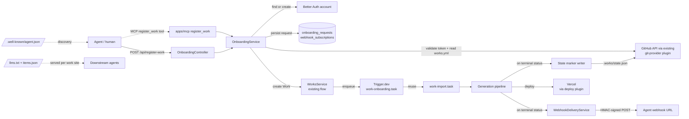

# Implementation Plan: Agent Zero-Friction Onboarding

> Translates the approved [`spec.md`](./spec.md) into an architecture and tech-choice plan.
> The plan owns implementation details; the spec owns behaviour.

**Feature ID**: `agent-zero-friction-onboarding`
**Spec**: [`./spec.md`](./spec.md)
**Tasks**: [`./tasks.md`](./tasks.md)
**Status**: `In Progress` — phases 1–7 shipped, phase 8 (default-on flip after soak) is the rollout step.
**Last updated**: 2026-05-05

---

## 1. Architecture Summary



**Reuses without change**:

- `git-provider` plugin (GitHub OAuth + PAT + GitHub App auth flows)
- `deployment` plugin (Vercel)
- `pipeline` plugin family (existing work generation)
- `WorksService.create*` and the Trigger.dev `work-import.task` (we wrap, not replace)
- Better Auth account model (`auth-account.entity.ts`, `auth-session.entity.ts`)
- Existing OpenAPI / Swagger / Scalar wiring in [`apps/api/src/main.ts`](../../../apps/api/src/main.ts)
- Existing `github-app` integration ([`apps/api/src/integrations/github-app/`](../../../apps/api/src/integrations/github-app/)) for App-mode credentials and webhook signature verification helpers

**Net-new**:

- `apps/api/src/onboarding/` module (controller, service, DTOs)
- `OnboardingRequest` and `WebhookSubscription` entities
- `WorksManifestService` — parse and validate `works.yml`
- `WebhookDeliveryService` — HMAC-signed deliveries with retry
- `register_work` MCP tool in `apps/mcp/`
- `/.well-known/agent.json` route
- `llms.txt` + `items.json` emission in the website template

## 2. Tech Choices

| Concern                    | Choice                                                                  | Rationale                                                                                             |
| -------------------------- | ----------------------------------------------------------------------- | ----------------------------------------------------------------------------------------------------- |
| Persistence                | TypeORM entities + repositories                                         | Existing pattern in `packages/agent`                                                                  |
| Background generation      | Trigger.dev task (`work-onboarding.task.ts`) calling existing tasks     | Principle IV; survives restarts; consistent with `work-generation.task` and `work-import.task`        |
| Webhook delivery           | New `WebhookDeliveryService` using BullMQ queue with exponential retry  | BullMQ already in deps; built-in retry; out-of-band from the Trigger.dev pipeline                     |
| GitHub credential validate | Existing `git-provider` capability via `GitFacade`                      | No new direct integration; Principle I                                                                |
| Manifest schema            | Zod schema in `@ever-works/contracts`                                   | Already used by some DTOs; lets us share the schema between API (validation) and CLI (lint)           |
| Manifest format            | YAML 1.2, parsed with `js-yaml` (already a transitive dep)              | Human-readable; agents and humans both edit it; matches existing `config.yml` ergonomics              |
| Webhook signing            | HMAC-SHA256 over raw body, GitHub-style `X-Hub-Signature-256` header    | Matches FR-12; reuses helper from `github-app-webhook.controller.ts` if exposed, else new shared util |
| Public endpoint protection | `@Public()` + `@Throttle()` (existing decorators)                       | The endpoint is the bootstrap; no JWT possible; throttling guards against abuse                       |
| MCP tool placement         | Inside `apps/mcp/`, no per-tool authentication for `register_work`      | Matches FR-15 (per-tool auth, not per-server); avoids a second MCP server                             |
| Discovery doc              | Static JSON served from `apps/api` (or `apps/web` if root domain hosts) | Single canonical URL `/.well-known/agent.json` accessible from `api.ever.works`                       |
| llms.txt / items.json      | Emitted by website template under `directory-web-template`              | Generated at build time, not runtime; downstream agents fetch the static file                         |
| Tests                      | Jest (unit) in `packages/agent`, Jest e2e in `apps/api/test`            | Matches existing project conventions; Vitest is for plugin packages only                              |
| Naming                     | No `agent_` prefix on tables, endpoints, or column names                | Per owner decision: humans may also use these primitives                                              |

## 3. Data Model

### New entities

Both live in `packages/agent/src/entities/`. No `agent_` prefix per owner naming guidance.

```ts
// onboarding-request.entity.ts
@Entity('onboarding_requests')
@Index(['githubIdentityHash', 'repoUrlCanonical'], { unique: true })
@Index(['repoUrlCanonical'])
export class OnboardingRequestEntity {
	@PrimaryGeneratedColumn('uuid')
	id!: string;

	@Column({ type: 'varchar', length: 64 })
	githubIdentityHash!: string; // sha256(github_user_id) — canonical identity

	@Column({ type: 'varchar', length: 512 })
	repoUrlCanonical!: string; // lowercased https URL without `.git`, no auth

	@Column({ type: 'varchar', length: 320, nullable: true })
	contactEmail?: string | null;

	@Column({ type: 'varchar', length: 256, nullable: true })
	agentId?: string | null;

	@Column({ type: 'uuid', nullable: true })
	accountId?: string | null;

	@Column({ type: 'uuid', nullable: true })
	workId?: string | null;

	@Column({ type: 'varchar', length: 64 })
	status!: OnboardingStatus; // 'received' | 'validating' | 'validated' | 'queued' | 'generating' | 'deployed' | 'failed' | 'rejected'

	@Column({ type: 'varchar', length: 128, nullable: true })
	failureCode?: string | null; // typed error slug

	@Column({ type: 'jsonb', nullable: true })
	failureDetail?: unknown;

	@Column({ type: 'varchar', length: 64, nullable: true })
	idempotencyKey?: string | null;

	@CreateDateColumn() createdAt!: Date;
	@UpdateDateColumn() updatedAt!: Date;
}
```

```ts
// webhook-subscription.entity.ts
@Entity('webhook_subscriptions')
@Index(['accountId'])
export class WebhookSubscriptionEntity {
	@PrimaryGeneratedColumn('uuid')
	id!: string;

	@Column({ type: 'uuid' })
	accountId!: string;

	@Column({ type: 'uuid', nullable: true })
	workId?: string | null; // null = account-scoped

	@Column({ type: 'varchar', length: 2048 })
	url!: string;

	/** x-secret: true — HMAC-SHA256 signing secret, encrypted at rest */
	@Column({ type: 'text' })
	secretEncrypted!: string;

	@Column({ type: 'varchar', length: 32, default: 'active' })
	status!: 'active' | 'paused' | 'failed';

	@Column({ type: 'int', default: 0 })
	consecutiveFailures!: number;

	@Column({ type: 'timestamp with time zone', nullable: true })
	lastDeliveryAt?: Date | null;

	@CreateDateColumn() createdAt!: Date;
	@UpdateDateColumn() updatedAt!: Date;
}
```

### Migrations

- `apps/api/src/migrations/[timestamp]-AddOnboardingRequests.ts` — additive, forward-only.
- `apps/api/src/migrations/[timestamp]-AddWebhookSubscriptions.ts` — additive, forward-only.
- No data backfill needed (both tables start empty).

### DTOs / contracts

New in `packages/contracts/src/api/onboarding/`:

- `register-work.dto.ts` — request DTO (typed, class-validator decorators on the API side, type only in contracts)
- `register-work.response.ts` — response shape
- `manifest.schema.ts` — Zod schema for `works.yml` v1
- `webhook-event.ts` — discriminated union of webhook payloads

## 4. API Surface

| Method | Endpoint                  | Description                                                         | Status |
| ------ | ------------------------- | ------------------------------------------------------------------- | ------ |
| `POST` | `/api/register-work`      | Zero-friction registration — creates account if needed, queues work | New    |
| `GET`  | `/api/register-work/:id`  | Status of an onboarding request                                     | New    |
| `GET`  | `/api/works/:id/status`   | Status of an existing Work (alias of generation status)             | Reuse  |
| `GET`  | `/.well-known/agent.json` | Agent Card (A2A discovery)                                          | New    |
| `GET`  | `/api/openapi.json`       | OpenAPI 3.1 (existing — registration endpoint joins automatically)  | Reuse  |

### `POST /api/register-work`

**Auth**: `@Public()` — this is the bootstrap call. Throttled at the controller level (`@Throttle({ default: { limit: 30, ttl: 60_000 } })`).

**Request DTO** (`apps/api/src/onboarding/dto/register-work.dto.ts`):

```ts
export class RegisterWorkRequestDto {
	@IsString()
	@Matches(/^https?:\/\/github\.com\/[^/]+\/[^/]+\/?$/i)
	repo!: string;

	@IsOptional()
	@IsEmail()
	email?: string;

	@IsOptional()
	@IsString()
	@Length(1, 256)
	@Matches(/^[\x21-\x7E]+$/)
	agentId?: string;

	@IsOptional()
	@IsString()
	@IsUrl({ require_tld: false })
	webhookUrl?: string;

	@IsOptional()
	@IsString()
	@Length(3, 63)
	@Matches(/^[a-z0-9]([a-z0-9-]*[a-z0-9])?$/)
	subdomain?: string;

	/** Reserved for v2 paid plane (x402 / Skyfire / Crossmint / Stripe Agent) */
	@IsOptional()
	agentPayment?: Record<string, unknown>;
}
```

**Headers**:

- `X-GitHub-Token: <pat-or-installation-token>` (required) — consumed by the controller, never logged, never echoed.
- `Idempotency-Key: <uuid>` (optional) — Stripe-style.

**Response** (202 Accepted):

```ts
export interface RegisterWorkResponseDto {
	onboardingId: string;
	workId: string;
	status: OnboardingStatus;
	statusUrl: string; // absolute
	subdomain: string; // <slug>.ever.works
	deploymentUrl?: string; // populated on terminal success
	warnings?: string[]; // e.g., "classic PAT detected, prefer fine-grained"
}
```

**Auth requirements**: Public.

**Rate-limit tier**: 30 requests / minute / IP at v1 (FR-24 narrowing limits later).

**Error responses** (typed `code` slug accompanies every error):

| Status | Code                                      | When                                                    |
| ------ | ----------------------------------------- | ------------------------------------------------------- |
| 400    | `validation_error`                        | DTO validation failure                                  |
| 403    | `gh_repo_access_denied`                   | Token cannot read or write the repo                     |
| 409    | `repo_already_owned`                      | Repo previously onboarded by a different identity       |
| 422    | `manifest_missing`                        | No `works.yml` at repo root                             |
| 422    | `manifest_invalid`                        | Schema validation failure (per-field errors)            |
| 422    | `unsupported_capability`                  | Pipeline / plugin in manifest unsupported               |
| 422    | `gh_insufficient_scope_for_repo_creation` | Manifest opts in to platform-managed repos, scope short |
| 429    | `rate_limited`                            | Throttle hit                                            |
| 500    | `internal_error`                          | Catch-all — never leaks token/PII                       |

### `GET /api/register-work/:id`

**Auth**: Public, but the request MUST present either the original `X-GitHub-Token` (server re-validates against the linked repo) or a derived `onboardingToken` returned in the 202 response. Prevents enumeration.

**Response**: status, current pipeline phase, percent-complete, deployment URL when ready, any failure code/detail.

### `GET /.well-known/agent.json`

**Auth**: Public. Cached via `Cache-Control: public, max-age=300`.

**Body**: A2A Agent Card JSON listing the `register_work` capability, the REST endpoint URL, the MCP server URL, the manifest schema URL, and contact email.

## 5. Plugin Surface

No new plugin capability is introduced. We **reuse** existing capabilities:

- `git-provider` (GitHub) — token validation, repo content read, branch creation, commit
- `deployment` (Vercel) — deploy generated site
- `pipeline` (resolved from manifest) — generation strategy

If the manifest names a pipeline / plugin not present in the registry, we return `unsupported_capability`.

## 6. Web / CLI Surface

- **No new web pages** in v1. Agents own this surface; humans use the existing Works UI.
- **CLI**: add `everworks register-work` (in `apps/cli/`) as a thin wrapper that POSTs to `/api/register-work`. Useful for humans testing the agent-facing flow and CI workflows.
- **MCP tool**: `register_work` tool in `apps/mcp/` exposing the same parameters. Public (no Ever Works credential) since registration is the bootstrap.

## 7. Background Jobs

| Trigger                              | When                                          | What it does                                                                                 | Idempotency strategy                                                |
| ------------------------------------ | --------------------------------------------- | -------------------------------------------------------------------------------------------- | ------------------------------------------------------------------- |
| `work-onboarding.task` (Trigger.dev) | Enqueued by `OnboardingService.handle()`      | Validates manifest → calls `WorksService.createFromManifest` → triggers existing import flow | DB row in `onboarding_requests` is the lock; CAS update on `status` |
| `webhook-delivery.queue` (BullMQ)    | On every terminal status transition           | Loads `WebhookSubscription`, signs payload, POSTs with retry                                 | `X-Ever-Works-Delivery` UUID; consumer-side de-dup is recommended   |
| `state-marker.task` (Trigger.dev)    | On every terminal status transition           | Commits `.works/state.json` to manifest repo if opted in                                     | Path is fixed; commit message includes delivery UUID                |
| GitHub repo webhook → reconciler     | On push to manifest repo touching `works.yml` | Re-runs validation, triggers regeneration via existing `work-generation.task`                | DB-level CAS on `works.last_manifest_sha`                           |

## 8. Security & Permissions

- **Public endpoints**: `POST /api/register-work`, `GET /api/register-work/:id`, `GET /.well-known/agent.json`. Justified: bootstrap calls and discovery — no JWT possible.
- **Throttling**: `@Throttle()` per-IP on `/api/register-work`; `repo_already_owned` check enforces "1 Work per repo URL" globally (FR-24).
- **Secrets**:
    - GitHub credential — never persisted on the `OnboardingRequest`. Used in-memory during validation; if persisted at all (only when an account opts into long-lived sync), it is encrypted at rest using the existing secret-encryption utility and marked `x-secret: true`.
    - Webhook secret — `WebhookSubscriptionEntity.secretEncrypted`, encrypted at rest.
- **Input validation**: `RegisterWorkRequestDto` via global `ValidationPipe` (existing). Manifest validation by Zod inside `WorksManifestService`, returning per-field paths.
- **Logging redaction**: existing `LoggingInterceptor` already redacts standard auth headers; extend the redaction list to cover `x-github-token` and the body field `agentPayment.*`.
- **CORS**: `POST /api/register-work` is reachable from any origin (agents call from anywhere); `GET /api/register-work/:id` similarly. CSRF not applicable (no cookie auth on these endpoints).
- **HTTPS**: enforced at the ingress layer (existing).

## 9. Observability

Activity log events emitted via the existing `ActivityLogService`:

| Event                         | When                                                                        |
| ----------------------------- | --------------------------------------------------------------------------- |
| `onboarding.received`         | Request accepted by controller (post-DTO-validation)                        |
| `onboarding.token_validated`  | GitHub token resolves and grants required access                            |
| `onboarding.token_rejected`   | GitHub token validation failed (with typed code)                            |
| `onboarding.manifest_invalid` | `works.yml` missing or fails schema                                         |
| `onboarding.account_linked`   | New or existing account linked to GitHub identity                           |
| `onboarding.work_created`     | Work row + repos created, generation enqueued                               |
| `onboarding.terminal`         | Generation finished (success / failure) — payload used for webhook + marker |
| `webhook.delivered`           | 2xx from agent webhook                                                      |
| `webhook.failed`              | Non-2xx after retry budget                                                  |

Sentry tags: `onboarding.id`, `onboarding.status`, `repo.canonical`. **Never** tag the GitHub token.

Metrics (existing PostHog / Sentry pipelines):

- `onboarding_received_total{status}`
- `onboarding_terminal_total{status}`
- `onboarding_latency_seconds` (request → 202)
- `webhook_delivery_failures_total`

## 10. Phased Rollout

1. **Phase 1 — DB & contracts**: migrations + entities + Zod schema + DTOs.
2. **Phase 2 — Service & validator**: `OnboardingService`, `WorksManifestService`, GitHub-token validation via `GitFacade`. No HTTP surface yet.
3. **Phase 3 — REST surface**: controller, route, Swagger decorators, throttling, `LoggingInterceptor` redaction additions, e2e test.
4. **Phase 4 — Background pipeline**: Trigger.dev `work-onboarding.task` wrapping the existing import flow; status transitions persisted.
5. **Phase 5 — Webhook & state marker**: `WebhookDeliveryService` (BullMQ) + `state-marker.task`; signed deliveries.
6. **Phase 6 — MCP tool & Agent Card & llms.txt**: `register_work` MCP tool, `/.well-known/agent.json`, llms.txt + items.json in the website template.
7. **Phase 7 — CLI surface**: `everworks register-work` wrapper.
8. **Phase 8 — Default-on**: feature flag flip after soak; status updated to `Implemented`.

A feature flag (`features.zeroFrictionOnboarding`) gates the public endpoint and the MCP tool until Phase 8.

## 11. Risks & Mitigations

| Risk                                                       | Likelihood | Impact | Mitigation                                                                                               |
| ---------------------------------------------------------- | ---------- | ------ | -------------------------------------------------------------------------------------------------------- |
| Public endpoint abused for spam Work creation              | Medium     | Medium | Throttle + 1-Work-per-repo + GitHub repo write-access proof gate the call                                |
| Token leak via logs                                        | Low        | High   | Redact `X-GitHub-Token` + `agentPayment.*` in `LoggingInterceptor`; never persist on `OnboardingRequest` |
| Manifest schema drift across CLI / API                     | Low        | Medium | Zod schema lives in `@ever-works/contracts`, imported by both                                            |
| Webhook deliveries to malicious agent URLs (SSRF)          | Medium     | High   | Block private/loopback ranges + cloud metadata IPs at the HTTP client layer                              |
| Ownership race when two agents register same repo          | Low        | Medium | Unique index on `(githubIdentityHash, repoUrlCanonical)`; `repo_already_owned` returned on conflict      |
| Webhook retries hammer flaky agent endpoint                | Medium     | Low    | Exponential backoff up to 6 attempts over 24h then mark `failed`; surface in status endpoint             |
| Long-running generation outlives the request               | High       | Low    | Async by design; 202 + status endpoint + webhook + state marker — three completion signals               |
| Classic PAT with overly broad scope persisted accidentally | Low        | High   | Validate-then-discard during onboarding; only persist via account-level token store, encrypted           |

## 12. Constitution Reconciliation

- **Principle I (Plugin-first)**: GitHub auth, deployment, and generation flow through existing plugins. ✔
- **Principle II (Capability-driven)**: Pipeline resolved from manifest, not hard-coded. ✔
- **Principle III (Source-of-truth repos)**: Manifest repo is the source of truth; `.works/state.json` is platform-written but namespaced. ✔
- **Principle IV (Long-running via Trigger.dev)**: Generation runs in `work-onboarding.task` → `work-import.task`. ✔
- **Principle V (Forward-only migrations)**: Two additive migrations, no `DROP`. ✔
- **Principle VI (Tests accompany change)**: see [`tasks.md`](./tasks.md) — every new file has a test. ✔
- **Principle VII (Secrets per `x-secret`)**: GitHub credential not persisted; webhook secret encrypted at rest with `x-secret: true`. ✔
- **Principle VIII (Plugin counts in canonical doc only)**: No new plugins. ✔
- **Principle IX (Behaviour-first)**: Implementation lives here; spec stays behavioural. ✔
- **Principle X (Backwards-compatible API/SDK/schema)**: New endpoint, new tables, additive only. `agent_payment` field reserved for v2. ✔

## 13. References

- Spec: [`./spec.md`](./spec.md)
- Tasks: [`./tasks.md`](./tasks.md)
- Manifest schema spec: [`./manifest-schema.md`](./manifest-schema.md)
- Related architecture:
    - [`docs/api/works.md`](../../../api/works.md)
    - [`docs/api/git-provider-capability.md`](../../../api/git-provider-capability.md)
    - [`docs/api/deploy-capability.md`](../../../api/deploy-capability.md)
- Related features:
    - [`creating-a-work`](../creating-a-work/spec.md)
    - [`work-import`](../work-import/spec.md)
    - [`mcp-server`](../mcp-server/spec.md)
- Industry references (informational):
    - Model Context Protocol — agent tool exposure
    - Agent2Agent / Agent Card — discovery at `/.well-known/agent.json`
    - llms.txt — site-level convention for downstream agents
    - GitHub webhook signature scheme — `X-Hub-Signature-256`
    - x402 / Skyfire / Crossmint / Stripe Agent — future paid plane
