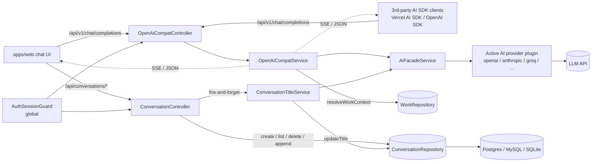

# Implementation Plan: AI Conversation

**Feature ID**: `ai-conversation`
**Spec**: `./spec.md`
**Tasks**: `./tasks.md`
**Status**: `Done` (retrospective — surface already shipped)
**Last updated**: 2026-05-08

---

## 1. Architecture Summary



## 2. Tech Choices

| Concern               | Choice                                           | Rationale                                                                                                              |
| --------------------- | ------------------------------------------------ | ---------------------------------------------------------------------------------------------------------------------- |
| Persistence           | TypeORM `Conversation` + `ConversationMessage` entities w/ `@OneToMany` cascade and `(userId, updatedAt)` composite index | Existing pattern in `packages/agent/src/entities/` — matches `User`/`Work`/`ActivityLog` modelling.                    |
| Repository            | `ConversationRepository` (Nest `@Injectable`, uses `@InjectRepository`)                                       | Owns all `(id, userId)` filters so cross-user reads cannot bypass it.                                                  |
| HTTP transport        | Nest controllers + `Express`-style `Res` for SSE                                                                 | Streaming requires direct `res.write` — Nest's default Send-by-return doesn't support per-chunk flush.                 |
| OpenAI compatibility  | Hand-mapped DTOs with `class-validator` + `class-transformer`                                                    | Lets us use the same Nest validation pipeline while keeping the wire shape OpenAI-identical.                            |
| Validation pipe       | `new ValidationPipe({whitelist: true, transform: true})` (NO `forbidNonWhitelisted`)                             | AI SDK clients send extra fields (`stream_options`, `logprobs`, `parallel_tool_calls`, …) we don't use but must not 422 on. |
| AI integration        | `AiFacadeService` from `@ever-works/agent/facades`                                                              | Capability-driven Principle II — provider/model/plugin all resolved by the facade.                                     |
| Title generation      | Background `.catch(()=>{})` from the controller, NOT a Trigger.dev task                                          | Sub-second work, doesn't need to survive restarts; latency-of-message-append must NOT be coupled.                       |
| SSE encoding          | `data: ${JSON.stringify(chunk)}\n\n` + `data: [DONE]\n\n` terminator                                              | OpenAI/Vercel-AI-SDK wire compatibility.                                                                                |
| Error sanitisation    | Regex redaction of `(sk-|key-|token-|Bearer\s+)[A-Za-z0-9_-]{10,}` + 300-char cap                                 | Matches the secret-shape patterns used elsewhere in the codebase; never let a provider's leaked key escape to the client. |

## 3. Data Model

### Entities (already shipped)

```ts
// packages/agent/src/entities/conversation.entity.ts
@Entity({ name: 'conversations' })
@Index(['userId', 'updatedAt'])
export class Conversation {
    @PrimaryGeneratedColumn('uuid') id: string;
    @Column() @Index() userId: string;
    @ManyToOne(() => User, { onDelete: 'CASCADE' })
    @JoinColumn({ name: 'userId' }) user: User;
    @Column({ type: 'varchar', length: 200, nullable: true }) title?: string;
    @Column({ type: 'varchar', length: 100, nullable: true }) providerId?: string;
    @Column({ type: 'varchar', length: 100, nullable: true }) model?: string;
    @Column({ type: 'simple-json', nullable: true }) metadata?: Record<string, unknown>;
    @OneToMany(() => ConversationMessage, (m) => m.conversation, { cascade: true })
    messages: ConversationMessage[];
    @CreateDateColumn() createdAt: Date;
    @UpdateDateColumn() updatedAt: Date;
}

// packages/agent/src/entities/conversation-message.entity.ts
@Entity({ name: 'conversation_messages' })
@Index(['conversationId', 'createdAt'])
export class ConversationMessage {
    @PrimaryGeneratedColumn('uuid') id: string;
    @Column() @Index() conversationId: string;
    @ManyToOne(() => Conversation, (c) => c.messages, { onDelete: 'CASCADE' })
    @JoinColumn({ name: 'conversationId' }) conversation: Conversation;
    @Column({ type: 'varchar', length: 20 }) role: 'user' | 'assistant' | 'system' | 'tool';
    @Column({ type: 'text' }) content: string;
    @Column({ type: 'simple-json', nullable: true }) parts?: unknown[];
    @Column({ type: 'varchar', length: 100, nullable: true }) model?: string;
    @Column({ type: 'simple-json', nullable: true })
    usage?: { promptTokens: number; completionTokens: number; totalTokens: number };
    @CreateDateColumn() createdAt: Date;
}
```

### Indexes

- `(userId, updatedAt)` composite on `conversations` — fast list endpoint
  with `ORDER BY updatedAt DESC`.
- `userId` standalone on `conversations` — covers user-scoped count queries.
- `(conversationId, createdAt)` composite on `conversation_messages` —
  fast `ORDER BY createdAt ASC` on `findById`.
- `conversationId` standalone on `conversation_messages` — covers
  cascade deletes.

### Migration story

Forward-only TypeORM migration under
`apps/api/src/database/migrations/` adds both tables with the indexes
above. There is no backfill — the feature is additive.

### DTOs / contracts

`apps/api/src/ai-conversation/dto/openai-compat.dto.ts` mirrors the
OpenAI 2024-08-06 chat-completions request/response wire format.
Internal `ChatMessage` / `ChatCompletionOptions` /
`ChatCompletionResponse` / `ChatCompletionChunk` / `ToolDefinition`
types come from `@ever-works/plugin` and are NOT redeclared here.

No additions to `@ever-works/contracts` — the OpenAI types live close
to the controller because they are consumed only by the controller +
service pair.

## 4. API Surface

### Conversation REST surface (`/api/conversations`)

| Method   | Endpoint                          | Description                        | Status |
| -------- | --------------------------------- | ---------------------------------- | ------ |
| `GET`    | `/api/conversations`              | List user's conversations          | Shipped |
| `POST`   | `/api/conversations`              | Create a conversation              | Shipped |
| `GET`    | `/api/conversations/:id`          | Read one (with messages)           | Shipped |
| `PATCH`  | `/api/conversations/:id`          | Rename (204)                       | Shipped |
| `POST`   | `/api/conversations/:id/messages` | Append messages, derive title      | Shipped |
| `DELETE` | `/api/conversations/:id`          | Delete one (204)                   | Shipped |
| `DELETE` | `/api/conversations`              | Bulk delete user's conversations   | Shipped |

For each endpoint:

- **Auth**: `AuthSessionGuard` (global) — `auth.userId` is the only
  source of truth; body / query never carries identity.
- **Rate-limit**: default global throttle (`@nestjs/throttler` tiers).
- **Validation**: minimal — bodies are typed, but no DTO classes
  beyond what's already in `OpenAiChatCompletionRequestDto`. (See
  OQ-7 follow-up.)
- **Errors**:
    - `404 NotFoundException` — missing or cross-user `:id`.
    - `401` — unauthenticated (handled by guard).

### OpenAI-compatible chat completions (`/api/v1/chat/completions`)

| Method | Endpoint                       | Description                                  | Status |
| ------ | ------------------------------ | -------------------------------------------- | ------ |
| `POST` | `/api/v1/chat/completions`     | OpenAI-compat chat completion (sync + SSE)   | Shipped |

- **Body**: `OpenAiChatCompletionRequestDto` — `messages` required;
  `model`, `temperature`, `max_tokens`, `top_p`, `frequency_penalty`,
  `presence_penalty`, `stop`, `stream`, `stream_options`, `tools`,
  `tool_choice`, `response_format`, `user` all optional. Permissive
  `whitelist: true` validation pipe (no `forbidNonWhitelisted`) so
  unknown fields are stripped silently rather than rejected.
- **Headers**: `x-provider-override` and `x-work-id` are forwarded
  to the AI facade as `FacadeOptions.providerOverride` and
  `FacadeOptions.workId`.
- **Response shape (sync)**: OpenAI 2024-08-06
  `chat.completion` envelope (`{id, object, created, model, choices,
usage?}`).
- **Response shape (stream)**: SSE frames
  `data: <ChatCompletionChunkResponse JSON>\n\n`, terminated by
  `data: [DONE]\n\n`. Headers: `Content-Type: text/event-stream`,
  `Cache-Control: no-cache`, `Connection: keep-alive`,
  `X-Accel-Buffering: no`.
- **Errors**:
    - Pre-headers streaming error → `502 application/json`
      `{error: {message, type:'provider_error', code:'ai_provider_error'}}`.
    - Post-headers streaming error → `socket.destroy(error)`.
    - Body validation failure (impossible message shape) → `400`.
    - `401` — unauthenticated (handled by guard).

## 5. Plugin Surface (if any)

No new plugin and no new capability interface. The feature consumes
the existing `AiFacadeService` from `@ever-works/agent/facades`,
which routes through the active `ai-provider` or `ai-gateway` plugin
based on `FacadeOptions`.

## 6. Web / CLI Surface

- **Web**: the chat UI under `apps/web/src/app/(authenticated)/chat`
  (path may vary — out of this spec's scope). It speaks to both
  `/api/conversations/*` (CRUD) and `/api/v1/chat/completions`
  (streaming) directly.
- **CLI / MCP**: no additions.

## 7. Background Jobs

| Trigger                                           | When                                 | What it does                                     | Idempotency strategy                                                         |
| ------------------------------------------------- | ------------------------------------ | ------------------------------------------------ | ----------------------------------------------------------------------------- |
| `titleService.maybeGenerateTitle().catch(()=>{})` | On every `POST /:id/messages` reply, after the response is sent | Generate an AI title when the conversation crosses 4 messages. | Gated on `messageCount >= 4 && !metadata.aiTitle`; the `aiTitle:true` metadata flag prevents re-runs. Failures are swallowed. |

This is **not** a Trigger.dev task — sub-second work, doesn't need to
survive restarts, and the response MUST not wait for it.

## 8. Security & Permissions

- All endpoints under `AuthSessionGuard` (global). No `@Public()`
  endpoints in this feature.
- `auth.userId` is the only identity source. Body / query never
  carries `userId`.
- Cross-user reads MUST surface as `NotFoundException` (handled at
  the repository level via the `(id, userId)` filter).
- `OpenAiCompatService.sanitizeErrorMessage` redacts secret-shaped
  substrings before any provider error reaches the client.
- All TypeORM columns containing free-form text (`title`, `content`,
  `parts`, `metadata`, `usage`) are written verbatim with no template
  expansion — there is no SSR/HTML render path that would create XSS
  exposure on the API side. The web app is responsible for treating
  these as untrusted text on render.
- No `x-secret` fields — provider API keys live in plugin settings,
  not in the request body.

## 9. Observability

- **Activity log**: this feature does **NOT** emit activity-log
  entries. Conversation create / read / update / delete / message
  append are user-private, high-volume, and not security-sensitive.
- **Logger**:
    - `OpenAiCompatService.handleStreamingCompletion` →
      `logger.error('Streaming completion error', error)` on any
      streaming-side throw.
    - `ConversationTitleService.maybeGenerateTitle` →
      `logger.debug('AI title generation failed', err)` on any
      AI-side throw.
- **Metrics**: none new. Standard Nest request-duration histograms
  cover the controllers.

## 10. Phased Rollout

This feature has shipped. There is no rollout to plan.

If a similar surface lands in the future (e.g. server-side tool
execution, conversation sharing), the staged rollout would be:

1. Migration + repository changes behind a feature flag.
2. Controller endpoints behind the same flag.
3. UI integration.
4. Default-on after a 7-day soak.

## 11. Risks & Mitigations

| Risk                                                                                                  | Likelihood | Impact                                                          | Mitigation                                                                                                                                                |
| ----------------------------------------------------------------------------------------------------- | ---------- | --------------------------------------------------------------- | --------------------------------------------------------------------------------------------------------------------------------------------------------- |
| Sequential `appendMessage` saves dominate latency on long conversations.                              | Medium     | Slow `POST /:id/messages` response, especially for long pastes. | OQ-5 follow-up — switch to a single batch save with explicit per-row `createdAt` once cross-driver tests are in place.                                    |
| AI title generation uses a different work / provider than the user expects.                          | Low        | Wrong-toned title.                                              | OQ-4 follow-up — resolve provider from `conversation.providerId` first, fall back to first work only when `providerId` is unset.                          |
| Provider key leaks via streaming error message.                                                       | Medium     | Credential exposure.                                            | `sanitizeErrorMessage` regex covers `sk-` / `key-` / `token-` / `Bearer …` shapes. 300-char truncation as belt-and-braces. Test pinned in PR #484.        |
| Pre-headers vs post-headers error path divergence is subtle and easy to regress.                     | Low        | Half-open SSE connection / wrong-status JSON tail.              | Both paths are individually unit-tested in `openai-compat.service.spec.ts` (PR #484).                                                                     |
| Tool-call delta mapper accidentally adds `id`/`type`/`name` to continuation chunks.                  | Medium     | `@ai-sdk/openai-compatible` parser breaks on every tool call.   | Behaviour is pinned by the FR-18 test ("Only include id/type/name on the first chunk of a tool call"); the comment in source links the parser invariant. |

## 12. Constitution Reconciliation

- **Principle I (Plugin-first)**: AI providers live in plugins; this
  feature only consumes `AiFacadeService`. No external integration
  is implemented in `apps/api`. ✅
- **Principle II (Capability-driven)**: `model === 'auto'` translates
  to `undefined` so the facade resolves model + provider via plugin
  capabilities. ✅
- **Principle III (Source-of-truth repos)**: conversation messages
  are platform state, not work-repo content. ✅
- **Principle IV (Long-running work via Trigger.dev)**: chat
  completions are request-scoped (≤ provider response time); title
  generation is sub-second. Trigger.dev would be overkill. ✅
- **Principle V (Forward-only migrations)**: the
  `conversations`/`conversation_messages` tables shipped via
  forward-only migrations, additive only. ✅
- **Principle VI (Tests accompany the change)**: 56 unit tests in
  PR [#484](https://github.com/ever-works/ever-works/pull/484). ✅
- **Principle VII (Secrets handled per `x-secret`)**: the OpenAI-compat
  surface accepts NO key from the client; all keys come from plugin
  settings (already secret-tagged). ✅
- **Principle VIII (Plugin counts touch the canonical doc only)**:
  N/A — this feature does not add a plugin. ✅
- **Principle IX (Behaviour-first spec)**: `spec.md` describes
  observable behaviour only; this `plan.md` carries the
  implementation. ✅
- **Principle X (Backwards-compatible)**: the OpenAI wire format is
  a stable public contract; all internal fields are optional and
  additive. The feature does not break any existing endpoint. ✅

## 13. References

- Spec: `./spec.md`
- Tasks: `./tasks.md`
- Source:
    - [`apps/api/src/ai-conversation/conversation.controller.ts`](../../../../apps/api/src/ai-conversation/conversation.controller.ts)
    - [`apps/api/src/ai-conversation/conversation-title.service.ts`](../../../../apps/api/src/ai-conversation/conversation-title.service.ts)
    - [`apps/api/src/ai-conversation/openai-compat.controller.ts`](../../../../apps/api/src/ai-conversation/openai-compat.controller.ts)
    - [`apps/api/src/ai-conversation/openai-compat.service.ts`](../../../../apps/api/src/ai-conversation/openai-compat.service.ts)
    - [`apps/api/src/ai-conversation/dto/openai-compat.dto.ts`](../../../../apps/api/src/ai-conversation/dto/openai-compat.dto.ts)
    - [`packages/agent/src/database/repositories/conversation.repository.ts`](../../../../packages/agent/src/database/repositories/conversation.repository.ts)
    - [`packages/agent/src/entities/conversation.entity.ts`](../../../../packages/agent/src/entities/conversation.entity.ts)
    - [`packages/agent/src/entities/conversation-message.entity.ts`](../../../../packages/agent/src/entities/conversation-message.entity.ts)
- Tests: see `spec.md` §10.
- Test PR: [#484](https://github.com/ever-works/ever-works/pull/484).
- Related specs:
  [`auth-jwt-oauth`](../auth-jwt-oauth/spec.md),
  [`plugin-system`](../plugin-system/spec.md),
  [`subscriptions`](../subscriptions/spec.md).
