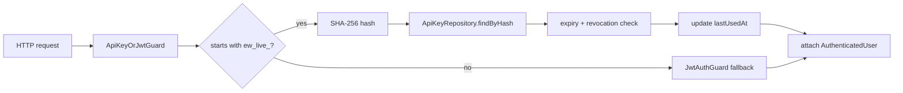

# Implementation Plan: API Keys

**Feature ID**: `api-keys`
**Spec**: `./spec.md`
**Status**: `Done` (Retrospective)
**Last updated**: 2026-05-01

---

## 1. Architecture



## 2. Tech Choices

| Concern               | Choice                                                  | Rationale                                                  |
| --------------------- | ------------------------------------------------------- | ---------------------------------------------------------- |
| Hash algorithm        | SHA-256 (Node.js `crypto`)                              | Fast, deterministic, no salt needed for high-entropy keys  |
| Random secret         | `crypto.randomBytes(32).toString('hex')` → 64 hex chars | 256 bits of entropy                                        |
| Storage               | `api_keys` table with unique index on `hash`            | O(log n) lookup; uniqueness enforces no hash collisions    |
| Header parsing        | Custom guard runs before `JwtAuthGuard`                 | Single auth surface, no per-route opt-in needed            |
| `lastUsedAt` strategy | Update on success only, fire-and-forget                 | Doesn't block the request; eventual consistency acceptable |

## 3. Data Model

```ts
@Entity('api_keys')
@Index(['hash'], { unique: true })
export class ApiKey {
	@PrimaryGeneratedColumn('uuid') id: string;
	@Column() userId: string;
	@Column() name: string;
	@Column() hash: string; // SHA-256 hex, 64 chars
	@Column() prefix: string; // first 12 chars of full key
	@Column({ nullable: true }) expiresAt: Date | null;
	@Column({ nullable: true }) lastUsedAt: Date | null;
	@CreateDateColumn() createdAt: Date;
}
```

Migration: additive, indexed by `(userId)` and unique `(hash)`.

## 4. API Surface

| Method   | Endpoint                 | Auth | Description      |
| -------- | ------------------------ | ---- | ---------------- |
| `POST`   | `/api/auth/api-keys`     | JWT  | Create a key     |
| `GET`    | `/api/auth/api-keys`     | JWT  | List user's keys |
| `DELETE` | `/api/auth/api-keys/:id` | JWT  | Revoke a key     |

Create returns the full key once. List returns `prefix + metadata` only.

## 5. Plugin Surface

None — API keys are core auth.

## 6. Web / CLI Surface

- Web: **Settings → API Keys** page with create/list/revoke controls.
  Create modal shows the full key once with a "Copy" button and an
  explicit "I've stored this key, dismiss" gate.
- CLI: not exposed (CLI uses the same key transport but doesn't manage them).

## 7. Background Jobs

A daily cron deletes keys whose `expiresAt` is in the past — cleanup only,
not security-critical (auth check rejects expired keys regardless).

## 8. Security & Permissions

- Key management endpoints reject API-key auth (JWT only).
- The display prefix is safe to log; the full key is never logged.
- SHA-256 (no salt) is acceptable because keys carry 256 bits of entropy
  — pre-image resistance is the only property we need.

## 9. Observability

- Activity log: `api_key_created`, `api_key_revoked` actions with the
  key's name and prefix.
- Auth failures: log prefix + reason (`expired` / `revoked` / `not_found`).

## 10. Risks & Mitigations

| Risk                                       | Mitigation                                                    |
| ------------------------------------------ | ------------------------------------------------------------- |
| Hash collision                             | UNIQUE index on `hash` — collision would fail insert          |
| `lastUsedAt` write contention on hot keys  | Fire-and-forget update; loss of a single timestamp acceptable |
| Per-user cap bypass via concurrent creates | Cap check + insert in a transaction                           |

## 11. Constitution Reconciliation

See `spec.md` §9.

## 12. References

- Spec: `./spec.md`
- Implementation: `apps/api/src/auth/api-keys/`
