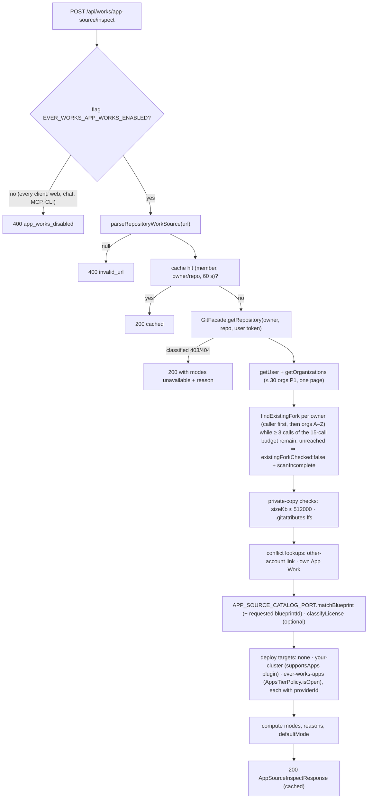
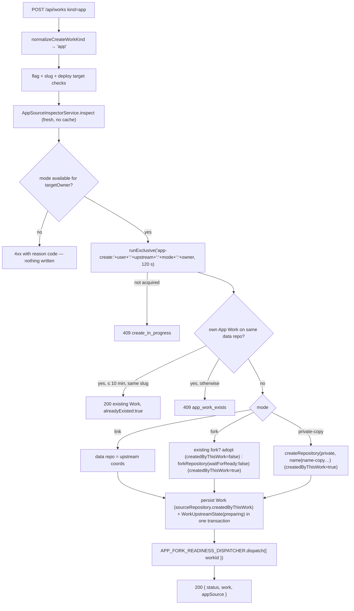

# Implementation Plan: App Work kind & create from any repository URL

> Translates [`spec.md`](./spec.md) into architecture and tech choices. The plan owns implementation
> detail; the spec owns behaviour. **Every path below was opened in the worktree before it was written
> down** — no path in this document is invented. Paths marked **(new)** do not exist yet.

**Epic ID**: `APW-01-app-work-kind`
**Spec**: [`./spec.md`](./spec.md) · **Tasks**: [`./tasks.md`](./tasks.md)
**Status**: `Draft`
**Last updated**: 2026-09-17
**Contracts**: [`../CONTRACTS.md`](../CONTRACTS.md) — this epic owns `Work.kind = 'app'`,
`WORK_KIND_CAPABILITIES.app` (incl. the `builds` / `appEnvironment` flags, R-7), the `app_*` source types +
`sourceRepository.upstream`, `sourceRepository.blueprintId`, `sourceRepository.createdByThisWork`,
`POST /api/works/app-source/inspect`, the `POST /api/works` app fields, `delete_stored_data` on
`POST /api/works/:id/delete`, the `APP_SOURCE_CATALOG_PORT` and `APP_WORK_DELETION_PORT` tokens, the deletion completion
`WorkLifecycleService.completeAppWorkDeletion(workId)`, the
`app.source.*` Activity events, the `works-app` flag and `EVER_WORKS_APP_WORKS_ENABLED`. It consumes, by the
names their plans fix, **with the phase each symbol ships in** — APW-03 **P1**: `AppSpecService` (its T12) and the
contracts barrel (its T1); APW-03 **P2 ("Wave 1 catalog seam", merged before this epic's P1)**: the
`APP_SOURCE_CATALOG_PORT` binding `AppSourceCatalogAdapter` (its T26), `AppBlueprintApplyService` (its T28 with
T53), the optional git capability `commitFiles?` (its T22), `AppsCatalogBrowser` (its T32) and `AppsCatalogService`
(its T24); APW-03 **P3**: `AppLicenseService` (its T42, injected `@Optional()` until it lands); APW-02 **P0/P1**:
the plugin additions, `WorkUpstreamState`, `APP_FORK_READINESS_DISPATCHER`, `APP_FORK_READY_HANDLER` and
`createBranchFromSha`; APW-06 **T2**: `supportsApps` / `isAppDeploymentPlugin`; APW-06 **T3**:
`packages/agent/src/app-runtime/ports.ts` with the `AppsTierPolicy` port and its closed default; APW-04's
`AppProvisioningService.start` and APW-06's `APP_WORK_DELETION_PORT` binding
(`AppRuntimeDeletionService`, which calls back this epic's `completeAppWorkDeletion(workId)`) — both injected
`@Optional()` and both merging after this epic. The ports land ahead of this epic; only their **bindings** are
optional.

**Program audit resolutions applied** ([CONTRACTS §0](../CONTRACTS.md#0-program-audit-resolutions-binding-2026-09-17-against-develop-ee45946e5)):
R-1 (shared types live in `packages/contracts/src/apps/`), R-2 (`actionType` `app_source`, dotted `action`), R-3
(license chip classes), R-4 (first write: one `commitFiles` commit on a repository this App Work created, a setup
pull request otherwise — never a clone, never a push to a default branch the platform did not create), R-5 (managed
hosting read through `AppsTierPolicy`, never the env var), R-6 (the API gate refuses inspect and create for every
client), R-7 (`builds` + `appEnvironment` capabilities), R-12 (deploy target `none`), R-15 (delete composes APW-06's
workload removal before the row is deleted; the typed confirmation is the slug), R-22 (no suites under `apps/api/test/`).

---

## 1. Current state in the codebase

### 1.1 What ships today

| Layer    | File                                                                                                                                                                                                                            | What it does                                                                                                                                                                                                                                                                                                                                                                                                                                                                                                                                            |
| -------- | ------------------------------------------------------------------------------------------------------------------------------------------------------------------------------------------------------------------------------- | ------------------------------------------------------------------------------------------------------------------------------------------------------------------------------------------------------------------------------------------------------------------------------------------------------------------------------------------------------------------------------------------------------------------------------------------------------------------------------------------------------------------------------------------------------- |
| Contract | [`packages/contracts/src/domain/work-kind.ts`](../../../../../packages/contracts/src/domain/work-kind.ts)                                                                                                                       | `USER_SELECTABLE_WORK_KINDS` (six, incl. `repo`), `WORK_KINDS`, `normalizeWorkKind` (unknown → `default`, never throws), `isRepositoryWorkKind`.                                                                                                                                                                                                                                                                                                                                                                                                        |
| Contract | [`packages/contracts/src/domain/work-capabilities.ts`](../../../../../packages/contracts/src/domain/work-capabilities.ts)                                                                                                       | `WORK_KIND_CAPABILITIES` hide-list; `repo` = items/taxonomy/comparisons/communityPr/importExport/sourceValidation/deploy **off**, `kb` on, `repos: { data: true, work: false, website: false }`; `getWorkCapabilities`.                                                                                                                                                                                                                                                                                                                                 |
| Contract | [`packages/contracts/src/domain/__tests__/work-capabilities.spec.ts`](../../../../../packages/contracts/src/domain/__tests__/work-capabilities.spec.ts)                                                                         | Pins **"keeps `repo` the only user-selectable kind without a website repository"** (line ~115) and **"never deploys a kind that has no website repository to deploy"** (line ~120). Both are false the moment `app` exists.                                                                                                                                                                                                                                                                                                                             |
| Contract | [`packages/contracts/src/domain/__tests__/work-kind-docs-parity.spec.ts`](../../../../../packages/contracts/src/domain/__tests__/work-kind-docs-parity.spec.ts)                                                                 | Fails unless every kind appears in [`docs/features/work-kinds.md`](../../../../../docs/features/work-kinds.md).                                                                                                                                                                                                                                                                                                                                                                                                                                         |
| Contract | [`packages/contracts/src/api/work/import-source.dto.ts`](../../../../../packages/contracts/src/api/work/import-source.dto.ts)                                                                                                   | `IMPORT_SOURCE_TYPES = ['data_repo','awesome_readme','link_existing','works_config']`; `SourceRepository { url, owner, repo, type: ImportSourceType, importedAt, relatedRepositories?, worksConfig? }`.                                                                                                                                                                                                                                                                                                                                                 |
| Agent    | [`packages/agent/src/dto/import-work.dto.ts`](../../../../../packages/agent/src/dto/import-work.dto.ts)                                                                                                                         | `@IsIn(IMPORT_SOURCE_TYPES)` — widening that constant would let Work Import accept `app_*` types. **It must not be widened.**                                                                                                                                                                                                                                                                                                                                                                                                                           |
| Agent    | [`packages/agent/src/dto/create-work.dto.ts`](../../../../../packages/agent/src/dto/create-work.dto.ts)                                                                                                                         | `kind` `@IsIn([...USER_SELECTABLE_WORK_KINDS, 'default'])` + `normalizeCreateWorkKind`; `repositoryUrl?` (≤ 400, trimmed). No mode, no target owner.                                                                                                                                                                                                                                                                                                                                                                                                    |
| Agent    | [`packages/agent/src/works/repository-work-source.ts`](../../../../../packages/agent/src/works/repository-work-source.ts)                                                                                                       | `parseRepositoryWorkSource` — pure, GitHub-only, owner/repo, case preserved, rejects credentials/query/fragment. **Reused verbatim.**                                                                                                                                                                                                                                                                                                                                                                                                                   |
| Agent    | [`packages/agent/src/works/repository-work-guard.ts`](../../../../../packages/agent/src/works/repository-work-guard.ts)                                                                                                         | `isRepositoryWork`, `assertNotRepositoryWork(work, action)`, `hasRepositoryRole`, `assertRepositoryRole`. Kind test for `repo` only. **Not modified** (D1).                                                                                                                                                                                                                                                                                                                                                                                             |
| Agent    | [`packages/agent/src/services/work-lifecycle.service.ts`](../../../../../packages/agent/src/services/work-lifecycle.service.ts)                                                                                                 | `createWork` (~254) resolves `repositorySource` first; `resolveRepositoryWorkSource` (~503) → `assertRepositoryAccessible` (~531, `gitFacade.hasRepositoryAccess`) → `assertRepositoryNotWrappedByAnotherAccount` (~567, 409); `applyRepositoryWorkSource` (~608) persists `deployProvider: null`, `sourceRepository.type = 'link_existing'`, `generateStatus = generated/linked`, `syncIntervalMinutes = 0`. `updateWork` (~851) freezes `owner` for `repo`. `deleteWork` (~1370) deletes the data repository when `delete_data_repository !== false`. |
| Agent    | [`packages/agent/src/items-generator/dto/delete-items-generator.dto.ts`](../../../../../packages/agent/src/items-generator/dto/delete-items-generator.dto.ts)                                                                   | `DeleteWorkDto.delete_data_repository?: boolean = false` — the HTTP body defaults to keep; inside the service only an explicit `false` means keep for generated kinds (`!== false`).                                                                                                                                                                                                                                                                                                                                                                    |
| Agent    | [`packages/agent/src/database/repositories/work.repository.ts`](../../../../../packages/agent/src/database/repositories/work.repository.ts)                                                                                     | `findRepositoryWorksWrapping(owner, repo)` (~298) — `kind = 'repo'` only, case-insensitive on the `data` role; `findByDataRepoFullName` (~263) for App-installed Works.                                                                                                                                                                                                                                                                                                                                                                                 |
| Agent    | [`packages/agent/src/facades/git.facade.ts`](../../../../../packages/agent/src/facades/git.facade.ts)                                                                                                                           | `getRepository` (~522), `hasRepositoryAccess` (~587), `forkRepository` (~600), `getUser`/`getOrganizations` (~512/517), `createRepository` (~557), `deleteRepository` (~565), `getRepoDir` (~1488 — clones the **top-level** `sourceRepository.owner/repo`, not the data role), `resolvePluginAndToken` (~1622).                                                                                                                                                                                                                                        |
| Plugin   | [`packages/plugins/github/src/github-api.service.ts`](../../../../../packages/plugins/github/src/github-api.service.ts)                                                                                                         | `hasRepositoryAccess` (~1180) maps **both 404 and 403 to `false`**, so a rate limit, a SAML block and a third-party-access restriction all read as "no access".                                                                                                                                                                                                                                                                                                                                                                                         |
| Agent    | [`packages/agent/src/template-catalog/template-catalog.service.ts`](../../../../../packages/agent/src/template-catalog/template-catalog.service.ts)                                                                             | `forkTemplateForUser` (~427): target owner = `gitUser.login` or a login from `getOrganizations`, case-insensitive (~459–474). **The owner-check pattern to copy.** Hard-codes `providerId = 'github'` (existing, not extended here).                                                                                                                                                                                                                                                                                                                    |
| Agent    | [`packages/agent/src/cache/distributed-task-lock.service.ts`](../../../../../packages/agent/src/cache/distributed-task-lock.service.ts)                                                                                         | `runExclusive(key, fn, { ttlMs })` — INSERT-as-lock on `cache_entries`, `{ acquired: false }` when held. **The in-flight create guard.**                                                                                                                                                                                                                                                                                                                                                                                                                |
| Agent    | [`packages/agent/src/works-config/services/works-config-repository-sync.service.ts`](../../../../../packages/agent/src/works-config/services/works-config-repository-sync.service.ts)                                           | `syncWork` clones the Work Repository and rewrites `.works/works.yml` with v1 generator keys (prompt, model, providers, website repo) via `WorksConfigWriterService`, then pushes.                                                                                                                                                                                                                                                                                                                                                                      |
| Agent    | [`packages/agent/src/services/knowledge-base-git-mirror.service.ts`](../../../../../packages/agent/src/services/knowledge-base-git-mirror.service.ts)                                                                           | Commits `.content/kb/**` and pushes (~887) to the Work Repository — on an App Work that is the deploy branch.                                                                                                                                                                                                                                                                                                                                                                                                                                           |
| Agent    | [`packages/agent/src/import/source-sync-support.ts`](../../../../../packages/agent/src/import/source-sync-support.ts)                                                                                                           | `supportsWorkSourceSync(sourceType?: ImportSourceType)` — whitelist `data_repo`/`awesome_readme`/`works_config`. Signature must widen when `SourceRepository.type` widens.                                                                                                                                                                                                                                                                                                                                                                              |
| Agent    | [`packages/agent/src/entities/activity-log.types.ts`](../../../../../packages/agent/src/entities/activity-log.types.ts)                                                                                                         | `ActivityActionType` — snake_case values (`work_created`, `template_forked`); column `varchar(50)`.                                                                                                                                                                                                                                                                                                                                                                                                                                                     |
| API      | [`apps/api/src/works/works.controller.ts`](../../../../../apps/api/src/works/works.controller.ts)                                                                                                                               | `POST works` (~337, `200`) → `createWork`; static routes declared before `works/:id` (`works/check-slug` ~310 carries the comment).                                                                                                                                                                                                                                                                                                                                                                                                                     |
| API      | [`apps/api/src/plugins-capabilities/deploy/deploy.service.ts`](../../../../../apps/api/src/plugins-capabilities/deploy/deploy.service.ts)                                                                                       | `deploy` refuses `repo` before the facade (~198). Nothing refuses `app`: it would reach the website workflow path.                                                                                                                                                                                                                                                                                                                                                                                                                                      |
| API      | [`apps/api/src/plugins-capabilities/deploy/cluster-source-matrix.ts`](../../../../../apps/api/src/plugins-capabilities/deploy/cluster-source-matrix.ts)                                                                         | `allowedClusterSourcesFor` — `custom-kubeconfig` is the "Your cluster" source.                                                                                                                                                                                                                                                                                                                                                                                                                                                                          |
| MCP      | [`apps/mcp/src/openapi-tools/whitelist.ts`](../../../../../apps/mcp/src/openapi-tools/whitelist.ts)                                                                                                                             | `create_work` = `POST /api/works` (schema generated from OpenAPI, so new DTO fields appear automatically); `annotations.readOnlyHint`.                                                                                                                                                                                                                                                                                                                                                                                                                  |
| Web      | [`apps/web/src/lib/feature-flags/work-kinds.ts`](../../../../../apps/web/src/lib/feature-flags/work-kinds.ts)                                                                                                                   | `getDisabledWorkKinds` — flag `works-<kind>`, **fail-open**: missing flag / no PostHog key ⇒ enabled.                                                                                                                                                                                                                                                                                                                                                                                                                                                   |
| Web      | [`apps/web/src/components/new/NewPageClient.tsx`](../../../../../apps/web/src/components/new/NewPageClient.tsx)                                                                                                                 | `CHIP_ORDER`, `CHIP_ICONS`, `PLACEHOLDERS_BY_CHIP`, `CHIP_INTENT_LABEL`, `CHIP_TO_CANVAS_ROUTE`, `CHIP_TO_WORK_KIND`; `repo` submit routes to `/works/new?mode=manual&kind=repo&prompt=<canonical>` (~421).                                                                                                                                                                                                                                                                                                                                             |
| Web      | [`apps/web/src/app/[locale]/(dashboard)/new/page.tsx`](<../../../../../apps/web/src/app/[locale]/(dashboard)/new/page.tsx>) · [`works/new/page.tsx`](<../../../../../apps/web/src/app/[locale]/(dashboard)/works/new/page.tsx>) | `VALID_CHIP_TYPES` / `VALID_WORK_KINDS` whitelists.                                                                                                                                                                                                                                                                                                                                                                                                                                                                                                     |
| Web      | [`apps/web/src/app/[locale]/(dashboard)/works/new/new-work-client.tsx`](<../../../../../apps/web/src/app/[locale]/(dashboard)/works/new/new-work-client.tsx>)                                                                   | `WORK_KIND_ORDER`, `WORK_KIND_ICONS`, `PLACEHOLDERS_BY_KIND`, `repositoryUrlSeed`; renders `RepositoryWorkForm` when `effectiveKind === 'repo'` (~482).                                                                                                                                                                                                                                                                                                                                                                                                 |
| Web      | [`apps/web/src/components/works/RepositoryWorkForm.tsx`](../../../../../apps/web/src/components/works/RepositoryWorkForm.tsx)                                                                                                   | URL → derived name/slug/description; `createWork({ kind: 'repo', repositoryUrl })`. **The form to mirror.**                                                                                                                                                                                                                                                                                                                                                                                                                                             |
| Web      | [`apps/web/src/lib/work-kinds/repository-url.ts`](../../../../../apps/web/src/lib/work-kinds/repository-url.ts)                                                                                                                 | `parseRepositoryUrl`, `canonicalRepositoryUrl`, `slugifyForWork`, `isCanonicalWorkSlug` — client mirror of the API parser.                                                                                                                                                                                                                                                                                                                                                                                                                              |
| Web      | [`apps/web/src/components/works/WorksCreateComposer.tsx`](../../../../../apps/web/src/components/works/WorksCreateComposer.tsx) · [`WorkAICreator.tsx`](../../../../../apps/web/src/components/works/WorkAICreator.tsx)         | Own `InitialWorkKind` unions incl. `repo`; composer routes `repo` like `/new` (~149).                                                                                                                                                                                                                                                                                                                                                                                                                                                                   |
| Web      | [`apps/web/src/app/actions/dashboard/works.ts`](../../../../../apps/web/src/app/actions/dashboard/works.ts)                                                                                                                     | `workKindSchema` (~62), `aiWorkKindSchema = exclude(['repo'])` (~75), `getCreateWorkSchema` (~78, `repositoryUrl`), `resolveCreateWorkGitGate` (~212), `createWork` forces a personal connection for `repo` (~278).                                                                                                                                                                                                                                                                                                                                     |
| Web      | [`apps/web/src/lib/ai/tools/work.tools.ts`](../../../../../apps/web/src/lib/ai/tools/work.tools.ts)                                                                                                                             | `workKindEnum`, `createWorkManual` (~195, `repositoryUrl`), `deleteWork` server-side confirmation gate with `ConfirmationRequired` (~345–372).                                                                                                                                                                                                                                                                                                                                                                                                          |
| Web      | [`apps/web/src/lib/api/work.ts`](../../../../../apps/web/src/lib/api/work.ts)                                                                                                                                                   | `CreateWorkDto` mirror (~80) with `kind`, `repositoryUrl`.                                                                                                                                                                                                                                                                                                                                                                                                                                                                                              |
| Web      | [`apps/web/src/components/works/detail/WorkHeader.tsx`](../../../../../apps/web/src/components/works/detail/WorkHeader.tsx)                                                                                                     | Meta row (~117) leads with `WorkKindBadge`; namespace `dashboard.workDetail`.                                                                                                                                                                                                                                                                                                                                                                                                                                                                           |
| Web      | [`apps/web/src/components/works/detail/WorkTabs.tsx`](../../../../../apps/web/src/components/works/detail/WorkTabs.tsx)                                                                                                         | Generator tab hidden via `!isRepositoryWorkKind(work.kind)` (~170); items via capabilities.                                                                                                                                                                                                                                                                                                                                                                                                                                                             |
| Web      | [`apps/web/src/components/works/detail/settings/DeleteComponent.tsx`](../../../../../apps/web/src/components/works/detail/settings/DeleteComponent.tsx)                                                                         | `canDeleteDataRepository = provisioned.data && !isRepositoryWorkKind(work.kind)` (~43).                                                                                                                                                                                                                                                                                                                                                                                                                                                                 |
| Web      | [`apps/web/src/components/works/detail/settings/SourceSettings.tsx`](../../../../../apps/web/src/components/works/detail/settings/SourceSettings.tsx)                                                                           | `supportsSourceSync = sourceRepository.type !== 'link_existing'` (~31) — an `app_fork` Work would be offered source sync.                                                                                                                                                                                                                                                                                                                                                                                                                               |
| Web      | [`apps/web/src/components/activity-log/ActivityTypeBadge.tsx`](../../../../../apps/web/src/components/activity-log/ActivityTypeBadge.tsx)                                                                                       | `TYPE_TO_I18N` explicit map from stored action type to a camelCase label key.                                                                                                                                                                                                                                                                                                                                                                                                                                                                           |
| Web      | [`apps/web/src/lib/work-kinds/catalog.ts`](../../../../../apps/web/src/lib/work-kinds/catalog.ts)                                                                                                                               | Per-kind icon + tone map (`repo: GitBranch`, teal).                                                                                                                                                                                                                                                                                                                                                                                                                                                                                                     |

### 1.2 The exact blockers

- **No kind can both wrap outside code and deploy it.** `repo` refuses deploy in the shared guard and in
  `DeployService.deploy`; every other kind generates its own code.
- **Two contract invariants forbid the shape `app` needs.** `work-capabilities.spec.ts` asserts no kind
  deploys without a website repository. Those pins are deliberately replaced (T3) — the new invariant is
  "a kind deploys only with a website repository **or** as an App Work".
- **The URL flow has no mode, no owner, no preview.** `CreateWorkDto` carries only `repositoryUrl`; there
  is no side-effect-free inspect endpoint.
- **403 means five things and is reported as one.** `hasRepositoryAccess` collapses them.
- **The delete default is the wrong way round for App Works.** For generated kinds the service keeps the data
  repository only on an explicit `false`; an App Work's fork must be kept unless the caller sends an explicit `true`.
- **Three background writers would corrupt an App Work.** The works-config sync writes generator keys,
  the KB mirror commits to the deploy branch, and the Settings source-sync affordance keys off
  `type !== 'link_existing'`.
- **The chip flag fails open.** `works-app` missing ⇒ chip visible in production; and the API evaluates
  no PostHog flag, so chat and MCP bypass the chip anyway.

### 1.3 What already exists and must be reused, not rebuilt

- `parseRepositoryWorkSource` (API) and `parseRepositoryUrl` / `canonicalRepositoryUrl` (web).
- The resolve-then-persist shape of `resolveRepositoryWorkSource` + `applyRepositoryWorkSource`.
- The owner check from `forkTemplateForUser`.
- `DistributedTaskLockService.runExclusive` for the in-flight guard.
- The server-side confirmation gate in `work.tools.ts` (`ConfirmationRequired`).
- APW-02's `IGitProviderPlugin` additions, `WorkUpstreamState`, `app-fork-readiness` and
  `APP_FORK_READY_HANDLER` (see [APW-02 plan](../APW-02-fork-lifecycle/plan.md)).
- APW-03's port binding and apply job (see [APW-03 plan §2.5–2.7](../APW-03-app-spec-and-catalog/plan.md)): inspect
  calls `APP_SOURCE_CATALOG_PORT` (APW-03 binds it to its resolver and license registry), and the Blueprint App spec plus the source land through
  `AppBlueprintApplyService.request` — this epic never composes a Blueprint spec itself.
- APW-03's optional git capability `commitFiles?(owner, repo, { branch, baseSha, message, files }, token)` (wrapped in
  `GitFacadeService`) and the existing facade reads `getLatestCommit`, `getFileContent`, `createBranch`,
  `listPullRequests`, `createPullRequest` — together they record the source with no clone (Resolution R-4).
- `AppsTierPolicy.isOpen()` from `packages/agent/src/app-runtime/ports.ts` (interface APW-06, semantics and
  implementation APW-10), injected `@Optional()` — absent means closed (Resolution R-5).

---

## 2. Architecture

### 2.1 Components

```
 apps/web                                      apps/api                        packages/agent (app-works/, new)
 ────────                                      ────────                        ─────────────────────────────────
 AppWorkForm ─► inspectAppSourceAction ──► POST /api/works/app-source/inspect ─► AppSourceInspectorService
      │                                                                             ├─ parseRepositoryWorkSource
      │                                                                             ├─ GitFacade.getRepository (+source, allowForking, archived…)
      │                                                                             ├─ GitFacade.findExistingFork / getOrganizations
      │                                                                             └─ APP_SOURCE_CATALOG_PORT (this epic; APW-03 binds; @Optional)
      └─► createWork action ───────────────► POST /api/works (kind app) ──────► WorkLifecycleService.createWork
                                                                                    └─ AppWorkCreateService.create
                                                                                         ├─ AppSourceInspectorService (re-run)
                                                                                         ├─ DistributedTaskLockService.runExclusive
                                                                                         ├─ GitFacade.forkRepository({ waitForReady:false })
                                                                                         │   / createRepository (private copy shell)
                                                                                         ├─ WorkRepository.create + WorkUpstreamStateRepository.create (preparing)
                                                                                         └─ APP_FORK_READINESS_DISPATCHER (APW-02)
 job runtime worker                                                                  │
 app-fork-readiness (APW-02, worker) ── ready ──► APP_FORK_READY_HANDLER
                                                       │ (the worker binds this token to a remote proxy)
                                                       ══ internal RPC ══► AppSourceInitializerService (API, this epic)
                                                                         ├─ AppSpecService.initialize (APW-03)
                                                                         ├─ blueprintId? ─► AppBlueprintApplyService.request (APW-03: source + spec, one commit/PR)
                                                                           │                   └─ AppUpstreamStateService.recordSourceApplied (APW-02 reporter port)
                                                                         ├─ else: GitFacade.getLatestCommit + getFileContent('.works/works.yml')   (no clone)
                                                                         │        createdByThisWork ─► GitFacade.commitFiles(default branch, baseSha)  (one commit)
                                                                         │        otherwise ─► createBranchFromSha('ever-works/app-setup', head.sha) + commitFiles + createPullRequest
                                                                         │        source on default branch ─► AppLicenseService.request · AppSpecService.hasValidAppSpec ─► AppProvisioningService.start (APW-04)
                                                                         └─ ActivityLogService: app.source.linked|forked|copied|failed

 POST /api/works/:id/delete (kind app) ─► WorkLifecycleService.deleteWork ─► APP_WORK_DELETION_PORT.requestDeletion (APW-06 binds; R-15)
                                                                          ├─► fork/copy delete only on its own explicit flag (FR-38)
                                                                          ├─► status done ─► delete the row now
                                                                          └─► status pending ─► 200 { deleting: true }; APW-06 later calls completeAppWorkDeletion(workId) ─► delete the row
```

### 2.2 Inspect flow



**Call budget (FR-7 / FR-9, binding).** The 15 provider calls cover everything inspect does, the fork scan
included. The fixed checks are bounded so the scan always has room: `getRepository` 1; the default-branch read at
most 1 (only when the repository reports `size === 0`); `getUser` 1; `getOrganizations` 1 (`per_page: 100`);
the `.gitattributes` read 1 — **at most 5**. Each owner is then charged the calls its `findExistingFork` actually
made (APW-02 T17's worst case is 3), and a new owner is started only while **at least 3 calls remain**. Owners the
budget did not reach keep their computed `available`, carry `existingForkChecked: false` and **no** reason code,
and the response sets `scanIncomplete: true` — never a `rate_limited` or `unavailable` reason. Creating into such
an owner still adopts a fork that exists there (FR-19, APW-02 FR-10).

### 2.3 Create flow (kind `app`)



The provider write (fork request or empty-copy creation) happens **after** every validation and **before**
persistence, because GitHub decides the fork's final name. If persistence fails afterwards, the fork stays
on GitHub and the next identical request adopts it (FR-25) — never a second fork.

---

## 3. Data model

### 3.1 No new table, no new column

Everything this epic persists fits existing columns plus the APW-02 table:

| Where                                                                              | Value for an App Work                                                                                                                                                                                                                                                                                                                                                                                                                                                                                                                                                                                                                                                                                                                                                                                                                                                                                                                                                                                                                                                                                                                                                                                                                                                                                                                                                                                                                                                                                                                                                                                                                                                                                                                                                                                                                                                                                                                                                                                                                                                                                                                                                                                                                                                                                                                                                                                                          |
| ---------------------------------------------------------------------------------- | ------------------------------------------------------------------------------------------------------------------------------------------------------------------------------------------------------------------------------------------------------------------------------------------------------------------------------------------------------------------------------------------------------------------------------------------------------------------------------------------------------------------------------------------------------------------------------------------------------------------------------------------------------------------------------------------------------------------------------------------------------------------------------------------------------------------------------------------------------------------------------------------------------------------------------------------------------------------------------------------------------------------------------------------------------------------------------------------------------------------------------------------------------------------------------------------------------------------------------------------------------------------------------------------------------------------------------------------------------------------------------------------------------------------------------------------------------------------------------------------------------------------------------------------------------------------------------------------------------------------------------------------------------------------------------------------------------------------------------------------------------------------------------------------------------------------------------------------------------------------------------------------------------------------------------------------------------------------------------------------------------------------------------------------------------------------------------------------------------------------------------------------------------------------------------------------------------------------------------------------------------------------------------------------------------------------------------------------------------------------------------------------------------------------------------ |
| `works.kind` (`varchar(32)`)                                                       | `'app'`                                                                                                                                                                                                                                                                                                                                                                                                                                                                                                                                                                                                                                                                                                                                                                                                                                                                                                                                                                                                                                                                                                                                                                                                                                                                                                                                                                                                                                                                                                                                                                                                                                                                                                                                                                                                                                                                                                                                                                                                                                                                                                                                                                                                                                                                                                                                                                                                                        |
| `works.owner`                                                                      | **Work Repository** owner (fork owner / copy owner / linked owner) — immutable for the kind, like `repo`                                                                                                                                                                                                                                                                                                                                                                                                                                                                                                                                                                                                                                                                                                                                                                                                                                                                                                                                                                                                                                                                                                                                                                                                                                                                                                                                                                                                                                                                                                                                                                                                                                                                                                                                                                                                                                                                                                                                                                                                                                                                                                                                                                                                                                                                                                                       |
| `works.gitProvider` / `storageProvider`                                            | From the parsed URL (`github` / `user-github`)                                                                                                                                                                                                                                                                                                                                                                                                                                                                                                                                                                                                                                                                                                                                                                                                                                                                                                                                                                                                                                                                                                                                                                                                                                                                                                                                                                                                                                                                                                                                                                                                                                                                                                                                                                                                                                                                                                                                                                                                                                                                                                                                                                                                                                                                                                                                                                                 |
| `works.deployProvider`                                                             | `null` for **None** (target value `none`, R-12). For **Your cluster**, the id of the chosen enabled deployment plugin that advertises App support (APW-06's `supportsApps`) and does **not** provide the `apps-tier` capability. For **Ever Works Apps** (only while `AppsTierPolicy.isOpen()`), the id of the enabled plugin that advertises `supportsApps` **and** provides `apps-tier` — found by capability, never by a literal. **Never `'ever-works'`:** that pre-existing id is the platform's _own_ website managed hosting, its quota counts it (`work-lifecycle.service.ts:289`) and the deploy facade maps it to the cluster plugin, so persisting it would put user-controlled code on the platform's own hosting path (see §7). APW-06 derives its runtime `target` from this column once, when its state row is created — see the cross-epic requirement in §7.                                                                                                                                                                                                                                                                                                                                                                                                                                                                                                                                                                                                                                                                                                                                                                                                                                                                                                                                                                                                                                                                                                                                                                                                                                                                                                                                                                                                                                                                                                                                                  |
| `works.websiteTemplateId`                                                          | `null`                                                                                                                                                                                                                                                                                                                                                                                                                                                                                                                                                                                                                                                                                                                                                                                                                                                                                                                                                                                                                                                                                                                                                                                                                                                                                                                                                                                                                                                                                                                                                                                                                                                                                                                                                                                                                                                                                                                                                                                                                                                                                                                                                                                                                                                                                                                                                                                                                         |
| `works.generateStatus`                                                             | `{ status: 'generated', step: 'linked' }` — keeps `WorkStatusCard` hidden; readiness lives in `work_upstream_states`                                                                                                                                                                                                                                                                                                                                                                                                                                                                                                                                                                                                                                                                                                                                                                                                                                                                                                                                                                                                                                                                                                                                                                                                                                                                                                                                                                                                                                                                                                                                                                                                                                                                                                                                                                                                                                                                                                                                                                                                                                                                                                                                                                                                                                                                                                           |
| `works.syncIntervalMinutes`                                                        | `0`                                                                                                                                                                                                                                                                                                                                                                                                                                                                                                                                                                                                                                                                                                                                                                                                                                                                                                                                                                                                                                                                                                                                                                                                                                                                                                                                                                                                                                                                                                                                                                                                                                                                                                                                                                                                                                                                                                                                                                                                                                                                                                                                                                                                                                                                                                                                                                                                                            |
| `works.sourceRepository` (`simple-json`)                                           | `{ url, owner, repo, type: 'app_link' \| 'app_fork' \| 'app_private_copy', importedAt, relatedRepositories: { website: { owner, repo } }, upstream?: { owner, repo, defaultBranch }, blueprintId?: string, createdByThisWork?: boolean }` — **top-level `owner`/`repo` = the same Work Repository (the `website` role), because `GitFacadeService.getRepoDir` clones the top-level pair**; the app-code fork is recorded under **`website`**, never `data` (see the repository-role note in [README §1](../README.md): `data` is the Work's _data_, `website`'s UI label is literally "Work Repository", and the owner's three-repository decision of 2026-09-17 makes the app code the Work Repository). The Work's repository **name** may carry `-app` or `-website` (owner decision) while the role stays `website`. **Cross-epic requirement:** `getRepoOwner()` defaults to `data` (`work.entity.ts:831`) and `TaskWorkspaceService.provisionForRun` clones `getDataRepo()` (`task-workspace.service.ts:219-220`), so for `kind: app` every reader — the Task workspace, the build, the deployment, `GitFacadeService.getRepoDir` — must resolve the **`website`** role; `taskIsolationTargetRepo` (declared, currently unconsumed) is the hook for it, and APW-08 P1 owns that work; `blueprintId` = the Blueprint shown in the preview (applied on ready, then left as a historical record — the applied truth is APW-03's `WorkAppSpecState`); `createdByThisWork` = `true` only when this create request issued the fork request or created the private-copy repository (`false` for link and every adopted or pasted fork) — the R-4 switch between one direct commit and a setup pull request, and APW-03's `createdByThisWork` input; `autoProvision?: false` = the member unticked **Let an agent work out how to run it** at creation, so FR-29a's automatic start is skipped and APW-04's card offers **Provision** instead — written only when the member declined, absent means on, and it is never cleared automatically (§3.3, §6 step 8); `blueprintId` is **the Blueprint resolved at create time** — the id the caller sent, or, when none was sent, the one the server resolved through `APP_SOURCE_CATALOG_PORT` (§4.2 step 6a); `blueprintMatchSource?: 'manifest' \| 'alias' \| 'fork' \| 'probe' \| 'explicit'` records how it was matched, so every reader sees the same Blueprint the member saw |
| **A Data Repository is optional for `app`**                                        | `repos.data = false`: the kind provisions the Work Repository only. An App Work _may_ later gain a Data Repository for meta-data or app data (the owner's model allows it, and the role is free because app code never takes it) — that is an additive change in the epic that needs it, never a reason to record the fork under `data`.                                                                                                                                                                                                                                                                                                                                                                                                                                                                                                                                                                                                                                                                                                                                                                                                                                                                                                                                                                                                                                                                                                                                                                                                                                                                                                                                                                                                                                                                                                                                                                                                                                                                                                                                                                                                                                                                                                                                                                                                                                                                                       |
| **`sourceRepository.template` — the provenance block (owner decision 2026-09-17)** | Additive inside the existing `simple-json`, so **no migration**: `{ owner, repo, url, visibility: 'public' \| 'private', kind: 'website' \| 'app', shape?: 'code-bearing' \| 'metadata-only', blueprintId?, version?, sha?, forkedRepo?, resolvedAt }`. It is written on the create path **and also when no fork of the template repository was made** (a listing match or a suffix-scan match still records where the Work came from), and it is what the **Work Information** block renders as **"Created from [public/private icon] Template Repo"** — the same `RepositoryRow` + `RepoVisibilityIcon` the block already uses for the Work's other repositories, with `url` as the link. A failed template fork never fails the App Work: the block falls back to the catalog repository and the Work still reports the template it used. APW-01 owns both the write and the UI line.                                                                                                                                                                                                                                                                                                                                                                                                                                                                                                                                                                                                                                                                                                                                                                                                                                                                                                                                                                                                                                                                                                                                                                                                                                                                                                                                                                                                                                                                                                                                       |
| `work_app_runtime_states` (APW-06)                                                 | Not written here. APW-06 seeds the initial `target` **once**, when its row is first created, from `works.deployProvider` through its `resolveInitialTarget(work)`: `null` ⇒ `none`; an enabled plugin with `supportsApps` + `apps-tier` ⇒ `ever-works-apps`; an enabled plugin with `supportsApps` and no `apps-tier` ⇒ `your-cluster`; anything else (including the website hosting id `'ever-works'`, a disabled or an unknown id) ⇒ `none` with a warning that logs the id only. An existing row is never re-derived, and `PUT app-target` writes `works.deployProvider` in the same transaction. APW-01's Deploy surface reads it back through APW-06's `GET /api/works/:id/app-target` and treats a `404` (APW-06 not merged yet) as `none` — see the cross-epic requirement in §7.                                                                                                                                                                                                                                                                                                                                                                                                                                                                                                                                                                                                                                                                                                                                                                                                                                                                                                                                                                                                                                                                                                                                                                                                                                                                                                                                                                                                                                                                                                                                                                                                                                       |
| `work_upstream_states` (APW-02)                                                    | One row created in the same transaction: `relation`, upstream + data coordinates, `readinessState = 'preparing'` (`'ready'` or `'waiting_for_setup_pr'` is set by the job — a link always waits for its setup pull request, R-4)                                                                                                                                                                                                                                                                                                                                                                                                                                                                                                                                                                                                                                                                                                                                                                                                                                                                                                                                                                                                                                                                                                                                                                                                                                                                                                                                                                                                                                                                                                                                                                                                                                                                                                                                                                                                                                                                                                                                                                                                                                                                                                                                                                                               |

**Migration: none.** Slot `1792010000000` (APW-01 slot 00) is reserved and unused; if a later task needs a
column it takes that stamp, re-stamped above `develop`'s newest migration at merge.

### 3.2 Contract changes (`@ever-works/contracts`)

`packages/contracts/src/domain/work-kind.ts`:

```ts
export const USER_SELECTABLE_WORK_KINDS = [
	'website',
	'landing-page',
	'blog',
	'directory',
	'awesome-repo',
	'repo',
	'app'
] as const;
/** True for the App kind (APW-01). Kind test, like isRepositoryWorkKind. Never throws. */
export function isAppWorkKind(value?: string | null): boolean {
	return normalizeWorkKind(value) === 'app';
}
```

`packages/contracts/src/domain/work-capabilities.ts` — `WorkCapabilities` gains two flags (Resolution R-7), set
`false` in `DIRECTORY_CAPABILITIES` and in every existing kind entry, in the same PR that appends the `app` entry:

```ts
/** A Builds surface and the `build` capability (APW-05). On only for `app`. */
readonly builds: boolean;
/** The App env + App dependencies surfaces (APW-07). On only for `app`. */
readonly appEnvironment: boolean;

app: {
  items: { enabled: false, labelKey: 'items' }, taxonomy: false, comparisons: false, communityPr: false,
  itemImportExport: false, sourceValidation: false, deploy: true, kb: true, builds: true, appEnvironment: true,
  metrics: ['agents', 'open-tasks', 'deploy-status', 'days-active'],
  repos: { data: false, work: false, website: true }, // the app-code fork is the WORK REPOSITORY — `website` role
},
```

All App Works shared types live in `packages/contracts/src/apps/` (Resolution R-1), exported through APW-03's
barrel `packages/contracts/src/apps/index.ts` (re-exported from `packages/contracts/src/index.ts`; this epic creates
the barrel and that root export if APW-03 T1 has not landed). Consumers import them from `@ever-works/contracts`.

`packages/contracts/src/apps/app-source.ts` **(new)** — the source-record vocabulary:

```ts
export const APP_SOURCE_REPOSITORY_TYPES = ['app_link', 'app_fork', 'app_private_copy'] as const;
export type AppSourceRepositoryType = (typeof APP_SOURCE_REPOSITORY_TYPES)[number];
export interface AppUpstreamRef {
	owner: string;
	repo: string;
	defaultBranch: string;
}
export const APP_DEPLOY_TARGET_CHOICES = ['none', 'your-cluster', 'ever-works-apps'] as const; // R-12
export type AppDeployTargetChoice = (typeof APP_DEPLOY_TARGET_CHOICES)[number];
```

`packages/contracts/src/api/work/import-source.dto.ts` — additive, `IMPORT_SOURCE_TYPES` untouched; the new types
are imported with `import type { AppSourceRepositoryType, AppUpstreamRef } from '../../apps/app-source.js'` (type-only,
so no runtime import cycle):

```ts
export interface SourceRepository<TImportedAt = string> {
	/* …existing fields… */ type: ImportSourceType | AppSourceRepositoryType;
	upstream?: AppUpstreamRef;
	/** APW-01 — the Blueprint shown in the create preview; APW-03 applies it on ready. */
	blueprintId?: string;
	/** APW-01 — true only when this App Work's creation made the fork or private copy (R-4). */
	createdByThisWork?: boolean;
}
```

`supportsWorkSourceSync` in `packages/agent/src/import/source-sync-support.ts` widens its parameter to
`string | null | undefined` (the whitelist is unchanged, so `app_*` stays unsyncable).

`packages/contracts/src/apps/app-source.ts` also carries the inspect and create shapes:

```ts
export const APP_REPOSITORY_MODES = ['link', 'fork', 'private-copy'] as const;
export type AppRepositoryMode = (typeof APP_REPOSITORY_MODES)[number];
export const APP_SOURCE_REASON_CODES = [
	'invalid_url',
	'provider_not_connected',
	'insufficient_scope',
	'not_found',
	'sso_authorization_required',
	'oauth_app_restricted',
	'empty_repository',
	'no_push_access',
	'archived',
	'forking_disabled',
	'own_repository',
	'target_owner_unavailable',
	'target_owner_forbidden',
	'too_large_for_private_copy',
	'uses_lfs',
	'copy_name_unavailable',
	'in_use_by_another_account',
	'app_work_exists',
	'create_in_progress',
	'rate_limited',
	'managed_hosting_unavailable',
	'cluster_target_unavailable',
	'app_works_disabled',
	'blueprint_mismatch'
] as const;
export type AppSourceReasonCode = (typeof APP_SOURCE_REASON_CODES)[number];

export interface AppModeAvailability {
	available: boolean;
	reason?: AppSourceReasonCode;
}
export interface AppTargetOwner {
	login: string;
	type: 'user' | 'organization';
	available: boolean;
	reason?: AppSourceReasonCode;
	existingFork?: { owner: string; repo: string; fullName: string; url: string; inUseByAnotherAccount: boolean };
}
export interface AppSourceInspectRequest {
	repositoryUrl: string;
	gitProvider?: string;
	blueprintId?: string;
}
export interface AppSourceInspectResponse {
	repository: {
		owner: string;
		repo: string;
		fullName: string;
		url: string;
		description?: string;
		defaultBranch: string;
		stars: number;
		sizeKb: number;
		visibility: 'public' | 'private' | 'internal';
		archived: boolean;
		empty: boolean;
		isFork: boolean;
		parent?: string;
		source?: string;
		allowForking: boolean;
		movedFrom?: string;
		usesLfs: boolean;
	};
	access: { canPush: boolean; canAdmin: boolean };
	modes: Record<AppRepositoryMode, AppModeAvailability>;
	defaultMode: AppRepositoryMode | null;
	targetOwners: AppTargetOwner[]; // caller first, then orgs A–Z, ≤ 30 in P1
	blueprint: {
		status: 'matched' | 'none' | 'unavailable';
		id?: string;
		version?: string;
		verified?: boolean;
		name?: string;
	};
	license: { spdx: string | null; class: 'green' | 'amber' | 'red' | 'unknown'; source: 'detected' | 'blueprint' };
	deployTargets: Record<AppDeployTargetChoice, AppModeAvailability>; // none always available (R-12)
	existingAppWork?: { id: string; name: string; slug: string }; // the CALLER's own, never another account's
	retryAfter?: string; // ISO, when reason rate_limited
}

export const APP_INSPECT_MAX_PROVIDER_CALLS = 15;
export const APP_INSPECT_CACHE_TTL_MS = 60_000;
export const APP_INSPECT_P95_BUDGET_MS = 8_000;
export const APP_TARGET_OWNER_SCAN_LIMIT_P1 = 30;
export const APP_PRIVATE_COPY_MAX_SIZE_KB = 512_000;
export const APP_PRIVATE_COPY_NAME_ATTEMPTS = 5;
export const APP_CREATE_LOCK_TTL_MS = 120_000;
export const APP_CREATE_IDEMPOTENCY_WINDOW_MS = 600_000;
export const APP_CREATE_RESPONSE_BUDGET_MS = 10_000;
```

### 3.3 Agent DTO and Activity types

`CreateWorkDto` (`packages/agent/src/dto/create-work.dto.ts`) gains, all `@IsOptional()`:

- `repositoryMode?: AppRepositoryMode` — `@IsIn(APP_REPOSITORY_MODES)`; required when `kind === 'app'`, enforced
  on the DTO itself with `@ValidateIf((o) => normalizeCreateWorkKind(o.kind) === 'app')` + `@IsDefined()`, so the
  400 (`repositoryMode must be defined`) is thrown by the pipe **before** the controller — the same shape
  `targetOwner` uses below. The service repeats the check in §4.2 step 3 for callers that bypass the DTO.
- `targetOwner?: string` — `@MaxLength(100)`, `@Matches(/^[A-Za-z0-9](?:[A-Za-z0-9-]{0,38})$/)`
  (GitHub login shape); required for `fork` and `private-copy`, ignored for `link`, and required the same way on
  the DTO (`@ValidateIf((o) => normalizeCreateWorkKind(o.kind) === 'app' && (o.repositoryMode === 'fork' ||
o.repositoryMode === 'private-copy'))` + `@IsDefined()`).
- `blueprintId?: string` — `@MaxLength(100)`, `@Matches(/^[a-z0-9][a-z0-9-]{0,99}$/)` (the Apps catalog id
  shape); must equal the id the resolver returns for this upstream at create time, else `400
blueprint_mismatch` — a member never gets a Blueprint they did not see.
- `autoProvision?: boolean` — `@IsOptional()`, `@IsBoolean()`, honoured for kind `app` only and ignored for every
  other kind. Default `true`. `false` is the member's decline of FR-29a's automatic start (spec §6.2's
  **Let an agent work out how to run it**): it is persisted as `sourceRepository.autoProvision = false` in the
  same transaction as the Work (§4.2 step 10) and read by `AppSourceInitializerService` step 8 (§6). Absent
  means on, so no migration and no existing caller changes.

`repositoryUrl`'s description is extended to cover `app`. The OpenAPI schema therefore grows four fields,
which is exactly what the MCP `create_work` tool picks up.

`DeleteWorkDto` (`packages/agent/src/items-generator/dto/delete-items-generator.dto.ts`) gains
`delete_stored_data?: boolean = false` (`@IsOptional`, `@IsBoolean`) — honoured only for kind `app` (Resolution R-15);
`delete_data_repository` keeps its meaning (the fork or private copy, FR-38).

`ActivityActionType` gains one member, `APP_SOURCE = 'app_source'` (Resolution R-2), following the convention APW-03 (`app_spec`,
`app_blueprint`, `app_license`) and APW-08 (`app_change`) already fixed in CONTRACTS §2A: the snake_case family goes in
`actionType` (`varchar(50)`, no migration) and the dotted CONTRACTS §6 name — `app.source.linked`, `app.source.forked`,
`app.source.copied`, `app.source.failed` — goes in `action` (`varchar(100)`). Filters and badges key on `actionType`.

### 3.4 Instance setting

`packages/agent/src/config/index.ts` gains `config.everWorks.apps.worksEnabled()` reading
`EVER_WORKS_APP_WORKS_ENABLED === 'true'` (default off), following the `DATA_SYNC_*_ENABLED` pattern. It is
the API-side twin of the `works-app` PostHog flag and is registered in CONTRACTS §7. Resolution R-6: the check sits in
`AppSourceInspectorService` and `AppWorkCreateService`, not in a web or chat layer, so the web app, chat tools, the
MCP server (`apps/mcp`) and the command-line client (`apps/cli`, whose `work create` calls the same
`POST /api/works`) are all refused identically.

---

## 4. API

### 4.1 `POST /api/works/app-source/inspect` (new)

Controller **(new)** `apps/api/src/works/app-source.controller.ts`, `@Controller('api')`, handler
`@Post('works/app-source/inspect')`, `@HttpCode(200)`, `@Throttle({ long: { limit: 30, ttl: 60_000 } })`,
JWT-guarded (no `@Public()`), `@ApiOperation` + `@ApiResponse(200, AppSourceInspectResponseDto)`.
Registered in `apps/api/src/works/works.module.ts`. No `works/:id/inspect` route exists, so the static
segment cannot be shadowed; a controller spec pins it anyway.

Body `AppSourceInspectRequestDto` (**new**, `apps/api/src/works/dto/app-source-inspect.dto.ts`):
`repositoryUrl` (`@IsString`, `@MaxLength(400)`, trimmed), `gitProvider?` (validated against the parser's
host rules, not a literal list in the controller), `blueprintId?` (catalog id shape; passed to the resolver
so a catalog pick previews exactly that entry — APW-03 plan §5.1).

Answers:

| Situation                             | Status | Body                                                                                   |
| ------------------------------------- | ------ | -------------------------------------------------------------------------------------- |
| App Works disabled on the instance    | `400`  | `{ status: 'error', code: 'app_works_disabled', message }`                             |
| URL does not parse                    | `400`  | `{ code: 'invalid_url' }`                                                              |
| No GitHub connection / missing `repo` | `200`  | full shape, all modes unavailable with `provider_not_connected` / `insufficient_scope` |
| 404, SAML, restricted, empty          | `200`  | modes unavailable with the classified reason                                           |
| GitHub rate limit                     | `200`  | modes unavailable, `rate_limited`, `retryAfter`                                        |
| Our throttle exceeded                 | `429`  | Nest throttler default                                                                 |

Inspect returns `200` for provider-side refusals on purpose: the preview renders the reasons; nothing
failed on our side.

### 4.2 `POST /api/works` with `kind: 'app'` (extended)

`WorkLifecycleService.createWork` gains one branch beside the `repo` branch:

```ts
if (isAppWorkKind(normalizedKind)) {
	return this.appWorkCreate.create(createWorkDto, user); // AppWorkCreateService (new), appended LAST in the ctor, @Optional
}
```

`AppWorkCreateService.create` performs, in order, with nothing persisted and nothing written until step 9:

1.  `config.everWorks.apps.worksEnabled()` else `400 app_works_disabled`.
2.  `parseRepositoryWorkSource(repositoryUrl)` else `400 invalid_url`; provider mismatch → `400` (same
    message as `resolveRepositoryWorkSource`).
3.  `repositoryMode` present and valid; `targetOwner` present for `fork` / `private-copy` — the same two rules
    `CreateWorkDto` already enforces through `@ValidateIf` + `@IsDefined` (§3.3), repeated here so a caller that
    reaches the service without the pipe (the internal CLI, a direct service call) is refused identically.
    `autoProvision` is read here too (`dto.autoProvision !== false`) and carried to step 10; it is the only field
    of the four that is not a validation rule.
4.  Deploy target: `deployProvider` absent ⇒ **None** (`none`), and nothing is persisted. Otherwise the value must
    name a plugin that is enabled for this user and advertises App support (APW-06's `supportsApps`), resolved by
    capability through `DeployFacadeService.getAvailableProvidersForUser(userId)`:
    - **Ever Works Apps** — the value `'ever-works'` is accepted here **only as an input alias** for the managed
      target (older clients may still send it): it is rewritten to the id of the enabled plugin that advertises
      `supportsApps` **and** provides `apps-tier`, found in `PluginRegistryService`; the alias and the resolved id
      both require `AppsTierPolicy.isOpen()` (Resolution R-5 — the env var is never read here; an unbound policy
      means closed), otherwise `400 managed_hosting_unavailable`. The resolved id is what gets persisted; the
      literal `'ever-works'` never is (see §3.1 and §7).
    - A plugin that provides `apps-tier` also requires `isOpen()`, else `400 managed_hosting_unavailable`; any other
      apps-capable id must be in the user's available providers, else `400 cluster_target_unavailable`.
      Onboarding defaults are never applied (`resolveProviderDefaults` is skipped for the kind).
5.  Slug availability with the same per-user uniqueness rule `WorkQueryService.checkSlugAvailability` applies,
    read through `WorkRepository` (no `WorkModule` provider is injected, avoiding a module cycle).
6.  `AppSourceInspectorService.inspect(url, user, { fresh: true, targetOwner, mode })` — the chosen mode must
    be available for the chosen owner, else `400 <reason>` (or `409` for `in_use_by_another_account`,
    `503` with `Retry-After` for `rate_limited`). Its `deployTargets` entry for the requested target must be
    `available` and (for anything but `none`) carry the `providerId` that step 4 is about to persist.
    6a. **The Blueprint, settled server-side (FR-29b — D4 order).** Uses step 6's already-fresh inspect, so no extra
    catalog call is made: - **No `blueprintId` in the request** — `inspect.blueprint.status === 'matched'` ⇒ take that
    `{ id, matchSource }`; `none` or `unavailable` (port unbound or throwing) ⇒ **no Blueprint**. Creation is
    never refused for this. This is the D4 order for every client: the web form, chat, the MCP server and the
    command-line client all get the Blueprint the catalog matched. - **`blueprintId` sent and equal to `inspect.blueprint.id`** ⇒ use that match and its source. - **`blueprintId` sent and different** ⇒ ask `APP_SOURCE_CATALOG_PORT.matchBlueprint({ owner, repo,
blueprintId })`: it returns that id ⇒ use it with `matchSource: 'explicit'` (APW-03 FR-81); otherwise ⇒
    `400 blueprint_mismatch`, with nothing written.
    Step 10 persists `sourceRepository.blueprintId` and `sourceRepository.blueprintMatchSource` from here.
7.  `runExclusive('app-create:<userId>:github:<lower(upstream)>:<mode>:<lower(owner)>', …, { ttlMs: 120_000 })`
    — not acquired ⇒ `409 create_in_progress`.
8.  Own-Work lookup `WorkRepository.findAppWorksByDataRepository(userId, dataOwner, dataRepo)` **(new)**
    (known up front for link and adopted forks; re-checked after step 9 for new forks/copies):
    same slug and `createdAt` within 600 s ⇒ `200 { …existing, alreadyExisted: true }`; otherwise
    `409 app_work_exists`.
9.  Provider write: - `link` — none; - `fork` — existing fork adopted (`findExistingFork`), else
    `GitFacadeService.forkRepository(owner, repo, { organization, waitForReady: false })`;
    GitHub `403` on the target ⇒ `400 target_owner_forbidden`; - `private-copy` — `createRepositoryCopy` is **not** called here (it pushes history, APW-02 job); only the
    empty private shell is created with `GitFacadeService.createRepository({ name, isPrivate: true,
organization })`, trying `name`, `name-copy`, `name-copy-2` … `name-copy-5`; a pre-existing repository of
    that name is adopted only if it is empty (APW-02 `getRepository(...).empty`) — else next name; all taken ⇒
    `409 copy_name_unavailable`.
10. One transaction, through the repository wrappers — **never an injected `DataSource`**, because `DatabaseModule`
    exports repository wrappers only (`database.module.spec.ts`): `const work = await
this.workRepository.withTransaction(async (manager) => { const w = await this.workRepository.create(workData, user,
manager); await this.workUpstreamStates.create(stateRow(w), manager); return w; });`.
    `WorkRepository.withTransaction<T>(fn: (manager: EntityManager) => Promise<T>)` **(new)** mirrors
    `AgentRepository.withTransaction`, and `create(dto, user, manager?)` runs its slug check, its save and its
    re-read (`findOne` with relations `['user']`) through `manager.getRepository(Work)` when a manager is passed —
    a re-read through the injected repository runs on another pooled connection on Postgres and returns `null` for
    a still-uncommitted row. APW-02 T14's `WorkUpstreamStateRepository.create(row, manager?)` gains the same
    manager-aware overload. `workData` itself carries `sourceRepository.createdByThisWork = true` only when step 9
    issued the fork request or created the private-copy repository (R-4), `sourceRepository.blueprintId` and
    `sourceRepository.blueprintMatchSource` from step 6a (never from the request alone), and
    `sourceRepository.autoProvision = false` **only** when the member declined at step 3 — absent means on, so
    nothing else about the row changes (§3.1, §3.3). **No compensating delete:** a throw inside the transaction
    answers `500` and writes no
    row, and the fork or shell step 9 already made stays, so the identical retry adopts it (§9.2). Steps 11 and 12
    run only after the transaction resolves.
    `stateRow(work)` is fully determined per relation — never elided as `{ workId, relation, readinessState:
    'preparing', … }`; the table is under this list, after step 12. Write-only prompted values sent with the
    request are **not** written here: they are handed to APW-07 through `APP_PROMPTED_VALUES_PORT` **(new, this
    epic)** as soon as this transaction commits, and APW-07 stores them encrypted once the App spec exists (FR-55).

11. `APP_FORK_READINESS_DISPATCHER.dispatchAppForkReadiness({ workId, attempt: 1, reason: 'initial', providerId,
credentialVersion })` (APW-02) — the payload APW-02 plan §4.x fixes for that token, not a shape of this epic's
    own: `relation` travels on the `WorkUpstreamState` row written in step 10, never in the dispatch payload, and
    `providerId` / `credentialVersion` are captured at the enqueue site so APW-02 T32's "drained credentials skip"
    can drop a run whose connection has since been rotated or disconnected (the
    `packages/agent/src/tasks/credential-version.service.ts` pattern; `credentialVersion` is `undefined` when the
    Work's git provider has no credential-version helper, which APW-02 treats as "always current"). A
    `null` dispatch is recorded on the state row (`readinessReason = 'dispatch_unavailable'`); APW-02's
    sweeper re-dispatches.
12. `WorkCreatedEvent` emitted exactly as `createWork` does today.

**`stateRow(work)` — the `WorkUpstreamState` row written in step 10, per relation.** Every column is decided here,
so no implementer guesses and no value is ever read from the request:

| Column                                                      | `link`                                                                       | `fork`                                                             | `private-copy`                                                           |
| ----------------------------------------------------------- | ---------------------------------------------------------------------------- | ------------------------------------------------------------------ | ------------------------------------------------------------------------ |
| `workId` / `relation`                                       | the id saved in this transaction / the mode                                  | same                                                               | same                                                                     |
| `dataOwner` / `dataRepo`                                    | the canonical owner/name from step 6's inspect                               | the `GitRepository` `forkRepository` returned (adopted or created) | the shell created or adopted in step 9                                   |
| `dataDefaultBranch`                                         | the inspected `defaultBranch`                                                | the returned fork's `defaultBranch`                                | the **upstream's** `defaultBranch`, never the empty shell's reported one |
| `upstreamOwner` / `upstreamRepo` / `upstreamDefaultBranch`  | `null` (APW-02 §3.1: null for `link`)                                        | `sourceRepository.upstream`                                        | `sourceRepository.upstream`                                              |
| `readinessState` / `readinessStartedAt` / `readinessReason` | `'preparing'` / now / `null`                                                 | same                                                               | same                                                                     |
| `upstreamStatus`                                            | `'none'` (APW-02 §3.1's value for a link)                                    | `'unknown'` (the column default)                                   | `'unknown'`                                                              |
| `dataRepositoryStatus` / `actionsState`                     | `'available'` / **`'not_applicable'`** (FR-31: hygiene never touches a link) | `'available'` / `'pending'`                                        | `'available'` / `'pending'`                                              |
| `nextSyncAt`                                                | `null` (FR-59: a link has no sync)                                           | `null` until the state machine computes it (§6.4)                  | `null` until the state machine computes it                               |
| every other column                                          | the entity's own default or `NULL`; nothing is set from the request          | same                                                               | same                                                                     |

Response (status `200`, as today):

```ts
{
  status: 'success',
  work: Work,
  appSource: { relation: 'link' | 'fork' | 'private-copy'; readiness: 'preparing';
               dataRepository: { owner, repo, url }; upstream?: { owner, repo, defaultBranch };
               deployTarget: 'none' | 'your-cluster' | 'ever-works-apps';
               blueprint?: { id: string; version?: string; name?: string;
                             matchSource: 'manifest' | 'alias' | 'fork' | 'probe' | 'explicit' } },
  alreadyExisted?: true,
}
```

`appSource.blueprint` is what chat, MCP and command-line callers read to know which Blueprint will be applied —
the same one the form showed — so a Blueprint is never applied unseen (FR-56).

Error body everywhere: `{ status: 'error', code: AppSourceReasonCode, message: string, details?: { owner?,
fullName?, workId?, workName?, retryAfter? } }`. `details.workId`/`workName` appear only for the caller's own
App Work.

### 4.3 Other lifecycle paths for the kind

| Path                                                             | Change                                                                                                                                                                                                                                                                                                                                                                                                                                                                                                                                                                                                                                                                                                                                                                                                                                                                                                                                                                                                                                                                                                                                                                                                      |
| ---------------------------------------------------------------- | ----------------------------------------------------------------------------------------------------------------------------------------------------------------------------------------------------------------------------------------------------------------------------------------------------------------------------------------------------------------------------------------------------------------------------------------------------------------------------------------------------------------------------------------------------------------------------------------------------------------------------------------------------------------------------------------------------------------------------------------------------------------------------------------------------------------------------------------------------------------------------------------------------------------------------------------------------------------------------------------------------------------------------------------------------------------------------------------------------------------------------------------------------------------------------------------------------------- |
| `WorkLifecycleService.updateWork` (~851)                         | `owner` immutable for `app` (same message shape as `repo`); `deployProvider` limited to `null` or an apps-capable plugin, mapped exactly as §4.2 step 4 (`'ever-works'` is an input alias for the managed target and is rewritten to the apps-tier plugin id; the literal is never persisted).                                                                                                                                                                                                                                                                                                                                                                                                                                                                                                                                                                                                                                                                                                                                                                                                                                                                                                              |
| `WorkLifecycleService.syncFromDataRepository` (~1311)            | `assertNotAppWork(work, 'syncing from the data repository')`.                                                                                                                                                                                                                                                                                                                                                                                                                                                                                                                                                                                                                                                                                                                                                                                                                                                                                                                                                                                                                                                                                                                                               |
| `WorkLifecycleService.deleteWork` (~1370)                        | For `app`: first `link` + `delete_data_repository === true` ⇒ `400` (nothing requested); then, when `delete_stored_data === true`, require `confirm_slug === work.slug` else `422 confirmation_mismatch` — **server-side, before anything else happens** (FR-40b); then `APP_WORK_DELETION_PORT.requestDeletion({ workId, userId, deleteStoredData: delete_stored_data === true })` (`@Optional()`; unbound ⇒ treated as `done` — nothing can be deployed yet; a throw appends the target and reason code to `message` and is treated as `done` — FR-40a, Resolution R-15); then the repository step: `fork`/`private-copy` delete only when `=== true` (never `!== false`), the data repository ≠ upstream (full-name compare, case-insensitive), and `getRepository(...).permissions.admin`; failure appends to `message`. `done` ⇒ the row and the local checkout (per-Work key, `GitFacadeService.removeLocalDir(provider, owner, repo, 'work:<id>:data')`) are deleted now; `pending` ⇒ `200 { deleting: true, message }` and the row stays until APW-06 calls `completeAppWorkDeletion(workId)`, which deletes the row and the local checkout. `work`/`website` roles skipped by `hasRepositoryRole`. |
| `WorkLifecycleService.completeAppWorkDeletion(workId)` **(new)** | Called by APW-06's `AppRuntimeDeletionService` once removal finished or was given up after 3 attempts (R-15). Idempotent (a missing row is a no-op); deletes the row and the local checkout exactly as the `done` branch; never touches a repository (the fork/copy decision was carried out in the request).                                                                                                                                                                                                                                                                                                                                                                                                                                                                                                                                                                                                                                                                                                                                                                                                                                                                                               |
| `DeployService.deploy` (~198)                                    | Beside the `repo` refusal: `isAppWorkKind` ⇒ `409 { code: 'app_runtime_unavailable', message: 'Deploying App Works arrives with the App runtime.' }` unless APW-06's App path is registered — the probe is **`APP_WORK_DEPLOY_ROUTE`**, this epic's own token (§7), injected `@Optional()` and appended last; an unbound token means APW-06 has not merged and the refusal stands, and the token bound means the request is delegated to it instead of the website workflow dispatch. APW-06 T34 binds it with `useExisting: AppDeployRequestService` and replaces the refusal with its route.                                                                                                                                                                                                                                                                                                                                                                                                                                                                                                                                                                                                              |

### 4.4 Writer paths — refuse or allow for the new kind

A new shared guard **(new)** `packages/agent/src/works/app-work-guard.ts` mirrors the repo guard:
`APP_WORK_REFUSAL = 'is an App Work'`, `isAppWork(subject)`, `assertNotAppWork(subject, action)` (400).
Each row is one additive line beside the existing repo check; the repo check itself is untouched.

| File · method (line ≈)                                                                                                                                                                                                                                 | Repository Work today                    | App Work (this epic)                                                                                          |
| ------------------------------------------------------------------------------------------------------------------------------------------------------------------------------------------------------------------------------------------------------ | ---------------------------------------- | ------------------------------------------------------------------------------------------------------------- |
| `services/work-generation.service.ts` · `ensureNotRepositoryWork` (~1834) — generateItems, updateItemsGenerator, regenerateMarkdown, updateReadme, submitItem, removeItem, updateItemMetadata, extractItemDetails, bulkCaptureImages, updateDomainType | refuse                                   | refuse (`assertNotAppWork` added inside the helper)                                                           |
| `services/work-generation.service.ts` · `updateWebsiteRepository` → `assertRepositoryRole(work, 'website')` (~1029)                                                                                                                                    | refuse (no website role)                 | refuse — capability-driven, no change                                                                         |
| `generators/website-generator/website-update.service.ts` · `updateRepository` → `assertRepositoryRole`                                                                                                                                                 | refuse                                   | refuse — capability-driven, no change                                                                         |
| `services/work-schedule.service.ts` · `updateSchedule` (~111)                                                                                                                                                                                          | refuse                                   | refuse (generation schedule; upstream sync is APW-02's)                                                       |
| `comparison-generator/comparison-generation.service.ts` (~408, ~528)                                                                                                                                                                                   | refuse                                   | refuse                                                                                                        |
| `services/item-health.service.ts` · `checkItem` (~117)                                                                                                                                                                                                 | refuse                                   | refuse                                                                                                        |
| `community-pr/community-pr-processor.service.ts` · schedule skip (~313), `processWork` (~346)                                                                                                                                                          | skip quietly / refuse                    | skip quietly / refuse                                                                                         |
| `services/repository-management.service.ts` · `updateRepositoryVisibility` (~155)                                                                                                                                                                      | refuse                                   | refuse (forks of public repos cannot go private; links are not ours)                                          |
| `services/repository-management.service.ts` · `getRepositoriesStatus`                                                                                                                                                                                  | lists provisioned roles only             | same — capability-driven                                                                                      |
| `services/work-query.service.ts` · `workItems` (~400)                                                                                                                                                                                                  | `[]` without clone                       | `[]` without clone                                                                                            |
| `services/work-lifecycle.service.ts` · `createWork` post-create `dataGenerator.getItems` (~411)                                                                                                                                                        | skipped                                  | skipped                                                                                                       |
| `works-config/services/works-config-repository-sync.service.ts` · `syncWork`                                                                                                                                                                           | runs (writes v1 keys into the repo)      | **no-op for `app`** — `.works/works.yml` is owned by `AppSourceInitializerService` (source) and APW-03 (rest) |
| `services/knowledge-base-git-mirror.service.ts` · commit/push (~887)                                                                                                                                                                                   | commits to default branch                | **skipped for `app` in P1** (KB stays DB-only; APW-08 picks a branch)                                         |
| `apps/api/src/data-sync/data-sync-dispatcher.service.ts` · poller                                                                                                                                                                                      | never selected (`syncIntervalMinutes 0`) | never selected (`syncIntervalMinutes 0`)                                                                      |
| `apps/api/src/plugins-capabilities/deploy/deploy.service.ts` · `deploy` (~198)                                                                                                                                                                         | refuse                                   | `409 app_runtime_unavailable` until APW-06                                                                    |
| `services/work-lifecycle.service.ts` · `deleteWork` (~1370)                                                                                                                                                                                            | never touches repos                      | §4.3                                                                                                          |
| `works-config` write on `updateWork` (`WorksConfigSyncRequestedEvent`)                                                                                                                                                                                 | emitted                                  | emitted; `syncWork` no-ops for the kind                                                                       |

### 4.5 MCP and OpenAPI

- `apps/mcp/src/openapi-tools/whitelist.ts`: add
  `{ method: 'POST', path: '/api/works/app-source/inspect', toolName: 'inspect_app_source', annotations: { readOnlyHint: true } }`
  under the Works block (and bump its count comment).
- `create_work` needs no whitelist change — its input schema is generated from `CreateWorkDto`'s OpenAPI. The new
  `appEnv` field is picked up the same way; it is write-only, so no read tool ever returns it.
- `delete_work`: the service-side `=== true` rule (§4.3) makes an omitted flag safe for MCP callers, and the
  server-side `confirm_slug` rule (FR-40b) makes the flag unusable from MCP at all. The whitelist entry gains
  `omitArgs: ['delete_stored_data', 'confirm_slug']` so neither is advertised as a tool argument — an agent cannot
  destroy stored data through MCP, and the prompt-injection surface shrinks with it.

### 4.6 Web server actions

`apps/web/src/app/actions/dashboard/works.ts`:

- `workKindSchema` gains `'app'`; `aiWorkKindSchema` excludes `['repo', 'app']`.
- `getCreateWorkSchema` gains `repositoryMode` (`z.enum(['link','fork','private-copy']).optional()`) and
  `targetOwner` (`z.string().max(100).optional()`); a `superRefine` requires both for `kind === 'app'` as the
  API does.
- `createWork` forces a personal connection for `app` exactly as for `repo` (managed storage is no shortcut).
- `inspectAppSourceAction(repositoryUrl)` **(new)** — auth from cookie, `workAPI.inspectAppSource`, returns
  the typed response; never logs the URL.

`apps/web/src/lib/api/work.ts`: `CreateWorkDto` gains `repositoryMode?`, `targetOwner?`;
`workAPI.inspectAppSource(body)` **(new)**; `workAPI.getUpstream(workId)` is APW-02's.

---

## 5. Web

### 5.1 Where it hangs

- `/new` and `/works/new` chips — the same composer rows as `repo`; submitting routes to
  `/works/new?mode=manual&kind=app&prompt=<canonical URL>` (canonical only, never a raw paste — the
  `repo` rationale about tokens in query strings applies verbatim).
- The App Work page reuses the Work layout; the header and a new status card are the only additions.

### 5.2 Components

| Component               | File (new unless noted)                                       | Type   | Notes                                                                                                                                                                                                                                                                                                                                                                                                                                                                                                                                                                                                                                                                                                                     |
| ----------------------- | ------------------------------------------------------------- | ------ | ------------------------------------------------------------------------------------------------------------------------------------------------------------------------------------------------------------------------------------------------------------------------------------------------------------------------------------------------------------------------------------------------------------------------------------------------------------------------------------------------------------------------------------------------------------------------------------------------------------------------------------------------------------------------------------------------------------------------- |
| `AppWorkForm`           | `apps/web/src/components/works/app/AppWorkForm.tsx`           | client | Tabs **Paste a URL** / **Browse the Apps catalog** (mounts APW-03's `AppsCatalogBrowser`; `onSelect` fills the URL with `upstreams[0].repo`, keeps `blueprintId`, runs inspect once) → preview → mode → owner → deploy target → the provisioning checkbox → name/slug/description → submit. The **Let an agent work out how to run it** checkbox (spec §6.2) renders only when the current preview carries no matched Blueprint and no `blueprintId` was picked, is ticked by default, carries its spend-help line, and is submitted as `autoProvision` — unticked sends `false`, ticked sends nothing (the default), and any other field's change never resets it. Derived-field rules copied from `RepositoryWorkForm`. |
| `AppSourcePreviewCard`  | `apps/web/src/components/works/app/AppSourcePreviewCard.tsx`  | client | Repository facts, license and Blueprint chips, notes (moved, fork, archived, public fork).                                                                                                                                                                                                                                                                                                                                                                                                                                                                                                                                                                                                                                |
| `AppModeCards`          | `apps/web/src/components/works/app/AppModeCards.tsx`          | client | Radio group; disabled cards announce their reason; `↑`/`↓` skip disabled.                                                                                                                                                                                                                                                                                                                                                                                                                                                                                                                                                                                                                                                 |
| `AppTargetOwnerPicker`  | `apps/web/src/components/works/app/AppTargetOwnerPicker.tsx`  | client | Owners from inspect; search input when > 10; per-owner reason and existing-fork line.                                                                                                                                                                                                                                                                                                                                                                                                                                                                                                                                                                                                                                     |
| `AppDeployTargetPicker` | `apps/web/src/components/works/app/AppDeployTargetPicker.tsx` | client | None (`none`, "None — don't deploy yet", R-12) / Your cluster / Ever Works Apps, availability and reasons from inspect's `deployTargets`; maps to `deployProvider`.                                                                                                                                                                                                                                                                                                                                                                                                                                                                                                                                                       |
| `AppSourceStatusCard`   | `apps/web/src/components/works/app/AppSourceStatusCard.tsx`   | client | Preparing / timed out / failed / waiting-for-setup-PR / setup PR closed; polls APW-02's `GET /api/works/:id/upstream` every 5 s while `preparing` (stops after 20 min) and every 30 s while `waiting_for_setup_pr` (stops after 60 min); **Try again** calls APW-02's `retryUpstreamReadinessAction` only; `router.refresh()` on `ready`.                                                                                                                                                                                                                                                                                                                                                                                 |
| `AppSourceRelation`     | `apps/web/src/components/works/app/AppSourceRelation.tsx`     | client | Header meta: Upstream / Fork / Private copy / Linked links (external, `rel="noopener noreferrer"`).                                                                                                                                                                                                                                                                                                                                                                                                                                                                                                                                                                                                                       |
| `app-source-reasons.ts` | `apps/web/src/lib/work-kinds/app-source-reasons.ts`           | shared | `AppSourceReasonCode` → i18n key map; one table so the form, chat and toasts agree.                                                                                                                                                                                                                                                                                                                                                                                                                                                                                                                                                                                                                                       |

Modified (additive only):

- `apps/web/src/lib/work-kinds/flag-gated-kinds.ts` **(new)** — `HIDDEN_WHEN_DISABLED_WORK_KINDS = ['app'] as const`
  and `isHiddenWhenDisabled(value)`; no `server-only` import, so the client components and
  `apps/web/src/lib/feature-flags/work-kinds.ts` import one list. A kind here has its chip **removed** when its
  `works-<kind>` flag is off — never rendered as an inert chip — because FR-47/S24/ACC-01-13 require the **App**
  chip to be _absent_, and the existing mechanism does the opposite: a disabled kind becomes
  `comingSoon: disabledSet.has(k)` (`new-work-client.tsx:254`) and `PromptChipsRow.tsx:25` renders it as an inert
  chip with a **SOON** badge. Every other kind keeps exactly that behaviour.
- `apps/web/src/components/new/NewPageClient.tsx` — `ChipType` + `'app'`; `CHIP_ORDER` after `repo`;
  `CHIP_ICONS.app = AppWindow` (lucide); placeholders; `CHIP_INTENT_LABEL.app = 'app'`;
  `CHIP_TO_CANVAS_ROUTE`/`CHIP_TO_WORK_KIND`; submit branch beside `repo`. When building `allChips` /
  `workKindChips`, a value that `isHiddenWhenDisabled` matches **and** `disabledSet` contains is left out of the
  array; every other disabled kind still gets `comingSoon: true`. `ALL_NEW_CHIP_VALUES` and
  `ALL_WORK_KIND_CHIP_VALUES` keep `app`, because they feed flag evaluation, and the existing `effectiveChip` /
  `effectiveKind` fallbacks stay, so `?type=app` and `?kind=app` degrade instead of throwing.
- `apps/web/src/app/[locale]/(dashboard)/new/page.tsx` — `VALID_CHIP_TYPES` + `'app'`.
- `apps/web/src/app/[locale]/(dashboard)/works/new/page.tsx` — `VALID_WORK_KINDS` + `'app'`.
- `apps/web/src/app/[locale]/(dashboard)/works/new/new-work-client.tsx` — `InitialWorkKind` + `'app'`,
  order/icon/placeholders/intent, seed state, render `AppWorkForm` when `effectiveKind === 'app'` and mode is
  not `import`, and the same `isHiddenWhenDisabled` + `disabledSet` filter for its kind chips and its
  `initialType`/`safeInitialKind` fallbacks.
- `apps/web/src/components/works/WorksCreateComposer.tsx`, `WorkAICreator.tsx` — union + routing parity; the
  composer renders no `app` chip of its own until APW-01 supplies the kinds list (`works/page.tsx` →
  `works-client.tsx` → composer), so nothing here invents a second chip surface.
- `apps/web/src/lib/feature-flags/work-kinds.ts` — `FAIL_CLOSED_WORK_KINDS = HIDDEN_WHEN_DISABLED_WORK_KINDS`: for
  these values a missing/undefined/errored flag disables the chip. Every other kind keeps fail-open.
- `apps/web/src/lib/work-kinds/catalog.ts` — `app` icon + tone.
- `apps/web/src/components/works/detail/WorkHeader.tsx` — renders `AppSourceRelation` after `WorkKindBadge`
  when `isAppWorkKind(work.kind)`.
- `apps/web/src/app/[locale]/(dashboard)/works/[id]/page.tsx` — renders `AppSourceStatusCard` above
  `WorkStats` for App Works; `WorkStats` metrics come from capabilities already.
- `apps/web/src/components/works/detail/WorkTabs.tsx` — generator tab hidden for `app` as for `repo`.
- `apps/web/src/app/[locale]/(dashboard)/works/[id]/generator/page.tsx` and
  `apps/web/src/app/[locale]/(dashboard)/works/[id]/generator/schedule/page.tsx` — an `isAppWorkKind` refusal
  beside the existing `isRepositoryWorkKind` guard (`:44`, `:92`), because hiding the tab leaves both routes
  reachable by URL (spec S10; T24). The `repo` guard is untouched.
- `apps/web/src/components/works/detail/settings/SettingsForm.tsx` — visibility + community-PR cards hidden for `app`.
- `apps/web/src/components/works/detail/settings/SourceSettings.tsx` — `supportsSourceSync` false for `app_*`.
- `apps/web/src/components/works/detail/settings/DeleteComponent.tsx` — for `app`: link note; fork/copy
  checkbox + typed `owner/name` confirmation, sending `delete_data_repository: true` only when both are satisfied;
  a separate **Also delete stored data** checkbox + typed App Work slug (shown when the deploy target is not `none`),
  sending `delete_stored_data: true` only when both are satisfied; the workloads note (Resolution R-15).
- `apps/web/src/components/activity-log/ActivityTypeBadge.tsx` — colour + `TYPE_TO_I18N` for `app_source`.
- `apps/web/src/lib/ai/tools/work.tools.ts` — see §5.4.

### 5.3 State and data fetching

- **Inspect is explicit, not keystroke-driven.** It runs on **Check repository** / `Enter`, so a paste of a
  private URL never fires a request mid-typing. Changing the URL clears the preview.
- **The owner choice re-derives, it does not re-fetch.** Inspect returns every owner's availability and
  existing fork; switching owners is local state.
- **Submit is single-flight.** `useTransition` + disabled button; the server lock covers the rest.
- **Preparing is polled from one place.** `AppSourceStatusCard` owns the only timer (5 s while preparing, max
  240 polls; 30 s while waiting for the setup pull request, max 120 polls), cleared on unmount and on
  `ready`/`failed`/`timed_out`.

### 5.4 Chat tool

`createWorkManual` gains `repositoryMode` and `targetOwner`; `workKindEnum` gains `'app'` with the description
"`app` makes a runnable App Work from any GitHub repository (needs repositoryUrl + repositoryMode; fork and
private-copy need targetOwner)". For `kind === 'app'` the tool returns `ConfirmationRequired` unless
`confirmed === true`, naming the repository that will be created (`<targetOwner>/<repo>`) or the repository a
setup pull request adding `.works/works.yml` will be opened on (link or existing fork). The P2 tool
`inspectAppSource` is read-only and confirmation-free.

---

## 6. Background work

This epic owns **no job id**. It relies on APW-02's `app-fork-readiness` and provides one **API-side** handler that
the worker reaches through a remote proxy.

- **Dispatch** — `APP_FORK_READINESS_DISPATCHER` (APW-02 symbol) is injected into `AppWorkCreateService`
  and called after the transaction commits.
- **Idempotency** — step 4 is a content compare; step 5's retry re-reads head; step 6 reuses an open pull request
  from `ever-works/app-setup`; step 2 relies on APW-03's apply de-duplication; step 8 on APW-04's per-Work
  provisioning row.
- **Cost** — no model tokens, no runner minutes, no clone; at most one commit (or one branch + one commit + one
  pull request) per App Work.

**Handler.** `AppSourceInitializerService` **(new)** `packages/agent/src/app-works/app-source-initializer.service.ts`
implements APW-02's `AppForkReadyHandler`. It never clones the Work Repository (Resolution R-4).
`onDataRepositoryReady({ workId })` runs these steps:

**Where it runs (binding).** The handler executes **in the API process**, never in the worker:

- **Why the API.** Every dependency it needs lives in API-side dependency injection: the database and
  `WorkRepository`, `ActivityLogService`, APW-03's `AppSpecService` / `AppBlueprintApplyService` /
  `AppLicenseService`, APW-04's `AppProvisioningService` and APW-02's job dispatchers. Its provider calls are REST
  through `GitFacadeService` only, with no clone, so nothing about it wants a worker. The reasoning is the same as
  APW-02 plan §2.4's for `AppUpstreamStateService`.
- **API binding.** `apps/api/src/app-works/app-works.module.ts` (APW-02 T27) gains
  `{ provide: APP_FORK_READY_HANDLER, useExisting: AppSourceInitializerService }`, and the agent
  `AppWorksModule` provides and exports the class. That covers the in-process job runtime.
- **API remote map.** `apps/api/src/trigger/trigger-internal.controller.ts` gains a constructor parameter
  `@Optional() private readonly appSourceInitializerService?: AppSourceInitializerService`, **appended last** (the
  controller's arity rule), and `AppSourceInitializerService: this.appSourceInitializerService` in `remoteMap`.
  `apps/api/src/trigger/trigger-internal.module.ts` already imports the agent `AppWorksModule` (APW-02 T28).
- **Worker binding.** `packages/tasks/src/trigger/worker/modules/trigger-worker.module.ts` binds the token to
  `createRemoteProxy(apiClient, 'AppSourceInitializerService')` and **never** provides the class or imports
  `AppWorksModule` — the worker has no database module and no `ActivityLogService` (it already remote-proxies
  `WorkRepository` the same way).
- **RPC rules.** One call must finish inside `TRIGGER_INTERNAL_REQUEST_TIMEOUT_MS` (45 s). `onDataRepositoryReady`
  is **not** added to `RETRY_SAFE_REMOTE_METHODS`: a transport failure fails the `app-fork-readiness` run, the
  task's retry calls the handler again, and the idempotency rules above make that safe. `AppForkReadyOutcome` is
  plain JSON.

1. Load the Work through `WorkRepository`; call `AppSpecService.initialize(workId, defaultBranch)`
   (APW-03, creates its state row; idempotent).
2. **Blueprint path** — `sourceRepository.blueprintId` set **and** the default-branch `.works/works.yml` does not
   already record that same Blueprint (`spec.blueprint.id === sourceRepository.blueprintId`) together with
   `spec.source`: call `AppBlueprintApplyService.request(workId, blueprintId, { userId, matchSource:
sourceRepository.blueprintMatchSource ?? 'explicit', confirmForkMatch: false })` (APW-03 job
   `app-blueprint-apply` composes `source` + Blueprint spec in one `commitFiles` commit when `createdByThisWork`,
   or one pull request otherwise — APW-03 plan §2.5 steps 4–5) and return **`blueprint_requested`**. That outcome
   means, and only means: readiness **stays `preparing`** with `readinessReason = 'blueprint_applying'` — APW-02
   writes no `readyAt`, emits no `app.fork.ready`, calls no APW-04 `forkReady` and sets no `nextSyncAt` — and the
   apply job reports back through APW-02's `APP_SOURCE_APPLY_REPORTER.recordSourceApplied(workId, result)`
   (`{kind:'commit', sha}` ⇒ ready; `{kind:'pull_request', number, url}` ⇒ waiting for that pull request;
   `{kind:'failed', reason}` ⇒ failed). When the file already records the Blueprint, fall through to step 3 so the
   post-merge re-invocation returns `unchanged` and its follow-ups run exactly once. APW-03's `applyInProgress`
   refusal also returns `blueprint_requested`; any other refusal is
   `failed/blueprint_<code>`. The Activity row `app.source.*` is written here; the file write is APW-03's alone
   (this handler writes nothing first, so the two can never race).
3. **Minimal path** (no Blueprint): `head = getLatestCommit(owner, repo, defaultBranch)`; then
   `current = getFileContent(owner, repo, '.works/works.yml', head.sha)` through `GitFacadeService` (absent ⇒ empty).
4. Compose: parse with the existing works-config loader (prototype-pollution strip as `WorksConfigWriterService`
   does); set `version: 2`, `kind: app`, `spec.source = { relation, upstream?, branch }`; preserve every other key.
   Unparseable ⇒ `failed/works_yml_unparseable`; another declared kind ⇒ `failed/works_yml_other_kind`; unchanged ⇒
   go to step 7 with outcome `unchanged`.
5. **Created by this App Work** (`sourceRepository.createdByThisWork === true`, relation fork or private copy) ⇒
   `GitFacadeService.commitFiles` (APW-03 capability) on `defaultBranch` with `baseSha: head.sha`, message
   `chore(ever-works): record App source` and the one file `.works/works.yml`; `nonFastForward` ⇒ re-read head and
   retry, at most 3 times, then `failed/push_rejected`; capability absent ⇒ `failed/provider_unsupported`. Outcome
   `initialized`.
6. **Not created by this App Work** (link, pasted or adopted fork) ⇒ setup pull request, never a push to the default
   branch: reuse an open pull request whose head is `ever-works/app-setup` (`listPullRequests`, state open); else
   `GitFacadeService.createBranchFromSha(owner, repo, 'ever-works/app-setup', head.sha)` — **APW-02 P1's
   implementation of APW-09's signature (CONTRACTS §3); the pre-existing `createBranch` resolves
   `heads/<fromRef>`, so it takes a branch name and a sha passed to it 404s** — then `commitFiles` on that branch
   with `baseSha: head.sha`, then `createPullRequest` with head `ever-works/app-setup`, base `defaultBranch` and
   title `Add Ever Works App source`. An existing branch without an open pull request is reused, with the branch's
   own head as `baseSha` (`getLatestCommit(owner, repo, 'ever-works/app-setup')`); a `conflict`/`unprocessable`
   from the branch call is that same reuse case, not a failure. Absent capability ⇒ `failed/provider_unsupported`.
   Outcome `waiting_for_setup_pr` with `setupPullRequestUrl` and `setupPullRequestNumber` (APW-02 stores both and
   re-invokes this handler once the pull request is merged — APW-02 FR-24a).
7. Write one Activity row: `app.source.linked`, `app.source.forked` or `app.source.copied` (details
   `{ blueprint, setupPullRequest }`, both booleans) on the first success, `app.source.failed` with `{ reason }` on a
   terminal error. Never logs the file body or a token.
8. **Follow-ups, only when the source is on the default branch** (`initialized`, or `unchanged` — which is also what
   the post-merge re-invocation returns): `AppLicenseService.request(workId)` (APW-03), then — when
   `AppSpecService.hasValidAppSpec(workId, sha)` is **false** — `AppProvisioningService.start({ workId, trigger:
'auto-create' })` (APW-04, `@Optional()`; its own row makes a second start a no-op). `sha` is the commit
   `commitFiles` returned for `initialized`, or the re-read default-branch head for `unchanged`. The minimal path's
   own `source`-only commit therefore **does** start provisioning: a file holding only the source block is not an
   App spec. `sourceRepository.autoProvision === false` (the member's decline, §3.3 and §4.2 step 10) is the one
   case that skips the `start` call **and nothing else**: the license request still runs, the Activity row is the
   same `app.source.*` row, no `app.provision.*` event is emitted, and the App Work stays eligible — APW-04's
   Overview card shows its Not started state with **Provision**, and the member pressing it starts the one run
   this App Work is ever allowed to auto-start (ACC-01-28). The flag is read from the Work row on every
   invocation, so the post-merge re-invocation of a link that declined honours it too; it is never cleared
   automatically.

---

## 7. Plugin boundaries

- **No new plugin.** Every provider call goes through `GitFacadeService`; the new plugin methods
  (`findExistingFork`, `getRepository` extensions, `forkRepository({ waitForReady })`, `removeLocalDir` with a
  checkout key) are APW-02's and `commitFiles?` is APW-03's; all are absent-safe through
  `GitOperationNotSupportedError`.
- **No hard-coded plugin id added.** The git provider comes from `parseRepositoryWorkSource`'s host rules
  (existing). "Your cluster" is resolved by capability (APW-06 `supportsApps`) over
  `DeployFacadeService.getAvailableProvidersForUser`, never by naming `k8s`.
- **Two different managed ids — never conflate them.** The platform already persists
  **`deployProvider === 'ever-works'`** for _its own_ managed hosting: gated by `DEPLOY_EVER_WORKS_ENABLED`
  (`work-lifecycle.service.ts:176`, falling back to `'vercel'` when off), counted by a `WHERE deployProvider =
'ever-works'` quota query (`:613-689`) and branched at `:1475`. **The Apps tier is a different thing**: the new
  `ever-works-apps` plugin (APW-10), which writes desired state to the isolated zone's controller and never
  applies workloads on the shared cluster. An App Work's managed target is **`ever-works-apps`**, and reading the
  older `'ever-works'` id here would put user-controlled code on the platform's own hosting path — a
  launch-gate violation, not a naming nit. `APP_DEPLOY_TARGET_CHOICES` (line 280) is the new target vocabulary and
  does not widen the existing provider list.
- **Catalog data stays out of platform code (D4).** `APP_SOURCE_CATALOG_PORT` **(new token, this epic)**
  `packages/agent/src/app-works/app-source-catalog.port.ts`, bound by APW-03's `AppSourceCatalogAdapter`
  ([APW-03 plan §2.7](../APW-03-app-spec-and-catalog/plan.md)):

    ```ts
    export interface AppSourceCatalogPort {
    	/** null on no match, a ref mismatch or an unconfirmed fork match (APW-03 resolver semantics). */
    	matchBlueprint(input: { owner: string; repo: string; blueprintId?: string }): Promise<{
    		id: string;
    		version: string;
    		verified: boolean;
    		name: string;
    		/** how the entry was matched; APW-03's resolver maps its own source union onto this. */
    		matchSource: 'manifest' | 'alias' | 'fork' | 'probe' | 'explicit';
    		licenseClass?: 'green' | 'amber' | 'red' | 'unknown';
    		spdx?: string;
    		/** present only for an entry that declares prompts; values are never returned. */
    		prompts?: { name: string; description?: string; required: boolean }[];
    		displayName?: string;
    	} | null>;
    	classifyLicense(spdx: string | null): Promise<'green' | 'amber' | 'red' | 'unknown'>;
    }
    export const APP_SOURCE_CATALOG_PORT = Symbol('APP_SOURCE_CATALOG_PORT');
    ```

    `blueprintId` given ⇒ the explicit path (APW-03 FR-81); omitted ⇒ the program's D4 resolution order
    (manifest → alias → fork network → probe). Injected `@Optional()`. The license preview uses the matched entry's
    class when a Blueprint matched (`source: 'blueprint'`), else `classifyLicense(getRepository().licenseSpdx)`
    (`source: 'detected'`). `license.spdx` is `'NOASSERTION'` when the provider reported a licence it cannot name
    (plugin contract `licenseSpdx: null`) and `null` only when no licence was reported (`detectedLicenseSpdx` in
    `packages/agent/src/app-license/license-classify.ts`); `NOASSERTION` classifies **red**, a fixed platform rule
    (APW-03 `catalog.md` §4, owner decision 2026-09-25). Unbound or throwing ⇒ `blueprint.status = 'unavailable'`,
    `license.class = 'unknown'` — never a guessed class. This epic never reads the Apps catalog repository itself
    and depends on APW-03's resolver only through the token. `prompts` and `displayName` are what the preview
    renders and what `appEnv` answers (FR-55); no read path ever returns a stored value.

- **Prompts captured at creation (FR-55).** `APP_PROMPTED_VALUES_PORT` **(new token, this epic)**
  `packages/agent/src/app-works/app-prompted-values.port.ts`, bound by APW-07's env service and injected
  `@Optional()`: `storePrompted(workId, values)` writes write-only answers as prompted-origin values once the App
  spec exists, and an unbound port only logs that the values were dropped (creation still succeeds). The create DTO
  gains `appEnv?: Record<string, string>` (`@IsOptional`, `@IsObject`, each value `@MaxLength(8192)`), never
  returned by any read.

- **The App deploy route (FR-34, this epic's own token).** `APP_WORK_DEPLOY_ROUTE` **(new token, this epic)**
  `packages/agent/src/app-works/app-work-deploy-route.port.ts` — declared here rather than borrowed from another
  epic, like `APP_WORK_DELETION_PORT` above and `APP_PROMPTED_VALUES_PORT` before it, so `DeployService.deploy`
  never compiles against a symbol this epic does not own: `{ request(input: AppDeployRequest): Promise<AppDeployRequestOutcome> }`
  (the shapes live beside the token, both plain JSON). `DeployService.deploy` injects it `@Optional()`, **appended
  last** (the class's arity rule), and for kind `app` refuses with `409 app_runtime_unavailable` **before**
  `getPluginAndTokenAndSettings` whenever the token is unbound — which is exactly "APW-06 has not merged". When it
  is bound, the refusal is replaced by a delegation to that route instead of the website workflow dispatch.
  APW-06 T34 binds it in `apps/api/src/plugins-capabilities/deploy/` with `useExisting: AppDeployRequestService`
  (APW-06's service), so the two epics meet on a token this epic declares and APW-06 satisfies — no epic has to
  invent the other's name.

- **Cross-epic requirement recorded here (APW-06).** The deploy target chosen at creation is persisted only as
  `works.deployProvider`. **APW-06 T20/T33 must seed `WorkAppRuntimeState.target` once, at row creation, from that
  column** through its `resolveInitialTarget(work)`: `null` ⇒ `none`; an enabled plugin with `supportsApps` +
  `apps-tier` ⇒ `ever-works-apps`; an enabled plugin with `supportsApps` and no `apps-tier` ⇒ `your-cluster`;
  anything else (including the website managed-hosting id `'ever-works'`, a disabled or an unknown id) ⇒ `none`
  with a warning that logs the id only. The id is looked up in `PluginRegistryService` directly — never through
  `DeployFacadeService`, which maps `'ever-works'` onto the cluster plugin. An existing row is never re-derived,
  and `PUT app-target` writes `works.deployProvider` in the same transaction (`null` for `none`, otherwise the
  resolved plugin id). Until APW-06 lands, this epic's Deploy surface reads `GET /api/works/:id/app-target` and
  treats a `404` as `none`. This is how FR-34 holds without APW-01 writing APW-06's table.
- **Deleting an App Work (Resolution R-15).** `APP_WORK_DELETION_PORT` **(new token, this epic)**
  `packages/agent/src/app-works/app-work-deletion.port.ts`, bound by APW-06's `AppRuntimeDeletionService` (which
  removes workloads through its `destroyApp` path, asks APW-07 to release or deprovision App dependencies, and on
  Ever Works Apps reaches APW-10's `removeWork`). Removal runs **before** the Work row is deleted:

    ```ts
    export interface AppWorkDeletionRequest {
    	workId: string;
    	userId: string;
    	deleteStoredData: boolean; // true only on the explicit flag; the typed slug is confirmed by the web dialog
    }
    export interface AppWorkDeletionOutcome {
    	/** done: nothing left to remove, delete the row now. pending: removal dispatched, keep the row. */
    	status: 'pending' | 'done';
    	target: 'none' | 'your-cluster' | 'ever-works-apps';
    	reason?: string; // reason code only, never a value
    }
    export interface AppWorkDeletionPort {
    	/** Never touches a repository. Idempotent while a deletion is already pending. */
    	requestDeletion(input: AppWorkDeletionRequest): Promise<AppWorkDeletionOutcome>;
    }
    export const APP_WORK_DELETION_PORT = Symbol('APP_WORK_DELETION_PORT');
    ```

    Injected `@Optional()` into `WorkLifecycleService`: unbound ⇒ no App runtime exists yet, so nothing can be
    running and the outcome is taken as `done`; a throw is caught, logged by reason code, reported in the response
    message and taken as `done` (FR-40a). The completion **`WorkLifecycleService.completeAppWorkDeletion(workId)`**
    **(new, this epic)** is what APW-06 calls when a `pending` removal finishes or is given up after 3 attempts: it
    deletes the row and the local checkout, is idempotent, and never touches a repository.

---

## 8. i18n

All keys under [`apps/web/messages/en.json`](../../../../../apps/web/messages/en.json), mirrored into the
20 sibling locale files. Leaf names are camelCase with **no literal dot**. Values are the spec §6 copy.

```
dashboard.newPage.chips.app                         "App"
dashboard.newPage.chipDescriptions.app              "Run and evolve any GitHub repository — link it or fork it, then choose where it runs."
dashboard.workCreation.kinds.app                    "App"
dashboard.workCreation.kindDescriptions.app         (same as chipDescriptions.app)
dashboard.workKind.app                              "App"

dashboard.workCreation.app.formTitle                "New App Work"
dashboard.workCreation.app.formSubtitle             "Start from any GitHub repository. Ever Works links it or makes your own copy, then helps you run it and keep changing it."
dashboard.workCreation.app.urlLabel / urlPlaceholder / urlHelp
dashboard.workCreation.app.checkButton / checking
dashboard.workCreation.app.stars                    "{count, plural, =1 {1 star} other {# stars}}"
dashboard.workCreation.app.defaultBranch / largeRepository / movedTo / isForkOf / ownFork / publicForkNote / archivedNote
dashboard.workCreation.app.licenseDetected / licenseNotDetected
dashboard.workCreation.app.licenseClassGreen / licenseClassAmber / licenseClassRed / licenseClassUnknown   (R-3 copy)
dashboard.workCreation.app.blueprintVerified / blueprintAvailable / blueprintNone / blueprintUnavailable
dashboard.workCreation.app.modeLinkTitle / modeLinkBody / modeLinkOnFork / linkSetupNote / existingForkSetupNote
dashboard.workCreation.app.modeForkTitle / modeForkBody / forkInto / existingFork
dashboard.workCreation.app.modeCopyTitle / modeCopyBody / modeCopyTradeOff
dashboard.workCreation.app.deployTitle              "Where should it run?"
dashboard.workCreation.app.deployNoneTitle "None — don't deploy yet" / deployNoneBody / deployClusterTitle / deployClusterBody / deployManagedTitle
dashboard.workCreation.app.submitLink / submitFork / submitCopy / submitting
dashboard.workCreation.app.successLink / successFork / successCopy
dashboard.workCreation.app.nameLabel / slugLabel / descriptionLabel / slugHelp / invalidSlug / cancel
dashboard.workCreation.app.createFailed          "Couldn't create the App Work. Try again."
dashboard.workCreation.app.autoProvision         "Let an agent work out how to run it"
dashboard.workCreation.app.autoProvisionHelp     spend-help line (spec §6.2); numbers stay in APW-04's caps copy
dashboard.workCreation.app.reasons.invalidUrl … reasons.appWorksDisabled   (24 leaves, one per reason code, camelCased)

dashboard.workDetail.appSource.upstream / fork / privateCopy / linked
dashboard.workDetail.appSource.preparingForkTitle / preparingForkBody / preparingCopyTitle / preparingCopyBody
dashboard.workDetail.appSource.preparingLinkTitle / preparingLinkBody
dashboard.workDetail.appSource.timedOut / tryAgain / openOnGitHub
dashboard.workDetail.appSource.failedAccess / reconnectGitHub / failedOther
dashboard.workDetail.appSource.waitingSetupPr / openPullRequest / setupPrClosed
dashboard.workDetail.appSource.retryLimitReached  "You've used all 3 retries for this hour. Try again later."
dashboard.workDetail.appSource.failedReason.worksYmlUnparseable / worksYmlOtherKind / pushRejected /
    providerUnsupported / tooLargeForPrivateCopy / usesLfs / handlerFailed / other
    (one leaf per readiness failure reason; `handler_failed:<code>` renders `handlerFailed`, and an
    unknown code renders `other`, so a new server code never shows a raw string)

dashboard.workDetail.settings.deleteAppFork / deleteAppCopy / deleteAppHelper / deleteAppTypeToConfirm
dashboard.workDetail.settings.deleteAppLinkNote / deleteAppNotAdmin / deleteAppPartialFailure
dashboard.workDetail.settings.deleteAppWorkloadsNote / deleteAppStoredData / deleteAppStoredDataHelper
dashboard.workDetail.settings.deleteAppStoredDataTypeToConfirm / deleteAppWorkloadsNotRemoved

dashboard.activity.filters.types.appSource            "App source"
```

---

## 9. Telemetry and failure modes

### 9.1 Events (PostHog through `AppWorksTelemetryService` over the `APP_WORKS_TELEMETRY_SINK` token, which the API binds to `AnalyticsService` in `apps/api/src/telemetry/app-works-telemetry-binding.module.ts` — counters, codes and ids only; the user id is the PostHog distinct id, never a property)

| Event                      | Properties                                                                                                                 |
| -------------------------- | -------------------------------------------------------------------------------------------------------------------------- |
| `app_source.inspected`     | `{ defaultMode, modesAvailable: string[], reasons: string[], blueprint: status, licenseClass, durationMs, providerCalls }` |
| `app_work.create_started`  | `{ mode, deployTarget: 'none' \| 'your-cluster' \| 'ever-works-apps', adoptedExistingFork }`                               |
| `app_work.create_finished` | `{ mode, outcome: 'created' \| 'already_existed' \| 'refused' \| 'failed', reason?, durationMs }`                          |
| `app_work.source_ready`    | `{ mode, preparingMs, setupPullRequest: boolean }`                                                                         |
| `app_work.deleted`         | `{ mode, repositoryDeleted: boolean }`                                                                                     |

No repository name, URL, owner, token or file content in any payload.

**`app_work.create_finished` (amended 2026-09-25, T36).** `reason` is the closed-set reason code; `http_<status>` for
a refusal with no code (Nest validation 400, the per-user slug 409). `failed` is an unexpected fault: reason
`unexpected`, or `http_<status>` for a 5xx without a code (`appWorkCreateOutcomeOf` in
`packages/agent/src/app-works/app-works-telemetry.service.ts`).

**Emission points (T36).** `app_source.inspected` once per inspect answer, including a cache hit (`providerCalls` 0),
and never for a validation refusal. `app_work.create_started` once the request has passed validation and the fresh
inspection (after step 6a), so a request refused earlier has a `create_finished` without a `create_started`.
`adoptedExistingFork` is the fork the inspection found in the chosen owner. `app_work.create_finished` exactly once per
create call. `app_work.source_ready` beside each success Activity row (`initialized` / `unchanged` /
`waiting_for_setup_pr`), so a link emits it at least twice, first with `setupPullRequest` true and then false after the
merge (it counts hand-offs, not Works); `preparingMs` is measured from `work_upstream_states.readinessStartedAt` and is
null when that is absent. `app_work.deleted` when the row goes or the App runtime holds the delete pending, never again
from `completeAppWorkDeletion` (a repeated delete request while the row is still pending does emit again);
`repositoryDeleted` = the Work Repository (website role) was removed. Unbound sink, or
PostHog not configured ⇒ counted and dropped, with only a count logged. Events flow only in the API process; the
worker and CLI graphs count and drop them by design.

### 9.2 Failure modes and the chosen behaviour

| Failure                                                         | Behaviour                                                                                                                                          | Why                                                                                    |
| --------------------------------------------------------------- | -------------------------------------------------------------------------------------------------------------------------------------------------- | -------------------------------------------------------------------------------------- |
| GitHub 403 with SAML message                                    | `sso_authorization_required`                                                                                                                       | Actionable by the member; a generic "no access" is not.                                |
| GitHub 403 "OAuth App access restrictions"                      | `oauth_app_restricted` on that owner only                                                                                                          | Other owners stay usable.                                                              |
| GitHub 403/429 with `retry-after` or `x-ratelimit-remaining: 0` | `rate_limited` + `retryAfter`; create answers `503`                                                                                                | Never collapsed into "not found".                                                      |
| Fork POST succeeds, DB transaction fails                        | `500`; fork remains; identical retry adopts it                                                                                                     | A second fork is impossible per account; an orphan is recoverable.                     |
| Private-copy shell created, DB transaction fails                | `500`; retry adopts the empty repository of the same name                                                                                          | FR-25.                                                                                 |
| Dispatch returns `null`                                         | State row `preparing` + `dispatch_unavailable`; APW-02 sweeper re-dispatches every 10 min, 3 times                                                 | Constitution IV fallback without an in-process loop in the API.                        |
| Link or existing fork                                           | Always a setup PR, `waiting_for_setup_pr` — never a push to the default branch                                                                     | R-4: the platform never pushes to a default branch it did not create.                  |
| `commitFiles` non-fast-forward (created fork/copy)              | Re-read head, retry ≤ 3; then `app.source.failed { reason: 'push_rejected' }`, Try again                                                           | A fresh fork has no other writer; repeated rejection is a real fault.                  |
| Setup PR closed without merge                                   | APW-02 sets `failed/setup_pull_request_closed`; Try again re-runs the handler, which opens a new PR                                                | The member declined; nothing is retried behind their back.                             |
| App runtime removal request throws during delete                | Row still deleted; response names the target and reason code                                                                                       | FR-40a; mirrors FR-40 for the fork.                                                    |
| Existing `.works/works.yml` is not YAML                         | `app.source.failed { reason: 'works_yml_unparseable' }`; file untouched                                                                            | Never overwrite a human's file blind.                                                  |
| Existing file declares another kind                             | **Refused**, file untouched: `app.source.failed { reason: 'works_yml_other_kind' }`; the card offers **Try again** after the member edits the file | Changing a declared kind silently would hide an upstream decision.                     |
| Chip flag service down                                          | `app` chip **removed from the row** (fail-closed, never a **SOON** chip); other kinds unaffected                                                   | FR-47, S24.                                                                            |
| Web build older than the contracts                              | Unknown `app` normalises to `default` capabilities                                                                                                 | Ship contracts + web in one release; the API guard refuses generator calls regardless. |

---

## 10. Test plan

### 10.1 Contracts (Vitest)

| File                                                                         | Covers                                                                                                                                                                                                                      |
| ---------------------------------------------------------------------------- | --------------------------------------------------------------------------------------------------------------------------------------------------------------------------------------------------------------------------- |
| `packages/contracts/src/domain/__tests__/work-capabilities.spec.ts` (modify) | `app` block; replaces the two pins with "only `repo` and `app` lack a website repository" and "a kind without a website repository deploys only when it is `app`"; `builds` and `appEnvironment` true only for `app` (R-7). |
| `packages/contracts/src/domain/__tests__/domain.spec.ts` (modify)            | `isAppWorkKind` loose input; `app` never collides with `repo`/`awesome-repo`.                                                                                                                                               |
| `packages/contracts/src/apps/__tests__/app-source.spec.ts` (new)             | Pins modes, 24 reason codes, deploy target choices `none`/`your-cluster`/`ever-works-apps`, every numeric constant; `IMPORT_SOURCE_TYPES` unchanged.                                                                        |

### 10.2 Agent (Jest)

| File                                                                                                                       | Covers                                                                                                                                                                                                                                                                                                                                                                                                                                                                              |
| -------------------------------------------------------------------------------------------------------------------------- | ----------------------------------------------------------------------------------------------------------------------------------------------------------------------------------------------------------------------------------------------------------------------------------------------------------------------------------------------------------------------------------------------------------------------------------------------------------------------------------- |
| `packages/agent/src/app-works/__tests__/app-source-inspector.service.spec.ts`                                              | Every reason code; default-mode matrix (push × fork × archived × empty × own fork); 15-call cap; cache; catalog port unbound/throwing ⇒ unavailable/unknown; `blueprintId` passed through; 403 classification.                                                                                                                                                                                                                                                                      |
| `packages/agent/src/app-works/__tests__/app-work-create.service.spec.ts`                                                   | Order of checks with a facade spy proving **zero writes** before step 9; lock not acquired ⇒ 409; idempotent return within 600 s; `app_work_exists` after; adopted fork; copy name ladder; transaction failure after fork.                                                                                                                                                                                                                                                          |
| `packages/agent/src/app-works/__tests__/app-source-initializer.service.spec.ts`                                            | Blueprint path requests APW-03 apply and writes no file; created fork/copy ⇒ exactly one `commitFiles` on the default branch and zero `cloneOrPull`; link and adopted fork ⇒ setup PR and zero default-branch writes (reused on retry); preserves keys; unchanged ⇒ no commit; unparseable/other-kind ⇒ failed and untouched; provisioning started once only when the source is on the default branch and no valid spec exists; Activity rows.                                      |
| `packages/agent/src/works/__tests__/app-work-guard.spec.ts`                                                                | Guard semantics; `repo` Works untouched.                                                                                                                                                                                                                                                                                                                                                                                                                                            |
| `packages/agent/src/services/__tests__/work-lifecycle.app-kind.spec.ts`                                                    | `createWork` delegates; `updateWork` owner freeze + deploy target; delete matrix (link refuse, fork keep by default, `=== true` + admin, upstream never, partial failure); deletion port `requestDeletion` called first with `deleteStoredData` false by default and true only on the explicit flag; `done` ⇒ row deleted in the request, `pending` ⇒ `200 { deleting: true }` and the row kept until `completeAppWorkDeletion(workId)`; a port throw still deletes the row (R-15). |
| `packages/agent/src/services/__tests__/work-generation.service.spec.ts` (modify) and the other writer specs listed in §4.4 | One `app` refusal case per writer, beside the existing `repo` case.                                                                                                                                                                                                                                                                                                                                                                                                                 |
| `packages/agent/src/works-config/__tests__/works-config-repository-sync.app.spec.ts`                                       | `syncWork` no-ops for `app`.                                                                                                                                                                                                                                                                                                                                                                                                                                                        |

### 10.3 API (Jest)

- `apps/api/src/works/app-source.controller.spec.ts` — throttle metadata, 400/200 shapes, route not shadowed,
  `app_works_disabled` whatever client header the request carries (R-6). No suite lives under `apps/api/test/`
  (Resolution R-22).
- `apps/api/src/works/works.controller.crud.spec.ts` (modify) — `kind: 'app'` passes DTO validation with
  mode/owner; missing mode ⇒ 400 naming the field; missing owner ⇒ 400 for `fork` and `private-copy`; a
  non-boolean `autoProvision` ⇒ 400; **setting off ⇒ `400 app_works_disabled` for `kind: 'app'` whatever client
  header the request carries** (ACC-01-13), which is the runnable proof of R-6 at the API boundary.
- `apps/api/src/plugins-capabilities/deploy/deploy.service.spec.ts` (modify) — `app` ⇒ 409 before the facade.

### 10.4 Web (Vitest) and e2e (Playwright)

- Unit: `AppWorkForm.unit.spec.tsx`, `AppModeCards.unit.spec.tsx`, `AppTargetOwnerPicker.unit.spec.tsx`,
  `AppSourceStatusCard.unit.spec.tsx` (timer teardown), `app-source-reasons.unit.spec.ts` (every code has
  a key), `apps/web/src/lib/feature-flags/work-kinds.unit.spec.ts` **(new)** (fail-closed for `app` only),
  `ActivityTypeBadge.unit.spec.tsx` **(new)** (the four labels), and extensions to the existing
  `NewPageClient.unit.spec.tsx`, `new-work-client.unit.spec.tsx`, `works.unit.spec.ts`,
  `WorkTabs.unit.spec.tsx`, `DeleteComponent.unit.spec.tsx`, `tool-selection.unit.spec.ts`.
- e2e (no GitHub writes; API-registered users have no connection, as the `repo` suite documents):
  `apps/web/e2e/flow-app-work-create-refusals.spec.ts` — `invalid_url`, `provider_not_connected`,
  AI path excludes `app`; `apps/web/e2e/flow-app-work-create-form.spec.ts` — chip → form → preview
  rendering against a mocked inspect route (reason copy, disabled cards, deploy picker with **None** default);
  `apps/web/e2e/flow-app-work-preparing-card.spec.ts` — timed-out and access-revoked cards, **Try again** sends one
  readiness retry and no create or fork request (ACC-01-15, ACC-01-16), in the fake-GitHub shard
  (`EVER_WORKS_E2E_FAKES=1`, APW-13) with APW-02's non-production readiness deadline override.
  The instance-setting refusal (ACC-01-13, R-6) is **not** asserted by flipping the API process's environment
  inside a Playwright spec: one API process serves the whole shard with the setting on (ACCEPTANCE §0.2), so that
  half of ACC-01-13 is proven where it can be — the API Jest specs of §10.3 (`works.controller.crud.spec.ts` for
  `POST works` and `app-source.controller.spec.ts` for inspect) plus T12/T13/T17 — and the unit specs of §10.4.
  The e2e spec keeps its client-side half (the chip is absent and the form is unreachable) in the normal lane.
- i18n: `apps/web/src/components/works/app/app-works-messages.unit.spec.ts` — every new key present in all 21 locale
  files, no leaf containing `.` (ACC-01-18).
- Live-provider acceptance (ACC-01-02…05, 08, 15, 16) also runs in APW-13's suite against a throwaway
  repository in a test organization — never a real third-party project.

---

## 11. Phasing

### P1 — Create an App Work from any GitHub URL (Wave 1)

Contracts + capabilities + guard + inspect endpoint + create branch + delete/update semantics + writer
refusals + initializer handler + web form/header/status card + chat tool extension + MCP inspect tool +
i18n + flag/setting + the deletion port + tests.

**Depends on, task by task** (the same list [`tasks.md`](./tasks.md) carries; the program merge order places every
one of them ahead of this epic's P1 — see the TRACKER's _Merge order_):

| Source                 | Exact tasks                       | What this epic compiles against                                                                                                                                                                                                                        |
| ---------------------- | --------------------------------- | ------------------------------------------------------------------------------------------------------------------------------------------------------------------------------------------------------------------------------------------------------ |
| **APW-02**             | P0 T1–T8 · P1 T9–T34, T43, T44    | checkout keys, `waitForReady`, `findExistingFork`, `getRepository` extensions, `WorkUpstreamState`, readiness job + handler token, `createBranchFromSha`, the setup-pull-request follow-through, the non-production readiness deadline                 |
| **APW-03 P1**          | T1–T21, T54                       | the contracts barrel and `AppSpecService`                                                                                                                                                                                                              |
| **APW-03 P2 (seam)**   | T22 · T24 · T26 · T28 + T53 · T32 | `commitFiles?`, `AppsCatalogService`, the resolver and `AppSourceCatalogAdapter` (which binds T11's port), the apply job with `app.blueprint.matched`, `AppsCatalogBrowser`                                                                            |
| **APW-06**             | **T1–T3 only**                    | `packages/contracts/src/apps/app-runtime.ts`, `supportsApps` / `isAppDeploymentPlugin`, `packages/agent/src/app-runtime/ports.ts` with `APPS_TIER_POLICY` and `DisabledAppsTierPolicy` — types, symbols and closed defaults only, no runtime behaviour |
| **APW-13 P0**          | T1–T5                             | the fake GitHub, its contract test, the harness runner and the `EVER_WORKS_E2E_FAKES` switch, needed by T40 and the T30 ship gate                                                                                                                      |
| **APW-03 P3 · APW-04** | T42 · `AppProvisioningService`    | `AppLicenseService` and the Provisioner — **injected `@Optional()`**, merging after this epic                                                                                                                                                          |

**T11 lands first, on its own, immediately after APW-02 T15** — it creates the `APP_SOURCE_CATALOG_PORT` file
(plus its barrel export and module wiring) that APW-03's T26 binds, so the seam in the row above can merge at all.

The `@Optional()` bindings are exactly three: `APPS_TIER_POLICY` (bound by APW-10, absent ⇒ managed hosting
closed), `APP_WORK_DELETION_PORT` (bound by APW-06's `AppRuntimeDeletionService`, absent ⇒ nothing can be running,
so deletion proceeds) and APW-04's `AppProvisioningService` (absent ⇒ an App Work without a Blueprint waits for a
manual provision). The **symbols themselves exist before this epic merges** — only the bindings are optional. Until
APW-06 merges nothing can be deployed, so deletion has nothing to remove and Ever Works Apps stays closed.

**Ships value alone:** a member can link, fork or copy any GitHub repository into an App Work that is ready
for APW-04…08, with deploy target recorded and nothing unsafe reachable.

### P2 — Polish

Existing-fork scan across all organizations (paginated up to 200 owners **under the same 15-call budget**;
the `scanIncomplete` flag and `existingForkChecked` field ship in P1 with T1/T12, so P2 only raises the owner
ceiling); `inspectAppSource` chat tool;
composer auto-suggests the **App** chip when a pasted prompt reduces to a GitHub URL; owner avatars;
"Remix" deep link from the Apps catalog (`/works/new?kind=app&prompt=<url>`); preview shows the Blueprint's
display name and trademark notice from APW-03.

---

## 12. Constitution compliance checklist

- [x] **I — Plugin-first architecture.** No new integration; every GitHub call is a facade call to capability
      methods APW-02 and APW-03 add to the existing plugin.
- [x] **II — Capability-driven resolution.** Provider from URL host rules; deploy target by capability
      (`supportsApps`, `AppsTierPolicy`); no new literal plugin id outside plugins.
- [x] **III — Source-of-truth repositories.** The App source lives in `.works/works.yml` in the member's
      repository; the database holds coordinates and state only.
- [x] **IV — Background work through the job-runtime provider.** Readiness and the source write run in APW-02's
      job via dispatcher symbols; the create request never polls; `null` dispatch recovers through the sweeper.
- [x] **V — Forward-only migrations.** None required; slot `1792010000000` reserved.
- [x] **VI — Tests first.** §10 names every spec; each task in `tasks.md` carries its Test and Done-when lines.
- [x] **VII — Privacy and secret hygiene.** Tokens resolved inside the facade, never returned, logged or put in
      telemetry; Activity carries reason codes only.
- [x] **VIII — Single source of truth for plugin counts.** No plugin added; `built-in-plugins.md` untouched.
- [x] **IX — Behaviour-first specs.** `spec.md` names no class, file or library.
- [x] **X — Backwards compatibility.** `POST /api/works` and `POST /api/works/:id/delete` keep route, status and
      fields; new fields optional and default to today's behaviour; `IMPORT_SOURCE_TYPES` unchanged;
      `SourceRepository.type` widened, not changed; `WorkCapabilities` gains two flags that are `false` for every
      existing kind.
- [x] **Program rule 1 — additive.** `repo` guard, create path and 409 rule unchanged; two contract pins are
      replaced by strictly more specific ones, recorded here.
- [x] **Program rule 10 — public hygiene.** No competitor names, infrastructure addresses or unfixed findings.

### Known gaps carried forward

- `forkTemplateForUser` still hard-codes `'github'` and `DeployService` still resolves the GitHub plugin
  directly — pre-existing, not widened here.
- The reverse conflict (a Repository Work created on a repository an App Work links) is not refused
  (spec §9).
- KB mirror is DB-only for App Works until APW-08 chooses a branch.
