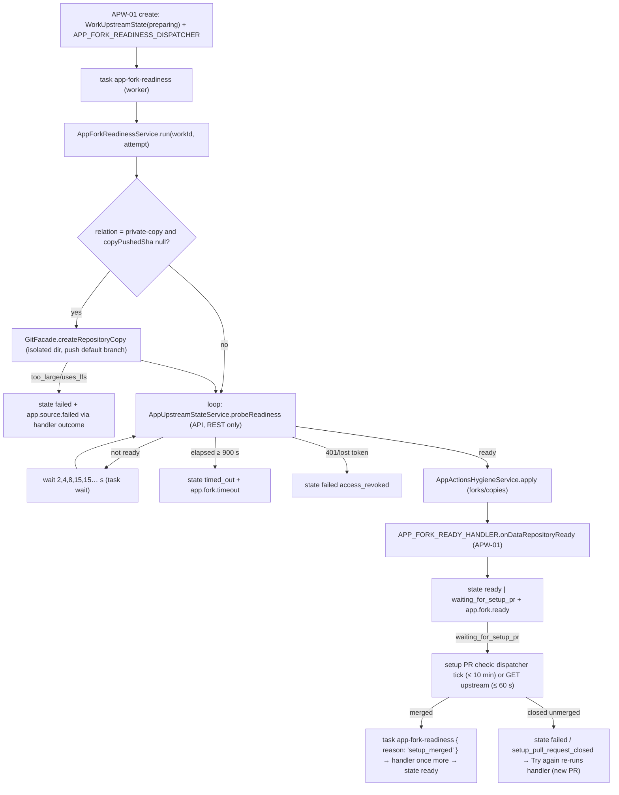
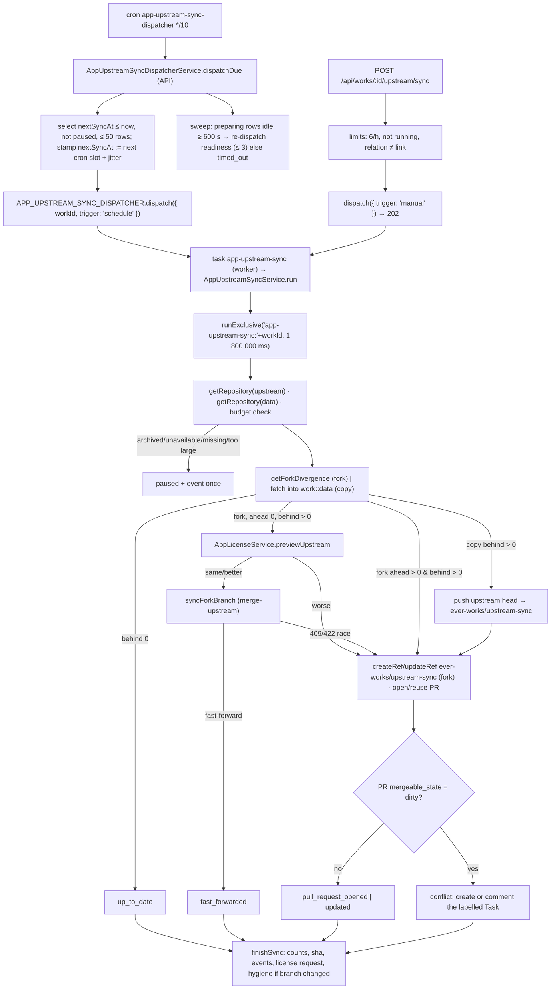

# Implementation Plan: Fork lifecycle — readiness, Actions hygiene, upstream sync, divergence, checkout keys

> Translates [`spec.md`](./spec.md) into architecture and tech choices. The plan owns implementation
> detail; the spec owns behaviour. **Every path below was opened in the worktree before it was written
> down** — no path in this document is invented. Paths marked **(new)** do not exist yet.

**Epic ID**: `APW-02-fork-lifecycle`
**Spec**: [`./spec.md`](./spec.md) · **Tasks**: [`./tasks.md`](./tasks.md)
**Status**: `Draft`
**Last updated**: 2026-09-17
**Contracts**: [`../CONTRACTS.md`](../CONTRACTS.md) — this epic owns the `IGitProviderPlugin` additions (§3),
`WorkUpstreamState` / `work_upstream_states`, `GET /api/works/:id/upstream`, `POST …/upstream/sync`,
`POST …/upstream/readiness/retry`, jobs `app-fork-readiness`, `app-upstream-sync` and the cron
`app-upstream-sync-dispatcher`, the dispatcher symbols `APP_FORK_READINESS_DISPATCHER` /
`APP_UPSTREAM_SYNC_DISPATCHER`, the handler token `APP_FORK_READY_HANDLER`, and the Activity events
`app.fork.*`, `app.actions.disabled`, `app.upstream.*`, the web route `/works/:id/upstream` (the Upstream tab, shared
with APW-09) and the non-production env override `EVER_WORKS_APP_FORK_READINESS_TIMEOUT_MS`. It consumes APW-01's
`Work.kind = 'app'` and `sourceRepository.upstream`, APW-03's `AppLicenseService.previewUpstream` / `request`, APW-05's
`APP_BUILD_WORKFLOW_PATH` (`packages/contracts/src/apps/builds.ts`) and APW-08's change-Agent resolution (`APP_WORK_AGENT_RESOLVER`).

**Program audit resolutions applied** ([CONTRACTS §0](../CONTRACTS.md#0-program-audit-resolutions-binding-2026-09-17-against-develop-ee45946e5)):
R-1 (shared types in `packages/contracts/src/apps/app-upstream.ts`), R-2 (`actionType` `app_fork` / `app_actions` /
`app_upstream`, dotted `action`), R-4 (the readiness job follows a setup pull request to merge — §6.2), R-8 (one
Upstream tab — §5.1), R-14 (the existing checkout-directory weakness is described generically; exact reproductions
live in the private operations repository), R-21 (conflict Task Agent from APW-08 — §6.5), R-22 (no suites under
`apps/api/test/`).

---

## 1. Current state in the codebase

### 1.1 What ships today

| Layer      | File                                                                                                                                                                                                                                                                                                                                                                                               | What it does                                                                                                                                                                                                                                                                                                                                                                                                                                                                                                                                                                                                                                              |
| ---------- | -------------------------------------------------------------------------------------------------------------------------------------------------------------------------------------------------------------------------------------------------------------------------------------------------------------------------------------------------------------------------------------------------- | --------------------------------------------------------------------------------------------------------------------------------------------------------------------------------------------------------------------------------------------------------------------------------------------------------------------------------------------------------------------------------------------------------------------------------------------------------------------------------------------------------------------------------------------------------------------------------------------------------------------------------------------------------- |
| Contract   | [`packages/plugin/src/contracts/capabilities/git-provider.interface.ts`](../../../../../packages/plugin/src/contracts/capabilities/git-provider.interface.ts)                                                                                                                                                                                                                                      | `GitRepository` (13: owner, name, fullName, defaultBranch, isPrivate, url, cloneUrl, `isFork?`, `parent?`); `GitCloneOptions` (52); `ForkRepositoryOptions { name?, organization?, defaultBranchOnly? }` (110); `IGitOperations.getLocalDir(owner, repo)` / `removeLocalDir(owner, repo)` (494–495); optional `forkRepository?` (554), `hasForkRelationship?` (566), `getCompareDiff?` (637).                                                                                                                                                                                                                                                             |
| Contract   | [`packages/plugin/src/contracts/capabilities/git-provider.pr-insights.ts`](../../../../../packages/plugin/src/contracts/capabilities/git-provider.pr-insights.ts)                                                                                                                                                                                                                                  | The precedent for a companion file of provider-neutral types and pure rules, re-exported from [`capabilities/index.ts`](../../../../../packages/plugin/src/contracts/capabilities/index.ts).                                                                                                                                                                                                                                                                                                                                                                                                                                                              |
| Contract   | [`packages/plugin/src/facades/git-facade.interface.ts`](../../../../../packages/plugin/src/facades/git-facade.interface.ts)                                                                                                                                                                                                                                                                        | `IGitFacade.getLocalDir(providerId, owner, repo)` (166).                                                                                                                                                                                                                                                                                                                                                                                                                                                                                                                                                                                                  |
| Git ops    | [`packages/plugin/src/git/git-operations.ts`](../../../../../packages/plugin/src/git/git-operations.ts)                                                                                                                                                                                                                                                                                            | `getLocalDir` (306) derives the directory from a normalized `owner-repo` slug (`slugifyText`, 54) — checkout directory keys are not guaranteed unique across owners/repositories (R-14). `cloneOrPull` (82) falls back to `git.init` + `addRemote` on `NotFoundError` / "Could not find" / "empty" (113–125). `switchToMainBranch` / `getMainBranch` know only `main`/`master` (52, 248, 464). `cloneBranch` (314) uses a unique directory. `fetch` (404), `merge` (415). Pure JS on the event loop.                                                                                                                                                      |
| Plugin     | [`packages/plugins/github/src/github-api.service.ts`](../../../../../packages/plugins/github/src/github-api.service.ts)                                                                                                                                                                                                                                                                            | `createOctokit` (183, `octokit` v4, no throttling plugin); `getRepository` (259, `null` on 404, maps no `source`/`allow_forking`/`archived`/`visibility`/`license`/`stargazers_count`/`size`); `forkRepository` (466): the existing-repository check runs only when `name` is given and does not confirm fork identity; `POST /forks`; polls `repos.get` 24 × 5 s; `null` on timeout. `createRepository` (365) returns an existing same-named repository. `getCompareDiff` (1102) uses `compareCommitsWithBasehead`. `hasRepositoryAccess` (1180) maps 403 **and** 404 to `false`. `hasForkRelationship` (1193) compares `parent` only, case-sensitively. |
| Plugin     | [`packages/plugins/github/src/github-actions.service.ts`](../../../../../packages/plugins/github/src/github-actions.service.ts)                                                                                                                                                                                                                                                                    | `listWorkflows` (113, first page only), `enableWorkflow` / `disableWorkflow` (125/136), `enableDeploymentWorkflows` (151: repo-level `setGithubActionsPermissionsRepository({ enabled: true, allowed_actions: 'all' })` then enables an allowlist and disables everything else).                                                                                                                                                                                                                                                                                                                                                                          |
| Plugin     | [`packages/plugins/github/src/github.plugin.ts`](../../../../../packages/plugins/github/src/github.plugin.ts)                                                                                                                                                                                                                                                                                      | Delegates `forkRepository` (229), `getLocalDir` / `removeLocalDir` (~468/473) to `GitOperations`; `actionsService` (141) methods are GitHub-specific extras, not on the capability interface.                                                                                                                                                                                                                                                                                                                                                                                                                                                             |
| Scopes     | [`packages/plugin/src/common/github.scopes.ts`](../../../../../packages/plugin/src/common/github.scopes.ts)                                                                                                                                                                                                                                                                                        | `GITHUB_FULL_SCOPES`: `repo`, `delete_repo`, `workflow`, `write:repo_hook`, `read:org`, … — enough for fork, merge-upstream, workflow disable (admin role), PR, webhooks.                                                                                                                                                                                                                                                                                                                                                                                                                                                                                 |
| Facade     | [`packages/agent/src/facades/git.facade.ts`](../../../../../packages/agent/src/facades/git.facade.ts)                                                                                                                                                                                                                                                                                              | `getRequiredOAuthScopes` (334, `repo` only); `forkRepository` (600); optional-capability pattern with `GitOperationNotSupportedError` (149, 1316–1320); `cloneOrPull` coalescing key `[plugin, owner, repo, branch, switch]` (1386); `getLocalDir` (1575); `removeLocalDir` (1607); `resolvePluginAndToken` (1622: explicit → managed PAT → App installation → OAuth → PAT).                                                                                                                                                                                                                                                                              |
| Callers    | [`packages/agent/src/template-catalog/template-catalog.service.ts`](../../../../../packages/agent/src/template-catalog/template-catalog.service.ts)                                                                                                                                                                                                                                                | `forkTemplateForUser` (427) is the only production `forkRepository` caller; it relies on the blocking wait and passes no `name`.                                                                                                                                                                                                                                                                                                                                                                                                                                                                                                                          |
| Callers    | [`packages/agent/src/generators/website-generator/website-update.service.ts`](../../../../../packages/agent/src/generators/website-generator/website-update.service.ts)                                                                                                                                                                                                                            | `updateFork` (213) clones, checks `hasForkRelationship`, returns `true` without syncing — a dead path that is intentionally left untouched (additive rule).                                                                                                                                                                                                                                                                                                                                                                                                                                                                                               |
| Fleet      | [`apps/api/src/fleet/fleet-push-credential.service.ts`](../../../../../apps/api/src/fleet/fleet-push-credential.service.ts)                                                                                                                                                                                                                                                                        | Installation tokens narrowed to `contents: write` (199) — cannot administer Actions or open PRs; never used here.                                                                                                                                                                                                                                                                                                                                                                                                                                                                                                                                         |
| Jobs       | [`packages/agent/src/tasks/template-customization-dispatcher.ts`](../../../../../packages/agent/src/tasks/template-customization-dispatcher.ts) · [`_tasks-symbols.ts`](../../../../../packages/agent/src/tasks/_tasks-symbols.ts) · [`job-runtime.providers.ts`](../../../../../packages/agent/src/tasks/job-runtime.providers.ts)                                                                | Dispatcher = interface + `Symbol()`; the name list in `TASKS_BARREL_RUNTIME_SYMBOLS`; `DISPATCHER_SYMBOLS` pinned at **14** by `__tests__/job-runtime.providers.spec.ts` (134, 143) — two new dispatchers make it 16.                                                                                                                                                                                                                                                                                                                                                                                                                                     |
| Jobs       | [`packages/tasks/src/trigger/trigger.module.ts`](../../../../../packages/tasks/src/trigger/trigger.module.ts) · [`trigger.service.ts`](../../../../../packages/tasks/src/trigger/trigger.service.ts)                                                                                                                                                                                               | `@Global` module binding every dispatcher symbol through the registry; `dispatchTemplateCustomization` (506) = `ensureConfigured()` → `task.trigger(payload, stampTenantOptions({ tags, machine }))` → run id or `null`.                                                                                                                                                                                                                                                                                                                                                                                                                                  |
| Jobs       | [`packages/tasks/src/tasks/trigger/template-customization.task.ts`](../../../../../packages/tasks/src/tasks/trigger/template-customization.task.ts)                                                                                                                                                                                                                                                | One-shot `task({ id, maxDuration })` running agent services in `withWorkerContext` ([`worker-context.utils.ts`](../../../../../packages/tasks/src/trigger/worker/utils/worker-context.utils.ts)) against [`TriggerWorkerModule`](../../../../../packages/tasks/src/trigger/worker/modules/trigger-worker.module.ts) (facades local, repositories via remote proxies).                                                                                                                                                                                                                                                                                     |
| Jobs       | [`packages/tasks/src/tasks/trigger/data-repo-sync-dispatcher.task.ts`](../../../../../packages/tasks/src/tasks/trigger/data-repo-sync-dispatcher.task.ts) · [`apps/api/src/data-sync/data-sync-dispatcher.service.ts`](../../../../../apps/api/src/data-sync/data-sync-dispatcher.service.ts)                                                                                                      | `schedules.task` → remote proxy `DATA_SYNC_DISPATCHER_SERVICE` ([`trigger-internal.module.ts`](../../../../../packages/tasks/src/trigger/worker/modules/trigger-internal.module.ts)) → API-side `dispatchDue()` with a batch cap and stamp-before-run so a failing Work cannot hot-loop. **The cron shape to copy.**                                                                                                                                                                                                                                                                                                                                      |
| Jobs       | [`apps/api/src/trigger/trigger-internal.controller.ts`](../../../../../apps/api/src/trigger/trigger-internal.controller.ts) · [`trigger-internal.module.ts`](../../../../../apps/api/src/trigger/trigger-internal.module.ts)                                                                                                                                                                       | `remoteMap` (~438) names every service the worker may call; the module imports the owning modules (e.g. `DataSyncModule`).                                                                                                                                                                                                                                                                                                                                                                                                                                                                                                                                |
| Locks      | [`packages/agent/src/cache/distributed-task-lock.service.ts`](../../../../../packages/agent/src/cache/distributed-task-lock.service.ts)                                                                                                                                                                                                                                                            | `runExclusive(key, fn, { ttlMs })`.                                                                                                                                                                                                                                                                                                                                                                                                                                                                                                                                                                                                                       |
| Cron       | [`packages/agent/src/missions/cron-matcher.ts`](../../../../../packages/agent/src/missions/cron-matcher.ts) · [`agents/heartbeat-cron.ts`](../../../../../packages/agent/src/agents/heartbeat-cron.ts)                                                                                                                                                                                             | `parseCron` / `matchesCron` and the minute-walk `computeNextHeartbeat` — no cron dependency.                                                                                                                                                                                                                                                                                                                                                                                                                                                                                                                                                              |
| Tasks      | [`packages/agent/src/tasks-domain/tasks.service.ts`](../../../../../packages/agent/src/tasks-domain/tasks.service.ts)                                                                                                                                                                                                                                                                              | `create(userId, input, scope)` (666); `CreateTaskInput` has `title`, `description`, `labels`, `workId`, `agentId`, `hiddenFromBoard`.                                                                                                                                                                                                                                                                                                                                                                                                                                                                                                                     |
| Activity   | [`packages/agent/src/activity-log/activity-log.service.ts`](../../../../../packages/agent/src/activity-log/activity-log.service.ts)                                                                                                                                                                                                                                                                | `log(entry)` (104).                                                                                                                                                                                                                                                                                                                                                                                                                                                                                                                                                                                                                                       |
| Entities   | [`packages/agent/src/entities/work-deployment.entity.ts`](../../../../../packages/agent/src/entities/work-deployment.entity.ts) · [`_types.ts`](../../../../../packages/agent/src/entities/_types.ts) · [`database/_entity-names.ts`](../../../../../packages/agent/src/database/_entity-names.ts) · [`_entities-inventory.ts`](../../../../../packages/agent/src/database/_entities-inventory.ts) | Work-child entity with `TimestampColumn` (bigint, portable comparisons) and scope columns; the four-step registration.                                                                                                                                                                                                                                                                                                                                                                                                                                                                                                                                    |
| Web        | [`apps/web/src/app/[locale]/(dashboard)/works/[id]/layout.tsx`](<../../../../../apps/web/src/app/[locale]/(dashboard)/works/[id]/layout.tsx>)                                                                                                                                                                                                                                                      | "Agents on this Work" = pinned (`scope: 'work'`) + assigned (`assignedWorkId`). No longer the conflict Task's assignment source: Resolution R-21 delegates that to APW-08's change-Agent rule (§6.5).                                                                                                                                                                                                                                                                                                                                                                                                                                                     |
| Docs       | [`docs/features/job-runtimes.md`](../../../../../docs/features/job-runtimes.md)                                                                                                                                                                                                                                                                                                                    | All dispatchers resolve to Trigger.dev today; `null` dispatch when unconfigured.                                                                                                                                                                                                                                                                                                                                                                                                                                                                                                                                                                          |
| Migrations | [`apps/api/src/migrations/`](../../../../../apps/api/src/migrations) · [`__tests__/migrations-directory-contract.spec.ts`](../../../../../apps/api/src/migrations/__tests__/migrations-directory-contract.spec.ts)                                                                                                                                                                                 | Newest `1791240000000-AddSafetyRailsCore.ts` on `ee45946e5` (`1791200100000-CreateOnboardingChecklists.ts` when authored); the contract spec refuses new duplicate timestamps.                                                                                                                                                                                                                                                                                                                                                                                                                                                                            |

### 1.2 The exact blockers

- **Checkout directory keys are not guaranteed unique across owners/repositories.** The fix makes keys
  case-preserving, separator-safe and provider-scoped (§2.1).
- **A missing repository becomes a local one.** The `git.init` fallback is correct for "create a repo we are
  about to populate" and wrong for "read a fork that is still being created".
- **The fork call is blocking and naive about identity.** A same-named non-fork is returned as the fork; a
  renamed fork is invisible; the request thread sleeps for up to 120 s.
- **The capability interface lacks the facts and verbs.** No network root, allow-forking, archived, visibility,
  license, size; no merge-upstream, divergence, copy, webhook or Actions verbs.
- **403 is ambiguous everywhere.** Rate limits, SAML, third-party restrictions and missing App permissions are
  indistinguishable to callers.
- **There is nowhere to keep lifecycle state**, and no job or cron for it.

### 1.3 What already exists and must be reused, not rebuilt

- `cloneBranch`'s isolated-directory pattern (private copy push); the facade's optional-capability guard.
- `compareCommitsWithBasehead` (divergence is a `basehead` compare with a cross-owner base).
- `GitHubActionsService.listWorkflows` / `disableWorkflow` (hygiene), extended with pagination.
- The dispatcher / trigger / remote-proxy / `schedules.task` pattern end to end.
- `runExclusive` for one-sync-per-Work; `parseCron` / `matchesCron` for schedules.
- `TasksService.create` with `labels` for the single-open-conflict-Task guard.
- APW-03's `AppLicenseService.previewUpstream(workId, owner, repo, sha)` → `{ class, spdx, worse }` and
  `request(workId, 'upstream_synced')` ([APW-03 plan §2.6–2.7](../APW-03-app-spec-and-catalog/plan.md)).
- APW-08's change-Agent resolution (APW-08 FR-42 — the Agent of the most recent Task on the Work that reached _In
  review_ or _Done_, then the only pinned, then the only assigned Agent), exposed as the token
  `APP_WORK_AGENT_RESOLVER` (`AppWorkAgentResolver` in `packages/agent/src/app-works/app-work-agent-resolver.ts`,
  APW-08 plan §2.8, T25): `resolve({ userId, workId }) → Promise<{ agentId, source } | null>` — for the conflict Task
  (Resolution R-21). This epic keeps no Agent lookup of its own.
- The existing facade reads `getPullRequestStatus` / `getPullRequest` for the setup pull request follow-through (R-4).
- APW-05's `APP_BUILD_WORKFLOW_PATH = '.github/workflows/ever-works-build.yml'` as the hygiene allowlist, and its
  expectation that `setActionsPermissions?` can enable Actions with only that workflow allowed
  ([APW-05 plan §4.6](../APW-05-builds/plan.md)).

---

## 2. Architecture

### 2.1 P0 — working copies and fork requests

```
 caller ─► GitFacadeService.cloneOrPull({ owner, repo, checkoutKey?, expectExisting? })
              coalesce key = [plugin, owner, repo, branch, switch, checkoutKey ?? '', expectExisting === true]
              └─► plugin.cloneOrPull ─► GitOperations
                     dir = checkoutKey
                           ? <base>/v2/k/<sha256(checkoutKey)[0,16]>-<slug(checkoutKey)>
                           : <base>/v2/r/<sha256(getCloneUrl(owner, repo))[0,16]>-<slug(owner)>--<slug(repo)>
                     clone NotFound/empty ─► expectExisting ? remove dir + throw RepositoryNotReadyError
                                                             : git.init + addRemote   (unchanged)

 caller ─► GitFacadeService.forkRepository(owner, repo, { organization?, name?, waitForReady? })
              └─► GitHubApiService.forkRepository
                     target = organization ?? getUser().login
                     existing = findExistingFork(target, name ?? repo, owner, repo)   ← the full §4.3 lookup
                     found ─► return (forkReadiness computed)
                     POST /repos/{owner}/{repo}/forks
                     waitForReady === false ─► return response mapped, forkReadiness: 'pending'
                     else poll 24 × 5 s (unchanged)
```

**Every fork request uses the full lookup, not the name check alone (FR-10, S2, ACC-02-03).** A fork the member
renamed answers to its **current** name, so `GET /repos/{target}/{name ?? repo}` 404s for it and the request would
fall through to `POST /forks`. `forkRepository` therefore calls the same `findExistingFork` the rest of the epic
uses — name check first (one call, the common case), then the GraphQL fork-network search filtered by owner, then
the REST `/forks` pages — before it ever POSTs, and only the three-step result decides. P0 may land the name check
alone (T5) **only** because P1 adds the widened lookup in the same file (T17) and wires it into `forkRepository`
(T52); a build that stops at T5 has not delivered FR-10 and ACC-02-03 must not be signed off on it. `waitForReady`,
the target owner, the identity rule (FR-11) and every existing caller (`forkTemplateForUser` included) are
unchanged: the widened lookup returns the same repository the name check returns whenever both find one, so no
caller sees a different fork than before.

The hash makes identity exact — case-preserving, separator-safe and provider-scoped, because the clone URL embeds
host, owner and name byte-for-byte; the slug suffix keeps directories readable in logs. `v2/` separates new copies from every legacy directory, which is never read
again (FR-6) — pod temp storage is ephemeral, so no migration is needed.

### 2.2 P1 — readiness



### 2.3 P1 — scheduled and manual sync



### 2.4 Where each piece runs

| Piece                              | Process                       | Why                                                                                   |
| ---------------------------------- | ----------------------------- | ------------------------------------------------------------------------------------- |
| `AppUpstreamStateService`          | API (remote-proxied)          | DB writes, Activity, Tasks, locks live in API DI; REST-only provider reads are cheap. |
| `AppUpstreamSyncDispatcherService` | API (remote-proxied)          | Same as `DataSyncDispatcherService`.                                                  |
| `AppForkReadinessService`          | Worker (`app-fork-readiness`) | Long polling (≤ 15 min) and private-copy pushes are off the API event loop.           |
| `AppUpstreamSyncService`           | Worker (`app-upstream-sync`)  | Private-copy fetch/push is pure-JS git; fork syncs are REST but share the flow.       |
| `AppActionsHygieneService`         | Worker                        | Called from both jobs.                                                                |
| `AppUpstreamController`            | API                           | Reads state; dispatches.                                                              |

---

## 3. Data model

**Workspace backup (Resolution R-25).** `WorkUpstreamState` exports as `data/works/upstream-states.jsonl`, reached through the parent Work ids; no column is redacted ([tasks](./tasks.md) T45).

### 3.1 `work_upstream_states` — entity `WorkUpstreamState` (new)

`packages/agent/src/entities/work-upstream-state.entity.ts` **(new)**. All timestamps are `TimestampColumn`
(bigint epoch ms) so `nextSyncAt <= :now` stays portable across SQLite and Postgres, as in `WorkDeployment`.

| Column                                               | Type                                    | Default       | Notes                                                                                                                                       |
| ---------------------------------------------------- | --------------------------------------- | ------------- | ------------------------------------------------------------------------------------------------------------------------------------------- |
| `id`                                                 | uuid PK                                 |               |                                                                                                                                             |
| `workId`                                             | uuid, unique                            |               | `@ManyToOne(() => Work, { onDelete: 'CASCADE' })`                                                                                           |
| `relation`                                           | varchar(16)                             |               | `link` · `fork` · `private-copy`                                                                                                            |
| `dataOwner` / `dataRepo`                             | varchar(100)                            |               | Data repository coordinates (canonical)                                                                                                     |
| `dataDefaultBranch`                                  | varchar(255)                            |               | Tracked branch                                                                                                                              |
| `upstreamOwner` / `upstreamRepo`                     | varchar(100), null                      |               | Null for `link`                                                                                                                             |
| `upstreamDefaultBranch`                              | varchar(255), null                      |               | Updated on rename (FR-43); previous kept in `upstreamPreviousDefaultBranch`                                                                 |
| `upstreamPreviousDefaultBranch`                      | varchar(255), null                      |               |                                                                                                                                             |
| `readinessState`                                     | varchar(24)                             | `'preparing'` | `preparing` · `ready` · `timed_out` · `failed` · `waiting_for_setup_pr`                                                                     |
| `readinessReason`                                    | varchar(48), null                       |               | `access_revoked`, `dispatch_unavailable`, `too_large_for_private_copy`, `uses_lfs`, `setup_pull_request_closed`, `handler_failed:<code>`, … |
| `readinessStartedAt`                                 | bigint ts                               |               | Reset by Try again                                                                                                                          |
| `readinessHeartbeatAt`                               | bigint ts, null                         |               | Stamped by each probe; the sweeper's liveness signal                                                                                        |
| `readinessDispatches`                                | int                                     | `0`           | ≤ 3 automatic (FR-23)                                                                                                                       |
| `readinessManualRetries` / `readinessManualWindowAt` | int / bigint ts                         | `0` / null    | ≤ 3 per rolling hour (FR-19)                                                                                                                |
| `readyAt`                                            | bigint ts, null                         |               |                                                                                                                                             |
| `setupPullRequestUrl`                                | varchar(500), null                      |               | From APW-01's handler outcome                                                                                                               |
| `setupPullRequestNumber`                             | int, null                               |               | From APW-01's handler outcome; read by the setup PR check (FR-24a)                                                                          |
| `setupCheckedAt`                                     | bigint ts, null                         |               | Last setup PR check; throttles the on-view check to once per 60 s                                                                           |
| `copyPushedSha`                                      | varchar(40), null                       |               | Private copy idempotency (FR-21)                                                                                                            |
| `aheadBy` / `behindBy`                               | int, null                               |               |                                                                                                                                             |
| `divergenceComputedAt`                               | bigint ts, null                         |               |                                                                                                                                             |
| `behindEventCount`                                   | int, null                               |               | `behindBy` at the last `app.upstream.behind` (FR-48)                                                                                        |
| `upstreamHeadSha`                                    | varchar(40), null                       |               |                                                                                                                                             |
| `syncSchedule`                                       | varchar(64), null                       |               | Effective cron (spec value or default)                                                                                                      |
| `nextSyncAt`                                         | bigint ts, null                         |               | Null while paused or for `link`                                                                                                             |
| `syncStartedAt` / `syncFinishedAt`                   | bigint ts, null                         |               | `syncStartedAt > syncFinishedAt` ⇒ running (display only; the lock is authoritative)                                                        |
| `lastSyncResult`                                     | varchar(24), null                       |               | `up_to_date` · `fast_forwarded` · `pull_request_opened` · `pull_request_updated` · `conflict` · `skipped` · `paused` · `failed`             |
| `lastSyncReason`                                     | varchar(48), null                       |               | Reason code                                                                                                                                 |
| `lastSyncedUpstreamSha`                              | varchar(40), null                       |               |                                                                                                                                             |
| `lastSyncCommitCount`                                | int, null                               |               |                                                                                                                                             |
| `syncPullRequestNumber` / `syncPullRequestUrl`       | int / varchar(500), null                |               |                                                                                                                                             |
| `syncPullRequestClosedHeadSha`                       | varchar(40), null                       |               | Head of a PR the member closed; no reopen until upstream moves (S26)                                                                        |
| `conflictTaskId`                                     | uuid, null                              |               | No FK (a deleted Task must not cascade)                                                                                                     |
| `manualSyncCount` / `manualSyncWindowAt`             | int / bigint ts, null                   | `0`           | ≤ 6 per rolling hour (FR-33)                                                                                                                |
| `consecutiveRateLimited`                             | int                                     | `0`           | ≥ 3 ⇒ persistent notice (FR-52)                                                                                                             |
| `rateLimitedUntil`                                   | bigint ts, null                         |               |                                                                                                                                             |
| `upstreamStatus`                                     | varchar(16)                             | `'unknown'`   | `available` · `archived` · `unavailable` · `none` · `unknown`                                                                               |
| `upstreamCheckedAt`                                  | bigint ts, null                         |               | Daily re-check while `unavailable` (FR-41)                                                                                                  |
| `dataRepositoryStatus`                               | varchar(16)                             | `'available'` | `available` · `missing`                                                                                                                     |
| `actionsState`                                       | varchar(24)                             | `'pending'`   | `pending` · `clean` · `needs_admin` · `permission_missing` · `failed` · `not_applicable`                                                    |
| `actionsSeenWorkflowIds`                             | simple-json, null                       |               | `number[]` (≤ 500) — ids hygiene has already judged (FR-27)                                                                                 |
| `actionsDisabledWorkflows` / `actionsKeptWorkflows`  | simple-json, null                       |               | `{ id, path }[]` (≤ 100 each)                                                                                                               |
| `actionsCheckedAt`                                   | bigint ts, null                         |               |                                                                                                                                             |
| `tenantId` / `organizationId`                        | uuid, null                              |               | Scope stamping                                                                                                                              |
| `createdAt` / `updatedAt`                            | `CreateDateColumn` / `UpdateDateColumn` |               |                                                                                                                                             |

Indexes: `uq_work_upstream_states_work (workId)` unique; `idx_work_upstream_states_next_sync (nextSyncAt)`;
`idx_work_upstream_states_readiness (readinessState, readinessHeartbeatAt)`.

Registration (all four, or `database.module.spec.ts` fails): `export *` in
`packages/agent/src/entities/index.ts`; `'WorkUpstreamState'` in `AGENT_ENTITY_NAMES`; import + `ENTITIES` entry in
`_entities-inventory.ts`; `TypeOrmModule.forFeature` in the new `AppWorksModule`.

Repository **(new)** `packages/agent/src/database/repositories/work-upstream-state.repository.ts`:
`findByWorkId`, `create`, `update(workId, patch)`, `claimDue(nowMs, limit)` (select + stamp in one transaction
with `UPDATE … WHERE id IN (…) AND nextSyncAt <= :now`), `findStalePreparing(nowMs, idleMs, limit)`,
`claimSetupPullRequestChecks(nowMs, minIntervalMs, limit)` (rows `waiting_for_setup_pr` whose `setupCheckedAt` is
older than `minIntervalMs`, stamped in the same transaction),
`incrementManualSync(workId, nowMs, windowMs, max)` (atomic conditional update; returns whether it was allowed).

### 3.2 Migration (Constitution V)

`apps/api/src/migrations/1792020000000-CreateWorkUpstreamStates.ts` — APW-02 slot 00, above
`1791240000000-AddSafetyRailsCore.ts` (newest on `ee45946e5`); re-stamp before merge if `develop` moved. `up()` creates the table
with the Table API (the style of `1784200000000-CreateFleetJobs.ts`), the FK to `works(id) ON DELETE CASCADE`, and
the three indexes. `down()` drops the indexes and the table only. No backfill: no App Work exists before APW-01.

### 3.3 Plugin contract additions (P0 + P1)

`packages/plugin/src/contracts/capabilities/git-provider.interface.ts` — additive only:

```ts
export interface GitRepository {
	/* …existing… */
	readonly source?: { readonly owner: string; readonly name: string; readonly fullName: string }; // network root (P1)
	readonly allowForking?: boolean; // P1
	readonly archived?: boolean; // P1
	readonly visibility?: 'public' | 'private' | 'internal'; // P1
	readonly stars?: number; // P1
	readonly sizeKb?: number; // P1 (provider-reported)
	readonly licenseSpdx?: string | null; // P1 (provider-detected id; APW-03 classifies)
	readonly empty?: boolean; // P1 (default branch has no commit)
	readonly movedFrom?: string; // P1 (requested fullName when the provider redirected)
	readonly forkReadiness?: 'ready' | 'pending'; // P0 (only set by forkRepository)
}
export interface GitCloneOptions {
	/* …existing… */ readonly checkoutKey?: string;
	readonly expectExisting?: boolean;
} // P0
export interface ForkRepositoryOptions {
	/* …existing… */ readonly waitForReady?: boolean;
} // P0
// IGitOperations (P0): getLocalDir(owner, repo, checkoutKey?) · removeLocalDir(owner, repo, checkoutKey?)
```

`packages/plugin/src/contracts/capabilities/git-provider.app-forks.ts` **(new, P1)** — types re-exported from
`capabilities/index.ts`, plus optional methods on `IGitProviderPlugin`:

```ts
export type GitProviderErrorReason =
  | 'not_found' | 'unauthorized' | 'rate_limited' | 'secondary_rate_limited' | 'sso_authorization_required'
  | 'oauth_app_restricted' | 'permission_missing' | 'conflict' | 'unprocessable';
export class GitProviderRequestError extends Error {
  constructor(readonly reason: GitProviderErrorReason, readonly status: number,
              readonly details: { retryAt?: string; permission?: 'contents' | 'pull_requests' | 'administration' | 'actions' | 'webhooks' | 'metadata'; } = {}) { super(reason); }
}
export interface GitForkSyncResult { readonly outcome: 'fast_forwarded' | 'merged' | 'up_to_date' | 'conflict' | 'unprocessable'; readonly baseBranch?: string; }
export interface GitForkDivergence { readonly aheadBy: number; readonly behindBy: number; readonly upstreamHeadSha: string; readonly forkHeadSha: string; }
export interface GitRepositoryCopyInput { readonly sourceOwner: string; readonly sourceRepo: string; readonly sourceBranch: string;
  readonly targetOwner: string; readonly targetRepo: string; readonly maxSizeKb: number; readonly branchName?: string; }
export interface GitRepositoryCopyResult { readonly pushedSha: string; readonly alreadyUpToDate: boolean; }
export interface GitWorkflowRef { readonly id: number; readonly path: string; }
export interface GitActionsPermissionsInput {
  readonly enabled?: boolean;                          // repo-level switch; omitted = unchanged (APW-05 passes true)
  readonly disableWorkflowsExcept?: readonly string[]; // hygiene: disable every active workflow not listed
  readonly enableWorkflows?: readonly string[];        // APW-05: enable exactly these paths
  readonly skipWorkflowIds?: readonly number[];        // ids never touched (already judged, FR-27)
  readonly maxWorkflows?: number;                      // default 100
}
export interface GitActionsPermissionsResult {
  readonly actionsEnabled: boolean; readonly disabled: readonly GitWorkflowRef[]; readonly kept: readonly GitWorkflowRef[];
  readonly enabled: readonly GitWorkflowRef[]; readonly seenIds: readonly number[]; readonly truncated: boolean;
}
export interface GitWebhookInput { readonly url: string; readonly secret: string; readonly events: readonly string[]; }

// on IGitProviderPlugin — all optional
findExistingFork?(upstreamOwner: string, upstreamRepo: string, targetOwner: string, token: string): Promise<GitRepository | null>;
syncForkBranch?(forkOwner: string, forkRepo: string, branch: string, token: string): Promise<GitForkSyncResult>;
getForkDivergence?(forkOwner: string, forkRepo: string, forkBranch: string, upstreamOwner: string, upstreamBranch: string, token: string): Promise<GitForkDivergence>;
createRepositoryCopy?(input: GitRepositoryCopyInput, token: string): Promise<GitRepositoryCopyResult>;
setActionsPermissions?(owner: string, repo: string, input: GitActionsPermissionsInput, token: string): Promise<GitActionsPermissionsResult>;
createWebhook?(owner: string, repo: string, input: GitWebhookInput, token: string): Promise<{ id: number; created: boolean }>;
deleteWebhook?(owner: string, repo: string, hookId: number, token: string): Promise<void>;
```

**Branch moves reuse APW-09's capabilities.** Pointing `ever-works/upstream-sync` at a sha needs
`createBranchFromSha?(owner, repo, name, sha, token)` and `updateBranchRef?(owner, repo, name, sha, { force: false }, token)`
— the names and signatures APW-09 fixes in CONTRACTS §3 (the existing `createBranch?` takes a branch name, not a sha, and
deleting the branch to recreate it would close the open sync pull request). APW-02 P1 lands in an earlier wave, so it
implements both in the GitHub plugin with exactly those signatures (fast-forward only); APW-09 keeps their semantics and
conformance tests. No force-move exists anywhere in this epic.

`packages/plugin/src/git/git-operations.ts` (P0) also exports `RepositoryNotReadyError` (`code =
'repository_not_ready'`) and the pure `checkoutDirectoryName(cloneUrl, owner, repo, checkoutKey?)`.

### 3.4 Shared contracts (P1)

`packages/contracts/src/apps/app-upstream.ts` **(new)** — in the one App Works shared-types folder (Resolution R-1),
exported through the barrel `packages/contracts/src/apps/index.ts` (APW-03 T1 creates it and its root export in
`packages/contracts/src/index.ts`; this epic creates both if it lands first):

```ts
export const APP_READINESS_STATES = ['preparing', 'ready', 'timed_out', 'failed', 'waiting_for_setup_pr'] as const;
export const APP_SYNC_RESULTS = [
	'up_to_date',
	'fast_forwarded',
	'pull_request_opened',
	'pull_request_updated',
	'conflict',
	'skipped',
	'paused',
	'failed'
] as const;
export const APP_UPSTREAM_STATUSES = ['available', 'archived', 'unavailable', 'none', 'unknown'] as const;
export const APP_ACTIONS_STATES = [
	'pending',
	'clean',
	'needs_admin',
	'permission_missing',
	'failed',
	'not_applicable'
] as const;
export interface AppUpstreamStateResponse {
	workId: string;
	relation: 'link' | 'fork' | 'private-copy';
	dataRepository: {
		owner: string;
		repo: string;
		url: string;
		defaultBranch: string;
		status: 'available' | 'missing';
	};
	upstream: {
		owner: string;
		repo: string;
		url: string;
		defaultBranch: string;
		previousDefaultBranch?: string;
		status: AppUpstreamStatus;
	} | null;
	readiness: {
		state: AppReadinessState;
		reason?: string;
		startedAt: string;
		readyAt?: string;
		setupPullRequestUrl?: string;
		setupPullRequestNumber?: number;
		manualRetriesLeft: number;
	};
	divergence: { aheadBy: number; behindBy: number; computedAt: string; stale: boolean } | null;
	sync: {
		schedule: string | null;
		nextRunAt?: string;
		running: boolean;
		lastResult?: AppSyncResult;
		lastReason?: string;
		lastStartedAt?: string;
		lastFinishedAt?: string;
		lastCommitCount?: number;
		pullRequest?: { number: number; url: string };
		conflictTaskId?: string;
		manualSyncsLeft: number;
		rateLimitedUntil?: string;
		rateLimitPersistent: boolean;
	} | null;
	actions: {
		state: AppActionsState;
		disabled: { path: string }[];
		kept: { path: string }[];
		checkedAt?: string;
	} | null;
	warnings: { code: string; params?: Record<string, string> }[];
}
export const APP_FORK_READINESS_POLL_DELAYS_MS = [2_000, 4_000, 8_000, 15_000] as const;
export const APP_FORK_READINESS_POLL_INTERVAL_MS = 15_000;
export const APP_FORK_READINESS_TIMEOUT_MS = 900_000;
export const APP_FORK_READINESS_READY_LATENCY_MS = 30_000;
export const APP_FORK_READINESS_MANUAL_RETRIES_PER_HOUR = 3;
export const APP_FORK_READINESS_MAX_REDISPATCH = 3;
export const APP_FORK_READINESS_IDLE_MS = 600_000;
export const APP_FORK_READINESS_TIMEOUT_OVERRIDE_MIN_MS = 5_000; // FR-18a, non-production only
export const APP_FORK_READINESS_TIMEOUT_ENV = 'EVER_WORKS_APP_FORK_READINESS_TIMEOUT_MS';
export const APP_FORK_READINESS_REASONS = ['initial', 'retry', 'redispatch', 'setup_merged'] as const;
export const APP_SETUP_PR_CHECK_ON_VIEW_MIN_INTERVAL_MS = 60_000; // FR-24a
export const APP_SETUP_PR_CHECK_BATCH = 50;
export const APP_UPSTREAM_SYNC_DEFAULT_SCHEDULE = '0 6 * * 1';
export const APP_UPSTREAM_SYNC_MIN_INTERVAL_MS = 3_600_000;
export const APP_UPSTREAM_SYNC_JITTER_MAX_MS = 300_000;
export const APP_UPSTREAM_SYNC_MANUAL_PER_HOUR = 6;
export const APP_UPSTREAM_SYNC_ACK_BUDGET_MS = 2_000;
export const APP_UPSTREAM_SYNC_LOCK_TTL_MS = 1_800_000;
export const APP_UPSTREAM_SYNC_DISPATCH_CRON = '*/10 * * * *';
export const APP_UPSTREAM_SYNC_DISPATCH_BATCH = 50;
export const APP_UPSTREAM_SYNC_MAX_PROVIDER_CALLS = 20;
export const APP_UPSTREAM_SYNC_BRANCH = 'ever-works/upstream-sync';
export const APP_UPSTREAM_CONFLICT_LABEL_PREFIX = 'app-upstream-conflict:';
export const APP_UPSTREAM_CONFLICT_MAX_PATHS = 50;
export const APP_ACTIONS_HYGIENE_MAX_WORKFLOWS = 100;
export const APP_RATE_LIMIT_MIN_REMAINING = 300;
export const APP_RATE_LIMIT_RESET_GRACE_MS = 60_000;
export const APP_RATE_LIMIT_BACKOFF_BASE_MS = 60_000;
export const APP_RATE_LIMIT_BACKOFF_MAX_MS = 3_600_000;
export const APP_RATE_LIMITED_PERSISTENT_AFTER = 3;
export const APP_DIVERGENCE_TTL_MS = 600_000;
export const APP_DIVERGENCE_DAILY_MS = 86_400_000;
export const APP_BEHIND_EVENT_STEP = 25;
export const APP_UPSTREAM_UNAVAILABLE_RECHECK_MS = 86_400_000;
```

`APP_PRIVATE_COPY_MAX_SIZE_KB` (512 000) is APW-01's constant (`packages/contracts/src/apps/app-source.ts`) and is
imported, not redeclared.

### 3.5 Activity types

`packages/agent/src/entities/activity-log.types.ts` gains an "App Works (APW-02)" block of three families (Resolution R-2) —
`APP_FORK = 'app_fork'`, `APP_ACTIONS = 'app_actions'`, `APP_UPSTREAM = 'app_upstream'` — following the convention
APW-03 and APW-08 fixed (CONTRACTS §2A): snake_case family in `actionType`, the dotted CONTRACTS §6 event in `action`
(`app.fork.ready`, `app.fork.timeout`, `app.fork.missing`, `app.actions.disabled`, `app.upstream.synced`,
`app.upstream.behind`, `app.upstream.conflict`, `app.upstream.unavailable`). Details carry counts, shas, PR numbers and reason codes;
workflow paths only in `app.actions.disabled` (they are repository file names, not secrets).

---

## 4. API

### 4.1 Routes (new controller)

`apps/api/src/app-works/app-upstream.controller.ts` **(new)**, `@Controller('api/works')`, in
`apps/api/src/app-works/app-works.module.ts` **(new)** imported by `apps/api/src/api.module.ts`.

| Method | Path                                      | Body | Returns                                       | Throttle                                | Access          |
| ------ | ----------------------------------------- | ---- | --------------------------------------------- | --------------------------------------- | --------------- |
| `GET`  | `/api/works/:id/upstream`                 | —    | `200 AppUpstreamStateResponse`                | `{ long: { limit: 120, ttl: 60_000 } }` | `ensureCanView` |
| `POST` | `/api/works/:id/upstream/sync`            | —    | `202 { queued: true, runId: string \| null }` | `{ long: { limit: 12, ttl: 60_000 } }`  | `ensureCanEdit` |
| `POST` | `/api/works/:id/upstream/readiness/retry` | —    | `202 { queued: true, runId: string \| null }` | `{ long: { limit: 6, ttl: 60_000 } }`   | `ensureCanEdit` |

`GET` also dispatches `app-upstream-sync` with `trigger: 'divergence'` (it runs only the compare, and does not count
toward the manual limit) when `divergenceComputedAt` is older than 600 000 ms, at most once per 600 000 ms per Work,
and — while `readinessState = 'waiting_for_setup_pr'` and `setupCheckedAt` is older than 60 000 ms — runs
`AppUpstreamStateService.checkSetupPullRequest(workId)` in the background (FR-24a). The response never waits for
either.

Error contract (body `{ status: 'error', code, message, details? }`):

| Situation                                                     | Status | `code`                                     |
| ------------------------------------------------------------- | ------ | ------------------------------------------ |
| Work not found / not visible / not kind `app`                 | `404`  | `not_found`                                |
| Sync on `link`                                                | `422`  | `no_upstream`                              |
| Sync while readiness ≠ `ready`                                | `409`  | `not_ready`                                |
| Sync while a sync holds the lock                              | `409`  | `sync_in_progress`                         |
| 7th manual sync in the rolling hour                           | `429`  | `sync_limit_reached` (+ `details.retryAt`) |
| Sync while paused (archived, unavailable, missing, too large) | `409`  | `sync_paused` (+ `details.reason`)         |
| Retry while readiness is `preparing` or `ready`               | `409`  | `not_retryable`                            |
| 4th retry in the rolling hour                                 | `429`  | `retry_limit_reached`                      |

### 4.2 Facade additions

`packages/agent/src/facades/git.facade.ts` — one method per new capability (`findExistingFork`,
`syncForkBranch`, `getForkDivergence`, `createRepositoryCopy`, `setActionsPermissions`, `createWebhook`,
`deleteWebhook`, plus APW-09's `createBranchFromSha`, `updateBranchRef`), each `resolvePluginAndToken(options)` → materialise `plugin.<method>` → `typeof !== 'function'` ⇒
`GitOperationNotSupportedError` (the existing 409 mapping). `cloneOrPull` adds `checkoutKey` **and
`expectExisting === true`** to its coalescing key — both, because two callers can otherwise share one in-flight
clone with opposite expectations: a plain clone that finds an empty repository legitimately `git init`s the
directory, and handing that directory to an `expectExisting` caller would answer success for a repository that does
not exist yet, which is exactly what FR-8 forbids. Two calls with the same coordinates and different
`expectExisting` therefore never coalesce; `getLocalDir` / `removeLocalDir` gain the optional `checkoutKey`;
`FacadeCloneOptions` gains `checkoutKey?` and `expectExisting?`. `IGitFacade.getLocalDir` gains the optional parameter.

`packages/plugins/github/src/github-errors.ts` **(new)** — `toGitProviderError(err: RequestError)`:

| GitHub signal                                                                                                         | Reason                                                                  |
| --------------------------------------------------------------------------------------------------------------------- | ----------------------------------------------------------------------- |
| 401                                                                                                                   | `unauthorized`                                                          |
| 403/429 and `x-ratelimit-remaining: 0`                                                                                | `rate_limited`, `retryAt` = `x-ratelimit-reset`                         |
| 403/429 with `retry-after`, or message contains "secondary rate limit"; 422 with "too quickly"/"secondary rate limit" | `secondary_rate_limited`, `retryAt` = now + `retry-after` (else absent) |
| 403 message contains "SAML"                                                                                           | `sso_authorization_required`                                            |
| 403 message contains "OAuth App access restrictions"                                                                  | `oauth_app_restricted`                                                  |
| 403 "Resource not accessible by integration" / "by personal access token"                                             | `permission_missing` (+ permission from the calling method)             |
| 404 / 409 / other 422                                                                                                 | `not_found` / `conflict` / `unprocessable`                              |

New plugin methods throw only `GitProviderRequestError`. `getRepository` keeps `null` on 404 and rethrows other
failures as `GitProviderRequestError` (which still carries `status`, so existing `err.status` checks keep working).
`hasRepositoryAccess` is unchanged.

### 4.3 GitHub implementation notes

- **`getRepository`** maps `source`, `allow_forking`, `archived`, `visibility`, `stargazers_count`, `size`,
  `license?.spdx_id` (`NOASSERTION` ⇒ `null`); `empty` is computed (`getBranch(default)` 404) only when `size === 0`;
  `movedFrom` when the requested `owner/repo` differs case-insensitively from `full_name` (Octokit follows the 301).
- **`forkRepository` (P0)** per §2.1. The identity check compares `source.full_name` first, then `parent.full_name`,
  lower-cased. `readiness` = `ready` when the existing fork's default branch has a commit.
- **`findExistingFork` (P1)**: (1) `GET /repos/{target}/{upstreamRepo}` + identity check; (2) GraphQL
  `repository(owner, name) { forks(first: 100, affiliations: [OWNER, ORGANIZATION_MEMBER]) { nodes { nameWithOwner
owner { login } } } }` filtered to `owner.login == target` (case-insensitive), then REST `getRepository` for the
  match; (3) when GraphQL is unavailable, REST `GET /repos/{o}/{r}/forks?sort=newest&per_page=100` for at most 3
  pages. The exact GraphQL argument set is pinned by the live contract probe (tasks T42) before merge.
  **`forkRepository` calls this method** (T52): the three steps run before `POST /forks`, and step (2)/(3) are the
  only reason a renamed fork is found (FR-10, S2). The lookup is bounded at 3 fork pages per request, and a
  provider that answers neither step leaves behaviour exactly as it is today — the request proceeds to `POST
  /forks`, which GitHub answers with the existing fork rather than creating a second one.
- **`syncForkBranch`**: `POST /repos/{fork}/merge-upstream { branch }` → 200 `merge_type` `fast-forward` ⇒
  `fast_forwarded`, `merge` ⇒ `merged`, `none` ⇒ `up_to_date`; 409 ⇒ `conflict`; 422 ⇒ `unprocessable` (e.g. branch
  missing upstream after a rename). APW-02 calls it only on a behind-only fork, so `merged` indicates a race and is
  recorded as `fast_forwarded`-equivalent with a warning.
- **`getForkDivergence`**: `GET /repos/{fork}/compare/{upstreamOwner}:{upstreamBranch}...{forkBranch}` with
  `per_page: 1` → `ahead_by`, `behind_by`, `base_commit.sha` (upstream head as seen by the fork network), last commit.
- **`createRepositoryCopy`**: refuse `sizeKb > maxSizeKb` (`unprocessable` + `too_large`) and a root
  `.gitattributes` containing `filter=lfs` (`uses_lfs`) before any git work; `cloneBranch` the source branch into an
  isolated directory; if the target's branch head equals the source head ⇒ `alreadyUpToDate`; else `replaceRemote`
  to the target clone URL and `push({ ref: sourceBranch, remoteRef: branchName ?? sourceBranch })` (never `force`);
  remove the directory in `finally`.
- **`setActionsPermissions`**: optional `PUT /actions/permissions { enabled }` (only when `input.enabled` is set);
  paginate `GET /actions/workflows` up to `maxWorkflows`; for each `state === 'active'` workflow not in
  `skipWorkflowIds`: path in `enableWorkflows` ⇒ enable; `disableWorkflowsExcept` present and path not listed ⇒
  `PUT …/disable`; otherwise kept. 403 on a disable ⇒ `permission_missing` (`administration` for App tokens, `actions`
  otherwise) and stop.
- **`createBranchFromSha` / `updateBranchRef`** (APW-09 signatures): `POST /git/refs { ref: 'refs/heads/<name>', sha }` /
  `PATCH /git/refs/heads/{name} { sha, force: false }`; 422 "not a fast forward" ⇒ `unprocessable`.
- **`createWebhook`**: list hooks; one with the same `config.url` ⇒ `PATCH` events + secret (`created: false`); else
  `POST /hooks { config: { url, secret, content_type: 'json', insecure_ssl: '0' }, events, active: true }`.
  `deleteWebhook`: 404 is success.

### 4.4 Remote proxies

`apps/api/src/trigger/trigger-internal.controller.ts` `remoteMap` gains `AppUpstreamStateService` and
`AppUpstreamSyncDispatcherService`; `apps/api/src/trigger/trigger-internal.module.ts` imports `AppWorksModule`.
`packages/tasks/src/trigger/worker/modules/trigger-internal.module.ts` provides both through `createRemoteProxy`
under the names `APP_UPSTREAM_STATE_SERVICE` / `APP_UPSTREAM_SYNC_DISPATCHER_SERVICE` (string tokens, as
`DATA_SYNC_DISPATCHER_SERVICE`).

### 4.5 Permission matrix (documented in `docs/features/app-works.md`)

| Step                             | OAuth App (classic scope) | GitHub App installation permission    | Fine-grained PAT                |
| -------------------------------- | ------------------------- | ------------------------------------- | ------------------------------- |
| Read repository / upstream       | `repo` (private)          | Metadata: read, Contents: read        | Contents: read                  |
| Request fork into owner          | `repo`                    | Administration: write (target)        | Administration: write           |
| Fast-forward (merge-upstream)    | `repo`                    | Contents: write                       | Contents: write                 |
| Sync branch + pull request       | `repo`                    | Contents: write, Pull requests: write | Contents + Pull requests: write |
| Disable workflows                | `repo` + repo admin role  | Actions: write                        | Actions: write                  |
| Actions repository switch        | `repo` + repo admin role  | Administration: write                 | Administration: write           |
| Push a workflow file (APW-05/08) | `workflow`                | Workflows: write                      | Workflows: write                |
| Webhooks                         | `write:repo_hook`         | Webhooks: write                       | Webhooks: write                 |

Token resolution is unchanged (`resolvePluginAndToken`). The Fleet push credential (`contents: write`) is never
used by this epic. The matrix is pinned against GitHub's REST documentation by the contract probe (T42).

---

## 5. Web

### 5.1 Where it hangs

**One Upstream tab (Resolution R-8).** This epic creates the route `/works/:id/upstream` — page
`apps/web/src/app/[locale]/(dashboard)/works/[id]/upstream/page.tsx` **(new)**, the `Upstream` entry in
`apps/web/src/components/works/detail/WorkTabs.tsx` (kind `app`, relation fork or private copy only),
`ROUTES.DASHBOARD_WORK_UPSTREAM` in `apps/web/src/lib/constants.ts` and the tab label key
`dashboard.workDetail.upstream.tabName` (the namespace APW-09 extends). The page renders `AppUpstreamCard` with
`variant="tab"` — relation row, readiness row (every readiness state, with **Try again** calling
`retryUpstreamReadinessAction` when `timed_out` or `failed`), divergence, sync status and inherited workflows — and
leaves a slot below the card where APW-09 mounts its "Upstream pull requests" section
([APW-09 plan §8](../APW-09-upstream-pull-requests/plan.md)); no second tab or route is ever added.

The same card (`variant="overview"`, no readiness row) renders on the App Work Overview
(`apps/web/src/app/[locale]/(dashboard)/works/[id]/page.tsx`) for `relation ∈ { fork, private-copy }`, directly below
APW-01's `AppSourceStatusCard`, and only when readiness is `ready` or `waiting_for_setup_pr` (APW-01's card owns the
other states there).

### 5.2 Components

| Component                 | File                                                                      | Type   | Notes                                                                                                                                              |
| ------------------------- | ------------------------------------------------------------------------- | ------ | -------------------------------------------------------------------------------------------------------------------------------------------------- |
| `AppUpstreamCard`         | `apps/web/src/components/works/app/AppUpstreamCard.tsx` **(new)**         | client | Title + upstream link, relation + readiness rows (`variant="tab"`), badge, last/next sync, result line, PR/Task links, workflows toggle, warnings. |
| `UpstreamDivergenceBadge` | `apps/web/src/components/works/app/UpstreamDivergenceBadge.tsx` **(new)** | client | Pure: counts → one of five messages + "Checked {ago}"; text, never colour-only.                                                                    |
| `AppUpstreamWarnings`     | `apps/web/src/components/works/app/AppUpstreamWarnings.tsx` **(new)**     | client | Warning code → copy + action (spec §6.2).                                                                                                          |
| `SyncNowButton`           | inside `AppUpstreamCard`                                                  | client | Optimistic **Syncing…**; 409/429 codes map to copy; polls `GET upstream` every 5 s while `running`, max 360 polls.                                 |

`apps/web/src/lib/api/work.ts` gains `workAPI.getUpstream(workId)`, `workAPI.syncUpstream(workId)`,
`workAPI.retryUpstreamReadiness(workId)`; `apps/web/src/app/actions/dashboard/works.ts` gains
`syncUpstreamAction` and `retryUpstreamReadinessAction` (the latter is what APW-01's **Try again** calls).

### 5.3 Work health

The Overview warnings from `AppUpstreamStateResponse.warnings` are rendered by `AppUpstreamWarnings`; APW-06/11
may read the same array for their health surfaces — no new endpoint.

---

## 6. Background work

### 6.1 Dispatchers (agent package)

| Symbol (new)                    | File                                                                                        | Payload                                                                                                                 | Returns          |
| ------------------------------- | ------------------------------------------------------------------------------------------- | ----------------------------------------------------------------------------------------------------------------------- | ---------------- |
| `APP_FORK_READINESS_DISPATCHER` | `packages/agent/src/tasks/app-fork-readiness-dispatcher.ts` + `app-fork-readiness.types.ts` | `{ workId, attempt, reason?: 'initial' \| 'retry' \| 'redispatch' \| 'setup_merged', providerId?, credentialVersion? }` | `string \| null` |
| `APP_UPSTREAM_SYNC_DISPATCHER`  | `packages/agent/src/tasks/app-upstream-sync-dispatcher.ts` + `app-upstream-sync.types.ts`   | `{ workId, trigger: 'schedule' \| 'manual' \| 'divergence' \| 'merged', providerId?, credentialVersion? }`              | `string \| null` |

Both follow `template-customization-dispatcher.ts`: interface + `Symbol('…')`; both names added to
`TASKS_BARREL_RUNTIME_SYMBOLS`; both appended to `DISPATCHER_SYMBOLS` in `job-runtime.providers.ts` (arity 14 → 16 on `e5f43f44d`, recounted at merge,
the spec updated in the same PR); both exported from `trigger.module.ts`; `TriggerService.dispatchAppForkReadiness`
/ `dispatchAppUpstreamSync` mirror `dispatchTemplateCustomization`, with `idempotencyKey` =
`app-fork-readiness:<workId>:<attempt>` and `app-upstream-sync:<workId>:<trigger>:<minute bucket>`.

### 6.2 `app-fork-readiness` (one-shot)

`packages/tasks/src/tasks/trigger/app-fork-readiness.task.ts` **(new)** — `task({ id: 'app-fork-readiness',
maxDuration: 1_200 })`, `withWorkerContext` + `TriggerPluginHydratorService.initialize()` +
`TenantRuntimeBindingResolverService` (same preamble as `template-customization.task.ts`); calls
`AppForkReadinessService.run(payload, { sleep: (ms) => wait.for({ seconds: ms / 1000 }) })`, so polling does not hold a
machine. `AppForkReadinessService` **(new)** `packages/agent/src/app-works/app-fork-readiness.service.ts`:

0. **Deadline.** `timeoutMs = resolveReadinessTimeoutMs()` — `APP_FORK_READINESS_TIMEOUT_MS` (900 000) unless
   `NODE_ENV !== 'production'` and `EVER_WORKS_APP_FORK_READINESS_TIMEOUT_MS` parses to an integer, then that value
   clamped to 5 000–900 000 (FR-18a). Production ignores the variable entirely.
1. `state = stateService.beginAttempt(workId, attempt)` (stamps `readinessHeartbeatAt`; returns the relation and
   coordinates; `ready` ⇒ exit). **`reason === 'setup_merged'`** ⇒ skip steps 2–4 and go straight to step 5 (the handler
   finds the source already on the default branch, returns `unchanged` and runs its follow-ups once; FR-24a).
2. `private-copy` and `copyPushedSha` null ⇒ `git.createRepositoryCopy({ upstream → data, maxSizeKb: 512_000 })`;
   `too_large` / `uses_lfs` ⇒ `stateService.fail(workId, reason)` and exit; success ⇒ `recordCopyPushed(sha)`.
3. Loop over `APP_FORK_READINESS_POLL_DELAYS_MS` then every 15 000 ms: `stateService.probeReadiness(workId)` (API:
   `getRepository(data)` with the Work's credentials; `empty === false` ⇒ ready); `unauthorized` / `NoGitCredentialsError`
   ⇒ `fail('access_revoked')`; `rate_limited` ⇒ sleep until `retryAt` (bounded by the deadline); elapsed ≥ `timeoutMs` ⇒
   `timeout()` (emits `app.fork.timeout`) and exit.
4. Ready ⇒ `hygiene.apply(workId)` for fork/copy (failures recorded, never fatal).
5. `handler = APP_FORK_READY_HANDLER` (`@Optional()`); absent ⇒ outcome `initialized`. Call once; outcome ⇒
   `stateService.markReady(workId, outcome)` → `readinessState = ready | waiting_for_setup_pr`, `readyAt`,
   `nextSyncAt` computed (§6.4), `app.fork.ready` emitted once (guarded by `readyAt IS NULL` in the update), then
   APW-04's `APP_PROVISION_EVENTS_PORT.forkReady(workId)` (`@Optional()`, failures logged, never fatal).

`APP_FORK_READY_HANDLER` **(new token, this epic)** `packages/agent/src/app-works/app-fork-ready-handler.port.ts`:

```ts
export interface AppForkReadyOutcome {
	result: 'initialized' | 'unchanged' | 'blueprint_requested' | 'waiting_for_setup_pr' | 'failed';
	reason?: string;
	setupPullRequestUrl?: string;
	setupPullRequestNumber?: number;
}
export interface AppForkReadyHandler {
	onDataRepositoryReady(input: { workId: string }): Promise<AppForkReadyOutcome>;
}
export const APP_FORK_READY_HANDLER = Symbol('APP_FORK_READY_HANDLER');
```

A `failed` outcome sets `readinessState = failed`, `readinessReason = 'handler_failed:<reason>'`.

**Setup pull request follow-through (FR-24a, Resolution R-4).** `AppUpstreamStateService.checkSetupPullRequest(workId)`
(API side, remote-proxied) reads `getPullRequestStatus` for `setupPullRequestNumber` on the Work Repository, stamps
`setupCheckedAt`, and: still open ⇒ nothing; merged ⇒ dispatch `app-fork-readiness` with `reason: 'setup_merged'`
(idempotency key `app-fork-readiness:<workId>:setup_merged`), whose run calls the handler once and `markReady` sets
`readinessState = ready`; closed without merge ⇒ `readinessState = failed`, `readinessReason =
'setup_pull_request_closed'` (Try again then re-runs the handler, which opens a new pull request). It is called by the
dispatcher tick (§6.6) and by `GET upstream` (§4.1). It never merges, reopens, comments on or edits the pull request.

### 6.3 `app-upstream-sync` (one-shot)

`packages/tasks/src/tasks/trigger/app-upstream-sync.task.ts` **(new)** — `maxDuration: 1_800`; calls
`AppUpstreamSyncService.run(payload)` **(new)** `packages/agent/src/app-works/app-upstream-sync.service.ts`:

1. `runExclusive('app-upstream-sync:' + workId, …, { ttlMs: 1_800_000 })`; not acquired ⇒ `skipped/sync_in_progress`.
2. `stateService.beginSync(workId, trigger)` — refuses unless `readiness ∈ {ready, waiting_for_setup_pr}` and
   relation ≠ link; stamps `syncStartedAt`.
3. Budget: a `ProviderCallBudget(20)` wraps the facade; `rate_limited` before start when the last observed remaining is
   < 300 ⇒ `skipped/rate_limited`, `rateLimitedUntil = reset + 60 000`.
4. `getRepository(upstream)`: `null` ⇒ `paused/upstream_unavailable` (+ `app.upstream.unavailable` once, re-check in
   24 h); `archived` ⇒ `paused/upstream_archived`; default branch differs from the stored one ⇒ record rename (FR-43).
   `getRepository(data)`: `null` ⇒ `paused/data_repository_missing` + `app.fork.missing` once, `nextSyncAt = null`.
   Private copy and `sizeKb > 512 000` ⇒ `paused/too_large_for_private_copy`.
5. `trigger === 'divergence'` ⇒ compute divergence (fork only) and finish without syncing.
6. **Fork**: `getForkDivergence(data, dataBranch, upstreamOwner, upstreamBranch)` → store counts, emit
   `app.upstream.behind` per FR-48. - `behindBy === 0` ⇒ `up_to_date`. - `aheadBy === 0` ⇒ `AppLicenseService.previewUpstream(workId, upstreamOwner, upstreamRepo, upstreamHeadSha)`
   (`@Optional()`; absent ⇒ proceed); `worse` ⇒ PR path with `reason = 'license_changed'`; else
   `syncForkBranch(data, dataBranch)`: `fast_forwarded`/`merged` ⇒ `fast_forwarded`; `conflict`/`unprocessable` ⇒ PR path. - `aheadBy > 0` ⇒ PR path.
   **Private copy**: `cloneOrPull({ owner: data, repo, branch: dataBranch, checkoutKey: 'work:<id>:data',
expectExisting: true })`, fetch the upstream default branch through a second remote, count ahead/behind from the
   merge base (isomorphic-git `findMergeBase` + `log`, capped at 10 000 commits — beyond that counts are reported as
   `10000+`), store counts; `behind === 0` ⇒ `up_to_date`; else push upstream head to `ever-works/upstream-sync`
   (no force) ⇒ PR path.
7. **PR path**: fork ⇒ `createBranchFromSha?(data, 'ever-works/upstream-sync', upstreamHeadSha)` when absent, else
   `updateBranchRef?(data, 'ever-works/upstream-sync', upstreamHeadSha, { force: false })` (objects are shared in the fork
   network). A non-fast-forward means upstream rewrote its history: with the sync PR still open the run ends
   `failed/upstream_history_rewritten` and asks the member to close it; once it is closed, the next run deletes the
   platform-owned branch (`deleteBranch?`, safe because no open PR uses it) and recreates it. Nothing is force-moved. The open PR is found by `syncPullRequestNumber` + `getPullRequest?` (state `open`), else by scanning
   `listPullRequests?({ state: 'open', perPage: 100 })` for `head === 'ever-works/upstream-sync'`; found ⇒ update is
   implicit (the branch moved) and the result is `pull_request_updated`; none and `syncPullRequestClosedHeadSha !==
upstreamHeadSha` ⇒ `createPullRequest({ head: 'ever-works/upstream-sync', base: dataBranch, title: 'Sync with upstream
(<n> commits)', body })` (`pull_request_opened`); then `getPullRequestStatus?` — `mergeable === false` ⇒ conflict
   (§6.5). A PR found `closed` without merge records its head in `syncPullRequestClosedHeadSha`.
8. `finishSync`: result, reason, `lastSyncedUpstreamSha` (fast-forward) or PR fields, `lastSyncCommitCount`,
   `consecutiveRateLimited` reset/increment, `nextSyncAt` (§6.4); `app.upstream.synced` (fast-forward and PR outcomes,
   details `{ result, commits, fromSha, toSha, pullRequestNumber? }`); `AppLicenseService.request(workId,
'upstream_synced')` when the tracked branch changed; `hygiene.apply` when the tracked branch changed.
9. Every thrown `GitProviderRequestError` maps to `failed` + reason; `secondary_rate_limited` ⇒ `rateLimitedUntil =
retryAt ?? now + min(60 000 × 2^(n−1), 3 600 000)`.

### 6.4 Schedule computation

`nextSyncAt = computeNextHeartbeat(schedule, from) + jitter`, reusing `packages/agent/src/agents/heartbeat-cron.ts`;
`schedule` = the App spec's `upstreamSync.schedule` read through APW-03's effective spec when available, else
`'0 6 * * 1'`; a schedule whose next two slots are < 3 600 000 ms apart is replaced by the next slot ≥ 3 600 000 ms after
the previous run (FR-32); `jitter = (fnv1a(workId) mod 300) × 1 000` ms. Paused states set `nextSyncAt = null`; the
dispatcher's daily re-check path (`upstreamStatus = 'unavailable' AND upstreamCheckedAt ≤ now − 86 400 000`) dispatches a
sync that clears the pause when the upstream reads back.

**All four `upstreamSync` fields are read here — this epic owns them (schema.md §19).** `schedule` drives
`nextSyncAt` as above; **`enabled: false` means the scheduled sync is never dispatched and `nextSyncAt` stays
`null`** (the manual **Sync now** path still works, so a person is never locked out); **`branch`** is the branch
compared and merged (default `upstream.defaultBranch`), and it is what `getForkDivergence` and merge-upstream are
called with; **`mode`** is `merge` only — any other value is rejected by APW-03's validation, and this epic reads
it solely to refuse a desync it cannot honour. Before this note, only `schedule` had a reader, so a spec setting
`enabled: false` would have kept syncing on a timer: **a task in APW-02 P1 must test all four**.

### 6.5 Conflict Task

`AppUpstreamStateService.recordConflict(workId, { pr, fromSha, toSha, commits, paths })` (API side, remote-proxied):

1. Label `app-upstream-conflict:<workId>`; look up a non-terminal Task on the Work carrying it with
   `TaskRepository.findByUserIdFiltered(ownerUserId, { workId, label, status: ['backlog', 'todo', 'in_progress',
'in_review', 'blocked'] })` (the existing case-insensitive JSON-token label filter; the open statuses are exactly
   `TASK_BOARD_STATUSES` minus the two terminal members `done` and `cancelled`,
   `packages/contracts/src/tasks/task-board-columns.types.ts:19-27` — written out here so the filter is never a
   placeholder, and derived from that constant so a new status joins the list by itself). Found ⇒ post the update
   comment (spec §6.3) through the Task chat service the Task page already uses —
   `TaskChatService.post(ownerUserId, { taskId, authorType: 'user', authorId: ownerUserId, body })`
   (`packages/agent/src/tasks-domain/task-chat.service.ts:108`, `authorType: 'user' | 'agent'` with an `authorId` of
   that kind) — with the comment body of spec §6.3, which contains **no `@`**: the service parses `@<slug>` mentions
   server-side and fans out an agent run for each one (`:49`, `:149`), and this epic starts no run. The body is
   written by the Work's owner as the acting user (there is no system actor), so the Task page shows it exactly as
   a member's own comment; keep `conflictTaskId`.
2. Else `TasksService.create(ownerUserId, { title, description, labels: [label], workId, agentId })` where `agentId` =
   `(await resolver.resolve({ userId: ownerUserId, workId }))?.agentId ?? null` — `resolver` is APW-08's
   `APP_WORK_AGENT_RESOLVER` (`packages/agent/src/app-works/app-work-agent-resolver.ts`, the change-Agent rule of
   Resolution R-21), injected `@Optional()`, used instead of any lookup of this epic's own. The service unbound, returning `null` or throwing ⇒ `agentId = null` plus one
   `NotificationService` notification to the owner. This epic never picks an Agent itself and never starts a run.
3. Paths come from `getPullRequestFiles` (first 50; GitHub does not list conflicting files directly, so the files
   changed on both sides since the merge base are listed — the description says "files changed on both sides").
4. Emit `app.upstream.conflict` with `{ pullRequestNumber, taskId, commits }`.
   The Task never gets `allowAgentMerge`-style overrides; the existing merge policy governs any PR it produces.

### 6.6 `app-upstream-sync-dispatcher` (cron)

`packages/tasks/src/tasks/trigger/app-upstream-sync-dispatcher.task.ts` **(new)** — `schedules.task({ id:
'app-upstream-sync-dispatcher', cron: process.env.APP_UPSTREAM_SYNC_DISPATCHER_CRON ?? '*/10 * * * *' })`, cron
validated like `data-repo-sync-dispatcher.task.ts` (its override variable is `DATA_SYNC_DISPATCHER_CRON`, read the
same way, `:48-53`; an invalid override falls back to the default), calling the remote
`AppUpstreamSyncDispatcherService.dispatchDue()` **(new)**
`packages/agent/src/app-works/app-upstream-sync-dispatcher.service.ts`:

- `claimDue(now, 50)` (stamps `nextSyncAt` to the next slot before dispatch, so a failing Work cannot hot-loop);
  dispatch `trigger: 'schedule'`; skip rows with `rateLimitedUntil > now`.
- Stale readiness sweep: `findStalePreparing(now, 600 000, 50)` ⇒ `readinessDispatches < 3` ? re-dispatch `attempt + 1`
  : `timeout()`.
- Daily upstream re-check for `unavailable` rows (≤ 50 per tick).
- Setup pull request checks: `claimSetupPullRequestChecks(now, 600 000, 50)` ⇒ `checkSetupPullRequest(workId)` per row
  (FR-24a).
- Returns `{ dueCount, dispatched, redispatchedReadiness, timedOut, rechecked, setupChecked, failed }` — counters only.

### 6.7 Actions hygiene

`AppActionsHygieneService.apply(workId)` **(new)** `packages/agent/src/app-works/app-actions-hygiene.service.ts`:
relation `link` ⇒ `not_applicable`; else `git.setActionsPermissions(data, { disableWorkflowsExcept:
[APP_BUILD_WORKFLOW_PATH], skipWorkflowIds: state.actionsSeenWorkflowIds, maxWorkflows: 100 })`; merge `seenIds`;
state `clean` / `needs_admin` (OAuth 403) / `permission_missing` (App 403, permission name) / `failed`; emit
`app.actions.disabled { count, paths }` when `disabled.length > 0`. `APP_BUILD_WORKFLOW_PATH` is imported from APW-05's
`packages/contracts/src/apps/builds.ts` when present, else the literal path is defined once in
`packages/contracts/src/apps/app-upstream.ts` with a comment pointing at APW-05.

---

## 7. Plugin boundaries

- **All provider behaviour lives in `packages/plugins/github/`.** The agent package sees only
  `IGitProviderPlugin` optional methods through `GitFacadeService`; absence ⇒ `GitOperationNotSupportedError`, which
  the services map to `failed/provider_unsupported` (never a crash).
- **No plugin id is named** in the new agent/API code. The provider comes from `work.gitProvider`.
- **GitHub-specific extras stay extras.** `GitHubActionsService.enableDeploymentWorkflows` is untouched;
  `setActionsPermissions` is implemented beside it and reuses `listWorkflows` (extended to paginate) and
  `disableWorkflow`.
- **`WebsiteUpdateService.updateFork` is not removed or rewired** (additive rule); it stays dead. A comment points to
  `syncForkBranch` for any future caller.
- **Shared-checkout hygiene (P0).** With checkout keys available, every caller in `packages/agent` that rewrites a
  remote (`replaceRemote`) is audited to operate on a directory no other caller can resolve at the same time; any that
  does not moves to `cloneBranch` or a per-call key. The audit result is recorded in the P0 PR description.

---

## 8. i18n

Keys under `apps/web/messages/en.json` → `dashboard.workDetail.appUpstream`, mirrored into the 20 sibling locales;
camelCase leaves, no literal `.`; values are spec §6 copy.

```
dashboard.workDetail.upstream.tabName     "Upstream"   (R-8 — APW-02 creates it; APW-09 adds its own leaves beside it)
appUpstream.relationFork / relationPrivateCopy
appUpstream.readiness.preparing / ready / waitingForSetupPr / timedOut / failed / tryAgain
appUpstream.title / syncNow / syncing / syncLimitReached / alreadyRunning
appUpstream.upToDate / behind / aheadAndBehind / ahead / unknown / checkedAgo
appUpstream.lastSynced / notSyncedYet / nextSync
appUpstream.resultUpToDate / resultFastForwarded / resultPullRequestOpened / resultPullRequestUpdated
appUpstream.resultLicenseChanged / resultConflict / openTheTask / resultFailed / openPullRequest
appUpstream.workflowsDisabled / workflowsShow / workflowsHide / workflowsNote
appUpstream.warnings.upstreamArchived / upstreamUnavailable / checkAgain / forkMissing / privateCopyMissing
appUpstream.warnings.rateLimited / defaultBranchRenamed / tooLargeForPrivateCopy / historyRewritten / needsAdmin
appUpstream.warnings.appPermissionMissing / reviewGitHubAppAccess / openOnGitHub / repositoryNotReady
appUpstream.permissions.contents / pullRequests / administration / actions / webhooks
appUpstream.reasons.<reasonCode>          (one leaf per sync/readiness reason code, camelCased)
dashboard.activity.filters.types.appFork / appActions / appUpstream     "Fork" · "Inherited workflows" · "Upstream"
dashboard.schedules.sourceTypes.appUpstreamSync    "Upstream sync"   (T53; the same leaf name in the 20 siblings)
dashboard.schedules.entityKinds.appWork            "App Work"        (T53)
```

Server-side Task title/description/comment templates (spec §6.3) are English constants in
`packages/agent/src/app-works/app-upstream-conflict.copy.ts` **(new)** — Tasks are stored text, as today.

---

## 9. Telemetry and failure modes

### 9.1 Events (an injected sink; counters, durations, codes only)

**Where the events go (this is the fix, not a detail).** Neither `packages/agent` nor `packages/plugin` nor
`packages/tasks` depends on a monitoring package, and both host packages deliberately avoid one: agent services
take an **injected optional sink** (the precedent is
`packages/agent/src/services/zero-friction-funnel.service.ts:56`, `FunnelAnalyticsSink.track(distinctId, …)`).
This epic therefore declares `APP_UPSTREAM_TELEMETRY_SINK` in
`packages/agent/src/app-works/app-upstream-telemetry.port.ts` **(new)** —
`track(event: AppUpstreamTelemetryEvent, props: Record<string, string | number | boolean | undefined>, distinctId: string): void`,
fire-and-forget, never throwing — bound in `apps/api` to the existing PostHog client
(`packages/agent/src/services/`'s `FunnelAnalyticsSink` binding is the pattern), injected `@Optional()`, unbound ⇒
counted and dropped. **`GitOperations` has no dependency injection at all**, so `git_checkout.not_ready` is emitted
by the **facade** where it catches `RepositoryNotReadyError` (`packages/agent/src/facades/git.facade.ts`), never
from the plugin — the plugin keeps throwing the typed error it throws today.
**`distinctId` for a background job** is the Work owner's id (not the Work's, not a repository): every event above
carries `workId` as a property instead, and a job with no resolvable owner emits with the constant
`'system:app-works'`. The allow-list is enforced at the port boundary: a property not in the table below is dropped
before it reaches the sink, so no repository name, URL, owner login, token or file content can travel even by
mistake.

| Event                         | Properties                                                                                   |
| ----------------------------- | -------------------------------------------------------------------------------------------- |
| `app_fork.readiness_finished` | `{ relation, outcome, reason?, durationMs, probes, dispatches }`                             |
| `app_fork.copy_pushed`        | `{ sizeKb, durationMs, alreadyUpToDate }`                                                    |
| `app_actions.hygiene`         | `{ disabled, kept, skipped, state, truncated }`                                              |
| `app_upstream.sync_finished`  | `{ relation, trigger, result, reason?, commits, providerCalls, durationMs }`                 |
| `app_upstream.dispatch_tick`  | `{ dueCount, dispatched, redispatchedReadiness, timedOut, rechecked, setupChecked, failed }` |
| `git_checkout.not_ready`      | `{ provider }` (P0)                                                                          |

### 9.2 Failure modes

| Failure                                        | Behaviour                                                                                                           | Why                                    |
| ---------------------------------------------- | ------------------------------------------------------------------------------------------------------------------- | -------------------------------------- |
| Fork readable but empty for minutes            | Keep polling to 900 s                                                                                               | GitHub populates forks asynchronously. |
| Job runtime unconfigured (`null` dispatch)     | `dispatch_unavailable`; sweeper retries ≤ 3; then `timed_out`                                                       | No in-process polling inside the API.  |
| Worker dies mid-poll                           | Heartbeat stops; sweeper re-dispatches after 600 s                                                                  | FR-23.                                 |
| Handler throws                                 | `failed/handler_failed:unexpected`; Try again re-runs the handler (idempotent by APW-01)                            | Setup is a one-shot with a retry lane. |
| `merge-upstream` 409 after "behind only"       | PR path                                                                                                             | Race (S25); never force.               |
| `merge-upstream` 422 (branch missing upstream) | Re-read upstream default branch; PR path from the new branch                                                        | Rename (S17).                          |
| PR `mergeable` still `null` (GitHub computing) | Re-read up to 3 times, 5 s apart; still `null` ⇒ `pull_request_opened` without conflict verdict; next run re-checks | Avoid a false conflict Task.           |
| Conflict Task creation fails                   | `conflict` recorded with `reason = 'task_create_failed'`; next run retries                                          | The PR is the durable record.          |
| APW-08 change-Agent resolution unavailable     | Task created unassigned; owner notified once                                                                        | R-21; a Task without an Agent is fine. |
| Setup PR closed without merge                  | `failed/setup_pull_request_closed`; Try again opens a new PR through APW-01's handler                               | FR-24a; never reopened for the member. |
| Readiness deadline override set in production  | Ignored; 900 000 ms used                                                                                            | FR-18a.                                |
| Private copy fetch exceeds `maxDuration`       | Run killed; lock expires at 1 800 s; next scheduled run resumes (push is resumable, no force)                       | Bounded by the 500 MB cap.             |
| Fork deleted mid-sync                          | Remaining calls 404 ⇒ `paused/data_repository_missing`                                                              | FR-42.                                 |
| Token budget exhausted mid-run                 | `ProviderCallBudget` stops at 20 calls ⇒ `skipped/budget_exhausted`, counts kept                                    | FR-49.                                 |
| Legacy working copies on disk                  | Ignored                                                                                                             | FR-6; pod temp storage is ephemeral.   |
| `expectExisting` clone of an empty repo        | `RepositoryNotReadyError`, directory removed                                                                        | FR-8.                                  |

---

## 10. Test plan

### 10.1 Plugin package (Vitest)

| File                                                                                          | Covers                                                                                                                                                                                                                                                                                           |
| --------------------------------------------------------------------------------------------- | ------------------------------------------------------------------------------------------------------------------------------------------------------------------------------------------------------------------------------------------------------------------------------------------------ |
| `packages/plugin/src/git/__tests__/git-operations.checkout-key.spec.ts` **(new, P0)**         | Two distinct owner/repository pairs whose normalized names collide (the arrange step asserts the legacy slug is equal) get different directories; key dirs distinct from repo dirs; `../` in owner/repo/key cannot escape the base; `removeLocalDir` removes only its dir; legacy dir untouched. |
| `packages/plugin/src/git/__tests__/git-operations.expect-existing.spec.ts` **(new, P0)**      | NotFound + `expectExisting` ⇒ `RepositoryNotReadyError` and no dir; without it ⇒ init fallback as today (local bare-repo fixtures, no network).                                                                                                                                                  |
| `packages/plugins/github/src/__tests__/github-api.service.fork.spec.ts` **(new, P0/P1)**      | Existing fork without name; same-named non-fork ignored; `waitForReady: false` returns immediately; default path still polls; `findExistingFork` REST + GraphQL + fallback.                                                                                                                      |
| `packages/plugins/github/src/__tests__/github-api.service.repository-facts.spec.ts` **(new)** | New `getRepository` fields; `movedFrom`; `empty` only when `size === 0`; typed errors from every 403 variant.                                                                                                                                                                                    |
| `packages/plugins/github/src/__tests__/github-errors.spec.ts` **(new)**                       | The classification table of §4.2.                                                                                                                                                                                                                                                                |
| `packages/plugins/github/src/__tests__/github-api.service.fork-sync.spec.ts` **(new)**        | merge-upstream outcomes 200/409/422; compare mapping; copy refusals, idempotent push, never force.                                                                                                                                                                                               |
| `packages/plugins/github/src/__tests__/github-actions.service.permissions.spec.ts` **(new)**  | Pagination, allowlist, skip ids, enable list, repo switch only when requested, 403 mapping.                                                                                                                                                                                                      |
| `packages/plugins/github/src/__tests__/github-api.service.webhooks.spec.ts` **(new)**         | Create vs update by URL; delete 404 success.                                                                                                                                                                                                                                                     |

### 10.2 Agent package (Jest)

| File                                                                                            | Covers                                                                                                                                                                                                                                                                                                         |
| ----------------------------------------------------------------------------------------------- | -------------------------------------------------------------------------------------------------------------------------------------------------------------------------------------------------------------------------------------------------------------------------------------------------------------- |
| `packages/agent/src/facades/__tests__/git.facade.app-forks.spec.ts` **(new)**                   | Each new method's unsupported path ⇒ `GitOperationNotSupportedError`; coalescing key includes `checkoutKey`.                                                                                                                                                                                                   |
| `packages/agent/src/app-works/__tests__/app-fork-readiness.service.spec.ts` **(new)**           | Poll schedule (fake sleep); empty ⇒ keep polling; ready ⇒ hygiene then handler once; timeout at 900 s; deadline override honoured only outside production and clamped; access revoked; copy refusals; copy idempotency; handler outcomes; `setup_merged` skips polling and hygiene and calls the handler once. |
| `packages/agent/src/app-works/__tests__/app-upstream-sync.service.spec.ts` **(new)**            | Every branch of §6.3 incl. license-worse, race 409, rename 422, PR reuse, closed-PR rule, `mergeable null` retries, budget stop, paused states, private copy counts.                                                                                                                                           |
| `packages/agent/src/app-works/__tests__/app-upstream-state.service.spec.ts` **(new)**           | Manual limits (6/h, 3/h), `not_ready`, `no_upstream`, conflict Task Agent taken from APW-08's resolver (id ⇒ assigned; `null`, throw or unbound ⇒ unassigned + one notification), one open Task, events emitted once; setup PR check open/merged/closed.                                                       |
| `packages/agent/src/app-works/__tests__/app-upstream-sync-dispatcher.service.spec.ts` **(new)** | Batch cap 50; stamp-before-dispatch; rate-limited rows skipped; stale readiness re-dispatch ≤ 3 then timeout; daily re-check; setup PR checks ≤ 50 per tick.                                                                                                                                                   |
| `packages/agent/src/app-works/__tests__/app-actions-hygiene.service.spec.ts` **(new)**          | Link ⇒ not applicable; seen ids respected; states; event only when disabling.                                                                                                                                                                                                                                  |
| `packages/agent/src/app-works/__tests__/upstream-schedule.spec.ts` **(new)**                    | Default schedule, sub-hourly clamp, jitter stable and ≤ 300 s, invalid cron ⇒ default.                                                                                                                                                                                                                         |
| `packages/agent/src/entities/__tests__/work-upstream-state.entity.spec.ts` **(new)**            | Columns, defaults, index names, scope columns, `TimestampColumn` use.                                                                                                                                                                                                                                          |
| `packages/agent/src/tasks/__tests__/job-runtime.providers.spec.ts` (modify)                     | Arity 14 → 16.                                                                                                                                                                                                                                                                                                 |

### 10.3 API and tasks

- `apps/api/src/app-works/app-upstream.controller.spec.ts` **(new)** — throttles, 200/202/404/409/422/429 codes,
  cross-account 404, not-`app` 404, the on-view setup PR check at most once per 60 s. API behaviour is tested under
  `apps/api/src/**` only — nothing under `apps/api/test/` (Resolution R-22).
- `packages/contracts/src/apps/__tests__/app-upstream.spec.ts` **(new)** — pins the unions and every constant.
- `apps/api/src/migrations/__tests__/CreateWorkUpstreamStates.spec.ts` **(new)** — `down()` drops only what `up()`
  created; the directory contract passes.
- `apps/api/src/trigger/trigger-internal.controller.spec.ts` (modify) — both services in `remoteMap`.
- `packages/tasks/src/tasks/trigger/__tests__/app-upstream-sync-dispatcher.task.spec.ts` **(new)** — cron string
  validation and fallback.

### 10.4 Web and e2e

- Unit: `UpstreamDivergenceBadge.unit.spec.tsx` (five messages, plural forms), `AppUpstreamCard.unit.spec.tsx`
  (result lines, links, workflows toggle, 409/429 copy, poll teardown), `AppUpstreamWarnings.unit.spec.tsx`.
- e2e `apps/web/e2e/flow-app-work-upstream-card.spec.ts` **(new)** — mocked `GET upstream` states render every
  warning and result; **Sync now** shows Syncing… and handles 409/429; the Upstream tab at `/works/:id/upstream`
  shows relation, readiness (with Try again when timed out) and hygiene rows.
- i18n `apps/web/src/components/works/app/app-upstream-messages.unit.spec.ts` **(new)** — every
  `dashboard.workDetail.appUpstream` leaf, `dashboard.workDetail.upstream.tabName` and the three activity labels exist
  in all 21 locale files; no leaf contains `.`.
- Live GitHub behaviour (ACC-02-03 GraphQL path, -04, -09…-12, -15, -19, -20) runs in APW-13's suite and in the
  T42 contract probe against a throwaway repository in a test organization.

---

## 11. Phasing

### P0 — Safe working copies and non-blocking fork requests (Wave 0)

Checkout keys (contract + `GitOperations` + GitHub plugin + facade coalescing), `expectExisting`, `forkRepository`
existing-fork identity check + `waitForReady`, the `replaceRemote` audit, tests. **No migration, no UI, no job.**
**Ships value alone:** makes checkout directory keys unique (case-preserving, separator-safe, provider-scoped) for every
Work and unblocks APW-01's create request from a two-minute block.

### P1 — The fork lifecycle (Wave 1)

Repository facts + typed errors, the eight optional capabilities, `WorkUpstreamState` + migration, the four services,
two dispatchers + three tasks, three routes, remote proxies, the Upstream card and tab, the setup pull request
follow-through, the non-production readiness deadline, i18n, docs, contract probe.
**Depends on** P0; consumes APW-01's kind and source (and is consumed by APW-01's create path — APW-02 P1 merges first
with its services exercised by fixture Works in tests).

### Later (not scheduled)

Webhook-driven divergence refresh on push to the fork; private copies with Git LFS; a UI allowlist for inherited
workflows; opt-in direct merge of clean diverged syncs (spec §9).

---

## 12. Constitution compliance checklist

- [x] **I — Plugin-first architecture.** Every GitHub call is inside `packages/plugins/github/`; core sees optional
      capability methods.
- [x] **II — Capability-driven resolution.** Provider from `work.gitProvider`; unsupported providers degrade through
      `GitOperationNotSupportedError`; no plugin id named.
- [x] **III — Source-of-truth repositories.** The schedule comes from the App spec in the repository; the table
      holds derived lifecycle state only.
- [x] **IV — Background work through the job-runtime provider.** Readiness, sync, the setup pull request follow-through
      and the dispatcher tick are dispatched jobs through `*_DISPATCHER` symbols; routes return `202`; overlap guarded by
      `runExclusive` and stamp-before-dispatch.
- [x] **V — Forward-only migrations.** One additive table, `down()` symmetric; slot `1792020000000`.
- [x] **VI — Tests first.** §10 names every spec; each task in `tasks.md` carries its Test and Done-when lines.
- [x] **VII — Privacy and secret hygiene.** Tokens stay in the facade; webhook secrets are inputs owned by the consumer
      and never stored or logged here; telemetry carries no names or paths.
- [x] **VIII — Single source of truth for plugin counts.** No plugin added; `built-in-plugins.md` untouched.
- [x] **IX — Behaviour-first specs.** `spec.md` names no class or file.
- [x] **X — Backwards compatibility.** Every interface change is an optional field/parameter/method; default
      behaviour of `cloneOrPull`, `forkRepository`, `getLocalDir` and `hasRepositoryAccess` is unchanged for existing
      callers (the one intentional correction — a same-named non-fork is no longer returned as a fork — has no caller
      that passes `name`).
- [x] **Program rule 5 — background work through the runtime.** Yes, including the private-copy push.
- [x] **Program rule 10 — public hygiene.** No infrastructure addresses, competitor names or undisclosed findings.

### Known gaps carried forward

- GitHub does not list conflicting files; the Task lists files changed on both sides (§6.5).
- Private-copy divergence is only as fresh as the last sync (FR-47).
- Hygiene on linked repositories is off (spec §9).
