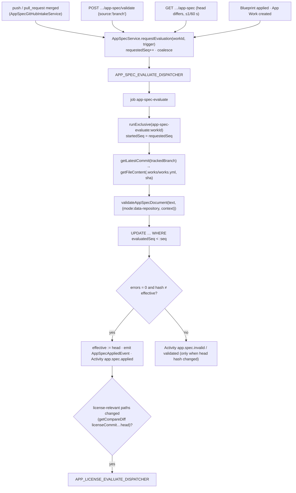

# Implementation Plan: App spec, Apps catalog and license gate

> Translates [`spec.md`](./spec.md) into architecture and tech choices. The plan owns implementation
> detail; the spec owns behaviour; [`schema.md`](./schema.md) and [`catalog.md`](./catalog.md) own the file
> formats. **Every existing path cited below was opened in the worktree before it was written down.** Paths
> marked _(new)_ do not exist yet.

**Epic ID**: `APW-03-app-spec-and-catalog`
**Spec**: [`./spec.md`](./spec.md) · **Tasks**: [`./tasks.md`](./tasks.md)
**Status**: `Draft`
**Last updated**: 2026-09-17
**Authored against**: `develop` @ `a655b53ca` · **Re-aligned**: `develop` @ `ee45946e5` with
[CONTRACTS.md §0](../CONTRACTS.md#0-program-audit-resolutions-binding-2026-09-17-against-develop-ee45946e5)

> **Program audit resolutions applied (binding).** R-1 — every shared type lives in `packages/contracts/src/apps/`
> (§3.2). R-2 — Activity rows carry the dotted §6 name in `action` and `app_spec` / `app_blueprint` / `app_license` in
> `actionType` (§6). R-3 — red and amber hosting rules (§2.4, §2.6). R-4 — a fresh fork or private copy gets `source` +
> App spec in one `commitFiles` commit; Link always a pull request (§2.5). R-5 — managed availability reads
> `AppsTierPolicy.isOpen()` / `managedScope()`, never `EVER_WORKS_APPS_MANAGED_ENABLED` (§2.4). R-11 — key pair
> `format` (schema.md §12). R-13 — `build.strategy: auto` (schema.md §9). R-22 — every test below lives under a
> runnable Jest/Vitest root or `apps/web/e2e/` (§10).

---

## 1. Current state in the codebase

### 1.1 What ships today

| Layer        | File                                                                                                                                                                                                                                                                                                                                  | What it does                                                                                                                                                                                                                                                                                                                                                                                                                                                                                    |
| ------------ | ------------------------------------------------------------------------------------------------------------------------------------------------------------------------------------------------------------------------------------------------------------------------------------------------------------------------------------- | ----------------------------------------------------------------------------------------------------------------------------------------------------------------------------------------------------------------------------------------------------------------------------------------------------------------------------------------------------------------------------------------------------------------------------------------------------------------------------------------------- |
| Schema       | [`packages/agent/src/works-config/schema/works-config.schema.ts`](../../../../../packages/agent/src/works-config/schema/works-config.schema.ts)                                                                                                                                                                                       | zod v4 envelope. Every object is `looseObject` ("unknown keys are preserved, everywhere"). `KIND_SPEC_SCHEMAS` maps 7 kinds; `validateWorksConfig(raw)` never throws, looks the kind up with an own-property check, validates `spec` strictly **by type** but loosely **by key**, and returns `errors: string[]` formatted `path: message` — no line numbers.                                                                                                                                   |
| Schema       | [`emit-json-schema.ts`](../../../../../packages/agent/src/works-config/schema/emit-json-schema.ts)                                                                                                                                                                                                                                    | `buildWorksConfigJsonSchema()` expands `spec` into a `oneOf` of one branch per kind **plus an unrecognised-kind escape branch with `additionalProperties: true`**; `serializeWorksConfigJsonSchema()` is byte-stable.                                                                                                                                                                                                                                                                           |
| Drift guard  | [`__tests__/emit-json-schema.spec.ts`](../../../../../packages/agent/src/works-config/schema/__tests__/emit-json-schema.spec.ts)                                                                                                                                                                                                      | Compares the serializer's output with the committed `works.v2.schema.json`; asserts `branches.length === KIND_SPEC_SCHEMAS count + 1`.                                                                                                                                                                                                                                                                                                                                                          |
| Schema tests | [`__tests__/works-config.schema.spec.ts`](../../../../../packages/agent/src/works-config/schema/__tests__/works-config.schema.spec.ts)                                                                                                                                                                                                | Pins v1 compatibility, never-throws, unknown-key preservation (root and inside a kind spec), YAML round trip, version leniency, per-kind fixtures.                                                                                                                                                                                                                                                                                                                                              |
| Reader       | [`works-config/services/works-config.service.ts`](../../../../../packages/agent/src/works-config/services/works-config.service.ts)                                                                                                                                                                                                    | Reads `.works/works.yml` via `GitFacadeService.getFileContent`, parses with `yaml.parse`, calls `validateWorksConfig` inside a `try` and only **logs** problems ("advisory at read time").                                                                                                                                                                                                                                                                                                      |
| Writer       | [`works-config/services/works-config-writer.service.ts`](../../../../../packages/agent/src/works-config/services/works-config-writer.service.ts)                                                                                                                                                                                      | Rewrites the file on a **local clone** (`fs.writeFile` under `DataRepository.dir`) from the raw parsed document, stripping `__proto__` / `constructor` / `prototype`. Never uses the zod output, so strict reporting cannot delete keys.                                                                                                                                                                                                                                                        |
| Schema route | [`apps/api/src/onboarding/works-schema.controller.ts`](../../../../../apps/api/src/onboarding/works-schema.controller.ts)                                                                                                                                                                                                             | `@Public()` `GET api/schema/works.yml.schema.json`, `Cache-Control: public, max-age=300`.                                                                                                                                                                                                                                                                                                                                                                                                       |
| Catalog      | [`apps/api/src/works/works-template-catalog.service.ts`](../../../../../apps/api/src/works/works-template-catalog.service.ts)                                                                                                                                                                                                         | The pattern to mirror: tokenless raw read (8 s, real User-Agent) → `GitFacadeService.getFileContent` fallback with an App installation token; `CACHE_MANAGER` 1 h / 30 s; `SAFE_SLUG_RE`, `SAFE_REPO_RE = /^ever-works\/[a-z0-9-]+$/`; `stripHtml`; mutable-ref warning.                                                                                                                                                                                                                        |
| Catalog API  | [`apps/api/src/works/work-templates.controller.ts`](../../../../../apps/api/src/works/work-templates.controller.ts)                                                                                                                                                                                                                   | `@Public()` `GET api/work-templates`, returns `[]` when unavailable.                                                                                                                                                                                                                                                                                                                                                                                                                            |
| Web catalog  | [`apps/web/src/lib/api/work-templates.server.ts`](../../../../../apps/web/src/lib/api/work-templates.server.ts)                                                                                                                                                                                                                       | `server-only` fetch with built-in fallback.                                                                                                                                                                                                                                                                                                                                                                                                                                                     |
| Git contract | [`packages/plugin/src/contracts/capabilities/git-provider.interface.ts`](../../../../../packages/plugin/src/contracts/capabilities/git-provider.interface.ts)                                                                                                                                                                         | `getRepository`, `getFileContent?`, `getWorkContents?` (one directory), `getLatestCommit?`, `getCompareDiff?`, `createBranch?`, `createPullRequest`. **No** recursive tree, **no** API-level multi-file commit, **no** topics, **no** file web URL.                                                                                                                                                                                                                                             |
| GitHub impl. | [`packages/plugins/github/src/github-api.service.ts`](../../../../../packages/plugins/github/src/github-api.service.ts)                                                                                                                                                                                                               | `getRepository` → `octokit.rest.repos.get` (follows rename redirects and reports `full_name` of the current name); maps `isFork`, `parent`, `permissions` only.                                                                                                                                                                                                                                                                                                                                 |
| Facade       | [`packages/agent/src/facades/git.facade.ts`](../../../../../packages/agent/src/facades/git.facade.ts)                                                                                                                                                                                                                                 | `getRepository`, `getFileContent`, `getLatestCommit`, `getWorkContents`, `getCompareDiff`, `createBranch`, `createPullRequest`, `getInstallationTokenForOwner`; token resolution per Work.                                                                                                                                                                                                                                                                                                      |
| Webhooks     | [`apps/api/src/ingest/github/github-webhook-dispatcher.service.ts`](../../../../../apps/api/src/ingest/github/github-webhook-dispatcher.service.ts)                                                                                                                                                                                   | One verified receiver; `registerConsumer(consumer)` fans verified, owner-bound deliveries out to `GitHubWebhookConsumer`s by `x-github-event`. Example consumer: [`github-check-intake.service.ts`](../../../../../apps/api/src/ingest/github/github-check-intake.service.ts).                                                                                                                                                                                                                  |
| Works lookup | [`packages/agent/src/database/repositories/work.repository.ts`](../../../../../packages/agent/src/database/repositories/work.repository.ts)                                                                                                                                                                                           | `findByDataRepoFullName(fullName)` — **not** the lookup a push consumer can use: it selects only Works with the platform GitHub App installed (`:263-277`) and ignores the delivery's owner binding, so a push intake built on it finds no App Work on a member's own fork and would match every tenant's Works on that repository. T11 adds `findAppWorksByDataRepoFullName(fullName, { userId?, organizationId? })` — kind `app`, no App-installed filter, scoped to the binding — beside it. |
| Jobs         | [`packages/agent/src/tasks/job-runtime.providers.ts`](../../../../../packages/agent/src/tasks/job-runtime.providers.ts), [`_tasks-symbols.ts`](../../../../../packages/agent/src/tasks/_tasks-symbols.ts), [`memory-fact-jobs.ts`](../../../../../packages/agent/src/tasks/memory-fact-jobs.ts)                                       | `DISPATCHER_SYMBOLS` pinned list; barrel symbol inventory; runtime-neutral job ids + handler pattern.                                                                                                                                                                                                                                                                                                                                                                                           |
| Cron pattern | [`packages/tasks/src/tasks/trigger/skill-readiness-sweep.task.ts`](../../../../../packages/tasks/src/tasks/trigger/skill-readiness-sweep.task.ts), [`apps/api/src/skills/skill-readiness-sweep-cron.service.ts`](../../../../../apps/api/src/skills/skill-readiness-sweep-cron.service.ts)                                            | Trigger.dev `schedules.task` + API fallback cron gated on the runtime.                                                                                                                                                                                                                                                                                                                                                                                                                          |
| Locks        | [`packages/agent/src/cache/distributed-task-lock.service.ts`](../../../../../packages/agent/src/cache/distributed-task-lock.service.ts)                                                                                                                                                                                               | `runExclusive(key, …)`.                                                                                                                                                                                                                                                                                                                                                                                                                                                                         |
| Entities     | [`packages/agent/src/entities/skill-tag.entity.ts`](../../../../../packages/agent/src/entities/skill-tag.entity.ts), [`_entity-names.ts`](../../../../../packages/agent/src/database/_entity-names.ts), [`_entities-inventory.ts`](../../../../../packages/agent/src/database/_entities-inventory.ts)                                 | Modern entity template (scope columns without relations); the two registries the drift specs check.                                                                                                                                                                                                                                                                                                                                                                                             |
| Activity     | [`packages/agent/src/entities/activity-log.types.ts`](../../../../../packages/agent/src/entities/activity-log.types.ts), [`docs/activity-log-spec.md`](../../../../../docs/activity-log-spec.md)                                                                                                                                      | `actionType` is an underscore enum (`work_created`); `action` is a dotted string (`items.generated`).                                                                                                                                                                                                                                                                                                                                                                                           |
| Events       | [`packages/agent/src/events/works-config-sync-requested.event.ts`](../../../../../packages/agent/src/events/works-config-sync-requested.event.ts)                                                                                                                                                                                     | `BaseEvent` + `static EVENT_NAME`, consumed with `@OnEvent`.                                                                                                                                                                                                                                                                                                                                                                                                                                    |
| Secrets      | [`packages/agent/src/utils/secret-scan.ts`](../../../../../packages/agent/src/utils/secret-scan.ts)                                                                                                                                                                                                                                   | `scanForSecrets` (from `@ever-works/contracts`) — pattern table reused for R10 and `prompt.example`.                                                                                                                                                                                                                                                                                                                                                                                            |
| Cron helper  | [`packages/agent/src/schedules/cadence.ts`](../../../../../packages/agent/src/schedules/cadence.ts)                                                                                                                                                                                                                                   | `computeNextCronFire(expr, from)` — used to prove R21's 60-minute spacing and to reject unparsable cron.                                                                                                                                                                                                                                                                                                                                                                                        |
| URL parser   | [`packages/agent/src/works/repository-work-source.ts`](../../../../../packages/agent/src/works/repository-work-source.ts)                                                                                                                                                                                                             | GitHub-only `owner/repo` parser the resolver reuses for pasted URLs.                                                                                                                                                                                                                                                                                                                                                                                                                            |
| Web settings | [`SettingsSubTabs.tsx`](../../../../../apps/web/src/components/works/detail/settings/SettingsSubTabs.tsx), [`settings/layout.tsx`](<../../../../../apps/web/src/app/[locale]/(dashboard)/works/[id]/settings/layout.tsx>), [`settings/page.tsx`](<../../../../../apps/web/src/app/[locale]/(dashboard)/works/[id]/settings/page.tsx>) | Three tabs (General, Members, Budgets) from `ROUTES.DASHBOARD_WORK_SETTINGS_*` in [`apps/web/src/lib/constants.ts`](../../../../../apps/web/src/lib/constants.ts); `useWorkDetail()` exposes the Work.                                                                                                                                                                                                                                                                                          |
| Ownership    | [`packages/agent/src/services/work-ownership.service.ts`](../../../../../packages/agent/src/services/work-ownership.service.ts)                                                                                                                                                                                                       | `ensureCanView`, `ensureCanEdit`, `ensureIsOwner`.                                                                                                                                                                                                                                                                                                                                                                                                                                              |

### 1.2 The exact blockers

- **Strict reporting has no home.** `looseObject` everywhere is load-bearing for round trips, and
  `validateWorksConfig` returns strings without positions. An `app` spec needs strict key reporting and
  line/column — without changing the result for any other kind (FR-12).
- **The published schema cannot flag an `app` typo.** The escape branch of the `spec` `oneOf` accepts any
  object, so a strict `app` branch that fails simply matches the escape branch (FR-13).
- **Nothing persists "the effective spec at commit X".** The reader logs and moves on.
- **The Git contract cannot scan or write efficiently.** License scanning needs one recursive listing,
  applying a Blueprint needs one multi-file commit without cloning a repository of more than 1 GiB, the
  probe needs repository topics, and "Open in repository" needs a provider-built file URL
  (Constitution II — the web must not hard-code GitHub URL shapes).
- **Nothing reads a license.** No SPDX parsing, no text matching, no registry.
- **No Work settings tab is kind-conditional** today; `SettingsSubTabs` shows the same three tabs for every
  kind.

### 1.3 What already exists and must be reused, not rebuilt

- The catalog read/caching/sanitizing **shape** of `WorksTemplateCatalogService` — copied, not imported,
  because the Apps catalog must run in the worker too (it lives in the agent package, §2.4).
- `GitHubWebhookDispatcherService.registerConsumer` for push and merge deliveries.
- `WorkRepository.findByDataRepoFullName` for "which App Works use this repository".
- `scanForSecrets` for secret detection; `computeNextCronFire` for cron validation.
- `DistributedTaskLockService.runExclusive` for per-Work evaluation exclusion.
- `WorkOwnershipService` for access checks; `ActivityLogService.log` for Activity.
- The `BaseEvent` / `@OnEvent` pattern for the `app.spec.applied` in-process signal.

---

## 2. Architecture

### 2.1 Modules and seams

```
                    ┌────────────────────────────── packages/agent ──────────────────────────────┐
                    │ works-config/schema/                                                       │
  editor ◄─ JSON ───┤   app-spec.schema.ts  (zod, strict)  app-spec.rules.ts  app-spec.refs.ts   │
  Schema            │   app-spec.validate.ts  (text → issues with line/col)  app-spec.issues.ts  │
                    │                                                                            │
                    │ app-spec/            AppSpecService  (evaluate · getEffectiveSpec ·        │
                    │                      validateDraft · getState)  app-spec-hash.ts           │
                    │                      app-spec-guarded-blocks.ts                            │
                    │ apps-catalog/        AppsCatalogService (read · cache · sanitize)          │
                    │                      AppBlueprintResolverService · AppBlueprintApplyService│
                    │                      app-spec-merge.ts (3-way)                             │
                    │ app-license/         AppLicenseService · license-detect.ts ·               │
                    │                      spdx-expression.ts · license-classify.ts ·            │
                    │                      license-registry.ts · license-headers.ts · texts/     │
                    │ entities/work-app-spec-state.entity.ts   (+ repository)                    │
                    └───────────────▲─────────────────────────▲──────────────────────────────────┘
                                    │                         │
   apps/api ─ AppsCatalogController (public) · WorkAppSpecController · WorksSchemaController (+1 route)
            ─ AppSpecGitHubIntakeService (push, pull_request consumer) · AppsCatalogRefreshCronService
   packages/tasks ─ app-spec-evaluate · app-license-evaluate · app-blueprint-apply · apps-catalog-refresh
   apps/web ─ settings/app-spec page · AppsCatalogBrowser (mounted by APW-01)
   packages/plugin + plugins/github ─ getRepositoryTree? · commitFiles? · getFileWebUrl? · topics
```

All new agent-package folders get a `package.json` export (`./app-spec`, `./apps-catalog`,
`./app-license`) next to the existing `./works-config` export in `packages/agent/package.json`.

### 2.2 The App spec schema and validator

**Two layers, one definition.**

1. `app-spec.schema.ts` _(new)_ — zod v4 `z.strictObject` for every object in `schema.md` §5–§20, the enums,
   bounds and defaults (defaults documented via `.describe()`; never materialised into the file). Exported
   as `appSpecSchema` and registered as `KIND_SPEC_SCHEMAS.app`.
2. `app-spec.rules.ts` _(new)_ — pure functions, one per rule R1–R26, each
   `(spec: AppSpec, ctx: RuleContext) => AppSpecIssue[]`. `app-spec.refs.ts` _(new)_ holds the reference
   grammar (`schema.md` §21) as a hand-written tokenizer, the resolver, the secrecy/phase propagation and a
   Tarjan cycle check over `template` edges.

**Strictness without deletion.** `validateAppSpecDocument(text, { mode, context? })` _(new)_:

```
text ─► size check (256 KiB) ─► yaml.parseDocument(text, { uniqueKeys: true, maxAliasCount: 100 })
     ─► LineCounter positions map: JSON pointer ─► {line, column}
     ─► doc.toJS() ─► depth check (12)
     ─► stripExtensionKeys(copy)          // `x-*` removed from a COPY; the document is untouched
     ─► appSpecSchema.safeParse(copy)     // structural issues; `unrecognized_keys` ─► one unknown_field per key
     ─► if structure ok: rules R1–R26 (+ server-only rules when context present)
     ─► map pointers to positions; nearest ancestor when a key is absent
     ─► sort (errors first, then line); cap 200; newer appSpecVersion ⇒ unknown_field → warning
```

`validateAppSpecObject(obj, options)` is the same pipeline without positions (for callers that already
hold parsed YAML). **`validateWorksConfig` is changed in one place only:** when the resolved kind is `app`
it calls `validateAppSpecObject` instead of `kindSchema.safeParse` and formats the issues with the existing
`formatIssues` string shape — so its return type, never-throws contract and every other kind's result are
unchanged (FR-12, pinned by the existing spec file plus new `app` cases).

**Suggestions.** `unknown_field` computes Damerau–Levenshtein distance ≤ 2 against the keys defined at that
object level; ties resolve alphabetically.

**Messages.** `app-spec.issues.ts` _(new)_ holds `APP_SPEC_ISSUE_CODES` and a `describeIssue(code, params)`
builder producing English `message` + `hint`. Params never include values of secret entries, build args or
prompt examples (FR-6) — the builder takes names only, enforced by its parameter type.

**JSON Schema emission.**

- `emit-json-schema.ts` keeps the `oneOf` (the drift test's branch count still holds) and adds at the root:
  `allOf: [{ if: { properties: { kind: { const: 'app' } }, required: ['kind'] }, then: { properties: { spec: { $ref: '#/$defs/appSpec' } } } }]`
  so an `app` typo is rejected even though the escape branch would accept it (FR-13).
- A post-processing walk adds `patternProperties: { "^x-": {} }` to every object emitted with
  `additionalProperties: false`.
- `emit-app-spec-json-schema.ts` _(new)_ emits the stand-alone `app-spec.v1.schema.json` with `$id`
  `https://api.ever.works/api/schema/app-spec.schema.json`; committed and drift-guarded exactly like
  `works.v2.schema.json`.

### 2.3 Evaluation flow



- **Coalescing (FR-22).** One `UPDATE … RETURNING` increments `requestedSeq` and, when a dispatched job has
  not started (`startedSeq < requestedSeq - 1`) and `dispatchedAt` is within 5 s, skips the dispatch; the
  waiting job reads the newest `requestedSeq` when it starts. Otherwise it stamps `dispatchedAt` and
  dispatches.
- **Ordering.** The job always reads the **current** head, never the event's sha, and writes with
  `WHERE "evaluatedSeq" < :seq`. An older job that loses the race writes nothing.
- **For a specific commit (FR-19g).** `AppSpecService.getEffectiveSpec(workId, commitSha)` returns the
  stored effective spec when `commitSha` equals the effective or head commit; otherwise it reads and
  validates that commit synchronously (no state write unless it is the head) and returns
  `{ status: 'invalid', issues }` for a commit whose spec has errors. APW-05 refuses the Build on `invalid`.
- **Tracked branch move (FR-16).** When a valid head declares `source.branch` ≠ tracked branch, the job
  reads that branch's head spec; only when it exists, is valid and declares the same branch does it update
  `trackedBranch` and request a second evaluation; otherwise it records `tracked_branch_missing`.

### 2.4 Apps catalog service

`AppsCatalogService` _(new, `packages/agent/src/apps-catalog/apps-catalog.service.ts`)_.

| Aspect               | Decision                                                                                                                                                                                                                                                                                                                                                                                                                                                                                                                                                                                                                                                                                                                                                                                                                                                                                                                                                                                                                                                                                                                                                                                                                                                                                                                                                                                                                                                                                                                                                                                                                                                                                                                                                                                |
| -------------------- | --------------------------------------------------------------------------------------------------------------------------------------------------------------------------------------------------------------------------------------------------------------------------------------------------------------------------------------------------------------------------------------------------------------------------------------------------------------------------------------------------------------------------------------------------------------------------------------------------------------------------------------------------------------------------------------------------------------------------------------------------------------------------------------------------------------------------------------------------------------------------------------------------------------------------------------------------------------------------------------------------------------------------------------------------------------------------------------------------------------------------------------------------------------------------------------------------------------------------------------------------------------------------------------------------------------------------------------------------------------------------------------------------------------------------------------------------------------------------------------------------------------------------------------------------------------------------------------------------------------------------------------------------------------------------------------------------------------------------------------------------------------------------------------- |
| Coordinates          | `EVER_WORKS_APPS_CATALOG_REPO` (default `ever-works/templates` — **the listing repository, created 2026-09-17**; the earlier drafts called it `ever-works/apps` and the plan previously stated that name as the default, which contradicted `CONTRACTS.md` §7 and Resolution R-29, so this row now matches them. An installation still carrying `ever-works/apps` keeps working and must not be "corrected", because both names denote the same listing), validated `^[A-Za-z0-9-]{1,39}/[A-Za-z0-9._-]{1,100}$`, otherwise the default + one warning); `EVER_WORKS_APPS_CATALOG_REF` (default `main`).                                                                                                                                                                                                                                                                                                                                                                                                                                                                                                                                                                                                                                                                                                                                                                                                                                                                                                                                                                                                                                                                                                                                                                                 |
| Reads                | `manifest.json` and `licenses.yml`: tokenless `raw.githubusercontent.com/<repo>/<ref>/<file>` (8 s, User-Agent `ever-works-platform (+https://ever.works)`) → `GitFacadeService.getFileContent` with `getInstallationTokenForOwner(owner)` or `EVER_WORKS_APPS_CATALOG_TOKEN` / `GITHUB_TOKEN`. When `EVER_WORKS_E2E_FAKES` is set outside production (CONTRACTS §7, APW-13) the tokenless read is skipped so every read reaches the acceptance harness through the facade.                                                                                                                                                                                                                                                                                                                                                                                                                                                                                                                                                                                                                                                                                                                                                                                                                                                                                                                                                                                                                                                                                                                                                                                                                                                                                                             |
| Size guards          | Response bodies read with a byte counter; `manifest.json` > 2 MiB or `licenses.yml` > 256 KiB ⇒ treated as a failed read.                                                                                                                                                                                                                                                                                                                                                                                                                                                                                                                                                                                                                                                                                                                                                                                                                                                                                                                                                                                                                                                                                                                                                                                                                                                                                                                                                                                                                                                                                                                                                                                                                                                               |
| Cache                | One `CACHE_MANAGER` entry `apps-catalog:<repo>:<ref>` holding `{ entries, registry, manifestHash, registryHash, fetchedAt }`; TTL 1 h, 30 s when either file failed. A separate `apps-catalog:last-good-registry` entry keeps the last parsed registry for 7 days.                                                                                                                                                                                                                                                                                                                                                                                                                                                                                                                                                                                                                                                                                                                                                                                                                                                                                                                                                                                                                                                                                                                                                                                                                                                                                                                                                                                                                                                                                                                      |
| Sanitizer            | `apps-catalog.mapper.ts` _(new, pure)_: every rule in `catalog.md` §3.1; drops a row on its own; `stripHtml`; `icon` pattern; `blueprint.repo` must match `^ever-works\/[a-z0-9-]+$`; **drops a row whose `license.spdx` classifies `red` in the registry, whatever `license.class` claims** (R-3); strips `managedHosting.upstreamAgreement` from any non-amber row; counts drops into one warning per read.                                                                                                                                                                                                                                                                                                                                                                                                                                                                                                                                                                                                                                                                                                                                                                                                                                                                                                                                                                                                                                                                                                                                                                                                                                                                                                                                                                           |
| SSRF containment     | The service has exactly two fetch sites — catalog files and Blueprint repository files — both taking `owner/repo` from validated values. `upstreams[].repo`, `aliases` and `links` are never passed to a fetch (asserted by a test that fails on any other host or repository).                                                                                                                                                                                                                                                                                                                                                                                                                                                                                                                                                                                                                                                                                                                                                                                                                                                                                                                                                                                                                                                                                                                                                                                                                                                                                                                                                                                                                                                                                                         |
| Verification         | `isVerified(entry, now)` = `verified && evidence complete && evidence.blueprintSha === blueprint.sha && expiresAt > now`.                                                                                                                                                                                                                                                                                                                                                                                                                                                                                                                                                                                                                                                                                                                                                                                                                                                                                                                                                                                                                                                                                                                                                                                                                                                                                                                                                                                                                                                                                                                                                                                                                                                               |
| Managed availability | Pure `managedHostingAvailability(entry, registry, tier: { open: boolean; scope: 'verified-blueprints' \| 'any' }, match?)` ⇒ `available` or the first failing reason, in order: `licenseNotGreen` (class `red` or `unknown`), `upstreamAgreementMissing` (class `amber` and no `managedHosting.upstreamAgreement`, R-3), `entryDisallows`, `blueprintNotVerified` (`tier.scope === 'verified-blueprints'` and not `isVerified`, or `match.source === 'explicit'` for a repository the entry does not list — spec FR-81), `managedTierDisabled` (`!tier.open`). `AppsCatalogService` builds `tier` from APW-10's `APPS_TIER_POLICY` port (interface in `packages/agent/src/app-runtime/ports.ts`, APW-06): `open = AppsTierPolicy.isOpen()`, `scope = AppsTierPolicy.managedScope()` (R-5; the older name `isManagedEnabled` survives only as APW-10's alias — CONTRACTS §3). Port unbound ⇒ `{ open: false, scope: 'verified-blueprints' }`. **Never** reads `EVER_WORKS_APPS_MANAGED_ENABLED`; that variable is only APW-10's ceiling behind the port. **Purity is part of the contract, not a style preference:** `managedHostingAvailability` and `apps-catalog.mapper.ts` are functions of their arguments only — the tier object is **passed in**, never read from a policy, an env var or a singleton inside them. Every caller (this service today, any later consumer) builds `tier` through `APPS_TIER_POLICY` and hands it over, so the reason a row is unavailable stays testable without an environment and the same inputs always give the same answer (R-5). A change that makes either function read `AppsTierPolicy.isOpen()`, `managedScope()` or `process.env` itself is out of contract and belongs in `AppsCatalogService` — which is where the port is read today. |
| Details              | `getDetail(id)` adds `README.md` (first 64 KiB, sanitized with the platform's Markdown sanitizer) and an App spec summary, read from the Blueprint repository at `blueprint.sha`, cached 1 h under `apps-catalog:blueprint:<repo>@<sha>`.                                                                                                                                                                                                                                                                                                                                                                                                                                                                                                                                                                                                                                                                                                                                                                                                                                                                                                                                                                                                                                                                                                                                                                                                                                                                                                                                                                                                                                                                                                                                               |
| Refresh              | `refresh()` bypasses the cache, compares hashes, and returns `{ manifestChanged, registryChanged }` for the cron (§6.4).                                                                                                                                                                                                                                                                                                                                                                                                                                                                                                                                                                                                                                                                                                                                                                                                                                                                                                                                                                                                                                                                                                                                                                                                                                                                                                                                                                                                                                                                                                                                                                                                                                                                |

### 2.5 Blueprint resolution and application

**Resolver** — `AppBlueprintResolverService.resolve({ owner, repo, ref?, blueprintId?, workGitOptions })` _(new)_:

```
blueprintId given ─► entry by id (selectable) or probe hit by id ─ found ─► source: explicit ─┐
   │                  entry also lists owner/repo? ⇒ ref constraints apply, verification counts │
   │                  otherwise ⇒ no ref check, never verified for managed hosting (FR-81)     │
   │                  not found ⇒ none (reason: blueprintNotFound)                             │
normalize(owner/repo) ─► manifest index lookup (repo + aliases, lower-case)       ─ hit ─► source: manifest | alias
   │ miss
   ├─► git.getRepository(owner, repo) ─► canonical fullName ─► lookup again      ─ hit ─► source: alias (rename)
   │        isFork ⇒ lookup(root `source` repository ?? `parent`)                 ─ hit ─► source: fork (needs confirmation)
   │ miss
   ├─► probe ever-works/<slug(repo)>-template, ever-works/<slug(owner)>-<slug(repo)>-template
   │     getRepository (topics) ─► getFileContent(.works/works.yml @ default branch) ─► blueprint mode, 0 errors
   │                                                                              ─ hit ─► source: probe (Unlisted)
   └─► none (reason: notListed | lookupFailed)
hit (non-explicit) ─► ref constraints (branches globs, tags semver range via `semver`, exclude globs) ─► ok | refMismatch
```

- **Fork networks (FR-40).** GitHub's repository read reports both `parent` (the immediate fork parent) and `source`
  (the root of the fork network). The resolver matches the **root** first, then the parent, so a fork of a fork
  of `calcom/cal.diy` still matches. APW-02's `IGitProviderPlugin.getRepository` extension exposes `source`
  (CONTRACTS §3); when a provider reports only `parent`, the parent is used.
- **Explicit Blueprint id (FR-81).** APW-01 passes `blueprintId` from `POST /api/works` / inspect (CONTRACTS §4) to
  `APP_SOURCE_CATALOG_PORT.matchBlueprint({ owner, repo, blueprintId })`. This is **the supported path** for a
  repository no entry names — including the acceptance suite's per-run generated upstreams (ACCEPTANCE ACC-E2E-05):
  the harness sends `blueprintId: 'app-fixture-hello'` rather than relying on manifest matching.

At most 3 provider reads on the probe path (FR-43); results cached `apps-blueprint-resolve:<canonical>[:<blueprintId>]`
for 1 h (hit) / 10 min (miss). APW-01's `POST /api/works/app-source/inspect` calls `resolve`; APW-03 exposes no
separate resolve endpoint, and resolving records no Activity (inspect has no side effects).

_Clarified 2026-09-25 (T26's first slice, `781f9a2e5`)._ An explicit id with no manifest ⇒ the probe name
`ever-works/<blueprintId>-template` (`catalog.md` §5 naming), and the file must name that id. Every path reads only
`.works/works.yml` (`APP_BLUEPRINT_SPEC_PATH`). The cache is **in-process** (500 entries, oldest evicted, same TTLs)
rather than a `CACHE_MANAGER` key, because `AppWorksModule`, where the adapter is bound, has no cache module.

**Apply** — `AppBlueprintApplyService` _(new)_, always inside job `app-blueprint-apply`:

0. **Request** (`request(workId, blueprintId, { userId, matchSource, confirmForkMatch })`, synchronous, before
   dispatch): resolve the Blueprint for the Work's Work Repository (`blueprintId` passed explicitly), refuse
   `blueprintNotFound` / `forkMatchNeedsConfirmation` / `applyInProgress` (§4.2), persist `blueprintId`,
   `blueprintVersion`, `blueprintMatchSource` and `blueprintApplyStatus = 'applying'`, then record Activity
   **`app.blueprint.matched`** (`actionType: APP_BLUEPRINT`, details `{ blueprintId, version, matchSource }`) exactly
   once per `(workId, blueprintId, version)` — guarded by `UPDATE … WHERE NOT (blueprintId = :id AND
blueprintVersion = :version AND blueprintMatchedAt IS NOT NULL) RETURNING` on the new `blueprintMatchedAt` column —
   and dispatch `APP_BLUEPRINT_APPLY_DISPATCHER` (spec FR-82). A retried request or a re-dispatch records nothing new.
1. Load the entry (or the probe hit) and read, **at `blueprint.sha`**: `.works/works.yml`, `overlay.yml`,
   and every overlay file (`getFileContent(owner, repo, 'overlay/<path>', sha)`). Missing sha ⇒
   `blueprintShaMissing`, write nothing.
2. Validate the Blueprint spec in `blueprint` mode; validate overlay rows (`catalog.md` §5 limits, forbidden
   prefixes).
3. Compose the document: `{ version: 2, kind: 'app', name: display.name, spec: { ...blueprintSpec, source,
blueprint: { id, version, repo, sha }, license, display } }`, serialised with `yaml` `Document` so key
   order is stable; validate in `data-repository` mode — any error aborts.
4. Decide the path (FR-45/46, **R-4**): `fresh = work.sourceRepository.type ∈ {app_fork, app_private_copy} &&
createdByThisWork && (file absent || specKeys(file) ⊆ {kind, appSpecVersion, source}) && no overlay row is 'replace'`.
   On APW-01's **Blueprint path** the initializer writes **nothing** (APW-01 plan §6 step 1a) and calls
   `AppBlueprintApplyService.request(workId, blueprintId)`; this job composes `spec.source` from
   `Work.sourceRepository` (`relation`, `upstream`, `branch`) together with the Blueprint spec, so `source` and the App
   spec land in **one** commit. If a `source`-only file is already present (a Blueprint applied later to a fresh
   repository), its recorded `source` is kept. `relation: link` is never `fresh`.
5. `fresh` ⇒ `git.commitFiles({ branch: trackedBranch, baseSha: head, message, files })` — the provider's
   multi-file commit, **no clone**; on non-fast-forward retry ≤ 3 times re-reading head. Else ⇒
   `createBranch('ever-works/blueprint/<id>-<version>', head)` → `commitFiles` on that branch (existing `add-only`
   targets skipped, `replace` included) → `createPullRequest` with a body listing files and skipped paths. The
   platform never pushes to a default branch it did not create.
6. Persist `blueprintApply*` on the state, emit `app.blueprint.applied` (or `app.blueprint.apply_failed` with
   the reason code), request a spec evaluation (trigger `blueprint_applied`) **and** a license evaluation
   (`AppLicenseService.request(workId, 'blueprint_applied')` — APW-01's Blueprint path does not request one).

**Upgrade** — `apps-catalog-refresh` finds states with `blueprintId = entry.id AND semver.lt(blueprintVersion,
entry.version)` (index `idx_work_app_spec_states_blueprint`), sets `blueprintLatestVersion`, emits
`app.blueprint.upgrade_available` once per version. **Review upgrade** dispatches `app-blueprint-apply` in
`upgrade` mode: `app-spec-merge.ts` _(new, pure)_ three-way merges `base` = Blueprint spec at the applied
sha, `ours` = the effective spec, `theirs` = Blueprint spec at the new sha, key by key, with arrays of named
objects merged **by `name`** (components, env, jobs, cron, smoke, checks). `source` always comes from
`ours`. Conflicts (both sides changed a leaf differently) keep `ours` and are listed. The branch
`ever-works/blueprint-upgrade/<id>` is reused; an open PR for it is updated (force-with-lease on that branch
only) instead of a second PR (FR-51). `MAJOR` bump ⇒ PR title prefix `Breaking:` and the `breaking` flag on
the notice.

### 2.6 License gate

`AppLicenseService` _(new, `packages/agent/src/app-license/`)_, run by job `app-license-evaluate`:

```
commit ─► getRepositoryTree(owner, repo, commit, { recursive: true, maxEntries: 100_000 })
        ─► candidates: root LICENSE* / LICENCE* / COPYING* / UNLICENSE*, root package manifests (≤ 12 reads)
        ─► license-detect.ts:
             manifest fields (package.json "license", pyproject [project].license, Cargo [package].license,
             composer "license") parsed as SPDX expressions (spdx-expression.ts)
             license texts: normalise (lower, strip copyright lines/punctuation) ─► word-bigram Dice vs
             texts/<spdx>.txt ─► best ≥ 0.90 ─► SPDX; registry aliases for titles
        ─► mixed: tree paths with a segment in {ee, enterprise, premium, commercial} at depth ≤ 4;
             nested LICENSE* whose detected id differs; recorded header findings for this commit
        ─► license-classify.ts(expression, registry) ─► class, obligations (OR best, AND worst, WITH exceptions)
        ─► mixed ⇒ worst(parts), unidentified part ⇒ max(class, amber); nothing ⇒ registry.unknown
        ─► eligibility + sourceOffer + attestation validity ─► UPDATE state WHERE licenseEvaluatedSeq < :seq
        ─► Activity app.license.classified | app.license.changed (+ attestation_required when needed)
```

- **Texts.** `texts/*.txt` are the SPDX reference texts (public domain / CC0 dataset) for every identifier in
  the bundled registry snapshot — not catalog content, a detection dataset.
- **Registry.** `license-registry.ts` validates `licenses.yml` per `catalog.md` §4. Source preference:
  live → last good (≤ 7 days) → bundled `license-registry.snapshot.yml`; `licenseRegistrySource` records
  which. A snapshot-sourced classification forces `managedHosting: false` (FR-38).
- **Headers (FR-54).** `license-headers.ts` exports the pure `scanLicenseHeaders(files: { path, head: string }[])`
  (first 2 KiB of each file; `SPDX-License-Identifier:` and `@license` tags). APW-04 and APW-05 call it in
  their checkouts and report through `AppLicenseService.recordEvidence(workId, commitSha, findings)`, which
  stores findings (≤ 20) and requests re-evaluation.
- **Eligibility (FR-57, R-3).** `getHostingEligibility(workId, opts?: { commitSha?: string })` ⇒ `{ none: allowed,
yourCluster: allowed | attestationRequired, managed: allowed | <reason>, sourceOffer: { required, url | null,
missing } }`. `yourCluster` is `allowed` for `green` and `attestationRequired` for `amber`, `red` and `unknown`
  until a valid owner attestation exists. `managed` is `managedHostingAvailability(entry, registry, tier, match)`
  (§2.4) for the App Work's catalog entry, or — with no entry — `licenseNotGreen` for `red`/`unknown`,
  `upstreamAgreementMissing` for `amber`, else the tier checks; a snapshot-sourced registry forces a reason. The
  optional `commitSha` is the Build's or the live Deployment's commit: `sourceOffer.url` targets it, and without it
  `url` is `null` while `required` and `missing` stay meaningful (CONTRACTS §2A). APW-06 calls it at deploy start and
  refuses with the reason codes (FR-58), passing the commit it is deploying.
- **Source offer (FR-61) — worked example of the bullet below.**
  `required = licenseObligations includes 'network-source-offer' && (WorkUpstreamState.relation === 'link' ||
WorkUpstreamState.aheadBy === null || WorkUpstreamState.aheadBy > 0)` — a null `aheadBy` (divergence not yet
  computed) counts as required, so the offer is never silently skipped for a Work nobody has compared yet, and a
  stale value is used as it is (APW-02's column is `aheadBy`, int, nullable).
  Public data repository: `visibility === 'public'` from APW-02's `GitRepository.visibility` when the provider
  returns it, else `isPrivate === false` from `git.getRepository(dataOwner, dataRepo, token)`. The lookup runs only
  when `required`; `internal`, or a failed lookup, counts as **not** public.
  `url = required && public && opts.commitSha ? git.getFileWebUrl(dataOwner, dataRepo, opts.commitSha, '').url
: (required ? effectiveSpec.license.sourceOfferUrl ?? null : null)`, using the effective spec at `commitSha` when
  one was given. `missing = required && !public && !sourceOfferUrl`.
  `WorkAppSpecState.sourceOfferRequired` (§3.1) is a **display cache** for the License card — eligibility
  recomputes it on every call and nothing decides from the column.
- **Attestation.** `attest(workId, userId, { textId, commitSha })`: owner only (`WorkOwnershipService.ensureIsOwner`;
  any other member, a manager included, gets `403 ownerOnly` — R-3); `textId` must equal the
  registry's current text for the classified license and `commitSha` the license commit; stores
  `{ userId, attestedAt, spdx, class, textId, textSha256, commitSha }`. A later evaluation clears it when
  `spdx`, `class` or `textId` differ (FR-59/60).
- **Upstream preview (FR-62).** `previewUpstream(workId, upstreamOwner, upstreamRepo, sha)` runs the same
  pipeline read-only against the upstream commit and returns `{ class, spdx, worse: boolean }`; APW-02 calls
  it before merging a sync.
- **Source offer (FR-61).** `sourceOffer.required = obligations includes 'network-source-offer' && (relation
= link || WorkUpstreamState.ahead > 0)` — the deployed commit is not an upstream commit (APW-02's
  divergence; the same condition as APW-06 FR-44); `url` = `git.getFileWebUrl(owner, repo, deployedSha)` of
  the Work Repository when it is public, else `license.sourceOfferUrl`; `missing` when neither.
  Four things this leaves open, now fixed (nothing above is withdrawn): **`aheadBy` is APW-02's column name**
  (`aheadBy`, int, nullable — APW-02 plan §3.1; the older prose said `ahead`), and a **null** `aheadBy` — divergence
  not yet computed — counts as required, so the offer is never silently skipped for a Work nobody has compared yet,
  while a stale value is used as it is; **public** means `visibility === 'public'` from APW-02's `GitRepository`
  when the provider reports it, else `isPrivate === false` from `git.getRepository(dataOwner, dataRepo, token)`, the
  lookup running only when `required`, with `internal` or a failed lookup counting as **not** public; **no
  `commitSha` means no URL** — the signature is `getHostingEligibility(workId, opts?: { commitSha?: string })`
  (CONTRACTS §2A), `url` targets `opts.commitSha`, and only `required`/`missing` are meaningful without it, so APW-06
  passes the Build's or the live Deployment's commit; and `git.getFileWebUrl(owner, repo, ref, path)` with an
  **empty** `path` returns the repository **root at `ref`** (`https://github.com/<o>/<r>/tree/<ref>`, no
  `lineAnchor`), which is the call the URL above is built from.
- **Attestation location (C3, R-3 — resolved).** The single record is `WorkAppSpecState.attestation`, owned by this
  epic and exposed through `getHostingEligibility`; APW-06 stores no attestation of its own.

### 2.7 What other epics consume

| Consumer | Call                                                                                                                                                                                                                                                                                                                                                                                                                                                  | Returns / effect                                                          |
| -------- | ----------------------------------------------------------------------------------------------------------------------------------------------------------------------------------------------------------------------------------------------------------------------------------------------------------------------------------------------------------------------------------------------------------------------------------------------------- | ------------------------------------------------------------------------- |
| APW-01   | `APP_SOURCE_CATALOG_PORT` (APW-01's port) bound by `AppSourceCatalogAdapter` _(new, `packages/agent/src/apps-catalog/app-source-catalog.adapter.ts`)_: `matchBlueprint` → resolver (`null` on `none`, `refMismatch`, or an unconfirmed fork match), `classifyLicense(spdx)` → registry classification; plus `AppSpecService.initialize(workId, branch)`, `AppBlueprintApplyService.request(workId, blueprintId)`, `AppLicenseService.request(workId)` | match, state row created, apply dispatched, license evaluation dispatched |
| APW-02   | `AppLicenseService.previewUpstream(...)`; `AppLicenseService.request(workId, 'upstream_synced')`                                                                                                                                                                                                                                                                                                                                                      | class preview; re-evaluation                                              |
| APW-04   | `AppSpecService.validateDraft(workId, text)`; `scanLicenseHeaders`; `recordEvidence`                                                                                                                                                                                                                                                                                                                                                                  | issues; license findings                                                  |
| APW-05   | `AppSpecService.getEffectiveSpec(workId, commitSha)`; `@OnEvent('app.spec.applied')`                                                                                                                                                                                                                                                                                                                                                                  | spec or `invalid`                                                         |
| APW-06   | `getEffectiveSpec`; `AppLicenseService.getHostingEligibility(workId)`                                                                                                                                                                                                                                                                                                                                                                                 | spec; eligibility + source offer                                          |
| APW-07   | `@OnEvent('app.spec.applied')` with `{ addedDependencies, changedEnvNames }`                                                                                                                                                                                                                                                                                                                                                                          | provision / prompt                                                        |
| APW-08   | `diffGuardedSpecBlocks(before, after)` over `source`, `blueprint`, `license`, `display.protectedPaths`, `upstreamPullRequests`, `provisioning`; `isProtectedPath(spec, path)`                                                                                                                                                                                                                                                                         | guarded-block changes; protected path check                               |
| APW-11   | state `displayName`                                                                                                                                                                                                                                                                                                                                                                                                                                   | launcher label                                                            |
| APW-13   | `blueprintId` on `POST /api/works` (APW-01) for per-run generated upstreams — the explicit path of §2.5, never manifest matching                                                                                                                                                                                                                                                                                                                      | Blueprint applied with match source `explicit`                            |
| APW-10   | _provides_ `AppsTierPolicy.isOpen()` / `managedScope()` through `APPS_TIER_POLICY`, consumed by `managedHostingAvailability` (R-5)                                                                                                                                                                                                                                                                                                                    | managed availability                                                      |

---

## 3. Data model

**Workspace backup (Resolution R-25).** `WorkAppSpecState` exports as `data/works/app-spec-states.jsonl` through the parent Work ids, with its three `*Hash` columns reviewed as benign digests ([tasks](./tasks.md) T54).

### 3.1 `work_app_spec_states` _(new)_

Entity `packages/agent/src/entities/work-app-spec-state.entity.ts`, following `skill-tag.entity.ts`:
`@ManyToOne(() => Work, { onDelete: 'CASCADE' })`, scope columns without relations, `PortableDateColumn` for
dates.

| Column                                                                | Type                       | Default     | Notes                                                                                                                                                              |
| --------------------------------------------------------------------- | -------------------------- | ----------- | ------------------------------------------------------------------------------------------------------------------------------------------------------------------ |
| `id`                                                                  | uuid PK                    |             |                                                                                                                                                                    |
| `workId`                                                              | uuid NOT NULL              |             | Unique. CASCADE with `works.id`.                                                                                                                                   |
| `tenantId`, `organizationId`                                          | uuid NULL                  |             | Scope stamps.                                                                                                                                                      |
| `trackedBranch`                                                       | varchar(255) NOT NULL      |             |                                                                                                                                                                    |
| `requestedSeq` / `startedSeq` / `evaluatedSeq`                        | bigint NOT NULL            | `0`         | Coalescing and ordering (§2.3). Pending ⇔ `evaluatedSeq < requestedSeq`.                                                                                           |
| `dispatchedAt`                                                        | timestamptz NULL           |             |                                                                                                                                                                    |
| `headCommitSha`                                                       | varchar(40) NULL           |             |                                                                                                                                                                    |
| `headSpecHash`                                                        | varchar(64) NULL           |             | sha256 of canonical JSON of `spec` (sorted keys, no whitespace).                                                                                                   |
| `validationStatus`                                                    | varchar(24) NOT NULL       | `'missing'` | `valid` · `valid_with_warnings` · `invalid` · `missing` · `unreadable`.                                                                                            |
| `issues`                                                              | simple-json NULL           |             | `AppSpecIssue[]`, ≤ 200.                                                                                                                                           |
| `errorCount` / `warningCount`                                         | int NOT NULL               | `0`         |                                                                                                                                                                    |
| `issuesTruncated`                                                     | boolean NOT NULL           | `false`     |                                                                                                                                                                    |
| `effectiveCommitSha`                                                  | varchar(40) NULL           |             |                                                                                                                                                                    |
| `effectiveSpecHash`                                                   | varchar(64) NULL           |             |                                                                                                                                                                    |
| `effectiveSpec`                                                       | simple-json NULL           |             | **Cache** of the spec at `effectiveCommitSha`; the file at that commit is authoritative and the cache is rebuilt from it when absent. Holds no secret values (R8). |
| `effectiveAt`                                                         | timestamptz NULL           |             |                                                                                                                                                                    |
| `lastEvaluatedAt`                                                     | timestamptz NULL           |             |                                                                                                                                                                    |
| `lastEvaluationTrigger`                                               | varchar(24) NULL           |             | `created` · `push` · `pr_merged` · `manual` · `lazy` · `blueprint_applied` · `build`.                                                                              |
| `lastEvaluationError`                                                 | varchar(64) NULL           |             | Provider error code for `unreadable`.                                                                                                                              |
| `blueprintId` / `blueprintVersion` / `blueprintRepo` / `blueprintSha` | varchar(64/32/128/40) NULL |             |                                                                                                                                                                    |
| `blueprintMatchSource`                                                | varchar(16) NULL           |             | `manifest` · `alias` · `fork` (root `source` or `parent` of the fork network) · `probe` · `explicit` (spec FR-81) · `file`.                                        |
| `blueprintApplyStatus`                                                | varchar(16) NULL           |             | `applying` · `applied` · `failed`.                                                                                                                                 |
| `blueprintMatchedAt`                                                  | timestamptz NULL           |             | When `app.blueprint.matched` was recorded for `blueprintId` + `blueprintVersion`; the once-only guard of §2.5 step 0 (FR-82).                                      |
| `blueprintApplyError`                                                 | varchar(64) NULL           |             | Reason code.                                                                                                                                                       |
| `blueprintApplyRef`                                                   | simple-json NULL           |             | `{ kind: 'commit' \| 'pull_request', sha?, number?, url }`.                                                                                                        |
| `blueprintLatestVersion`                                              | varchar(32) NULL           |             |                                                                                                                                                                    |
| `blueprintUpgradeDismissedVersion`                                    | varchar(32) NULL           |             |                                                                                                                                                                    |
| `blueprintUpgradePr`                                                  | simple-json NULL           |             | `{ number, url, version, breaking }`.                                                                                                                              |
| `licenseSpdx`                                                         | varchar(200) NULL          |             |                                                                                                                                                                    |
| `licenseClass`                                                        | varchar(8) NULL            |             | `green` · `amber` · `red` · `unknown`.                                                                                                                             |
| `licenseSource`                                                       | varchar(16) NULL           |             | `detected` · `blueprint` · `user`.                                                                                                                                 |
| `licenseMixed` / `licenseScanIncomplete`                              | boolean NOT NULL           | `false`     |                                                                                                                                                                    |
| `licenseEvidence`                                                     | simple-json NULL           |             | `{ files: string[]; mixedPaths: string[]; headerFindings: … }`, ≤ 20 paths each.                                                                                   |
| `licenseObligations`                                                  | simple-json NULL           |             | `string[]`.                                                                                                                                                        |
| `licenseCommitSha`                                                    | varchar(40) NULL           |             |                                                                                                                                                                    |
| `licenseRegistryHash`                                                 | varchar(64) NULL           |             | Drives re-classification fan-out.                                                                                                                                  |
| `licenseRegistrySource`                                               | varchar(16) NULL           |             | `live` · `last_good` · `snapshot`.                                                                                                                                 |
| `licenseRequestedSeq` / `licenseEvaluatedSeq`                         | bigint NOT NULL            | `0`         |                                                                                                                                                                    |
| `licenseEvaluatedAt`                                                  | timestamptz NULL           |             |                                                                                                                                                                    |
| `attestation`                                                         | simple-json NULL           |             | `{ userId, attestedAt, spdx, class, textId, textSha256, commitSha }`.                                                                                              |
| `sourceOfferRequired`                                                 | boolean NOT NULL           | `false`     |                                                                                                                                                                    |
| `displayName`                                                         | varchar(80) NULL           |             |                                                                                                                                                                    |
| `trademarkNotice`                                                     | varchar(500) NULL          |             |                                                                                                                                                                    |
| `protectedPaths`                                                      | simple-json NULL           |             | `string[]`, ≤ 50.                                                                                                                                                  |
| `createdAt` / `updatedAt`                                             | timestamptz                |             |                                                                                                                                                                    |

Indexes: `uq_work_app_spec_states_work (workId)` unique; `idx_work_app_spec_states_blueprint (blueprintId,
blueprintVersion)`; `idx_work_app_spec_states_registry (licenseRegistryHash)`.

Registration: `export *` in `packages/agent/src/entities/index.ts`; `'WorkAppSpecState'` in
`AGENT_ENTITY_NAMES` (`_entity-names.ts`); import + `ENTITIES` entry in `_entities-inventory.ts`; repository
`packages/agent/src/database/repositories/work-app-spec-state.repository.ts` _(new)_ with
`findByWorkId`, `requestEvaluation` (the atomic `UPDATE … RETURNING`), `writeEvaluation(workId, seq, …)`,
`writeLicense(workId, seq, …)`, `findUpgradeCandidates(id, version, limit)`,
`findStaleRegistry(hash, limit)`.

### 3.2 Shared types — `packages/contracts/src/apps/` _(new)_

| File                    | Exports                                                                                                                                                                                                                                                                             |
| ----------------------- | ----------------------------------------------------------------------------------------------------------------------------------------------------------------------------------------------------------------------------------------------------------------------------------- |
| `app-spec.types.ts`     | `AppSpec` and one interface per block (`AppSpecSource`, `AppSpecComponent`, `AppSpecEnvEntry`, …) mirroring `schema.md`; `APP_SPEC_VERSION = 1`.                                                                                                                                    |
| `app-spec-issues.ts`    | `APP_SPEC_ISSUE_CODES` (readonly tuple, append-only), `AppSpecIssueCode`, `AppSpecIssue`, `AppSpecSeverity`, `AppSpecValidationStatus`.                                                                                                                                             |
| `app-license.types.ts`  | `LicenseClass`, `HostingEligibility`, `ManagedHostingReason = 'licenseNotGreen' \| 'upstreamAgreementMissing' \| 'entryDisallows' \| 'blueprintNotVerified' \| 'managedTierDisabled'` (order = evaluation order, R-3), `BlueprintMatchSource`, `SourceOffer`, `LicenseAttestation`. |
| `apps-catalog.types.ts` | `AppsCatalogEntry`, `AppsCatalogListQuery`, `AppsCatalogListResponse { items, total, available, page, limit }`, `AppsCatalogDetail`, `BlueprintResolution`.                                                                                                                         |
| `work-app-spec.dto.ts`  | `WorkAppSpecStateDto` (state minus internal seq columns, plus `evaluationPending`, `links.file(line)` builder input).                                                                                                                                                               |
| `apps-limits.ts`        | Every numeric constant below.                                                                                                                                                                                                                                                       |
| `index.ts`              | Barrel; `packages/contracts/src/index.ts` gains `export * from './apps/index.js';`.                                                                                                                                                                                                 |

```ts
export const APP_SPEC_FILE_MAX_BYTES = 262_144;
export const APP_SPEC_MAX_ISSUES = 200;
export const APP_SPEC_YAML_MAX_ALIASES = 100;
export const APP_SPEC_MAX_DEPTH = 12;
export const APP_SPEC_SUGGESTION_MAX_DISTANCE = 2;
export const APP_SPEC_EVALUATE_COALESCE_MS = 5_000;
export const APP_SPEC_LAZY_HEAD_CHECK_MS = 60_000;
export const APP_SPEC_DRAFT_VALIDATE_PER_MIN = 30;
export const APP_SPEC_REFRESH_PER_MIN = 6;
export const APPS_CATALOG_CACHE_TTL_MS = 3_600_000;
export const APPS_CATALOG_FAILURE_TTL_MS = 30_000;
export const APPS_CATALOG_FETCH_TIMEOUT_MS = 8_000;
export const APPS_CATALOG_MANIFEST_MAX_BYTES = 2_097_152;
export const APPS_CATALOG_MAX_ENTRIES = 1_000;
export const APPS_CATALOG_REGISTRY_MAX_BYTES = 262_144;
export const APPS_CATALOG_LAST_GOOD_REGISTRY_MS = 7 * 86_400_000;
export const APPS_CATALOG_PAGE_SIZE = 24;
export const APPS_CATALOG_PAGE_SIZE_MAX = 100;
export const APPS_CATALOG_SEARCH_MIN_CHARS = 2;
export const APPS_CATALOG_README_MAX_BYTES = 65_536;
export const APPS_CATALOG_PUBLIC_PER_MIN = 120;
export const APPS_CATALOG_FANOUT_PER_RUN = 500;
export const APPS_CATALOG_REFRESH_CRON = '23 * * * *';
export const BLUEPRINT_RESOLVE_HIT_TTL_MS = 3_600_000;
export const BLUEPRINT_RESOLVE_MISS_TTL_MS = 600_000;
export const BLUEPRINT_PROBE_MAX_READS = 3;
export const BLUEPRINT_ALTERNATIVES_MAX = 5;
export const BLUEPRINT_OVERLAY_MAX_FILES = 50;
export const BLUEPRINT_OVERLAY_FILE_MAX_BYTES = 1_048_576;
export const BLUEPRINT_OVERLAY_TOTAL_MAX_BYTES = 5_242_880;
export const BLUEPRINT_APPLY_RETRIES = 3;
export const BLUEPRINT_APPLY_PER_HOUR = 5;
export const LICENSE_TEXT_MATCH_THRESHOLD = 0.9;
export const LICENSE_MAX_FILE_READS = 12;
export const LICENSE_MIXED_DIR_NAMES = ['ee', 'enterprise', 'premium', 'commercial'] as const;
export const LICENSE_MIXED_MAX_DEPTH = 4;
export const LICENSE_EVIDENCE_MAX = 20;
export const LICENSE_TREE_MAX_ENTRIES = 100_000;
export const LICENSE_HEADER_SCAN_BYTES = 2_048;
export const LICENSE_ATTEST_PER_MIN = 10;
export const APPS_MANAGED_REQUIRES_VERIFIED = true; // D7: the scope assumed only while APW-10's AppsTierPolicy port is unbound (R-5)
```

A type-level test in the agent package asserts `z.input<typeof appSpecSchema>` is assignable to `AppSpec` and
back, so the hand-written contract types cannot drift from the zod schema.

### 3.3 The migration (Constitution V, forward-only)

`apps/api/src/migrations/1792030000000-CreateWorkAppSpecStates.ts` _(new)_ — APW-03 slot 00 of README §7
rule 6, above the newest migration on `develop` when authored, `1791200100000-CreateOnboardingChecklists.ts`, and
above `1791240000000-AddSafetyRailsCore.ts`, the newest on `ee45946e5` (re-verified 2026-09-17 by listing
`apps/api/src/migrations/`). Re-stamp before merge if a newer one landed.

`up()`: `CREATE TABLE "work_app_spec_states"` with every column of §3.1, the FK to `works(id) ON DELETE
CASCADE`, and the three indexes. No backfill — no App Work exists before APW-01. `down()`: drop the
indexes and the table. No existing table is touched.

The Activity `actionType` additions (`APP_SPEC = 'app_spec'`, `APP_BLUEPRINT = 'app_blueprint'`,
`APP_LICENSE = 'app_license'`) are appended to the varchar-backed enum in `activity-log.types.ts`; **no
migration is required** for them.

---

## 4. API

### 4.1 Endpoints

| Method | Path                                        | Auth / access                      | Body / query                                                   | Returns                                                                               | Throttle                                                 |
| ------ | ------------------------------------------- | ---------------------------------- | -------------------------------------------------------------- | ------------------------------------------------------------------------------------- | -------------------------------------------------------- |
| `GET`  | `/api/apps-catalog`                         | `@Public()`                        | `q, category, tag, status, licenseClass, managed, page, limit` | `AppsCatalogListResponse`; `Cache-Control: public, max-age=300`                       | 120/min per client                                       |
| `GET`  | `/api/apps-catalog/licenses`                | `@Public()`                        | —                                                              | `{ items: [{ spdx, name, class, obligations, attestationTextId? }], registrySource }` | 120/min                                                  |
| `GET`  | `/api/apps-catalog/:id`                     | `@Public()`                        | —                                                              | `AppsCatalogDetail`; 404 unknown id                                                   | 120/min                                                  |
| `GET`  | `/api/schema/app-spec.schema.json`          | `@Public()`                        | —                                                              | stand-alone schema, `max-age=300`                                                     | inherits                                                 |
| `GET`  | `/api/works/:id/app-spec`                   | view                               | —                                                              | `WorkAppSpecStateDto` (+ lazy head check, §2.3)                                       | inherits                                                 |
| `POST` | `/api/works/:id/app-spec/validate`          | view (`content`) / edit (`branch`) | `{ source: 'branch' }` or `{ source: 'content', content }`     | `202 { evaluationPending: true }` or `200 { issues, status, truncated }`              | 6/min per Work (`branch`), 30/min per member (`content`) |
| `POST` | `/api/works/:id/app-spec/blueprint`         | edit                               | `{ blueprintId, confirmForkMatch?: boolean }`                  | `202 { applyStatus: 'applying' }`                                                     | 5/hour per Work                                          |
| `POST` | `/api/works/:id/app-spec/blueprint/upgrade` | edit                               | `{ version }`                                                  | `202` or `200` with the existing pull request                                         | 5/hour per Work                                          |
| `POST` | `/api/works/:id/app-spec/blueprint/dismiss` | edit                               | `{ version }`                                                  | `200`                                                                                 | 30/min                                                   |
| `POST` | `/api/works/:id/app-license/attest`         | owner                              | `{ textId, commitSha }`                                        | `200` updated license part of the DTO                                                 | 10/min per member                                        |

Routes live in `apps/api/src/apps-catalog/apps-catalog.controller.ts` _(new)_ and
`apps/api/src/works/work-app-spec.controller.ts` _(new)_; the schema route is added to
`works-schema.controller.ts`. `GET /api/apps-catalog/licenses` is declared **before** `:id`. Module wiring:
`AppsCatalogModule` is imported by `apps/api/src/api.module.ts`; `WorkAppSpecController` registers in
`apps/api/src/works/works.module.ts` (which already registers `WorkTemplatesController`); the GitHub
consumer is provided by `apps/api/src/ingest/ingest.module.ts` next to `GitHubCheckIntakeService`.

### 4.2 Error contract

| Situation                                            | Status | Body                                               |
| ---------------------------------------------------- | ------ | -------------------------------------------------- |
| Work not visible to the caller                       | 404    | `Work <id> not found.`                             |
| Work is not kind `app`                               | 422    | `{ code: 'notAnAppWork' }`                         |
| `content` larger than 256 KiB                        | 413    | `{ code: 'file_too_large' }`                       |
| `blueprintId` not in the catalog and not a probe hit | 404    | `{ code: 'blueprintNotFound' }`                    |
| Fork-network match without `confirmForkMatch: true`  | 409    | `{ code: 'forkMatchNeedsConfirmation', upstream }` |
| Apply already running                                | 409    | `{ code: 'applyInProgress' }`                      |
| Upgrade to a version not newer than applied          | 422    | `{ code: 'noUpgrade' }`                            |
| Attestation by a non-owner                           | 403    | `{ code: 'ownerOnly' }`                            |
| Attestation not required (class `green`)             | 422    | `{ code: 'attestationNotRequired' }`               |
| `textId` or `commitSha` no longer current            | 409    | `{ code: 'licenseChanged', textId, commitSha }`    |

### 4.3 DTO highlights

- `WorkAppSpecStateDto.links.file` is `{ base: string, commitSha, path: '.works/works.yml' }` where `base`
  comes from `git.getFileWebUrl(owner, repo, commitSha, path)`; the web appends `#L{line}` via a provider
  hint `lineAnchor: '#L{line}'` returned alongside, so no URL shape is hard-coded in the web app.
- `issues[].message` / `hint` are English fallbacks; the web renders `dashboard.workDetail.settings.appSpec.issues.<camelCode>`
  (the code converted to camelCase) when the key exists.
- The catalog DTO never contains `verification.checks[].runUrl` for unverified entries.

### 4.4 Web plumbing

- `apps/web/src/lib/api/apps-catalog.ts` _(new, isomorphic types + client)_ and `apps-catalog.server.ts`
  _(new, `server-only`, mirrors `work-templates.server.ts` but returns `{ available: false }` instead of a
  built-in list)_.
- `apps/web/src/app/api/apps-catalog/route.ts` _(new)_ — same-origin proxy mirroring
  `apps/web/src/app/api/work-templates/route.ts`, always 200.
- `apps/web/src/lib/api/work-app-spec.ts` _(new, `server-only`)_ and
  `apps/web/src/app/actions/dashboard/app-spec.ts` _(new)_: `recheckAppSpecAction`, `applyBlueprintAction`,
  `upgradeBlueprintAction`, `dismissBlueprintUpgradeAction`, `attestLicenseAction`, each `revalidatePath` on
  the App spec route.

---

## 5. Web

### 5.1 Where it hangs

- **Settings → App spec**: `apps/web/src/app/[locale]/(dashboard)/works/[id]/settings/app-spec/page.tsx`
  _(new)_ — server component; `notFound()` when `work.kind !== 'app'`. `SettingsSubTabs.tsx` gains a fourth
  tab with `visible: work.kind === 'app'` (read from `useWorkDetail()`), and its **General** `isActive`
  predicate excludes `/settings/app-spec`. `ROUTES.DASHBOARD_WORK_SETTINGS_APP_SPEC(id)` is added to
  `apps/web/src/lib/constants.ts`.
- **Create flow**: `AppsCatalogBrowser` is a self-contained client component with the contract
  `{ onSelect(entry: AppsCatalogEntry): void; initialQuery?: string }`. APW-01 mounts it in its App creation
  step as the second tab and handles `onSelect` by filling its repository URL with `upstreams[0].repo` and
  passing `blueprintId` to its inspect call. APW-03 does not edit APW-01's form.

### 5.2 Components _(all new)_

| Component                   | Path                                                                           | Notes                                                                                                |
| --------------------------- | ------------------------------------------------------------------------------ | ---------------------------------------------------------------------------------------------------- |
| `AppSpecPageClient`         | `apps/web/src/components/works/detail/settings/app-spec/AppSpecPageClient.tsx` | Layout of §6.2; polls `GET app-spec` every 5 s while `evaluationPending`, at most 24 polls.          |
| `AppSpecStatusBanner`       | `…/app-spec/AppSpecStatusBanner.tsx`                                           | Six states + checking; `R` shortcut while focused.                                                   |
| `AppSpecProblemsList`       | `…/app-spec/AppSpecProblemsList.tsx`                                           | Sort, filter, `line:column`, link via `links.file` + `lineAnchor`; `data-testid="app-spec-problem"`. |
| `AppSpecSections`           | `…/app-spec/AppSpecSections.tsx`                                               | Collapsible sections; `default` marker from a static defaults map exported by `app-spec.types.ts`.   |
| `AppBlueprintCard`          | `…/app-spec/AppBlueprintCard.tsx`                                              | Chips, notice, pending PR link.                                                                      |
| `AppBlueprintUpgradeDialog` | `…/app-spec/AppBlueprintUpgradeDialog.tsx`                                     | Upgrade and apply variants.                                                                          |
| `AppLicenseCard`            | `…/app-spec/AppLicenseCard.tsx`                                                | Headline, mixed evidence, eligibility, source offer, disclaimer.                                     |
| `AppLicenseAttestDialog`    | `…/app-spec/AppLicenseAttestDialog.tsx`                                        | Checkbox-gated confirm; owner-only variant.                                                          |
| `AppsCatalogBrowser`        | `apps/web/src/components/apps-catalog/AppsCatalogBrowser.tsx`                  | Search (300 ms, min 2), category chips, 3/2/1 grid, roving focus, states.                            |
| `AppsCatalogCard`           | `apps/web/src/components/apps-catalog/AppsCatalogCard.tsx`                     | `data-testid="apps-catalog-card"`; icon via `` only.                                            |
| `AppsCatalogDetailsDrawer`  | `apps/web/src/components/apps-catalog/AppsCatalogDetailsDrawer.tsx`            | README rendered from API-sanitized Markdown.                                                         |

### 5.3 Data fetching

- The App spec page's first paint is server-fetched (`GET /api/works/:id/app-spec`), including problems,
  so the banner never flashes a different state.
- Re-check is optimistic only for the button state; the banner changes when the poll returns.
- The catalog browser fetches page 1 on mount through the BFF route, then filters server-side on query
  change; results for the same query are memoised for the component's lifetime.

---

## 6. Background work

**Activity naming (R-2).** Every row is written through `ActivityLogService.log` with `action` = the dotted CONTRACTS §6
name (`app.spec.applied`, `app.blueprint.matched`, `app.license.attested`, …) and `actionType` = the family enum appended
to `packages/agent/src/entities/activity-log.types.ts` (`APP_SPEC = 'app_spec'`, `APP_BLUEPRINT = 'app_blueprint'`,
`APP_LICENSE = 'app_license'`). Details carry ids, codes and counts only.

### 6.1 Dispatchers and job ids

| Job id                 | Dispatcher symbol _(new)_         | Payload                                                                                      | Budget           |
| ---------------------- | --------------------------------- | -------------------------------------------------------------------------------------------- | ---------------- |
| `app-spec-evaluate`    | `APP_SPEC_EVALUATE_DISPATCHER`    | `{ workId, trigger, tenantId, organizationId, providerId?, credentialVersion? }`             | 60 s, retries 2  |
| `app-license-evaluate` | `APP_LICENSE_EVALUATE_DISPATCHER` | `{ workId, trigger, commitSha?, tenantId, organizationId, providerId?, credentialVersion? }` | 120 s, retries 2 |
| `app-blueprint-apply`  | `APP_BLUEPRINT_APPLY_DISPATCHER`  | `{ workId, userId, blueprintId, mode: 'apply' \| 'upgrade', version?, confirmForkMatch, … }` | 300 s, retries 1 |
| `apps-catalog-refresh` | — (cron `23 * * * *`)             | —                                                                                            | 300 s            |

Each dispatcher is `packages/agent/src/tasks/<job>-dispatcher.ts` + `<job>.types.ts` modelled on
`work-import-dispatcher.ts` (returns `string | null`; the three symbols are added to `DISPATCHER_SYMBOLS` in
`job-runtime.providers.ts`, whose provider-count comment and spec are updated by counting, and to
`TASKS_BARREL_RUNTIME_SYMBOLS`). Runtime-neutral job ids and handlers live in
`packages/agent/src/tasks/app-works-jobs.ts` _(new)_ like `memory-fact-jobs.ts`; the Trigger.dev tasks in
`packages/tasks/src/tasks/trigger/{app-spec-evaluate,app-license-evaluate,app-blueprint-apply,apps-catalog-refresh}.task.ts`
delegate to them. A `null` dispatch (no runtime) runs the handler in-process for `app-spec-evaluate` only
(a user is waiting on the page); the other two record `lastEvaluationError: 'dispatchUnavailable'`.

### 6.2 `app-spec-evaluate`

Flow in §2.3. Emits, only when the head hash changed: `app.spec.validated` or `app.spec.invalid` with
`{ commitSha, errorCount, warningCount, codes: first 10 codes }`; and `app.spec.applied` with
`{ commitSha, previousCommitSha, specHash, addedDependencies, changedEnvNames, changedBlocks }` plus the
in-process `AppSpecAppliedEvent` (`packages/agent/src/events/app-spec-applied.event.ts`, _new_).

### 6.3 `app-license-evaluate`

Flow in §2.6. Serialised per Work with `runExclusive('app-license-evaluate:<workId>')`; writes with
`WHERE "licenseEvaluatedSeq" < :seq`. Emits `app.license.classified` (first time), `app.license.changed`
(`{ fromSpdx, toSpdx, fromClass, toClass, commitSha }`), `app.license.attestation_required`; the in-process
`AppLicenseChangedEvent` lets APW-06 and the notifications system react.

### 6.4 `apps-catalog-refresh`

Hourly at :23 (off the :17 skill sweep and off the hour). `AppsCatalogService.refresh()`; when
`manifestChanged`, `findUpgradeCandidates` per entry (≤ 500 Works per run) sets `blueprintLatestVersion` and
emits notices; when `registryChanged`, `findStaleRegistry(newHash, 500)` dispatches
`app-license-evaluate` with trigger `registry_changed` using the stored `licenseSpdx` only (no Git reads
unless the evaluation needs a new commit). Remaining Works are picked up by the next run. When Trigger.dev is
not the configured runtime, `AppsCatalogRefreshCronService` _(new, `apps/api/src/apps-catalog/`)_ runs the
same pass, gated and distributed-locked like `SkillReadinessSweepCronService`.

### 6.5 GitHub event consumer

`AppSpecGitHubIntakeService` _(new, `apps/api/src/ingest/github/app-spec-github-intake.service.ts`)_
implements `GitHubWebhookConsumer` with `events: ['push', 'pull_request']` and registers in `onModuleInit`.

- `push`: `ref === 'refs/heads/' + trackedBranch` for each App Work from
  `WorkRepository.findByDataRepoFullName(repository.full_name)` ⇒ `requestEvaluation(workId, 'push')`.
- `pull_request` with `action: 'closed'`, `merged: true`, `base.ref === trackedBranch` ⇒
  `requestEvaluation(workId, 'pr_merged')`; when the head branch is `ever-works/blueprint-upgrade/<id>` the
  state's `blueprintUpgradePr` is cleared.
- A delivery can only cause evaluations, which always read GitHub's current head; a forged delivery cannot
  change a result. Per-Work dispatches from webhooks are capped at 30 per minute on top of coalescing.

### 6.6 When no webhook ever arrives

Repositories without the platform App or an installed webhook (APW-02) are covered by the lazy head check on
`GET app-spec` (≤ 1 per 60 s per Work, one `getLatestCommit` read), by `getEffectiveSpec` before every Build,
and by manual re-check.

---

## 7. Plugin boundaries

**Git provider contract additions** (all optional; CONTRACTS.md §3 row owned by APW-03):

```ts
interface GitRepository { readonly topics?: readonly string[] }
getRepositoryTree?(owner, repo, ref, token, opts: { recursive: boolean; maxEntries: number }):
    Promise<{ entries: Array<{ path: string; type: 'blob' | 'tree'; size?: number }>; truncated: boolean }>;
commitFiles?(owner, repo, input: { branch: string; baseSha: string; message: string;
    files: Array<{ path: string; content: string; encoding: 'utf-8' | 'base64' }> }, token):
    Promise<{ commitSha: string }>;          // rejects with code 'nonFastForward' when branch ≠ baseSha
getFileWebUrl?(owner, repo, ref, path): { url: string; lineAnchor?: string };
```

- GitHub implementations in `packages/plugins/github/src/github-api.service.ts` (`git.getTree` with
  `recursive=1`; Git Data API blobs → tree with `base_tree` → commit → `updateRef` without force;
  `repos.get` `topics`; `https://github.com/<o>/<r>/blob/<ref>/<path>` with `#L{line}`), delegated by
  `github.plugin.ts` and wrapped in `git.facade.ts`.
- **No new plugin package.** Apps catalog, license registry and Blueprint repositories are runtime catalogs
  (ADR-014), read through the Git facade — not integrations.
- **Constitution II.** Runtime catalogs live in the `ever-works` GitHub organization by definition (ADR-014),
  so the catalog service — exactly like `WorksTemplateCatalogService` — names the GitHub raw host and the
  `github` provider for **its own** catalog reads. Every read or write of a **user's** repository goes
  through the facade with the Work's resolved provider, and no provider URL shape reaches the web app.
- A provider without `getRepositoryTree` ⇒ license scan runs root-only and sets `licenseScanIncomplete`;
  without `commitFiles` ⇒ apply uses the pull-request path with a clone-free fallback refused
  (`applyUnsupported`) rather than cloning a large repository.

---

## 8. i18n

All keys in `apps/web/messages/en.json`, camelCase leaves, **no literal `.` in a leaf**; the 20 sibling
locale files receive the same keys. Paths below are nested objects.

`dashboard.workDetail.settings.tabs.appSpec` → `"App spec"`.

`dashboard.workDetail.settings.appSpec` (selected; the full list is §6 of the spec, keyed one-to-one):

```
statusValid                 "App spec is valid."
statusMeta                  "Commit {sha} · Checked {ago}"
statusWarnings              "App spec is valid, with {count, plural, =1 {1 warning} other {# warnings}}."
statusInvalid               "The App spec on {branch} has {count, plural, =1 {1 error} other {# errors}}."
statusInvalidRunning        "Still running the last valid spec from commit {sha}. Nothing new is built or deployed until the errors are fixed."
statusInvalidNothing        "Nothing can be built or deployed until the errors are fixed."
statusMissing               "No App spec yet."
statusMissingBody           "Apply a Blueprint or let the App Provisioner write one."
statusUnreadable            "We couldn't read .works/works.yml from {branch}."
statusUnreadableBody        "We'll try again on the next push, or you can re-check now."
statusChecking              "Checking the App spec…"
recheck                     "Re-check now"
recheckBusy                 "Checking…"
openInRepository            "Open in repository"
problemsTitle               "Problems"
filterAll / filterErrors / filterWarnings   "All ({count})" / "Errors ({count})" / "Warnings ({count})"
problemsTruncated           "Showing the first 200 problems."
severityError / severityWarning / fixPrefix  "Error" / "Warning" / "Fix:"
defaultMarker               "default"
envGenerated / envFrom / envTemplate / envPrompt / envValue / envSecret
                            "Generated once" / "From {reference}" / "Template" / "Asked at setup" / "Fixed value" / "Secret"
issues.<camelCode>          one leaf per APP_SPEC_ISSUE_CODES entry, snake_case → camelCase
                            (web_component_needs_port → webComponentNeedsPort), same params as the API
```

`dashboard.workDetail.settings.appSpec.blueprint` (`title`, `chipVerified`, `chipBeta`, `chipUnlisted`,
`chipRemoved`, `chipChosen`, `upgradeAvailable`, `upgradeBreaking`, `reviewUpgrade`, `notNow`, `upgradeDialogTitle`,
`upgradeDialogBody`, `openPullRequest`, `upgradePending`, `viewPullRequest`, `applyTitle`, `applyBody`,
`applyShaMissing`, `applyWriteFailed`) and `…appSpec.license` (`headline`, `detectedFrom`, `unknownLicense`,
`mixed`, `scanIncomplete`, `yourClusterAllowed`, `yourClusterNeedsAttestation`, `managedAllowed`,
`managedNotAllowed`, `managedAllowedAgreement`, `reviewAndConfirm`, `confirmedBy`, `disclaimer`, `sourceOfferTitle`, `sourceOfferBody`,
`sourceOfferPrivate`, `changed`, `changedBody`, `attestTitle`, `attestBody`, `attestCheckbox`,
`attestFooter`, `attestConfirm`, `attestCancel`, `attestOwnerOnly`, `refusalManaged`, `refusalAttestation`,
`refusalSourceOffer`, class labels `classGreen`, `classAmber`, `classRed`, `classUnknown`) — copy exactly as
spec §6.3–§6.4.

`dashboard.workCreation.appsCatalog`: `tabBrowse`, `tabPaste`, `searchPlaceholder`, `categoryAll`,
`category.<category>` (15 keys), `badgeVerified`, `badgeBeta`, `badgeComingSoon`, `badgeUnlisted`, `needs`,
`needsNone`, `dependency.postgres|redis|objectStorage|smtp` (as four leaves), `runsOnCluster`,
`runsOnBoth`, `managedReason.licenseNotGreen|upstreamAgreementMissing|entryDisallows|blueprintNotVerified|managedTierDisabled`
(five leaves), `details`, `useThisApp`, `unavailableTitle`, `unavailableBody`, `pasteInstead`, `noResults`,
`clearSearch`, `cantFind`, `empty`, `matchFound`, `matchFork`, `matchRefMismatch`, `matchNone`,
`requirements`, `askAtSetup`, `verifiedOn`, `notVerified`.

---

## 9. Telemetry and failure modes

### 9.1 Events (counters and ids only)

**Where they go.** `packages/agent` does **not** depend on `@ever-works/monitoring` (only `apps/api` does), and this
epic does not add that dependency: the established pattern for an agent-package service is a narrow, injected,
optional client port — `packages/agent/src/services/knowledge-base-reconcile.service.ts:55-67` is the precedent.
This epic therefore declares `APP_SPEC_TELEMETRY_SINK` in
`packages/agent/src/app-spec/app-spec-telemetry.port.ts` **(new)** —
`track(event: AppSpecTelemetryEvent, props: Record<string, string | number | boolean | undefined>, distinctId: string): void`,
fire-and-forget, never throwing — and `apps/api` binds it to `packages/monitoring`'s PostHog client (T49's
`emitAppSpecEvent` is that binding's implementation). Injected `@Optional()`; unbound ⇒ counted and dropped, never a
refusal. The allow-list below is enforced at the port boundary, so a property outside it never reaches the sink.
`distinctId` is the Work owner's id (`'system:app-works'` when a background job has no resolvable owner), with
`workId` travelling as a property.

| Event                          | Properties                                                                                            |
| ------------------------------ | ----------------------------------------------------------------------------------------------------- |
| `app.spec.evaluated`           | `{ workId, trigger, status, errorCount, warningCount, durationMs, coalesced }`                        |
| `app.spec.draft_validated`     | `{ workId, status, errorCount, bytes }`                                                               |
| `apps.catalog.read`            | `{ source: 'cache' \| 'tokenless' \| 'authenticated' \| 'failed', entries, droppedRows, durationMs }` |
| `apps.catalog.browsed`         | `{ hasQuery, category, resultCount }` — never the query text                                          |
| `app.blueprint.resolved`       | `{ source, refMismatch, durationMs, providerReads }`                                                  |
| `app.blueprint.apply_finished` | `{ mode, path: 'commit' \| 'pull_request', outcome, files, reason? }`                                 |
| `app.license.evaluated`        | `{ class, mixed, scanIncomplete, registrySource, fileReads, durationMs }`                             |
| `app.license.attested`         | `{ class }`                                                                                           |

### 9.2 Failure modes

| Failure                                    | Behaviour                                                                                     | Why                                                                                                       |
| ------------------------------------------ | --------------------------------------------------------------------------------------------- | --------------------------------------------------------------------------------------------------------- |
| Provider 5xx / rate limit reading the file | `unreadable` + error code; effective spec and previous result kept; next trigger retries      | A provider blip must not flip a valid app to invalid.                                                     |
| File deleted on the tracked branch         | `missing`; effective spec kept                                                                | Same as an invalid push (FR-20).                                                                          |
| Validator bug throws                       | Caught at the job boundary ⇒ `unreadable` with `validatorError`; logged once with the Work id | Never-throws contract holds at the edge.                                                                  |
| Catalog unreachable                        | Empty `available: false`, 30 s negative cache                                                 | FR-29.                                                                                                    |
| Registry unreachable > 7 days              | Snapshot, managed never eligible                                                              | FR-38.                                                                                                    |
| Blueprint sha force-pushed away            | `blueprintShaMissing`; nothing written; operator warning                                      | Pinned means pinned.                                                                                      |
| `commitFiles` non-fast-forward 3×          | Falls back to the pull-request path once, then `applyConflict`                                | A busy fork should still get its Blueprint.                                                               |
| License tree truncated                     | Root classification stands; `licenseScanIncomplete: true` is shown on the License card        | Penalising large permissive repositories for a provider listing limit would be wrong; the flag is honest. |
| Header finding arrives for an old commit   | Stored against that commit; ignored unless it equals `licenseCommitSha`                       | Evidence must match what is classified.                                                                   |
| Webhook storm                              | Coalescing + 30/min per Work cap                                                              | Bounded cost.                                                                                             |
| App Work deleted mid-job                   | Scoped `UPDATE` affects 0 rows; job exits clean                                               | No resurrection.                                                                                          |

---

## 10. Test plan

### 10.1 Unit — agent package (Jest)

| File _(new unless noted)_                                                                                                                                                                                      | Covers                                                                                                                                                                                                                                                                                                                                                                                                                    |
| -------------------------------------------------------------------------------------------------------------------------------------------------------------------------------------------------------------- | ------------------------------------------------------------------------------------------------------------------------------------------------------------------------------------------------------------------------------------------------------------------------------------------------------------------------------------------------------------------------------------------------------------------------- |
| `packages/agent/src/works-config/schema/__tests__/app-spec.schema.spec.ts`                                                                                                                                     | Every field bound and enum in `schema.md` §5–§20 (incl. `build.strategy: auto` and `generate.keypair.format` `pem` / `base64url-raw` / `pkcs12` with the §12 examples); the three §24 examples valid; `x-` keys; `appSpecVersion` downgrade.                                                                                                                                                                              |
| `…/schema/__tests__/app-spec.rules.spec.ts`                                                                                                                                                                    | One failing and one passing fixture per R1–R26.                                                                                                                                                                                                                                                                                                                                                                           |
| `…/schema/__tests__/app-spec.refs.spec.ts`                                                                                                                                                                     | Grammar, resolution, secrecy/phase propagation, cycles, depth 10.                                                                                                                                                                                                                                                                                                                                                         |
| `…/schema/__tests__/app-spec.validate.spec.ts`                                                                                                                                                                 | Line/column for present and absent keys; limits (256 KiB, 100 aliases, depth 12, duplicate keys); 200 cap; §24.4 exact codes; no secret value in any issue string (property test over random secrets).                                                                                                                                                                                                                    |
| `…/schema/__tests__/works-config.schema.spec.ts` _(modify)_                                                                                                                                                    | `kind: app` cases; every pre-existing case unchanged.                                                                                                                                                                                                                                                                                                                                                                     |
| `…/schema/__tests__/emit-json-schema.spec.ts` _(modify)_ + `emit-app-spec-json-schema.spec.ts`                                                                                                                 | Root `allOf` app branch rejects a typo (validated with an in-test JSON Schema validator); `patternProperties` on strict objects; stand-alone drift guard.                                                                                                                                                                                                                                                                 |
| `packages/agent/src/app-spec/__tests__/app-spec.service.spec.ts`                                                                                                                                               | Coalescing arithmetic, ordering guard, effective-spec rules, tracked branch move, lazy check window, events only on hash change.                                                                                                                                                                                                                                                                                          |
| `…/app-spec/__tests__/app-spec-hash.spec.ts`, `app-spec-guarded-blocks.spec.ts`                                                                                                                                | Canonical hash stability; guarded-block diff.                                                                                                                                                                                                                                                                                                                                                                             |
| `packages/agent/src/apps-catalog/__tests__/apps-catalog.mapper.spec.ts`                                                                                                                                        | Every `catalog.md` §3.1 rule; row-level drop; a `red` row dropped (R-3); `upstreamAgreement` stripped from non-amber rows; verification predicate; every availability reason in order, with `tier` doubles `{ open: false }`, `{ open: true, scope: 'verified-blueprints' }`, `{ open: true, scope: 'any' }` (R-5).                                                                                                       |
| `…/apps-catalog/__tests__/apps-catalog.service.spec.ts`                                                                                                                                                        | Tokenless → authenticated → failed; TTLs; size guards; mutable-ref warning; **fetch spy asserts only catalog and `ever-works/*` Blueprint coordinates are ever requested**.                                                                                                                                                                                                                                               |
| `…/apps-catalog/__tests__/app-blueprint-resolver.spec.ts`                                                                                                                                                      | Case-insensitive, alias, rename via `getRepository`, fork of a fork via the root `source` (parent fallback) with confirmation, explicit `blueprintId` for an unlisted repository (`source: explicit`, no ref check, never verified), unknown id ⇒ `blueprintNotFound`, ref constraints, probe with ≤ 3 reads, caches.                                                                                                     |
| `…/apps-catalog/__tests__/app-blueprint-apply.spec.ts`                                                                                                                                                         | Fresh (file absent or `source`-only) ⇒ one `commitFiles` commit holding `source` from `Work.sourceRepository` + the Blueprint spec, no clone; Link ⇒ PR, never a push; overlay limits and forbidden prefixes; add-only skip; sha missing; retries; `app.blueprint.matched` recorded once per Work + version before `applied` / `apply_failed`, never on a retry or re-dispatch; license evaluation requested after apply. |
| `…/apps-catalog/__tests__/app-spec-merge.spec.ts`                                                                                                                                                              | Three-way merge by key and by `name`; conflicts; `source` from ours.                                                                                                                                                                                                                                                                                                                                                      |
| `packages/agent/src/app-license/__tests__/spdx-expression.spec.ts`, `license-classify.spec.ts`, `license-detect.spec.ts`, `license-headers.spec.ts`, `license-registry.spec.ts`, `app-license.service.spec.ts` | Parser; OR/AND/WITH; text matching at 0.89 / 0.90; manifests; mixed paths depth 4 and 5; registry validation; snapshot never managed; attestation validity and clearing; upstream preview.                                                                                                                                                                                                                                |
| `packages/agent/src/tasks/__tests__/app-works-dispatchers.spec.ts`                                                                                                                                             | Three symbols are `Symbol(...)`, listed in the barrel inventory and in `DISPATCHER_SYMBOLS`.                                                                                                                                                                                                                                                                                                                              |
| `packages/agent/src/entities/__tests__/work-app-spec-state.entity.spec.ts`                                                                                                                                     | Indexes, scope columns, portable dates.                                                                                                                                                                                                                                                                                                                                                                                   |
| `packages/plugins/github/src/__tests__/github-api.app-works.spec.ts` (Vitest, beside the plugin's existing `__tests__/`)                                                                                       | `getRepositoryTree` truncation flag, `commitFiles` non-fast-forward code, topics mapping, file URL.                                                                                                                                                                                                                                                                                                                       |

### 10.2 API (Jest)

- `apps/api/src/apps-catalog/apps-catalog.controller.spec.ts` — public, filters, paging caps, route order
  (`licenses` vs `:id`), cache header, throttle metadata.
- `apps/api/src/works/work-app-spec.controller.spec.ts` — every row of §4.1 and §4.2, cross-account 404,
  viewer vs editor vs owner, 413.
- `apps/api/src/ingest/github/app-spec-github-intake.service.spec.ts` — push to tracked / other branch,
  merged / unmerged PR, upgrade branch clears the PR record, per-Work cap.
- `apps/api/src/migrations/__tests__/CreateWorkAppSpecStates.spec.ts` — creates only the new table and
  indexes; `down()` drops only them.
- `apps/api/src/onboarding/works-schema.controller.spec.ts` _(new)_ — both public schema routes, cache header.

### 10.3 e2e (Playwright, `apps/web/e2e/`)

| File _(new)_                         | Golden path                                                                                                                           |
| ------------------------------------ | ------------------------------------------------------------------------------------------------------------------------------------- |
| `flow-app-spec-settings.spec.ts`     | Seeded App Work states: valid, warnings, invalid-running, missing, unreadable; problems link targets; tab absent on a `website` Work. |
| `flow-app-spec-recheck.spec.ts`      | Re-check → Checking… → new state; viewer sees no controls.                                                                            |
| `flow-apps-catalog-browse.spec.ts`   | Stubbed catalog: search, category, badges, details drawer, placeholder not selectable, unavailable state.                             |
| `flow-app-blueprint-upgrade.spec.ts` | Notice → dialog → pending PR state; dismiss hides only that version.                                                                  |
| `flow-app-license-attest.spec.ts`    | Amber Work: owner confirms; manager sees owner-only copy; eligibility lines update.                                                   |
| `flow-app-works-a11y.spec.ts`        | axe over the four surfaces; keyboard paths of spec §6.4.                                                                              |

Pre-existing specs that must pass unchanged: `flow-templates-catalog-pagination.spec.ts`,
`flow-website-template-catalog.spec.ts`, `flow-work-kind-template-activation-deep.spec.ts`.

### 10.4 Web unit (Vitest)

`AppSpecStatusBanner.unit.spec.tsx`, `AppSpecProblemsList.unit.spec.tsx`, `AppLicenseCard.unit.spec.tsx`,
`AppLicenseAttestDialog.unit.spec.tsx`, `AppsCatalogBrowser.unit.spec.tsx`, `AppsCatalogCard.unit.spec.tsx`,
plus `SettingsSubTabs` coverage for the kind-conditional tab, and the message catalogue guard
`apps/web/src/components/works/detail/settings/app-spec/app-spec-messages.unit.spec.ts` (ACC-03-43): every key the
App spec tab, the Blueprint and License cards, the attestation dialog and the Apps catalog browser read exists in all 21
locale files, every leaf is camelCase without a `.`, and every message survives a `createTranslator` round trip —
modelled on `apps/web/src/components/meetings/meetings-messages.unit.spec.ts`.

---

## 11. Phasing

Each phase leaves `develop` green and deployable.

### P1 — The App spec reads true (FR-1…FR-26, FR-66…FR-70, FR-74…FR-80 for these surfaces)

Contracts, schema + validator + JSON Schemas, `work_app_spec_states`, evaluation job + webhook consumer +
lazy check, `GET app-spec` / `validate`, Settings → App spec (without Blueprint and License cards), docs for
the schema. **Ships value alone**: APW-04, 05, 06 and 07 can build against `getEffectiveSpec`.

### P2 — Apps catalog and Blueprints (FR-27…FR-52, FR-71…FR-73)

Git provider additions (`topics`, `commitFiles`, `getFileWebUrl`), catalog service + public API, resolver,
apply and upgrade jobs, refresh cron, catalog browser component, Blueprint card, `ever-works/templates` seeded
with the schema and CI (tasks in the catalog repository). **Depends on P1.**

### P3 — License gate (FR-53…FR-65)

`getRepositoryTree`, detection, registry, classification, eligibility, attestation, source offer, trademark
display, upstream preview, License card. **Depends on P1**; uses P2's registry read (P3 may merge first with
the bundled snapshot if P2 slips).

---

## 12. Constitution compliance checklist

- [x] **I — Plugin-first.** No external integration is added. Catalogs are runtime data read through the Git
      facade; the three Git capability additions are optional methods on the existing `git-provider`
      capability, implemented inside the GitHub plugin.
- [x] **II — Capability-driven.** Core code asks the facade for tree, commit, topics and file URLs; the web
      builds no provider URL; no plugin id literal is introduced in core code.
- [x] **III — Source of truth in user repositories.** The App spec lives in `.works/works.yml`; the state row
      is derived and rebuildable (the effective-spec column is a cache keyed by commit). Blueprints reach the
      user's repository as commits or pull requests made with the user's own connection.
- [x] **IV — Job runtime.** Four jobs through three new `*_DISPATCHER` symbols and one cron; endpoints that
      start work return `202`; overlap is guarded with `runExclusive` and sequence guards.
- [x] **V — Forward-only migration.** One new table, three indexes, no change to an existing table; `down()`
      drops only what `up()` created.
- [x] **VI — Tests first.** Unit specs per module, controller and consumer specs, migration spec, six e2e
      specs, web unit specs — each a task.
- [x] **VII — Secrets.** Secret env entries cannot carry values (R8); literal build-arg secrets are refused
      (R10); issue builders accept names only; Activity and telemetry carry codes and counts.
- [x] **VIII — Plugin counts.** No plugin added; `docs/plugin-system/built-in-plugins.md` untouched.
- [x] **IX — Behaviour-first spec.** Identifiers, paths and tables live here, in `schema.md` and `catalog.md`.
- [x] **X — Backwards compatibility.** `validateWorksConfig` keeps its signature and every non-`app` result;
      the envelope JSON Schema only gains an `allOf`; issue codes are append-only; new endpoints only.
- [x] **Program rule #2 — no new synonyms.** One new entity (App spec state), justified in spec §5.2; "App
      Blueprint", "Apps catalog", "Blueprint repository" as in README §1.
- [x] **Program rule #10 — public-repository hygiene.** No competitor names, no infrastructure addresses, no
      third-party vulnerability detail; examples in `schema.md` §24.2–§24.3 are fictional.

### Known gaps carried forward

- `build.strategy: auto` (R-13) validates; until an enabled build plugin lists `auto` in `supportedStrategies`
  (APW-05) the server-only warning `build_strategy_unavailable` is reported and APW-05 refuses the Build. The App spec
  never names the builder behind `auto`.
- License header scanning depends on APW-04/05 checkouts; an App Work that never builds relies on file and
  directory evidence only.
- The upgrade merge treats arrays without `name` (for example `command`) as leaves; a user edit and a
  Blueprint edit of the same array is always a conflict.
