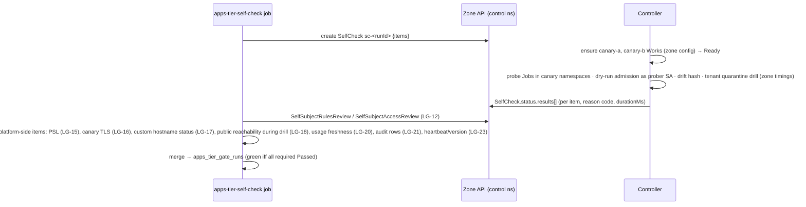

# Implementation Plan: Ever Works Apps — isolated hosting tier (launch gate)

> Translates [`spec.md`](./spec.md) into architecture and tech choices. The plan owns implementation
> detail; the spec owns behaviour. **Every path described as existing was opened in the worktree before it
> was written down**; paths marked **new** do not exist yet. Infrastructure specifics (hosts, networks,
> providers, addresses, accounts) are deliberately absent — they live in the private operations
> repository's infrastructure plan for this tier.

**Epic ID**: `APW-10-apps-hosting-tier`
**Spec**: [`./spec.md`](./spec.md) · **Tasks**: [`./tasks.md`](./tasks.md)
**Status**: `Draft`
**Last updated**: 2026-09-17
**Contracts owned** ([CONTRACTS.md](../CONTRACTS.md)): env `EVER_WORKS_APPS_MANAGED_ENABLED`, the launch
gate, and `AppsTierPolicy` (Resolution R-5): its semantics (`isOpen()`, `managedScope()`, `eligibility(userId)`) and
the only credential it hands out — the control-namespace credential used by the `ever-works-apps` plugin. The
interface is declared in APW-06's ports file (`packages/agent/src/app-runtime/ports.ts`, APW-06 plan §9.6) and bound
by this epic. **Program audit resolutions applied**: R-1 (shared types in `packages/contracts/src/apps/`), R-2
(Activity `actionType` `app_tier`), R-5, R-15, R-20, R-22, R-24. **Added by this epic** (rows added to
CONTRACTS.md): capabilities `apps-tier` + `edge-hostnames`, plugin `ever-works-apps`; Kubernetes API group
`hosting.ever.works/v1alpha1` (`Work`, `SelfCheck`, `UsageReport`, `AbuseSignal`, `AppBuild`); tables
`apps_tier_*`; routes `api/admin/apps-tier/*`, `GET /api/me/apps-tier`, `GET /api/works/:id/apps-tier`; jobs
`apps-tier-self-check`, `apps-tier-gate-watch`, `apps-tier-metering-import`, `apps-tier-daily-receipts`;
Activity events `app.tier.*`; env `EVER_WORKS_APPS_MAX_SCOPE`, `EVER_WORKS_APPS_CONTROL_KUBECONFIG`,
`EVER_WORKS_APPS_CONTROL_NAMESPACE`, `EVER_WORKS_APPS_GATE_MAX_AGE_HOURS`,
`EVER_WORKS_APPS_CONTROLLER_MIN_VERSION`.

---

## 1. Current state in the codebase

### 1.1 What ships today

| Layer         | File                                                                                                                                                                                                                                   | What it does                                                                                                                                                                                                                                                                             |
| ------------- | -------------------------------------------------------------------------------------------------------------------------------------------------------------------------------------------------------------------------------------- | ---------------------------------------------------------------------------------------------------------------------------------------------------------------------------------------------------------------------------------------------------------------------------------------- |
| Deploy        | `apps/api/src/plugins-capabilities/deploy/deploy.service.ts`                                                                                                                                                                           | `deploy()` (176) resolves context (231), picks `isServerSideManagedDeploy` (1100) and calls `deployServerSideManaged` (1128), which hands `KubernetesPlugin.deploy()` a platform-held kubeconfig.                                                                                        |
| Context       | `packages/agent/src/facades/deployment-context.resolver.ts`                                                                                                                                                                            | `ClusterSource`, `resolveKubeconfigForClusterSource` (126–154, env kubeconfigs), `RESERVED_DEPLOY_NAMESPACES` (156), managed/shared namespace = `buildEverWorksTenantNamespace(ownerUserId …)` (244–248) — **one namespace per owner**, not per Work.                                    |
| Matrix        | `apps/api/src/plugins-capabilities/deploy/cluster-source-matrix.ts`                                                                                                                                                                    | Presentation helpers re-exporting the resolver; the resolver is the admission gate.                                                                                                                                                                                                      |
| Facade        | `packages/agent/src/facades/deploy.facade.ts` (~1039–1062)                                                                                                                                                                             | Managed provider kubeconfig: dedicated env credential, else the shared-cluster env credential.                                                                                                                                                                                           |
| k8s plugin    | `packages/plugins/k8s/src/manifest.renderer.ts`, `k8s-api.service.ts`, `k8s.plugin.ts`                                                                                                                                                 | Server-side apply with `FIELD_MANAGER = 'ever-works-k8s-plugin'`; Deployment + Service + Ingress + Secrets; `ensureNamespace` (387) creates namespaces. Renders workload objects only — tenancy objects are outside its scope; no delete/scale method. `@kubernetes/client-node` ^1.4.0. |
| Namespace     | `packages/agent/src/ever-works-providers/ever-works-k8s-deploy.provider.ts` (164)                                                                                                                                                      | `buildEverWorksTenantNamespace(userId, base)` → `{base}-{userId}`, ≤ 63 chars.                                                                                                                                                                                                           |
| Quota         | `packages/agent/src/ever-works-providers/ever-works-deploy-quota.service.ts`                                                                                                                                                           | Counts Works per user at creation (default 3). Not compute.                                                                                                                                                                                                                              |
| Config        | `packages/agent/src/config/index.ts` (`everWorks.deploy` ~1044–1097)                                                                                                                                                                   | Env-only gates for managed hosting; no runtime settings table exists anywhere.                                                                                                                                                                                                           |
| Kill switch   | `packages/agent/src/entities/fleet-kill-switch.entity.ts`, `packages/agent/src/fleet/fleet-kill-switch.service.ts`, `apps/api/src/fleet/fleet-kill-switch.controller.ts`                                                               | Precedent: DB-backed stop flag, **fails closed** on missing row or read error, two verbs (`POST stop` / `POST clear`), audit read, never cancels running work implicitly.                                                                                                                |
| Admin         | `apps/api/src/auth/guards/platform-admin.guard.ts`, `packages/agent/src/entities/user.entity.ts` (`isPlatformAdmin` 209, `emailVerified` 102)                                                                                          | `IsPlatformAdminGuard` answers **403** for non-admins.                                                                                                                                                                                                                                   |
| Admin UI      | `apps/web/src/app/[locale]/(dashboard)/admin/usage/page.tsx`, `apps/web/src/lib/api/server-api.ts`                                                                                                                                     | Admin pages live in `apps/web` (the `apps/admin` folder holds only a README); each page calls the admin API and `notFound()`s on error.                                                                                                                                                  |
| Usage         | `packages/agent/src/entities/plugin-usage-event.entity.ts`, `packages/agent/src/usage/plugin-usage.service.ts` (`record` 105), `packages/agent/src/usage/credit-price-list.ts`, `packages/agent/src/entities/_types.ts` (`UsageMeter`) | `PluginUsageCapability` is a varchar enum extended additively (`ai`, `mcp`, …, `metrics`); events carry `units`, `meter`, `payer`, `creditsCharged`, `requestId`. No hosting compute.                                                                                                    |
| Billing       | `packages/agent/src/subscriptions/subscription.service.ts` (`getActiveSubscription` 384)                                                                                                                                               | Active subscription lookup per user.                                                                                                                                                                                                                                                     |
| Jobs          | `packages/agent/src/tasks/kb-reembed-work-dispatcher.ts`, `packages/agent/src/tasks/_tasks-symbols.ts`, `packages/tasks/src/tasks/trigger/kb-reconcile.task.ts`                                                                        | `Symbol()` dispatcher tokens listed in the barrel inventory; `schedules.task({ id, cron })`.                                                                                                                                                                                             |
| Capabilities  | `packages/plugin/src/contracts/capabilities/deployment.interface.ts` (`IDeploymentPlugin` 130), `dns.interface.ts`, `packages/plugins/cloudflare-dns/package.json` (`everworks.plugin` manifest)                                       | Additive capability contract precedent; manifest declares `category` and `capabilities`.                                                                                                                                                                                                 |
| Email         | `packages/agent/src/facades/email.facade.ts`                                                                                                                                                                                           | Transactional email for operator notifications.                                                                                                                                                                                                                                          |
| Activity      | `packages/agent/src/activity-log/activity-log.service.ts`, `packages/agent/src/entities/activity-log.types.ts`                                                                                                                         | `log({ userId, workId, actionType, action, status, summary, metadata })`.                                                                                                                                                                                                                |
| Program ports | APW-06 plan §9.6 (`packages/agent/src/app-runtime/ports.ts`, **new** in APW-06)                                                                                                                                                        | `AppsTierPolicy` declared by APW-06 as `{ isOpen; managedScope; resolveClusterCredential; podPolicy; ingress; eligibility }`, token `APPS_TIER_POLICY`, default closed. Resolution R-5 names `isOpen()` as the method every consumer calls; this epic owns its semantics (§5.5).         |
| Migrations    | `apps/api/src/migrations/`                                                                                                                                                                                                             | Newest on `develop` @ `ee45946e5`: `1791240000000-AddSafetyRailsCore.ts` (`1791200100000-CreateOnboardingChecklists.ts` when authored).                                                                                                                                                  |

No `CustomResourceDefinition`, informer or controller code exists anywhere in the repository.

### 1.2 The exact blockers

- **The tier inverts the credential direction.** A platform that applies Deployments, Secrets and
  namespaces itself needs a credential able to create all of them. For the tier, the platform writes
  desired state; the zone creates objects.
- **Namespaces are per owner.** The resolver derives one namespace per user; LG-10 requires one per App
  Work, created with its policies atomically.
- **The renderer has no tenancy layer.** Tenancy objects are outside the renderer's scope, so the tenant
  template cannot be an option of the renderer — it must be enforced by the zone.
- **No stop control for deployed workloads**, and nothing measures compute.
- **No runtime settings store.** The tier's open/closed state cannot be an env var alone: the API must be
  able to refuse opening (spec FR-14).
- **Admin 403 vs spec 404** (FR-52).

### 1.3 Reuse, do not rebuild

- The fleet kill switch's fail-closed reading and two-verb API shape (quarantine/release, open/close).
- **Naming (added 2026-09-17, after AW-23/AW-24 landed).** The platform already has three stops with their own
  words: the operator's global **stop flag** (EW-778, `RUN_KILL_SWITCH`, `packages/agent/src/agents/run-kill-switch.ts`,
  surfaced by AW-24 as the `platform-stop` rail), an Agent's **Pause** (AW-23 brake, `agent-brake.service.ts`) and a
  workspace owner's **Pause everything** (AW-24 `workspace-pause` rail). All three stop agent work; none touches a
  deployed App Work. This epic's controls stop **running workloads** on Ever Works Apps, so they keep the nouns
  **Quarantine** / **Release** and **Pause all** / **Release all paused**, never reuse "stop flag" or "Pause
  everything" in UI copy, and never read or write `RUN_KILL_SWITCH` or `WorkspacePauseService`. **Resolved (R-20):**
  LG-18 is titled **Tenant quarantine drill**, and neither the platform stop flag nor an Agent or workspace pause ever
  quarantines tier workloads — the stop flag's readers never import `packages/agent/src/apps-tier/`, and this epic's
  services never import the stop flag (T40 pins both directions).
- `PluginUsageService.record` + the credit price list for hosting usage (new capability value `hosting`).
- `getActiveSubscription` and `User.emailVerified` for eligibility.
- APW-06's App renderer as a **library** inside the controller (§2.1 D-C); APW-06's `AppsTierPolicy` port
  as the platform-side integration seam.
- `@kubernetes/client-node` (already a dependency of the k8s plugin) for both the plugin and the controller.

---

## 2. Architecture

### 2.1 Decisions

| Id  | Decision                                                                                                                                                                                                                                                                                                                                                                                  | Alternatives rejected                                                                                                                  |
| --- | ----------------------------------------------------------------------------------------------------------------------------------------------------------------------------------------------------------------------------------------------------------------------------------------------------------------------------------------------------------------------------------------- | -------------------------------------------------------------------------------------------------------------------------------------- |
| D-A | **Desired state as custom resources** in one control namespace; the zone's API server is the only inbound surface.                                                                                                                                                                                                                                                                        | Platform server-side apply (needs broad credential); a bespoke controller HTTP API (a second auth surface to build, audit and expose). |
| D-B | **Controller in TypeScript in this monorepo** (`apps/hosting-operator`), informers from `@kubernetes/client-node`, level-triggered reconcile with a 300 s resync.                                                                                                                                                                                                                         | Go + controller-runtime: mature, but duplicates APW-06's renderer and validation in a second language, and a second test stack.        |
| D-C | The controller renders workloads from the **constrained desired-state schema** with APW-06's renderer, then applies **non-overridable overlays** (security context, runtime class, token, labels, bandwidth). It never applies manifests authored by the platform.                                                                                                                        | Accept rendered manifests from the platform (a platform bug or compromise becomes arbitrary manifests in the zone).                    |
| D-D | **Sealed secrets**: hybrid RSA-OAEP-256 (4,096-bit) + AES-256-GCM with Node `crypto` to the controller's public key; the private key is generated in the zone and never leaves it.                                                                                                                                                                                                        | Platform creates Secrets (needs `secrets` write); an extra sealing library (new dependency for a 60-line function).                    |
| D-E | Zone admission = PSA `restricted` by namespace label **and** cluster default, built-in **ValidatingAdmissionPolicy** (CEL) for structural rules, plus an image-signature admission controller. Concrete products are chosen in the private plan.                                                                                                                                          | A single policy engine for everything (a larger in-zone dependency where built-in CEL suffices for structure).                         |
| D-F | **Self-check canaries are App Works** created by the controller from zone config and reconciled through the **same** code path.                                                                                                                                                                                                                                                           | A special probe namespace (would test a template no tenant uses).                                                                      |
| D-G | **Pull model for everything flowing out of the zone** (status, usage, signals): the platform lists and acknowledges; the zone holds no platform credential.                                                                                                                                                                                                                               | Zone pushes to the platform API (a credential in the zone and an inbound path to the platform).                                        |
| D-H | **Tier state is computed on read** from append-only events + latest run + attestations + heartbeat; a 5-minute watch records transitions.                                                                                                                                                                                                                                                 | A stored boolean (can disagree with the evidence it claims to rest on).                                                                |
| D-I | The platform's narrow control credential lives on API pods **and** the cluster-I/O worker, so quarantine never depends on the job runtime (FR-45). Its blast radius is "write tenant desired state", which the zone still validates.                                                                                                                                                      | Worker-only (quarantine would wait on the queue).                                                                                      |
| D-J | **Deploy path (Resolution R-5).** APW-06 renders an App Work into its `AppRenderInput` on the platform and hands it to the `apps-tier`-capable plugin; the plugin maps it to a `Work` desired-state object; the controller reconciles it in the zone with APW-06's renderer library. The platform writes `Work` objects only — never a Deployment, Service, Ingress, Secret or namespace. | The `k8s` plugin's managed variant applying workloads to the tier (needs a workload-creating credential on the platform).              |
| D-K | **Delete semantics (Resolution R-15).** `Work.spec.desiredState: removed` removes workloads, addresses and the env Secret but keeps PVCs and dependencies; `Work.spec.dataDeletion` (set only when the owner confirmed **Also delete stored data**) lets the controller delete PVCs and the namespace after every `status.dependencies[]` entry reports `released`.                       | Deleting the `Work` object (loses the retention record); deleting data on every removal (breaks R-15).                                 |

### 2.2 Components

```
 ┌───────────────────────────────── platform (this monorepo) ──────────────────────────────────┐
 │ apps/api  apps-tier/  AppsTierAdminController (api/admin/apps-tier/*, AppsTierAdminGuard→404) │
 │                       AppsTierUserController  (api/me/apps-tier, api/works/:id/apps-tier)   │
 │ packages/agent  apps-tier/                                                                  │
 │   gate registry (LG-01…25) · AppsTierStateService (open/close/evaluate) · attestations ·    │
 │   AppsTierQuarantineService · eligibility · metering import · signals · quota profiles ·    │
 │   AppsTierPolicyImpl ──► APW-06 APPS_TIER_POLICY port                                       │
 │   AppsTierFacadeService ──► plugin with capability `apps-tier`                              │
 │ packages/plugins/ever-works-apps  (capabilities: apps-tier, deployment[supportsApps])       │
 │   control-namespace client · desired-state mapper (APW-06 render input → Work spec) · sealer│
 │ packages/tasks  apps-tier-self-check · apps-tier-gate-watch · apps-tier-metering-import ·   │
 │                 apps-tier-daily-receipts                                                    │
 │ apps/web  admin/apps-tier/* pages · owner banner · eligibility copy for APW-06's target card │
 └───────────────────────────────┬─────────────────────────────────────────────────────────────┘
          control credential: CRUD on hosting.ever.works/* + get 2 named objects, ONE namespace
 ┌───────────────────────────────▼──────────── isolated zone ──────────────────────────────────┐
 │ apps/hosting-operator (image built by this monorepo's CI, deployed by the zone's GitOps) │
 │   reconcile Work → namespace template → promotion Job (copy·scan·sign) → workloads          │
 │   quarantine sequencer · heartbeat Lease · UsageReport writer · AbuseSignal intake          │
 │   SelfCheck runner → canary Works → probe Jobs (same image, `probe` entrypoint)             │
 │ admission: PSA restricted · ValidatingAdmissionPolicies · signature verification            │
 │ tenant namespaces ewa-<id> · tier edge · tenant data servers · registry · runtime sensor     │
 └─────────────────────────────────────────────────────────────────────────────────────────────┘
```

### 2.3 Flow — a deployment on the tier (P2)

```mermaid
sequenceDiagram
    participant W as APW-06 app-deploy job (cluster-I/O worker)
    participant P as AppsTierPolicyImpl
    participant F as AppsTierFacade → ever-works-apps plugin
    participant K as Zone API server (control ns)
    participant C as Controller
    W->>P: isOpen() · managedScope() · eligibility(owner)
    P-->>W: open / refused(code)
    W->>W: APW-06 renders the App Work → AppRenderInput (desired state, no manifests)
    W->>F: deployApp(renderInput)   (APW-06 IDeploymentPlugin App addition)
    F->>K: GET ConfigMap ever-works-apps-controller-public-key
    F->>F: seal env + pull credential; map render input → Work.spec; bump spec.generation
    F->>K: write Work w-<workId> (desired-state object only; field manager ever-works-apps-plugin)
    C->>K: watch Work → validate limits, fingerprints, hosts
    C->>C: ensure namespace template → promotion Job (copy·scan·sign) → APW-06 renderer + overlays → controller applies in zone
    C->>K: status: phase, components, digests | Refused{code, field}
    W->>F: getAppStatus() (poll) → APW-06 smoke
```

The platform never writes a workload object into the zone (Resolution R-5); every Deployment, Service, Ingress,
Secret and namespace in a tenant namespace is created by the controller's own service account.

### 2.4 Flow — self-check



### 2.5 Flow — quarantine

`POST api/admin/apps-tier/works/:workId/quarantine` → `AppsTierQuarantineService.request()` writes an
`apps_tier_quarantines` row (`requested`) and **synchronously** patches `Work.spec.desiredState =
quarantined` with `quarantine.requestId` (one API call, ≤ 2 s) → `202`. The controller sequences:
(1) label every pod template `hosting.ever.works/quarantined: "true"` so the `allow-*` policies of §3.4 stop selecting
the pods, apply `quarantine` (deny-all) and record `status.quarantine.networkIsolatedAt` and `policiesSuspended[]`;
(2) record replica counts, scale Deployments/StatefulSets to 0,
suspend CronJobs and running Jobs, record `scaledToZeroAt`; (3) switch the App Work's hosts to the
unavailable backend, record `ingressDisabledAt`. `apps-tier-gate-watch` (or the admin page's poll) copies
the timestamps into the row. Release reverses (3)→(2)→(1) from the recorded counts, re-applying the tenant template's
policies and clearing the quarantine label. A detector
quarantine (FR-39) is applied by the controller itself with `status.quarantine.source = detector`; the
platform mirrors it on the next watch. Nothing in `packages/agent/src/agents/run-kill-switch.ts`,
`packages/agent/src/agents/agent-brake.service.ts` or `packages/agent/src/safety/workspace-pause.service.ts` calls
this path, and this path reads none of them (Resolution R-20).

### 2.6 Flow — removal (Resolution R-15)

APW-06's App lifecycle `remove` (or, for an App Work deletion, APW-06's `AppRuntimeDeletionService` — the binding of
APW-01's `APP_WORK_DELETION_PORT`; this epic is called by APW-06 only) calls `destroyApp(ref, credential, { deleteVolumes })`,
where `deleteVolumes` is `true` only when the owner ticked **Also delete stored data** and typed the App Work's slug. The
plugin maps it to `removeWork(workId, { deleteData: deleteVolumes })`, which sets `Work.spec.desiredState` to
`removed` and, only when `deleteData` is true, sets `Work.spec.dataDeletion` to `{ requestedAt, requestedByUserId }`.
The controller: (1) applies the `quarantine` NetworkPolicy; (2) deletes Deployments, StatefulSets (whose
`persistentVolumeClaimRetentionPolicy.whenDeleted` the overlays pin to `Retain`), Services, Ingresses, Jobs, CronJobs,
every NetworkPolicy except `default-deny` and `quarantine`, and the env Secret; (3) removes the hosts from
`allowed-hosts`; (4) labels the namespace `hosting.ever.works/retained-until=<+30 d>` and sets `status.phase` to
`Removed`. Only when `spec.dataDeletion` is set **and** every `status.dependencies[]` entry reports `released`
(APW-07's managed providers deprovision first, through `IAppsTierProvider.releaseDependencies` — added, APW10-G01) does
it delete the PVCs and then the namespace, recording
`status.removal.dataDeletedAt`. The
platform deletes the `Work` object only after `dataDeletedAt` is set or the 30-day retention was cleared by the
operator action outside this epic.

---

## 3. The Kubernetes contract (group `hosting.ever.works`, version `v1alpha1`)

CRD manifests are generated from TypeScript schema definitions in
`packages/hosting-crds/src/crds/*.ts` (**new**) into `packages/hosting-crds/deploy/crds/*.yaml`, so
the plugin, the controller and the CRDs share one source. All kinds are **namespaced** in the control
namespace (default `ever-works-apps-control`).

### 3.1 `Work`

```yaml
apiVersion: hosting.ever.works/v1alpha1
kind: Work
metadata: { name: w-<workId>, namespace: ever-works-apps-control,
            labels: { hosting.ever.works/owner: <userId>, hosting.ever.works/canary: "false" } }
spec:
  workId: <uuid>                     # immutable
  ownerUserId: <uuid>
  organizationId: <uuid|null>
  generation: 42                     # platform deploy generation; monotonically increasing
  quotaProfile: starter              # must exist in zone config
  desiredState: running | paused | quarantined | removed   # removed: §2.6 (R-15); paused: owner Pause (APW06-G04)
  pausedReplicas: { web: 2, worker: 1 } | null   # recorded by the platform, restored by the controller on resume
  dataDeletion: { requestedAt, requestedByUserId } | null  # set only after the owner confirmed "Also delete stored data"
  quarantine: { requestId, category: abuse|security|billing|legal|pause-all|drill, requestedAt }
  egressThrottle: false              # FR-36 100 % state
  images:                            # ≤ 8
    - component: web
      source: ghcr.io/<owner>/<repo>@sha256:<64 hex>
      pullCredential: { sealed: <base64 ≤ 8 KiB>, expiresAt: <≤ 15 min> }   # optional
  components: [ { name, role: web|worker, command[], args[], port, replicas ≤ 10,
                  resources: { cpu, memory, memoryLimit }, probes: { startup, readiness, liveness },
                  volumes: [ { name, path, size } ] ≤ 4, writableRootFilesystem } ]   # ≤ 8
  jobs:  [ { name, when: pre-deploy|first-deploy|post-deploy, component, command[] | http, timeoutSeconds ≤ 3600 } ]  # ≤ 10
  cron:  [ { name, schedule (≥ 5 min), http: { method, path, authEnv, authScheme: bearer|raw } } ]   # ≤ 10; authScheme per CONTRACTS C2
  smoke: [ { name, component, path, method, expect: { status, bodyContains[], bodyNotContains[] }, latencyMs, firstDeployOnly } ]  # ≤ 20
  hosts: [ { host, kind: managed|custom, customHostnameRef } ]                          # ≤ 20
  env:   { sealed: <base64 ≤ 256 KiB>, names: [ ≤ 200 ] }
  dependencies: [ { kind: postgres|redis|objectStorage|smtp, ref } ]                    # resolved in zone (APW-07; `smtp` = the relay, GAP-22)
status:
  phase: Pending|Promoting|Provisioning|Ready|Degraded|Paused|Quarantined|Refused|Failed|Removed
  observedGeneration: 42
  removal: { removedAt, retainedUntil, dataDeletedAt }   # §2.6
  dependencies: [ { kind, ref, phase: pending|ready|failed|released, lastBackupAt, detail? } ]   # APW-07 row in CONTRACTS §3; phase `released` gates data deletion
  namespace: ewa-<first 20 hex of workId>
  refusal: { code, field }
  components: [ { name, readyReplicas, replicas, imageDigest } ]
  jobs:  [ { name, when, runName, status: succeeded|failed|timeout|running, startedAt, completedAt, exitCode } ]   # GAP-25
  smoke: [ { name, scope: in-cluster|public, status: passed|failed|skipped, httpStatus, latencyMs, failedExpectation?, found? ≤ 200 } ]   # GAP-25
  deployPhase: prepare|pre-deploy-jobs|rollout|first-deploy-jobs|in-cluster-smoke|publish|public-smoke|post-deploy-jobs|cron|done   # GAP-25
  quarantine: { requestId, source: operator|detector, networkIsolatedAt, scaledToZeroAt,
                ingressDisabledAt, replicasBefore: { web: 1 }, releasedAt, policiesSuspended: [ … ] }
  promotion: [ { component, digest, scan: { critical, criticalFixable, high }, signed, allowanceRef } ]
  policyRevision: <git sha>; controllerVersion: <semver>
  conditions: [ … standard ]
```

Whole object ≤ 512 KiB (validated by the controller **and** a CRD `x-kubernetes-validations` size rule).
Refusal codes: `SPEC_LIMIT_EXCEEDED`, `NAMESPACE_FIELD_FORBIDDEN`, `QUOTA_PROFILE_UNKNOWN`,
`PLATFORM_CREDENTIAL_IN_ENV`, `IMAGE_NOT_DIGEST_PINNED`, `IMAGE_SCAN_BLOCKED`, `IMAGE_UNSIGNED`,
`IMAGE_OUTSIDE_TENANT_REGISTRY`, `HOST_NOT_VERIFIED`, `HOST_CLAIMED`, `SEALED_PAYLOAD_INVALID`,
`CRON_TOO_FREQUENT`, `DEPENDENCY_TOKEN_UNKNOWN` (added, APW10-G01: a sealed env referencing an `ew-dep://` token the
zone cannot resolve is refused rather than shipped with the placeholder in it), **`ISOLATION_NOT_ENFORCED`** — refused
when the zone cannot prove the isolation the Work
requires (sandbox runtime class, default-deny network policy, quota profile applied); APW-06 renders it as the
Deployment ending `failed (isolation_not_enforced)`, so the two epics must spell it the same way. Degraded
reasons include `IMAGE_RUNS_AS_ROOT`, `QUOTA_EXCEEDED`.

**Refusal code → APW-06 outcome (added, APW10-G04).** The plugin maps every refusal to a result APW-06 already
understands, so an owner never sees a bare code:

| Zone refusal                                                                                                                                             | APW-06 result                                                                                                                       |
| -------------------------------------------------------------------------------------------------------------------------------------------------------- | ----------------------------------------------------------------------------------------------------------------------------------- |
| `ISOLATION_NOT_ENFORCED`                                                                                                                                 | `failed` with `AppFailureCode.isolation_not_enforced`                                                                               |
| `IMAGE_RUNS_AS_ROOT`                                                                                                                                     | `failed` with `managed_root_forbidden`                                                                                              |
| `IMAGE_NOT_DIGEST_PINNED`, `IMAGE_SCAN_BLOCKED`, `IMAGE_UNSIGNED`, `IMAGE_OUTSIDE_TENANT_REGISTRY`                                                       | `failed` with `image_scan_blocked` (the reason text names which)                                                                    |
| `HOST_NOT_VERIFIED`, `HOST_CLAIMED`                                                                                                                      | `failed` with `publish_failed`                                                                                                      |
| `DEPENDENCY_TOKEN_UNKNOWN`                                                                                                                               | `failed` with `env_source_unavailable`, naming the token's kind (never the token's value)                                           |
| `SPEC_LIMIT_EXCEEDED`, `NAMESPACE_FIELD_FORBIDDEN`, `QUOTA_PROFILE_UNKNOWN`, `CRON_TOO_FREQUENT`, `SEALED_PAYLOAD_INVALID`, `PLATFORM_CREDENTIAL_IN_ENV` | `failed` with `worker_failed` and the code in `failure.code`                                                                        |
| `status.phase: Quarantined` observed while `observedGeneration < spec.generation`                                                                        | outcome `cancelled` with `cancelReason: 'quarantined'` → APW-06 stores `CANCELED` and shows **Cancelled — quarantined** (ACC-10-35) |

### 3.2 `SelfCheck`, `UsageReport`, `AbuseSignal`, `AppBuild`

```yaml
kind: SelfCheck      # spec: { runId, items: [LG-02 …], requestedAt }  status: { phase: Running|Completed|Failed,
                     #   startedAt, finishedAt, results: [ { id, outcome: passed|failed|inconclusive|error,
                     #   reasonCode, durationMs } ], policyRevision, controllerVersion }
kind: UsageReport    # name ur-<workId>-<windowStart epoch>; spec: { workId, windowStart, windowEnd,
                     #   cpuCoreSeconds, memoryMiBHours, egressMiB, storageGiBHours, buildMinutes }
                     #   status: { acknowledgedAt }   (zone GC: acknowledged and > 7 days old)
kind: AbuseSignal    # spec: { workId, kind: runtime|mining|mail|bandwidth, severity: low|medium|high,
                     #   observedAt, summary ≤ 500, ruleId, test: bool }  status: { acknowledgedAt, autoQuarantined }
kind: AppBuild       # P3, APW-05's apps-builder: spec: { workId, buildId, sourceRepo, commitSha, dockerfile,
                     #   context, target, args, sealedSourceToken, caps }  status: { phase, imageDigest,
                     #   scanSummary, signatureState, blockedEgressHosts, startedAt, finishedAt }
```

### 3.3 The platform's credential (LG-12)

```yaml
kind: Role
metadata: { name: ever-works-apps-platform, namespace: ever-works-apps-control }
rules:
    - apiGroups: [hosting.ever.works]
      resources: [works, selfchecks, appbuilds]
      verbs: [get, list, watch, create, update, patch, delete]
    - apiGroups: [hosting.ever.works]
      resources: [works/status, selfchecks/status, appbuilds/status]
      verbs: [get]
    - apiGroups: [hosting.ever.works]
      resources: [usagereports, abusesignals]
      verbs: [get, list, watch]
    - apiGroups: [hosting.ever.works]
      resources: [usagereports/status, abusesignals/status]
      verbs: [patch] # acknowledgement only
    - apiGroups: ['']
      resources: [configmaps]
      resourceNames: [ever-works-apps-controller-public-key, ever-works-apps-zone-info]
      verbs: [get]
    - apiGroups: ['']
      resources: [pods, pods/log] # added (APW10-G04): owner logs on the tier are impossible without it
      verbs: [get, list]
    - apiGroups: [coordination.k8s.io]
      resources: [leases]
      resourceNames: [ever-works-apps-controller]
      verbs: [get]
```

No ClusterRole binding. LG-12's probe runs `SelfSubjectRulesReview` in the control namespace and
`SelfSubjectAccessReview` for a fixed list of 24 forbidden checks (pods/secrets/namespaces/nodes in any
namespace, any cluster-scoped write, impersonation, `escalate`, `bind`) and **fails** on any extra rule.
A zone ValidatingAdmissionPolicy additionally refuses `Work` updates from the platform identity that
change `spec.workId` or add unknown fields.

### 3.4 Tenant template (applied atomically before any workload)

| Object                                 | Content                                                                                                                                                                                                                                                                                                                                                                                                     |
| -------------------------------------- | ----------------------------------------------------------------------------------------------------------------------------------------------------------------------------------------------------------------------------------------------------------------------------------------------------------------------------------------------------------------------------------------------------------- |
| Namespace `ewa-<id>`                   | Labels `pod-security.kubernetes.io/{enforce,audit,warn}=restricted`, `…-version=latest`, `hosting.ever.works/tenant=true`, `hosting.ever.works/work-id`; annotation `hosting.ever.works/allowed-hosts` (JSON).                                                                                                                                                                                              |
| ServiceAccounts `default`, `app`       | `automountServiceAccountToken: false`; no RoleBinding.                                                                                                                                                                                                                                                                                                                                                      |
| NetworkPolicy `default-deny`           | All pods; `policyTypes: [Ingress, Egress]`; no rules.                                                                                                                                                                                                                                                                                                                                                       |
| NetworkPolicy `allow-dns`              | Egress UDP/TCP 53 to the cluster DNS pods only.                                                                                                                                                                                                                                                                                                                                                             |
| NetworkPolicy `allow-edge-ingress`     | Ingress from the edge controller namespace to declared component ports only.                                                                                                                                                                                                                                                                                                                                |
| NetworkPolicy `allow-internet-egress`  | `ipBlock 0.0.0.0/0 except [0.0.0.0/8, 10.0.0.0/8, 100.64.0.0/10, 127.0.0.0/8, 169.254.0.0/16, 172.16.0.0/12, 192.0.0.0/24, 192.168.0.0/16, 198.18.0.0/15, 224.0.0.0/4, 240.0.0.0/4]` plus the zone-config extra excepts; ports as `port`/`endPort` ranges that omit 25, 465, 587 and the zone-config mining ports. IPv6 egress: none unless the zone config enables `2000::/3` with the equivalent excepts. |
| NetworkPolicy `allow-tenant-data`      | Egress to this Work's dependency endpoints (address:port pairs resolved in zone).                                                                                                                                                                                                                                                                                                                           |
| NetworkPolicy `quarantine` (on demand) | Selects all pods; ingress `[]`, egress `[]`. **It is a second layer, not the mechanism** — see the rule below.                                                                                                                                                                                                                                                                                              |

**Quarantine isolation that actually blocks (rewritten 2026-09-17, APW10-G02).** A NetworkPolicy only _adds_ allowed
traffic: an empty `quarantine` policy cannot take away what `allow-internet-egress` or `allow-edge-ingress` already
grants, so the earlier design left quarantined pods with internet egress and edge ingress until they scaled to zero —
and LG-18 proved isolation only by a timestamp the controller wrote itself. Every `allow-*` policy therefore carries a
pod selector that excludes a quarantined pod:

```yaml
podSelector:
    matchExpressions:
        - { key: hosting.ever.works/quarantined, operator: NotIn, values: ['true'] }
```

The sequencer adds `hosting.ever.works/quarantined: "true"` to every pod template in step (2) and removes it on release;
release re-applies the tenant template's policies from the template, so nothing is hand-restored. `status.quarantine`
records `policiesSuspended[]` (the policy names whose selector excluded the pods) so the state is auditable rather than
implied. `default-deny` and `quarantine` both keep selecting all pods, so the combination is genuinely deny-all.
LG-18 gains a **real** probe (plan §3.7): a canary pod kept alive through the isolation window must see the public
control and the edge path refused within 15 s, or the item fails with `QUARANTINE_NOT_ISOLATING` — a timestamp is no
longer sufficient evidence. T4's golden files and T7's assertions change with it, and T11's kind job installs a CNI
that enforces NetworkPolicy (the default kind CNI does not) so the refusal is observed, not assumed.

**Renderer scope (added, APW10-G03).** The controller uses **only APW-06's workload builders** — component
`Deployment`s, `Service`s, `Ingress`, command/runner `Job`s, `CronJob`s, `PVC`s and the env `Secret` — and
**discards** the renderer's `Namespace`, `ServiceAccount`, `LimitRange`, `ResourceQuota` and `NetworkPolicy` objects.
Tenancy objects come only from `tenant-template.ts` above. Without this rule the tenant namespace would receive two
quotas, two default limits and an extra `ew-allow-egress` that widens the egress deny list — i.e. a dependency
provisioned against one quota and a workload against another, and less isolation than either epic intended.
Because APW-06 sends desired state and not a render input, the controller rebuilds one from `Work.spec` in
`src/render/work-to-render-input.ts` (new) — including `env.values` (after unsealing and token substitution),
`policy`, `ingress`, `hosts.previous` and `deploymentShort` — with a golden round-trip test against the plugin's
`desired-state.mapper` so the two directions cannot drift.
| ResourceQuota `profile` | From the quota profile (spec FR-47), incl. `services.loadbalancers: 0`, `services.nodeports: 0`, `count/jobs.batch`, `count/cronjobs.batch`. |
| LimitRange `defaults` | Default request 100m/128Mi, default limit 500m/512Mi, max per container from profile. |
| Pull Secret `registry` | Read-only credential for `t-<id>` in the zone registry. |

**Pod overlays** (applied after rendering; any conflicting rendered value is overwritten, never merged):
`runtimeClassName: <zone sandbox class>`, `automountServiceAccountToken: false`, `enableServiceLinks: false`,
`hostNetwork/hostPID/hostIPC: false`, `securityContext: { runAsNonRoot: true, seccompProfile: RuntimeDefault }`,
container `securityContext: { allowPrivilegeEscalation: false, capabilities: { drop: [ALL] },
readOnlyRootFilesystem: !writableRootFilesystem }`, `priorityClassName: ever-works-apps-tenant`,
annotations `kubernetes.io/egress-bandwidth` / `ingress-bandwidth` from profile (`2M` egress when
`egressThrottle`), `imagePullSecrets: [registry]`, images rewritten to `<zone registry>/t-<id>/<component>@sha256:…`;
StatefulSets get `persistentVolumeClaimRetentionPolicy: { whenDeleted: Retain, whenScaled: Retain }` so removal never
deletes a volume by side effect (§2.6).

### 3.5 Zone admission (policy bundle published from Git, LG-22)

| Policy                       | Rule (tenant namespaces = label `hosting.ever.works/tenant=true`)                                                         |
| ---------------------------- | ------------------------------------------------------------------------------------------------------------------------- |
| `tenant-runtime-class`       | Pods must set `runtimeClassName` = zone sandbox class.                                                                    |
| `tenant-image-source`        | Every container image starts with `<zone registry>/t-<namespace id>/` and is digest-pinned.                               |
| `tenant-service-types`       | Services are `ClusterIP` only.                                                                                            |
| `tenant-ingress-hosts`       | Ingress class = tier class; every host ∈ the namespace's `allowed-hosts` annotation.                                      |
| `tenant-namespace-metadata`  | Labels/annotations on tenant namespaces change only when the requester is the controller's service account.               |
| `platform-work-immutables`   | The platform identity cannot change `spec.workId` of a `Work`.                                                            |
| image signature verification | Tenant pod images carry a valid signature from the zone promotion key.                                                    |
| PSA cluster default          | `restricted` enforce for every namespace without an explicit exemption label; exemptions only for zone system namespaces. |

The bundle includes ConfigMap `ever-works-apps-policy-manifest` listing each policy object and the SHA-256
of its canonical JSON; the controller recomputes live hashes for LG-22.

### 3.6 Zone configuration objects (values private)

| Object (control namespace)                        | Shape                                                                                                                                                                                                                                                                                                                                                                                                                                                                              |
| ------------------------------------------------- | ---------------------------------------------------------------------------------------------------------------------------------------------------------------------------------------------------------------------------------------------------------------------------------------------------------------------------------------------------------------------------------------------------------------------------------------------------------------------------------- |
| ConfigMap `ever-works-apps-zone-info`             | `{ appsDomain, sandboxRuntimeClass, registryHost, edgeIngressClass, minPlatformVersion }` — readable by the platform                                                                                                                                                                                                                                                                                                                                                               |
| ConfigMap `ever-works-apps-controller-public-key` | PEM public key + key id                                                                                                                                                                                                                                                                                                                                                                                                                                                            |
| Secret `ever-works-apps-probe-targets`            | `{ privateRangeSentinels: {10/8: [...], 172.16/12: [...], 192.168/16: [...], 100.64/10: [...]}, platformEndpoints: [...] (≥ 3), publicControls: [...] (≥ 2), egressDenyAddresses: [...], miningPorts: [...], metadataAddresses: [...], controlPlaneEndpoints: [...] }`                                                                                                                                                                                                             |
| Secret `ever-works-apps-credential-fingerprints`  | HMAC-SHA256 key + list of fingerprints of platform/org credentials (FR-23)                                                                                                                                                                                                                                                                                                                                                                                                         |
| Secret `ever-works-apps-tenant-data-servers`      | **Added (APW10-G01, APW10-G19).** The tenant data servers the zone's dependency reconciler provisions on, plus the bucket-space and Redis endpoints: `{ postgres: { host, port, adminSecretRef, caRef? }, redis: { endpointTemplate, adminSecretRef }, objectStorage: { endpoint, region, adminSecretRef, bucketPrefixPattern, quotaGiB }, smtpRelay: { endpoint, credentialApiUrl, adminSecretRef } }`. Values are zone-only and never leave it; the platform holds none of them. |
| ConfigMap `ever-works-apps-quota-profiles`        | Profiles pushed from the platform's profile table by the operator runbook (P2)                                                                                                                                                                                                                                                                                                                                                                                                     |
| Secret `ever-works-apps-sensor-test`              | The benign trigger the runtime sensor rule matches (LG-19)                                                                                                                                                                                                                                                                                                                                                                                                                         |

### 3.7 Probe catalogue

| LG    | Where                   | Implementation                                                                                                                                                                                                                                                                                                                                                                                                                                                                                                                                       | Failure reason codes                                                                                                                    |
| ----- | ----------------------- | ---------------------------------------------------------------------------------------------------------------------------------------------------------------------------------------------------------------------------------------------------------------------------------------------------------------------------------------------------------------------------------------------------------------------------------------------------------------------------------------------------------------------------------------------------- | --------------------------------------------------------------------------------------------------------------------------------------- |
| LG-02 | canary pod              | TCP connect to every private-range sentinel and platform endpoint; control = public control over 443                                                                                                                                                                                                                                                                                                                                                                                                                                                 | `PRIVATE_RANGE_REACHABLE`, `PLATFORM_ENDPOINT_REACHABLE`, `CONTROL_UNREACHABLE` (inconclusive)                                          |
| LG-03 | canary pod + platform   | GET public echo control → observed address ∉ `egressDenyAddresses`                                                                                                                                                                                                                                                                                                                                                                                                                                                                                   | `EGRESS_IDENTITY_SHARED`                                                                                                                |
| LG-04 | canary pod + dry-run    | Kernel signature of the sandbox in `/proc/version` and `dmesg`; dry-run pod without runtime class as prober SA is refused                                                                                                                                                                                                                                                                                                                                                                                                                            | `SANDBOX_KERNEL_NOT_DETECTED`, `UNSANDBOXED_POD_ADMITTED`                                                                               |
| LG-05 | dry-run as prober SA    | Privileged, `runAsUser: 0`, `hostPID`, `hostPath` pods each refused                                                                                                                                                                                                                                                                                                                                                                                                                                                                                  | `PRIVILEGED_POD_ADMITTED` (+ variant)                                                                                                   |
| LG-06 | canary pods             | canary-a → canary-b Service and pod IP refused; direct pod-IP ingress from a zone system pod refused                                                                                                                                                                                                                                                                                                                                                                                                                                                 | `CROSS_TENANT_REACHABLE`, `DIRECT_POD_INGRESS_REACHABLE`                                                                                |
| LG-07 | canary pod              | Metadata addresses, `kubernetes.default.svc:443`, control-plane endpoints refused; control succeeds                                                                                                                                                                                                                                                                                                                                                                                                                                                  | `METADATA_REACHABLE`, `CONTROL_PLANE_REACHABLE`, `CONTROL_UNREACHABLE`                                                                  |
| LG-08 | canary pod              | Public sentinel on 25/465/587/mining ports refused, on 443 accepted                                                                                                                                                                                                                                                                                                                                                                                                                                                                                  | `MAIL_PORT_OPEN`, `MINING_PORT_OPEN`                                                                                                    |
| LG-09 | controller + dry-run    | Quota/limit objects equal profile; `LoadBalancer` and `NodePort` Services refused; over-quota pod refused                                                                                                                                                                                                                                                                                                                                                                                                                                            | `QUOTA_MISMATCH`, `LOADBALANCER_ADMITTED`, `OVER_QUOTA_ADMITTED`                                                                        |
| LG-10 | controller              | canary-a and canary-b namespaces differ; a `Work` carrying a namespace field is refused                                                                                                                                                                                                                                                                                                                                                                                                                                                              | `NAMESPACE_SHARED`, `NAMESPACE_FIELD_ACCEPTED`                                                                                          |
| LG-11 | canary pod + controller | No file at the service-account token path; a canary env containing a planted fingerprint is `Refused`                                                                                                                                                                                                                                                                                                                                                                                                                                                | `SA_TOKEN_PRESENT`, `PLANTED_CREDENTIAL_ADMITTED`                                                                                       |
| LG-12 | platform                | §3.3 access reviews                                                                                                                                                                                                                                                                                                                                                                                                                                                                                                                                  | `CREDENTIAL_TOO_BROAD`                                                                                                                  |
| LG-13 | dry-run + controller    | Unsigned digest refused; foreign registry image refused; zone-config vulnerable fixture digest refused at promotion                                                                                                                                                                                                                                                                                                                                                                                                                                  | `UNSIGNED_IMAGE_ADMITTED`, `FOREIGN_IMAGE_ADMITTED`, `VULNERABLE_IMAGE_PROMOTED`                                                        |
| LG-14 | canary pod              | canary-a connects to canary-b's database endpoint with canary-a's credential → refused; **plus, on canary-a's own database, a 21st connection is refused (`CONNECTION_LIMIT_NOT_ENFORCED`) and a 70-second statement is cancelled at 60 s (`STATEMENT_TIMEOUT_NOT_ENFORCED`)** — extended, APW10-G01, because APW-07 relies on this probe for ACC-07-26                                                                                                                                                                                              | `CROSS_TENANT_DB_REACHABLE`, `CONNECTION_LIMIT_NOT_ENFORCED`, `STATEMENT_TIMEOUT_NOT_ENFORCED`                                          |
| LG-15 | platform                | `appsDomain` not equal to or under any platform domain; PSL fetched (8 s timeout) contains the apex                                                                                                                                                                                                                                                                                                                                                                                                                                                  | `APEX_UNDER_PLATFORM_DOMAIN`, `APEX_NOT_ON_PSL`, `PSL_UNREACHABLE` (inconclusive)                                                       |
| LG-16 | platform                | HTTPS GET `canary-a.<appsDomain>` → 200, chain valid, SAN has `*.<appsDomain>`                                                                                                                                                                                                                                                                                                                                                                                                                                                                       | `CANARY_TLS_INVALID`, `CANARY_UNREACHABLE`                                                                                              |
| LG-17 | platform + dry-run      | Edge-hostname capability reports the canary custom hostname `active`; Ingress with an unregistered host refused. **Assigned (APW10-G05): the platform half runs in T16 (`EdgeHostnamesFacade` creates or reuses a canary hostname), the dry-run half in T9.**                                                                                                                                                                                                                                                                                        | `CUSTOM_HOSTNAME_NOT_ACTIVE`, `UNREGISTERED_HOST_ADMITTED`                                                                              |
| LG-18 | platform + controller   | **Drill handshake (defined, APW10-G05), driven by `SelfCheck.status` sub-phases: `markerWritten` → the platform quarantines canary-a through the T17 service path → `quarantineObserved` → the platform releases → `markerVerified`.** The platform polls for each sub-phase, so the drill depends on T17 (not on a timestamp the controller writes for itself). Timings come from `status.quarantine.*` **and** from a live public GET, and a canary pod kept alive through the window must see the public control and the edge path refused ≤ 15 s | `QUARANTINE_ISOLATION_SLOW`, `QUARANTINE_SCALE_SLOW`, `QUARANTINE_EDGE_SLOW`, `QUARANTINE_NOT_ISOLATING`, `RELEASE_SLOW`, `MARKER_LOST` |
| LG-19 | controller + platform   | Pods carry bandwidth annotations; run the sensor test trigger; **the platform half asserts the resulting `AbuseSignal{test:true}` is imported within 120 s** (assigned to T16, APW10-G05)                                                                                                                                                                                                                                                                                                                                                            | `BANDWIDTH_LIMIT_MISSING`, `SENSOR_SILENT`, `SIGNAL_NOT_IMPORTED`                                                                       |
| LG-20 | platform                | Newest `UsageReport` ≤ 2 h; newest successful import ≤ 2 h                                                                                                                                                                                                                                                                                                                                                                                                                                                                                           | `USAGE_REPORT_STALE`, `USAGE_IMPORT_STALE`                                                                                              |
| LG-21 | platform                | Quarantine + release rows for the drill exist in `apps_tier_quarantines` with **`source = 'self-check'`** (the table has no actor column — corrected, APW10-G05)                                                                                                                                                                                                                                                                                                                                                                                     | `AUDIT_ROWS_MISSING`                                                                                                                    |
| LG-22 | controller              | Live policy hashes = manifest hashes                                                                                                                                                                                                                                                                                                                                                                                                                                                                                                                 | `POLICY_DRIFT`, `POLICY_MANIFEST_MISSING`                                                                                               |
| LG-23 | platform                | Lease `renewTime` ≤ 120 s; `controllerVersion` ≥ `EVER_WORKS_APPS_CONTROLLER_MIN_VERSION`                                                                                                                                                                                                                                                                                                                                                                                                                                                            | `HEARTBEAT_STALE`, `CONTROLLER_TOO_OLD`                                                                                                 |
| LG-24 | controller (P3)         | Canary `AppBuild` pod has sandbox class, egress to a non-allow-listed host refused, push to another tenant's space refused                                                                                                                                                                                                                                                                                                                                                                                                                           | `BUILD_UNSANDBOXED`, `BUILD_EGRESS_OPEN`, `BUILD_PUSH_CROSS_TENANT`                                                                     |
| LG-25 | controller (P3)         | Canary build with a 60 s cap sleeping 120 s is terminated and recorded                                                                                                                                                                                                                                                                                                                                                                                                                                                                               | `BUILD_CAP_NOT_ENFORCED`                                                                                                                |

Every probe emits `misconfigured` → **Error** when its FR-7 minimum targets are absent.

**P1 runs and P2-only items (added, APW10-G08).** Zone admission refuses any tenant image outside
`<zone registry>/t-<namespace id>/…@sha256` signed by the zone promotion key (LG-13), and canaries use the same
tenant template with no exemption (ACC-10-06) — so a P1 self-check or quarantine drill on a real zone would have its
probe Jobs refused. P1 therefore carries a **minimal copy-and-sign promotion**: the controller promotes its own image
and one named canary image into each canary's `t-<id>` space at startup (T6), and T10 builds that canary image from
`apps/hosting-operator/canary/` (an HTTPS client for LG-16, a Postgres client for LG-14 and a marker writer for
LG-18). In a P1 run the P2-only items report **`inconclusive`** with reason **`PHASE_NOT_ENABLED`** — never `passed`
and never skipped — so ACC-10-02 can be observed at T22 while the gate correctly stays not-green for P2.

### 3.8 Controller code layout (**new** `apps/hosting-operator/`)

> **Layout, corrected 2026-09-20 (owner ruling).** The CRD schemas and their generator are **not**
> in this app any more: they are `@ever-works/hosting-crds` under `packages/hosting-crds/`,
> because both ends of the tier import them (the platform writes `Work`, the controller reconciles
> it) and `apps/*` in this monorepo means "a thing that starts a process". The rows below that name
> `src/crds/*` and `deploy/crds/*` therefore belong to that package; everything else stays here. See
> [`apps/hosting-operator/README.md`](../../../../apps/hosting-operator/README.md).

```
src/main.ts                    leader election (Lease), informers, reconcile loop, /healthz
  → MOVED to packages/hosting-crds/: src/crds/*.ts → deploy/crds/*.yaml (generator script)
src/reconcile/work.reconciler.ts        validate → template → promote → render(APW-06 lib) → overlays → apply
src/reconcile/selfcheck.reconciler.ts   canaries, probe jobs, dry-runs, drift, drill orchestration
src/reconcile/quarantine.sequencer.ts   ordered isolate → scale → edge; reverse on release
src/reconcile/removal.reconciler.ts     §2.6: isolate → remove workloads → retain or (confirmed) delete data
src/reconcile/appbuild.reconciler.ts    P3: sandboxed in-zone builds (LG-24, LG-25)
src/dependencies/dependency.reconciler.ts  managed dependencies from Work.spec.dependencies (APW10-G01, GAP-22)
src/render/work-to-render-input.ts      Work.spec → APW-06 AppRenderInput, for the renderer library (APW10-G03)
src/template/tenant-template.ts         §3.4 objects (pure)
src/template/pod-overlays.ts            §3.4 overlays (pure)
src/validate/work-spec.validator.ts     FR-26 limits, refusal codes
src/validate/credential-fingerprints.ts HMAC matcher
src/promote/promotion-job.ts            copy · scan · sign Job spec (tools named in zone config)
src/promote/canary-promotion.ts         P1: promotes the controller's own image and the canary image (APW10-G08)
src/usage/usage-reporter.ts             hourly aggregation → UsageReport
src/signals/signal-rules.ts             FR-38 heuristics → AbuseSignal (+ detector quarantine)
src/policy/drift.ts                     canonical JSON hashing
src/probe/*.ts                          `probe` entrypoint: net, kernel, token, dns, marker
src/seal/unseal.ts                      RSA-OAEP-256 + AES-256-GCM
src/seal/dep-token-substitution.ts      ew-dep://<kind>/<output> → real value, after unsealing (APW10-G01)
canary/                                 the canary app image built by T10 (HTTPS, Postgres client, marker) — APW10-G08
deploy/                                 controller RBAC + Deployment (consumed by the zone GitOps); CRDs come from packages/hosting-crds/deploy/crds/
Dockerfile                              distroless Node 22, non-root, read-only root filesystem
```

---

## 4. Platform data model

**Workspace backup (Resolution R-25).** The seven operator tables join `BACKUP_DROPPED_ENTITIES`, and `AppsTierUsageWindow` exports record-only as `data/runs/apps-tier-usage-windows.jsonl` through the parent Work ids ([tasks](./tasks.md) T42).

Entities (**new**) in `packages/agent/src/entities/`, registered in `packages/agent/src/entities/index.ts`,
`packages/agent/src/database/_entity-names.ts`, `packages/agent/src/database/_entities-inventory.ts`, and
`TypeOrmModule.forFeature` in **new** `packages/agent/src/apps-tier/apps-tier.module.ts`. Raw uuid references,
no `@ManyToOne` across families (EW-654 rule as in `fleet-kill-switch.entity.ts`).

| Entity / table                                          | Columns                                                                                                                                                                                                                                                                                                                                                                                                                                                                                                                                                                                           |
| ------------------------------------------------------- | ------------------------------------------------------------------------------------------------------------------------------------------------------------------------------------------------------------------------------------------------------------------------------------------------------------------------------------------------------------------------------------------------------------------------------------------------------------------------------------------------------------------------------------------------------------------------------------------------- |
| `AppsTierGateRun` / `apps_tier_gate_runs`               | `id`, `trigger` (`manual`/`schedule`), `requestedByUserId?`, `status` (`running`/`green`/`red`/`error`), `scope` (`verified-blueprints`/`any`), `results` simple-json (≤ 25 rows `{id,outcome,reasonCode,durationMs}`), `policyRevision?`, `controllerVersion?`, `gateVersion` (registry hash), `startedAt`, `finishedAt?`. Index `(status, finishedAt)`.                                                                                                                                                                                                                                         |
| `AppsTierAttestation` / `apps_tier_attestations`        | `id`, `itemId` varchar(8), `attestedByUserId`, `evidenceNote` text (20–2,000), `evidenceRef` varchar(500)?, `attestedAt`, `expiresAt`, `revokedAt?`, `revokedByUserId?`, `revokeReason?`, `notified14dAt?`, `notified1dAt?`. Index `(itemId, expiresAt)`.                                                                                                                                                                                                                                                                                                                                         |
| `AppsTierStateEvent` / `apps_tier_state_events`         | Append-only: `id`, `state` (`closed`/`open-verified-blueprints`/`open-any`), `actor` (`user`/`system`), `actorUserId?`, `reason` varchar(500), `reasonCodes` simple-json, `gateRunId?`, `automatic` bool, `createdAt`. Index `(createdAt)`.                                                                                                                                                                                                                                                                                                                                                       |
| `AppsTierQuarantine` / `apps_tier_quarantines`          | `id`, `workId`, `requestId` uuid unique, `category`, `source` (`operator`/`detector`/`pause-all`/`self-check`), `reason` varchar(500), `requestedByUserId?`, `requestedAt`, `networkIsolatedAt?`, `scaledToZeroAt?`, `ingressDisabledAt?`, `state` (`requested`/`active`/`releasing`/`released`), `releasedByUserId?`, `releaseReason?`, `releasedAt?`, `signalId?`, `pauseAllBatchId?`. Partial unique `(workId) WHERE state IN ('requested','active','releasing')`.                                                                                                                             |
| `AppsTierAbuseSignal` / `apps_tier_abuse_signals`       | `id`, `workId`, `zoneName` unique, `kind`, `severity`, `observedAt`, `summary` varchar(500), `ruleId`, `test` bool, `status` (`open`/`dismissed`/`actioned`), `handledByUserId?`, `handledReason?`, `autoQuarantined` bool, `createdAt`. Index `(status, severity)`.                                                                                                                                                                                                                                                                                                                              |
| `AppsTierQuotaProfile` / `apps_tier_quota_profiles`     | `name` PK varchar(32), `limits` simple-json (FR-47 fields), `monthlyEgressGiB`, `buildMinutesMonthly`, `updatedByUserId?`, `updatedAt`. Seeded `starter`, `standard`.                                                                                                                                                                                                                                                                                                                                                                                                                             |
| `AppsTierImageAllowance` / `apps_tier_image_allowances` | `id`, `workId`, `digest` char(71), `reason`, `createdByUserId`, `expiresAt` (≤ 30 days), `createdAt`. Unique `(workId, digest)`.                                                                                                                                                                                                                                                                                                                                                                                                                                                                  |
| `AppsTierUsageWindow` / `apps_tier_usage_windows`       | `id`, `workId`, `windowStart`, `unit` (`cpu_core_seconds`/`memory_mib_hours`/`egress_mib`/`storage_gib_hours`/`build_minutes`/`dependency_storage_gib_hours`/`dependency_backup_gib_hours`), `quantity` bigint, `carriedRemainder` int (the sub-unit remainder the whole-number billing conversion carries forward — APW10-G07), `pluginUsageEventId`, `createdAt`. **Unique `(workId, windowStart, unit)`** (FR-50).                                                                                                                                                                             |
| `AppsTierCustomHostname` / `apps_tier_custom_hostnames` | **Added (APW10-G06).** `id`, `workId`, `host` varchar(253) unique, `edgeHostnameId` varchar(64), `status` (`pending`/`active`/`failed`/`deleted`), `certificateStatus` (`pending`/`active`/`failed`), `validation` simple-json (the ownership record shown to the owner), `fallbackTarget` varchar(253), `createdAt`, `updatedAt`. Index `(workId, status)`. It is what makes ACC-10-31's live half buildable: without it nothing stores the edge hostname id, nothing shows the owner the TXT record or the CNAME to set, and nothing deletes the hostname when the domain or the App Work goes. |
| `Work` column                                           | `appsTierQuotaProfile` varchar(32) NULL (NULL = `starter`).                                                                                                                                                                                                                                                                                                                                                                                                                                                                                                                                       |

Migrations — APW-10 block (README §7 rule 6), re-stamp before merge if `develop` moved:

1. `apps/api/src/migrations/1792100000000-CreateAppsTierGate.ts` — runs, attestations, state events; seeds
   **one** `closed` state event (`actor: system`, `reason: 'initial'`) so "no row" can only mean "migration
   not applied" and is read as **closed** (fleet kill-switch posture).
2. `apps/api/src/migrations/1792100100000-CreateAppsTierQuarantineAndSignals.ts` — quarantines (with the
   partial unique index; SQLite branch uses a unique expression index), abuse signals, image allowances.
3. `apps/api/src/migrations/1792100200000-CreateAppsTierQuotaAndMetering.ts` — quota profiles (seeded),
   usage windows, `works.appsTierQuotaProfile`.
4. `apps/api/src/migrations/1792100300000-CreateAppsTierCustomHostnames.ts` _(added, APW10-G06)_ — the custom-hostname
   table only. `down()` drops it.

`down()` of each drops only what its `up()` created.

---

## 5. Platform services

### 5.1 Capability `apps-tier` (**new** `packages/plugin/src/contracts/capabilities/apps-tier.interface.ts`)

```ts
export interface IAppsTierProvider extends IPlugin {
	zoneInfo(): Promise<AppsTierZoneInfo>; // appsDomain, sandboxRuntimeClass, minPlatformVersion
	applyWork(input: AppsTierWorkDesiredState): Promise<{ generation: number }>;
	getWork(workId: string): Promise<AppsTierWorkStatus | null>;
	setDesiredState(workId: string, state: 'running' | 'quarantined', q?: AppsTierQuarantineRequest): Promise<void>;
	setEgressThrottle(workId: string, throttled: boolean): Promise<void>;
	removeWork(workId: string, opts: { deleteData: boolean }): Promise<void>; // FR-28, §2.6: data only when deleteData
	/**
	 * Managed dependencies (added, APW10-G01 / GAP-22). APW-07 writes only the dependency list, **not** the whole
	 * desired state — `applyWork` would replace everything including `generation`, restarting the app's workloads for a
	 * dependency change. `releaseDependencies` runs before data deletion so `status.dependencies[].phase = released`
	 * gates it (§2.6).
	 */
	setDependencies(
		workId: string,
		deps: Array<{ kind: 'postgres' | 'redis' | 'objectStorage' | 'smtp'; ref: string }>
	): Promise<void>;
	releaseDependencies(
		workId: string,
		opts: { deleteData: boolean }
	): Promise<{ remaining: Array<{ kind: string; ref: string }> }>;
	getDependencies(workId: string): Promise<
		Array<{
			kind: string;
			ref: string;
			phase: 'pending' | 'ready' | 'failed' | 'released';
			lastBackupAt: string | null;
		}>
	>;
	startSelfCheck(runId: string, items: string[]): Promise<void>;
	getSelfCheck(runId: string): Promise<AppsTierSelfCheckStatus | null>;
	reviewCredentialScope(): Promise<AppsTierAccessReview>; // LG-12
	getHeartbeat(): Promise<{ renewedAt: Date | null; controllerVersion: string | null }>;
	listUsageReports(limit: number): Promise<AppsTierUsageReport[]>; // unacknowledged, ≤ 500
	acknowledgeUsageReports(names: string[]): Promise<void>;
	listAbuseSignals(limit: number): Promise<AppsTierAbuseSignalReport[]>;
	acknowledgeAbuseSignals(names: string[]): Promise<void>;
	// APW-06 FR-7 routes "status, jobs, LOGS and removal … through the tier", and FR-48 exposes
	// `POST /api/works/:id/app-logs` + `GET …/:requestId`. Without this member the managed target has no log
	// path at all, so it is required in P2 alongside `getWork` — not optional, and not deferred.
	getAppLogs(workId: string, opts: AppsTierLogRequest): Promise<AppsTierLogPage>; // FR-7 / FR-48
	submitBuild?(input: AppsTierBuildRequest): Promise<void>; // P3, APW-05 apps-builder
	getBuild?(buildId: string): Promise<AppsTierBuildStatus | null>;
}
```

Exported from `packages/plugin/src/contracts/capabilities/index.ts`; `PLUGIN_CAPABILITIES.APPS_TIER = 'apps-tier'` is
added to `packages/plugin/src/contracts/facade-capabilities.ts`. Types live beside it in `apps-tier.types.ts`.
Wire-level unions shared with `apps/web` and the controller (item ids, outcomes, reason codes, states, constants) live
in `packages/contracts/src/apps/apps-tier.ts` (Resolution R-1).

### 5.2 Plugin `packages/plugins/ever-works-apps` (**new**)

- Manifest `everworks.plugin`: id `ever-works-apps`, category `deployment`, capabilities
  `["apps-tier", "deployment"]`, settings schema with no user-facing secrets (the control credential is
  operator env `EVER_WORKS_APPS_CONTROL_KUBECONFIG`, `x-secret` semantics: never logged, never returned).
- Implements `IAppsTierProvider` and APW-06's `IDeploymentPlugin` App additions (`supportsApps: true`,
  `deployApp(renderInput)` → `applyWork`, `getAppStatus` → `getWork` (a `Quarantined` phase observed while
  `observedGeneration < spec.generation` maps to a cancelled result with reason `quarantined`, which APW-06 shows as
  **Cancelled — quarantined**), `runAppJob` → spec job trigger annotation, `destroyApp` with option
  `deleteVolumes` → `removeWork(workId, { deleteData })` with the same boolean). APW-06's
  `AppRuntimeFacadeService` selects it for target **Ever Works Apps** by capability, not by id (Constitution II).

**Every APW-06 App member on this plugin (added, APW10-G04).** Leaving any of these out makes the managed target a
second-class target for the owner:

| `IDeploymentPlugin` member               | Behaviour for target `ever-works-apps`                                                                                                                                                                                                                                                                                                                                                                        |
| ---------------------------------------- | ------------------------------------------------------------------------------------------------------------------------------------------------------------------------------------------------------------------------------------------------------------------------------------------------------------------------------------------------------------------------------------------------------------- |
| `deployApp`                              | Seal env + pull credential, map to `Work.spec`, bump `spec.generation`, write the `Work`. `hooks.onPhase` is driven by the polled `status.deployPhase`; `hooks.verifyPublic` reads `status.smoke[]` (the zone runs in-cluster smoke; the platform runs the public half from the worker as on Your cluster); `hooks.isCancelled` reads `status.phase === 'Quarantined'` as well as the platform's cancel flag. |
| `getAppStatus`                           | `status.components[]`, `status.jobs[]`, `status.smoke[]`, `status.deployPhase`, `status.quarantine.*`, `status.dependencies[]` — the fields GAP-25 added to §3.1.                                                                                                                                                                                                                                             |
| `runAppJob`                              | A job trigger annotation on the `Work` (`hosting.ever.works/run-job`); the controller starts that job once and reports it in `status.jobs[]`.                                                                                                                                                                                                                                                                 |
| `scaleApp('pause' \| 'resume')`          | `desiredState: paused` with `pausedReplicas` recorded (§3.1) and back to `running` on resume; the controller scales and restores exactly those counts.                                                                                                                                                                                                                                                        |
| `getAppLogs`                             | Reads `pods/log` in the tenant namespace through the platform Role (now granted, §3.3) and returns the same redacted `AppLogTail` APW-06 defines; a temporary zone refusal answers `logs_unavailable_on_tier` rather than failing the route.                                                                                                                                                                  |
| `checkAppCluster`                        | Not applicable on the tier (no owner credential): resolves `{ ok: true, fingerprint: <zone id>, … }` from `zoneInfo()` and never dials. APW-06's target card uses the tier's own eligibility instead.                                                                                                                                                                                                         |
| `prepareAppNamespace`, `publishAppHosts` | The zone owns the namespace and the edge; both are no-ops that return the zone's observed values, so APW-06's `prepare-namespace` and `ingress-reconcile` ops succeed without applying anything.                                                                                                                                                                                                              |
| `destroyApp`                             | `removeWork(workId, { deleteData: deleteVolumes })`, preceded by APW-07's `releaseDependencies` when data is deleted (§2.6).                                                                                                                                                                                                                                                                                  |

The owner banner is part of the same contract: APW-10 T30 mounts `AppsTierQuarantineBanner` in APW-06's App deploy
page and APW-06's page reads `GET /api/me/apps-tier` (§6.2) for the eligibility copy — a CONTRACTS §4 consumer row
(APW-06), added by APW10-G04.

- `src/desired-state.mapper.ts` — APW-06 render input → `Work.spec` (drops anything outside §3.1; rejects
  non-digest images before any network call).
- `src/seal.ts` — hybrid sealing (§2.1 D-D) against the key id in the public-key ConfigMap; refuses when the
  key id changed since the last read without re-reading.
- `src/control-client.ts` — `KubeConfig.loadFromString`, namespaced `CustomObjectsApi`, field manager
  `ever-works-apps-plugin`, 10 s request timeout, errors scrubbed like the k8s plugin's `scrubError`.
- Tests with **Vitest** (Constitution I).

### 5.3 Agent domain (**new** `packages/agent/src/apps-tier/`)

| File                                    | Responsibility                                                                                                                                                                                                                                                                                                                                                                                                                                                                                                                                                                                                                                                                                                                                                            |
| --------------------------------------- | ------------------------------------------------------------------------------------------------------------------------------------------------------------------------------------------------------------------------------------------------------------------------------------------------------------------------------------------------------------------------------------------------------------------------------------------------------------------------------------------------------------------------------------------------------------------------------------------------------------------------------------------------------------------------------------------------------------------------------------------------------------------------- |
| `gate/launch-gate.registry.ts`          | `LAUNCH_GATE_ITEMS` (LG-01…LG-25: id, titleKey, kind, phase, platformSide, zoneSide), `gateVersion()` hash. Frozen.                                                                                                                                                                                                                                                                                                                                                                                                                                                                                                                                                                                                                                                       |
| `gate/apps-tier-state.service.ts`       | `evaluate(now)` → `{ state, scope, open, reasons[] }` (§5.4); `open(actor, scope, reason)`; `close(actor, reason)`; `recordTransitions()` for the watch job.                                                                                                                                                                                                                                                                                                                                                                                                                                                                                                                                                                                                              |
| `gate/apps-tier-self-check.service.ts`  | `request(actor)` (single-flight via `running` row), `execute(runId)` (job body), platform-side probes, merge.                                                                                                                                                                                                                                                                                                                                                                                                                                                                                                                                                                                                                                                             |
| `gate/apps-tier-attestation.service.ts` | create / revoke / expiry notifications (14 d, 1 d) through `EmailFacadeService`.                                                                                                                                                                                                                                                                                                                                                                                                                                                                                                                                                                                                                                                                                          |
| `apps-tier-quarantine.service.ts`       | request / release / pause-all / release-paused; ordering per Work via the partial unique index; mirror detector quarantines.                                                                                                                                                                                                                                                                                                                                                                                                                                                                                                                                                                                                                                              |
| `apps-tier-eligibility.service.ts`      | FR-35: `emailVerified`, `getActiveSubscription`, no active abuse/security quarantine; returns ordered reason codes.                                                                                                                                                                                                                                                                                                                                                                                                                                                                                                                                                                                                                                                       |
| `apps-tier-policy.impl.ts`              | Owns and binds `AppsTierPolicy` for `APPS_TIER_POLICY` (§5.5, Resolution R-5).                                                                                                                                                                                                                                                                                                                                                                                                                                                                                                                                                                                                                                                                                            |
| `gate/apps-tier-gate-watch.service.ts`  | The body of `apps-tier-gate-watch`: transitions, attestation notices, stuck quarantine re-patch, stale runs, signal import; each step isolated.                                                                                                                                                                                                                                                                                                                                                                                                                                                                                                                                                                                                                           |
| `apps-tier-image-allowance.service.ts`  | Create (≤ 30 days) and list image allowances; projected onto `Work` by the plugin (FR-31).                                                                                                                                                                                                                                                                                                                                                                                                                                                                                                                                                                                                                                                                                |
| `apps-tier-custom-hostname.service.ts`  | **Added (APW10-G06).** Owns the edge-hostname lifecycle for custom domains on the tier: creates through `EdgeHostnamesFacade`, stores `{ workId, host, edgeHostnameId, status, certificateStatus, validation, fallbackTarget }`, polls until both statuses are `active`, passes `customHostnameRef` into `Work.spec.hosts[]`, exposes the ownership record and the CNAME target to the owner, and calls `deleteCustomHostname` on domain removal or App Work removal. **Persistence: a new table `apps_tier_custom_hostnames`** (`id`, `workId`, `host` varchar(253) unique, `edgeHostnameId` varchar(64), `status`, `certificateStatus`, `validation` simple-json, `createdAt`, `updatedAt`) in migration slot 03, classified under R-25 with the other operator tables. |
| `apps-tier-metering.service.ts`         | Import windows idempotently → `PluginUsageService.record({ capability: 'hosting', pluginId: 'ever-works-apps' … })`; egress thresholds; daily receipts.                                                                                                                                                                                                                                                                                                                                                                                                                                                                                                                                                                                                                   |
| `apps-tier-signals.service.ts`          | Import signals, dedupe by `zoneName`, auto-quarantine mirror, dismiss/action.                                                                                                                                                                                                                                                                                                                                                                                                                                                                                                                                                                                                                                                                                             |
| `apps-tier-quota-profile.service.ts`    | CRUD within ceilings (16 CPU, 32 GiB, 100 pods, 500 GiB); assignment.                                                                                                                                                                                                                                                                                                                                                                                                                                                                                                                                                                                                                                                                                                     |
| `apps-tier.facade.ts` (in `facades/`)   | `AppsTierFacadeService` — resolves the enabled `apps-tier` plugin; throws `AppsTierUnavailableError` when none.                                                                                                                                                                                                                                                                                                                                                                                                                                                                                                                                                                                                                                                           |

`packages/agent/src/entities/plugin-usage-event.entity.ts` gains `PluginUsageCapability.HOSTING = 'hosting'`
(varchar; no migration). **Prices live in `packages/agent/src/subscriptions/billing/credit-pricebook.ts`, not in
`credit-price-list.ts` (which only declares the interface) — corrected by APW10-G07.** `VERSION_1` is frozen, so
hosting prices arrive as **`VERSION_2` with an `effectiveFrom` date**, and `hosting` joins
`CREDIT_PRICE_GROUPS` in `packages/contracts/src/billing/meter.types.ts` (research|data|tools|models|**hosting**).
Billing units are whole numbers, so each price key names its integer unit and the conversion is explicit:
`hosting.cpu_core_hour` (core-seconds ÷ 3600, remainder carried on `AppsTierUsageWindow`),
`hosting.memory_gib_hour` (MiB-hours ÷ 1024), `hosting.egress_gib` (MiB ÷ 1024 — **not** the metered `egress_mib`),
`hosting.storage_gib_month` (GiB-hours ÷ 720), `hosting.build_minute`, plus `hosting.dependency_storage_gib_hour`
and `hosting.dependency_backup_gib_hour` (XC-20) and `relay.messages`. `PluginUsageService.record` is called with
`operation` (the unit) **and** `payer: 'platform'`, because `usage-meter-classifier.ts` builds the price key from
capability + operation and records a missing payer as `unconfirmed`. The daily-receipt job debits the credit ledger
with idempotency key `apps-tier:<workId>:<YYYY-MM-DD>`, so the "credits charged" line is a real debit rather than a
number no balance ever reflects. Until the owner sets values the keys price at 0 and the receipt still records
quantities with 0 credits.

### 5.4 Tier state evaluation

```ts
evaluate(now):
  ceiling = env.EVER_WORKS_APPS_MANAGED_ENABLED === 'true'
  maxScope = env.EVER_WORKS_APPS_MAX_SCOPE ?? 'verified-blueprints'
  last = latest apps_tier_state_events           // missing ⇒ closed (fail closed)
  if (!ceiling) return closed(['CEILING_OFF'])
  if (last.state === 'closed') return closed(last.automatic ? last.reasonCodes : ['CLOSED_BY_OPERATOR'])
  scope = last.state === 'open-any' ? 'any' : 'verified-blueprints'
  if (scope === 'any' && maxScope !== 'any') return closed(['SCOPE_NOT_ALLOWED'])
  run = latest apps_tier_gate_runs where status in (green, red, error) order by finishedAt desc
  maxAge = min(env.EVER_WORKS_APPS_GATE_MAX_AGE_HOURS ?? 24, 24) h
  reasons = []
  if (!run) reasons.push('NO_RUN')
  else if (run.status !== 'green' || !coversScope(run, scope)) reasons.push('RUN_NOT_GREEN')
  else if (now - run.finishedAt > maxAge) reasons.push('RUN_STALE')
  reasons.push(...attestationReasons(scope, now))  // NOT_ATTESTED(ids) | ATTESTATION_EXPIRED(ids)
  hb = heartbeat()                                  // cached ≤ 30 s
  if (!hb.renewedAt || now - hb.renewedAt > 120 s) reasons.push('CONTROLLER_STALE')
  if (semverLt(hb.controllerVersion, env.EVER_WORKS_APPS_CONTROLLER_MIN_VERSION)) reasons.push('CONTROLLER_TOO_OLD')
  return reasons.length ? closed(reasons, { autoReopenable: reasons ⊆ {RUN_STALE, CONTROLLER_STALE} }) : open(scope)
```

`open(actor, scope, reason)` runs the same evaluation as if the last event were `open-<scope>` and
refuses with `409 { code: 'APPS_TIER_OPEN_REFUSED', reasons }` when anything fails. The watch job writes a
`closed` event with `automatic: true` on the first evaluation that closes an open tier; when a later
evaluation is clean **and** the automatic close was `autoReopenable`, it writes the matching `open-<scope>`
event with `automatic: true`. Admission paths call `evaluate` directly (cached 30 s), so closure is
effective for admission immediately — not only after the watch job runs.

### 5.5 `AppsTierPolicy` — owned by this epic (Resolution R-5)

APW-06 declares the port and its disabled default; this epic owns what it means and binds `APPS_TIER_POLICY` to
`AppsTierPolicyImpl`. APW-03, APW-05 and APW-07 call `isOpen()` / `managedScope()` and never read
`EVER_WORKS_APPS_MANAGED_ENABLED` (that variable is only the ceiling inside `evaluate()`).

| Port method                        | Implementation                                                                                                                                                                                                                                                                                                                                                                                                                                                                                                                                                  |
| ---------------------------------- | --------------------------------------------------------------------------------------------------------------------------------------------------------------------------------------------------------------------------------------------------------------------------------------------------------------------------------------------------------------------------------------------------------------------------------------------------------------------------------------------------------------------------------------------------------------- |
| `isOpen()`                         | `evaluate().open` (sync over the 30 s cache; refreshed by an interval in the service). The method every consumer calls.                                                                                                                                                                                                                                                                                                                                                                                                                                         |
| `isManagedEnabled()`               | **Alias only** — defined on this implementation (not on APW-06's port), returns `isOpen()`; no consumer calls it (NN #20).                                                                                                                                                                                                                                                                                                                                                                                                                                      |
| `managedScope()`                   | `evaluate().scope`.                                                                                                                                                                                                                                                                                                                                                                                                                                                                                                                                             |
| `eligibility(userId)`              | FR-35 reason codes in order (`emailUnverified`, `planRequired`, `ownerQuarantined`, `capReached`); APW-06's preconditions call it for target **Ever Works Apps**. **`capReached` is a presentation of APW-06's cap, not a second cap**: the per-owner limit is `EverWorksAppsQuotaService.getMaxPerUser()` reading `EVER_WORKS_APPS_MAX_PER_USER` (default 3 — APW-06 plan §7, its precondition `quota_exceeded`), and this epic reads it through that service/port rather than defining its own constant, env var or table. Do not add a competing limit here. |
| `resolveClusterCredential(workId)` | Returns the **control-namespace** credential from `EVER_WORKS_APPS_CONTROL_KUBECONFIG`; the only caller is the `ever-works-apps` plugin, and the credential cannot create a workload anywhere.                                                                                                                                                                                                                                                                                                                                                                  |
| `podPolicy()`                      | `{ runtimeClassName: zoneInfo.sandboxRuntimeClass, quota, limitRange }` from the Work's profile — informational for APW-06 renderer fixtures; the zone enforces.                                                                                                                                                                                                                                                                                                                                                                                                |
| `ingress()`                        | `{ className: zone edge class, controllerNamespace: zone value, edgeTlsMode: 'edge' }`.                                                                                                                                                                                                                                                                                                                                                                                                                                                                         |

If APW-06's port file lands without `isOpen()` or `eligibility(userId)`, T27 adds both to
`packages/agent/src/app-runtime/ports.ts` (additive; the disabled default returns `false` and `['tierClosed']`).

### 5.6 Custom hostnames — capability `edge-hostnames` (P2)

**New** `packages/plugin/src/contracts/capabilities/edge-hostnames.interface.ts`:

```ts
export interface IEdgeHostnameProvider extends IPlugin {
	createCustomHostname(input: { host: string; workId: string }): Promise<EdgeHostnameRecord>;
	getCustomHostname(id: string): Promise<EdgeHostnameRecord | null>;
	deleteCustomHostname(id: string): Promise<void>; // idempotent
}
export interface EdgeHostnameRecord {
	id: string;
	host: string;
	status: 'pending' | 'active' | 'failed' | 'deleted';
	ownershipValidation: { type: 'txt' | 'http'; name: string; value: string } | null;
	certificateStatus: 'pending' | 'active' | 'failed';
	fallbackTarget: string; // the CNAME target the user sets
}
```

First implementation: capability `edge-hostnames` added to the existing `packages/plugins/cloudflare-dns`
plugin (the vendor's hostname-for-SaaS API), with its **own** operator credential for the tier's edge
account — never the platform zone's token. APW-06's custom-domain flow for target **Ever Works Apps** calls
it through a facade and passes `customHostnameRef` into `Work.spec.hosts[]` only when `status === 'active'`
and `certificateStatus === 'active'`; the controller writes the host into `allowed-hosts` (§3.4) and the
zone admission refuses any other (LG-17). A host already referenced by another `Work` is refused
`HOST_CLAIMED` (FR-34).

---

## 6. API

### 6.1 Operator routes — **new** `apps/api/src/apps-tier/apps-tier-admin.controller.ts`

`@Controller('api/admin/apps-tier')`, `@UseGuards(AppsTierAdminGuard)` — **new**
`apps/api/src/apps-tier/guards/apps-tier-admin.guard.ts` wraps `IsPlatformAdminGuard` and converts a refusal
into `NotFoundException` (FR-52). Default throttle `{ long: { limit: 30, ttl: 60_000 } }`.

| Method | Path                                             | Body / query                             | Returns                                                                 |
| ------ | ------------------------------------------------ | ---------------------------------------- | ----------------------------------------------------------------------- |
| GET    | `status`                                         | —                                        | `{ state, scope, reasons, lastRun, heartbeat, items[] }`                |
| POST   | `self-checks`                                    | —                                        | `202 { runId, reused }` · throttle 6/hour                               |
| GET    | `self-checks`                                    | `limit ≤ 50`, `cursor`                   | runs                                                                    |
| GET    | `self-checks/:runId`                             | —                                        | run with results                                                        |
| GET    | `attestations`                                   | —                                        | current + expired + revoked, ≤ 200                                      |
| POST   | `attestations`                                   | `{ itemId, evidenceNote, evidenceRef? }` | attestation                                                             |
| POST   | `attestations/:id/revoke`                        | `{ reason }`                             | attestation                                                             |
| POST   | `open`                                           | `{ scope, reason }`                      | `200 status` · `409 APPS_TIER_OPEN_REFUSED { reasons }`                 |
| POST   | `close`                                          | `{ reason }`                             | `200 status`                                                            |
| GET    | `state-events`                                   | `limit ≤ 100`                            | events                                                                  |
| GET    | `works`                                          | `state`, `limit ≤ 50`, `cursor`          | tier App Works with profile, phase, 24 h CPU, 30 d egress, open signals |
| POST   | `works/:workId/quarantine`                       | `{ category, reason }`                   | `202 { quarantineId }` · throttle 60/min · `409` if active              |
| POST   | `works/:workId/release`                          | `{ reason }`                             | `202`                                                                   |
| POST   | `pause-all`                                      | `{ confirm: 'PAUSE ALL', reason }`       | `202 { batchId, count }`                                                |
| POST   | `release-paused`                                 | `{ batchId, reason }`                    | `202 { count }`                                                         |
| GET    | `signals`                                        | `status`, `severity`, `limit ≤ 100`      | signals                                                                 |
| POST   | `signals/:id/dismiss` · `signals/:id/quarantine` | `{ reason }`                             | signal                                                                  |
| POST   | `works/:workId/reports`                          | `{ severity, summary }`                  | `Report` signal                                                         |
| GET    | `quota-profiles` · PUT `quota-profiles/:name`    | limits (ceilings enforced)               | profiles · `422 QUOTA_CEILING_EXCEEDED`                                 |
| PUT    | `works/:workId/quota-profile`                    | `{ name }`                               | assignment                                                              |
| POST   | `image-allowances`                               | `{ workId, digest, reason, days ≤ 30 }`  | allowance                                                               |

### 6.2 Owner routes — **new** `apps/api/src/apps-tier/apps-tier-user.controller.ts`

| Method | Path                      | Guard                   | Returns                                                                                                                                                                                                                                                                      |
| ------ | ------------------------- | ----------------------- | ---------------------------------------------------------------------------------------------------------------------------------------------------------------------------------------------------------------------------------------------------------------------------- |
| GET    | `api/me/apps-tier`        | session, 60/min         | `{ open, scope, eligible, reasons }` — `reasons` ⊆ `emailUnverified`, `planRequired`, `ownerQuarantined`, `capReached`, `tierClosed`; never operator reason codes                                                                                                            |
| GET    | `api/works/:id/apps-tier` | `ensureCanView`, 60/min | `{ onTier, quarantine, profile, usage30d, egress: { usedGiB, allowanceGiB, throttled } }` — `quarantine` is `null` or `{ active, category, since }` with `category` ∈ `review`, `billing` (`abuse`, `security`, `legal` all map to `review`); another account's Work → `404` |

### 6.3 Errors

| Situation                         | Status | Body                                                                                          |
| --------------------------------- | ------ | --------------------------------------------------------------------------------------------- |
| Non-admin on any operator route   | 404    | Nest default                                                                                  |
| Open refused                      | 409    | `{ code: 'APPS_TIER_OPEN_REFUSED', reasons: [{ code, items? }] }`                             |
| Quarantine already active         | 409    | `{ code: 'APPS_TIER_QUARANTINE_ACTIVE', quarantineId }`                                       |
| Release with nothing active       | 409    | `{ code: 'APPS_TIER_NOT_QUARANTINED' }`                                                       |
| `PAUSE ALL` confirmation mismatch | 400    | `{ code: 'CONFIRMATION_MISMATCH' }`                                                           |
| Zone unreachable on a write       | 503    | `{ code: 'APPS_TIER_ZONE_UNREACHABLE' }` — the DB row stays `requested` and the watch retries |
| Profile over ceiling              | 422    | `{ code: 'QUOTA_CEILING_EXCEEDED', field, ceiling }`                                          |

---

## 7. Background work (Constitution IV)

| Job                         | Kind                                                              | Schedule / trigger           | Budget               | Notes                                                                                                                                            |
| --------------------------- | ----------------------------------------------------------------- | ---------------------------- | -------------------- | ------------------------------------------------------------------------------------------------------------------------------------------------ |
| `apps-tier-self-check`      | one-shot via `APPS_TIER_SELF_CHECK_DISPATCHER` + `schedules.task` | manual · cron `23 */6 * * *` | `maxDuration` 20 min | Single-flight on the `running` row; polls `SelfCheck` every 10 s ≤ 15 min; retries 0 (a retry would double drills).                              |
| `apps-tier-gate-watch`      | `schedules.task`                                                  | cron `*/5 * * * *`           | 4 min                | Transitions (§5.4), attestation notices, quarantine timestamp mirroring, signal import + detector mirror, stuck `requested` quarantine re-patch. |
| `apps-tier-metering-import` | `schedules.task`                                                  | cron `7 * * * *`             | 10 min               | ≤ 500 reports per tick; unique-window insert then `record`; ack after commit; egress 80 %/100 % thresholds.                                      |
| `apps-tier-daily-receipts`  | `schedules.task`                                                  | cron `15 0 * * *` (UTC)      | 10 min               | One Activity receipt per tier App Work with non-zero usage for the previous UTC day.                                                             |

Files: **new** `packages/agent/src/tasks/apps-tier-self-check-dispatcher.ts` (+ `_tasks-symbols.ts`,
`index.ts` entries), **new** `packages/tasks/src/tasks/trigger/apps-tier-self-check.task.ts`,
`apps-tier-gate-watch.task.ts`, `apps-tier-metering-import.task.ts`, `apps-tier-daily-receipts.task.ts`, exported
from `packages/tasks/src/tasks/trigger/index.ts`. Crons avoid `kb-reconcile` (`42 3 * * *`).

Activity (on the Work; Resolution R-2): one additive `ActivityActionType.APP_TIER = 'app_tier'` in
`packages/agent/src/entities/activity-log.types.ts`, with `action` set to the dotted CONTRACTS §6 name —
`app.tier.quarantined`, `app.tier.released`, `app.tier.deploy_refused`, `app.tier.egress_threshold`,
`app.tier.usage_daily`. Metadata: category (owner-safe mapping), timings, quantities — never reasons, env,
addresses.

---

## 8. Web

| Surface                              | Files (**new** unless noted)                                                                                                                                                           |
| ------------------------------------ | -------------------------------------------------------------------------------------------------------------------------------------------------------------------------------------- |
| Gate board                           | `apps/web/src/app/[locale]/(dashboard)/admin/apps-tier/page.tsx`; `apps/web/src/components/admin/apps-tier/GateBoard.tsx`, `GateItemRow.tsx`, `OpenTierDialog.tsx`, `AttestDialog.tsx` |
| Run detail                           | `admin/apps-tier/self-checks/[runId]/page.tsx`; `components/admin/apps-tier/SelfCheckRunDetail.tsx`                                                                                    |
| Tier App Works + quarantine          | `admin/apps-tier/works/page.tsx`; `TierWorksTable.tsx`, `QuarantineDialog.tsx`, `PauseAllDialog.tsx`                                                                                   |
| Signals                              | `admin/apps-tier/signals/page.tsx`; `SignalsTable.tsx`                                                                                                                                 |
| Quota profiles + image allowances    | `admin/apps-tier/quota-profiles/page.tsx`; `QuotaProfileEditor.tsx`, `ImageAllowanceDialog.tsx`                                                                                        |
| API client + actions                 | `apps/web/src/lib/api/admin-apps-tier.ts` (server-only `serverFetch`), `apps/web/src/app/actions/admin/apps-tier.ts`                                                                   |
| Owner banner                         | `apps/web/src/components/works/detail/deploy/AppsTierQuarantineBanner.tsx`, mounted by APW-06's App deploy page; `apps/web/src/lib/api/apps-tier.ts`                                   |
| Eligibility copy for the target card | Message keys only; APW-06's `AppTargetCard.tsx` renders them from `GET /api/me/apps-tier` reasons                                                                                      |

Pages follow `admin/usage/page.tsx`: server component, admin API call, `notFound()` on any error. The board
polls `status` every 10 s while a run or quarantine is in progress, otherwise every 60 s.

i18n (all 21 locale files, camelCase leaves): `admin.appsTier.board.*`, `admin.appsTier.items.lg01Title` …
`lg25Title`, `admin.appsTier.outcomes.*`, `admin.appsTier.reasons.*` (one key per reason code in §3.7 and
§5.4), `admin.appsTier.quarantine.*`, `admin.appsTier.signals.*`, `admin.appsTier.quota.*`,
`dashboard.appsTier.eligibility.*`, `dashboard.workDetail.appsTier.*` — copy exactly as spec §6.
`admin.appsTier.items.lg18Title` is `"Tenant quarantine drill"`; no `admin.appsTier.*` value contains "kill switch",
"stop flag" or "Pause everything" (Resolution R-20).

---

## 9. Security, logging, failure modes

- **Logged never:** sealed payloads, env names paired with values, pull credentials, probe target
  addresses, fingerprints, operator evidence references. Operator reason text is stored, never logged.
- **Control credential** read once per process from env, held in memory, never serialised into errors
  (scrubbed like the k8s plugin's `scrubError`).
- **Canaries** carry `hosting.ever.works/canary=true`; every platform query that lists tier App Works,
  imports usage or builds receipts filters it out (FR-10).

| Failure                                | Behaviour                                                                                         | Why                                        |
| -------------------------------------- | ------------------------------------------------------------------------------------------------- | ------------------------------------------ |
| No state event row                     | Closed                                                                                            | Fail closed (fleet kill-switch precedent). |
| Zone API unreachable during `evaluate` | Heartbeat unknown → `CONTROLLER_STALE` → closed                                                   | Unknown is not green.                      |
| Self-check job crashes mid-run         | Row stays `running` ≤ 20 min then marked `error` by the watch                                     | Single-flight must not wedge.              |
| Quarantine patch fails                 | `503` to the operator, row `requested`, watch re-patches every 5 min, board shows **Not applied** | Never report a stop that did not happen.   |
| Controller down during quarantine      | Desired state persists; applied when the controller returns; tier closes (`CONTROLLER_STALE`)     | FR-45 plus the gate reacts.                |
| Usage import partially commits         | Unique window rows make the retry a no-op for committed units                                     | FR-50.                                     |
| Signal flood (> 500 per tick)          | Process 500, oldest first; board shows backlog count                                              | Bounded work per tick.                     |
| Price keys unset                       | Credits 0, quantities recorded, receipt says 0 credits                                            | Metering must not wait for pricing.        |
| Public Suffix List fetch fails         | LG-15 **Inconclusive**                                                                            | FR-5.                                      |

---

## 10. Test plan

### 10.1 Agent (Jest)

| File (**new**)                                                        | Covers                                                                                                                                                                                                   |
| --------------------------------------------------------------------- | -------------------------------------------------------------------------------------------------------------------------------------------------------------------------------------------------------- |
| `packages/agent/src/apps-tier/__tests__/launch-gate.registry.spec.ts` | 25 items, ids unique, kinds/phases exactly spec FR-2; `gateVersion` changes when an item changes.                                                                                                        |
| `…/__tests__/apps-tier-state.evaluate.spec.ts`                        | Full matrix: ceiling, scope ceiling, missing/red/error/stale run, scope coverage, attestation missing/expired/revoked, heartbeat stale, version old; auto-reopen only for stale-only closures.           |
| `…/__tests__/apps-tier-state.open.spec.ts`                            | Refusal lists every reason; success records run id; close always allowed.                                                                                                                                |
| `…/__tests__/apps-tier-self-check.service.spec.ts`                    | Single-flight; merge; inconclusive propagation; platform-side probes with fakes (PSL, TLS, access review).                                                                                               |
| `…/__tests__/apps-tier-quarantine.service.spec.ts`                    | Synchronous patch before 202; 409 on active; release restores; pause-all batch; release-paused leaves abuse quarantines.                                                                                 |
| `…/__tests__/apps-tier-eligibility.service.spec.ts`                   | Each FR-35 condition and ordering.                                                                                                                                                                       |
| `…/__tests__/apps-tier-metering.service.spec.ts`                      | Idempotent windows; canary excluded; 80/100 % thresholds; daily receipt copy has no address.                                                                                                             |
| `…/__tests__/apps-tier-policy.impl.spec.ts`                           | Port semantics (R-5): `isOpen()` false while Closed with the ceiling on; the `isManagedEnabled()` alias equals `isOpen()`; `managedScope()`; eligibility order; credential is the control-namespace one. |
| `…/__tests__/apps-tier-attestation.service.spec.ts`                   | Evidence 19/20 and 2,000/2,001 chars; expiry +90 d; one notice per threshold; revoked closes the gate.                                                                                                   |
| `…/__tests__/apps-tier-gate-watch.service.spec.ts`                    | A red run closes an open tier in one tick and a later green run does not reopen it; stale-only closure reopens; stuck `requested` quarantine re-patched; each step isolated.                             |
| `…/__tests__/apps-tier-signals.service.spec.ts`                       | Dedupe by `zoneName`; detector quarantine mirrored; Medium/Low queued, never quarantined; `test: true` never quarantines a non-canary Work.                                                              |
| `…/__tests__/apps-tier-quota-profile.service.spec.ts`                 | Starter/Standard seeds equal FR-47; `QUOTA_CEILING_EXCEEDED` at 16.1 CPU, 32.1 GiB, 101 pods, 501 GiB.                                                                                                   |
| `…/__tests__/apps-tier-image-allowance.service.spec.ts`               | 30 days accepted, 31 refused; expired allowance not projected.                                                                                                                                           |
| `…/__tests__/apps-tier-stop-independence.spec.ts`                     | R-20: stop flag, Agent brake and workspace pause change no `Work.spec.desiredState` and write no quarantine row; no import across the boundary in either direction.                                      |
| `…/__tests__/apps-tier-redaction.spec.ts`                             | FR-53: planted env value, sealed payload, credential and probe address appear in no log call, Activity metadata, response body or telemetry payload of any service.                                      |
| `packages/agent/src/tasks/__tests__/apps-tier-dispatchers.spec.ts`    | Dispatcher token registered; 6-hour interval constant used by the schedule.                                                                                                                              |
| `packages/agent/src/facades/__tests__/edge-hostnames.facade.spec.ts`  | Resolves the `edge-hostnames` capability; no plugin id in core; route only when both statuses are `active`.                                                                                              |

`packages/tasks/src/__tests__/apps-tier-tasks.task.spec.ts` (Vitest) pins the four task ids, crons, budgets and
`retries: 0` for the self-check.

### 10.2 Plugin and controller (Vitest)

- `packages/plugins/ever-works-apps/src/__tests__/desired-state.mapper.spec.ts` — every §3.1 limit;
  non-digest image refused locally; unknown fields dropped; generation monotonic.
- `…/control-client.spec.ts` — namespaced calls only; credential never in a thrown error; allowances projected.
- `…/seal.spec.ts` — round trip with the controller's `unseal`; tamper detection; key id change.
- `…/apps-tier.provider.status.spec.ts` — `Quarantined` during a rollout maps to cancelled/`quarantined`;
  `destroyApp({ deleteVolumes })` maps to `removeWork({ deleteData })`.
- `packages/plugins/cloudflare-dns/src/__tests__/edge-hostnames.provider.spec.ts` — status mapping, idempotent
  delete, token never logged.
- `packages/hosting-crds/src/crds/__tests__/crds.spec.ts` — generated YAML equals committed YAML; namespace
  field, non-digest image and oversize object refused.
- `…/src/template/__tests__/tenant-template.spec.ts`, `pod-overlays.spec.ts` — golden files; overlays win over
  hostile rendered values (privileged, hostNetwork, token automount, runtime class removal); 11 excepted ranges;
  ports 25/465/587 absent; Starter and Standard `ResourceQuota` equal FR-47.
- `…/src/template/__tests__/canary-parity.spec.ts` — a canary `Work` and a real `Work` yield object-by-object
  identical tenant templates once names and ids are masked (ACC-10-06).
- `…/src/validate/__tests__/work-spec.validator.spec.ts` — every FR-26 limit at N and N+1; every refusal code,
  incl. `HOST_CLAIMED`; `…/credential-fingerprints.spec.ts` — exact match refused, one-character change passes.
- `…/src/seal/__tests__/unseal.spec.ts`; `…/src/probe/__tests__/net.spec.ts`, `report.spec.ts`.
- `…/src/reconcile/__tests__/work.reconciler.spec.ts` — template before workloads; refusal leaves zero workloads;
  removal keeps PVCs; `…/removal.reconciler.spec.ts` — R-15 order, data deleted only with `dataDeletion` and
  released dependencies.
- `…/src/reconcile/__tests__/quarantine.sequencer.spec.ts` — order and reverse; recorded counts restored; a
  quarantine mid-rollout stops further apply steps and sets condition `Cancelled` reason `Quarantined`.
- `…/src/reconcile/__tests__/selfcheck.reconciler.spec.ts` — all probes pass; failed control → inconclusive;
  targets below FR-7 minimums → `error` with `misconfigured`; `…/src/policy/__tests__/drift.spec.ts` — one-field
  change detected.
- `…/src/promote/__tests__/promotion-job.spec.ts` — `criticalFixable` 1 refused, 0 passes, allowance honoured until
  expiry; `…/src/usage/__tests__/usage-reporter.spec.ts` — hourly windows, canaries excluded;
  `…/src/signals/__tests__/signal-rules.spec.ts` — FR-38 boundaries 89/90 %, 29/30 min, 9/10 attempts, 49/50 mail
  attempts; High requests detector quarantine in the same reconcile.
- `…/deploy/__tests__/platform-role.spec.ts` — `deploy/rbac/platform-role.yaml` equals §3.3 exactly.
- **Integration (CI, kind cluster, no sandbox runtime available):** `apps/hosting-operator/test/integration/`
  — CRDs install; `Work` → namespace template → workload with overlays; LG-04 probe reports
  `SANDBOX_KERNEL_NOT_DETECTED` — the known-dirty control proving the probe can fail; LG-11 token probe passes;
  LG-12 review fails when the test grants `secrets get`.

### 10.3 API (Jest)

`apps/api/src/apps-tier/apps-tier-admin.controller.spec.ts`, `apps-tier-user.controller.spec.ts` — 404 for
non-admins on **every** route (table-driven over the route list, extended by each P2 task), throttle metadata,
validation, error codes, owner category mapping (`abuse` → `review`), another account's Work → `404`. Migration
specs `apps/api/src/migrations/__tests__/CreateAppsTierGate.spec.ts`, `CreateAppsTierQuarantineAndSignals.spec.ts`,
`CreateAppsTierQuotaAndMetering.spec.ts`. No suite lives under `apps/api/test/` (Resolution R-22).

### 10.4 Web

Unit (`apps/web/src/components/admin/apps-tier/`): `GateBoard.unit.spec.tsx`, `OpenTierDialog.unit.spec.tsx`
(refusal reasons rendered), `QuarantineDialog.unit.spec.tsx`, `PauseAllDialog.unit.spec.tsx`,
`SignalsTable.unit.spec.tsx`, `QuotaProfileEditor.unit.spec.tsx`, `apps-tier-messages.unit.spec.ts` (every reason
code keyed in all 21 locales; no "kill switch" / "stop flag" / "Pause everything"); and
`apps/web/src/components/works/detail/deploy/AppsTierQuarantineBanner.unit.spec.tsx`.
e2e (mocked API): **new** `apps/web/e2e/admin-apps-tier-gate.spec.ts`, `admin-apps-tier-quarantine.spec.ts`;
ACCEPTANCE.md's `apps/web/e2e/sec-pin-app-works-managed-gate.spec.ts` (ACC-NEG-03, APW-13) asserts refusal while
the tier state is **Closed** even with the env ceiling on.

### 10.5 Staging drills and private evidence

Run against a deliberately weakened copy of the staging zone by the operations runbook in the private repository;
this repository holds only the probes and their unit tests. Evidence artefacts are referred to **by name only**:

| Artefact                                                         | Holds                                                                                             |
| ---------------------------------------------------------------- | ------------------------------------------------------------------------------------------------- |
| `apw10-weakened-zone-drill`                                      | One section per ACC-10-05, 06, 08…19: the weakening applied, the gate run id and the failed item. |
| `apw10-quarantine-drill`                                         | ACC-10-32…34: ten consecutive drill timings and the marker check.                                 |
| `apw10-hygiene-drill`                                            | ACC-10-46: the scan of every response, log line, Activity entry and telemetry event of a drill.   |
| `apw10-attestations`                                             | The evidence behind every Attested and Both item.                                                 |
| `apw10-p1-ship-gate`, `apw10-p2-ship-gate`, `apw10-p3-ship-gate` | The gate run id, the ACC walk and the operator who opened (or kept closed) the tier.              |

---

## 11. Phasing

### P1 — Wave 2: the gate can be evaluated and the brakes work (spec FR-1…FR-29, FR-41…FR-46, FR-52, FR-53)

Contracts, capability, plugin control client + sealing, controller (CRDs, template, overlays, validator,
quarantine sequencer, removal with R-15 data semantics, heartbeat, self-check runner, probes LG-02…LG-23), platform
state/attestation/self-check/quarantine services, stop-flag independence (R-20), migrations 1–2, operator routes
and pages, `apps-tier-self-check`, `apps-tier-gate-watch`.
**Ships value alone:** operators can prove (or disprove) isolation of a zone and stop a workload in it. The
tier stays **Closed** because nothing yet deploys through it.

### P2 — Wave 2: open for verified Blueprints (FR-30…FR-40, FR-47…FR-51)

Promotion (copy/scan/sign) and allowances, hostname-for-SaaS custom hosts (`edge-hostnames` capability, §5.6),
quota profiles + migration 3, metering import + receipts, signals + detector quarantine, eligibility, owner
routes + banner, `AppsTierPolicy` binding for APW-06, APW-03 availability wiring. **Gate**: tier opened for
`verified-blueprints` on stage, ACC-10-01…48 (except -25) walked.

### P3 — Wave 3: open for all App Works (LG-24, LG-25)

`AppBuild` reconcile for APW-05's `apps-builder`, build caps, probes LG-24/25, `EVER_WORKS_APPS_MAX_SCOPE=any`
on stage, APW-03's verified-only constant derived from `managedScope()`. **Gate**: ACC-10-25.

---

## 12. Constitution compliance checklist

- [x] **I — Plugin-first.** The tier is a plugin (`ever-works-apps`) behind a new `apps-tier` capability;
      custom hostnames use an edge-hostname capability plugin; the controller is a zone workload, not core.
- [x] **II — No hard-coded plugin ids in core.** APW-06 selects by capability; the metering `pluginId` literal
      lives in the plugin's exported constant.
- [x] **III — Source of truth.** App specs stay in the Work Repository; the tier stores operational state only.
- [x] **IV — Job runtime.** Self-check, watch, import, receipts are dispatched/scheduled; quarantine writes
      desired state synchronously by design (FR-45) and does no long-running work in the request.
- [x] **V — Forward-only migrations.** Three additive migrations; seeds are inserts; `down()` removes only
      their own objects.
- [x] **VI — Tests.** §10: agent, task, plugin and controller unit specs, kind integration, API controller and
      migration specs, web unit and e2e; every ACC-10 id maps to a test file or a named private evidence artefact
      (tasks.md). No suite under `apps/api/test/` (Resolution R-22).
- [x] **VII — Secrets.** Control credential env-only; env and pull credentials sealed; nothing secret logged,
      returned or placed in Activity.
- [x] **VIII — Plugin counts.** `docs/plugin-system/built-in-plugins.md` gains `ever-works-apps` (one line).
- [x] **IX — Behaviour-first spec.** The spec names no class, file, route, table or technology product.
- [x] **X — Backwards compatibility.** Existing managed hosting, cluster sources and the k8s plugin are
      unchanged; all additions are new routes, tables, enum values and plugins.
- [x] **Program rule #10 — public hygiene.** No address, host, cluster/node name or assessment; zone values
      are configuration objects whose contents live in the private repository.
- [x] **Program rule #12 — money.** Daily hosting receipts in Activity.
- [x] **Program audit resolutions.** R-1 (contracts in `packages/contracts/src/apps/`), R-2 (`app_tier`), R-5 (§2.1
      D-J, §5.5), R-15 (§2.6), R-20 (§1.3, spec §9), R-22 (§10.3), R-24 (spec FR-2 note).

## 13. Cross-epic follow-ups (flagged, not edited here)

- **APW-06 (R-5):** for target **Ever Works Apps**, APW-06 renders and `AppRuntimeFacadeService` hands the render
  input to the `apps-tier`-capable deployment plugin; `resolveClusterCredential()` returns the control-namespace
  credential, so the `k8s` plugin's managed variant (APW-06 T46) never applies to the tier. APW-06 preconditions
  call `isOpen()` and `eligibility(userId)`; its remove flow passes `deleteVolumes` exactly as the owner confirmed
  (R-15); its deploy history shows **Cancelled — quarantined** for the plugin's cancelled/`quarantined` result.
- **APW-03 (R-5):** `managedHostingAvailability` in `packages/agent/src/apps-catalog/apps-catalog.mapper.ts` reads
  `AppsTierPolicy.isOpen()` / `managedScope()` instead of `EVER_WORKS_APPS_MANAGED_ENABLED` and the
  `APPS_MANAGED_REQUIRES_VERIFIED` constant — the env var alone is only the ceiling (T31).
- **APW-05 (R-5, R-24):** the P3 `apps-builder` plugin resolves on `isOpen() && managedScope() === 'any'` and submits
  `AppBuild` resources (§3.2) through `IAppsTierProvider.submitBuild`.
- **APW-07 (R-5, R-15):** managed dependencies resolve in the zone from `Work.spec.dependencies` and report
  `status.dependencies[].phase = released` before the controller deletes stored data; availability asks
  `isOpen()`. The tenant data servers' per-role connection limits and source restrictions are verified by LG-14.

## 14. Known gaps carried forward

### Resolutions of the remaining 2026-09-17 audit findings

Additive; the section each belongs to is named so no competing statement is created.

- **Quarantine/release handshake (APW10-G10).** §3.1 gains `spec.release: { requestId, requestedAt }`. A detector
  quarantine that the zone applied is mirrored by the platform setting `spec.desiredState: quarantined` with
  `quarantine.requestId` equal to the status-side request id, and the mapper **never** touches `desiredState` or
  `quarantine` on an ordinary deployment (T26 test). `observedGeneration` always refers to `spec.generation`. A release
  arriving while a quarantine is still applying answers `409 APPS_TIER_QUARANTINE_APPLYING` until
  `status.quarantine.ingressDisabledAt` is set, or is queued behind it (§6.3, spec S19). T7, T17 and T26 test it.
- **Pull credential (APW10-G11, GAP-28).** FR-32 and §3.1 are restated as what APW-05 actually provides: **a read-only
  registry credential sealed to the controller, used only by the promotion Job, never written into a tenant namespace
  and discarded when the copy finishes** — with a test that the discard happens. When a credential expires before the
  copy, the controller reports `PULL_CREDENTIAL_EXPIRED` and APW-06 re-dispatches `deployApp` with a freshly sealed
  envelope; no short-lived token is required from APW-05, and nothing in FR-32 is dropped (the 15-minute bound stays as
  the envelope's validity).
- **Organization-credential fingerprints (APW10-G12).** Population path chosen: the platform computes an HMAC
  fingerprint on every platform and organization credential create or rotate and publishes them as a namespaced
  **`CredentialFingerprintSet`** custom resource in the control namespace (added to the platform Role and to §3.2). The
  controller reads that list for FR-23 and refuses a match with `PLATFORM_CREDENTIAL_IN_ENV`. The HMAC key is a new
  operator env in CONTRACTS §7; an organization credential that is never published is excluded by construction, and the
  spec says so.
- **Sealed-payload format (APW10-G13).** Defined in `packages/contracts/src/apps/apps-tier-seal.ts`:
  `{ v: 1, kid, alg: 'RSA-OAEP-256+A256GCM', ek, iv (12 bytes), tag (16 bytes), ct }` as base64url JSON, with
  additional authenticated data `hosting.ever.works/v1alpha1|<workId>|<field>` — so a payload is bound to one Work and
  one field. A mismatch is refused `SEALED_PAYLOAD_INVALID`. A committed golden vector fixture is shared by T5 and T12.
- **Capability types and missing members (APW10-G14).** §5.1's types are written out field by field from §3.1–§3.2, and
  `IAppsTierProvider` gains `listWorks({ phase?, limit, continueToken })` and
  `setImageAllowances(workId, allowances)`. `controllerVersion` comes from the controller Lease's
  `hosting.ever.works/controller-version` annotation (zone-info carries the same value as a fallback). Outside a user
  context the facade resolves the plugin by **installation-level enablement** (operator env or admin settings), never by
  `userId`.
- **Removal completion and retained objects (APW10-G15).** T39's `destroyApp` returns
  `{ kept: [{ kind: 'PersistentVolumeClaim' | 'Dependency', name }] }` read from `getWork` status, and a new
  `apps-tier-removal-gc` scheduled task deletes `Work` objects whose `dataDeletedAt` is set, or whose `retainedUntil`
  has passed and the operator has cleared the retention, with a test. The ordering against APW-06's step 1 is stated in
  CONTRACTS §3's removal row.
- **Task-list completeness (APW10-G16).** The tasks that change shared files list every edit they need — including the
  dispatcher-arity edit and the barrel `AREAS` update — and a new config task creates the `everWorks.appsTier` config
  section with CONTRACTS' defaults and the env examples. `work.entity.ts` joins T25's Modify list. T31 and T35 become
  verification-only steps that cite APW-03's T24 and APW-05's T35 instead of duplicating their edits.
- **Quota profiles reaching the zone (APW10-G17).** `AppsTierQuotaLimits` is defined in contracts
  (`cpuRequest`, `cpuLimit`, `memoryRequestMiB`, `memoryLimitMiB`, `pods`, `volumes`, `storageGiB`,
  `bandwidthOutMbit`, `bandwidthInMbit`, `monthlyEgressGiB`, `buildMinutesMonthly` — 0 build minutes until P3) with the
  Starter and Standard seeds, and the plugin carries the **resolved limits inside `Work.spec.quotaProfile`** on every
  `applyWork` and re-applies assigned Works after an edit, so FR-48's 5 minutes holds without granting the platform
  write access to the zone's profile ConfigMap. The ceilings bound what a profile may contain.
- **Response shapes and cursors (APW10-G18).** §6 gains a response table with types in
  `packages/contracts/src/apps/apps-tier.ts` — `AppsTierStatusResponse`, `AppsTierGateItemView { id, titleKey, kind,
phase, outcome, reasonCode, durationMs, attestation? }`, `AppsTierRunSummary`, `AppsTierWorkRow { workId, workName,
ownerMasked, profile, phase, cpuHours24h, egressGiB30d, openSignals }`, `AppsTierSignalView`, `WorkAppsTierView` — an
  opaque base64 `(finishedAt, id)` cursor, `RUN_NOT_GREEN` carrying `items: string[]`, and
  `apps/api/src/apps-tier/dto/apps-tier-user.dto.ts` added to T30.
- **Eligibility (APW10-G19).** `isPaidSubscription` is defined as an active subscription, `plan.hosting === 'cloud'`
  and a non-zero monthly or annual price, with the behaviour stated when subscriptions are disabled altogether.
  `capReached` is **not** a second cap: this epic reads it through `EverWorksAppsQuotaService` /
  `EVER_WORKS_APPS_MAX_PER_USER` and maps it to APW-06's `quota_exceeded`, exactly as §5.5 already says. T27's cases
  follow.
- **Controller inputs (APW10-G20).** Controller ports are defined with fakes: `UsageMetricsSource.window(workId, start,
end)` → `{ cpuCoreSeconds, memoryMiBHours, egressMiB, storageGiBHours }`, `FlowEventSource.refusedConnections(
namespace, window)` → `Array<{ port, count }>`, and `RuntimeSensorEvent { namespace, ruleId, severity, observedAt,
summary }`, each selected by zone config; `sandboxKernelSignature` (a regex) joins zone-info; and T28 gains a monthly
  unthrottle step.
- **CRD tests (APW10-G21).** T3's test validates sample objects against the generated `openAPIV3Schema` with `ajv`
  (`additionalProperties: false` on `spec`, the `@sha256:` pattern) instead of asserting refusals a CRD cannot perform;
  the 512 KiB and namespace-field refusals move to T5's `work-spec.validator.spec.ts` and the zone admission policy;
  §3.1 replaces the "CRD size rule" claim with per-field `maxLength`/`maxItems` bounds.
- **Admin e2e (APW10-G22).** T20's specs get a named setup: an `e2e-admin-*` platform admin is registered and a fake
  apps-tier provider is bound in the e2e API behind a non-production env flag (CONTRACTS §7); alternatively the board
  fetches on the client through `apps/web/src/lib/api/admin-apps-tier.ts` so `page.route` works. `GET status` with no
  enabled plugin is the state **Closed** with reason **`ZONE_NOT_CONFIGURED`**.
- **Gate-run guard, retention and column types (APW10-G24).** A partial unique index on
  `apps_tier_gate_runs(status) WHERE status = 'running'` with a concurrency test (and the engine fallback defined for
  drivers without partial indexes); a retention step in `apps-tier-gate-watch` keeping 180 days or the latest 500 runs,
  with a test; and every column given a type, length and nullability (varchar enums, `zoneName` varchar(253) unique,
  uuid ids). The two entities are justified in spec §5.2 and their nouns reach README §1 in the same PRs as T13/T25.
- **Quota numbers have one source (GAP-26).** Spec FR-47 is the single source; APW-06's FR-22 **references the assigned
  profile** through `AppsTierPolicy.podPolicy()` rather than restating 2/4 CPU and 4/6 GiB, and APW-06 gains the
  render-time precondition **`quota_insufficient`** summing peak usage (components + surge + pre-deploy jobs) against
  the profile, so Cal.diy's shape is refused with a named reason instead of failing admission. Blueprints gain an
  optional job `resources` override so a migrate job can ask for less memory.
- **Pricing (EXT-27, APW10-G07).** The pricebook citation is corrected, the operation keys are camelCase, and the owner
  still sets the values; until then keys price at 0 and the receipt records quantities, exactly as §5.3 says.
- **i18n rule (APW10-G25).** §8 gains a key table mapping every spec §6 string to a leaf key and the conversion rule
  `admin.appsTier.reasons.<camelCase(code)>` (`METADATA_REACHABLE` → `metadataReachable`); the new top-level `admin`
  namespace is kept deliberately and noted, rather than renamed to `dashboard.adminAppsTier`, so no shipped key moves.
- **Owner decisions still open (APW10-G09, EXT-16, EXT-20).** Where the tier runs, the apex domain and its PSL
  submission, the credit prices, sandbox incompatibility, the abuse rota and retention-against-terms remain
  **[NEEDS CLARIFICATION]** in spec §9, and the staging zone is the private operations plan's deliverable. They gate
  T22/T32, not the specification work: LG-15's dedicated-apex path is kept with its probes intact, the default apex is
  the platform's own domain (R-16), and every item the tier cannot satisfy on a shape is recorded **`Failed` with the
  reason** rather than skipped (`deploy-shapes.md` §3).

- Sandbox incompatibility (spec §9) surfaces as **Degraded** at runtime; there is no pre-flight
  compatibility check.
- The kind-based integration test cannot exercise the sandbox runtime or the edge; those items are proven only
  by staging drills in the private repository.
- Price values are unset; receipts show quantities with 0 credits until the owner sets them.
