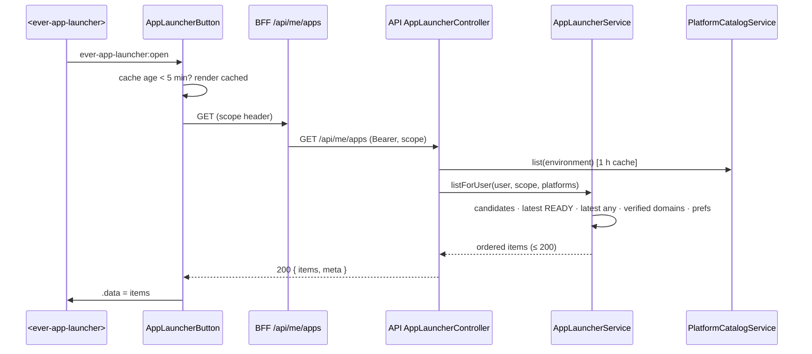
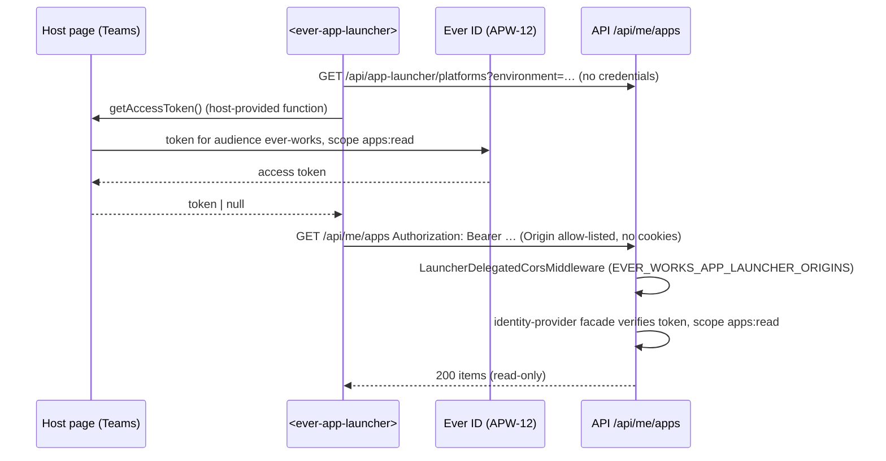

# Implementation Plan: App Launcher & Apps registry API

> Translates [`spec.md`](./spec.md) into architecture and tech choices. The plan owns
> implementation detail; the spec owns behaviour. **Every path below that is described as existing
> was opened in the worktree before it was written down**; paths marked **new** do not exist yet.

**Epic ID**: `APW-11-app-launcher`
**Spec**: [`./spec.md`](./spec.md) · **Tasks**: [`./tasks.md`](./tasks.md)
**Status**: `Draft`
**Last updated**: 2026-09-17
**Contracts owned** ([CONTRACTS.md](../CONTRACTS.md)): entity `AppLauncherPreference` (table
`app_launcher_preferences`) · `GET /api/me/apps` · `PUT /api/me/apps/preferences` · delegated scope
`apps:read` · flag `app-launcher` · Activity events `app.launcher.exposed`, `app.launcher.hidden`.
Added by this epic (rows added to CONTRACTS.md in the same PR): column `works.appLauncherExposed`,
public route `GET /api/app-launcher/platforms`, env `EVER_WORKS_APP_LAUNCHER_ENABLED`,
`EVER_WORKS_PLATFORM_CATALOG_REPO`, `EVER_WORKS_PLATFORM_CATALOG_REF`, `EVER_WORKS_PLATFORM_CATALOG_ENV`, `EVER_WORKS_PLATFORM_CATALOG_SELF_ID`,
`EVER_WORKS_APP_LAUNCHER_ORIGINS`, catalog repository `ever-works/platforms`.
**Program audit resolutions applied** ([CONTRACTS.md §0](../CONTRACTS.md)): R-1 (shared types in
`packages/contracts/src/apps/app-launcher.ts`), R-2 (Activity `actionType` `app_launcher`, dotted `action`), R-19
(`authMethod` already exists; APW-12 appends `'ever-id-delegated'` and admits it only on `@DelegatedRead` routes),
R-22 (no suite under `apps/api/test/`; this epic owns `apps/web/e2e/flow-app-launcher-apps.spec.ts`).

---

## 1. Current state in the codebase

### 1.1 What ships today

| Layer            | File                                                                                                                                                       | What it does                                                                                                                                                                                                                                                                                                              |
| ---------------- | ---------------------------------------------------------------------------------------------------------------------------------------------------------- | ------------------------------------------------------------------------------------------------------------------------------------------------------------------------------------------------------------------------------------------------------------------------------------------------------------------------- |
| Web shell        | `apps/web/src/components/dashboard/DashboardHeader.tsx`                                                                                                    | Header. Left: sidebar button (`xl:hidden`), `<WorkSwitcher />` (line 77), onboarding badge. Middle: `<CommandPaletteTrigger />` (line 107). Right cluster (line 109): `WhatsNewButton` → `NotificationDropdown` → `ThemeToggle` → Help (`data-testid="header-help-button"`, lines 135–149). Namespace `dashboard.header`. |
| Web shell        | `apps/web/src/app/[locale]/(dashboard)/layout.tsx` → `layout-client.tsx`                                                                                   | Server layout reads the user from the cookie and renders `DashboardLayoutClient`, which mounts `DashboardSidebar` (~505) and `DashboardHeader` (~618) with props `user`, `onMenuClick`, `isSidebarOpen`, `onHelpClick`, `onboardingBadge`, `whatsNew`.                                                                    |
| Switchers        | `apps/web/src/components/layout/WorkspaceSwitcher.tsx`                                                                                                     | Organization switcher, mounted at the top of the **sidebar** (`DashboardSidebar.tsx:262`), Headless UI `Menu` via `@/components/ui/dropdown-menu`, namespace `organizations.switcher`, switches with `POST /api/users/me/scope`.                                                                                          |
| Switchers        | `apps/web/src/components/dashboard/WorkSwitcher.tsx`                                                                                                       | Work switcher, Headless UI `Combobox`, renders only on Work detail routes, namespace `dashboard.works`.                                                                                                                                                                                                                   |
| UI primitive     | `apps/web/src/components/ui/dropdown-menu.tsx`                                                                                                             | Headless UI `Menu` wrapper; forwards `aria-label` to the trigger.                                                                                                                                                                                                                                                         |
| Palette          | `apps/web/src/components/command-palette/registry/commands.ts`, `registry/types.ts`                                                                        | `PALETTE_COMMANDS` — code, not data. `PaletteCommandContext` carries `navigate`, `openHelp`, `toggleTheme`, `switchOrganization`, … Labels from `dashboard.commandPalette.commands.*`, aliases from `dashboard.commandPalette.commandAliases.*`.                                                                          |
| Flags (web)      | `apps/web/src/lib/feature-flags/work-kinds.ts`                                                                                                             | `server-only`, `posthog-node` `isFeatureEnabled(key, distinctId)` with a 1,500 ms timeout; **fails open** (off only when strictly `false`). Flag names like `works-blog`.                                                                                                                                                 |
| Flags (API)      | `apps/api/src/fleet/guards/fleet-enabled.guard.ts`, `packages/agent/src/config/index.ts:549`                                                               | Env booleans; the guard answers 404 when the feature is off.                                                                                                                                                                                                                                                              |
| Public cfg       | `apps/api/src/api.controller.ts:101–106`                                                                                                                   | Public config exposes `features.{subscriptionsEnabled, magicLinkEnabled, anonymousAuthEnabled, emailVerificationRequired}`.                                                                                                                                                                                               |
| Auth             | `apps/api/src/auth/guards/auth-session.guard.ts`, `auth/decorators/public.decorator.ts`, `auth/decorators/user.decorator.ts`                               | Global `AuthSessionGuard` (API key or session); `@Public()` short-circuits; `@CurrentUser()` → `AuthenticatedUser`. Since AW-24 (after authoring) the guard stamps `AuthenticatedUser.authMethod` (`'session'` / `'api-key'`); APW-12 appends `'ever-id-delegated'`.                                                      |
| `/api/me/*`      | `apps/api/src/work-agent/work-agent.controller.ts`                                                                                                         | Precedent for a `api/me/<feature>` controller with `GET`/`PUT preferences`.                                                                                                                                                                                                                                               |
| Scope            | `apps/api/src/scope/scope-context.service.ts`, `scope-context.types.ts`                                                                                    | `ScopeContextService.getScope()` → `{ tenantId, organizationId }` (null organization = personal scope). Used by `apps/api/src/missions/missions.controller.ts`.                                                                                                                                                           |
| CORS             | `apps/api/src/main.ts:168–197`, `apps/api/src/cors-validation.ts`                                                                                          | One global allow-list from `ALLOWED_ORIGINS`, `credentials: true`, origin echoed only when allow-listed.                                                                                                                                                                                                                  |
| Work             | `packages/agent/src/entities/work.entity.ts`                                                                                                               | `kind`, `status` (`draft`/`active`/`registered`/`archived`), `deployProvider`, `website`, `managedSubdomain` (line 768), `organizationId`, `tenantId`, relations `customDomains` (310), `deployments` (313). **No launcher field.**                                                                                       |
| Deployments      | `packages/agent/src/entities/work-deployment.entity.ts`, `database/repositories/work-deployment.repository.ts`                                             | `environment` (`production`/`preview`), `state` (terminal `READY`/`ERROR`/`CANCELED`/`TIMEOUT`), `website` (the URL). `findLatestForWorks(workIds, environment)` (line 48).                                                                                                                                               |
| Domains          | `packages/agent/src/entities/work-custom-domain.entity.ts`, `database/repositories/work-custom-domain.repository.ts`                                       | `domain`, `environment`, `verified`, `provider`, `createdAt`. **No primary/active flag.**                                                                                                                                                                                                                                 |
| Access           | `packages/agent/src/services/work-query.service.ts:56–100`, `database/repositories/work-member.repository.ts`                                              | `workMemberRepository.getAccessibleWorkIds(userId)` + `workRepository.findAllAccessible(...)`; latest production deployments per Work in one call.                                                                                                                                                                        |
| Update Work      | `apps/api/src/works/works.controller.ts:489–528`, `packages/agent/src/dto/update-work.dto.ts`, `packages/agent/src/services/work-lifecycle.service.ts:851` | `PUT`/`PATCH /api/works/:id` → `updateWork` → `ownershipService.ensureCanEdit`. Emits `work.updated` Activity.                                                                                                                                                                                                            |
| Work settings UI | `apps/web/src/app/[locale]/(dashboard)/works/[id]/settings/page.tsx`, `apps/web/src/components/works/detail/settings/GeneralSettings.tsx`                  | `SettingsForm` renders `GeneralSettings` (card with a form using `useSettings()` → `handleUpdate`, `formData`, `setFormData`).                                                                                                                                                                                            |
| Settings nav     | `apps/web/src/app/[locale]/(dashboard)/settings/settings-layout-client.tsx`, `apps/web/src/lib/constants.ts:254–290`                                       | Tab list with `href: ${baseSettingsPath}/<page>`; `ROUTES.DASHBOARD_SETTINGS_*`.                                                                                                                                                                                                                                          |
| BFF              | `apps/web/src/app/api/usage/costs/[section]/route.ts`, `apps/web/src/lib/api/browser-api.ts`                                                               | Proxy pattern: allow-listed params, auth cookie forwarded as Bearer; browser calls must carry the workspace scope header (`applyBrowserWorkspaceScope`).                                                                                                                                                                  |
| Catalog          | `apps/api/src/works/works-template-catalog.service.ts`, `docs/specs/decisions/014-no-hardcoded-catalogs.md`                                                | ADR-014 reader: raw `manifest.json` from `https://raw.githubusercontent.com/<repo>/<ref>/`, 8 s timeout, 1 h cache (`CACHE_TTL_MS`), 30 s on failure (`EMPTY_CACHE_TTL_MS`), `SAFE_REPO_RE = /^ever-works\/[a-z0-9-]+$/`, env `EVER_WORKS_WORKS_REPO`/`_REF`.                                                             |
| Activity         | `packages/agent/src/activity-log/activity-log.service.ts:104`, `packages/agent/src/entities/activity-log.types.ts`                                         | `log({ userId, workId, actionType, action, status, summary, metadata })`; `ActivityActionType` enum.                                                                                                                                                                                                                      |
| Telemetry        | `apps/web/src/lib/help/help-telemetry.ts`                                                                                                                  | Closed union of events + `capture…Event()`; no-op without `NEXT_PUBLIC_POSTHOG_KEY`.                                                                                                                                                                                                                                      |
| Packages         | `packages/contracts/package.json`, `packages/plugin`                                                                                                       | Publishable packages build with **tsup**. No custom element exists anywhere in the repository.                                                                                                                                                                                                                            |
| Migrations       | `apps/api/src/migrations/`                                                                                                                                 | Newest on `develop` @ `ee45946e5`: `1791240000000-AddSafetyRailsCore.ts` (`1791200100000-CreateOnboardingChecklists.ts` when authored).                                                                                                                                                                                   |

### 1.2 The exact blockers

- **No launcher surface, no preference store.** There is no generic user-preferences table; the
  nearest (`user-template-preference.entity.ts`, `work-agent-preference.entity.ts`) are single-purpose.
- **"Live" is not a single fact.** A Work's address can come from three places (verified custom domain,
  `managedSubdomain`, deployment `website`) and deployment health from `work_deployments.state`. Nothing
  resolves them into one address; `findLatestForWorks` returns the latest row, not the latest `READY` one.
- **Custom domains have no primary.** The only stable tie-breaker is `createdAt` (spec FR-16).
- **The global CORS policy is credentialed and single-list.** P2's delegated read must be callable from
  other Ever platforms **without** cookies, so it cannot ride the existing `ALLOWED_ORIGINS` list.
- **Web flags fail open.** Copying `work-kinds.ts` verbatim would ship the launcher to everyone on a
  PostHog timeout; spec FR-54 requires fail-closed.

### 1.3 Reuse, do not rebuild

- ADR-014 catalog reading — copy the **shape** of `works-template-catalog.service.ts` (timeout, cache
  TTLs, repo regex, ref warning), not its code path; the two catalogs have different schemas.
- `getAccessibleWorkIds` + scope filtering for "Works this person can view".
- `ensureCanEdit` in `updateWork` for the exposure permission (spec FR-20).
- `FleetEnabledGuard`'s 404-when-off posture for the registry (spec S17).
- Headless UI is **not** used for the panel: the panel is a web component (D14, spec FR-45).

---

## 2. Architecture

### 2.1 Decision: one web component from P1

Program decision **D14** says the launcher's first phase is a framework-neutral web component. The
epic brief scopes P1 to Ever Works only. Both hold if P1 **builds the component and mounts it in Ever
Works' header**, and P2 **publishes** it and adds delegated, cross-origin reads.

| Option                                                                | Verdict                                                                                          |
| --------------------------------------------------------------------- | ------------------------------------------------------------------------------------------------ |
| A. React panel in `apps/web` for P1, rewrite as a web component in P2 | Rejected: two implementations of the same keyboard model, copy and ordering drift apart.         |
| **B. Web component (Lit) in `packages/app-launcher`, React wrapper**  | **Chosen.** One implementation; P2 is packaging, auth and CORS.                                  |
| C. Vanilla custom element, no library                                 | Rejected: hand-built templating invites unescaped interpolation of catalog strings (spec FR-14). |

Lit (BSD-3-Clause, ~6 KB compressed) escapes interpolated values by default and fits the 30 KB budget
(spec FR-46).

### 2.2 Components

```
 ┌──────────────────────────── apps/web ─────────────────────────────┐
 │ layout.tsx (RSC) ─ isAppLauncherEnabled() ─► layout-client.tsx     │
 │                                                  │                 │
 │ DashboardHeader ─► AppLauncherButton (React, client, NEW)          │
 │                     │  • lazy-imports @ever-works/app-launcher     │
 │                     │  • sets .data / .strings / .current props    │
 │                     │  • listens: item-activate, manage, open      │
 │                     ▼                                              │
 │               <ever-app-launcher> (Lit, shadow DOM)                │
 │                     │ data via BFF                                 │
 │   app/api/me/apps/route.ts (NEW) ──► API GET /api/me/apps          │
 │   settings/app-launcher/page.tsx (NEW) ──► GET ?includeHidden=true │
 │   actions/settings/app-launcher.ts (NEW) ──► PUT …/preferences     │
 │   GeneralSettings ─► AppLauncherExposureSetting (NEW) ─► PUT works │
 └────────────────────────────────────────────────────────────────────┘
 ┌──────────────────────────── apps/api ─────────────────────────────┐
 │ app-launcher/ (NEW module)                                         │
 │   AppLauncherController      api/me/apps           (session)       │
 │   AppLauncherPlatformsController api/app-launcher/platforms (@Public)│
 │   PlatformCatalogService     ADR-014 reader of ever-works/platforms │
 │   AppLauncherEnabledGuard    404 when EVER_WORKS_APP_LAUNCHER_ENABLED≠true │
 └───────────────┬────────────────────────────────────────────────────┘
                 ▼
 ┌──────────────────────── packages/agent ───────────────────────────┐
 │ app-launcher/ (NEW)                                                 │
 │   AppLauncherService   merge · eligibility · ordering · save        │
 │   launcher-address.ts  pure: domains + subdomain + deployment → URL │
 │   launcher-order.ts    pure: pins · user order · defaults           │
 │ repositories: AppLauncherPreferenceRepository (NEW),                │
 │   WorkRepository.findLauncherCandidates (NEW method),               │
 │   WorkDeploymentRepository.findLatestReadyForWorks (NEW method),    │
 │   WorkCustomDomainRepository.findVerifiedProductionForWorks (NEW)   │
 └────────────────────────────────────────────────────────────────────┘
```

### 2.3 Request flow — P1 panel open



### 2.4 Request flow — P2 delegated read



---

## 3. Data model

**Workspace backup (Resolution R-25).** `AppLauncherPreference` exports in the account section as `data/account/app-launcher-preferences.jsonl`, scoped by user; `works.appLauncherExposed` rides `works.jsonl` ([tasks](./tasks.md) T30).

### 3.1 `works.appLauncherExposed` — one additive column

| Column               | Type           | Default | Why                                                                                                              |
| -------------------- | -------------- | ------- | ---------------------------------------------------------------------------------------------------------------- |
| `appLauncherExposed` | `boolean NULL` | `NULL`  | `NULL` = kind default (`true` for `app`, `false` otherwise — spec FR-19). An explicit value always wins (FR-19). |

Declared at the end of `packages/agent/src/entities/work.entity.ts` as
`@Column({ type: 'boolean', nullable: true }) appLauncherExposed?: boolean | null;` — explicit `type`
for the same reason the neighbouring `managedSubdomain` declares one (nullable union types reflect as
`Object`).

### 3.2 `app_launcher_preferences` — the new table

```
app_launcher_preferences
├── id          uuid          PK
├── userId      uuid          NOT NULL   (FK user.id, ON DELETE CASCADE)
├── scopeKey    varchar(40)   NOT NULL   'global' | 'personal' | <organizationId>
├── itemKey     varchar(64)   NOT NULL   'platform:<catalogId>' | 'work:<uuid>'
├── visible     boolean       NOT NULL   DEFAULT true
├── pinned      boolean       NOT NULL   DEFAULT false
├── pinOrder    smallint      NULL       0..5 when pinned
├── sortOrder   integer       NULL       0..9999
├── createdAt   timestamptz   NOT NULL
└── updatedAt   timestamptz   NOT NULL

uq_app_launcher_prefs_user_scope_item  UNIQUE (userId, scopeKey, itemKey)
idx_app_launcher_prefs_user_scope              (userId, scopeKey)
```

- **`scopeKey` instead of a nullable `organizationId`**: uniqueness over a nullable column is not
  portable (Postgres treats NULLs as distinct; SQLite dev/test databases do too). `global` holds Ever
  apps rows (spec FR-24: personal across Organizations); `personal` holds personal-scope Work rows.
- **No `tenantId`/`organizationId` stamp columns.** `apps/api/src/scope/scope-stamping.subscriber.ts`
  would stamp the active Organization onto `global` rows, which would be wrong. Access is by `userId`
  only (spec FR-53).
- **No FK to `works`.** Item keys are polymorphic; rows for deleted/inaccessible Works are ignored on
  read (FR-28) and are the first pruned when a person exceeds 500 rows.
- **No names, no URLs** are stored (spec §5.2).

Entity `packages/agent/src/entities/app-launcher-preference.entity.ts` (**new**), registered in the four
places the entity drift checks enforce: `packages/agent/src/entities/index.ts`,
`packages/agent/src/database/_entity-names.ts`, `packages/agent/src/database/_entities-inventory.ts`, and
`TypeOrmModule.forFeature` in the new `packages/agent/src/app-launcher/app-launcher.module.ts`.

### 3.3 Shared types

`packages/contracts/src/apps/app-launcher.ts` (**new**, Resolution R-1), re-exported from APW-03's barrel
`packages/contracts/src/apps/index.ts` and therefore from the package root `@ever-works/contracts`:

```ts
export const APP_LAUNCHER_ENVIRONMENTS = ['production', 'stage', 'develop'] as const;
export type AppLauncherEnvironment = (typeof APP_LAUNCHER_ENVIRONMENTS)[number];

export type AppLauncherItemKind = 'platform' | 'work';
export type AppLauncherSection = 'pinned' | 'platforms' | 'works';
export type AppLauncherWorkChip = 'deploying' | 'lastDeployFailed';
export type AppLauncherManageState = 'listed' | 'notLive' | 'exposureOff';

export interface AppLauncherItem {
	key: string; // 'platform:ever-gauzy' | 'work:<uuid>'
	kind: AppLauncherItemKind;
	section: AppLauncherSection;
	name: string; // ≤ 100
	description?: string; // platforms only, ≤ 80
	iconDataUri?: string; // data:image/svg+xml;base64,… | data:image/png;base64,…  ≤ 16 KB
	url: string | null; // https; null only when manageState !== 'listed'
	host: string | null;
	current?: boolean; // "You're here"
	status?: 'available' | 'beta'; // platforms
	workKind?: string; // works
	chip?: AppLauncherWorkChip;
	visible: boolean;
	pinned: boolean;
	pinOrder: number | null;
	order: number;
	manageState: AppLauncherManageState;
}

export interface AppLauncherListResponse {
	items: AppLauncherItem[];
	meta: {
		environment: AppLauncherEnvironment;
		catalogVersion: string | null;
		catalogAvailable: boolean;
		scopeKey: string;
		worksTotal: number;
		truncated: boolean;
		pinLimit: 6;
	};
}

export interface AppLauncherPreferenceChange {
	key: string;
	visible?: boolean;
	pinned?: boolean;
	order?: number; // 0..9999
}

export const APP_LAUNCHER_PIN_LIMIT = 6;
export const APP_LAUNCHER_MAX_ITEMS_RESPONSE = 200;
export const APP_LAUNCHER_MAX_CHANGES_PER_SAVE = 200;
export const APP_LAUNCHER_MAX_PREFERENCE_ROWS = 500;
export const APP_LAUNCHER_PANEL_PLATFORMS_MAX = 12;
export const APP_LAUNCHER_PANEL_WORKS_MAX = 24;
export const APP_LAUNCHER_CATALOG_MAX_ENTRIES = 24;
export const APP_LAUNCHER_ICON_MAX_BYTES = 16_384;
export const APP_LAUNCHER_CLIENT_CACHE_MS = 5 * 60_000;
```

### 3.4 Migration (Constitution V, forward-only)

`apps/api/src/migrations/1792110000000-CreateAppLauncherPreferences.ts` — APW-11 slot 00 of the program
block (README §7 rule 6), above `1791240000000-AddSafetyRailsCore.ts` (newest on `ee45946e5`); re-stamp before
merge if `develop` moved past it.

`up()`: `ALTER TABLE "works" ADD COLUMN "appLauncherExposed" boolean NULL`; `CREATE TABLE
"app_launcher_preferences" (…)` with the unique and plain index. No backfill — `NULL` is the default by
design.
`down()`: drop the index, the table and the column; nothing pre-existing is touched.

---

## 4. API

All new routes live in **new** `apps/api/src/app-launcher/app-launcher.module.ts`, imported in
`apps/api/src/api.module.ts` next to `WorkAgentModule` (~line 196 on `ee45946e5`).

### 4.1 `GET /api/me/apps` (session)

`apps/api/src/app-launcher/app-launcher.controller.ts` — `@Controller('api/me/apps')`,
`@UseGuards(AppLauncherEnabledGuard)`, `@Throttle({ long: { limit: 60, ttl: 60_000 } })`.

| Query           | Type                | Validation              |
| --------------- | ------------------- | ----------------------- |
| `includeHidden` | `'true' \| 'false'` | default `false` (panel) |
| `limit`         | integer             | 1..200, default 200     |

Behaviour (`AppLauncherService.listForUser`):

1. `platforms = PlatformCatalogService.list(env)` (§5). On failure with no last-good copy →
   `catalogAvailable: false`, and the only platform item is the current platform, synthesised with key
   `platform:<EVER_WORKS_PLATFORM_CATALOG_SELF_ID>` and the name from `config.branding.appName()`
   (read by `apps/api/src/api.controller.ts:95`) and no icon. The key is the same one the catalog entry
   uses, so pins survive an outage; no catalog content lives in code (ADR-014).
2. `memberWorkIds = workMemberRepository.getAccessibleWorkIds(userId)`;
   `candidates = workRepository.findLauncherCandidates({ userId, memberWorkIds, organizationId: scope.organizationId, limit: 500 })`
   — creator-or-member, `status <> 'archived'`, `organizationId = :org` (or `IS NULL` for personal),
   ordered `updatedAt DESC`.
3. In one `Promise.all`: `findLatestForWorks(ids, PRODUCTION)` (existing) for chips,
   `findLatestReadyForWorks(ids, PRODUCTION)` (**new**, `state = 'READY'`) for liveness and fallback URL,
   `findVerifiedProductionForWorks(ids)` (**new**, `verified = true AND environment = 'production'`,
   `ORDER BY createdAt ASC`), `preferenceRepository.findForUser(userId, ['global', scopeKey])`.
4. `resolveLauncherAddress(work, domains, latestReady, managedRoot)` (pure, §4.6).
5. Exposure: `work.appLauncherExposed ?? work.kind === 'app'`.
6. `orderLauncherItems(...)` (pure, spec FR-26); cap to `limit`; `truncated` when capped.

Panel responses (`includeHidden=false`) contain only `manageState: 'listed'` and `visible: true` items.

### 4.2 `PUT /api/me/apps/preferences` (session)

Same controller, `@Throttle({ long: { limit: 30, ttl: 60_000 } })`. Body `SaveAppLauncherPreferencesDto`
(**new**, `apps/api/src/app-launcher/dto/app-launcher.dto.ts`):

```ts
{ changes: AppLauncherPreferenceChange[] }   // 1..200 entries
// key: ^(platform:[a-z0-9-]{2,40}|work:[0-9a-f-]{36})$ · order: 0..9999
```

`AppLauncherService.savePreferences(userId, scope, changes)`:

1. Resolve the **eligible key set** = catalog ids + `platform:<selfId>` + candidate Work ids in scope (not
   only live ones — Manage apps edits not-live rows, spec S12).
2. Reject per item with reason `unknownItem` for any key outside the set (identical for nonexistent and
   inaccessible — spec S18). `platform:<selfId>` rejects `visible: false` with `cannotHideCurrent`.
3. In one transaction: load `global` + `scopeKey` rows, apply merge-patch per key, recompute pin
   orders, **refuse the whole save** with `422 { code: 'pinLimit', limit: 6 }` if pinned > 6 (FR-25).
4. Upsert with `ON CONFLICT (userId, scopeKey, itemKey) DO UPDATE` (last-write-wins per item — FR-29).
5. If the user now holds > 500 rows, delete the oldest-`updatedAt` rows whose item is not in the
   eligible set until ≤ 500.

Response `200 { saved: number, rejected: Array<{ key, reason }>, items: AppLauncherItem[] }` (items =
`includeHidden=true` list, so Manage apps re-renders without a second call).

### 4.3 `GET /api/app-launcher/platforms` (public)

`apps/api/src/app-launcher/app-launcher-platforms.controller.ts` — `@Public()`,
`@UseGuards(AppLauncherEnabledGuard)`, `@Throttle({ long: { limit: 120, ttl: 60_000 } })`,
`?environment=production|stage|develop` (default `EVER_WORKS_PLATFORM_CATALOG_ENV`). Response
`{ catalogVersion, environment, platforms: AppLauncherItem[] }` (kind `platform`, no preference fields
beyond defaults), header `Cache-Control: public, max-age=3600, stale-while-revalidate=600`, and
`Access-Control-Allow-Origin: *` without credentials (the payload is public catalog data).

### 4.4 Exposure on `PUT`/`PATCH /api/works/:id`

- `packages/agent/src/dto/update-work.dto.ts` — add optional
  `appLauncherExposed?: boolean | null` (`@IsOptional() @IsBoolean()` with `null` allowed = reset to
  kind default).
- `packages/agent/src/services/work-lifecycle.service.ts` `updateWork` (line 851, after
  `ensureCanEdit`) — when the field is present and differs from the stored value, persist it and log
  Activity: `actionType: ActivityActionType.APP_LAUNCHER` (`'app_launcher'`), `action: 'app.launcher.exposed'` or
  `'app.launcher.hidden'` (Resolution R-2), `metadata: { explicit: boolean }` — never the address (FR-21).
- `packages/agent/src/entities/activity-log.types.ts` — append one member `APP_LAUNCHER = 'app_launcher'`
  (varchar column; no migration).
- The Work detail payload built in `packages/agent/src/services/work-query.service.ts` gains
  `appLauncher: { exposed: boolean | null; effectiveExposed: boolean; live: boolean }` so the settings
  toggle renders disabled/read-only correctly (FR-20, FR-23) without another call.

### 4.5 Error contract

| Situation                                                          | Status | Body                                                                    |
| ------------------------------------------------------------------ | ------ | ----------------------------------------------------------------------- |
| Launcher switched off (`EVER_WORKS_APP_LAUNCHER_ENABLED ≠ 'true'`) | `404`  | Nest default not-found                                                  |
| > 200 changes, bad key shape, order out of range                   | `400`  | validation errors                                                       |
| Pin limit exceeded                                                 | `422`  | `{ code: 'pinLimit', limit: 6 }`                                        |
| Unknown / inaccessible item                                        | `200`  | `rejected: [{ key, reason: 'unknownItem' }]`                            |
| Hiding the current platform                                        | `200`  | `rejected: [{ key: 'platform:<selfId>', reason: 'cannotHideCurrent' }]` |
| Delegated token lacks `apps:read` (P2)                             | `403`  | `{ code: 'insufficientScope' }` (raised by APW-12's guard)              |
| Delegated token on `PUT` (P2)                                      | `401`  | plain unauthorized — no `@DelegatedRead` metadata                       |

### 4.6 Address resolution (pure)

`packages/agent/src/app-launcher/launcher-address.ts`:

```ts
export function resolveLauncherAddress(input: {
	verifiedProductionDomains: Array<{ domain: string; createdAt: Date }>; // ASC
	managedSubdomain: string | null;
	managedRoot: string | null; // EVER_WORKS_DOMAIN, or EVER_WORKS_APPS_DOMAIN for managed App Works (APW-06)
	latestReadyWebsite: string | null;
	allowHttpLocalhost: boolean; // NODE_ENV !== 'production'
}): { url: string; host: string } | null;
```

Order per spec FR-16; every candidate passes `toSafeLauncherUrl` — `new URL()`, scheme `https:` (or
`http:` for `localhost`/`127.0.0.1` when allowed), no userinfo, host ≤ 253 chars, path reset to `/`,
query and fragment dropped. `managedRoot` for App Works on the managed tier is read through an injectable
`ManagedHostRootResolver` token whose default returns `EVER_WORKS_DOMAIN`; APW-06 binds the App-aware
implementation — this epic never reads `EVER_WORKS_APPS_DOMAIN` itself.

### 4.7 P2 — delegated read and CORS

- **New** `apps/api/src/app-launcher/launcher-delegated-cors.middleware.ts`, applied in
  `AppLauncherModule.configure()` for `GET|OPTIONS /api/me/apps` and `/api/app-launcher/platforms`
  only. For an `Origin` in `EVER_WORKS_APP_LAUNCHER_ORIGINS` (≤ 50 exact `https://` origins, parsed and
  validated at boot; invalid entries fail boot in production like `cors-validation.ts`) it sets
  `Access-Control-Allow-Origin: <origin>`, `Vary: Origin`, `Access-Control-Allow-Headers: Authorization`,
  and **never** `Access-Control-Allow-Credentials`. Preflight answers `204`. Other origins get no CORS
  headers (the browser blocks the read — spec S22).
- **Token path — owned by APW-12, applied here.** APW-12 creates
  `apps/api/src/auth/decorators/delegated-read.decorator.ts` (`DelegatedRead(scope)` → metadata
  `DELEGATED_READ_SCOPE` + `NoTokenInQueryGuard`) and the `AuthSessionGuard` branch that, **only** for a
  handler carrying that metadata, verifies a three-segment non-`ew_` bearer through
  `IdentityProviderFacadeService.verifyAccessToken` (audience `ever-works`, scope `apps:read`) and sets
  `AuthenticatedUser.authMethod = 'ever-id-delegated'` (APW-12 plan §2, §5.3). This epic only puts
  `@DelegatedRead('apps:read')` on the `GET` list handler. The `PUT` handler has no such metadata, so the
  guard never verifies a delegated token there and answers `401` — delegated access cannot write (FR-49).
  Per Resolution R-19 this epic adds no `authMethod` field or value: `AuthenticatedUser.authMethod`
  (`'session' | 'api-key'`) already ships with AW-24, APW-12 appends only `'ever-id-delegated'`, and AW-24's
  `HumanActorGuard` (`apps/api/src/safety/guards/human-actor.guard.ts`, admits only `'session'`) refuses a delegated
  principal on every human-only route with no change.
- Delegated responses are identical to session responses for the same person and scope `global` +
  the person's personal scope (P2 does not choose an Organization; Organization-scoped Works are listed
  per Organization in a later iteration — spec §9).

---

## 5. Platform catalog

### 5.1 Repository `ever-works/platforms` (outside this monorepo, ADR-014)

```
platforms.json            the index (below)
icons/<id>.svg|png        ≤ 16 KB each
schema/platforms.schema.json
.github/workflows/validate.yml   schema + icon size + https-only + unique ids + ≤ 24 entries
README.md · CONTRIBUTING.md · LICENSE (MIT)
```

```json
{
	"schemaVersion": 1,
	"catalogVersion": "1.0.0",
	"platforms": [
		{
			"id": "ever-gauzy",
			"name": "Ever Gauzy",
			"description": "Work and time management for teams.",
			"icon": "icons/ever-gauzy.svg",
			"order": 20,
			"status": "available",
			"urls": { "production": "https://…", "stage": "https://…", "develop": "https://…" }
		}
	]
}
```

Addresses are data in that repository; none appear in this plan or in platform code.

### 5.2 `PlatformCatalogService` (**new**, `apps/api/src/app-launcher/platform-catalog.service.ts`)

- Env: `EVER_WORKS_PLATFORM_CATALOG_REPO` (default `ever-works/platforms`, must match
  `^ever-works\/[a-z0-9-]+$` — SSRF containment, same as `SAFE_REPO_RE`),
  `EVER_WORKS_PLATFORM_CATALOG_REF` (default `main`; warn when not a tag or 40-char SHA),
  `EVER_WORKS_PLATFORM_CATALOG_ENV` (default `production`), `EVER_WORKS_PLATFORM_CATALOG_SELF_ID`
  (default `ever-works` — the id marked `current`).
- Fetch `platforms.json` then each referenced icon from the raw host, 8 s timeout each, max 24 icons
  in parallel batches of 6.
- Validate with a zod schema in `apps/api/src/app-launcher/platform-catalog.schema.ts`: id regex,
  name ≤ 40, description ≤ 80, `order` 0..9999, status enum, each URL through `toSafeLauncherUrl`, icon
  path `^icons\/[a-z0-9-]+\.(svg|png)$`, icon bytes ≤ 16,384. SVG icons are additionally rejected when
  they contain `<script`, `on[a-z]+=`, `javascript:` or `<foreignObject` (defence in depth; ``
  rendering already prevents execution). Drop invalid entries individually; log `{ id, reason }`.
- Inline icons as base64 data URIs; cache `platform-catalog:<ref>` in `CACHE_MANAGER` for 3,600,000 ms
  (success) / 30,000 ms (failure), keeping a separate `platform-catalog:<ref>:last-good` entry with no
  TTL so a failed refresh serves the last good copy (spec FR-12, S10).

---

## 6. The web component — `packages/app-launcher` (**new**)

### 6.1 Package

`@ever-works/app-launcher`, `"private": true` in P1, ESM via **tsup**, tests with **Vitest** +
`happy-dom`, dependency `lit`. Files:

| File                       | Role                                                                                                                                                                      |
| -------------------------- | ------------------------------------------------------------------------------------------------------------------------------------------------------------------------- |
| `src/ever-app-launcher.ts` | `EverAppLauncher extends LitElement`, `customElements.define('ever-app-launcher', …)` guarded by `customElements.get`.                                                    |
| `src/grid-navigation.ts`   | Pure keyboard model: index + key + columns + count → next index; typeahead.                                                                                               |
| `src/safe-url.ts`          | Client-side re-check of `https` before `window.open` (belt and braces).                                                                                                   |
| `src/types.ts`             | `LauncherItem`, `LauncherStrings`, event detail types — mirrors `AppLauncherItem` without importing `@ever-works/contracts`, so P2 extraction has no monorepo dependency. |
| `src/strings.ts`           | Default English strings (the host overrides).                                                                                                                             |
| `src/styles.ts`            | Shadow-root CSS using `--ever-app-launcher-*` custom properties.                                                                                                          |
| `src/data-source.ts`       | P2 self-fetch mode (catalog URL, apps URL, `getAccessToken`).                                                                                                             |
| `src/stale-cache.ts`       | P2 `localStorage` last-good platform list, 7-day max age (spec FR-51).                                                                                                    |
| `scripts/check-size.mjs`   | Fails `test` when `dist/index.js` gzip > 30,720 bytes (spec FR-46).                                                                                                       |

### 6.2 Element API

| Kind      | Name                                                                     | Type / values                          | Notes                                                          |
| --------- | ------------------------------------------------------------------------ | -------------------------------------- | -------------------------------------------------------------- |
| attribute | `current`                                                                | catalog id                             | Marks **You're here**.                                         |
| attribute | `theme`                                                                  | `light \| dark \| auto`                | default `auto` (`prefers-color-scheme`).                       |
| attribute | `environment`                                                            | `production \| stage \| develop`       | P2 self-fetch only.                                            |
| attribute | `catalog-url`, `apps-url`                                                | URL                                    | P2 self-fetch only.                                            |
| attribute | `sign-in-available`                                                      | boolean                                | Shows the S6 **Sign in** button.                               |
| property  | `data`                                                                   | `{ items, meta } \| null`              | Host-fed mode (Ever Works P1). Setting it disables self-fetch. |
| property  | `strings`                                                                | `Partial<LauncherStrings>`             | Translations.                                                  |
| property  | `getAccessToken`                                                         | `() => Promise<string \| null>`        | P2.                                                            |
| property  | `loading`, `error`                                                       | boolean, `'catalog' \| 'apps' \| null` | Host-fed mode states.                                          |
| method    | `show()`, `hide()`                                                       | —                                      | Palette command uses `show()`.                                 |
| event     | `ever-app-launcher:open` / `:close`                                      | —                                      | `bubbles`, `composed`.                                         |
| event     | `ever-app-launcher:item-activate`                                        | `{ key, kind, url, position, pinned }` | **Cancelable**; default action opens the URL (FR-52).          |
| event     | `ever-app-launcher:manage` / `:sign-in` / `:retry`                       | `{ section? }`                         | Host navigates / signs in / refetches.                         |
| CSS       | `--ever-app-launcher-bg`, `-fg`, `-muted`, `-accent`, `-radius`, `-font` |                                        | No global style is emitted (FR-46).                            |

### 6.3 Behaviour details

- **Opening a tile**: `window.open(url, '_blank', 'noopener,noreferrer')` after `safe-url` re-check;
  the tile is an `<a href target="_blank" rel="noopener noreferrer" referrerpolicy="no-referrer">` so
  middle-click also works, with `click` intercepted only to dispatch the cancellable event first
  (spec FR-30, ACC-11-40).
- **ARIA**: trigger `<button aria-haspopup="menu" aria-expanded aria-controls>`; panel
  `role="menu"`; sections `role="group" aria-labelledby`; tiles `role="menuitem"` with roving
  `tabindex`. Focus trap between the grid and the footer link; `Esc` restores focus to the trigger.
  Columns are read from `ResizeObserver` (3 at ≥ 360 px panel width, else 2) and fed to
  `grid-navigation.ts` (FR-39/40).
- **Bottom sheet** under a 640 px host viewport via a media query inside the shadow root (FR-3).
- **No layout shift**: skeleton tiles use the same fixed tile height (88 px) as real tiles.

### 6.4 React wrapper in Ever Works

**New** `apps/web/src/components/app-launcher/AppLauncherButton.tsx` (client):

- Lazy-loads the element in `useEffect` (`import('@ever-works/app-launcher')`) so SSR never touches
  `customElements`.
- Owns a module-level cache `{ data, fetchedAt }` (5 min, FR-5/FR-6); on `:open` renders the cache
  immediately and refetches through `browserApiFetch('/api/me/apps')` when stale.
- Passes `strings` built from `useTranslations('dashboard.appLauncher')`.
- `:item-activate` → `captureAppLauncherEvent('app_launcher_item_opened', …)` (not cancelled);
  `:manage` → `router.push(ROUTES.DASHBOARD_SETTINGS_APP_LAUNCHER)`; `:retry` → refetch.
- Registers `openAppLauncher` on **new** `AppLauncherProvider` context so the palette command can call
  `element.show()`.

**New** BFF `apps/web/src/app/api/me/apps/route.ts` (`GET`, forwards `includeHidden` only), mirroring
`apps/web/src/app/api/usage/costs/[section]/route.ts` (cookie → Bearer, workspace scope header, param
allow-list).

---

## 7. Web integration

| Change                                                                                                                                                                                             | File                                                                                                                                                                  |
| -------------------------------------------------------------------------------------------------------------------------------------------------------------------------------------------------- | --------------------------------------------------------------------------------------------------------------------------------------------------------------------- |
| Flag helper, **fail-closed**: `isAppLauncherEnabled(distinctId)` = public config `features.appLauncherEnabled === true` **and** (PostHog unset **or** `isFeatureEnabled('app-launcher') === true`) | **new** `apps/web/src/lib/feature-flags/app-launcher.ts`                                                                                                              |
| Public config exposes `features.appLauncherEnabled`                                                                                                                                                | `apps/api/src/api.controller.ts` (features block, lines 101–106)                                                                                                      |
| Layout computes the flag once and passes `appLauncherEnabled`                                                                                                                                      | `apps/web/src/app/[locale]/(dashboard)/layout.tsx`, `layout-client.tsx`                                                                                               |
| Header renders `<AppLauncherButton />` after Help when enabled                                                                                                                                     | `apps/web/src/components/dashboard/DashboardHeader.tsx` (new optional prop `appLauncher?: boolean`)                                                                   |
| Palette command `openAppLauncher` (`available: ctx.openAppLauncher !== undefined`)                                                                                                                 | `apps/web/src/components/command-palette/registry/commands.ts`, `registry/types.ts` (optional `openAppLauncher?: () => void`), context wiring in `CommandPalette.tsx` |
| Settings route constant `DASHBOARD_SETTINGS_APP_LAUNCHER: '/settings/app-launcher'`                                                                                                                | `apps/web/src/lib/constants.ts`                                                                                                                                       |
| Settings nav tab (after `notifications`, only when enabled)                                                                                                                                        | `apps/web/src/app/[locale]/(dashboard)/settings/settings-layout-client.tsx`                                                                                           |
| Manage apps page (server) + client list                                                                                                                                                            | **new** `apps/web/src/app/[locale]/(dashboard)/settings/app-launcher/page.tsx`, **new** `apps/web/src/components/settings/AppLauncherSettings.tsx`                    |
| Server API client + actions                                                                                                                                                                        | **new** `apps/web/src/lib/api/app-launcher.ts` (server-only, `serverFetch`), **new** `apps/web/src/app/actions/settings/app-launcher.ts`                              |
| Work settings toggle                                                                                                                                                                               | **new** `apps/web/src/components/works/detail/settings/AppLauncherExposureSetting.tsx`, mounted in `GeneralSettings.tsx`                                              |
| Client telemetry (closed union, copy of the help pattern)                                                                                                                                          | **new** `apps/web/src/lib/app-launcher/app-launcher-telemetry.ts`                                                                                                     |

`AppLauncherSettings` saves through a 500 ms debounced batch (≤ 200 changes) and renders `Saving…` /
`Saved` / `Couldn't save. Try again.` (spec FR-27). Reordering uses Move up/down buttons plus
`Alt+↑/↓`; drag uses native HTML drag events on the row handle — no new drag library.

---

## 8. i18n

Paths are nested objects in `apps/web/messages/en.json`; every leaf is camelCase with no literal dot.
All 20 sibling locale files (`ar`, `bg`, `de`, `es`, `fr`, `he`, `hi`, `id`, `it`, `ja`, `ko`, `nl`,
`pl`, `pt`, `ru`, `th`, `tr`, `uk`, `vi`, `zh`) receive the same keys (README §7 rule 11).

```
dashboard.appLauncher.controlLabel          "App Launcher"
dashboard.appLauncher.controlTooltip        "Ever apps and your apps"
dashboard.appLauncher.panelTitle            "App Launcher"
dashboard.appLauncher.sectionPinned         "Pinned"
dashboard.appLauncher.sectionPlatforms      "Ever apps"
dashboard.appLauncher.sectionWorks          "Your apps"
dashboard.appLauncher.chipCurrent           "You're here"
dashboard.appLauncher.chipBeta              "Beta"
dashboard.appLauncher.chipDeploying         "Deploying"
dashboard.appLauncher.chipLastDeployFailed  "Last deploy failed"
dashboard.appLauncher.viewAll               "View all {count}"
dashboard.appLauncher.footerHelper          "Opens in a new tab. You may need to sign in."
dashboard.appLauncher.manageLink            "Manage apps"
dashboard.appLauncher.emptyWorks            "Apps you deploy show up here."
dashboard.appLauncher.emptyWorksCreateApp   "Create an App Work"
dashboard.appLauncher.emptyWorksGoToWorks   "Go to Works"
dashboard.appLauncher.allHidden             "You've hidden all your apps."
dashboard.appLauncher.catalogError          "Ever apps couldn't be loaded."
dashboard.appLauncher.worksError            "Your apps couldn't be loaded."
dashboard.appLauncher.retry                 "Try again"
dashboard.appLauncher.signInPrompt          "Sign in with Ever ID to see your apps here."   (P2)
dashboard.appLauncher.signIn                "Sign in"                                       (P2)
dashboard.appLauncher.manageInEverWorks     "Manage apps in Ever Works"                     (P2)

dashboard.settings.tabs.appLauncher                 "App Launcher"
dashboard.settings.appLauncher.intro                "Choose what the App Launcher shows you. Only you see these choices."
dashboard.settings.appLauncher.worksHeadingOrg      "Your apps in {organization}"
dashboard.settings.appLauncher.worksHeadingPersonal "Your apps"
dashboard.settings.appLauncher.columnShow           "Show"
dashboard.settings.appLauncher.columnPin            "Pin"
dashboard.settings.appLauncher.notLive              "Not live — no address"
dashboard.settings.appLauncher.exposureOff          "Hidden by the Work · Turn on in the Work's settings"
dashboard.settings.appLauncher.pinCounter           "{count} of 6 pins used"
dashboard.settings.appLauncher.pinLimit             "Six pins is the limit. Unpin one first."
dashboard.settings.appLauncher.moveUp               "Move up"
dashboard.settings.appLauncher.moveDown             "Move down"
dashboard.settings.appLauncher.saving               "Saving…"
dashboard.settings.appLauncher.saved                "Saved"
dashboard.settings.appLauncher.saveFailed           "Couldn't save. Try again."

dashboard.workDetail.settings.appLauncher.title           "Show in App Launcher"
dashboard.workDetail.settings.appLauncher.description     "Lists this Work's live address in members' App Launcher. It doesn't publish the site or give anyone access to it."
dashboard.workDetail.settings.appLauncher.disabledNotLive "Available once this Work has a live address."
dashboard.workDetail.settings.appLauncher.viewerReadOnly  "Only editors can change this."

dashboard.commandPalette.commands.openAppLauncher        "Open App Launcher"
dashboard.commandPalette.commandAliases.openAppLauncher  "launcher, apps, switch app"
```

A CI grep in T21 fails if any new value matches `/single sign-on|sso|one login|already signed in/i`
(spec G-09 note, ACC-11-33).

---

## 9. Telemetry and failure modes

### 9.1 Events

Web (PostHog through the new closed union; ids, enums and counts only):

| Event                            | Properties                                                           |
| -------------------------------- | -------------------------------------------------------------------- |
| `app_launcher_opened`            | `{ pinned, platforms, works, source: 'header' \| 'palette' }`        |
| `app_launcher_item_opened`       | `{ item_kind, catalog_id?, position, pinned }` — no Work id, no host |
| `app_launcher_preferences_saved` | `{ changes, pinned_total }`                                          |
| `app_launcher_exposure_changed`  | `{ direction: 'on' \| 'off' \| 'default', work_kind }`               |

API (structured logs, operational): `app_launcher.catalog.refreshed { entries, dropped, durationMs }`,
`app_launcher.item.omitted { reason: 'unsafeUrl' | 'invalidEntry' | 'overLimit' }` (FR-44).

### 9.2 Failure modes

| Failure                                         | Behaviour                                                         | Why                                          |
| ----------------------------------------------- | ----------------------------------------------------------------- | -------------------------------------------- |
| Catalog fetch fails, last-good exists           | Serve last-good, retry after 30 s                                 | FR-12, S10.                                  |
| Catalog fetch fails, none                       | `catalogAvailable: false`, only `platform:<selfId>`               | S9; no catalog content in code.              |
| One icon too large / unsafe                     | Entry kept without icon → initials tile                           | A bad icon should not remove a platform.     |
| Entry URL not https for this env                | Entry dropped, logged `unsafeUrl`                                 | FR-10, S16.                                  |
| PostHog timeout on flag                         | Launcher hidden                                                   | Fail-closed (FR-54), unlike `work-kinds.ts`. |
| Deployment table slow for 500 candidates        | Candidate cap 500, three batched queries                          | FR-33 latency.                               |
| Two saves race on one item                      | `ON CONFLICT DO UPDATE` last-write-wins                           | FR-29.                                       |
| Pin count race across tabs                      | Transaction re-counts after merge; loser gets `422 pinLimit`      | FR-25 as a hard limit.                       |
| Element import fails (chunk load error)         | Control renders disabled with the tooltip; no crash of the header | Header must never break (additive rule).     |
| P2 token verification unavailable (APW-12 down) | Treated as signed out                                             | FR-48; never falls back to cookies.          |

---

## 10. Test plan

### 10.1 Unit — agent package (Jest)

| File (**new**)                                                                                  | Covers                                                                                                                                                           |
| ----------------------------------------------------------------------------------------------- | ---------------------------------------------------------------------------------------------------------------------------------------------------------------- |
| `packages/agent/src/app-launcher/__tests__/launcher-address.spec.ts`                            | FR-16 order; earliest verified domain wins; second domain never moves the tile; `http` refused; localhost allowed only in dev; query/fragment/userinfo stripped. |
| `packages/agent/src/app-launcher/__tests__/launcher-order.spec.ts`                              | FR-26 table test: pins first by pinOrder; user order; catalog order; newest READY first.                                                                         |
| `packages/agent/src/app-launcher/__tests__/app-launcher.service.spec.ts`                        | Liveness (READY required, preview ignored); chips; exposure default by kind; explicit override; archived excluded; 200 cap + `truncated`; scope keys.            |
| `packages/agent/src/app-launcher/__tests__/app-launcher.save.spec.ts`                           | Merge-patch; `unknownItem` identical for missing vs inaccessible; `cannotHideCurrent`; pin limit refuses whole save; 500-row prune only prunes ineligible rows.  |
| `packages/agent/src/database/repositories/__tests__/app-launcher-preference.repository.spec.ts` | Unique `(userId, scopeKey, itemKey)`; upsert idempotency.                                                                                                        |
| `packages/agent/src/services/__tests__/work-lifecycle.app-launcher-exposure.spec.ts`            | Activity written once per real change, never on no-op, no address in metadata; viewer refused by `ensureCanEdit`.                                                |

### 10.2 Controller specs (Jest, `apps/api`)

**New** `apps/api/src/app-launcher/app-launcher.controller.spec.ts`,
`app-launcher-platforms.controller.spec.ts`, `platform-catalog.service.spec.ts`:
404 when off; throttle metadata (60/30/120 per minute); `includeHidden`; validation (201 changes → 400,
bad key → 400); `422 pinLimit`; public route has `@Public()` and cache header; catalog: 25th entry
dropped, `javascript:` dropped, oversize icon dropped, last-good served on failure, repo regex rejects
`evil/platforms`. P2 (`launcher-delegated-cors.middleware.spec.ts`): middleware sets ACAO only for allow-listed
origins and never ACAC; `PUT` with a delegated token → 401 (no `@DelegatedRead` metadata, §4.5).

**Registry latency (Resolution R-22 — replaces the former `apps/api/test/app-launcher.e2e-spec.ts`).** **New**
`apps/api/src/app-launcher/app-launcher.registry.integration.spec.ts` (Jest, picked up by `apps/api/jest.config.js`
`rootDir: src`) builds a Nest testing module with an in-memory `better-sqlite3` `TypeOrmModule.forRoot` over
`ENTITIES` with `synchronize: true` — the precedent is
`apps/api/src/ingest/github/github-check-intake.autoresume.integration.spec.ts` — seeds one user with 200 live Works
(each with a `READY` production deployment and a managed subdomain) plus 20 non-live ones, stubs only the catalog
fetch, and calls `AppLauncherController` 50 times: p95 < 300 ms and every response has ≤ 200 items with
`meta.truncated` correct (ACC-11-25).

### 10.3 Component (Vitest, `packages/app-launcher`)

`grid-navigation.spec.ts` (all keys, 2/3 columns, typeahead wrap), `ever-app-launcher.spec.ts` (render
sections, chips as text, cancellable activate, `Esc` restores focus, focus trap, no global style
insertion), `safe-url.spec.ts`, `stale-cache.spec.ts` (6 days served, 8 days not), size budget via
`scripts/check-size.mjs`.

### 10.4 Web unit (Vitest)

`AppLauncherButton.unit.spec.tsx` (lazy import, 5-min cache, telemetry payload without host),
`AppLauncherSettings.unit.spec.tsx` (debounce, pin counter, disabled 7th pin),
`AppLauncherExposureSetting.unit.spec.tsx` (disabled when not live, read-only viewer),
`app-launcher.unit.spec.ts` (fail-closed matrix), `registry.unit.spec.ts` extension (command present
only with `openAppLauncher`), `apps/web/src/lib/app-launcher/__tests__/app-launcher-messages.unit.spec.ts` (every
key of §8 present with a non-empty string in all 21 locale files, no dotted leaf; ACC-11-31), and
`apps/web/src/lib/app-launcher/__tests__/no-sso-claims.unit.spec.ts` (G-09).

### 10.5 e2e (Playwright, `apps/web/e2e/`)

| File (**new**)                                                                            | Golden path                                                                                                                                                                                                                                                                                                                                                                                                      |
| ----------------------------------------------------------------------------------------- | ---------------------------------------------------------------------------------------------------------------------------------------------------------------------------------------------------------------------------------------------------------------------------------------------------------------------------------------------------------------------------------------------------------------- |
| `flow-app-launcher-apps.spec.ts` (ACCEPTANCE E2E-12; owned by this epic, Resolution R-22) | Seed catalog fixture + one live App Work + one failed Work; open; sections/order/chips; tile opens popup with exact URL and `opener === null`; every request recorded through `page.on('request')` during open, save and tile activation has a URL with no `token`, `access_token`, `sessionToken`, `ew_live_` or session-cookie value — with a control that plants one to prove the check can fail (ACC-11-24). |
| `app-launcher-manage.spec.ts`                                                             | Pin, hide, reorder; reload; second browser context same result; 7th pin refused.                                                                                                                                                                                                                                                                                                                                 |
| `app-launcher-exposure.spec.ts`                                                           | Editor toggles a directory Work on; second member sees it; viewer sees read-only; Activity entry.                                                                                                                                                                                                                                                                                                                |
| `app-launcher-keyboard-a11y.spec.ts`                                                      | §6.6 keyboard table; axe over panel and settings page.                                                                                                                                                                                                                                                                                                                                                           |
| `app-launcher-flag-off.spec.ts`                                                           | Flag off: no control, no palette command, `/settings/app-launcher` 404, API 404.                                                                                                                                                                                                                                                                                                                                 |
| `app-launcher-cross-framework.spec.ts` (P2)                                               | Static Angular, React and Solid fixture pages under `packages/app-launcher/fixtures/` render the element; no style leak; signed-out state.                                                                                                                                                                                                                                                                       |

Existing specs that must pass unchanged: `apps/web/e2e/command-palette.spec.ts`,
`apps/web/e2e/flow-org-settings-persistence.spec.ts`, the Work settings specs.

---

## 11. Phasing

### P1 — Wave 1: the launcher inside Ever Works (spec FR-1…FR-44, FR-53, FR-54)

Migration, entity, repositories, `AppLauncherService`, catalog service + `ever-works/platforms`
repository, `GET /api/me/apps`, `PUT /api/me/apps/preferences`, `GET /api/app-launcher/platforms`,
exposure on `PUT /api/works/:id`, `packages/app-launcher` (host-fed mode only), header, palette, Manage
apps page, Work settings toggle, i18n, telemetry, tests. **Ships value alone.** Depends on nothing:
before APW-01 there are no App Works, so only explicitly exposed Works appear.

### P2 — Wave 3: the launcher inside other Ever platforms (spec FR-45…FR-52)

Self-fetch mode, `getAccessToken`, stale cache, delegated read (`@DelegatedRead`), CORS middleware and
`EVER_WORKS_APP_LAUNCHER_ORIGINS`, cross-framework fixtures, extraction to the owner-chosen public
repository and npm publication (README open question 7). **Depends on** APW-12 (token issuance and
verification facade) and APW-06 P2 (managed App Work address root binding).

---

## 12. Constitution compliance checklist

- [x] **I — Plugin-first.** No external integration is added. P2 token verification goes through
      APW-12's identity-provider facade, never an IdP SDK.
- [x] **II — No hard-coded plugin ids.** None referenced.
- [x] **III — Source of truth.** Launcher arrangement is platform metadata about a person, not Work
      content; nothing moves out of a user repository.
- [x] **IV — Job runtime.** No background work: the catalog refresh is request-driven with caching.
- [x] **V — Forward-only migration.** One migration: one nullable column, one table, two indexes; `down()`
      drops only those.
- [x] **VI — Tests.** 6 agent unit specs, 4 controller/service specs plus the registry integration spec, 4
      component specs, 7 web unit specs, 6 e2e specs (§10); none under `apps/api/test/` (Resolution R-22).
- [x] **VII — Secrets.** No secret is stored. Tokens never enter URLs (FR-31); delegated tokens are
      header-only and never logged.
- [x] **VIII — Plugin counts.** Untouched.
- [x] **IX — Behaviour-first spec.** `spec.md` names no class, file, route or column.
- [x] **X — Backwards compatibility.** `UpdateWorkDto` gains an optional field; the Work payload gains an
      additive `appLauncher` object; no existing route or field changes.
- [x] **Program rule #10 — public hygiene.** No platform address, internal host or finding appears; the
      catalog holds addresses as data in its own repository.
- [x] **Program rule #11 — i18n.** Keys in all 21 locale files.
- [x] **G-09.** CI grep in T21 blocks sign-on wording.
- [x] **Program audit resolutions.** R-1 (§3.3), R-2 (§4.4), R-19 (§4.7), R-22 (§10.2, §10.5).

### Known gaps carried forward

- P2 lists Works from the person's **personal** scope plus `global` pins only; Organization-scoped Works
  across platforms need an Organization choice that other platforms do not have yet.
- Launcher addresses are not probed; **Last deploy failed** reflects deployment records only (spec §7).
- `app.launcher.exposed` / `app.launcher.hidden` are written for the **Work-level** setting only. A
  person's own hide/show is not Activity, because every member of a Work reads its Activity. ACCEPTANCE.md
  E2E-12 asserts those events "recorded" after hiding and pinning; its test must toggle the Work setting to
  produce them — flagged to the ACCEPTANCE owner rather than changed there.
- If `EVER_WORKS_APPS_DOMAIN` (APW-06) is unset, managed App Works fall back to the deployment-reported
  address — correct but possibly a load-balancer host until APW-06 P2 binds `ManagedHostRootResolver`.
