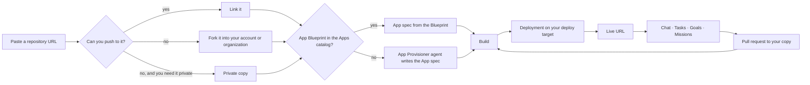

<!--
  DRAFT — planned feature (program `app-works`, docs/specs/features/app-works/).
  Not published: do not add to apps/docs/sidebarsPlatform.ts until APW-01…APW-08 P1 ship and
  ACCEPTANCE.md ACC-E2E-01…07 and 11 are green on develop. When it ships, move this file to
  docs/features/app-works.md, fix relative links, add a row to docs/features/index.md
  ("Work types & templates"), and register it after `features/work-kinds` in the sidebar.
  Until APW-12 (Ever ID) ships in production, no copy here may claim single sign-on (launch-parity G-09).
-->

# App Works — run and evolve any repository

:::note Status
**Planned.** This page describes App Works as specified. Nothing on it is available yet.
:::

An **App Work** is a Work whose code is a repository you choose — any repository on GitHub. Ever Works
takes a copy of it for you, works out how to build and run it, runs it where you want, and from then on
your agents keep changing it for you: new features, fixes, or a whole product of your own built on top.

:::note Where to find it
**New → App**, or **Works → New Work → App** (`/works/new?kind=app`).
:::

## How it works



1. **Paste a repository URL.** Ever Works shows what it found before anything happens: who owns the
   repository, its license, whether a ready-made **App Blueprint** exists, and what it will do next.
2. **Choose how to take it.**
    - **Link** — you can already push to the repository, so Ever Works uses it directly.
    - **Fork** — Ever Works forks it into your GitHub account or one of your organizations. A fork of a
      public repository is always public on GitHub. A fork keeps the connection to the original project,
      so you can stay in sync with it and propose changes back.
    - **Private copy** — a private duplicate. It cannot propose changes back to the original project.
3. **Ever Works works out how to run it.** If the Apps catalog has an **App Blueprint** for the project,
   its **App spec** is added to your copy. Otherwise the **App Provisioner** agent studies the repository and
   opens a pull request that adds the App spec, after proving it builds, boots and passes its smoke tests.
   If it needs something only you can provide, it asks you in **My Decisions**.
4. **Pick where it runs** — the **deploy target**:
    - **None** — don't deploy yet. You can still evolve the software; builds still prove it compiles.
    - **Your cluster** — connect your own Kubernetes cluster.
    - **Ever Works Apps** — hosting managed by Ever Works. Available later, starting with verified App
      Blueprints.
5. **Use it.** Your app is live on a subdomain and on any custom domain you add. Its **Activity** shows every
   build, deployment, smoke test and change.
6. **Evolve it.** Ask for a change in chat, create a Task, set a Goal, or start a Mission such as "Build my
   own scheduling product for my clinic on top of this app". Agents work on a branch, run the checks your
   App spec declares, and open a pull request. When it is merged, Ever Works builds and redeploys, and the
   Task closes once the change is live.

## The App spec

Everything Ever Works needs to build and run your app lives in your repository, in the `spec` block of
`.works/works.yml`. You can edit it by hand; agents change it through pull requests like any other file.
It declares how to build the image, the components to run (for example `web` and `worker`), the databases
and other dependencies the app needs, every environment variable (generated secrets, values derived from
your domain or database, values you provide), jobs such as migrations, the app's own scheduled calls,
health checks and smoke tests, and the checks agents must pass before proposing a change.

```yaml
version: 2
kind: app
spec:
    source:
        relation: fork
        upstream: { repo: example/scheduler, defaultBranch: main }
        branch: main
    build: { strategy: dockerfile, dockerfile: Dockerfile }
    components:
        - name: web
          role: web
          port: 3000
          probes: { readiness: { http: /healthz } }
    dependencies:
        postgres: { version: '16' }
    env:
        - { name: DATABASE_URL, secret: true, from: deps.postgres.url }
        - { name: APP_URL, from: domains.primary.url }
        - { name: SESSION_SECRET, secret: true, generate: { kind: hex, bytes: 32, rotate: never } }
    smoke:
        - { name: home, http: { method: GET, path: / }, expect: { status: [200] } }
    checks:
        - { name: unit, command: 'npm test', required: true }
```

The full field reference is the [App spec schema](../APW-03-app-spec-and-catalog/schema.md).

## Staying in sync with the original project

For a fork, **Upstream sync** runs on the schedule in your App spec (weekly by default) and on demand from the
**Upstream** tab. When upstream changes merge cleanly they arrive as a pull request you can review; a conflict
never resolves itself — it becomes a Task for your agents, and you stay in control of what lands.

## Proposing changes back

When a change in your fork would help everyone, open the Task and choose **Propose upstream**. An agent
prepares a clean branch against the original project, follows its contribution guidelines and pull request
template, and adds a note that the change was prepared with AI assistance. **Nothing is opened until you
approve the exact diff, title and description**, and the pull request is opened under your own GitHub account.
Ever Works never signs contributor agreements for you and never merges anything upstream.

## Licenses and names

Ever Works reads the project's license before it runs anything:

| License class | Your cluster               | Ever Works Apps                                |
| ------------- | -------------------------- | ---------------------------------------------- |
| Green         | Yes                        | Yes (a **Source** link is shown when required) |
| Amber         | After you confirm your use | Only where the project has agreed              |
| Red           | After you confirm your use | No                                             |

Some projects' names are trademarks. When an App Blueprint says so, your app is shown with a community-build
name, and branding files are protected from agent changes.

## The App Launcher

An App Work appears in the launcher in the top bar as soon as it is live — you do not have to switch anything on.
Another kind of Work appears when its owner turns on **Show in App Launcher** in the Work's settings. Either way
you can pin, hide and reorder items for yourself; the launcher opens addresses and never signs you in.

## Safety

- Repository content is treated as untrusted. Agents that read it run without your secrets.
- Checks declared in a repository run in a sandbox or in your own CI, never on Ever Works infrastructure.
- Builds happen in your repository's GitHub Actions (with only Ever Works' own workflow enabled on forks).
- Deleting an App Work removes what it runs, keeps your data unless you explicitly delete it, and never
  deletes the original project. Your fork or private copy is deleted only if you ask for that separately.

## API reference (planned)

| Method | Endpoint                                | What it does                                                          |
| ------ | --------------------------------------- | --------------------------------------------------------------------- |
| POST   | `/api/works/app-source/inspect`         | Preview a repository URL without side effects                         |
| POST   | `/api/works`                            | Create an App Work (`kind: "app"`, `repositoryUrl`, `repositoryMode`) |
| GET    | `/api/works/:id/app-spec`               | The App spec in effect and its validation result                      |
| POST   | `/api/works/:id/provision`              | Start or re-run the App Provisioner                                   |
| GET    | `/api/works/:id/builds`                 | Builds                                                                |
| GET    | `/api/works/:id/app-status`             | Component, job, cron and smoke status                                 |
| GET    | `/api/works/:id/upstream`               | Relation, readiness and sync status                                   |
| POST   | `/api/works/:id/upstream-pull-requests` | Propose an Upstream pull request (requires approval)                  |
| GET    | `/api/apps-catalog`                     | App Blueprints                                                        |
| GET    | `/api/me/apps`                          | Items for the App Launcher                                            |

## Related

- [Work kinds](../../../../features/work-kinds.md)
- [Work Blueprints](../../../../features/work-blueprints.md)
- [Tasks](../../../../features/tasks.md) · [Task isolation](../../../../features/task-isolation.md) · [Merge policy](../../../../features/merge-policy.md)
- [Kubernetes deployment](../../../../features/k8s-deployment.md) · [Custom domains](../../../../features/custom-domains.md)
