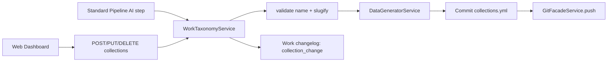

# Implementation Plan: Collections

**Feature ID**: `collections`
**Spec**: `./spec.md`
**Status**: `Done` (Retrospective)
**Last updated**: 2026-05-01

---

## 1. Architecture



## 2. Tech Choices

| Concern            | Choice                                     | Rationale                              |
| ------------------ | ------------------------------------------ | -------------------------------------- |
| Storage            | YAML in the data repo                      | Principle III                          |
| Slug generation    | `slugifyText()` from shared utils          | Consistent with categories/tags        |
| Mutation atomicity | Single git commit per CRUD operation       | Simple recovery model                  |
| AI integration     | Standard Pipeline categorization step      | Keeps generation logic in the plugin   |
| Toggle separation  | Two independent flags (website / pipeline) | Lets users curate manually with AI off |

## 3. Data Model

No core schema changes. The data lives in `collections.yml`:

```yaml
- id: editors-picks
  name: Editor's Picks
  description: Hand-picked favorites by the editorial team
  priority: 1
- id: best-for-beginners
  name: Best for Beginners
```

Items reference by slug id:

```yaml
# data/<item-slug>/item.yml
collection: editors-picks
```

## 4. API Surface

| Method   | Endpoint                                   | Description            |
| -------- | ------------------------------------------ | ---------------------- |
| `GET`    | `/api/works/:id/categories-tags`           | List taxonomy (3 dims) |
| `POST`   | `/api/works/:id/collections`               | Create                 |
| `PUT`    | `/api/works/:id/collections/:collectionId` | Update                 |
| `DELETE` | `/api/works/:id/collections/:collectionId` | Delete + cleanup       |

## 5. Plugin Surface

- Standard Pipeline `categorization` step assigns collections during
  generation when `generate_collections: true`.
- No new plugin capability — runs inside the existing pipeline.

## 6. Web / CLI

- Web: **Items → Collections** tab with create/edit/delete UI.
- Website-side rendering controlled by `collections_enabled` in website
  settings.
- CLI: not directly exposed; piggybacks on work commands.

## 7. Background Jobs

None — collection mutations are inline.

## 8. Security & Permissions

- Read: viewer role.
- Write: editor role.
- Both checked via `WorkOwnershipService`.

## 9. Observability

- Activity log: `collection_change` entries with action (`added` /
  `updated` / `removed`) and collection name.
- Surfaces in the [Work Changelog](../work-changelog/spec.md).

## 10. Risks & Mitigations

| Risk                                  | Mitigation                                               |
| ------------------------------------- | -------------------------------------------------------- |
| Stale references after delete         | Service clears `collection` field on all affected items  |
| AI assigns to non-existent collection | Pipeline only assigns collections it has just defined    |
| Name collision via concurrent creates | Validation reads then writes within a single git session |

## 11. Constitution Reconciliation

See `spec.md` §9.

## 12. References

- Spec: `./spec.md`
- Implementation:
    - `packages/agent/src/services/work-taxonomy.service.ts`
    - `packages/plugins/standard-pipeline/src/steps/categories-tags-processing.step.ts`
