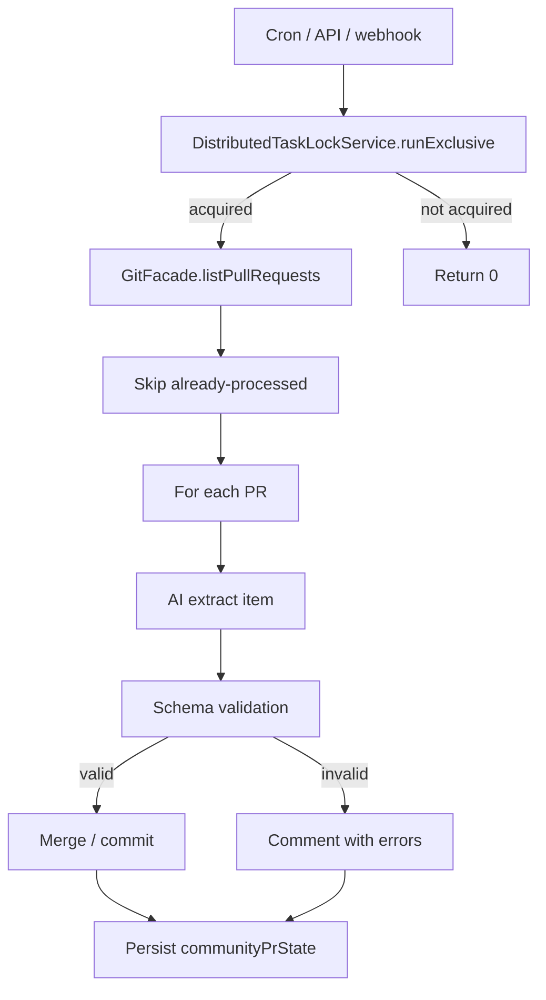

# Implementation Plan: Community PR Processing

**Feature ID**: `community-pr-processing`
**Spec**: `./spec.md`
**Status**: `Done` (Retrospective)
**Last updated**: 2026-05-01

---

## 1. Architecture

## 2. Tech Choices

| Concern           | Choice                                | Rationale                            |
| ----------------- | ------------------------------------- | ------------------------------------ |
| Mutual exclusion  | `DistributedTaskLockService`          | Principle IV; no owning DB row       |
| GitHub access     | `GitFacadeService`                    | Principle II                         |
| AI extraction     | `AiFacadeService` with structured out | Principle II                         |
| State persistence | jsonb column on `directories`         | Simple, atomic per-directory updates |

## 3. Data Model

- New nullable jsonb column `communityPrState` on `directories`:
  `{processedPrNumbers, processedPrs, totalItemsAdded, …}`.
- Migration: additive, default `null`.

## 4. API Surface

| Method | Endpoint                                    | Description                     |
| ------ | ------------------------------------------- | ------------------------------- |
| `POST` | `/api/directories/:id/community-pr/process` | Trigger processing now (manual) |

## 5. Plugin / Web / CLI

- Plugin: uses existing AI + git provider plugins; no new plugins.
- Web: a "Process community PRs" button on the directory detail page.
- CLI: command wrapping the API endpoint.

## 6. Background Jobs

A Trigger.dev cron task fans out per-directory processing to per-directory
runs (each acquiring its own lock).

## 7. Security & Permissions

- Manual trigger requires directory edit rights.
- Cron runs server-side with elevated DB access; uses the directory
  owner's GitHub token from the plugin-settings store.

## 8. Observability

- Activity log: action `community_pr_processed` with status and counts.
- Notification on first successful merge per PR.

## 9. Risks & Mitigations

| Risk                          | Mitigation                                           |
| ----------------------------- | ---------------------------------------------------- |
| Duplicate processing          | Per-directory lock                                   |
| State loss on mid-batch crash | Persist `communityPrState` per processed PR          |
| Bad AI extraction merges junk | Schema validation + comment-on-failure path          |
| GitHub rate limit             | Catch + retry on next cycle; state already persisted |

## 10. Constitution Reconciliation

See `spec.md` §9.

## 11. References

- Spec: `./spec.md`
- Implementation:
  `packages/agent/src/community-pr/community-pr-processor.service.ts`
- Lock service:
  `packages/agent/src/cache/distributed-task-lock.service.ts`
