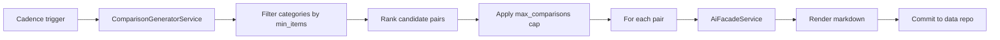

# Implementation Plan: A vs B Comparisons

**Feature ID**: `comparisons`
**Spec**: `./spec.md`
**Status**: `Done` (Retrospective)
**Last updated**: 2026-05-01

---

## 1. Architecture

## 2. Tech Choices

| Concern      | Choice                                 | Rationale                                               |
| ------------ | -------------------------------------- | ------------------------------------------------------- |
| AI access    | `AiFacadeService` (via plugin)         | Principle II                                            |
| Pair ranking | Score = category-weight × item-quality | Stable, explainable; user can tune via `custom_prompt`  |
| Storage      | Markdown files in data repo            | Principle III                                           |
| Schedule     | Independent cadence (or inherit)       | Comparison cost may dominate; per-feature cadence helps |

## 3. Data Model

No core schema changes — comparisons live as files in the data repo.
Plugin settings persist via the existing plugin-settings store.

## 4. API Surface

No public API. Comparisons are managed through the plugin settings UI.

## 5. Plugin Surface

The `comparison-generator` plugin under `packages/plugins/comparison-generator/`.

## 6. Web / CLI

- Web: comparison configuration form on work settings (rendered from
  the plugin's JSON Schema with `form-schema-provider` extensions).
- CLI: not exposed.

## 7. Background Jobs

When `cadence_override` is set, comparison generation runs as a Trigger.dev
fan-out task; otherwise it piggybacks on the work's main generation.

## 8. Security & Permissions

Comparison settings are scoped per work; only work editors can
modify them. AI calls use the resolved AI provider's credentials.

## 9. Observability

Activity-log action `work_comparisons_generated` with counts.

## 10. Risks & Mitigations

| Risk                                      | Mitigation                                        |
| ----------------------------------------- | ------------------------------------------------- |
| Cost runaway via large categories         | `max_comparisons` cap; default 50                 |
| AI returns malformed markdown             | Schema validation + retry budget                  |
| Drift between item version and comparison | Comparison files include the source item versions |

## 11. Constitution Reconciliation

See `spec.md` §9.

## 12. References

- Spec: `./spec.md`
- Plugin: `packages/plugins/comparison-generator/`
- Agent service: `packages/agent/src/comparison-generator/`
