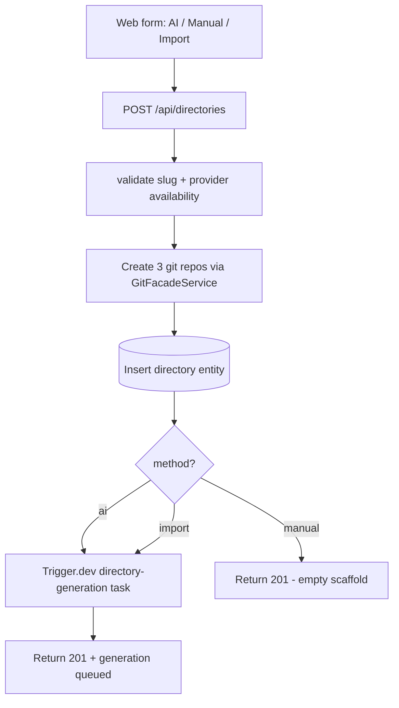

# Implementation Plan: Creating a Directory

**Feature ID**: `creating-a-directory`
**Spec**: `./spec.md`
**Status**: `Done` (Retrospective)
**Last updated**: 2026-05-01

---

## 1. Architecture

## 2. Tech Choices

| Concern             | Choice                                                  | Rationale                  |
| ------------------- | ------------------------------------------------------- | -------------------------- |
| Repo provisioning   | `GitFacadeService.createRepository` × 3                 | Principle II               |
| Atomicity           | DB transaction + best-effort rollback if any repo fails | Avoid orphan rows          |
| Generation dispatch | Trigger.dev `directory-generation` task                 | Principle IV               |
| Slug uniqueness     | Per-user case-insensitive lookup                        | Matches GitHub repo naming |
| Form schema         | Plugin `form-schema-provider` capability                | Pipelines own their own UI |

## 3. Data Model

- `directories` entity (existing) with all the fields the three flows need:
  name, slug, description, owner, gitProvider, deployProvider, pipeline,
  aiProvider, searchProvider, screenshotProvider, contentExtractor,
  initialPrompt, expansionFactor, generateStatus, etc.
- No new tables. Each new field added over time ships as an additive
  migration.

## 4. API Surface

| Method | Endpoint                          | Description          |
| ------ | --------------------------------- | -------------------- |
| `POST` | `/api/directories`                | Create (AI / Manual) |
| `POST` | `/api/directories/import/preview` | Import dry-run       |
| `POST` | `/api/directories/import`         | Import confirmation  |

## 5. Plugin / Web / CLI

- Plugins: form-schema-provider lets pipelines contribute fields.
- Web: separate steps under `apps/web/src/app/[locale]/directories/new/`
  for each method.
- CLI: `ever-works directory create` command wraps the API.

## 6. Background Jobs

- `directory-generation` Trigger.dev task — dispatched on AI / Awesome
  Import.
- `directory-import-awesome-normalise` — fan-out to normalise items after
  Awesome import.

## 7. Security & Permissions

- Authenticated user only.
- Repo creation uses the user's git provider plugin credentials.
- Admin-enforced pipeline lock checked server-side too (defence in depth).

## 8. Observability

- Activity log: `directory_created` with method.
- Sentry breadcrumbs for each step (validate / repos / dispatch).

## 9. Risks & Mitigations

| Risk                                    | Mitigation                                                    |
| --------------------------------------- | ------------------------------------------------------------- |
| Repo create fails after DB row inserted | Best-effort rollback; surfaced as a clear error               |
| User selects unavailable plugin         | Server-side validation in addition to UI grey-out             |
| Pipeline form fields drift from plugin  | Plugin owns the schema; form re-fetches when pipeline changes |

## 10. Constitution Reconciliation

See `spec.md` §9.

## 11. References

- Spec: `./spec.md`
- Implementation:
    - `apps/api/src/directories/directories.controller.ts`
    - `apps/web/src/app/[locale]/directories/new/`
    - `packages/agent/src/services/directory-generation.service.ts`
