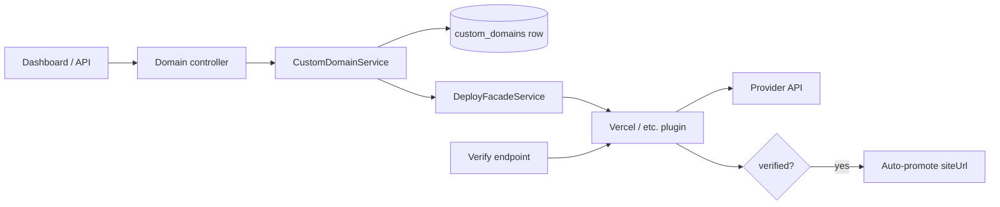

# Implementation Plan: Custom Domains

**Feature ID**: `custom-domains`
**Spec**: `./spec.md`
**Status**: `Done` (Retrospective)
**Last updated**: 2026-05-01

---

## 1. Architecture



## 2. Tech Choices

| Concern         | Choice                            | Rationale                                     |
| --------------- | --------------------------------- | --------------------------------------------- |
| Source of truth | DB (`custom_domains` table)       | Survives provider changes                     |
| Provider sync   | One-way DB → provider             | Idempotent; conflict handling at the boundary |
| Verification    | Provider-driven, platform polls   | Provider knows DNS state                      |
| Auto-promote    | Triggered on verification success | UX — no extra step for users                  |

## 3. Data Model

```ts
@Entity('custom_domains')
export class CustomDomain {
	@PrimaryGeneratedColumn('uuid') id: string;
	@Column() workId: string;
	@Column() domain: string;
	@Column({ default: false }) verified: boolean;
	@Column({ default: 'production' }) environment: string;
	@Column() provider: string; // plugin id
	@CreateDateColumn() createdAt: Date;
	@UpdateDateColumn() updatedAt: Date;
}
```

Migration: additive, with composite index `(workId, domain)`.

## 4. API Surface

| Method   | Endpoint                                             | Description          |
| -------- | ---------------------------------------------------- | -------------------- |
| `GET`    | `/api/deploy/works/:id/domains`                | List domains         |
| `POST`   | `/api/deploy/works/:id/domains`                | Add domain           |
| `DELETE` | `/api/deploy/works/:id/domains/:domain`        | Remove domain        |
| `POST`   | `/api/deploy/works/:id/domains/:domain/verify` | Trigger verification |

## 5. Plugin Surface

Deploy provider plugins implement:

```ts
interface IDeployCapability {
	addDomain(workId, domain, settings): Promise<DnsRecords>;
	removeDomain(workId, domain, settings): Promise<void>;
	verifyDomain(workId, domain, settings): Promise<{ verified: boolean; details? }>;
}
```

## 6. Web / CLI

- Web: work **Settings → Domains** with add / verify / remove
  controls and per-row DNS instructions.
- CLI: `ever-works work domain add/verify/rm` commands.

## 7. Background Jobs

None today. (Question raised in `spec.md` §8 about scheduled
re-verification.)

## 8. Security & Permissions

- Edit permission required for all mutations.
- Read permission for listing.

## 9. Observability

Activity log entries: `domain_added`, `domain_verified`, `domain_removed`
with `domain` and `provider` fields.

## 10. Risks & Mitigations

| Risk                                      | Mitigation                                              |
| ----------------------------------------- | ------------------------------------------------------- |
| Provider rejects domain (already-claimed) | Surface error; roll back DB write                       |
| DNS not configured at verify time         | `verified: false` returned; user can retry              |
| Auto-promote breaks an in-flight URL      | Promote only when current URL is the provider subdomain |

## 11. Constitution Reconciliation

See `spec.md` §9.

## 12. References

- Spec: `./spec.md`
- Implementation:
    - `apps/api/src/plugins-capabilities/deploy/deploy.service.ts`
    - `packages/plugins/vercel/`
